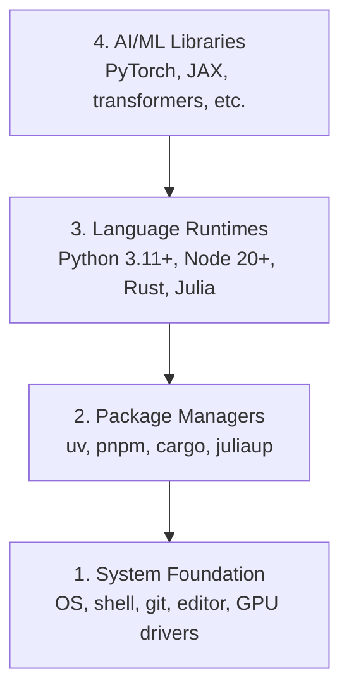

# 開発環境

> ツールは思考を形作る。一度だけ、正しくセットアップしよう。


## 学習目標

- Python 3.11+、Node.js 20+、Rustのツールチェーンをゼロから構築する
- 再現性のあるビルドのための仮想環境とパッケージマネージャーを設定する
- CUDA/MPSでGPUアクセスを確認し、テスト用テンソル演算を実行する
- 4層スタック（システム、パッケージ、ランタイム、AIライブラリ）を理解する

## 問題

これから200以上のレッスンでPython、TypeScript、Rust、Juliaを使ってAIエンジニアリングを学ぼうとしている。環境が壊れていると、学習ではなくツールとの戦いになる。

ほとんどの人は環境構築をスキップする。そして、インポートエラー、バージョンの競合、CUDAドライバーの不足を何時間もかけてデバッグすることになる。ここでは一度だけ、正しくやる。

## コンセプト

AIエンジニアリング環境には4つの層がある。



インストールはボトムアップで行う。各層は下の層に依存している。

## 構築

### Step 1: システム基盤

システムを確認し、基本ツールをインストールする。

```bash
# macOS
xcode-select --install
brew install git curl wget

# Ubuntu/Debian
sudo apt update && sudo apt install -y build-essential git curl wget

# Windows (use WSL2)
wsl --install -d Ubuntu-24.04
```

### Step 2: uvでPythonを導入

`uv`を使う。pipより10〜100倍高速で、仮想環境を自動で管理してくれる。

```bash
curl -LsSf https://astral.sh/uv/install.sh | sh

uv python install 3.12

uv venv
source .venv/bin/activate  # or .venv\Scripts\activate on Windows

uv pip install numpy matplotlib jupyter
```

確認:

```python
import sys
print(f"Python {sys.version}")

import numpy as np
print(f"NumPy {np.__version__}")
a = np.array([1, 2, 3])
print(f"Vector: {a}, dot product with itself: {np.dot(a, a)}")
```

### Step 3: pnpmでNode.jsを導入

TypeScriptのレッスン（エージェント、MCPサーバー、Webアプリ）用。

```bash
curl -fsSL https://fnm.vercel.app/install | bash
fnm install 22
fnm use 22

npm install -g pnpm

node -e "console.log('Node', process.version)"
```

### Step 4: Rust

パフォーマンス重視のレッスン（推論、システム）用。

```bash
curl --proto '=https' --tlsv1.2 -sSf https://sh.rustup.rs | sh

rustc --version
cargo --version
```

### Step 5: Julia（オプション）

Juliaが活きる数学的なレッスン用。

```bash
curl -fsSL https://install.julialang.org | sh

julia -e 'println("Julia ", VERSION)'
```

### Step 6: GPUセットアップ（GPUがある場合）

```bash
# NVIDIA
nvidia-smi

# Install PyTorch with CUDA
uv pip install torch torchvision torchaudio --index-url https://download.pytorch.org/whl/cu124
```

```python
import torch
print(f"CUDA available: {torch.cuda.is_available()}")
if torch.cuda.is_available():
    print(f"GPU: {torch.cuda.get_device_name(0)}")
```

GPUがなくても問題ない。ほとんどのレッスンはCPUで動作する。トレーニング重視のレッスンはGoogle ColabやクラウドGPUを利用する。

### Step 7: すべての確認

確認スクリプトを実行:

```bash
python phases/00-setup-and-tooling/01-dev-environment/code/verify.py
```

## 活用する

環境はこのコースのすべてのレッスンで使えるようになった。使用場所の対応表:

| 言語 | 使用フェーズ | パッケージマネージャー |
|----------|---------|-----------------|
| Python | フェーズ1〜12（ML、DL、NLP、Vision、Audio、LLM） | uv |
| TypeScript | フェーズ13〜17（ツール、エージェント、スウォーム、インフラ） | pnpm |
| Rust | フェーズ12、15〜17（パフォーマンス重視のシステム） | cargo |
| Julia | フェーズ1（数学的基礎） | Pkg |

## 提出する

このレッスンでは、誰でも自分のセットアップを確認できる検証スクリプトを作成する。

環境問題をAIアシスタントが診断するためのプロンプトは `outputs/prompt-env-check.md` を参照。

## 演習

1. 確認スクリプトを実行し、失敗があれば修正する
2. このコース用のPython仮想環境を作成し、PyTorchをインストールする
3. 4つの言語すべてで「hello world」を書き、それぞれ実行する
