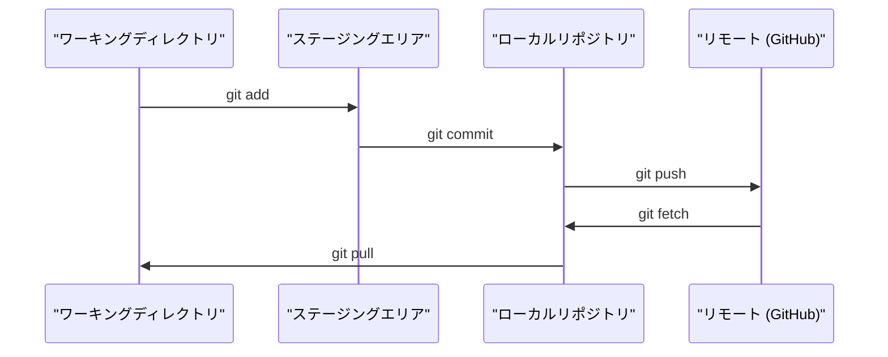

# Git & コラボレーション

> バージョン管理は任意ではない。ここで作るすべての実験、モデル、レッスンはトラッキングされる。


## 学習目標

- gitのIDを設定し、add・commit・pushの日常ワークフローを使いこなす
- mainを壊さずに独立した実験ができるブランチを作成・マージする
- モデルのチェックポイントや大きなバイナリファイルを除外する `.gitignore` を書く
- `git log` でコミット履歴をたどり、プロジェクトの進化を理解する

## 問題

これから20フェーズにわたって何百ものコードファイルを書くことになる。バージョン管理なしでは、作業を失い、取り消せない変更をしてしまい、他の人と協力する手段がなくなる。

ツールはgit。コードの置き場所はGitHub。このレッスンでは、このコースに必要なことだけを扱う。

## コンセプト



覚えておくべきことは3つ:
1. こまめに保存する（`git commit`）
2. リモートにプッシュする（`git push`）
3. 実験はブランチで行う（`git checkout -b experiment`）

## 構築

### Step 1: gitの設定

```bash
git config --global user.name "Your Name"
git config --global user.email "you@example.com"
```

### Step 2: 日常のワークフロー

```bash
git status
git add file.py
git commit -m "Add perceptron implementation"
git push origin main
```

### Step 3: 実験用のブランチ

```bash
git checkout -b experiment/new-optimizer

# ... make changes, commit ...

git checkout main
git merge experiment/new-optimizer
```

### Step 4: このコースのリポジトリで作業する

```bash
git clone https://github.com/rohitg00/ai-engineering-from-scratch.git
cd ai-engineering-from-scratch

git checkout -b my-progress
# work through lessons, commit your code
git push origin my-progress
```

## 活用する

このコースに必要なコマンドはこれだけ:

| コマンド | タイミング |
|---------|------|
| `git clone` | コースのリポジトリを取得する |
| `git add` + `git commit` | 作業を保存する |
| `git push` | GitHubにバックアップする |
| `git checkout -b` | mainを壊さずに試す |
| `git log --oneline` | これまでの作業を確認する |

以上で終わり。このコースではrebase、cherry-pick、サブモジュールは不要。

## 演習

1. このリポジトリをクローンし、`my-progress` というブランチを作成し、ファイルを作成してコミットし、プッシュする
2. モデルのチェックポイントファイル（`.pt`、`.pth`、`.safetensors`）を除外する `.gitignore` を作成する
3. `git log --oneline` でこのリポジトリのコミット履歴を見て、レッスンがどのように追加されたかを読む

## キーワード

| 用語 | よく言われること | 実際の意味 |
|------|----------------|----------------------|
| コミット | 「保存」 | ある時点のプロジェクト全体のスナップショット |
| ブランチ | 「コピー」 | 作業の進行に合わせて移動するコミットへのポインター |
| マージ | 「コードの結合」 | あるブランチの変更を別のブランチに適用すること |
| リモート | 「クラウド」 | どこか別の場所（GitHub、GitLab）にホストされたリポジトリのコピー |
