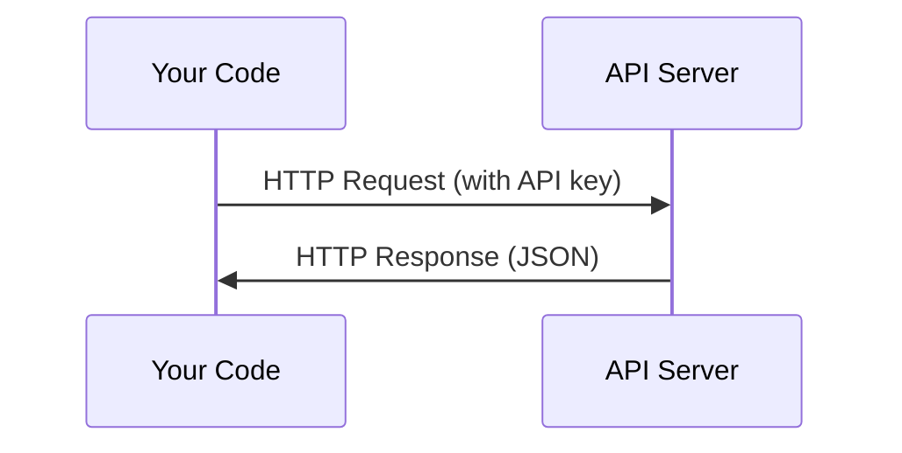

# APIとキー

> すべてのAI APIは同じように動作する。リクエストを送信してレスポンスを受け取る。詳細は変わっても、パターンは変わらない。


## 学習目標

- 環境変数と `.env` ファイルを使ってAPIキーを安全に保管する
- Anthropic Python SDKと生のHTTPの両方でLLM APIを呼び出す
- デバッグのためにSDKベースと生のHTTPリクエスト・レスポンス形式を比較する
- 認証やレート制限を含む一般的なAPIエラーを特定して処理する

## 問題

フェーズ11からLLM API（Anthropic、OpenAI、Google）を呼び出す。フェーズ13〜16ではこれらのAPIをループで使うエージェントを構築する。APIキーの仕組み、安全な保管方法、最初のAPI呼び出し方を知る必要がある。

## コンセプト



すべてのAPI呼び出しには以下が含まれる:
1. エンドポイント（URL）
2. APIキー（認証）
3. リクエストボディ（要求内容）
4. レスポンスボディ（返ってくる内容）

## 構築

### Step 1: APIキーを安全に保管する

APIキーをコードに直接書いてはいけない。環境変数を使用する。

```bash
export ANTHROPIC_API_KEY="sk-ant-..."
export OPENAI_API_KEY="sk-..."
```

または `.env` ファイルを使用（`.gitignore` に追加すること）:

```
ANTHROPIC_API_KEY=sk-ant-...
OPENAI_API_KEY=sk-...
```

### Step 2: 最初のAPI呼び出し（Python）

```python
import anthropic

client = anthropic.Anthropic()

response = client.messages.create(
    model="claude-sonnet-4-20250514",
    max_tokens=256,
    messages=[{"role": "user", "content": "What is a neural network in one sentence?"}]
)

print(response.content[0].text)
```

### Step 3: 最初のAPI呼び出し（TypeScript）

```typescript
import Anthropic from "@anthropic-ai/sdk";

const client = new Anthropic();

const response = await client.messages.create({
  model: "claude-sonnet-4-20250514",
  max_tokens: 256,
  messages: [{ role: "user", content: "What is a neural network in one sentence?" }],
});

console.log(response.content[0].text);
```

### Step 4: 生のHTTP（SDKなし）

```python
import os
import urllib.request
import json

url = "https://api.anthropic.com/v1/messages"
headers = {
    "Content-Type": "application/json",
    "x-api-key": os.environ["ANTHROPIC_API_KEY"],
    "anthropic-version": "2023-06-01",
}
body = json.dumps({
    "model": "claude-sonnet-4-20250514",
    "max_tokens": 256,
    "messages": [{"role": "user", "content": "What is a neural network in one sentence?"}],
}).encode()

req = urllib.request.Request(url, data=body, headers=headers, method="POST")
with urllib.request.urlopen(req) as resp:
    result = json.loads(resp.read())
    print(result["content"][0]["text"])
```

これがSDKが内部で行っていることだ。生のHTTP呼び出しを理解することでデバッグに役立つ。

## 活用する

このコースで必要なAPI:

| API | 必要なタイミング | 無料枠 |
|-----|-----------------|-----------|
| Anthropic（Claude） | フェーズ11〜16（エージェント、ツール） | サインアップ時$5クレジット |
| OpenAI | フェーズ11（比較） | サインアップ時$5クレジット |
| Hugging Face | フェーズ4〜10（モデル、データセット） | 無料 |

今すべてを用意する必要はない。レッスンで必要になった時に設定する。

## 提出する

このレッスンで生成するもの:
- `outputs/prompt-api-troubleshooter.md` - 一般的なAPIエラーを診断する

## 演習

1. AnthropicのAPIキーを取得して最初のAPI呼び出しを行う
2. 生のHTTPバージョンを試し、レスポンス形式をSDKバージョンと比較する
3. 意図的に間違ったAPIキーを使用してエラーメッセージを読む

## キーワード

| 用語 | よく言われること | 実際の意味 |
|------|----------------|----------------------|
| APIキー | 「APIのパスワード」 | アカウントを識別してリクエストを承認する一意の文字列 |
| レート制限 | 「スロットリングされている」 | 不正使用防止と公平な利用確保のための、1分/時間あたりの最大リクエスト数 |
| トークン | 「単語」（APIの文脈で） | 課金単位。入力と出力のトークンは別々にカウントされて課金される |
| ストリーミング | 「リアルタイムレスポンス」 | 完全なレスポンスを待たずに単語ごとに受け取ること |
