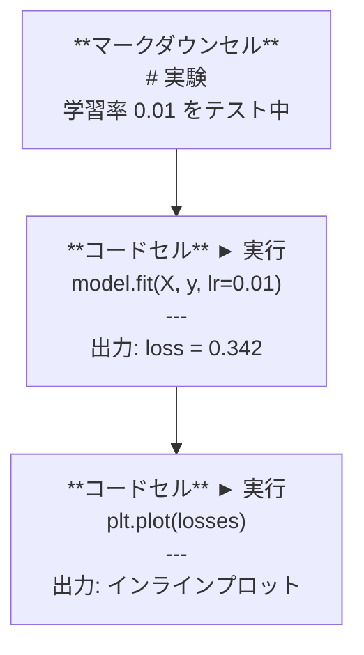
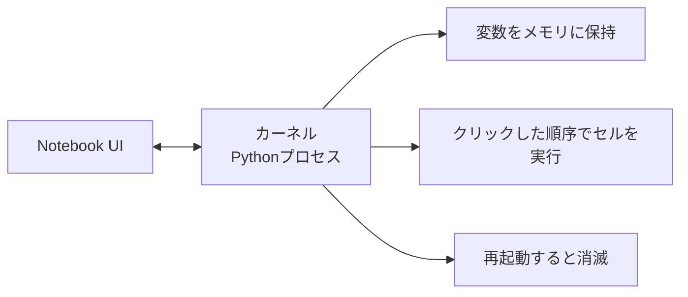

# Jupyter Notebooks

> ノートブックはAIエンジニアリングの実験台だ。ここでプロトタイプを作り、うまくいったものを本番に移す。


## 学習目標

- JupyterLab、Jupyter Notebook、またはJupyter拡張機能付きのVS Codeをインストールして起動する
- マジックコマンド（`%timeit`、`%%time`、`%matplotlib inline`）を使ってベンチマークとインライン可視化を行う
- ノートブックとスクリプトの使い分けを理解し、「ノートブックで探索、スクリプトで出荷」のワークフローを実践する
- よくあるノートブックの落とし穴（順序外の実行、隠れた状態、メモリリーク）を特定して回避する

## 問題

AIの論文、チュートリアル、Kaggle競技のすべてでJupyterノートブックが使われている。コードを部分的に実行し、出力をインラインで確認し、コードと説明を混在させ、素早く反復できる。ノートブックなしでAIを学ぼうとするのは、白紙なしで数学の宿題をするようなものだ。

しかし、ノートブックには本物の落とし穴がある。人々はすべてのことにノートブックを使うが、ノートブックが苦手なこともある。ノートブックをいつ使い、スクリプトをいつ使うかを知ることで、後のデバッグの悪夢から救われる。

## コンセプト

ノートブックはセルのリストだ。各セルはコードかテキストかのどちらかだ。



カーネルはバックグラウンドで実行されるPythonプロセスだ。セルを実行すると、コードがカーネルに送られ、カーネルがそれを実行して結果を返す。すべてのセルは同じカーネルを共有するため、変数はセル間で保持される。



「クリックした順序で実行される」部分は、強力な機能であり、同時に危険な落とし穴でもある。

## 構築

### Step 1: インターフェースを選ぶ

3つの選択肢、1つのフォーマット:

| インターフェース | インストール | 最適なケース |
|-----------|---------|----------|
| JupyterLab | `pip install jupyterlab` 後 `jupyter lab` | フル IDE 体験、複数タブ、ファイルブラウザ、ターミナル |
| Jupyter Notebook | `pip install notebook` 後 `jupyter notebook` | シンプル、軽量、一度に1つのノートブック |
| VS Code | 「Jupyter」拡張機能をインストール | すでにエディターの中、gitとの統合、デバッグ |

3つすべて同じ `.ipynb` ファイルを読み書きする。好きなものを選んで。AIの仕事ではJupyterLabが最も一般的。

```bash
pip install jupyterlab
jupyter lab
```

### Step 2: 重要なキーボードショートカット

2つのモードで操作する。`Escape` でコマンドモード（左側の青いバー）、`Enter` で編集モード（緑のバー）。

**コマンドモード（最もよく使う）:**

| キー | アクション |
|-----|--------|
| `Shift+Enter` | セルを実行して次に移動 |
| `A` | 上にセルを挿入 |
| `B` | 下にセルを挿入 |
| `DD` | セルを削除 |
| `M` | マークダウンに変換 |
| `Y` | コードに変換 |
| `Z` | セル操作を元に戻す |
| `Ctrl+Shift+H` | すべてのショートカットを表示 |

**編集モード:**

| キー | アクション |
|-----|--------|
| `Tab` | オートコンプリート |
| `Shift+Tab` | 関数のシグネチャを表示 |
| `Ctrl+/` | コメントの切り替え |

`Shift+Enter` は一日に何千回も使うものだ。これを最初に覚えよう。

### Step 3: セルの種類

**コードセル**はPythonを実行して出力を表示する:

```python
import numpy as np
data = np.random.randn(1000)
data.mean(), data.std()
```

出力: `(0.0032, 0.9987)`

**マークダウンセル**は書式付きテキストをレンダリングする。何をしているか、なぜしているかを文書化するのに使う。見出し、太字、斜体、LaTeX数式（`$E = mc^2$`）、表、画像をサポートする。

### Step 4: マジックコマンド

これはPythonではない。`%`（行マジック）または `%%`（セルマジック）で始まるJupyter固有のコマンドだ。

**コードの時間計測:**

```python
%timeit np.random.randn(10000)
```

出力: `45.2 us +/- 1.3 us per loop`

```python
%%time
model.fit(X_train, y_train, epochs=10)
```

出力: `Wall time: 2.34 s`

`%timeit` はコードを何度も実行して平均を出す。`%%time` は1回だけ実行する。マイクロベンチマークには `%timeit`、トレーニング実行には `%%time` を使う。

**インラインプロットを有効にする:**

```python
%matplotlib inline
```

以降、`plt.plot()` や `plt.show()` はすべてノートブック内で直接レンダリングされる。

**ノートブックを離れずにパッケージをインストールする:**

```python
!pip install scikit-learn
```

`!` プレフィックスは任意のシェルコマンドを実行する。

**環境変数を確認する:**

```python
%env CUDA_VISIBLE_DEVICES
```

### Step 5: リッチ出力をインラインで表示する

ノートブックはセルの最後の式を自動表示する。ただし制御もできる:

```python
import pandas as pd

df = pd.DataFrame({
    "model": ["Linear", "Random Forest", "Neural Net"],
    "accuracy": [0.72, 0.89, 0.94],
    "training_time": [0.1, 2.3, 45.6]
})
df
```

テキストダンプではなく、書式付きHTMLテーブルがレンダリングされる。プロットも同様:

```python
import matplotlib.pyplot as plt

plt.figure(figsize=(8, 4))
plt.plot([1, 2, 3, 4], [1, 4, 2, 3])
plt.title("Inline Plot")
plt.show()
```

プロットはセルのすぐ下に表示される。これがAIの仕事でノートブックが主流な理由だ。データ、プロット、コードを一緒に見ることができる。

画像の場合:

```python
from IPython.display import Image, display
display(Image(filename="architecture.png"))
```

### Step 6: Google Colab

ColabはクラウドにあるJupyterノートブックで無料だ。GPU、インストール済みライブラリ、Googleドライブ統合が提供される。セットアップ不要。

1. [colab.research.google.com](https://colab.research.google.com) にアクセス
2. このコースの任意の `.ipynb` ファイルをアップロード
3. ランタイム > ランタイムのタイプを変更 > T4 GPU（無料）

ローカルJupyterとColabの違い:
- ファイルはセッション間で保持されない（ドライブに保存するかダウンロードする）
- インストール済み: numpy、pandas、matplotlib、torch、tensorflow、sklearn
- ファイルのアップロード/ダウンロードには `from google.colab import files`
- 永続ストレージには `from google.colab import drive; drive.mount('/content/drive')`
- セッションは90分の非アクティブ後にタイムアウトする（無料枠）

## 活用する

### ノートブック対スクリプト: どちらを使うか

| ノートブックを使う | スクリプトを使う |
|-------------------|-----------------|
| データセットの探索 | トレーニングパイプライン |
| モデルのプロトタイプ | 再利用可能なユーティリティ |
| 結果の可視化 | `if __name__` のあるもの |
| 作業の説明 | スケジュール実行するコード |
| 簡単な実験 | 本番コード |
| コース演習 | パッケージとライブラリ |

ルール: **ノートブックで探索し、スクリプトで出荷する**。

AIにおける一般的なワークフロー:
1. ノートブックでデータを探索する
2. ノートブックでモデルをプロトタイプ化する
3. うまくいったら `.py` ファイルにコードを移す
4. `.py` ファイルをノートブックにインポートして更なる実験を行う

### よくある落とし穴

**順序外の実行。** セル5を実行し、次にセル2、次にセル7を実行する。あなたのマシンではノートブックが動作するが、誰かが上から下に実行すると壊れる。対策: 共有前に「カーネル > すべてを再起動して実行」を行う。

**隠れた状態。** セルを削除したが、そのセルが作った変数はまだメモリに残っている。ノートブックはきれいに見えるが、幽霊セルに依存している。対策: 定期的にカーネルを再起動する。

**メモリリーク。** 4GBのデータセットをロードし、モデルをトレーニングし、別のデータセットをロードする。何も解放されない。対策: `del variable_name` と `gc.collect()`、またはカーネルを再起動する。

## 提出する

このレッスンで生成するもの:
- `outputs/prompt-notebook-helper.md` ノートブックの問題をデバッグするプロンプト

## 演習

1. JupyterLabを開き、ノートブックを作成し、`%timeit` を使ってリスト内包表記と、100,000個の乱数配列生成のnumpyを比較する
2. マークダウンセルとコードセルの両方を持つノートブックを作成し、CSVを読み込み、データフレームを表示し、チャートをプロットする。次に「カーネル > すべてを再起動して実行」を実行して上から下まで動作することを確認する
3. `code/notebook_tips.py` のコードをColabノートブックに貼り付けて、無料のGPUで実行する

## キーワード

| 用語 | よく言われること | 実際の意味 |
|------|----------------|----------------------|
| カーネル | 「コードを実行するもの」 | セルを実行して変数をメモリに保持する別のPythonプロセス |
| セル | 「コードブロック」 | ノートブック内の独立して実行可能な単位。コードかマークダウン |
| マジックコマンド | 「Jupyterのトリック」 | ノートブック環境を制御する `%` または `%%` で始まる特殊コマンド |
| `.ipynb` | 「ノートブックファイル」 | セル、出力、メタデータを含むJSONファイル。IPython Notebookの略 |

## さらに読む

- 完全な機能については [JupyterLab Docs](https://jupyterlab.readthedocs.io/)
- Colab固有の制限と機能については [Google Colab FAQ](https://research.google.com/colaboratory/faq.html)
- パワーユーザー向けショートカットは [28 Jupyter Notebook Tips](https://www.dataquest.io/blog/jupyter-notebook-tips-tricks-shortcuts/)
