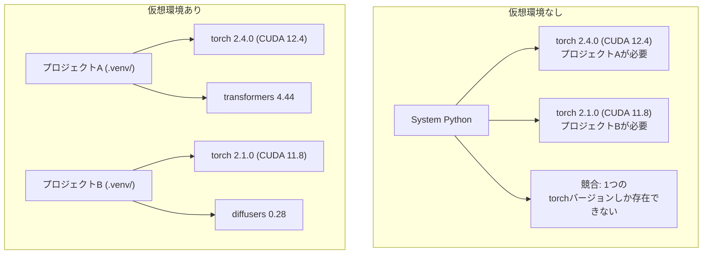

# Python環境

> 依存関係地獄は本物だ。仮想環境がその解決策だ。


## 学習目標

- `uv`、`venv`、`conda` を使って隔離された仮想環境を作成する
- オプションの依存グループを持つ `pyproject.toml` を書き、再現性のためのロックファイルを生成する
- よくある落とし穴（グローバルインストール、pip/condaの混在、CUDAバージョンの不一致）を診断して修正する
- 依存関係が競合するプロジェクトのためのフェーズごとの環境戦略を実装する

## 問題

ファインチューニングプロジェクトのためにPyTorch 2.4をインストールする。翌週、別のプロジェクトがCUDAビルドが固定されているためPyTorch 2.1を必要とする。グローバルにアップグレードすると、最初のプロジェクトが壊れる。ダウングレードすると、2番目が壊れる。

これが依存関係地獄だ。AI/MLの仕事では常に起きる。理由は:

- PyTorch、JAX、TensorFlowがそれぞれ独自のCUDAバインディングを同梱している
- モデルライブラリが特定のフレームワークバージョンを固定している
- グローバルな `pip install` はあったものを上書きする
- CUDA 11.8ビルドはCUDA 12.xドライバーでは動作しない（逆も同様）

解決策: すべてのプロジェクトが独自のパッケージを持つ隔離された環境を使う。

## コンセプト



## 構築

### オプション1: uv venv（推奨）

`uv` は最速のPythonパッケージマネージャーだ（pipより10〜100倍高速）。仮想環境、Pythonバージョン、依存関係の解決を1つのツールで処理する。

```bash
curl -LsSf https://astral.sh/uv/install.sh | sh

uv python install 3.12

cd your-project
uv venv
source .venv/bin/activate
```

パッケージをインストール:

```bash
uv pip install torch numpy
```

1ステップで `pyproject.toml` 付きのプロジェクトを作成:

```bash
uv init my-ai-project
cd my-ai-project
uv add torch numpy matplotlib
```

### オプション2: venv（組み込み）

`uv` をインストールできない場合、Pythonには `venv` が付属している:

```bash
python3 -m venv .venv
source .venv/bin/activate  # Linux/macOS
.venv\Scripts\activate     # Windows

pip install torch numpy
```

`uv` より遅いが、Pythonがインストールされていればどこでも動作する。

### オプション3: conda（必要な場合）

condaはCUDAツールキット、cuDNN、CライブラリなどのPython以外の依存関係を管理する。以下の場合に使う:

- システム全体にインストールせずに特定のCUDAツールキットバージョンが必要な場合
- システムパッケージをインストールできない共有クラスターを使用している場合
- ライブラリのインストール手順に「condaを使用」と書かれている場合

```bash
# minicondaをインストール（フルのAnacondaではない）
curl -LsSf https://repo.anaconda.com/miniconda/Miniconda3-latest-Linux-x86_64.sh -o miniconda.sh
bash miniconda.sh -b

conda create -n myproject python=3.12
conda activate myproject

conda install pytorch torchvision torchaudio pytorch-cuda=12.4 -c pytorch -c nvidia
```

1つのルール: 環境にcondaを使うなら、その環境内のすべてのパッケージにcondaを使う。conda環境に `pip install` を混在させると、デバッグが難しい依存関係の競合が発生する。

### このコース向け: フェーズごとの戦略

コース全体に1つの環境を作ることができる。しかしやめよう。異なるフェーズには異なる（時に競合する）依存関係が必要だ。

戦略:

```
ai-engineering-from-scratch/
├── .venv/                    <-- shared lightweight env for phases 0-3
├── phases/
│   ├── 04-neural-networks/
│   │   └── .venv/            <-- PyTorch env
│   ├── 05-cnns/
│   │   └── .venv/            <-- same PyTorch env (symlink or shared)
│   ├── 08-transformers/
│   │   └── .venv/            <-- might need different transformer versions
│   └── 11-llm-apis/
│       └── .venv/            <-- API SDKs, no torch needed
```

`code/env_setup.sh` のスクリプトでこのコースのベース環境を作成する。

## pyproject.tomlの基本

すべてのPythonプロジェクトには `pyproject.toml` があるべきだ。`setup.py`、`setup.cfg`、`requirements.txt` を1つのファイルに置き換える。

```toml
[project]
name = "ai-engineering-from-scratch"
version = "0.1.0"
requires-python = ">=3.11"
dependencies = [
    "numpy>=1.26",
    "matplotlib>=3.8",
    "jupyter>=1.0",
    "scikit-learn>=1.4",
]

[project.optional-dependencies]
torch = ["torch>=2.3", "torchvision>=0.18"]
llm = ["anthropic>=0.39", "openai>=1.50"]
```

インストール:

```bash
uv pip install -e ".[torch]"    # base + PyTorch
uv pip install -e ".[llm]"     # base + LLM SDKs
uv pip install -e ".[torch,llm]" # everything
```

## ロックファイル

ロックファイルはすべての依存関係（推移的なものも含む）を正確なバージョンに固定する。これにより再現性が保証される: ロックファイルからインストールした誰もが全く同じパッケージを取得する。

```bash
# uvはuv addを使う際にuv.lockを自動生成する
uv add numpy

# pip-toolsのアプローチ
uv pip compile pyproject.toml -o requirements.lock
uv pip install -r requirements.lock
```

ロックファイルをgitにコミットする。誰かがリポジトリをクローンしたとき、ロックファイルからインストールして同一バージョンを取得する。

## よくある間違い

### 1. グローバルにインストールする

```bash
pip install torch  # BAD: installs to system Python

source .venv/bin/activate
pip install torch  # GOOD: installs to virtual environment
```

パッケージがどこに行くか確認:

```bash
which python       # should show .venv/bin/python, not /usr/bin/python
which pip           # should show .venv/bin/pip
```

### 2. pipとcondaを混在させる

```bash
conda create -n myenv python=3.12
conda activate myenv
conda install pytorch -c pytorch
pip install some-other-package   # BAD: can break conda's dependency tracking
conda install some-other-package # GOOD: let conda manage everything
```

conda内でpipを使わなければならない場合（pip専用のパッケージがある場合）は、すべてのcondaパッケージを先にインストールし、その後pipパッケージをインストールする。

### 3. アクティブ化を忘れる

```bash
python train.py           # uses system Python, missing packages
source .venv/bin/activate
python train.py           # uses project Python, packages found
```

シェルのプロンプトに環境名が表示されるべき:

```
(.venv) $ python train.py
```

### 4. .venvをgitにコミットする

```bash
echo ".venv/" >> .gitignore
```

仮想環境は200MB〜2GBある。ローカルであり、マシン間でポータブルではない。代わりに `pyproject.toml` とロックファイルをコミットする。

### 5. CUDAバージョンの不一致

```bash
nvidia-smi                # shows driver CUDA version (e.g., 12.4)
python -c "import torch; print(torch.version.cuda)"  # shows PyTorch CUDA version

# These must be compatible.
# PyTorch CUDA version must be <= driver CUDA version.
```

## 活用する

セットアップスクリプトを実行してコース環境を作成:

```bash
bash phases/00-setup-and-tooling/06-python-environments/code/env_setup.sh
```

これにより、コア依存関係がインストールされ検証されたリポジトリルートに `.venv` が作成される。

## 演習

1. `env_setup.sh` を実行し、すべてのチェックが通ることを確認する
2. 2番目の仮想環境を作成し、別バージョンのnumpyをインストールして、2つの環境が隔離されていることを確認する
3. PyTorchとAnthropicSDKの両方を必要とするプロジェクトの `pyproject.toml` を書く
4. 仮想環境をアクティブ化せずにパッケージをグローバルにインストールし、どこに行くかを確認してから削除する

## キーワード

| 用語 | よく言われること | 実際の意味 |
|------|----------------|----------------------|
| 仮想環境 | 「venv」 | システムのPythonとは別に、Pythonインタープリターとパッケージを含む隔離されたディレクトリ |
| ロックファイル | 「ピン止めされた依存関係」 | すべてのパッケージとその正確なバージョンをリストし、マシン間で同一インストールを保証するファイル |
| pyproject.toml | 「新しいsetup.py」 | setup.py/setup.cfg/requirements.txtを置き換える標準Pythonプロジェクト設定ファイル |
| 推移的依存関係 | 「依存関係の依存関係」 | パッケージBがCに依存; AがBに依存するAをインストールすると、CはAの推移的依存関係になる |
| CUDAの不一致 | 「GPUが動いていない」 | PyTorchがGPUドライバーがサポートするCUDAとは異なるバージョン向けにコンパイルされた |
