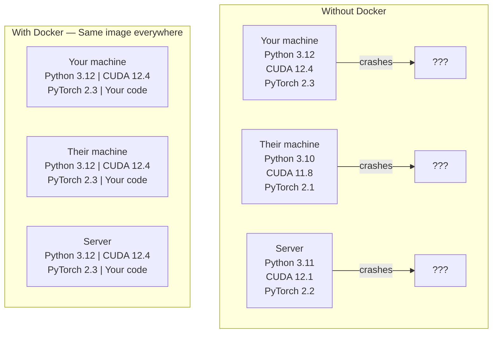

# AIのためのDocker

> コンテナーは「私のマシンでは動く」を過去のものにする。


## 学習目標

- DockerfileからCUDA、PyTorch、AIライブラリを含むGPU対応のDockerイメージをビルドする
- ホストディレクトリをボリュームとしてマウントし、コンテナーの再ビルドをまたいでモデル、データセット、コードを永続化する
- コンテナー内でGPUを公開するためのNVIDIA Container Toolkitを設定する
- Docker Composeを使用してマルチサービスのAIアプリケーション（推論サーバー + ベクターデータベース）を調整する

## 問題

PyTorch 2.3、CUDA 12.4、Python 3.12を使ってノートパソコンでモデルをトレーニングした。同僚はPyTorch 2.1、CUDA 11.8、Python 3.10を使っている。あなたのモデルは相手のマシンでクラッシュする。あなたのDockerfileなら両方で動作する。

AIプロジェクトは依存関係の悪夢だ。典型的なスタックにはPython、PyTorch、CUDAドライバー、cuDNN、システムレベルのCライブラリ、そして正確なコンパイラーバージョンが必要なflash-attnのような専門パッケージが含まれる。Dockerはこれらすべてを、あらゆる場所で同一に動作する単一イメージにパッケージ化する。

## コンセプト

Dockerはコード、ランタイム、ライブラリ、システムツールをコンテナーと呼ばれる隔離されたユニットにラップする。軽量な仮想マシンと考えてほしいが、ホストOSカーネルを共有するため、数分ではなく数秒で起動する。



### AIプロジェクトが特にDockerを必要とする理由

1. **GPUドライバーはデリケートだ。** CUDA 12.4のコードはCUDA 11.8では動作しない。DockerはNVIDIA Container Toolkitを通じてホストGPUドライバーを共有しながら、CUDAツールキットをコンテナー内に隔離する。

2. **モデルの重みは大きい。** 7Bパラメーターのモデルはfp16で14GBだ。コンテナーを再ビルドするたびに再ダウンロードしたくない。Dockerのボリュームでホストからモデルディレクトリをマウントできる。

3. **マルチサービスアーキテクチャが一般的だ。** 実際のAIアプリケーションは単なるPythonスクリプトではない。推論サーバー、RAG用のベクターデータベース、おそらくWebフロントエンドもある。Docker Composeでこれらをすべて1つのコマンドで調整できる。

### 主要な用語

| 用語 | 意味 |
|------|---------------|
| イメージ | 読み取り専用のテンプレート。レシピだ。Dockerfileからビルドされる。 |
| コンテナー | イメージの実行中のインスタンス。キッチンだ。 |
| Dockerfile | イメージをビルドするための手順。層ごとに。 |
| ボリューム | コンテナー再起動後も残る永続ストレージ。 |
| docker-compose | YAMLでマルチコンテナーアプリケーションを定義するツール。 |

### AIにおける一般的なコンテナーパターン

```
Dev Container
  フルツールキット。エディターサポート。Jupyter。デバッグツール。
  開発と実験中に使用。

Training Container
  ミニマル。トレーニングスクリプトと依存関係だけ。
  GPUクラスターで実行。エディターなし、Jupyterなし。

Inference Container
  サービング用に最適化。小さいイメージ。高速コールドスタート。
  本番環境のロードバランサーの後ろで実行。
```

## 構築

### Step 1: Dockerをインストールする

```bash
# macOS
brew install --cask docker
open /Applications/Docker.app

# Ubuntu
curl -fsSL https://get.docker.com | sh
sudo usermod -aG docker $USER
# Log out and back in for group change to take effect
```

確認:

```bash
docker --version
docker run hello-world
```

### Step 2: NVIDIA Container Toolkitをインストールする（NVIDIA GPUを持つLinux）

これによりDockerコンテナーがGPUにアクセスできる。macOSとWindows（WSL2）ユーザーはスキップできる; Docker DesktopはそれらのプラットフォームでGPUパススルーを異なる方法で処理する。

```bash
distribution=$(. /etc/os-release;echo $ID$VERSION_ID)
curl -fsSL https://nvidia.github.io/libnvidia-container/gpgkey | sudo gpg --dearmor -o /usr/share/keyrings/nvidia-container-toolkit-keyring.gpg
curl -s -L https://nvidia.github.io/libnvidia-container/$distribution/libnvidia-container.list | \
    sed 's#deb https://#deb [signed-by=/usr/share/keyrings/nvidia-container-toolkit-keyring.gpg] https://#g' | \
    sudo tee /etc/apt/sources.list.d/nvidia-container-toolkit.list

sudo apt-get update
sudo apt-get install -y nvidia-container-toolkit
sudo nvidia-ctk runtime configure --runtime=docker
sudo systemctl restart docker
```

コンテナー内でGPUアクセスをテスト:

```bash
docker run --rm --gpus all nvidia/cuda:12.4.1-base-ubuntu22.04 nvidia-smi
```

GPU情報が表示されれば、ツールキットは動作している。

### Step 3: ベースイメージを理解する

適切なベースイメージを選択することでデバッグの時間を大幅に節約できる。

```
nvidia/cuda:12.4.1-devel-ubuntu22.04
  フルCUDAツールキット。コンパイラー付き。
  用途: nvccが必要なパッケージのビルド（flash-attn、bitsandbytes）
  サイズ: 約4 GB

nvidia/cuda:12.4.1-runtime-ubuntu22.04
  CUDAランタイムのみ。コンパイラーなし。
  用途: ビルド済みコードの実行
  サイズ: 約1.5 GB

pytorch/pytorch:2.3.1-cuda12.4-cudnn9-runtime
  CUDAの上にPyTorchがプリインストール。
  用途: PyTorchのインストールステップをスキップ
  サイズ: 約6 GB

python:3.12-slim
  CUDAなし。CPUのみ。
  用途: CPU上での推論、軽量ツール
  サイズ: 約150 MB
```

### Step 4: AI開発用のDockerfileを書く

`code/Dockerfile` のDockerfileを説明する:

```dockerfile
FROM nvidia/cuda:12.4.1-devel-ubuntu22.04

ENV DEBIAN_FRONTEND=noninteractive
ENV PYTHONUNBUFFERED=1

RUN apt-get update && apt-get install -y --no-install-recommends \
    python3.12 \
    python3.12-venv \
    python3.12-dev \
    python3-pip \
    git \
    curl \
    build-essential \
    && rm -rf /var/lib/apt/lists/*

RUN update-alternatives --install /usr/bin/python python /usr/bin/python3.12 1

RUN python -m pip install --no-cache-dir --upgrade pip setuptools wheel

RUN python -m pip install --no-cache-dir \
    torch==2.3.1 \
    torchvision==0.18.1 \
    torchaudio==2.3.1 \
    --index-url https://download.pytorch.org/whl/cu124

RUN python -m pip install --no-cache-dir \
    numpy \
    pandas \
    scikit-learn \
    matplotlib \
    jupyter \
    transformers \
    datasets \
    accelerate \
    safetensors

WORKDIR /workspace

VOLUME ["/workspace", "/models"]

EXPOSE 8888

CMD ["python"]
```

ビルド:

```bash
docker build -t ai-dev -f phases/00-setup-and-tooling/07-docker-for-ai/code/Dockerfile .
```

最初は時間がかかる（CUDAベースイメージ + PyTorchのダウンロード）。以降のビルドはキャッシュされた層を使用する。

実行:

```bash
docker run --rm -it --gpus all \
    -v $(pwd):/workspace \
    -v ~/models:/models \
    ai-dev python -c "import torch; print(f'PyTorch {torch.__version__}, CUDA: {torch.cuda.is_available()}')"
```

コンテナー内でJupyterを実行:

```bash
docker run --rm -it --gpus all \
    -v $(pwd):/workspace \
    -v ~/models:/models \
    -p 8888:8888 \
    ai-dev jupyter notebook --ip=0.0.0.0 --port=8888 --no-browser --allow-root
```

### Step 5: データとモデル用のボリュームマウント

ボリュームマウントはAI作業にとって重要だ。これがないと14GBのモデルのダウンロードはコンテナーを停止すると消えてしまう。

```bash
# Mount your code
-v $(pwd):/workspace

# Mount a shared models directory
-v ~/models:/models

# Mount datasets
-v ~/datasets:/data
```

トレーニングスクリプト内では、マウントされたパスからロードする:

```python
from transformers import AutoModel

model = AutoModel.from_pretrained("/models/llama-7b")
```

モデルはホストのファイルシステムにある。コンテナーを何度再ビルドしても再ダウンロードは不要。

### Step 6: マルチサービスAIアプリ向けDocker Compose

実際のRAGアプリケーションには推論サーバーとベクターデータベースが必要だ。Docker Composeで両方を1つのコマンドで実行する。

`code/docker-compose.yml`:

```yaml
services:
  ai-dev:
    build:
      context: .
      dockerfile: Dockerfile
    deploy:
      resources:
        reservations:
          devices:
            - driver: nvidia
              count: all
              capabilities: [gpu]
    volumes:
      - ../../../:/workspace
      - ~/models:/models
      - ~/datasets:/data
    ports:
      - "8888:8888"
    stdin_open: true
    tty: true
    command: jupyter notebook --ip=0.0.0.0 --port=8888 --no-browser --allow-root

  qdrant:
    image: qdrant/qdrant:v1.12.5
    ports:
      - "6333:6333"
      - "6334:6334"
    volumes:
      - qdrant_data:/qdrant/storage

volumes:
  qdrant_data:
```

すべてを起動:

```bash
cd phases/00-setup-and-tooling/07-docker-for-ai/code
docker compose up -d
```

AIの開発コンテナーはサービス名で `http://qdrant:6333` にベクターデータベースに到達できる。Docker Composeは共有ネットワークを自動的に作成する。

AIコンテナー内から接続をテスト:

```python
from qdrant_client import QdrantClient

client = QdrantClient(host="qdrant", port=6333)
print(client.get_collections())
```

すべてを停止:

```bash
docker compose down
```

qdrantボリュームも削除する場合は `-v` を追加:

```bash
docker compose down -v
```

### Step 7: AI作業に役立つDockerコマンド

```bash
# List running containers
docker ps

# List all images and their sizes
docker images

# Remove unused images (reclaim disk space)
docker system prune -a

# Check GPU usage inside a running container
docker exec -it <container_id> nvidia-smi

# Copy a file from container to host
docker cp <container_id>:/workspace/results.csv ./results.csv

# View container logs
docker logs -f <container_id>
```

## 活用する

再現可能なAI開発環境が整った。このコースの残りでは:

- `docker compose up` で開発環境とベクターデータベースを一緒に起動する
- コード、モデル、データをボリュームとしてマウントして再ビルド間で失わないようにする
- レッスンで新しいPythonパッケージが必要な場合は、Dockerfileに追加して再ビルドする
- チームメンバーとDockerfileを共有する。全員が全く同じ環境を取得する。

### GPUがない場合

`--gpus all` フラグとNVIDIAデプロイブロックを削除する。コンテナーはCPUベースのレッスンでも動作し続ける。PyTorchはCUDAがないことを検知してCPUに自動フォールバックする。

## 演習

1. Dockerfileをビルドして `python -c "import torch; print(torch.__version__)"` をコンテナー内で実行する
2. docker-composeスタックを起動して、AIコンテナーから `http://qdrant:6333/collections` にQdrantがアクセスできることを確認する
3. DockerfileにFlaskを追加して再ビルドし、ポート5000で簡単なAPIサーバーを実行する。`-p 5000:5000` でポートをマッピングする
4. `docker images` でイメージサイズを測定する。ベースイメージを `devel` から `runtime` に切り替えてサイズを比較する

## キーワード

| 用語 | よく言われること | 実際の意味 |
|------|----------------|----------------------|
| コンテナー | 「軽量VM」 | ホストカーネルを使用し、独自のファイルシステムとネットワークを持つ隔離されたプロセス |
| イメージ層 | 「キャッシュされたステップ」 | Dockerfileの各命令が層を作成する。変更されていない層はキャッシュされるため再ビルドは高速。 |
| NVIDIA Container Toolkit | 「DockerのGPU」 | `--gpus` フラグ経由でコンテナーにホストGPUを公開するランタイムフック |
| ボリュームマウント | 「共有フォルダー」 | コンテナーにマッピングされたホスト上のディレクトリ。コンテナー停止後も変更が保持される。 |
| ベースイメージ | 「出発点」 | DockerfileがビルドするFROMイメージ。プリインストールされているものを決定する。 |
