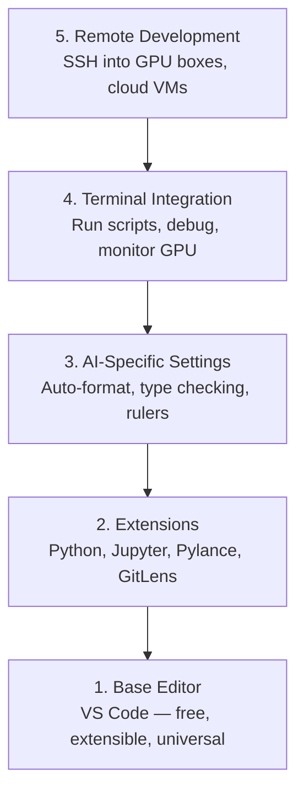

# エディターのセットアップ

> エディターはあなたの副操縦士だ。一度設定して邪魔にならないようにして、本来の力を発揮させよう。


## 学習目標

- Python、Jupyter、リンティング、リモートSSH用の必須拡張機能付きのVS Codeをインストールする
- AIワークフロー向けに保存時フォーマット、型チェック、ノートブック出力スクロールを設定する
- リモートSSHを設定してリモートGPUマシン上のコードをローカルにいるように編集・デバッグする
- エディターの代替（Cursor、Windsurf、Neovim）とそのAI作業におけるトレードオフを評価する

## 問題

Pythonの記述、ノートブックの実行、トレーニングループのデバッグ、GPUボックスへのSSH接続など、エディター内で何千時間も費やすことになる。設定が不十分なエディターは毎回のセッションを摩擦に変える: オートコンプリートなし、型ヒントなし、インラインエラーなし、手動フォーマット、そして不便なターミナルワークフロー。

適切なセットアップには20分かかる。スキップすると毎日20分の損失になる。

## コンセプト

AIエンジニアリングのエディターセットアップには5つのことが必要だ:



## 構築

### Step 1: VS Codeをインストールする

VS Codeが推奨エディターだ。無料で、すべてのOSで動作し、Jupyterノートブックのファーストクラスサポートがあり、拡張機能のエコシステムがAI作業に必要なすべてをカバーしている。

[code.visualstudio.com](https://code.visualstudio.com/) からダウンロード。

ターミナルから確認:

```bash
code --version
```

macOSで `code` が見つからない場合は、VS Codeを開き、`Cmd+Shift+P` を押し、「Shell Command」と入力して「Install 'code' command in PATH」を選択する。

### Step 2: 必須拡張機能をインストールする

VS Codeの統合ターミナル（`` Ctrl+` `` または `` Cmd+` ``）を開いて、AI作業に重要な拡張機能をインストールする:

```bash
code --install-extension ms-python.python
code --install-extension ms-python.vscode-pylance
code --install-extension ms-toolsai.jupyter
code --install-extension eamodio.gitlens
code --install-extension ms-vscode-remote.remote-ssh
code --install-extension ms-python.debugpy
code --install-extension ms-python.black-formatter
code --install-extension charliermarsh.ruff
```

各拡張機能の役割:

| 拡張機能 | 理由 |
|-----------|-----|
| Python | 言語サポート、仮想環境検出、実行/デバッグ |
| Pylance | 高速型チェック、オートコンプリート、インポート解決 |
| Jupyter | VS Code内でノートブックを実行、変数エクスプローラー |
| GitLens | 誰が何を変更したか確認、インラインgitブレーム |
| Remote SSH | リモートGPUボックスのフォルダーをローカルにいるように開く |
| Debugpy | Pythonのステップ実行デバッグ |
| Black Formatter | 保存時の自動フォーマット、一貫したスタイル |
| Ruff | 高速リンティング、よくある間違いをキャッチ |

このレッスンの `code/.vscode/extensions.json` ファイルには推奨リストがある。プロジェクトフォルダーを開くと、VS Codeがインストールを促す。

### Step 3: 設定を行う

このレッスンの `code/.vscode/settings.json` から設定をコピーするか、`設定 > 設定を開く（JSON）` から手動で適用する。

AI作業に重要な設定:

```jsonc
{
    "python.analysis.typeCheckingMode": "basic",
    "editor.formatOnSave": true,
    "editor.rulers": [88, 120],
    "notebook.output.scrolling": true,
    "files.autoSave": "afterDelay"
}
```

これらが重要な理由:

- **basicの型チェック**: 実行前に間違った引数の型をキャッチする。テンソルの形状の不一致やAPIパラメーターの誤りのデバッグ時間を節約する。
- **保存時フォーマット**: フォーマットについて考えなくていい。Blackが処理する。
- **88と120のルーラー**: Blackは88で折り返す。120のマーカーはdocstringやコメントが長くなりすぎた時を示す。
- **ノートブック出力スクロール**: トレーニングループは何千行も出力する。スクロールなしでは出力パネルが爆発する。
- **自動保存**: 保存を忘れる。トレーニングスクリプトが古いコードで実行される。自動保存でそれを防ぐ。

### Step 4: ターミナル統合

VS Codeの統合ターミナルはトレーニングスクリプトの実行、GPUのモニタリング、環境管理を行う場所だ。

適切に設定する:

```jsonc
{
    "terminal.integrated.defaultProfile.osx": "zsh",
    "terminal.integrated.defaultProfile.linux": "bash",
    "terminal.integrated.fontSize": 13,
    "terminal.integrated.scrollback": 10000
}
```

便利なショートカット:

| アクション | macOS | Linux/Windows |
|--------|-------|---------------|
| ターミナルのトグル | `` Ctrl+` `` | `` Ctrl+` `` |
| 新しいターミナル | `` Ctrl+Shift+` `` | `` Ctrl+Shift+` `` |
| ターミナルの分割 | `Cmd+\` | `Ctrl+\` |

分割ターミナルは便利だ: 1つでスクリプトを実行し、もう1つで `nvidia-smi -l 1` や `watch -n 1 nvidia-smi` でGPUをモニタリングする。

### Step 5: リモート開発（GPUボックスへのSSH接続）

これはAI作業で最も重要な拡張機能だ。リモートマシン（クラウドVM、ラボサーバー、Lambda、Vast.ai）でトレーニングを実行する。Remote SSHでリモートファイルシステムを開き、ファイルを編集し、ターミナルを実行し、すべてがローカルにいるようにデバッグできる。

セットアップ:

1. Remote SSH拡張機能をインストールする（Step 2で済んでいる）。
2. `Ctrl+Shift+P`（または `Cmd+Shift+P`）を押し、「Remote-SSH: Connect to Host」と入力する。
3. `user@your-gpu-box-ip` を入力する。
4. VS Codeがリモートマシンにサーバーコンポーネントを自動的にインストールする。

パスワードなしのアクセスのためにSSHキーを設定する:

```bash
ssh-keygen -t ed25519 -C "your-email@example.com"
ssh-copy-id user@your-gpu-box-ip
```

利便性のために `~/.ssh/config` にホストを追加:

```
Host gpu-box
    HostName 203.0.113.50
    User ubuntu
    IdentityFile ~/.ssh/id_ed25519
    ForwardAgent yes
```

これで `Remote-SSH: Connect to Host > gpu-box` で即座に接続できる。

## 代替エディター

### Cursor

[cursor.com](https://cursor.com) はAIコード生成を内蔵したVS Codeのフォークだ。同じ拡張機能エコシステムと設定フォーマットを使う。Cursorを使う場合でも、このレッスンのすべてが適用される。同じ `settings.json` と `extensions.json` をインポートする。

### Windsurf

[windsurf.com](https://windsurf.com) も別のAIファーストのVS Codeフォークだ。同様に: 同じ拡張機能、同じ設定フォーマット、同じRemote SSHサポート。

### Vim/Neovim

すでにVimやNeovimを使って生産的であれば、そのまま使い続ける。AI Python作業の最低限のセットアップ:

- 型チェックには **pyright** または **pylsp**（MasonまたはマニュアルインストールCIAで）
- 言語サーバー統合には **nvim-lspconfig**
- ノートブック的な実行には **jupyter-vim** または **molten-nvim**
- ファイル/シンボル検索には **telescope.nvim**
- フォーマット/リンティングには **none-ls.nvim**（blackとruffで）

まだVimを使っていない場合は今から始めないこと。学習曲線がAIエンジニアリングの学習と競合してしまう。VS Codeを使うこと。

## 活用する

このセットアップで日常のワークフローは次のようになる:

1. VS Codeでプロジェクトフォルダーを開く（またはRemote SSH経由でGPUボックスに接続する）。
2. オートコンプリート、型ヒント、インラインエラーを備えたエディターでPythonを書く。
3. Jupyter拡張機能でJupyterノートブックをインライン実行する。
4. トレーニングスクリプト、`uv pip install`、GPUモニタリングに統合ターミナルを使う。
5. コミット前にGitLensで変更をレビューする。

## 演習

1. VS Codeと Step 2 でリストされたすべての拡張機能をインストールする
2. このレッスンの `settings.json` をVS Code設定にコピーする
3. Pythonファイルを開き、Pylanceが型ヒントを表示し、Blackが保存時にフォーマットすることを確認する
4. リモートマシンへのアクセス権がある場合は、Remote SSHを設定してそのフォルダーを開く

## キーワード

| 用語 | よく言われること | 実際の意味 |
|------|----------------|----------------------|
| LSP | 「オートコンプリートエンジン」 | Language Server Protocol: エディターが言語固有のサーバーから型情報、補完、診断を取得するための標準 |
| Pylance | 「Pythonプラグイン」 | 型チェックとIntelliSenseのためにPyrightを使用するMicrosoftのPython言語サーバー |
| Remote SSH | 「サーバーでの作業」 | リモートマシンに軽量サーバーを実行してローカルエディターにUIをストリーミングするVS Code拡張機能 |
| 保存時フォーマット | 「自動Prettier」 | 保存するたびにフォーマッター（Black、Ruff）を実行し、コードスタイルを常に一貫させる |
