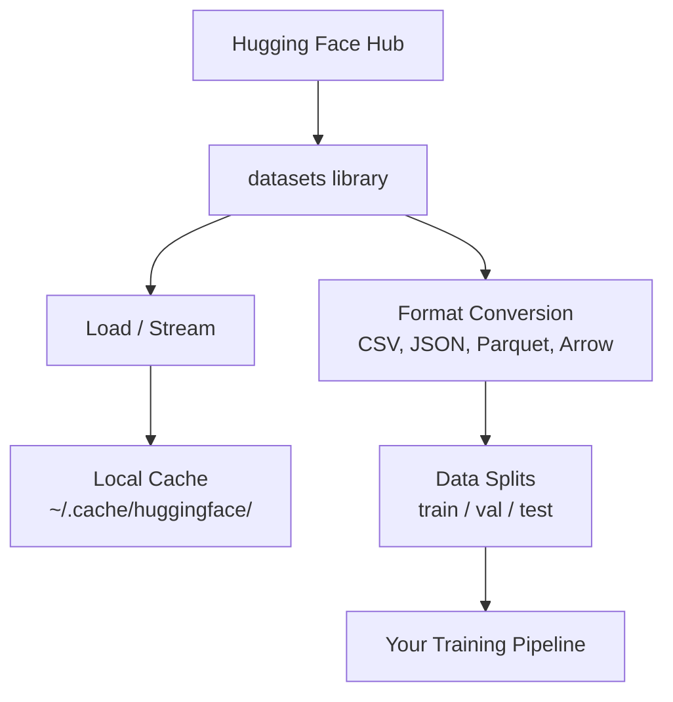

# データ管理

> データは燃料だ。管理方法が速度を決める。


## 学習目標

- Hugging Face `datasets` ライブラリを使ってデータセットをロード、ストリーミング、キャッシュする
- CSV、JSON、Parquet、Arrowフォーマット間で変換し、それぞれのトレードオフを説明する
- 固定乱数シードで再現可能なトレーニング/バリデーション/テスト分割を作成する
- `.gitignore`、Git LFS、DVCを使って大きなモデルとデータセットファイルを管理する

## 問題

すべてのAIプロジェクトはデータから始まる。データセットを見つけ、ダウンロードし、フォーマット間で変換し、トレーニングと評価のために分割し、実験が再現可能なようにバージョン管理する必要がある。毎回手動でこれを行うのは遅くてエラーが起きやすい。繰り返せるワークフローが必要だ。

## コンセプト



Hugging Face `datasets` ライブラリはAI作業でデータをロードする標準的な方法だ。ダウンロード、キャッシュ、フォーマット変換、ストリーミングをすぐに処理できる。

## 構築

### Step 1: datasetsライブラリをインストールする

```bash
pip install datasets huggingface_hub
```

### Step 2: データセットをロードする

```python
from datasets import load_dataset

dataset = load_dataset("imdb")
print(dataset)
print(dataset["train"][0])
```

これによりIMDBの映画レビューデータセットがダウンロードされる。最初のダウンロード後、`~/.cache/huggingface/datasets/` からキャッシュをロードする。

### Step 3: 大きなデータセットをストリーミングする

一部のデータセットはディスクに収まらないほど大きい。ストリーミングは全体をダウンロードせずに行ごとにロードする。

```python
dataset = load_dataset("wikimedia/wikipedia", "20220301.en", split="train", streaming=True)

for i, example in enumerate(dataset):
    print(example["title"])
    if i >= 4:
        break
```

ストリーミングは `IterableDataset` を提供する。行が届いたら処理する。データセットのサイズに関わらずメモリ使用量は一定に保たれる。

### Step 4: データセットのフォーマット

`datasets` ライブラリは内部でApache Arrowを使用している。パイプラインが必要とするものに応じて他のフォーマットに変換できる。

```python
dataset = load_dataset("imdb", split="train")

dataset.to_csv("imdb_train.csv")
dataset.to_json("imdb_train.json")
dataset.to_parquet("imdb_train.parquet")
```

フォーマットの比較:

| フォーマット | サイズ | 読み取り速度 | 最適なケース |
|--------|------|-----------|----------|
| CSV | 大きい | 遅い | 人間が読める、スプレッドシート |
| JSON | 大きい | 遅い | API、ネストされたデータ |
| Parquet | 小さい | 速い | 分析、列クエリ |
| Arrow | 小さい | 最速 | インメモリ処理（`datasets` が内部で使用） |

AI作業ではParquetが最適なストレージフォーマット。Arrowはメモリ内で作業するときに使うもの。CSVとJSONはデータ交換用だ。

### Step 5: データ分割

すべてのMLプロジェクトには3つの分割が必要だ:

- **トレーニング**: モデルはここから学習する（通常80%）
- **バリデーション**: トレーニング中の進捗確認（通常10%）
- **テスト**: トレーニング完了後の最終評価（通常10%）

事前に分割されているデータセットもある。そうでない場合は自分で分割する:

```python
dataset = load_dataset("imdb", split="train")

split = dataset.train_test_split(test_size=0.2, seed=42)
train_val = split["train"].train_test_split(test_size=0.125, seed=42)

train_ds = train_val["train"]
val_ds = train_val["test"]
test_ds = split["test"]

print(f"Train: {len(train_ds)}, Val: {len(val_ds)}, Test: {len(test_ds)}")
```

再現性のために常にシードを設定する。同じシードは毎回同じ分割を生成する。

### Step 6: モデルのダウンロードとキャッシュ

モデルは大きなファイルだ。`huggingface_hub` ライブラリがダウンロードとキャッシュを処理する。

```python
from huggingface_hub import hf_hub_download, snapshot_download

model_path = hf_hub_download(
    repo_id="sentence-transformers/all-MiniLM-L6-v2",
    filename="config.json"
)
print(f"Cached at: {model_path}")

model_dir = snapshot_download("sentence-transformers/all-MiniLM-L6-v2")
print(f"Full model at: {model_dir}")
```

モデルは `~/.cache/huggingface/hub/` にキャッシュされる。一度ダウンロードすれば、以降の実行では即座にロードされる。

### Step 7: 大きなファイルの処理

モデルの重みや大きなデータセットはgitに入れるべきでない。3つの選択肢:

**オプションA: .gitignore（最もシンプル）**

```
*.bin
*.safetensors
*.pt
*.onnx
data/*.parquet
data/*.csv
models/
```

**オプションB: Git LFS（gitで大きなファイルを追跡）**

```bash
git lfs install
git lfs track "*.bin"
git lfs track "*.safetensors"
git add .gitattributes
```

Git LFSはリポジトリにポインターを保存し、実際のファイルは別のサーバーに保存する。GitHubは1 GBまで無料。

**オプションC: DVC（データバージョン管理）**

```bash
pip install dvc
dvc init
dvc add data/training_set.parquet
git add data/training_set.parquet.dvc data/.gitignore
git commit -m "Track training data with DVC"
```

DVCはデータを指す小さな `.dvc` ファイルを作成する。実際のデータはS3、GCS、または別のリモートストレージバックエンドに置く。

| アプローチ | 複雑さ | 最適なケース |
|----------|-----------|----------|
| .gitignore | 低 | 個人プロジェクト、再取得可能なダウンロード済みデータ |
| Git LFS | 中 | git経由でモデルの重みを共有するチーム |
| DVC | 高 | 再現可能な実験、大きなデータセット、チーム |

このコースでは `.gitignore` で十分だ。マシン間で正確な実験を再現する必要がある場合はDVCを使う。

### Step 8: ストレージパターン

**ローカルストレージ**は〜10GB以下のデータセットで機能する。HFキャッシュが自動的に処理する。

**クラウドストレージ**はそれ以上のものや複数のマシンで共有されるものに使う:

```python
import os

local_path = os.path.expanduser("~/.cache/huggingface/datasets/")

# s3_path = "s3://my-bucket/datasets/"
# gcs_path = "gs://my-bucket/datasets/"
```

DVCはS3とGCSと直接統合する:

```bash
dvc remote add -d myremote s3://my-bucket/dvc-store
dvc push
```

このコースではローカルストレージで十分だ。クラウドストレージはリモートGPUインスタンスでファインチューニングを行う際に必要になる。

## このコースで使用するデータセット

| データセット | レッスン | サイズ | 学べること |
|---------|---------|------|----------------|
| IMDB | トークン化、分類 | 84 MB | テキスト分類の基礎 |
| WikiText | 言語モデリング | 181 MB | 次トークン予測 |
| SQuAD | QAシステム | 35 MB | 質問応答、スパン |
| Common Crawl（サブセット） | 埋め込み | 様々 | 大規模テキスト処理 |
| MNIST | ビジョンの基礎 | 21 MB | 画像分類の基礎 |
| COCO（サブセット） | マルチモーダル | 様々 | 画像-テキストペア |

今すぐすべてをダウンロードする必要はない。各レッスンで必要なものを指定する。

## 活用する

すべてが動作することを確認するためにユーティリティスクリプトを実行:

```bash
python code/data_utils.py
```

これにより小さなデータセットがダウンロードされ、変換され、分割されて、サマリーが表示される。

## 提出する

このレッスンで生成するもの:
- `code/data_utils.py` - 再利用可能なデータロードとキャッシュユーティリティ
- `outputs/prompt-data-helper.md` - タスクに適切なデータセットを見つけるプロンプト

## 演習

1. `mrpc` 設定で `glue` データセットをロードし、最初の5つの例を確認する
2. `c4` データセットをストリーミングして10秒間に処理できる例の数を数える
3. データセットをParquetに変換してCSVとのファイルサイズを比較する
4. 固定シードで70/15/15のトレーニング/バリデーション/テスト分割を作成してサイズを確認する

## キーワード

| 用語 | よく言われること | 実際の意味 |
|------|----------------|----------------------|
| データセット分割 | 「トレーニングデータ」 | MLライフサイクルの異なる段階で使用される名前付きサブセット（train/val/test） |
| ストリーミング | 「遅延ロード」 | データセット全体をダウンロードせずにリモートソースから行ごとにデータを処理する |
| Parquet | 「圧縮CSV」 | 分析クエリとストレージ効率のために最適化された列指向のファイルフォーマット |
| Arrow | 「高速データフレーム」 | datasetsライブラリがゼロコピー読み取りのために内部で使用するインメモリ列フォーマット |
| Git LFS | 「大きなファイル向けのgit」 | 大きなファイルをgitリポジトリの外に保存し、バージョン管理にポインターを保持する拡張機能 |
| DVC | 「データ向けのgit」 | クラウドストレージと統合するデータセットとモデル向けのバージョン管理システム |
| キャッシュ | 「既にダウンロード済み」 | 以前に取得したデータのローカルコピー。デフォルトで~/.cache/huggingface/に保存される |
