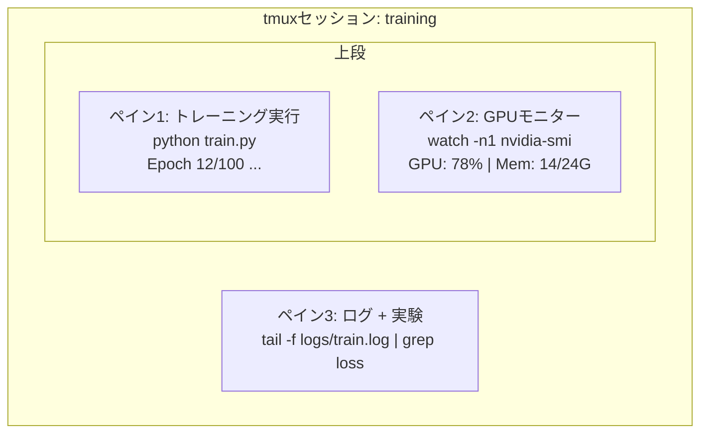

# ターミナルとシェル

> ターミナルはAIエンジニアの住処だ。ここで快適に過ごせるようになろう。


## 学習目標

- パイプ、リダイレクト、`grep` を使ってコマンドラインからトレーニングログをフィルタリング・処理する
- 同時並行のトレーニングとGPUモニタリングのために複数ペインを持つ永続的なtmuxセッションを作成する
- `htop`、`nvtop`、`nvidia-smi` でシステムとGPUリソースをモニタリングする
- SSH、`scp`、`rsync` を使ってローカルとリモートマシン間でファイルを転送する

## 問題

エディターよりもターミナルで多くの時間を費やすことになる。トレーニングの実行、GPUのモニタリング、ログのテール追跡、リモートSSHセッション、環境管理。すべてのAIワークフローはシェルに触れる。ここで遅ければ、どこでも遅い。

このレッスンではAI作業に重要なターミナルスキルを扱う。Unixの歴史もBashスクリプトの詳細解説もない。必要なことだけだ。

## コンセプト



3つのものが同時に動く。1つのターミナル。デタッチして、帰宅して、SSHで戻ってきて、リアタッチできる。トレーニングは動き続ける。

## 構築

### Step 1: 自分のシェルを知る

どのシェルを実行しているか確認:

```bash
echo $SHELL
```

多くのシステムは `bash` または `zsh` を使う。どちらでも問題ない。このコースのコマンドはどちらでも動作する。

知っておくべきこと:

```bash
# Move around
cd ~/projects/ai-engineering-from-scratch
pwd
ls -la

# History search (most useful shortcut you'll learn)
# Ctrl+R then type part of a previous command
# Press Ctrl+R again to cycle through matches

# Clear terminal
clear   # or Ctrl+L

# Cancel a running command
# Ctrl+C

# Suspend a running command (resume with fg)
# Ctrl+Z
```

### Step 2: パイプとリダイレクト

パイプはコマンドを連鎖させる。これがログの処理、出力のフィルタリング、ツールの連鎖を行う方法だ。常に使うことになる。

```bash
# Count how many times "loss" appears in a log
cat train.log | grep "loss" | wc -l

# Extract just the loss values from training output
grep "loss:" train.log | awk '{print $NF}' > losses.txt

# Watch a log file update in real time, filtering for errors
tail -f train.log | grep --line-buffered "ERROR"

# Sort experiments by final accuracy
grep "final_accuracy" results/*.log | sort -t= -k2 -n -r

# Redirect stdout and stderr to separate files
python train.py > output.log 2> errors.log

# Redirect both to the same file
python train.py > train_full.log 2>&1
```

必要な3つのリダイレクト:

| 記号 | 動作 |
|--------|-------------|
| `>` | stdoutをファイルに書き込む（上書き） |
| `>>` | stdoutをファイルに追記 |
| `2>` | stderrをファイルに書き込む |
| `2>&1` | stderrをstdoutと同じ場所に送る |
| `\|` | あるコマンドのstdoutを次のコマンドのstdinとして送る |

### Step 3: バックグラウンドプロセス

トレーニングの実行には何時間もかかる。ずっとターミナルを開いたままにしたくない。

```bash
# Run in background (output still goes to terminal)
python train.py &

# Run in background, immune to hangup (closing terminal won't kill it)
nohup python train.py > train.log 2>&1 &

# Check what's running in background
jobs
ps aux | grep train.py

# Bring a background job to foreground
fg %1

# Kill a background process
kill %1
# or find its PID and kill that
kill $(pgrep -f "train.py")
```

`&`、`nohup`、`screen`/`tmux` の違い:

| 方法 | ターミナルを閉じても残る？ | リアタッチできる？ |
|--------|-------------------------|---------------|
| `command &` | いいえ | いいえ |
| `nohup command &` | はい | いいえ（ログファイルを確認） |
| `screen` / `tmux` | はい | はい |

数分以上かかるものには tmux を使う。

### Step 4: tmux

tmuxは複数のペインを持つ永続的なターミナルセッションを作成できる。これはトレーニング実行を管理する上で最も便利なツールだ。

```bash
# Install
# macOS
brew install tmux
# Ubuntu
sudo apt install tmux

# Start a named session
tmux new -s training

# Split horizontally
# Ctrl+B then "

# Split vertically
# Ctrl+B then %

# Navigate between panes
# Ctrl+B then arrow keys

# Detach (session keeps running)
# Ctrl+B then d

# Reattach
tmux attach -t training

# List sessions
tmux ls

# Kill a session
tmux kill-session -t training
```

一般的なAIワークフローセッション:

```bash
tmux new -s train

# Pane 1: start training
python train.py --epochs 100 --lr 1e-4

# Ctrl+B, " to split, then run GPU monitor
watch -n1 nvidia-smi

# Ctrl+B, % to split vertically, tail the logs
tail -f logs/experiment.log

# Now detach with Ctrl+B, d
# SSH out, go get coffee, come back
# tmux attach -t train
```

### Step 5: htopとnvtopによるモニタリング

```bash
# System processes (better than top)
htop

# GPU processes (if you have NVIDIA GPU)
# Install: sudo apt install nvtop (Ubuntu) or brew install nvtop (macOS)
nvtop

# Quick GPU check without nvtop
nvidia-smi

# Watch GPU usage update every second
watch -n1 nvidia-smi

# See which processes are using the GPU
nvidia-smi --query-compute-apps=pid,name,used_memory --format=csv
```

よく使う `htop` のキーバインディング:
- `F6` または `>` で列ごとにソート（メモリリークを探すためにメモリでソート）
- `F5` でツリービューに切り替える（子プロセスを確認）
- `F9` でプロセスをキル
- `/` でプロセス名を検索

### Step 6: リモートGPUボックスへのSSH

クラウドGPU（Lambda、RunPod、Vast.ai）をレンタルするとき、SSHで接続する。

```bash
# Basic connection
ssh user@gpu-box-ip

# With a specific key
ssh -i ~/.ssh/my_gpu_key user@gpu-box-ip

# Copy files to remote
scp model.pt user@gpu-box-ip:~/models/

# Copy files from remote
scp user@gpu-box-ip:~/results/metrics.json ./

# Sync a whole directory (faster for many files)
rsync -avz ./data/ user@gpu-box-ip:~/data/

# Port forward (access remote Jupyter/TensorBoard locally)
ssh -L 8888:localhost:8888 user@gpu-box-ip
# Now open localhost:8888 in your browser

# SSH config for convenience
# Add to ~/.ssh/config:
# Host gpu
#     HostName 192.168.1.100
#     User ubuntu
#     IdentityFile ~/.ssh/gpu_key
#
# Then just:
# ssh gpu
```

### Step 7: AI作業に便利なエイリアス

これらを `~/.bashrc` または `~/.zshrc` に追加:

```bash
source phases/00-setup-and-tooling/10-terminal-and-shell/code/shell_aliases.sh
```

または必要なものをコピーする。主なエイリアス:

```bash
# GPU status at a glance
alias gpu='nvidia-smi --query-gpu=index,name,utilization.gpu,memory.used,memory.total,temperature.gpu --format=csv,noheader'

# Kill all Python training processes
alias killtraining='pkill -f "python.*train"'

# Quick virtual environment activate
alias ae='source .venv/bin/activate'

# Watch training loss
alias watchloss='tail -f logs/*.log | grep --line-buffered "loss"'
```

完全なセットは `code/shell_aliases.sh` を参照。

### Step 8: よくあるAIのターミナルパターン

実際によく使われる:

```bash
# Run training, log everything, notify when done
python train.py 2>&1 | tee train.log; echo "DONE" | mail -s "Training complete" you@email.com

# Compare two experiment logs side by side
diff <(grep "accuracy" exp1.log) <(grep "accuracy" exp2.log)

# Find the largest model files (clean up disk space)
find . -name "*.pt" -o -name "*.safetensors" | xargs du -h | sort -rh | head -20

# Download a model from Hugging Face
wget https://huggingface.co/model/resolve/main/model.safetensors

# Untar a dataset
tar xzf dataset.tar.gz -C ./data/

# Count lines in all Python files (see how big your project is)
find . -name "*.py" | xargs wc -l | tail -1

# Check disk space (training data fills disks fast)
df -h
du -sh ./data/*

# Environment variable check before training
env | grep -i cuda
env | grep -i torch
```

## 活用する

このコースの各ツールを使うタイミング:

| ツール | 使用タイミング |
|------|----------------|
| tmux | すべてのトレーニング実行（フェーズ3以降） |
| `tail -f` + `grep` | トレーニングログのモニタリング |
| `nohup` / `&` | クイックなバックグラウンドタスク |
| `htop` / `nvtop` | 遅いトレーニング、OOMエラーのデバッグ |
| SSH + `rsync` | クラウドGPUでの作業 |
| パイプ + リダイレクト | 実験結果の処理 |
| エイリアス | 繰り返しコマンドの時間節約 |

## 演習

1. tmuxをインストールし、3つのペインを持つセッションを作成し、1つで `htop`、もう1つで `watch -n1 date`、3つ目でPythonスクリプトを実行する。デタッチしてリアタッチする。
2. `code/shell_aliases.sh` のエイリアスをシェル設定に追加して `source ~/.zshrc`（または `~/.bashrc`）でリロードする。
3. `for i in $(seq 1 100); do echo "epoch $i loss: $(echo "scale=4; 1/$i" | bc)"; sleep 0.1; done > fake_train.log` で偽のトレーニングログを作成し、`grep`、`tail`、`awk` を使ってロス値だけを抽出する。
4. アクセスできるサーバー（または構文の練習のために `localhost`）のSSH設定エントリを設定する。

## キーワード

| 用語 | よく言われること | 実際の意味 |
|------|----------------|----------------------|
| シェル | 「ターミナル」 | コマンドを解釈するプログラム（bash、zsh、fish） |
| tmux | 「ターミナルマルチプレクサー」 | 1つのウィンドウ内で複数のターミナルセッションを実行し、デタッチ/リアタッチできるプログラム |
| パイプ | 「バー記号」 | あるコマンドの出力を別のコマンドの入力として送る `\|` 演算子 |
| PID | 「プロセスID」 | すべての実行中プロセスに割り当てられる一意の番号。モニタリングやキルに使用する |
| nohup | 「ノーハングアップ」 | ハングアップシグナルを無視してコマンドを実行し、ターミナルを閉じてもプロセスがキルされない |
| SSH | 「サーバーへの接続」 | リモートマシンでコマンドを実行するための暗号化プロトコル |
