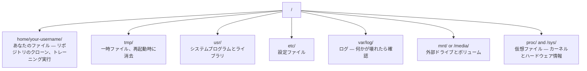

# AIのためのLinux

> ほとんどのAIはLinux上で動く。立ち往生しないための知識を身につけよう。


## 学習目標

- Linuxのファイルシステムをナビゲートし、コマンドラインから基本的なファイル操作を行う
- `chmod` と `chown` でファイルパーミッションを管理して「Permission denied」エラーを解決する
- `apt` でシステムパッケージをインストールし、AI作業のための新しいGPUボックスをセットアップする
- リモートマシンで作業する開発者がよくつまずくmacOSとLinuxの違いを特定する

## 問題

macOSかWindowsで開発している。しかしクラウドのGPUボックスにSSHで接続した瞬間、LambdaインスタンスをレンタルしたりEC2マシンを起動した瞬間、Ubuntuにたどり着く。ターミナルが唯一のインターフェースになる。FinderもExplorerもGUIも存在しない。コマンドラインからファイルシステムをナビゲートし、パッケージをインストールし、プロセスを管理できなければ、「Linuxでファイルを解凍する方法」をGoogleで調べながらGPUのアイドル料金を払い続けることになる。

これはサバイバルガイドだ。AI作業のためにリモートLinuxマシンを操作するのに必要なことだけをカバーする。それ以上ではない。

## ファイルシステムのレイアウト

Linuxはすべてを単一のルート `/` の下に整理する。`C:\` も `/Volumes` もない。実際に触れるディレクトリ:



ホームディレクトリは `~` または `/home/your-username`。ほぼすべての作業はここで行われる。

## 基本コマンド

これはリモートGPUボックスでの作業の95%をカバーする15のコマンドだ。

### 移動

```bash
pwd                         # Where am I?
ls                          # What's here?
ls -la                      # What's here, including hidden files with details?
cd /path/to/dir             # Go there
cd ~                        # Go home
cd ..                       # Go up one level
```

### ファイルとディレクトリ

```bash
mkdir my-project            # Create a directory
mkdir -p a/b/c              # Create nested directories in one shot

cp file.txt backup.txt      # Copy a file
cp -r src/ src-backup/      # Copy a directory (recursive)

mv old.txt new.txt          # Rename a file
mv file.txt /tmp/           # Move a file

rm file.txt                 # Delete a file (no trash, it's gone)
rm -rf my-dir/              # Delete a directory and everything inside
```

`rm -rf` は永久的だ。元に戻せない。エンターを押す前にパスをよく確認すること。

### ファイルの読み取り

```bash
cat file.txt                # Print entire file
head -20 file.txt           # First 20 lines
tail -20 file.txt           # Last 20 lines
tail -f log.txt             # Follow a log file in real time (Ctrl+C to stop)
less file.txt               # Scroll through a file (q to quit)
```

### 検索

```bash
grep "error" training.log           # Find lines containing "error"
grep -r "learning_rate" .           # Search all files in current directory
grep -i "cuda" config.yaml          # Case-insensitive search

find . -name "*.py"                 # Find all Python files under current dir
find . -name "*.ckpt" -size +1G     # Find checkpoint files larger than 1GB
```

## パーミッション

Linuxのすべてのファイルにはオーナーとパーミッションビットがある。スクリプトが実行できなかったり、ディレクトリに書き込めない場合にこれに遭遇する。

```bash
ls -l train.py
# -rwxr-xr-- 1 user group 2048 Mar 19 10:00 train.py
#  ^^^             owner permissions: read, write, execute
#     ^^^          group permissions: read, execute
#        ^^        everyone else: read only
```

よくある修正:

```bash
chmod +x train.sh           # Make a script executable
chmod 755 deploy.sh         # Owner: full, others: read+execute
chmod 644 config.yaml       # Owner: read+write, others: read only

chown user:group file.txt   # Change who owns a file (needs sudo)
```

「Permission denied」と表示されたら、ほぼ常にパーミッションの問題だ。`chmod +x` または `sudo` でほとんどのケースが修正できる。

## パッケージ管理（apt）

Ubuntuは `apt` を使う。これがシステムレベルのソフトウェアをインストールする方法だ。

```bash
sudo apt update             # Refresh the package list (always do this first)
sudo apt install -y htop    # Install a package (-y skips confirmation)
sudo apt install -y build-essential  # C compiler, make, etc. Needed by many Python packages
sudo apt install -y tmux    # Terminal multiplexer (keep sessions alive after disconnect)

apt list --installed        # What's installed?
sudo apt remove htop        # Uninstall
```

新しいGPUボックスによくインストールするパッケージ:

```bash
sudo apt update && sudo apt install -y \
    build-essential \
    git \
    curl \
    wget \
    tmux \
    htop \
    unzip \
    python3-venv
```

## ユーザーとsudo

通常は一般ユーザーとしてログインしている。一部の操作にはルート（管理者）アクセスが必要だ。

```bash
whoami                      # What user am I?
sudo command                # Run a single command as root
sudo su                     # Become root (exit to go back, use sparingly)
```

クラウドGPUインスタンスでは通常唯一のユーザーでsudoアクセスがある。すべてをrootで実行しないこと。必要な時だけsudoを使う。

## プロセスとsystemd

トレーニングがハングしたり、何が動いているか確認したいとき:

```bash
htop                        # Interactive process viewer (q to quit)
ps aux | grep python        # Find running Python processes
kill 12345                  # Gracefully stop process with PID 12345
kill -9 12345               # Force kill (use when graceful doesn't work)
nvidia-smi                  # GPU processes and memory usage
```

systemdはサービス（バックグラウンドデーモン）を管理する。推論サーバーを実行する場合に使う:

```bash
sudo systemctl start nginx          # Start a service
sudo systemctl stop nginx           # Stop it
sudo systemctl restart nginx        # Restart it
sudo systemctl status nginx         # Check if it's running
sudo systemctl enable nginx         # Start automatically on boot
```

## ディスクスペース

GPUボックスのディスクスペースは限られていることが多い。モデルとデータセットはすぐにいっぱいになる。

```bash
df -h                       # Disk usage for all mounted drives
df -h /home                 # Disk usage for /home specifically

du -sh *                    # Size of each item in current directory
du -sh ~/.cache             # Size of your cache (pip, huggingface models land here)
du -sh /data/checkpoints/   # Check how big your checkpoints are

# Find the biggest space hogs
du -h --max-depth=1 / 2>/dev/null | sort -hr | head -20
```

一般的なスペース節約:

```bash
# Clear pip cache
pip cache purge

# Clear apt cache
sudo apt clean

# Remove old checkpoints you don't need
rm -rf checkpoints/epoch_01/ checkpoints/epoch_02/
```

## ネットワーク

コマンドラインからモデルをダウンロードし、ファイルを転送し、APIを叩く。

```bash
# Download files
wget https://example.com/model.bin                   # Download a file
curl -O https://example.com/data.tar.gz              # Same thing with curl
curl -s https://api.example.com/health | python3 -m json.tool  # Hit an API, pretty-print JSON

# Transfer files between machines
scp model.bin user@remote:/data/                     # Copy file to remote machine
scp user@remote:/data/results.csv .                  # Copy file from remote to local
scp -r user@remote:/data/checkpoints/ ./local-dir/   # Copy directory

# Sync directories (faster than scp for large transfers, resumes on failure)
rsync -avz --progress ./data/ user@remote:/data/
rsync -avz --progress user@remote:/results/ ./results/
```

大きなものには `scp` より `rsync` を使う。変更されたバイトのみを転送し、中断された接続を処理できる。

## tmux: セッションを維持する

リモートボックスにSSHで接続しているとき、ノートパソコンを閉じるとトレーニングが止まる。tmuxはこれを防ぐ。

```bash
tmux new -s train           # Start a new session named "train"
# ... start your training, then:
# Ctrl+B, then D            # Detach (training keeps running)

tmux ls                     # List sessions
tmux attach -t train        # Reattach to session

# Inside tmux:
# Ctrl+B, then %            # Split pane vertically
# Ctrl+B, then "            # Split pane horizontally
# Ctrl+B, then arrow keys   # Switch between panes
```

長いトレーニングジョブは必ずtmuxの中で実行すること。必ずだ。

## WindowsユーザーのためのWSL2

Windowsの場合、WSL2でデュアルブートなしに本物のLinux環境が使える。

```bash
# In PowerShell (admin)
wsl --install -d Ubuntu-24.04

# After restart, open Ubuntu from Start menu
sudo apt update && sudo apt upgrade -y
```

WSL2は本物のLinuxカーネルを実行する。このレッスンのすべてがその中で動作する。Windowsファイルは `/mnt/c/Users/YourName/` からWSL内でアクセスできる。

GPUパススルーはWindows側にNVIDIAドライバーがインストールされていれば動作する。WindowsのNVIDIAドライバー（Linuxのものではなく）をインストールすれば、WSL2内でCUDAが利用できる。

## 注意点: macOSからLinuxへ

macOSから来た場合につまずくこと:

| macOS | Linux | 備考 |
|-------|-------|-------|
| `brew install` | `sudo apt install` | パッケージ名が違うことがある。`brew install htop` vs `sudo apt install htop` は同じだが、`brew install readline` vs `sudo apt install libreadline-dev` は違う。 |
| `open file.txt` | `xdg-open file.txt` | ただしリモートボックスにはGUIがない。`cat` または `less` を使う。 |
| `pbcopy` / `pbpaste` | 利用不可 | SSH経由ではクリップボードへのパイプが存在しない。 |
| `~/.zshrc` | `~/.bashrc` | macOSはデフォルトでzshを使う。ほとんどのLinuxサーバーはbashを使う。 |
| `/opt/homebrew/` | `/usr/bin/`、`/usr/local/bin/` | バイナリは異なる場所に置かれる。 |
| `sed -i '' 's/a/b/' file` | `sed -i 's/a/b/' file` | macOSのsedは `-i` の後に空の文字列が必要。Linuxは不要。 |
| 大文字小文字を区別しないファイルシステム | 大文字小文字を区別するファイルシステム | `Model.py` と `model.py` はLinuxでは2つの別ファイルだ。 |
| 改行コード `\n` | 改行コード `\n` | 同じ。ただしWindowsは `\r\n` を使い、bashスクリプトを壊す。`dos2unix` で修正する。 |

## クイックリファレンスカード

```
Navigation:     pwd, ls, cd, find
Files:          cp, mv, rm, mkdir, cat, head, tail, less
Search:         grep, find
Permissions:    chmod, chown, sudo
Packages:       apt update, apt install
Processes:      htop, ps, kill, nvidia-smi
Services:       systemctl start/stop/restart/status
Disk:           df -h, du -sh
Network:        curl, wget, scp, rsync
Sessions:       tmux new/attach/detach
```

## 演習

1. 任意のLinuxマシン（またはWSL2を開く）にSSHして、ホームディレクトリに移動する。プロジェクトフォルダーを作成し、その中に `touch` で3つの空ファイルを作成して `ls -la` でリスト表示する。
2. aptで `htop` をインストールして実行し、最もメモリを使用しているプロセスを特定する。
3. tmuxセッションを開始し、その中で `sleep 300` を実行してデタッチし、セッションをリストして、リアタッチする。
4. `df -h` で空きディスクスペースを確認し、次に `du -sh ~/.cache/*` でキャッシュのどこがスペースを使っているか確認する。
5. ローカルマシンからリモートマシンに `scp` でファイルを転送し、同じ転送を `rsync` で行って経験を比較する。
