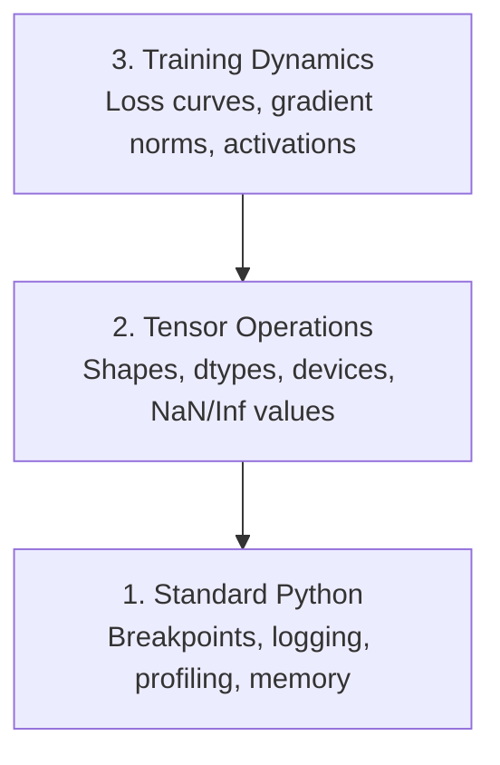

# デバッグとプロファイリング

> 最悪のAIバグはクラッシュしない。ゴミデータでサイレントにトレーニングしながら、美しいロス曲線を報告する。


## 学習目標

- 条件付き `breakpoint()` と `debug_print` を使ってトレーニング中間にテンソルの形状、dtype、NaN値を検査する
- `cProfile`、`line_profiler`、`tracemalloc` でトレーニングループをプロファイリングしてボトルネックを見つける
- よくあるAIのバグを検出する: 形状の不一致、NaNロス、データリーケージ、デバイスが間違ったテンソル
- TensorBoardをセットアップしてロス曲線、重みのヒストグラム、勾配分布を可視化する

## 問題

AIコードは通常のコードとは異なる方法で失敗する。Webアプリはスタックトレースでクラッシュする。設定が間違ったトレーニングループは8時間動作し、200ドルのGPU時間を消費し、すべての入力の平均値を予測するモデルを作り出す。コードはエラーを出さなかった。バグはテンソルが間違ったデバイスにあること、忘れた `.detach()`、またはラベルが特徴量に漏れ込んでいることだった。

サイレントな失敗が時間とコンピュートを無駄にする前にキャッチするデバッグツールが必要だ。

## コンセプト

AIデバッグは3つのレベルで行われる:



ほとんどの人はいきなりレベル3（TensorBoardを眺める）に飛びつく。しかしAIバグの80%はレベル1と2にある。

## 構築

### パート1: プリントデバッグ（これが効く）

プリントデバッグは軽視される。すべきでない。テンソルコードでは、デバッガーでステップ実行するより的を絞ったprint文の方が優れている。形状、dtype、値の範囲を一度に見る必要があるからだ。

```python
def debug_print(name, tensor):
    print(f"{name}: shape={tensor.shape}, dtype={tensor.dtype}, "
          f"device={tensor.device}, "
          f"min={tensor.min().item():.4f}, max={tensor.max().item():.4f}, "
          f"mean={tensor.mean().item():.4f}, "
          f"has_nan={tensor.isnan().any().item()}")
```

疑わしいすべての操作の後にこれを呼び出す。バグが見つかったら、printを削除する。シンプルだ。

### パート2: Pythonデバッガー（pdbとbreakpoint）

組み込みデバッガーはAI作業では過小評価されている。トレーニングループに `breakpoint()` を置き込み、インタラクティブにテンソルを検査する。

```python
def training_step(model, batch, criterion, optimizer):
    inputs, labels = batch
    outputs = model(inputs)
    loss = criterion(outputs, labels)

    if loss.item() > 100 or torch.isnan(loss):
        breakpoint()

    loss.backward()
    optimizer.step()
```

デバッガーが起動した時に便利なコマンド:

- `p outputs.shape` で形状を確認
- `p loss.item()` でロス値を確認
- `p torch.isnan(outputs).sum()` でNaNの数を数える
- `p model.fc1.weight.grad` で勾配を確認
- `c` で続行、`q` で終了

これが条件付きデバッグだ。何かおかしいときだけ停止する。10,000ステップのトレーニング実行では重要だ。

### パート3: Pythonロギング

クイックチェックを超えたデバッグが必要になったらprint文をロギングに置き換える。

```python
import logging

logging.basicConfig(
    level=logging.INFO,
    format="%(asctime)s [%(levelname)s] %(message)s",
    handlers=[
        logging.FileHandler("training.log"),
        logging.StreamHandler()
    ]
)
logger = logging.getLogger(__name__)

logger.info("Starting training: lr=%.4f, batch_size=%d", lr, batch_size)
logger.warning("Loss spike detected: %.4f at step %d", loss.item(), step)
logger.error("NaN loss at step %d, stopping", step)
```

ロギングはタイムスタンプ、深刻度レベル、ファイル出力を提供する。トレーニングが午前3時に失敗したとき、スクロールしてなくなったターミナル出力ではなくログファイルが欲しい。

### パート4: コードセクションのタイミング計測

時間がどこに使われているかを知ることが最適化の第一歩だ。

```python
import time

class Timer:
    def __init__(self, name=""):
        self.name = name

    def __enter__(self):
        self.start = time.perf_counter()
        return self

    def __exit__(self, *args):
        elapsed = time.perf_counter() - self.start
        print(f"[{self.name}] {elapsed:.4f}s")

with Timer("data loading"):
    batch = next(dataloader_iter)

with Timer("forward pass"):
    outputs = model(batch)

with Timer("backward pass"):
    loss.backward()
```

よくある発見: データ読み込みがトレーニング時間の60%を占める。解決策は高速なGPUではなく、DataLoaderで `num_workers > 0` を設定することだ。

### パート5: cProfileとline_profiler

手動タイマーより詳細が必要な場合:

```bash
python -m cProfile -s cumtime train.py
```

これは累積時間でソートされたすべての関数呼び出しを表示する。行ごとのプロファイリングには:

```bash
pip install line_profiler
```

```python
@profile
def train_step(model, data, target):
    output = model(data)
    loss = F.cross_entropy(output, target)
    loss.backward()
    return loss

# Run with: kernprof -l -v train.py
```

### パート6: メモリプロファイリング

#### tracemalloc によるCPUメモリ

```python
import tracemalloc

tracemalloc.start()

# your code here
model = build_model()
data = load_dataset()

snapshot = tracemalloc.take_snapshot()
top_stats = snapshot.statistics("lineno")
for stat in top_stats[:10]:
    print(stat)
```

#### memory_profiler によるCPUメモリ

```bash
pip install memory_profiler
```

```python
from memory_profiler import profile

@profile
def load_data():
    raw = read_csv("data.csv")       # watch memory jump here
    processed = preprocess(raw)       # and here
    return processed
```

`python -m memory_profiler your_script.py` で実行すると行ごとのメモリ使用量が表示される。

#### PyTorchによるGPUメモリ

```python
import torch

if torch.cuda.is_available():
    print(torch.cuda.memory_summary())

    print(f"Allocated: {torch.cuda.memory_allocated() / 1e9:.2f} GB")
    print(f"Cached: {torch.cuda.memory_reserved() / 1e9:.2f} GB")
```

OOM（アウトオブメモリ）になったとき:

1. バッチサイズを減らす（常に最初に試すこと）
2. `torch.cuda.empty_cache()` でキャッシュされたメモリを解放する
3. 大きな中間テンソルに `del tensor` の後 `torch.cuda.empty_cache()` を使う
4. 混合精度（`torch.cuda.amp`）でメモリ使用量を半減させる
5. 非常に深いモデルには勾配チェックポインティングを使う

### パート7: よくあるAIバグとその検出方法

#### 形状の不一致

最も多いバグだ。テンソルが `[batch, features]` の形状だが、モデルは `[batch, channels, height, width]` を期待している。

```python
def check_shapes(model, sample_input):
    print(f"Input: {sample_input.shape}")
    hooks = []

    def make_hook(name):
        def hook(module, inp, out):
            in_shape = inp[0].shape if isinstance(inp, tuple) else inp.shape
            out_shape = out.shape if hasattr(out, "shape") else type(out)
            print(f"  {name}: {in_shape} -> {out_shape}")
        return hook

    for name, module in model.named_modules():
        hooks.append(module.register_forward_hook(make_hook(name)))

    with torch.no_grad():
        model(sample_input)

    for h in hooks:
        h.remove()
```

サンプルバッチで一度これを実行する。モデル内のすべての形状変換がマッピングされる。

#### NaNロス

NaNロスは何かが爆発したことを意味する。よくある原因:

- 学習率が高すぎる
- カスタムロスでのゼロ除算
- ゼロまたは負の数のlog
- RNNでの勾配爆発

```python
def detect_nan(model, loss, step):
    if torch.isnan(loss):
        print(f"NaN loss at step {step}")
        for name, param in model.named_parameters():
            if param.grad is not None:
                if torch.isnan(param.grad).any():
                    print(f"  NaN gradient in {name}")
                if torch.isinf(param.grad).any():
                    print(f"  Inf gradient in {name}")
        return True
    return False
```

#### データリーケージ

モデルがテストセットで99%の精度を達成する。素晴らしそうに見える。これはバグだ。

```python
def check_data_leakage(train_set, test_set, id_column="id"):
    train_ids = set(train_set[id_column].tolist())
    test_ids = set(test_set[id_column].tolist())
    overlap = train_ids & test_ids
    if overlap:
        print(f"DATA LEAKAGE: {len(overlap)} samples in both train and test")
        return True
    return False
```

時間的リーケージも確認する: 未来のデータを使って過去を予測してしまっていないか。分割前にタイムスタンプでソートする。

#### 間違ったデバイス

異なるデバイス（CPUとGPU）上のテンソルはランタイムエラーを引き起こす。しかし時にテンソルがCPU上に留まったまま、他はすべてGPU上にある場合、トレーニングは静かに遅くなるだけだ。

```python
def check_devices(model, *tensors):
    model_device = next(model.parameters()).device
    print(f"Model device: {model_device}")
    for i, t in enumerate(tensors):
        if t.device != model_device:
            print(f"  WARNING: tensor {i} on {t.device}, model on {model_device}")
```

### パート8: TensorBoardの基礎

TensorBoardはトレーニング中に内部で何が起きているかを時系列で表示する。

```bash
pip install tensorboard
```

```python
from torch.utils.tensorboard import SummaryWriter

writer = SummaryWriter("runs/experiment_1")

for step in range(num_steps):
    loss = train_step(model, batch)

    writer.add_scalar("loss/train", loss.item(), step)
    writer.add_scalar("lr", optimizer.param_groups[0]["lr"], step)

    if step % 100 == 0:
        for name, param in model.named_parameters():
            writer.add_histogram(f"weights/{name}", param, step)
            if param.grad is not None:
                writer.add_histogram(f"grads/{name}", param.grad, step)

writer.close()
```

起動:

```bash
tensorboard --logdir=runs
```

確認すべきこと:

- **ロスが下がらない**: 学習率が低すぎる、またはモデルのアーキテクチャの問題
- **ロスが激しく振動する**: 学習率が高すぎる
- **ロスがNaNになる**: 数値的不安定性（上のNaNセクションを参照）
- **トレーニングロスが下がり、バリデーションロスが上がる**: 過学習
- **重みのヒストグラムがゼロに収束する**: 勾配消失
- **勾配のヒストグラムが爆発する**: 勾配クリッピングが必要

### パート9: VS Codeデバッガー

インタラクティブなデバッグのために、`launch.json` でVS Codeを設定する:

```json
{
    "version": "0.2.0",
    "configurations": [
        {
            "name": "Debug Training",
            "type": "debugpy",
            "request": "launch",
            "program": "${file}",
            "console": "integratedTerminal",
            "justMyCode": false
        }
    ]
}
```

ガターをクリックしてブレークポイントを設定する。「変数」ペインでテンソルプロパティを検査する。デバッグコンソールで実行中に任意のPython式を実行できる。

各変換を確認したいデータ前処理パイプラインのステップ実行に便利だ。

## 活用する

ほとんどのAIバグをキャッチするデバッグワークフロー:

1. **トレーニング前**: サンプルバッチで `check_shapes` を実行する。入力と出力の寸法が期待通りか確認する。
2. **最初の10ステップ**: ロス、出力、勾配に `debug_print` を使う。何もNaNでなく、値が妥当な範囲にあることを確認する。
3. **トレーニング中**: ロス、学習率、勾配ノルムをログする。可視化にTensorBoardを使う。
4. **何かが壊れたとき**: 失敗した時点に `breakpoint()` を置く。インタラクティブにテンソルを検査する。
5. **パフォーマンスのため**: データ読み込み対フォワード対バックワードパスの時間を計測する。OOMに近い場合はメモリをプロファイリングする。

## 提出する

デバッグツールキットスクリプトを実行:

```bash
python phases/00-setup-and-tooling/12-debugging-and-profiling/code/debug_tools.py
```

AI固有のバグを診断するプロンプトは `outputs/prompt-debug-ai-code.md` を参照。

## 演習

1. `debug_tools.py` を実行し、各セクションの出力を読む。フォワードパスにゼロ除算を導入してNaNを引き起こし（ヒント: ゼロ除算）、検出器がキャッチするのを確認する。
2. トレーニングループを `cProfile` でプロファイリングし、最も遅い関数を特定する。
3. `tracemalloc` を使ってデータ読み込みパイプラインのどの行が最もメモリを割り当てているか見つける。
4. 簡単なトレーニング実行にTensorBoardをセットアップし、モデルが過学習しているかを特定する。
5. トレーニングループ内に `breakpoint()` を使う。デバッガーのプロンプトからテンソルの形状、デバイス、勾配値を検査する練習をする。

## キーワード

| 用語 | よく言われること | 実際の意味 |
|------|----------------|----------------------|
| プロファイラー | 「ボトルネック検出器」 | コードの各部分が消費する時間とメモリを測定して最適化の機会を特定するツール |
| NaNロス | 「トレーニングが壊れた」 | 損失がNot-a-Number（非数）になる状態。数値的不安定性を示す |
| 勾配爆発 | 「学習が発散する」 | 逆伝播中に勾配が非常に大きくなり、NaNロスや重みの急激な変化につながる |
| データリーケージ | 「不正なデータ」 | テスト情報がトレーニングデータに漏れ込み、過剰楽観的なメトリクスになる |
| OOM | 「メモリ不足」 | Out-of-Memory。GPUが割り当てられたメモリを使い切った時に発生するエラー |
