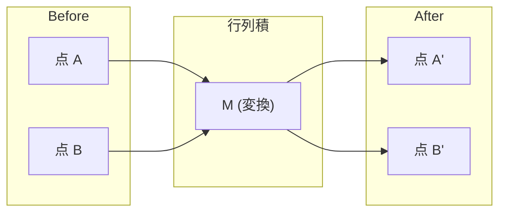
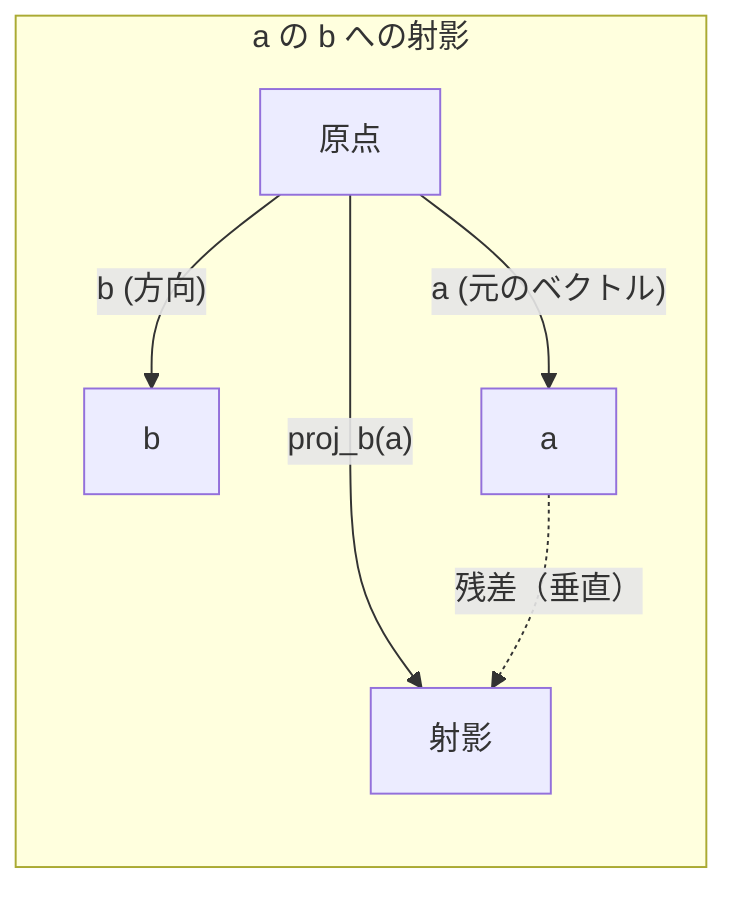

# 線形代数の直感的理解

> すべてのAIモデルは、派手な帽子をかぶった行列計算にすぎない。


## 学習目標

- Pythonでベクトルと行列の演算（加算、内積、行列積）をスクラッチから実装する
- 内積、射影、グラム・シュミット過程が幾何学的に何を意味するかを説明する
- 行の簡約化を使って、ベクトルの集合の線形独立性、ランク、基底を求める
- 線形代数の概念をAIへの応用と結びつける: 埋め込み、アテンションスコア、LoRA

## 問題提起

MLの論文を開いてみよう。最初の1ページ以内に、ベクトル、行列、内積、変換が登場する。線形代数の直感がなければ、これらはただの記号にすぎない。しかし直感があれば、ニューラルネットワークが実際に何をしているか——空間上で点を動かしているのだ——が見えてくる。

数学者である必要はない。これらの演算が幾何学的に何を意味するかを理解し、自分でコードを書けばよい。

## 概念

### ベクトルは点（そして方向）である

ベクトルは数のリストにすぎない。しかしその数には意味がある——空間上の座標だ。

**2Dベクトル [3, 2]:**

| x | y | 点 |
|---|---|-------|
| 3 | 2 | ベクトルは原点 (0,0) から平面上の (3, 2) を指す |

このベクトルの大きさは sqrt(3^2 + 2^2) = sqrt(13) で、右上方向を向いている。

AIでは、ベクトルはあらゆるものを表す:
- 単語 → 768個の数からなるベクトル（埋め込み空間における「意味」）
- 画像 → 数百万のピクセル値からなるベクトル
- ユーザー → 好みを表すベクトル

### 行列は変換である

行列はあるベクトルを別のベクトルに変換する。回転、拡大縮小、引き伸ばし、射影を行うことができる。



AIでは、行列はモデルそのものだ:
- ニューラルネットワークの重み → 入力を出力に変換する行列
- アテンションスコア → どこに注目するかを決める行列
- 埋め込み → 単語をベクトルに対応づける行列

### 内積は類似度を測る

2つのベクトルの内積は、それらがどれだけ似ているかを示す。

```
a · b = a₁×b₁ + a₂×b₂ + ... + aₙ×bₙ

同じ方向:     a · b > 0  (類似している)
垂直:         a · b = 0  (無関係)
逆方向:       a · b < 0  (非類似)
```

これが、検索エンジン、推薦システム、RAGの動作原理だ——内積が大きいベクトルを見つける。

### 線形独立性

ベクトルの集合が線形独立であるとは、集合の中のどのベクトルも他のベクトルの線形結合として表せない場合をいう。v1、v2、v3が独立であれば、それらは3次元空間を張る。どれかが他の組み合わせで表せるなら、張るのは平面だけだ。

AIにとっての重要性: 特徴量の行列は線形独立な列を持つべきだ。2つの特徴が完全に相関している（線形従属）場合、モデルはそれらの効果を区別できない。これにより回帰で多重共線性が生じ、重み行列が不安定になり、小さな入力変化で出力が大きく変動する。

**具体例:**

```
v1 = [1, 0, 0]
v2 = [0, 1, 0]
v3 = [2, 1, 0]   # v3 = 2*v1 + v2
```

v1とv2は独立だ——どちらも相手のスカラー倍や線形結合ではない。しかしv3 = 2*v1 + v2なので、{v1, v2, v3}は従属な集合だ。これら3つのベクトルはすべてxy平面上にある。どう組み合わせても [0, 0, 1] には到達できない。3つのベクトルがあっても、自由度は2次元しかない。

データセットで言えば: feature_3 = 2*feature_1 + feature_2 であれば、feature_3を追加してもモデルに新しい情報はゼロ。それどころか、正規方程式が特異になり——重みの一意な解が存在しなくなる。

### 基底とランク

基底とは、空間全体を張る線形独立なベクトルの最小集合だ。基底ベクトルの数が空間の次元となる。

3次元空間の標準基底は {[1,0,0], [0,1,0], [0,0,1]} だ。しかし3次元の任意の独立な3つのベクトルが有効な基底を形成する。基底の選択は座標系の選択だ。

行列のランク = 線形独立な列の数 = 線形独立な行の数。ランク < min(行数, 列数) であれば、行列はランク欠如だ。これは次のことを意味する:
- 連立方程式が無限に多くの解（または解なし）を持つ
- 変換で情報が失われる
- 行列を逆行列で変換できない

| 状況 | ランク | MLにとっての意味 |
|-----------|------|---------------------|
| フルランク (ランク = min(m, n)) | 最大値 | 一意な最小二乗解が存在する。モデルは適切に条件づけられている。 |
| ランク欠如 (ランク < min(m, n)) | 最大値未満 | 特徴が冗長。重みの解が無限に存在。正則化が必要。 |
| ランク1 | 1 | すべての列が1つのベクトルのスケール倍。データはすべて直線上にある。 |
| 準ランク欠如（小さい特異値） | 数値的に低い | 行列の条件が悪い。小さな入力ノイズが大きな出力変化を引き起こす。SVDの打ち切りやリッジ回帰を使う。 |

### 射影

ベクトル **a** を **b** に射影すると、**b** の方向における **a** の成分が得られる:

```
proj_b(a) = (a dot b / b dot b) * b
```

残差 (a - proj_b(a)) は b に垂直だ。この直交分解は最小二乗フィッティングの基礎だ。

射影はMLのいたるところに登場する:
- 線形回帰は観測値から列空間への距離を最小化する——その解が射影だ
- PCAはデータを分散最大の方向に射影する
- トランスフォーマーのアテンションは、クエリをキーに射影する



**例:** a = [3, 4], b = [1, 0]

proj_b(a) = (3*1 + 4*0) / (1*1 + 0*0) * [1, 0] = 3 * [1, 0] = [3, 0]

射影はy成分を消す。これが次元削減の最もシンプルな形だ——不要な方向を捨てる。

### グラム・シュミット過程

独立なベクトルの任意の集合を正規直交基底に変換する手法だ。正規直交とは、各ベクトルの長さが1で、すべてのペアが垂直であることを意味する。

アルゴリズム:
1. 最初のベクトルを取り、正規化する
2. 2番目のベクトルを取り、最初のベクトルへの射影を引いてから正規化する
3. 3番目のベクトルを取り、これまでのすべてのベクトルへの射影を引いてから正規化する
4. 残りのベクトルに対して繰り返す

```
入力:  v1, v2, v3, ... (線形独立)

u1 = v1 / |v1|

w2 = v2 - (v2 dot u1) * u1
u2 = w2 / |w2|

w3 = v3 - (v3 dot u1) * u1 - (v3 dot u2) * u2
u3 = w3 / |w3|

出力: u1, u2, u3, ... (正規直交基底)
```

これがQR分解の内部動作だ。QはQR正規直交基底、Rは射影係数を格納する。QR分解は次の用途に使われる:
- 線形系の求解（ガウス消去法より安定）
- 固有値の計算（QRアルゴリズム）
- 最小二乗回帰（標準的な数値解法）

## 実装

### ステップ1: ベクトルをスクラッチから（Python）

```python
class Vector:
    def __init__(self, components):
        self.components = list(components)
        self.dim = len(self.components)

    def __add__(self, other):
        return Vector([a + b for a, b in zip(self.components, other.components)])

    def __sub__(self, other):
        return Vector([a - b for a, b in zip(self.components, other.components)])

    def dot(self, other):
        return sum(a * b for a, b in zip(self.components, other.components))

    def magnitude(self):
        return sum(x**2 for x in self.components) ** 0.5

    def normalize(self):
        mag = self.magnitude()
        return Vector([x / mag for x in self.components])

    def cosine_similarity(self, other):
        return self.dot(other) / (self.magnitude() * other.magnitude())

    def __repr__(self):
        return f"Vector({self.components})"


a = Vector([1, 2, 3])
b = Vector([4, 5, 6])

print(f"a + b = {a + b}")
print(f"a · b = {a.dot(b)}")
print(f"|a| = {a.magnitude():.4f}")
print(f"コサイン類似度 = {a.cosine_similarity(b):.4f}")
```

### ステップ2: 行列をスクラッチから（Python）

```python
class Matrix:
    def __init__(self, rows):
        self.rows = [list(row) for row in rows]
        self.shape = (len(self.rows), len(self.rows[0]))

    def __matmul__(self, other):
        if isinstance(other, Vector):
            return Vector([
                sum(self.rows[i][j] * other.components[j] for j in range(self.shape[1]))
                for i in range(self.shape[0])
            ])
        rows = []
        for i in range(self.shape[0]):
            row = []
            for j in range(other.shape[1]):
                row.append(sum(
                    self.rows[i][k] * other.rows[k][j]
                    for k in range(self.shape[1])
                ))
            rows.append(row)
        return Matrix(rows)

    def transpose(self):
        return Matrix([
            [self.rows[j][i] for j in range(self.shape[0])]
            for i in range(self.shape[1])
        ])

    def __repr__(self):
        return f"Matrix({self.rows})"


rotation_90 = Matrix([[0, -1], [1, 0]])
point = Vector([3, 1])

rotated = rotation_90 @ point
print(f"元の点: {point}")
print(f"90°回転後: {rotated}")
```

### ステップ3: AIにとって重要な理由

```python
import random

random.seed(42)
weights = Matrix([[random.gauss(0, 0.1) for _ in range(3)] for _ in range(2)])
input_vector = Vector([1.0, 0.5, -0.3])

output = weights @ input_vector
print(f"入力 (3D): {input_vector}")
print(f"出力 (2D): {output}")
print("これがニューラルネットワークの1層がやること——行列積。")
```

### ステップ4: Juliaバージョン

```julia
a = [1.0, 2.0, 3.0]
b = [4.0, 5.0, 6.0]

println("a + b = ", a + b)
println("a · b = ", a ⋅ b)       # Julia はユニコード演算子をサポート
println("|a| = ", √(a ⋅ a))
println("cosine = ", (a ⋅ b) / (√(a ⋅ a) * √(b ⋅ b)))

# 行列-ベクトル積
W = [0.1 -0.2 0.3; 0.4 0.5 -0.1]
x = [1.0, 0.5, -0.3]
println("Wx = ", W * x)
println("これがニューラルネットワークの1層。")
```

### ステップ5: 線形独立性と射影をスクラッチから（Python）

```python
def is_linearly_independent(vectors):
    n = len(vectors)
    dim = len(vectors[0].components)
    mat = Matrix([v.components[:] for v in vectors])
    rows = [row[:] for row in mat.rows]
    rank = 0
    for col in range(dim):
        pivot = None
        for row in range(rank, len(rows)):
            if abs(rows[row][col]) > 1e-10:
                pivot = row
                break
        if pivot is None:
            continue
        rows[rank], rows[pivot] = rows[pivot], rows[rank]
        scale = rows[rank][col]
        rows[rank] = [x / scale for x in rows[rank]]
        for row in range(len(rows)):
            if row != rank and abs(rows[row][col]) > 1e-10:
                factor = rows[row][col]
                rows[row] = [rows[row][j] - factor * rows[rank][j] for j in range(dim)]
        rank += 1
    return rank == n


def project(a, b):
    scalar = a.dot(b) / b.dot(b)
    return Vector([scalar * x for x in b.components])


def gram_schmidt(vectors):
    orthonormal = []
    for v in vectors:
        w = v
        for u in orthonormal:
            proj = project(w, u)
            w = w - proj
        if w.magnitude() < 1e-10:
            continue
        orthonormal.append(w.normalize())
    return orthonormal


v1 = Vector([1, 0, 0])
v2 = Vector([1, 1, 0])
v3 = Vector([1, 1, 1])
basis = gram_schmidt([v1, v2, v3])
for i, u in enumerate(basis):
    print(f"u{i+1} = {u}")
    print(f"  |u{i+1}| = {u.magnitude():.6f}")

print(f"u1 · u2 = {basis[0].dot(basis[1]):.6f}")
print(f"u1 · u3 = {basis[0].dot(basis[2]):.6f}")
print(f"u2 · u3 = {basis[1].dot(basis[2]):.6f}")
```

## 実際に使う

同じことをNumPyで——実際の開発で使うツール:

```python
import numpy as np

a = np.array([1, 2, 3], dtype=float)
b = np.array([4, 5, 6], dtype=float)

print(f"a + b = {a + b}")
print(f"a · b = {np.dot(a, b)}")
print(f"|a| = {np.linalg.norm(a):.4f}")
print(f"cosine = {np.dot(a, b) / (np.linalg.norm(a) * np.linalg.norm(b)):.4f}")

W = np.random.randn(2, 3) * 0.1
x = np.array([1.0, 0.5, -0.3])
print(f"Wx = {W @ x}")
```

### NumPyによるランク、射影、QR分解

```python
import numpy as np

A = np.array([[1, 2], [2, 4]])
print(f"ランク: {np.linalg.matrix_rank(A)}")

a = np.array([3, 4])
b = np.array([1, 0])
proj = (np.dot(a, b) / np.dot(b, b)) * b
print(f"{a} を {b} に射影: {proj}")

Q, R = np.linalg.qr(np.random.randn(3, 3))
print(f"Q は直交行列: {np.allclose(Q @ Q.T, np.eye(3))}")
print(f"R は上三角行列: {np.allclose(R, np.triu(R))}")
```

### PyTorch——テンソルは自動微分付きのベクトル

```python
import torch

x = torch.randn(3, requires_grad=True)
y = torch.tensor([1.0, 0.0, 0.0])

similarity = torch.dot(x, y)
similarity.backward()

print(f"x = {x.data}")
print(f"y = {y.data}")
print(f"内積 = {similarity.item():.4f}")
print(f"d(dot)/dx = {x.grad}")
```

内積のxに関する勾配はyそのものだ。PyTorchがこれを自動的に計算した。ニューラルネットワークのすべての演算はこのような演算——行列積、内積、射影——から構築され、自動微分がそれらすべての勾配を追跡する。

スクラッチで作ったものは、NumPyが1行でやることだ。これで内部で何が起きているかがわかった。

## 納品物

このレッスンの成果物:
- `outputs/prompt-linear-algebra-tutor.md` — 幾何学的直感を通して線形代数を教えるためのAIアシスタント向けプロンプト

## つながり

このレッスンのすべての概念は、現代のAIの特定の部分と結びついている:

| 概念 | 登場する場所 |
|---------|------------------|
| 内積 | トランスフォーマーのアテンションスコア、RAGにおけるコサイン類似度 |
| 行列積 | すべてのニューラルネットワーク層、すべての線形変換 |
| 線形独立性 | 特徴選択、多重共線性の回避 |
| ランク | 連立方程式が解けるかどうかの判定、LoRA（低ランク適応） |
| 射影 | 線形回帰（列空間への射影）、PCA |
| グラム・シュミット / QR | 数値ソルバー、固有値計算 |
| 正規直交基底 | 安定した数値計算、白色化変換 |

LoRAについては特筆に値する。LoRAは大規模言語モデルを重みの更新を低ランク行列に分解することでファインチューニングする。4096x4096の重み行列（1600万パラメータ）を更新する代わりに、4096x16と16x4096のサイズの2つの行列（13.1万パラメータ）を更新する。ランク16の制約は、重みの更新が4096次元空間の16次元部分空間に存在すると仮定することを意味する。これが線形代数の実際の仕事だ。

## 演習

1. 2つのベクトル間の角度を度で返す `Vector.angle_between(other)` を実装せよ
2. x座標を2倍、y座標を3倍にする2Dスケーリング行列を作り、ベクトル [1, 1] に適用せよ
3. 5つのランダムな単語ベクトル（次元50）を用意し、コサイン類似度で最も類似した2つを見つけよ
4. グラム・シュミットの出力が真に正規直交であることを確認せよ: すべてのペアの内積が0で、各ベクトルの大きさが1であることをチェックせよ
5. ランク2の3x3行列を作れ。`rank()` メソッドで確認せよ。列が張る幾何学的対象を説明せよ。
6. ベクトル [1, 2, 3] を [1, 1, 1] に射影せよ。結果は幾何学的に何を表すか？

## キーワード

| 用語 | よく言われること | 実際の意味 |
|------|----------------|----------------------|
| ベクトル | 「矢印」 | n次元空間上の点や方向を表す数のリスト |
| 行列 | 「数の表」 | あるベクトルを別のベクトルに写す変換 |
| 内積 | 「掛けて足す」 | 2つのベクトルがどれだけ揃っているかの指標——類似度検索の核心 |
| 埋め込み | 「AIのなんかすごい機能」 | 何か（単語、画像、ユーザー）の意味を表すベクトル |
| 線形独立性 | 「重ならない」 | 集合の中のいかなるベクトルも他のベクトルの線形結合として書けない |
| ランク | 「次元の数」 | 行列の線形独立な列（または行）の数 |
| 射影 | 「影」 | あるベクトルの別のベクトル方向への成分 |
| 基底 | 「座標軸」 | 空間を張る独立なベクトルの最小集合 |
| 正規直交 | 「垂直な単位ベクトル」 | 互いに垂直でかつ各々の長さが1のベクトル |
