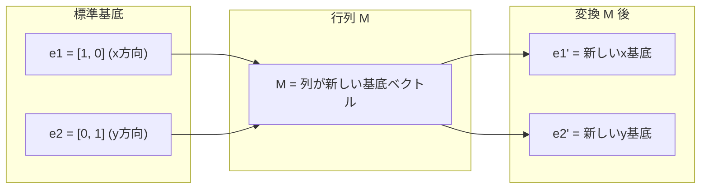
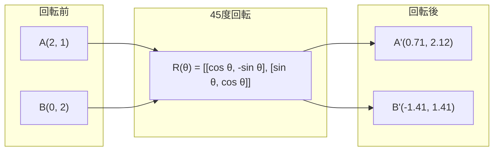
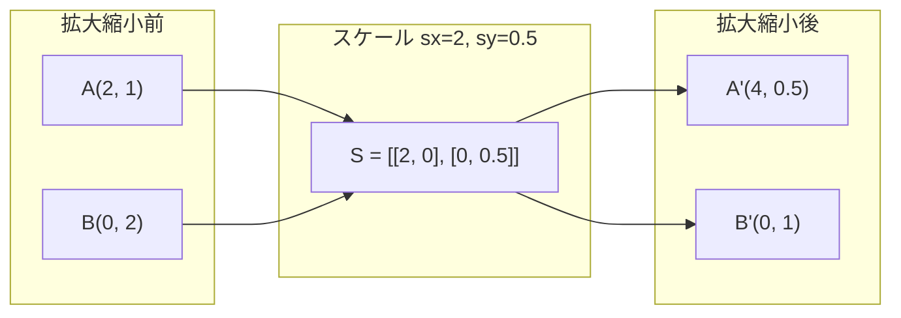
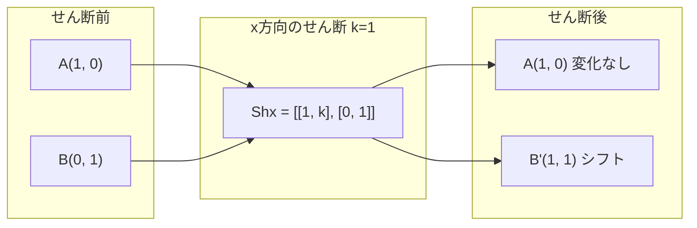
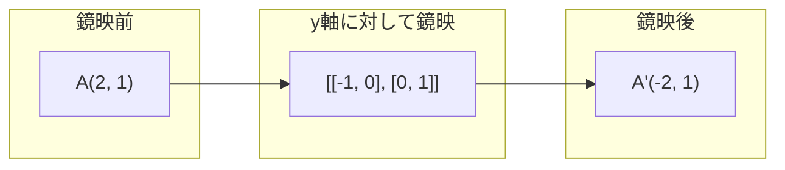
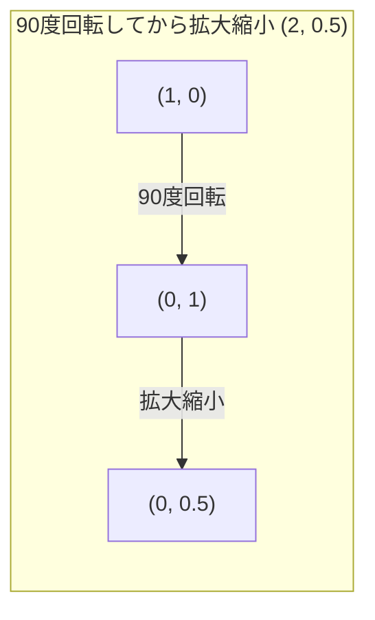
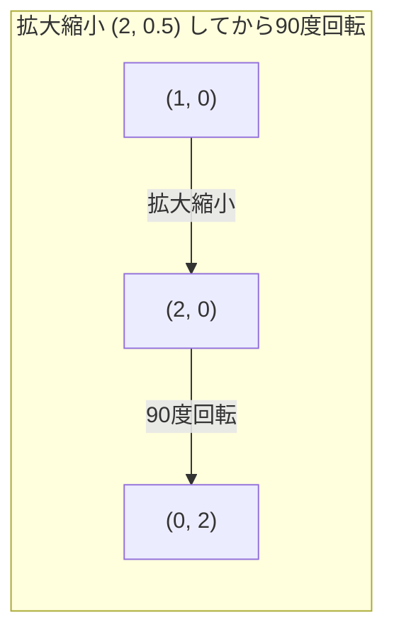

# 行列変換

> 行列は空間を変形する機械だ。すべての点に何をするかを学べば、変換全体が理解できる。


## 学習目標

- 回転、拡大縮小、せん断、鏡映の行列を作成し、2Dおよび3Dの点に適用する
- 行列積によって複数の変換を合成し、順序が重要であることを確認する
- 特性方程式から2×2行列の固有値と固有ベクトルを計算する
- 固有値がPCAの方向、RNNの安定性、スペクトルクラスタリングの動作を決定する理由を説明する

## 問題提起

PCAについて読むと「共分散行列の固有ベクトルを求める」という記述が出てくる。モデルの安定性について読むと「すべての固有値の絶対値が1未満であることを確認する」という記述が出てくる。データ拡張について読むと「ランダムな回転を適用する」という記述が出てくる。行列が空間に対して何をするかを幾何学的に理解するまで、これらは何も意味しない。

行列は数のグリッドではない。空間の機械だ。回転行列は点を回転させる。拡大縮小行列は点を伸縮させる。せん断行列は点を傾ける。ニューラルネットワークがデータに適用するすべての変換は、これらの操作の1つかその合成だ。このレッスンではこれらの操作を具体的に理解する。

## 概念

### 行列としての変換

2Dのすべての線形変換は2×2行列として書ける。行列は基底ベクトル [1, 0] と [0, 1] がどこに移動するかを正確に示す。残りはすべてそこから導かれる。



### 回転

角度 theta による2D回転は距離と角度を保つ。すべての点を円弧に沿って移動させる。



3Dでは、軸周りに回転する。各軸に独自の回転行列がある:

```
Rz(theta) = | cos  -sin  0 |     z軸周りの回転
            | sin   cos  0 |     (xy平面が回転、zは固定)
            |  0     0   1 |

Rx(theta) = | 1   0     0    |   x軸周りの回転
            | 0  cos  -sin   |   (yz平面が回転、xは固定)
            | 0  sin   cos   |

Ry(theta) = |  cos  0  sin |     y軸周りの回転
            |   0   1   0  |     (xz平面が回転、yは固定)
            | -sin  0  cos |
```

### 拡大縮小

拡大縮小は各軸に独立して伸縮する。



### せん断

せん断は一方の軸を固定したままもう一方を傾ける。長方形を平行四辺形に変える。



せん断行列:
- `Shx = [[1, k], [0, 1]]` は x を k*y だけシフト
- `Shy = [[1, 0], [k, 1]]` は y を k*x だけシフト

### 鏡映

鏡映は点を軸または直線に対して反転する。



鏡映行列:
- y軸に対する鏡映: `[[-1, 0], [0, 1]]`
- x軸に対する鏡映: `[[1, 0], [0, -1]]`

### 合成: 変換を連鎖させる

変換Aの後に変換Bを適用することは、行列を掛けることと同じだ: `result = B @ A @ point`。順序が重要だ。回転してから拡大縮小すると、拡大縮小してから回転するのとは異なる結果になる。



合成: `S @ R = [[0, -2], [0.5, 0]]`



合成: `R @ S = [[0, -0.5], [2, 0]]`

結果が異なる。行列積は可換ではない。

### 固有値と固有ベクトル

ほとんどのベクトルは行列に当たると方向が変わる。固有ベクトルは特別だ: 行列はそれをスケールするだけで、回転しない。スケール係数が固有値だ。

```
A @ v = lambda * v

v は固有ベクトル (生き残る方向)
lambda は固有値 (どれだけ伸びるか)

例: A = | 2  1 |
        | 1  2 |

固有値3の固有ベクトル [1, 1]:
  A @ [1,1] = [3, 3] = 3 * [1, 1]     (同じ方向、3倍にスケール)

固有値1の固有ベクトル [1, -1]:
  A @ [1,-1] = [1, -1] = 1 * [1, -1]  (同じ方向、変化なし)
```

行列は [1, 1] に沿って3倍空間を伸ばし、[1, -1] を変化させない。他のすべての方向はこの2つの混合だ。

### 固有分解

行列が n 個の線形独立な固有ベクトルを持つ場合、分解できる:

```
A = V @ D @ V^(-1)

V = 列が固有ベクトルの行列
D = 固有値を対角成分に持つ対角行列
V^(-1) = V の逆行列

これは次のことを意味する: 固有ベクトル座標に回転し、各軸に沿ってスケールし、戻す。
```

### 固有値が重要な理由

**PCA。** 共分散行列の固有ベクトルが主成分だ。固有値は各成分がどれだけの分散を捉えるかを示す。固有値でソートし、上位k個を保持すれば次元削減になる。

**安定性。** 再帰型ネットワークや動的システムでは、絶対値が1より大きい固有値は出力を爆発させる。1未満は消失させる。これが一言で表した勾配の消失/爆発問題だ。

**スペクトル法。** グラフニューラルネットワークは隣接行列の固有値を使う。スペクトルクラスタリングはラプラシアンの固有値を使う。固有ベクトルはグラフの構造を明らかにする。

### ボリュームスケール因子としての行列式

変換行列の行列式は、それがどれだけ面積（2D）や体積（3D）をスケールするかを示す。

```
det = 1:   面積保存（回転）
det = 2:   面積2倍
det = 0:   空間が低次元に潰れる（特異）
det = -1:  面積保存だが向きが反転（鏡映）

| det(回転) | = 1        （常に）
| det(拡大縮小 sx, sy) | = sx * sy
| det(せん断) | = 1           （面積保存）
| det(鏡映) | = -1     （向きが反転）
```

## 実装

### ステップ1: 変換行列をスクラッチから（Python）

```python
import math

def rotation_2d(theta):
    c, s = math.cos(theta), math.sin(theta)
    return [[c, -s], [s, c]]

def scaling_2d(sx, sy):
    return [[sx, 0], [0, sy]]

def shearing_2d(kx, ky):
    return [[1, kx], [ky, 1]]

def reflection_x():
    return [[1, 0], [0, -1]]

def reflection_y():
    return [[-1, 0], [0, 1]]

def mat_vec_mul(matrix, vector):
    return [
        sum(matrix[i][j] * vector[j] for j in range(len(vector)))
        for i in range(len(matrix))
    ]

def mat_mul(a, b):
    rows_a, cols_b = len(a), len(b[0])
    cols_a = len(a[0])
    return [
        [sum(a[i][k] * b[k][j] for k in range(cols_a)) for j in range(cols_b)]
        for i in range(rows_a)
    ]

point = [1.0, 0.0]
angle = math.pi / 4

rotated = mat_vec_mul(rotation_2d(angle), point)
print(f"(1,0) を45度回転: ({rotated[0]:.4f}, {rotated[1]:.4f})")

scaled = mat_vec_mul(scaling_2d(2, 3), [1.0, 1.0])
print(f"(1,1) を (2,3) でスケール: ({scaled[0]:.1f}, {scaled[1]:.1f})")

sheared = mat_vec_mul(shearing_2d(1, 0), [1.0, 1.0])
print(f"(1,1) を kx=1 でせん断: ({sheared[0]:.1f}, {sheared[1]:.1f})")

reflected = mat_vec_mul(reflection_y(), [2.0, 1.0])
print(f"(2,1) を y軸に対して鏡映: ({reflected[0]:.1f}, {reflected[1]:.1f})")
```

### ステップ2: 変換の合成

```python
R = rotation_2d(math.pi / 2)
S = scaling_2d(2, 0.5)

rotate_then_scale = mat_mul(S, R)
scale_then_rotate = mat_mul(R, S)

point = [1.0, 0.0]
result1 = mat_vec_mul(rotate_then_scale, point)
result2 = mat_vec_mul(scale_then_rotate, point)

print(f"90度回転してから拡大縮小: ({result1[0]:.2f}, {result1[1]:.2f})")
print(f"拡大縮小してから90度回転: ({result2[0]:.2f}, {result2[1]:.2f})")
print(f"同じ？ {result1 == result2}")
```

### ステップ3: 固有値をスクラッチから（2×2）

2×2行列 `[[a, b], [c, d]]` の固有値は特性方程式 `lambda^2 - (a+d)*lambda + (ad - bc) = 0` を解く。

```python
def eigenvalues_2x2(matrix):
    a, b = matrix[0]
    c, d = matrix[1]
    trace = a + d
    det = a * d - b * c
    discriminant = trace ** 2 - 4 * det
    if discriminant < 0:
        real = trace / 2
        imag = (-discriminant) ** 0.5 / 2
        return (complex(real, imag), complex(real, -imag))
    sqrt_disc = discriminant ** 0.5
    return ((trace + sqrt_disc) / 2, (trace - sqrt_disc) / 2)

def eigenvector_2x2(matrix, eigenvalue):
    a, b = matrix[0]
    c, d = matrix[1]
    if abs(b) > 1e-10:
        v = [b, eigenvalue - a]
    elif abs(c) > 1e-10:
        v = [eigenvalue - d, c]
    else:
        if abs(a - eigenvalue) < 1e-10:
            v = [1, 0]
        else:
            v = [0, 1]
    mag = (v[0] ** 2 + v[1] ** 2) ** 0.5
    return [v[0] / mag, v[1] / mag]

A = [[2, 1], [1, 2]]
vals = eigenvalues_2x2(A)
print(f"行列: {A}")
print(f"固有値: {vals[0]:.4f}, {vals[1]:.4f}")

for val in vals:
    vec = eigenvector_2x2(A, val)
    result = mat_vec_mul(A, vec)
    scaled = [val * vec[0], val * vec[1]]
    print(f"  lambda={val:.1f}, v={[round(x,4) for x in vec]}")
    print(f"    A@v = {[round(x,4) for x in result]}")
    print(f"    l*v = {[round(x,4) for x in scaled]}")
```

### ステップ4: ボリュームスケール因子としての行列式

```python
def det_2x2(matrix):
    return matrix[0][0] * matrix[1][1] - matrix[0][1] * matrix[1][0]

print(f"det(45度回転) = {det_2x2(rotation_2d(math.pi/4)):.4f}")
print(f"det(スケール 2,3)   = {det_2x2(scaling_2d(2, 3)):.1f}")
print(f"det(せん断 kx=1)  = {det_2x2(shearing_2d(1, 0)):.1f}")
print(f"det(y鏡映)   = {det_2x2(reflection_y()):.1f}")

singular = [[1, 2], [2, 4]]
print(f"det(特異行列)     = {det_2x2(singular):.1f}")
print("特異行列: 列が比例し、空間が直線に潰れる。")
```

## 実際に使う

NumPyは最適化されたルーチンですべてを処理する。

```python
import numpy as np

theta = np.pi / 4
R = np.array([[np.cos(theta), -np.sin(theta)],
              [np.sin(theta),  np.cos(theta)]])

point = np.array([1.0, 0.0])
print(f"(1,0) を45度回転: {R @ point}")

S = np.diag([2.0, 3.0])
composed = S @ R
print(f"回転(45)後に拡大縮小(2,3): {composed @ point}")

A = np.array([[2, 1], [1, 2]], dtype=float)
eigenvalues, eigenvectors = np.linalg.eig(A)
print(f"\n固有値: {eigenvalues}")
print(f"固有ベクトル（列）:\n{eigenvectors}")

for i in range(len(eigenvalues)):
    v = eigenvectors[:, i]
    lam = eigenvalues[i]
    print(f"  A @ v{i} = {A @ v}, lambda * v{i} = {lam * v}")

print(f"\ndet(R) = {np.linalg.det(R):.4f}")
print(f"det(S) = {np.linalg.det(S):.1f}")

B = np.array([[3, 1], [0, 2]], dtype=float)
vals, vecs = np.linalg.eig(B)
D = np.diag(vals)
V = vecs
reconstructed = V @ D @ np.linalg.inv(V)
print(f"\n固有分解 A = V @ D @ V^-1:")
print(f"元の行列:\n{B}")
print(f"再構成:\n{reconstructed}")
```

### NumPyによる3D回転

```python
def rotation_3d_z(theta):
    c, s = np.cos(theta), np.sin(theta)
    return np.array([[c, -s, 0], [s, c, 0], [0, 0, 1]])

def rotation_3d_x(theta):
    c, s = np.cos(theta), np.sin(theta)
    return np.array([[1, 0, 0], [0, c, -s], [0, s, c]])

point_3d = np.array([1.0, 0.0, 0.0])
rotated_z = rotation_3d_z(np.pi / 2) @ point_3d
rotated_x = rotation_3d_x(np.pi / 2) @ point_3d

print(f"\n3D点: {point_3d}")
print(f"z軸周りに90度回転: {np.round(rotated_z, 4)}")
print(f"x軸周りに90度回転: {np.round(rotated_x, 4)}")
```

## 納品物

このレッスンはPCA（フェーズ2）とニューラルネットワークの重み分析の幾何学的基盤を構築する。ここで作った固有値・固有ベクトルのコードは、本番のMLシステムにおける次元削減、スペクトルクラスタリング、安定性分析を動かすアルゴリズムと同じものだ。

## 演習

1. 回転、拡大縮小、せん断を単位正方形（頂点 [0,0]、[1,0]、[1,1]、[0,1]）に適用する。各変換後の頂点を出力せよ。回転が頂点間の距離を保つことを確認せよ。

2. 行列 [[4, 2], [1, 3]] の固有値を特性方程式を使って手計算で求める。次に、スクラッチで作った関数とNumPyで確認せよ。

3. 3つの変換（30度回転、[1.5, 0.8] でスケール、kx=0.3 でせん断）の合成を作り、円上に並べた8つの点に適用する。変換前後の座標を出力せよ。合成行列の行列式を計算し、それが各行列式の積と等しいことを確認せよ。

## キーワード

| 用語 | よく言われること | 実際の意味 |
|------|----------------|----------------------|
| 回転行列 | 「回転させる」 | 距離と角度を保ちながら点を円弧に沿って動かす直交行列。行列式は常に1。 |
| 拡大縮小行列 | 「大きくする」 | 各軸に独立して伸縮する対角行列。行列式はスケール因子の積。 |
| せん断行列 | 「傾ける」 | 一方の座標を他方に比例してシフトし、長方形を平行四辺形に変える行列。行列式は1。 |
| 鏡映 | 「鏡で反転」 | 軸または平面に対して空間を反転する行列。行列式は-1。 |
| 合成 | 「2つのことをする」 | 変換行列を掛けて操作を連鎖させる。順序が重要: B @ A は最初にAを、次にBを適用することを意味する。 |
| 固有ベクトル | 「特別な方向」 | 行列がスケールするだけで回転しない方向。変換の指紋。 |
| 固有値 | 「どれだけ伸びるか」 | 行列が固有ベクトルをスケールするスカラー因子。負（反転）または複素数（回転）になることもある。 |
| 固有分解 | 「行列を分解する」 | 行列を V @ D @ V^(-1) として書き、基本的なスケーリング方向と大きさに分解する。 |
| 行列式 | 「行列からの1つの数」 | 変換が面積（2D）や体積（3D）をスケールする因子。ゼロは変換が不可逆であることを意味する。 |
| 特性方程式 | 「固有値の出所」 | det(A - lambda * I) = 0。その根が固有値となる多項式。 |

## 参考資料

- [3Blue1Brown: 線形変換](https://www.3blue1brown.com/lessons/linear-transformations) -- 行列が空間を変形する様子の視覚的直感
- [3Blue1Brown: 固有ベクトルと固有値](https://www.3blue1brown.com/lessons/eigenvalues) -- 固有ベクトルが幾何学的に何を意味するかについての最高の視覚的説明
- [MIT 18.06 講義21: 固有値と固有ベクトル](https://ocw.mit.edu/courses/18-06-linear-algebra-spring-2010/) -- Gilbert Strangによる古典的な解説
