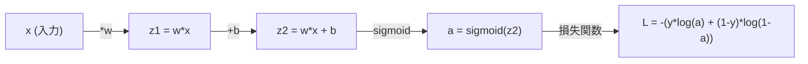
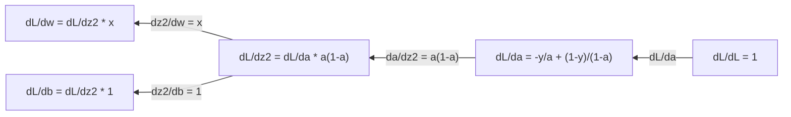
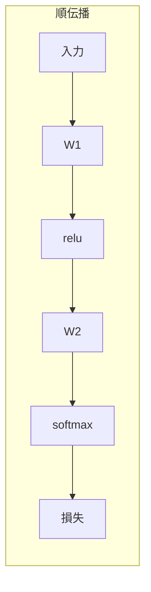
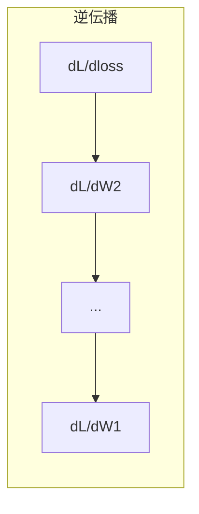

# 機械学習のための微積分

> 微分はどちらが下り坂かを教えてくれる。ニューラルネットワークが学習するために必要なのはそれだけだ。


## 学習目標

- よく使われるML関数（x^2、シグモイド、クロスエントロピー）の数値微分と解析微分を計算する
- 1次元と2次元の損失関数を最小化するために、スクラッチから勾配降下法を実装する
- 線形回帰モデルの勾配を導出し、手動の重み更新で学習させる
- ヘッセ行列、テイラー級数近似、そして最適化手法との関連を説明する

## 問題提起

数百万の重みを持つニューラルネットワークがある。各重みはつまみだ。モデルを少しだけ間違えにくくするために、すべてのつまみをどの方向に回せばよいかを見つける必要がある。微積分がその方向を教えてくれる。

微積分なしでは、ニューラルネットワークの学習はランダムな変更を試して運に任せることになる。微分があれば、各重みがエラーにどう影響するかが正確にわかる。毎回、すべてのつまみを正しい方向に回せる。

## 概念

### 微分とは何か

微分は変化率を測る。関数 y = f(x) において、微分 f'(x) は「xを微小量だけ変化させたとき、yはどれだけ変わるか？」を教える。

幾何学的には、微分はある点での接線の傾きだ。

**f(x) = x^2:**

| x | f(x) | f'(x) (傾き) |
|---|------|---------------|
| 0 | 0    | 0（平坦、底にある） |
| 1 | 1    | 2 |
| 2 | 4    | 4（この点での接線の傾き） |
| 3 | 9    | 6 |

x=2での傾きは4だ。xを少し右に動かすと、yはその量の約4倍変化する。x=0では傾きは0だ。ボウルの底にいる。

形式的な定義:

```
f'(x) = lim   f(x + h) - f(x)
        h->0  -----------------
                     h
```

コードでは、極限をスキップして非常に小さい h を使う。これが数値微分だ。

### 偏微分: 一度に1変数ずつ

実際の関数は多くの入力を持つ。ニューラルネットワークの損失は何千もの重みに依存する。偏微分は1変数以外をすべて定数として固定し、その1変数について微分を取る。

```
f(x, y) = x^2 + 3xy + y^2

df/dx = 2x + 3y     (y を定数として扱う)
df/dy = 3x + 2y     (x を定数として扱う)
```

各偏微分は「この1つの重みだけを変化させたとき、損失はどう変わるか？」という問いに答える。

### 勾配: すべての偏微分のベクトル

勾配はすべての偏微分を1つのベクトルにまとめる。関数 f(x, y, z) の勾配は:

```
grad f = [ df/dx, df/dy, df/dz ]
```

勾配は最急上昇の方向を指す。関数を最小化するには、逆方向に進む。

**f(x,y) = x^2 + y^2 の等高線プロット:**

この関数は同心円を等高線として持つボウル形をしている。最小値は (0, 0) だ。

| 点 | grad f | -grad f（降下方向） |
|-------|--------|----------------------------|
| (1, 1) | [2, 2]（上り坂、最小値から離れる） | [-2, -2]（下り坂、最小値に向かう） |
| (0, 0) | [0, 0]（平坦、最小値） | [0, 0] |

これが図で表した勾配降下法だ。勾配を計算し、符号を反転させ、一歩踏み出す。

### 最適化との関係

ニューラルネットワークの学習は最適化だ。モデルがどれだけ間違っているかを測る損失関数 L(w1, w2, ..., wn) がある。これを最小化したい。

```
勾配降下法の更新ルール:

  w_new = w_old - learning_rate * dL/dw

各重みについて:
  1. その重みに対する損失の偏微分を計算する
  2. その重みからその微分の小さい倍数を引く
  3. 繰り返す
```

学習率はステップサイズを制御する。大きすぎれば行き過ぎる。小さすぎればゆっくりしか進まない。

**損失の地形（1次元スライス）:**

損失関数 L(w) は重み w が変化するにつれて山と谷を持つ曲線を形成する。

| 特徴 | 説明 |
|---------|-------------|
| 大域的最小値 | 曲線全体の最も低い点——最良の解 |
| 局所的最小値 | 近傍より低いが全体の最低ではない谷 |
| 傾き | 勾配降下法はどの出発点からも傾きに沿って下る |

勾配降下法は傾きに沿って下る。局所的最小値に捕まることがあるが、高次元空間（数百万の重み）では実際にはほとんど問題にならない。

### 数値微分と解析微分

微分を計算するには2つの方法がある。

解析的: 微積分のルールを手で適用する。f(x) = x^2 について、微分は f'(x) = 2x だ。正確で速い。

数値的: 定義を使って近似する。小さい h について f(x+h) と f(x-h) を計算し、差を使う。

```
数値的（中心差分）:

f'(x) ~= f(x + h) - f(x - h)
          -----------------------
                  2h

h = 0.0001 が実際によく機能する
```

数値微分は遅いが任意の関数に使える。解析微分は速いが公式を導出する必要がある。ニューラルネットワークフレームワークは第3のアプローチを使う: 自動微分。これは機械的に正確な微分を計算する。フェーズ3でこれを見る。

### シンプルな関数の手計算による微分

MLで繰り返し登場する微分を示す。

```
関数            微分             使われる場所
--------        ----------       -------
f(x) = x^2     f'(x) = 2x      損失関数（MSE）
f(x) = wx + b  f'(w) = x        線形層（重みについての勾配）
                f'(b) = 1        線形層（バイアスについての勾配）
                f'(x) = w        線形層（入力についての勾配）
f(x) = e^x     f'(x) = e^x     ソフトマックス、アテンション
f(x) = ln(x)   f'(x) = 1/x     クロスエントロピー損失
f(x) = 1/(1+e^-x)  f'(x) = f(x)(1-f(x))   シグモイド活性化
```

f(x) = x^2 について:

```
f(x) = x^2    f'(x) = 2x

  x    f(x)   f'(x)   意味
  -2    4      -4      傾きが左に向いている（減少中）
  -1    1      -2      傾きが左に向いている（減少中）
   0    0       0      平坦（最小値！）
   1    1       2      傾きが右に向いている（増加中）
   2    4       4      傾きが右に向いている（増加中）
```

f(w) = wx + b、x=3、b=1 について:

```
f(w) = 3w + 1    f'(w) = 3

w についての微分は x そのものだ。
x が大きければ、w の小さな変化が出力の大きな変化を引き起こす。
```

### 連鎖律

関数が合成されるとき、連鎖律は微分の計算方法を教える。

```
y = f(g(x)) なら dy/dx = f'(g(x)) * g'(x)

例: y = (3x + 1)^2
  外側: f(u) = u^2       f'(u) = 2u
  内側: g(x) = 3x + 1    g'(x) = 3
  dy/dx = 2(3x + 1) * 3 = 6(3x + 1)
```

ニューラルネットワークは関数の連鎖だ: 入力 → 線形 → 活性化 → 線形 → 活性化 → 損失。誤差逆伝播は出力から入力に向かって繰り返し適用される連鎖律だ。それがアルゴリズム全体だ。

### ヘッセ行列

勾配は傾きを教える。ヘッセ行列は曲率を教える。

ヘッセ行列は2階偏微分の行列だ。関数 f(x1, x2, ..., xn) において、ヘッセ行列の (i, j) 要素は:

```
H[i][j] = d^2f / (dx_i * dx_j)
```

2変数関数 f(x, y) について:

```
H = | d^2f/dx^2    d^2f/dxdy |
    | d^2f/dydx    d^2f/dy^2 |
```

**臨界点（勾配=0）でのヘッセ行列が示すこと:**

| ヘッセ行列の性質 | 意味 | 曲面の例 |
|-----------------|---------|-----------------|
| 正定値（すべての固有値 > 0） | 局所的最小値 | 上向きのボウル |
| 負定値（すべての固有値 < 0） | 局所的最大値 | 下向きのボウル |
| 不定値（符号混在の固有値） | 鞍点 | 馬の鞍の形 |

**例:** f(x, y) = x^2 - y^2（鞍関数）

```
df/dx = 2x       df/dy = -2y
d^2f/dx^2 = 2    d^2f/dy^2 = -2    d^2f/dxdy = 0

H = | 2   0 |
    | 0  -2 |

固有値: 2 と -2（符号が混在）
--> (0, 0) は鞍点
```

f(x, y) = x^2 + y^2（ボウル）と比較すると:

```
H = | 2  0 |
    | 0  2 |

固有値: 2 と 2（両方正）
--> (0, 0) は局所的最小値
```

**MLにおけるヘッセ行列の重要性:**

ニュートン法は勾配降下法よりも優れた最適化ステップを取るためにヘッセ行列を使う。傾きに従うだけでなく、曲率を考慮する:

```
ニュートン法の更新:    w_new = w_old - H^(-1) * gradient
勾配降下法:   w_new = w_old - lr * gradient
```

ニュートン法は収束が速い。ヘッセ行列が勾配を「リスケール」するからだ——急な方向には小さいステップ、平坦な方向には大きいステップを取る。

問題: N 個のパラメータを持つニューラルネットワークのヘッセ行列は N×N だ。100万パラメータを持つモデルでは1兆要素の行列が必要になる。だから近似を使う。

| 方法 | 使うもの | コスト | 収束速度 |
|--------|-------------|------|-------------|
| 勾配降下法 | 1階微分のみ | O(N)/ステップ | 遅い（線形） |
| ニュートン法 | 完全なヘッセ行列 | O(N^3)/ステップ | 速い（2次） |
| L-BFGS | 勾配履歴からヘッセ近似 | O(N)/ステップ | 中程度（超線形） |
| Adam | パラメータごとの適応学習率（対角ヘッセ近似） | O(N)/ステップ | 中程度 |
| 自然勾配 | フィッシャー情報行列（統計的ヘッセ行列） | O(N^2)/ステップ | 速い |

実際のところ、深層学習のデフォルト最適化器はAdamだ。パラメータごとの勾配の実効平均と分散を追跡することで、2次情報を安く近似する。

### テイラー級数近似

任意の滑らかな関数は局所的に多項式で近似できる:

```
f(x + h) = f(x) + f'(x)*h + (1/2)*f''(x)*h^2 + (1/6)*f'''(x)*h^3 + ...
```

項を増やすほど近似は良くなるが、点 x の近くでのみ有効だ。

**テイラー級数がMLで重要な理由:**

- **1次テイラー = 勾配降下法。** f(x + h) ~ f(x) + f'(x)*h を使うと線形近似になる。勾配降下法はこの線形モデルを最小化して h = -lr * f'(x) を選ぶ。

- **2次テイラー = ニュートン法。** f(x + h) ~ f(x) + f'(x)*h + (1/2)*f''(x)*h^2 を使うと2次モデルになる。最小化すると h = -f'(x)/f''(x)——ニュートンのステップが得られる。

- **損失関数の設計。** MSEとクロスエントロピーは滑らかで、テイラー展開が良く振る舞う。これは偶然ではない。滑らかな損失は最適化を予測可能にする。

```
近似の次数          捉えるもの          最適化手法
-------------------    -----------------   -------------------
0次（定数）          値のみ             ランダム探索
1次（線形）          傾き               勾配降下法
2次（2次式）         曲率               ニュートン法
高次                 細かい構造          MLではほぼ使われない
```

重要な洞察: すべての勾配ベースの最適化は、局所的に損失関数を近似し、その近似の最小値にステップを進めることに他ならない。

### MLにおける積分

微分は変化率を教える。積分は蓄積量——曲線の下の面積——を計算する。

MLでは積分を手計算することはほぼないが、概念はいたるところに登場する:

**確率。** 密度 p(x) を持つ連続確率変数について:
```
P(a < X < b) = a から b まで p(x) dx の積分
```
aとbの間の確率密度曲線の下の面積がその区間に入る確率だ。

**期待値。** 確率で重み付けされた平均的な結果:
```
E[f(X)] = f(x) * p(x) dx の積分
```
データ分布にわたる期待損失は積分だ。学習はこれの経験的近似を最小化する。

**KLダイバージェンス。** 2つの分布がどれだけ異なるかを測る:
```
KL(p || q) = p(x) * log(p(x) / q(x)) dx の積分
```
VAE、知識蒸留、ベイズ推定で使われる。

**正規化定数。** ベイズ推定では:
```
p(w | data) = p(data | w) * p(w) / すべての可能なパラメータ値にわたる p(data | w) * p(w) の積分
```
分母はすべての可能なパラメータ値にわたる積分だ。これはしばしば計算困難なので、MCMCや変分推定といった近似を使う。

| 積分の概念 | MLにおける登場場所 |
|-----------------|----------------------|
| 曲線下の面積 | 密度関数からの確率 |
| 期待値 | 損失関数、リスク最小化 |
| KLダイバージェンス | VAE、方策最適化、蒸留 |
| 正規化 | ベイズ事後分布、ソフトマックスの分母 |
| 周辺尤度 | モデル比較、証拠の下限（ELBO） |

### 計算グラフにおける多変数連鎖律

連鎖律はスカラー関数の線形連鎖だけに適用されるわけではない。ニューラルネットワークでは変数が分岐し合流する。シンプルな順伝播で微分がどう流れるかを示す:



逆伝播は右から左へ勾配を計算する:



各矢印は局所的な微分を掛ける。任意のパラメータの勾配は、損失からそのパラメータまでのパスに沿ったすべての局所的微分の積だ。パスが分岐・合流する場合は寄与を足す（多変数連鎖律）。

これが誤差逆伝播のすべてだ: 計算グラフを通して出力から入力へ、組織的に適用された連鎖律。

### ヤコビアン行列

関数がベクトルをベクトルに写す場合（ニューラルネットワークの層のように）、その微分は行列だ。ヤコビアンは各出力の各入力に対するすべての偏微分を含む。

f: R^n -> R^m について、ヤコビアン J は m×n 行列だ:

| | x1 | x2 | ... | xn |
|---|---|---|---|---|
| f1 | df1/dx1 | df1/dx2 | ... | df1/dxn |
| f2 | df2/dx1 | df2/dx2 | ... | df2/dxn |
| ... | ... | ... | ... | ... |
| fm | dfm/dx1 | dfm/dx2 | ... | dfm/dxn |

ニューラルネットワークについてヤコビアンを手計算することはない。PyTorchが処理する。しかしその存在を知っていると、誤差逆伝播での形状を理解しやすい: 層が R^n を R^m に写すなら、そのヤコビアンは m×n だ。勾配はこの行列の転置を通って逆向きに流れる。

### ニューラルネットワークにとって重要な理由

ニューラルネットワークのすべての重みが勾配を持つ。勾配は損失を減らすためにその重みをどう調整するかを示す。





各重みの更新:
- `W1 = W1 - lr * dL/dW1`
- `W2 = W2 - lr * dL/dW2`

順伝播は予測と損失を計算する。逆伝播はすべての重みに対する損失の勾配を計算する。そして各重みが下り坂へ一歩踏み出す。これを数百万回繰り返す。それが深層学習だ。

## 実装

### ステップ1: 数値微分をスクラッチから

```python
def numerical_derivative(f, x, h=1e-7):
    return (f(x + h) - f(x - h)) / (2 * h)

def f(x):
    return x ** 2

for x in [-2, -1, 0, 1, 2]:
    numerical = numerical_derivative(f, x)
    analytical = 2 * x
    print(f"x={x:2d}  f'(x) 数値={numerical:.6f}  解析={analytical:.1f}")
```

数値微分は多くの小数点以下の桁で解析値と一致する。

### ステップ2: 偏微分と勾配

```python
def numerical_gradient(f, point, h=1e-7):
    gradient = []
    for i in range(len(point)):
        point_plus = list(point)
        point_minus = list(point)
        point_plus[i] += h
        point_minus[i] -= h
        partial = (f(point_plus) - f(point_minus)) / (2 * h)
        gradient.append(partial)
    return gradient

def f_multi(point):
    x, y = point
    return x**2 + 3*x*y + y**2

grad = numerical_gradient(f_multi, [1.0, 2.0])
print(f"(1,2) での数値勾配: {[f'{g:.4f}' for g in grad]}")
print(f"(1,2) での解析勾配: [2*1+3*2, 3*1+2*2] = [{2*1+3*2}, {3*1+2*2}]")
```

### ステップ3: f(x) = x^2 の最小値を求める勾配降下法

```python
x = 5.0
lr = 0.1
for step in range(20):
    grad = 2 * x
    x = x - lr * grad
    print(f"ステップ {step:2d}  x={x:8.4f}  f(x)={x**2:10.6f}")
```

x=5 から始めて、各ステップで x=0（最小値）に近づく。

### ステップ4: 2次元関数の勾配降下法

```python
def f_2d(point):
    x, y = point
    return x**2 + y**2

point = [4.0, 3.0]
lr = 0.1
for step in range(30):
    grad = numerical_gradient(f_2d, point)
    point = [p - lr * g for p, g in zip(point, grad)]
    loss = f_2d(point)
    if step % 5 == 0 or step == 29:
        print(f"ステップ {step:2d}  点=({point[0]:7.4f}, {point[1]:7.4f})  f={loss:.6f}")
```

### ステップ5: 数値微分と解析微分の比較

```python
import math

test_functions = [
    ("x^2",      lambda x: x**2,          lambda x: 2*x),
    ("x^3",      lambda x: x**3,          lambda x: 3*x**2),
    ("sin(x)",   lambda x: math.sin(x),   lambda x: math.cos(x)),
    ("e^x",      lambda x: math.exp(x),   lambda x: math.exp(x)),
    ("1/x",      lambda x: 1/x,           lambda x: -1/x**2),
]

x = 2.0
print(f"{'関数':<12} {'数値':>12} {'解析':>12} {'誤差':>12}")
print("-" * 50)
for name, f, df in test_functions:
    num = numerical_derivative(f, x)
    ana = df(x)
    err = abs(num - ana)
    print(f"{name:<12} {num:12.6f} {ana:12.6f} {err:12.2e}")
```

### ステップ6: ヘッセ行列の数値計算

```python
def hessian_2d(f, x, y, h=1e-5):
    fxx = (f(x + h, y) - 2 * f(x, y) + f(x - h, y)) / (h ** 2)
    fyy = (f(x, y + h) - 2 * f(x, y) + f(x, y - h)) / (h ** 2)
    fxy = (f(x + h, y + h) - f(x + h, y - h) - f(x - h, y + h) + f(x - h, y - h)) / (4 * h ** 2)
    return [[fxx, fxy], [fxy, fyy]]

def saddle(x, y):
    return x ** 2 - y ** 2

def bowl(x, y):
    return x ** 2 + y ** 2

H_saddle = hessian_2d(saddle, 0.0, 0.0)
H_bowl = hessian_2d(bowl, 0.0, 0.0)
print(f"鞍関数のヘッセ行列: {H_saddle}")  # [[2, 0], [0, -2]] -- 符号混在
print(f"ボウルのヘッセ行列:   {H_bowl}")    # [[2, 0], [0, 2]]  -- 両方正
```

鞍関数のヘッセ行列は固有値 2 と -2 を持つ（符号混在、鞍点を確認）。ボウルは固有値 2 と 2 を持つ（両方正、最小値を確認）。

### ステップ7: テイラー近似の実際

```python
import math

def taylor_approx(f, f_prime, f_double_prime, x0, h, order=2):
    result = f(x0)
    if order >= 1:
        result += f_prime(x0) * h
    if order >= 2:
        result += 0.5 * f_double_prime(x0) * h ** 2
    return result

x0 = 0.0
for h in [0.1, 0.5, 1.0, 2.0]:
    true_val = math.sin(h)
    t1 = taylor_approx(math.sin, math.cos, lambda x: -math.sin(x), x0, h, order=1)
    t2 = taylor_approx(math.sin, math.cos, lambda x: -math.sin(x), x0, h, order=2)
    print(f"h={h:.1f}  sin(h)={true_val:.4f}  1次={t1:.4f}  2次={t2:.4f}")
```

x0=0 の近くでは、sin(x) ~ x（1次テイラー）だ。近似は小さい h では優れているが、大きい h では壊れる。これが勾配降下法が小さい学習率で最もよく機能する理由だ——各ステップは線形近似が正確だと仮定する。

### ステップ8: ニューラルネットワークにとっての意味

```python
import random

random.seed(42)

w = random.gauss(0, 1)
b = random.gauss(0, 1)
lr = 0.01

xs = [1.0, 2.0, 3.0, 4.0, 5.0]
ys = [3.0, 5.0, 7.0, 9.0, 11.0]

for epoch in range(200):
    total_loss = 0
    dw = 0
    db = 0
    for x, y in zip(xs, ys):
        pred = w * x + b
        error = pred - y
        total_loss += error ** 2
        dw += 2 * error * x
        db += 2 * error
    dw /= len(xs)
    db /= len(xs)
    total_loss /= len(xs)
    w -= lr * dw
    b -= lr * db
    if epoch % 40 == 0 or epoch == 199:
        print(f"エポック {epoch:3d}  w={w:.4f}  b={b:.4f}  損失={total_loss:.6f}")

print(f"\n学習結果: y = {w:.2f}x + {b:.2f}")
print(f"正解:      y = 2x + 1")
```

すべての勾配ベースの学習ループはこのパターンに従う: 予測、損失計算、勾配計算、重み更新。

## 実際に使う

NumPyを使えば、同じ操作をより速く、より簡潔に:

```python
import numpy as np

x = np.array([1, 2, 3, 4, 5], dtype=float)
y = np.array([3, 5, 7, 9, 11], dtype=float)

w, b = np.random.randn(), np.random.randn()
lr = 0.01

for epoch in range(200):
    pred = w * x + b
    error = pred - y
    loss = np.mean(error ** 2)
    dw = np.mean(2 * error * x)
    db = np.mean(2 * error)
    w -= lr * dw
    b -= lr * db

print(f"学習結果: y = {w:.2f}x + {b:.2f}")
```

勾配降下法をスクラッチから作った。PyTorchは勾配計算を自動化するが、更新ループは同じだ。

## 演習

1. `numerical_derivative` を2回呼ぶことで `numerical_second_derivative(f, x)` を実装せよ。x=2 での x^3 の2階微分が 12 であることを確認せよ。
2. f(x, y) = (x - 3)^2 + (y + 1)^2 の最小値を勾配降下法で求めよ。(0, 0) から始めよ。答えは (3, -1) に収束するはずだ。
3. 勾配降下ループにモーメンタムを追加せよ: 過去の勾配を蓄積する速度ベクトルを保持する。f(x) = x^4 - 3x^2 について、モーメンタムありとなしで収束速度を比較せよ。

## キーワード

| 用語 | よく言われること | 実際の意味 |
|------|----------------|----------------------|
| 微分 | 「傾き」 | ある点での関数の変化率。入力の単位変化に対して出力がどれだけ変わるかを示す。 |
| 偏微分 | 「1変数についての微分」 | 他のすべての変数を定数に保ちながら、1変数についての微分。 |
| 勾配 | 「最急上昇の方向」 | すべての偏微分のベクトル。関数が最も速く増加する方向を指す。 |
| 勾配降下法 | 「下り坂を行く」 | 損失を減らすために、パラメータから勾配（学習率倍）を引く。ニューラルネットワーク学習の核心。 |
| 学習率 | 「ステップサイズ」 | 各勾配降下ステップの大きさを制御するスカラー。大きすぎれば発散、小さすぎれば収束が遅い。 |
| 連鎖律 | 「微分を掛ける」 | 合成関数を微分するルール: df/dx = df/dg * dg/dx。誤差逆伝播の数学的基礎。 |
| ヤコビアン | 「微分の行列」 | 関数がベクトルからベクトルへ写すとき、ヤコビアンは出力の入力に対するすべての偏微分の行列だ。 |
| 数値微分 | 「有限差分」 | 2つの近接点で関数を評価し、その間の傾きを計算することで微分を近似する。 |
| 誤差逆伝播 | 「逆向き自動微分」 | 連鎖律を使って出力から入力へ層ごとに勾配を計算する。ニューラルネットワークの学習方法。 |
| ヘッセ行列 | 「2階微分の行列」 | すべての2階偏微分の行列。関数の曲率を表す。臨界点での正定値ヘッセ行列は局所的最小値を意味する。 |
| テイラー級数 | 「多項式近似」 | 微分を使ってある点の近くで関数を近似する: f(x+h) ~ f(x) + f'(x)h + (1/2)f''(x)h^2 + ...。勾配降下法とニュートン法が機能する理由を理解する基礎。 |
| 積分 | 「曲線下の面積」 | ある範囲にわたる量の蓄積。MLでは積分が確率、期待値、KLダイバージェンスを定義する。 |

## 参考資料

- [3Blue1Brown: 微積分の本質](https://www.3blue1brown.com/topics/calculus) - 微分、積分、連鎖律の視覚的直感
- [Stanford CS231n: 誤差逆伝播](https://cs231n.github.io/optimization-2/) - ニューラルネットワーク層を通じた勾配の流れ
