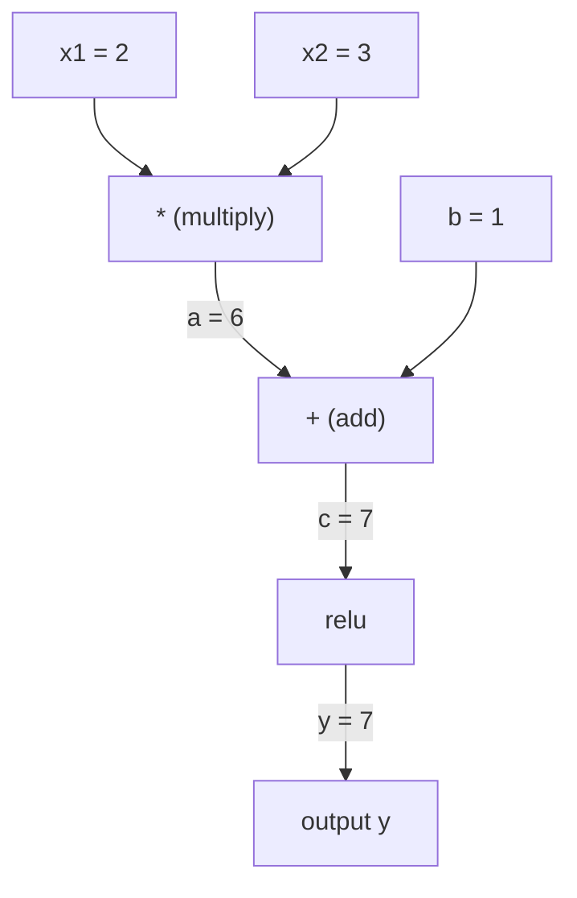
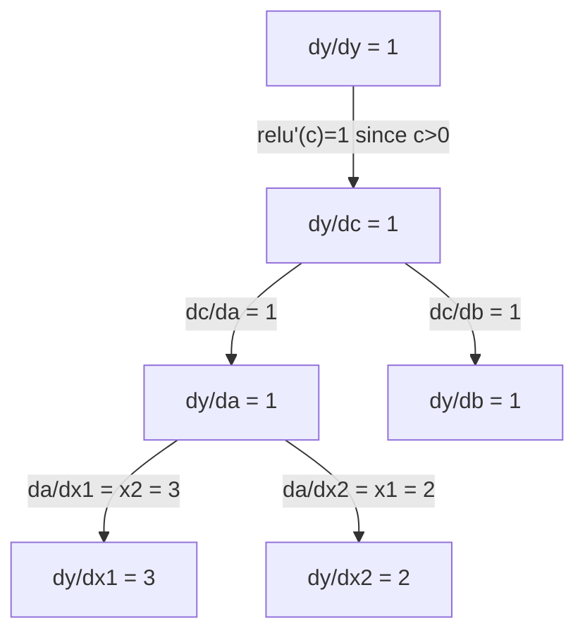

# 連鎖律と自動微分

> 連鎖律は、すべての学習するニューラルネットワークを動かすエンジンだ。


## 学習目標

- 演算を記録し逆モード自動微分で勾配を計算するミニマルな自動微分エンジン（Valueクラス）を構築する
- トポロジカルソートを使って計算グラフを通じた順伝播と逆伝播を実装する
- スクラッチで書いた自動微分エンジンだけを使ってXOR問題を解く多層パーセプトロンを構築・学習させる
- 数値的有限差分と勾配チェッキングで自動微分の正確さを検証する

## 問題提起

シンプルな関数の微分は計算できる。しかしニューラルネットワークはシンプルな関数ではない。行列積、バイアス加算、活性化関数適用、また行列積、ソフトマックス、クロスエントロピー損失——これらが何百も合成された関数だ。出力は関数の関数の関数だ。

ネットワークを学習させるには、すべての重みに対する損失の勾配が必要だ。何百万ものパラメータに対してこれを手作業で行うことは不可能だ。数値的に（有限差分で）行うのは遅すぎる。

連鎖律が数学を与えてくれる。自動微分がアルゴリズムを与えてくれる。この2つを合わせると、任意の関数合成を通じて、1回の順伝播に比例する時間で正確な勾配を計算できる。

PyTorch、TensorFlow、JAXはこうやって動いている。これのミニチュア版をスクラッチから作る。

## 概念

### 連鎖律

`y = f(g(x))` のとき、`y` の `x` に対する微分は:

```
dy/dx = dy/dg * dg/dx = f'(g(x)) * g'(x)
```

連鎖に沿って微分を掛け合わせる。各リンクがその局所的な微分を寄与する。

例: `y = sin(x^2)`

```
g(x) = x^2       g'(x) = 2x
f(g) = sin(g)     f'(g) = cos(g)

dy/dx = cos(x^2) * 2x
```

より深い合成では、連鎖が伸びる:

```
y = f(g(h(x)))

dy/dx = f'(g(h(x))) * g'(h(x)) * h'(x)
```

ニューラルネットワークの各層は、この連鎖の1つのリンクだ。

### 計算グラフ

計算グラフは連鎖律を視覚化する。すべての演算がノードになる。データは順方向にグラフを流れる。勾配は逆方向に流れる。

**順伝播（値を計算する）:**



**逆伝播（勾配を計算する）:**



逆伝播は各ノードで連鎖律を適用し、出力から入力へと勾配を伝播する。

### 順モードと逆モード

グラフを通じて連鎖律を適用するには2つの方法がある。

**順モード**は入力から始めて、微分を順方向に伝播する。`dx/dx = 1` を計算し、各演算を通じて伝播する。少ない入力と多くの出力がある場合に適している。

```
順モード: dx/dx = 1 をシードし、順方向に伝播

  x = 2       (dx/dx = 1)
  a = x^2     (da/dx = 2x = 4)
  y = sin(a)  (dy/dx = cos(a) * da/dx = cos(4) * 4 = -2.615)
```

**逆モード**は出力から始めて、勾配を逆方向に引き戻す。`dy/dy = 1` を計算し、各演算を逆順に伝播する。多くの入力と少ない出力がある場合に適している。

```
逆モード: dy/dy = 1 をシードし、逆方向に伝播

  y = sin(a)  (dy/dy = 1)
  a = x^2     (dy/da = cos(a) = cos(4) = -0.654)
  x = 2       (dy/dx = dy/da * da/dx = -0.654 * 4 = -2.615)
```

ニューラルネットワークは何百万もの入力（重み）と1つの出力（損失）を持つ。逆モードは1回の逆伝播ですべての勾配を計算する。これが誤差逆伝播で逆モードを使う理由だ。

| モード | シード | 方向 | 最適な場合 |
|------|------|-----------|-----------|
| 順モード | `dx_i/dx_i = 1` | 入力から出力 | 少ない入力、多くの出力 |
| 逆モード | `dy/dy = 1` | 出力から入力 | 多くの入力、少ない出力（ニューラルネット） |

### 順モードの双対数

順モードは双対数を使ってエレガントに実装できる。双対数は `a + b*epsilon` の形を持ち、`epsilon^2 = 0` だ。

```
双対数: (値, 微分)

(2, 1) は: 値は2、x に対する微分は1 を意味する

算術ルール:
  (a, a') + (b, b') = (a+b, a'+b')
  (a, a') * (b, b') = (a*b, a'*b + a*b')
  sin(a, a')         = (sin(a), cos(a)*a')
```

入力変数を微分1でシードする。微分はすべての演算を通じて自動的に伝播する。

### 自動微分エンジンの構築

自動微分エンジンには3つのものが必要だ:

1. **Valueのラッピング。** すべての数値を、その値と勾配を格納するオブジェクトでラップする。
2. **グラフの記録。** すべての演算が入力と局所勾配関数を記録する。
3. **逆伝播。** グラフをトポロジカルソートし、逆順に辿りながら各ノードで連鎖律を適用する。

これがPyTorchの `autograd` が行うことだ。`torch.Tensor` クラスは値をラップし、`requires_grad=True` のとき演算を記録し、`.backward()` を呼ぶと勾配を計算する。

### PyTorch Autogradの内部動作

PyTorchのコードを書くとき:

```python
x = torch.tensor(2.0, requires_grad=True)
y = x ** 2 + 3 * x + 1
y.backward()
print(x.grad)  # 7.0 = 2*x + 3 = 2*2 + 3
```

PyTorchは内部で:

1. `requires_grad=True` を持つ `x` の `Tensor` ノードを作成する
2. すべての演算（`**`、`*`、`+`）が新しいノードを作成し逆伝播関数を記録する
3. `y.backward()` が記録されたグラフを通じて逆モード自動微分を起動する
4. 各ノードの `grad_fn` が局所勾配を計算し親ノードに渡す
5. 勾配は（上書きではなく）加算によって `.grad` 属性に蓄積される

グラフは動的だ（define-by-run）。新しいグラフが順伝播のたびに構築される。これがPyTorchがモデル内の制御フロー（if/else、ループ）をサポートする理由だ。

## 実装

### ステップ1: Valueクラス

```python
class Value:
    def __init__(self, data, children=(), op=''):
        self.data = data
        self.grad = 0.0
        self._backward = lambda: None
        self._prev = set(children)
        self._op = op

    def __repr__(self):
        return f"Value(data={self.data:.4f}, grad={self.grad:.4f})"
```

すべての `Value` はその数値データ、勾配（初期はゼロ）、逆伝播関数、そして自分を生成した子ノードへのポインタを格納する。

### ステップ2: 勾配追跡付きの算術演算

```python
    def __add__(self, other):
        other = other if isinstance(other, Value) else Value(other)
        out = Value(self.data + other.data, (self, other), '+')
        def _backward():
            self.grad += out.grad
            other.grad += out.grad
        out._backward = _backward
        return out

    def __mul__(self, other):
        other = other if isinstance(other, Value) else Value(other)
        out = Value(self.data * other.data, (self, other), '*')
        def _backward():
            self.grad += other.data * out.grad
            other.grad += self.data * out.grad
        out._backward = _backward
        return out

    def relu(self):
        out = Value(max(0, self.data), (self,), 'relu')
        def _backward():
            self.grad += (1.0 if out.data > 0 else 0.0) * out.grad
        out._backward = _backward
        return out
```

各演算は局所勾配を計算し上流勾配（`out.grad`）を掛け合わせる方法を知るクロージャを作成する。`+=` はある値が複数の演算に使われるケースを処理する。

### ステップ3: 逆伝播

```python
    def backward(self):
        topo = []
        visited = set()
        def build_topo(v):
            if v not in visited:
                visited.add(v)
                for child in v._prev:
                    build_topo(child)
                topo.append(v)
        build_topo(self)

        self.grad = 1.0
        for v in reversed(topo):
            v._backward()
```

トポロジカルソートはすべてのノードの勾配が子ノードに伝播される前に完全に計算されることを保証する。シード勾配は1.0（dy/dy = 1）だ。

### ステップ4: 完全なエンジンのためのより多くの演算

基本的なValueクラスは加算、乗算、reluを処理する。本物の自動微分エンジンにはもっと必要だ。ニューラルネットワークを構築するために必要な演算を示す:

```python
    def __neg__(self):
        return self * -1

    def __sub__(self, other):
        return self + (-other)

    def __radd__(self, other):
        return self + other

    def __rmul__(self, other):
        return self * other

    def __rsub__(self, other):
        return other + (-self)

    def __pow__(self, n):
        out = Value(self.data ** n, (self,), f'**{n}')
        def _backward():
            self.grad += n * (self.data ** (n - 1)) * out.grad
        out._backward = _backward
        return out

    def __truediv__(self, other):
        return self * (other ** -1) if isinstance(other, Value) else self * (Value(other) ** -1)

    def exp(self):
        import math
        e = math.exp(self.data)
        out = Value(e, (self,), 'exp')
        def _backward():
            self.grad += e * out.grad
        out._backward = _backward
        return out

    def log(self):
        import math
        out = Value(math.log(self.data), (self,), 'log')
        def _backward():
            self.grad += (1.0 / self.data) * out.grad
        out._backward = _backward
        return out

    def tanh(self):
        import math
        t = math.tanh(self.data)
        out = Value(t, (self,), 'tanh')
        def _backward():
            self.grad += (1 - t ** 2) * out.grad
        out._backward = _backward
        return out
```

**各演算が重要な理由:**

| 演算 | 逆伝播ルール | 使われる場所 |
|-----------|--------------|---------|
| `__sub__` | addとnegを再利用 | 損失計算 (pred - target) |
| `__pow__` | n * x^(n-1) | 多項式活性化、MSE (error^2) |
| `__truediv__` | mulとpow(-1)を再利用 | 正規化、学習率スケーリング |
| `exp` | exp(x) * upstream | ソフトマックス、対数尤度 |
| `log` | (1/x) * upstream | クロスエントロピー損失、対数確率 |
| `tanh` | (1 - tanh^2) * upstream | 古典的な活性化関数 |

賢いところ: `__sub__` と `__truediv__` は既存の演算で定義されている。基礎のadd/mul/pow演算を通じて連鎖律が合成されるので、正しい勾配が自動的に得られる。

### ステップ5: スクラッチからのミニMLP

完全なValueクラスがあればニューラルネットワークを構築できる。PyTorchなし。NumPyなし。Valueと連鎖律だけだ。

```python
import random

class Neuron:
    def __init__(self, n_inputs):
        self.w = [Value(random.uniform(-1, 1)) for _ in range(n_inputs)]
        self.b = Value(0.0)

    def __call__(self, x):
        act = sum((wi * xi for wi, xi in zip(self.w, x)), self.b)
        return act.tanh()

    def parameters(self):
        return self.w + [self.b]

class Layer:
    def __init__(self, n_inputs, n_outputs):
        self.neurons = [Neuron(n_inputs) for _ in range(n_outputs)]

    def __call__(self, x):
        return [n(x) for n in self.neurons]

    def parameters(self):
        return [p for n in self.neurons for p in n.parameters()]

class MLP:
    def __init__(self, sizes):
        self.layers = [Layer(sizes[i], sizes[i+1]) for i in range(len(sizes)-1)]

    def __call__(self, x):
        for layer in self.layers:
            x = layer(x)
        return x[0] if len(x) == 1 else x

    def parameters(self):
        return [p for layer in self.layers for p in layer.parameters()]
```

`Neuron` は `tanh(w1*x1 + w2*x2 + ... + b)` を計算する。`Layer` はニューロンのリストだ。`MLP` は層を重ねる。すべての重みは `Value` なので、`loss.backward()` を呼ぶとすべてのパラメータに勾配が伝播する。

**XOR学習:**

```python
random.seed(42)
model = MLP([2, 4, 1])  # 2入力、4隠れニューロン、1出力

xs = [[0, 0], [0, 1], [1, 0], [1, 1]]
ys = [-1, 1, 1, -1]  # XORパターン（tanhのために-1/1を使用）

for step in range(100):
    preds = [model(x) for x in xs]
    loss = sum((p - y) ** 2 for p, y in zip(preds, ys))

    for p in model.parameters():
        p.grad = 0.0
    loss.backward()

    lr = 0.05
    for p in model.parameters():
        p.data -= lr * p.grad

    if step % 20 == 0:
        print(f"step {step:3d}  loss = {loss.data:.4f}")

print("\n学習後の予測:")
for x, y in zip(xs, ys):
    print(f"  入力={x}  目標={y:2d}  予測={model(x).data:6.3f}")
```

これがmicrogradだ。自動微分付きの完全なニューラルネットワーク学習ループを純粋なPythonで。すべての商用深層学習フレームワークは同じことを大規模に行っている。

### ステップ6: 勾配チェッキング

自動微分が正しいとどうやって確認するか？数値微分と比較する。これが勾配チェッキングだ。

```python
def gradient_check(build_expr, x_val, h=1e-7):
    x = Value(x_val)
    y = build_expr(x)
    y.backward()
    autodiff_grad = x.grad

    y_plus = build_expr(Value(x_val + h)).data
    y_minus = build_expr(Value(x_val - h)).data
    numerical_grad = (y_plus - y_minus) / (2 * h)

    diff = abs(autodiff_grad - numerical_grad)
    return autodiff_grad, numerical_grad, diff
```

複雑な式でテストする:

```python
def expr(x):
    return (x ** 3 + x * 2 + 1).tanh()

ad, num, diff = gradient_check(expr, 0.5)
print(f"自動微分:  {ad:.8f}")
print(f"数値:      {num:.8f}")
print(f"差分: {diff:.2e}")
# 差分は < 1e-5 であるべき
```

勾配チェッキングは新しい演算を実装するときに不可欠だ。逆伝播にバグがあれば、数値チェックが検知する。すべての本格的な深層学習実装は開発中に勾配チェックを実行する。

**勾配チェッキングをすべき場面:**

| 状況 | 勾配チェックが必要か？ |
|-----------|-------------------|
| 自動微分エンジンに新しい演算を追加する | はい、常に |
| 収束しない学習ループをデバッグする | はい、まず勾配を確認 |
| 本番学習 | いいえ、遅すぎる（パラメータあたり2倍の順伝播） |
| 自動微分コードの単体テスト | はい、自動化する |

### ステップ7: 手動計算との検証

```python
x1 = Value(2.0)
x2 = Value(3.0)
a = x1 * x2          # a = 6.0
b = a + Value(1.0)    # b = 7.0
y = b.relu()          # y = 7.0

y.backward()

print(f"y = {y.data}")          # 7.0
print(f"dy/dx1 = {x1.grad}")   # 3.0 (= x2)
print(f"dy/dx2 = {x2.grad}")   # 2.0 (= x1)
```

手動確認: `y = relu(x1*x2 + 1)`。`x1*x2 + 1 = 7 > 0` なのでreluは恒等写像だ。
`dy/dx1 = x2 = 3`。`dy/dx2 = x1 = 2`。エンジンは一致する。

## 実際に使う

### PyTorchとの検証

```python
import torch

x1 = torch.tensor(2.0, requires_grad=True)
x2 = torch.tensor(3.0, requires_grad=True)
a = x1 * x2
b = a + 1.0
y = torch.relu(b)
y.backward()

print(f"PyTorch dy/dx1 = {x1.grad.item()}")  # 3.0
print(f"PyTorch dy/dx2 = {x2.grad.item()}")  # 2.0
```

同じ勾配だ。数学が同じだから——連鎖律を使った逆モード自動微分——自分のエンジンはPyTorchと同じ結果を計算する。

### より複雑な式

```python
a = Value(2.0)
b = Value(-3.0)
c = Value(10.0)
f = (a * b + c).relu()  # relu(2*(-3) + 10) = relu(4) = 4

f.backward()
print(f"df/da = {a.grad}")  # -3.0 (= b)
print(f"df/db = {b.grad}")  #  2.0 (= a)
print(f"df/dc = {c.grad}")  #  1.0
```

## 演習

1. Valueクラスに `__pow__` を追加して `x ** n` を計算できるようにせよ。`x=2` での `d/dx(x^3)` が `12.0` であることを検証せよ。

2. 活性化関数として `tanh` を追加せよ。`tanh'(0) = 1` および `tanh'(2) = 0.0707`（近似）を検証せよ。

3. 単一ニューロン `y = relu(w1*x1 + w2*x2 + b)` の計算グラフを構築せよ。5つすべての勾配を計算し、PyTorchと検証せよ。

4. 双対数を使って順モード自動微分を実装せよ。`Dual` クラスを作成し、逆モードエンジンと同じ微分が得られることを検証せよ。

## キーワード

| 用語 | よく言われること | 実際の意味 |
|------|----------------|----------------------|
| 連鎖律 | 「微分を掛ける」 | 合成関数の微分は各関数の局所的微分の積に等しい。それぞれ適切な点で評価される。 |
| 計算グラフ | 「ネットワーク図」 | ノードが演算でエッジが値（順方向）または勾配（逆方向）を運ぶ有向非循環グラフ |
| 順モード | 「微分を前に押し出す」 | 入力から出力へ微分を伝播する自動微分。入力変数ごとに1回のパスが必要。 |
| 逆モード | 「誤差逆伝播」 | 出力から入力へ勾配を伝播する自動微分。出力変数ごとに1回のパスが必要。 |
| 自動微分 | 「自動勾配」 | 値への演算を記録し、グラフを構築し、連鎖律を使って正確な勾配を計算するシステム |
| 双対数 | 「値プラス微分」 | a + b*epsilon（epsilon^2 = 0）の形の数で、算術演算を通じて微分情報を運ぶ |
| トポロジカルソート | 「依存順序」 | すべてのノードがその依存関係の後に来るようにグラフノードを順序付けること。正確な勾配伝播に必要。 |
| 勾配蓄積 | 「上書きでなく加算」 | 値が複数の演算に入力される場合、その勾配はすべての入ってくる勾配寄与の和だ |
| 動的グラフ | 「define by run」 | 順伝播のたびに再構築される計算グラフ。モデル内でのPython制御フローを可能にする（PyTorchスタイル） |
| 勾配チェッキング | 「数値検証」 | 自動微分勾配を数値有限差分勾配と比較して正確さを検証する。デバッグに不可欠。 |
| MLP | 「多層パーセプトロン」 | 1つ以上の隠れ層を持つニューラルネットワーク。各ニューロンは重み付き和＋バイアスを計算し活性化関数を適用する。 |
| ニューロン | 「重み付き和＋活性化」 | 基本単位: 出力 = activation(w1*x1 + w2*x2 + ... + b)。重みとバイアスが学習可能なパラメータ。 |

## 参考資料

- [3Blue1Brown: 誤差逆伝播の微積分](https://www.youtube.com/watch?v=tIeHLnjs5U8) - ニューラルネットワークにおける連鎖律の視覚的説明
- [PyTorch Autogradの仕組み](https://pytorch.org/docs/stable/notes/autograd.html) - 実際のシステムの動作
- [Baydinら、機械学習における自動微分: 調査](https://arxiv.org/abs/1502.05767) - 包括的なリファレンス
