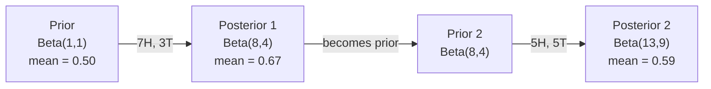

# ベイズの定理

> 確率は何を期待するかについてだ。ベイズの定理は何を学ぶかについてだ。


## 学習目標

- ベイズの定理を適用して事前確率、尤度、証拠から事後確率を計算する
- ラプラス平滑化と対数空間演算を使ってスクラッチからナイーブベイズテキスト分類器を構築する
- MLEとMAP推定を比較し、MAPがL2正則化に対応することを説明する
- A/Bテストにベータ二項共役事前分布を使って逐次的ベイズ更新を実装する

## 問題提起

ある医療検査は99%の精度を持つ。検査結果が陽性だった。実際に病気である確率はどのくらいか？

ほとんどの人は99%と言う。正解は病気がどれだけ稀かによる。10,000人に1人がかかる病気なら、陽性の結果はたった約1%の確率でしか病気でないことを意味しない。残り99%の陽性は健康な人からの偽陽性だ。

これはひっかけ問題ではない。これがベイズの定理だ。すべてのスパムフィルター、すべての医療診断、不確実性を定量化するすべての機械学習モデルはこの推論を使っている。信念から始める。証拠を見る。更新する。

これを理解せずにMLシステムを構築すると、モデルの出力を誤解し、閾値を誤って設定し、過信した予測を世に出してしまう。

## 概念

### 結合確率からベイズへ

レッスン06から、条件付き確率はすでに知っている:

```
P(A|B) = P(A かつ B) / P(B)
```

そして対称的に:

```
P(B|A) = P(A かつ B) / P(A)
```

どちらの式も同じ分子 P(A かつ B) を持つ。等しいとおいて整理すると:

```
P(A かつ B) = P(A|B) * P(B) = P(B|A) * P(A)

したがって:

P(A|B) = P(B|A) * P(A) / P(B)
```

それがベイズの定理だ。4つの量、1つの方程式。

### 4つの部分

| 部分 | 名前 | 意味 |
|------|------|---------------|
| P(A\|B) | 事後確率 | 証拠Bを見た後のAについての更新された信念 |
| P(B\|A) | 尤度 | Aが真のときに証拠Bがどれだけ確からしいか |
| P(A) | 事前確率 | 証拠を見る前のAについての信念 |
| P(B) | 証拠 | すべての可能性のもとでBを見る全確率 |

証拠項 P(B) は正規化因子として機能する。全確率の法則を使って展開できる:

```
P(B) = P(B|A) * P(A) + P(B|not A) * P(not A)
```

### 医療検査の例

ある病気は10,000人に1人がかかる。検査は99%の精度を持つ（病気の99%を検出、1%の時間で偽陽性を出す）。

```
P(病気)          = 0.0001     （事前確率: 病気は稀）
P(陽性|病気) = 0.99       （尤度: 検査が検出する）
P(陽性|健康) = 0.01    （偽陽性率）

P(陽性) = P(陽性|病気) * P(病気) + P(陽性|健康) * P(健康)
            = 0.99 * 0.0001 + 0.01 * 0.9999
            = 0.000099 + 0.009999
            = 0.010098

P(病気|陽性) = P(陽性|病気) * P(病気) / P(陽性)
                 = 0.99 * 0.0001 / 0.010098
                 = 0.0098
                 = 0.98%
```

1%未満だ。事前確率が支配する。病態が稀なとき、精度の高い検査でも主に偽陽性を生み出す。これが医師が確認検査を命じる理由だ。

### スパムフィルターの例

「lottery」という単語を含むメールが届いた。これはスパムか？

```
P(スパム)                = 0.3      （メールの30%はスパム）
P("lottery"|スパム)      = 0.05     （スパムメールの5%が"lottery"を含む）
P("lottery"|非スパム)  = 0.001    （正当なメールの0.1%が"lottery"を含む）

P("lottery") = 0.05 * 0.3 + 0.001 * 0.7
             = 0.015 + 0.0007
             = 0.0157

P(スパム|"lottery") = 0.05 * 0.3 / 0.0157
                  = 0.955
                  = 95.5%
```

1単語で確率が30%から95.5%に変わる。実際のスパムフィルターは何百もの単語に同時にベイズを適用する。

### ナイーブベイズ: 独立性の仮定

ナイーブベイズは、クラスが与えられたときすべての特徴が条件付き独立であると仮定することで、これを複数の特徴に拡張する:

```
P(クラス | 特徴1, 特徴2, ..., 特徴n)
  = P(クラス) * P(特徴1|クラス) * P(特徴2|クラス) * ... * P(特徴n|クラス)
    / P(特徴1, 特徴2, ..., 特徴n)
```

「ナイーブ」な部分は独立性の仮定だ。テキストでは単語の出現は独立でない（"New"と"York"は相関する）。しかし分類器はクラスを順位付けするだけでよく、較正された確率を出す必要がないため、この仮定は実際には驚くほどうまく機能する。

分母はすべてのクラスで同じなので、省略して単に分子を比較できる:

```
スコア(クラス) = P(クラス) * P(特徴i | クラス) の積
```

最も高いスコアを持つクラスを選ぶ。

### 最尤推定（MLE）

訓練データから P(特徴|クラス) をどうやって得るか？数える。

```
P("free"|スパム) = (スパムメールの中で"free"を含む数) / (スパムメールの合計)
```

これがMLE: 観測データを最も確からしくするパラメータ値を選ぶ。尤度関数を最大化する。離散的なカウントではこれは相対頻度に帰着する。

問題: 訓練中にスパムで一度も現れない単語があると、MLEはそれに確率ゼロを与える。1つの未見の単語が全体の積をゼロにする。ラプラス平滑化でこれを解決する:

```
P(単語|クラス) = (count(単語, クラス) + 1) / (クラス内の総単語数 + 語彙サイズ)
```

すべてのカウントに1を加えることで確率がゼロになることを防ぐ。

### 最大事後確率推定（MAP）

MLEは問う: どのパラメータが P(データ|パラメータ) を最大化するか？

MAPは問う: どのパラメータが P(パラメータ|データ) を最大化するか？

ベイズの定理より:

```
P(パラメータ|データ) ∝ P(データ|パラメータ) * P(パラメータ)
```

MAPはパラメータ自体への事前分布を加える。パラメータが小さいべきと信じるなら、大きな値にペナルティを与える事前分布としてそれをエンコードする。これはMLにおけるL2正則化と全く同じだ。リッジ回帰の「リッジ」ペナルティは文字通り重みへのガウス事前分布だ。

| 推定法 | 最適化 | MLでの等価物 |
|------------|-----------|---------------|
| MLE | P(データ\|パラメータ) | 正則化なし学習 |
| MAP | P(データ\|パラメータ) * P(パラメータ) | L2 / L1 正則化 |

### ベイズ vs 頻度主義: 実際の違い

頻度主義者はパラメータを固定された未知数として扱う。彼らは問う:「この実験を何度も繰り返したら何が起きるか？」

ベイズ主義者はパラメータを分布として扱う。彼らは問う:「観察したことを踏まえて、パラメータについて何を信じるか？」

MLシステムを構築する際の実際の違い:

| 側面 | 頻度主義 | ベイズ主義 |
|--------|-------------|----------|
| 出力 | 点推定 | 値の分布 |
| 不確実性 | 信頼区間（手続きについて） | 信用区間（パラメータについて） |
| 少ないデータ | 過学習しうる | 事前分布が正則化として機能 |
| 計算 | 通常速い | しばしばサンプリングが必要（MCMC） |

ほとんどの本番MLは頻度主義だ（SGD、点推定）。ベイズ手法は較正された不確実性が必要なとき（医療的意思決定、安全クリティカルなシステム）やデータが少ないとき（少数ショット学習、コールドスタート）に輝く。

### MLにとってベイズ的思考が重要な理由

関連は比喩以上に深い:

**事前分布は正則化だ。** 重みへのガウス事前分布はL2正則化だ。ラプラス事前分布はL1だ。正則化項を加えるたびに、どのパラメータ値を期待するかについてベイズ的な発言をしている。

**事後分布は不確実性だ。** 単一の予測確率はその推定に対してモデルがどれだけ確信しているかについて何も教えない。ベイズ手法は分布を与える:「P(スパム)は0.8から0.95の間だと思う」。

**ベイズ更新はオンライン学習だ。** 今日の事後確率が明日の事前確率になる。モデルが新しいデータを見ると、最初からやり直さずに信念を逐次的に更新する。

**モデル比較はベイズ的だ。** ベイズ情報量規準（BIC）、周辺尤度、ベイズ因子はすべてベイズ推論を使って過学習なしにモデルを選択する。

## 実装

### ステップ1: ベイズの定理関数

```python
def bayes(prior, likelihood, false_positive_rate):
    evidence = likelihood * prior + false_positive_rate * (1 - prior)
    posterior = likelihood * prior / evidence
    return posterior

result = bayes(prior=0.0001, likelihood=0.99, false_positive_rate=0.01)
print(f"P(病気|陽性) = {result:.4f}")
```

### ステップ2: ナイーブベイズ分類器

```python
import math
from collections import defaultdict

class NaiveBayes:
    def __init__(self, smoothing=1.0):
        self.smoothing = smoothing
        self.class_counts = defaultdict(int)
        self.word_counts = defaultdict(lambda: defaultdict(int))
        self.class_word_totals = defaultdict(int)
        self.vocab = set()

    def train(self, documents, labels):
        for doc, label in zip(documents, labels):
            self.class_counts[label] += 1
            words = doc.lower().split()
            for word in words:
                self.word_counts[label][word] += 1
                self.class_word_totals[label] += 1
                self.vocab.add(word)

    def predict(self, document):
        words = document.lower().split()
        total_docs = sum(self.class_counts.values())
        vocab_size = len(self.vocab)
        best_class = None
        best_score = float("-inf")
        for cls in self.class_counts:
            score = math.log(self.class_counts[cls] / total_docs)
            for word in words:
                count = self.word_counts[cls].get(word, 0)
                total = self.class_word_totals[cls]
                score += math.log((count + self.smoothing) / (total + self.smoothing * vocab_size))
            if score > best_score:
                best_score = score
                best_class = cls
        return best_class
```

対数確率がアンダーフローを防ぐ。多くの小さな確率を掛け合わせると浮動小数点では表現できない小さな数が生まれる。対数確率を足し合わせることは数値的に安定で数学的に等価だ。

### ステップ3: スパムデータで学習

```python
train_docs = [
    "win free money now",
    "free lottery ticket winner",
    "claim your prize today free",
    "urgent offer free cash",
    "congratulations you won free",
    "meeting tomorrow at noon",
    "project update attached",
    "can we schedule a call",
    "quarterly report review",
    "lunch on thursday sounds good",
    "team standup notes attached",
    "please review the pull request",
]

train_labels = [
    "spam", "spam", "spam", "spam", "spam",
    "ham", "ham", "ham", "ham", "ham", "ham", "ham",
]

classifier = NaiveBayes()
classifier.train(train_docs, train_labels)

test_messages = [
    "free money waiting for you",
    "meeting rescheduled to friday",
    "you won a free prize",
    "please review the attached report",
]

for msg in test_messages:
    print(f"  '{msg}' -> {classifier.predict(msg)}")
```

### ステップ4: 学習した確率を確認する

```python
def show_top_words(classifier, cls, n=5):
    vocab_size = len(classifier.vocab)
    total = classifier.class_word_totals[cls]
    probs = {}
    for word in classifier.vocab:
        count = classifier.word_counts[cls].get(word, 0)
        probs[word] = (count + classifier.smoothing) / (total + classifier.smoothing * vocab_size)
    sorted_words = sorted(probs.items(), key=lambda x: x[1], reverse=True)
    for word, prob in sorted_words[:n]:
        print(f"    {word}: {prob:.4f}")

print("\nスパムの上位単語:")
show_top_words(classifier, "spam")
print("\nハムの上位単語:")
show_top_words(classifier, "ham")
```

## 実際に使う

scikit-learnには本番対応のナイーブベイズ実装が含まれている:

```python
from sklearn.feature_extraction.text import CountVectorizer
from sklearn.naive_bayes import MultinomialNB
from sklearn.metrics import classification_report

vectorizer = CountVectorizer()
X_train = vectorizer.fit_transform(train_docs)
clf = MultinomialNB()
clf.fit(X_train, train_labels)

X_test = vectorizer.transform(test_messages)
predictions = clf.predict(X_test)
for msg, pred in zip(test_messages, predictions):
    print(f"  '{msg}' -> {pred}")
```

同じアルゴリズムだ。CountVectorizerはトークン化と語彙構築を処理する。MultinomialNBは内部で平滑化と対数確率を処理する。スクラッチで作ったバージョンは同じことを40行でやる。

### 共役事前分布

事前分布と事後分布が同じ分布族に属するとき、その事前分布は「共役」と呼ばれる。これにより数値積分なしに閉形式の事後分布が得られるため、ベイズ更新が代数的にきれいになる。

| 尤度 | 共役事前分布 | 事後分布 | 例 |
|-----------|----------------|-----------|---------|
| ベルヌーイ | Beta(a, b) | Beta(a + 成功, b + 失敗) | コインの偏り推定 |
| 正規（既知の分散） | Normal(mu_0, sigma_0) | Normal(加重平均, より小さい分散) | センサーキャリブレーション |
| ポアソン | Gamma(a, b) | Gamma(a + カウントの和, b + n) | 到着率のモデリング |
| 多項 | Dirichlet(alpha) | Dirichlet(alpha + カウント) | トピックモデリング、言語モデル |

これが重要な理由: 共役事前分布なしでは、事後分布を近似するためにモンテカルロサンプリングや変分推定が必要になる。共役事前分布では、2つの数を更新するだけだ。

ベータ分布は実際に最もよく使われる共役事前分布だ。Beta(a, b) は確率パラメータについての信念を表す。平均は a/(a+b) だ。a+b が大きいほど分布が集中（確信）している。

ベータ事前分布の特殊ケース:
- Beta(1, 1) = 一様。パラメータについて意見がない。
- Beta(10, 10) = 0.5付近でピーク。パラメータが0.5付近だと強く信じる。
- Beta(1, 10) = 0に向かって歪む。パラメータが小さいと信じる。

更新ルールは非常にシンプルだ:

```
事前分布:     Beta(a, b)
データ:      s 回の成功、f 回の失敗
事後分布: Beta(a + s, b + f)
```

積分なし。サンプリングなし。加算だけだ。

### 逐次的ベイズ更新

ベイズ推定は本質的に逐次的だ。今日の事後確率が明日の事前確率になる。これがすべての歴史データを再処理せずに実際のシステムが逐次的に学習する方法だ。

具体例: コインが公正かどうかを推定する。

**1日目: データなし。**
Beta(1, 1) から始める——一様事前分布。意見がない。
- 事前平均: 0.5
- [0, 1] にわたって平坦

**2日目: 表7回、裏3回を観察。**
事後分布 = Beta(1 + 7, 1 + 3) = Beta(8, 4)
- 事後平均: 8/12 = 0.667
- 証拠からコインが表に偏っていることが示唆される

**3日目: さらに表5回、裏5回を観察。**
昨日の事後分布を今日の事前分布として使う。
事後分布 = Beta(8 + 5, 4 + 5) = Beta(13, 9)
- 事後平均: 13/22 = 0.591
- バランスのとれた新しいデータが推定を0.5に引き戻した



観察の順序は重要ではない。Beta(1,1)を表12回と裏8回のすべてで一度に更新するとBeta(13, 9)になる——同じ結果だ。逐次的更新とバッチ更新は数学的に等価だ。しかし逐次的更新は生データを保存せずに各ステップで意思決定を可能にする。

これが本番MLシステムにおけるオンライン学習の基礎だ。バンディット問題のトンプソンサンプリング、逐次的推薦システム、ストリーミング異常検出器はすべてこのパターンを使う。

### A/Bテストとの関連

A/Bテストは見かけを変えたベイズ推定だ。

設定: 2つのボタンの色をテストしている。バリアントA（青）とバリアントB（緑）。どちらがクリックが多いかを知りたい。

ベイズA/Bテスト:

1. **事前分布。** 両方のバリアントに Beta(1, 1) から始める。事前の好みはない。
2. **データ。** バリアントA: 1000ビューのうち50クリック。バリアントB: 1000ビューのうち65クリック。
3. **事後分布。**
   - A: Beta(1 + 50, 1 + 950) = Beta(51, 951)。平均 = 0.051
   - B: Beta(1 + 65, 1 + 935) = Beta(66, 936)。平均 = 0.066
4. **決定。** P(B > A) を計算する——BのコンバージョンレートがAより高い確率。

P(B > A) を解析的に計算するのは難しい。しかしモンテカルロが簡単にする:

```
1. Beta(51, 951) から100,000サンプル引く  -> samples_A
2. Beta(66, 936) から100,000サンプル引く  -> samples_B
3. P(B > A) = B > A のサンプルの割合
```

P(B > A) > 0.95 ならバリアントBを採用する。0.05から0.95の間なら引き続きデータを収集する。P(B > A) < 0.05 ならバリアントAを採用する。

頻度主義A/Bテストに対する利点:
- 直接的な確率の発言が得られる:「Bの方が良い確率が97%だ」
- p値の混乱がない。「帰無仮説を棄却できない」という回りくどさもない。
- 偽陽性率を膨らませずにいつでも結果を確認できる（「のぞき見問題」がない）
- 事前知識を組み込める（例: 過去のテストからコンバージョン率は通常3〜8%）

| 側面 | 頻度主義A/B | ベイズA/B |
|--------|----------------|--------------|
| 出力 | p値 | P(B > A) |
| 解釈 | 「A=Bならこのデータはどれくらいびっくりするものか？」 | 「BがAより良い確率はどのくらいか？」 |
| 早期停止 | 偽陽性を増やす | 任意の時点で安全（適切に選ばれた事前分布と正確に指定されたモデルがある場合） |
| 事前知識 | 使われない | ベータ事前分布としてエンコード |
| 決定ルール | p < 0.05 | P(B > A) > 閾値 |

## 演習

1. **複数回の検査。** 患者が独立した2回の検査で陽性（どちらも99%の精度、有病率1万人に1人）。両方の検査後のP(病気)は？1回目の検査の事後確率を2回目の事前確率として使う。

2. **平滑化の影響。** 平滑化値0.01、0.1、1.0、10.0でスパム分類器を実行せよ。上位単語の確率はどう変わるか？平滑化=0でハムにのみ現れる単語があるとどうなるか？

3. **特徴を追加する。** NaiveBayesクラスを拡張してメッセージの長さ（短い/長い）も単語カウントと並んで特徴として使う。訓練データからP(短い|スパム)とP(短い|ハム)を推定し、予測スコアに組み込む。

4. **手作業でMAP。** 観察データ（10回のコイン投げで7回表）が与えられたとき、Beta(2,2)の事前分布を使ってバイアスのMAP推定を計算せよ。MLE推定（7/10）と比較せよ。

## キーワード

| 用語 | よく言われること | 実際の意味 |
|------|----------------|----------------------|
| 事前確率 | 「初期の推測」 | 証拠を観察する前の P(仮説)。MLでは正則化項。 |
| 尤度 | 「データがどれだけ当てはまるか」 | P(証拠\|仮説)。特定の仮説のもとで観察データがどれだけ確からしいか。 |
| 事後確率 | 「更新された信念」 | P(仮説\|証拠)。事前確率に尤度を掛けて正規化したもの。 |
| 証拠 | 「正規化定数」 | すべての仮説にわたるP(データ)。事後確率の和が1になることを保証する。 |
| ナイーブベイズ | 「シンプルなテキスト分類器」 | クラスが与えられたとき特徴が独立だと仮定する分類器。誤った仮定にもかかわらずうまく機能する。 |
| ラプラス平滑化 | 「加算1平滑化」 | 未見のデータからのゼロ確率を防ぐために、すべての特徴に小さなカウントを加える。 |
| MLE | 「頻度を使うだけ」 | P(データ\|パラメータ) を最大化するパラメータを選ぶ。事前分布なし。少ないデータでは過学習しうる。 |
| MAP | 「事前分布付きMLE」 | P(データ\|パラメータ) * P(パラメータ) を最大化するパラメータを選ぶ。正則化されたMLEと等価。 |
| 対数確率 | 「対数空間で作業する」 | 多くの小さな数を掛け合わせるときの浮動小数点アンダーフローを避けるために P の代わりに log(P) を使う。 |
| 偽陽性 | 「間違いのアラーム」 | 検査は陽性と言うが、真の状態は陰性。基準率の誤謬を引き起こす。 |

## 参考資料

- [3Blue1Brown: ベイズの定理](https://www.youtube.com/watch?v=HZGCoVF3YvM) - 医療検査の例を使った視覚的説明
- [Stanford CS229: 生成的学習アルゴリズム](https://cs229.stanford.edu/notes2022fall/cs229-notes2.pdf) - ナイーブベイズと識別モデルとの関連
- [Think Bayes](https://greenteapress.com/wp/think-bayes/) - 無料の本、Pythonコードによるベイズ統計
- [scikit-learn ナイーブベイズ](https://scikit-learn.org/stable/modules/naive_bayes.html) - 本番実装と各バリアントをいつ使うか
