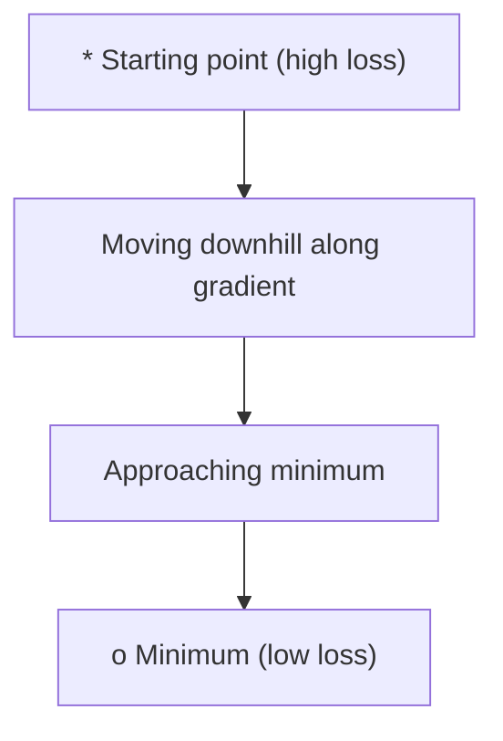
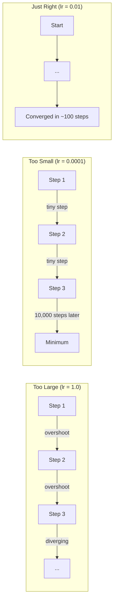
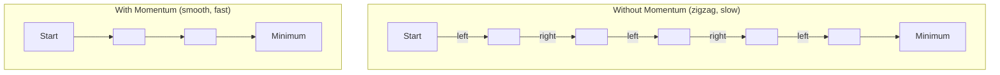
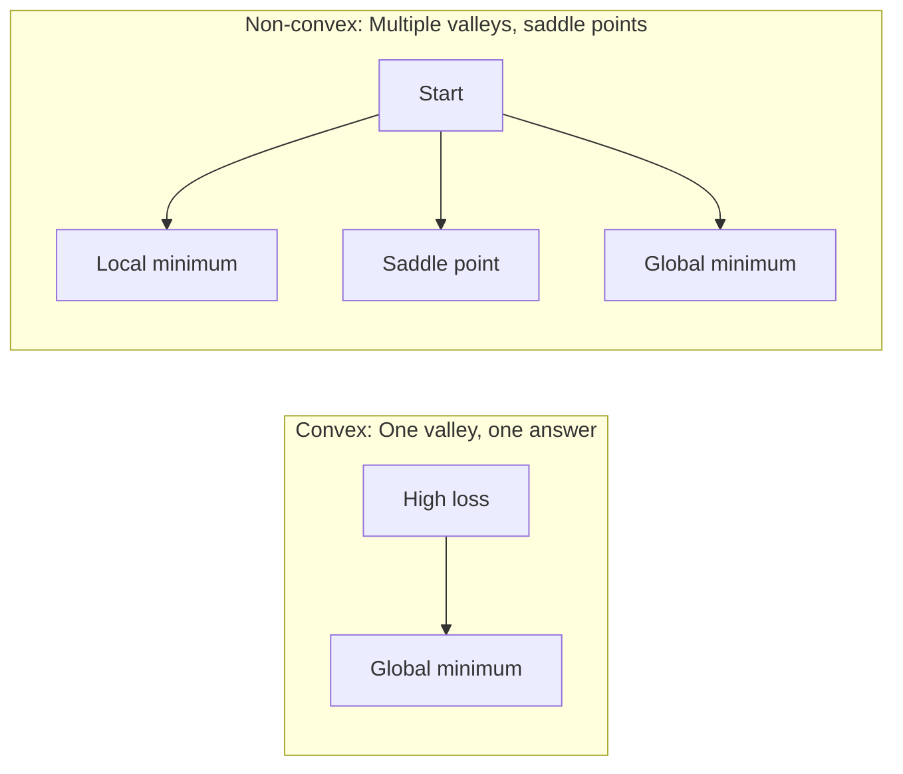
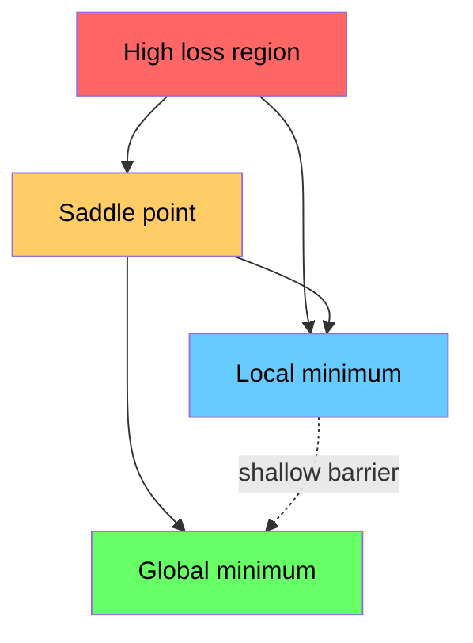

# 最適化

> ニューラルネットワークの学習は谷の底を見つけることに過ぎない。


## 学習目標

- バニラ勾配降下法、モーメンタム付きSGD、Adamをスクラッチから実装する
- ローゼンブロック関数での各最適化器の収束を比較し、Adamがパラメータごとに学習率を適応させる理由を説明する
- 凸の損失地形と非凸の損失地形を区別し、高次元における鞍点の役割を説明する
- 学習の安定性のために学習率スケジュール（ステップ減衰、コサインアニーリング、ウォームアップ）を設定する

## 問題提起

損失関数がある。モデルがどれだけ間違っているかを教えてくれる。勾配がある。どの方向が損失を悪化させるかを教えてくれる。では下り坂を歩くための戦略が必要だ。

単純なアプローチはシンプルだ: 勾配と逆方向に動く。学習率と呼ばれる数値でステップをスケールする。繰り返す。これが勾配降下法で、機能する。しかし「機能する」には注意書きがある。学習率が大きすぎると谷を完全に飛び越えて壁の間で跳ね回る。小さすぎると何千もの不要なステップで答えに向かってのろのろ進む。鞍点にはまると最小値を見つけていないのに動きが止まる。

深層学習のすべての最適化器は同じ問いへの答えだ: どうすれば谷の底に速く確実に到達できるか？

## 概念

### 最適化が意味すること

最適化は関数を最小化（または最大化）する入力値を見つけることだ。機械学習では、関数は損失だ。入力はモデルの重みだ。学習は最適化だ。

```
L(w) を最小化する、ここで:
  L = 損失関数
  w = モデルの重み（何百万ものパラメータになりうる）
```

### 勾配降下法（バニラ）

最もシンプルな最適化器。すべての重みに対する損失の勾配を計算する。各重みを勾配と逆方向に動かす。ステップを学習率でスケールする。

```
w = w - lr * gradient
```

これがアルゴリズム全体だ。1行。



### 学習率: 最も重要なハイパーパラメータ

学習率はステップサイズを制御する。収束のすべてを決定する。



適切な学習率の公式はない。実験によって見つける。一般的な出発点: Adamなら0.001、モーメンタム付きSGDなら0.01。

### SGD vs バッチ vs ミニバッチ

バニラ勾配降下法は1ステップを取る前にデータセット全体で勾配を計算する。これをバッチ勾配降下法と呼ぶ。安定しているが遅い。

確率的勾配降下法（SGD）は1つのランダムなサンプルで勾配を計算して即座にステップを取る。ノイジーだが速い。

ミニバッチ勾配降下法は中間を取る。小さいバッチ（32、64、128、256サンプル）で勾配を計算し、ステップを取る。実際に全員が使っているのはこれだ。

| バリアント | バッチサイズ | 勾配の品質 | ステップあたりの速度 | ノイズ |
|---------|-----------|-----------------|---------------|-------|
| バッチGD | データセット全体 | 正確 | 遅い | なし |
| SGD | 1サンプル | 非常にノイジー | 速い | 高い |
| ミニバッチ | 32-256 | 良い推定 | バランス | 中程度 |

SGDとミニバッチのノイズはバグではない。浅い局所的最小値と鞍点から脱出するのに役立つ。

### モーメンタム: 丘を転がる球

バニラ勾配降下法は現在の勾配だけを見る。勾配がジグザグになる（狭い谷でよく起きる）と進みが遅い。モーメンタムは過去の勾配を速度項に蓄積することでこれを解決する。

```
v = beta * v + gradient
w = w - lr * v
```

比喩: 丘を転がる球。すべての凹凸で止まって再スタートしない。一貫した方向に速度を積み上げ、振動を減衰させる。



`beta`（通常0.9）はどれだけ履歴を保持するかを制御する。betaが高いほどモーメンタムが強くなり、パスが滑らかになるが、方向変化への応答が遅くなる。

### Adam: 適応的学習率

異なる重みには異なる学習率が必要だ。めったに大きな勾配を得ない重みは、ようやく大きな勾配を受け取ったときに大きなステップを取るべきだ。常に大きな勾配を受け取る重みは小さなステップを取るべきだ。

Adam（Adaptive Moment Estimation）は重みごとに2つのことを追跡する:

1. 1次モーメント（m）: 勾配の移動平均（モーメンタムに似ている）
2. 2次モーメント（v）: 二乗勾配の移動平均（勾配の大きさ）

```
m = beta1 * m + (1 - beta1) * gradient
v = beta2 * v + (1 - beta2) * gradient^2

m_hat = m / (1 - beta1^t)    バイアス補正
v_hat = v / (1 - beta2^t)    バイアス補正

w = w - lr * m_hat / (sqrt(v_hat) + epsilon)
```

`sqrt(v_hat)` による除算が核心だ。大きな勾配を持つ重みは大きな数で割られる（小さな実効ステップ）。小さな勾配を持つ重みは小さな数で割られる（大きな実効ステップ）。各重みに独自の適応的学習率が与えられる。

デフォルトのハイパーパラメータ: `lr=0.001, beta1=0.9, beta2=0.999, epsilon=1e-8`。これらのデフォルトはほとんどの問題でうまく機能する。

### 学習率スケジュール

固定の学習率は妥協だ。学習初期には大きなステップで速く進みたい。学習後期には最小値付近を微調整するために小さなステップが欲しい。

よく使われるスケジュール:

| スケジュール | 公式 | ユースケース |
|----------|---------|----------|
| ステップ減衰 | Nエポックごとに lr = lr * factor | シンプル、手動制御 |
| 指数減衰 | lr = lr_0 * decay^t | 滑らかな削減 |
| コサインアニーリング | lr = lr_min + 0.5 * (lr_max - lr_min) * (1 + cos(pi * t / T)) | トランスフォーマー、最新の学習 |
| ウォームアップ＋減衰 | 線形増加、その後減衰 | 大規模モデル、初期不安定性を防ぐ |

### 凸 vs 非凸

凸関数は最小値が1つだ。勾配降下法は必ず見つける。`f(x) = x^2` のような2次式は凸だ。

ニューラルネットワークの損失関数は非凸だ。多くの局所的最小値、鞍点、平坦な領域がある。



実際には、高次元ニューラルネットワークの局所的最小値はほとんど問題にならない。ほとんどの局所的最小値は大域的最小値に近い損失値を持つ。鞍点（ある方向では平坦、他の方向では曲率がある）が本当の障害だ。モーメンタムとミニバッチからのノイズがそこから脱出するのに役立つ。

### 損失地形の視覚化

損失はすべての重みの関数だ。100万の重みを持つモデルでは、損失地形は1,000,001次元空間に存在する。重み空間の2つのランダムな方向を選んでそれらの方向に沿った損失をプロットし、2D面を生成することで視覚化する。



鋭い最小値は汎化が悪い。平坦な最小値は汎化が良い。これがモーメンタム付きSGDが最終的なテスト精度でAdamを上回ることが多い理由の1つだ: そのノイズが鋭い最小値への定着を防ぐ。

## 実装

### ステップ1: テスト関数を定義する

ローゼンブロック関数は古典的な最適化ベンチマークだ。その最小値は (1, 1) にあり、見つけやすいが従いにくい狭い曲がった谷の中にある。

```
f(x, y) = (1 - x)^2 + 100 * (y - x^2)^2
```

```python
def rosenbrock(params):
    x, y = params
    return (1 - x) ** 2 + 100 * (y - x ** 2) ** 2

def rosenbrock_gradient(params):
    x, y = params
    df_dx = -2 * (1 - x) + 200 * (y - x ** 2) * (-2 * x)
    df_dy = 200 * (y - x ** 2)
    return [df_dx, df_dy]
```

### ステップ2: バニラ勾配降下法

```python
class GradientDescent:
    def __init__(self, lr=0.001):
        self.lr = lr

    def step(self, params, grads):
        return [p - self.lr * g for p, g in zip(params, grads)]
```

### ステップ3: モーメンタム付きSGD

```python
class SGDMomentum:
    def __init__(self, lr=0.001, momentum=0.9):
        self.lr = lr
        self.momentum = momentum
        self.velocity = None

    def step(self, params, grads):
        if self.velocity is None:
            self.velocity = [0.0] * len(params)
        self.velocity = [
            self.momentum * v + g
            for v, g in zip(self.velocity, grads)
        ]
        return [p - self.lr * v for p, v in zip(params, self.velocity)]
```

### ステップ4: Adam

```python
class Adam:
    def __init__(self, lr=0.001, beta1=0.9, beta2=0.999, epsilon=1e-8):
        self.lr = lr
        self.beta1 = beta1
        self.beta2 = beta2
        self.epsilon = epsilon
        self.m = None
        self.v = None
        self.t = 0

    def step(self, params, grads):
        if self.m is None:
            self.m = [0.0] * len(params)
            self.v = [0.0] * len(params)

        self.t += 1

        self.m = [
            self.beta1 * m + (1 - self.beta1) * g
            for m, g in zip(self.m, grads)
        ]
        self.v = [
            self.beta2 * v + (1 - self.beta2) * g ** 2
            for v, g in zip(self.v, grads)
        ]

        m_hat = [m / (1 - self.beta1 ** self.t) for m in self.m]
        v_hat = [v / (1 - self.beta2 ** self.t) for v in self.v]

        return [
            p - self.lr * mh / (vh ** 0.5 + self.epsilon)
            for p, mh, vh in zip(params, m_hat, v_hat)
        ]
```

### ステップ5: 実行して比較する

```python
def optimize(optimizer, func, grad_func, start, steps=5000):
    params = list(start)
    history = [params[:]]
    for _ in range(steps):
        grads = grad_func(params)
        params = optimizer.step(params, grads)
        history.append(params[:])
    return history

start = [-1.0, 1.0]

gd_history = optimize(GradientDescent(lr=0.0005), rosenbrock, rosenbrock_gradient, start)
sgd_history = optimize(SGDMomentum(lr=0.0001, momentum=0.9), rosenbrock, rosenbrock_gradient, start)
adam_history = optimize(Adam(lr=0.01), rosenbrock, rosenbrock_gradient, start)

for name, history in [("GD", gd_history), ("SGD+M", sgd_history), ("Adam", adam_history)]:
    final = history[-1]
    loss = rosenbrock(final)
    print(f"{name:6s} -> x={final[0]:.6f}, y={final[1]:.6f}, loss={loss:.8f}")
```

期待される出力: Adamが最も速く収束する。モーメンタム付きSGDはより滑らかなパスを辿る。バニラGDは狭い谷に沿ってゆっくり進む。

## 実際に使う

実際には、PyTorchやJAXの最適化器を使う。パラメータグループ、重み減衰、勾配クリッピング、GPU加速を処理する。

```python
import torch

model = torch.nn.Linear(784, 10)

sgd = torch.optim.SGD(model.parameters(), lr=0.01, momentum=0.9)
adam = torch.optim.Adam(model.parameters(), lr=0.001)
adamw = torch.optim.AdamW(model.parameters(), lr=0.001, weight_decay=0.01)

scheduler = torch.optim.lr_scheduler.CosineAnnealingLR(adam, T_max=100)
```

経験則:

- Adam（lr=0.001）から始める。チューニングなしでほとんどの問題で機能する。
- 最高の最終精度が必要でより多くのチューニングができるなら、モーメンタム付きSGD（lr=0.01、momentum=0.9）に切り替える。
- トランスフォーマーにはAdamW（デカップルした重み減衰付きAdam）を使う。
- 数エポック以上の学習には常に学習率スケジュールを使う。
- 学習が不安定なら学習率を下げる。遅すぎるなら上げる。

## 演習

1. **学習率スイープ。** 学習率 [0.0001, 0.0005, 0.001, 0.005, 0.01] でローゼンブロック関数にバニラ勾配降下法を実行せよ。5000ステップ後の各最終損失をプロットまたは出力せよ。まだ収束する最大の学習率を見つけよ。

2. **モーメンタムの比較。** モーメンタム値 [0.0, 0.5, 0.9, 0.99] でローゼンブロック関数にSGDを実行せよ。各ステップでの損失を追跡せよ。どのモーメンタム値が最も速く収束するか？どれがオーバーシュートするか？

3. **鞍点からの脱出。** 関数 `f(x, y) = x^2 - y^2`（原点に鞍点がある）を定義せよ。(0.01, 0.01) から始める。バニラGD、モーメンタム付きSGD、Adamの動作を比較せよ。どれが鞍点から脱出するか？

4. **学習率減衰を実装する。** GradientDescentクラスに指数減衰スケジュールを追加せよ: `lr = lr_0 * 0.999^step`。ローゼンブロック関数での減衰ありとなしの収束を比較せよ。

## キーワード

| 用語 | よく言われること | 実際の意味 |
|------|----------------|----------------------|
| 勾配降下法 | 「下り坂を行く」 | 学習率でスケールした勾配を引いて重みを更新する。最も基本的な最適化器。 |
| 学習率 | 「ステップサイズ」 | 各更新が重みをどれだけ動かすかを制御するスカラー。大きすぎると発散。小さすぎると計算を無駄にする。 |
| モーメンタム | 「転がり続ける」 | 過去の勾配を速度ベクトルに蓄積する。振動を減衰させ、一貫した方向への動きを加速する。 |
| SGD | 「ランダムサンプリング」 | 確率的勾配降下法。全データセットの代わりにランダムな部分集合で勾配を計算する。実際にはほとんどミニバッチSGDを意味する。 |
| ミニバッチ | 「データの塊」 | 勾配を推定するために使われる少量の学習データ（32〜256サンプル）。速度と勾配精度のバランスを取る。 |
| Adam | 「デフォルトの最適化器」 | Adaptive Moment Estimation。勾配と二乗勾配の重みごとの移動平均を追跡し、各重みに独自の学習率を与える。 |
| バイアス補正 | 「コールドスタートの修正」 | Adamの1次・2次モーメントはゼロに初期化される。バイアス補正は初期ステップ中の補正のために (1 - beta^t) で割る。 |
| 学習率スケジュール | 「時間とともにlrを変える」 | 学習中に学習率を調整する関数。初期は大きなステップ、後期は小さなステップ。 |
| 凸関数 | 「1つの谷」 | 局所的最小値がすべて大域的最小値である関数。勾配降下法は必ず見つける。ニューラルネットワークの損失は凸ではない。 |
| 鞍点 | 「平坦だが最小値ではない」 | 勾配がゼロだが、ある方向では最小値、他の方向では最大値である点。高次元でよく現れる。 |
| 損失地形 | 「地形」 | 重み空間上にプロットされた損失関数。2つのランダムな方向に沿ってスライスすることで視覚化される。 |
| 収束 | 「そこへ到達する」 | 最適化器がそれ以上のステップを踏んでも損失が意味のある削減をしない点に達した状態。 |

## 参考資料

- [Sebastian Ruder: 勾配降下最適化アルゴリズムの概観](https://ruder.io/optimizing-gradient-descent/) - すべての主要な最適化器の包括的な調査
- [モーメンタムが本当に機能する理由（Distill）](https://distill.pub/2017/momentum/) - モーメンタムのダイナミクスのインタラクティブな視覚化
- [Adam: 確率的最適化の手法（Kingma & Ba, 2014）](https://arxiv.org/abs/1412.6980) - 元のAdamの論文、読みやすく短い
- [ニューラルネットワークの損失地形の可視化（Li et al., 2018）](https://arxiv.org/abs/1712.09913) - 鋭い最小値と平坦な最小値を示した論文
