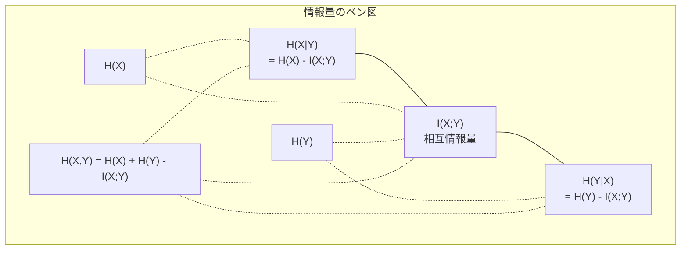

# 情報理論

> 情報理論は驚きを測る。損失関数はそれの上に構築されている。


## 学習目標

- エントロピー、クロスエントロピー、KLダイバージェンスをスクラッチから計算し、それらの関係を説明する
- クロスエントロピー損失の最小化が対数尤度の最大化と等価な理由を導出する
- 特徴と目標変数の間の相互情報量を計算して特徴の重要性を順位付けする
- パープレキシティを言語モデルが選択する有効な語彙サイズとして説明する

## 問題提起

学習するすべての分類モデルで `CrossEntropyLoss()` を呼び出している。すべての言語モデルの論文で「パープレキシティ」を目にする。VAE、蒸留、RLHFでKLダイバージェンスについて読む。これらは無関係な概念ではない。みな異なる帽子をかぶった同じアイデアだ。

情報理論は不確実性、圧縮、予測について推論するための言語を与えてくれる。クロード・シャノンが1948年に通信の問題を解くためにこれを発明した。ニューラルネットワークの学習は通信の問題であることがわかった: モデルは学習された重みというノイズのあるチャネルを通じて正しいラベルを送信しようとしている。

このレッスンはすべての公式をスクラッチから構築し、それらがどこから来てなぜ機能するかを見せる。

## 概念

### 情報量（驚き）

ありそうもないことが起きると、より多くの情報を持つ。コインが表になる？驚きではない。宝くじに当たる？非常に驚く。

確率p の事象の情報量は:

```
I(x) = -log(p(x))
```

底2の対数を使うとビットが得られる。自然対数を使うとナットが得られる。同じアイデア、異なる単位。

```
事象              確率    驚き（ビット）
公正なコインの表    0.5     1.0
6が出る            0.167   2.58
1000分の1の事象    0.001   9.97
確実な事象         1.0     0.0
```

確実な事象はゼロの情報を持つ。起きることは既にわかっていた。

### エントロピー（平均的な驚き）

エントロピーは分布のすべての可能な結果にわたる期待される驚きだ。

```
H(P) = -sum( p(x) * log(p(x)) )  すべてのx について
```

公正なコインは二値変数のエントロピーが最大: 1ビット。偏ったコイン（99%表）はエントロピーが低い: 0.08ビット。何が起きるかは既にわかっているので、各投げはほとんど何も教えない。

```
公正なコイン:  H = -(0.5 * log2(0.5) + 0.5 * log2(0.5)) = 1.0 ビット
偏ったコイン:  H = -(0.99 * log2(0.99) + 0.01 * log2(0.01)) = 0.08 ビット
```

エントロピーは分布の不可逆的な不確実性を測る。その下には圧縮できない。

### クロスエントロピー（毎日使う損失関数）

クロスエントロピーは分布Qを使って実際には分布Pから来る事象をエンコードするときの平均的な驚きを測る。

```
H(P, Q) = -sum( p(x) * log(q(x)) )  すべてのx について
```

Pは真の分布（ラベル）だ。Qはモデルの予測だ。QがPに完全に一致すれば、クロスエントロピーはエントロピーと等しい。どんな不一致もそれを大きくする。

分類では、Pはone-hotベクトルだ（真のクラスは確率1、それ以外はすべて0）。これによりクロスエントロピーが簡略化される:

```
H(P, Q) = -log(q(true_class))
```

これが分類のクロスエントロピー損失公式のすべてだ。正しいクラスの予測確率を最大化する。

### KLダイバージェンス（分布間の距離）

KLダイバージェンスはPの代わりにQを使うことで得る余分な驚きを測る。

```
D_KL(P || Q) = sum( p(x) * log(p(x) / q(x)) )  すべてのx について
             = H(P, Q) - H(P)
```

クロスエントロピーはエントロピーとKLダイバージェンスの和だ。学習中の真の分布のエントロピーは定数なので、クロスエントロピーの最小化はKLダイバージェンスの最小化と同じだ。モデルの分布を真の分布に近づけている。

KLダイバージェンスは対称でない: D_KL(P || Q) ≠ D_KL(Q || P)。真の距離指標ではない。

### 相互情報量

相互情報量は一方の変数を知ることが他方についてどれだけ教えてくれるかを測る。

```
I(X; Y) = H(X) - H(X|Y)
        = H(X) + H(Y) - H(X, Y)
```

XとYが独立なら相互情報量はゼロだ。一方を知っても他方について何もわからない。完全に相関しているなら、相互情報量はどちらの変数のエントロピーとも等しい。

特徴選択では、特徴と目標の間の高い相互情報量はその特徴が有用であることを意味する。低い相互情報量はノイズを意味する。

### 条件付きエントロピー

H(Y|X) はXを観察した後にYについてどれだけ不確実性が残るかを測る。

```
H(Y|X) = H(X,Y) - H(X)
```

2つの極端:
- XがYを完全に決定するなら、H(Y|X) = 0。Xを知るとYについての不確実性がすべてなくなる。例: X = 摂氏温度、Y = 華氏温度。
- XがYについて何も教えないなら、H(Y|X) = H(Y)。Xを知っても不確実性が全く減らない。例: X = コイン投げ、Y = 明日の天気。

条件付きエントロピーは常に非負でH(Y)を超えない:

```
0 <= H(Y|X) <= H(Y)
```

機械学習では、条件付きエントロピーは決定木に現れる。各分岐で、アルゴリズムはH(Y|X)を最小化する特徴X——ラベルYについての最多の不確実性を取り除く特徴——を選ぶ。

### 結合エントロピー

H(X,Y) はXとYを一緒にした結合分布のエントロピーだ。

```
H(X,Y) = -sum sum p(x,y) * log(p(x,y))   すべてのx, yについて
```

重要な性質:

```
H(X,Y) <= H(X) + H(Y)
```

XとYが独立なとき等号が成り立つ。共有する情報があれば、結合エントロピーは個々のエントロピーの和より小さい。「欠けている」エントロピーがまさに相互情報量だ。



関係式:
- H(X,Y) = H(X) + H(Y|X) = H(Y) + H(X|Y)
- I(X;Y) = H(X) - H(X|Y) = H(Y) - H(Y|X)
- H(X,Y) = H(X) + H(Y) - I(X;Y)

### 相互情報量（詳細）

相互情報量 I(X;Y) は一方の変数を知ることが他方の不確実性をどれだけ減らすかを定量化する。

```
I(X;Y) = H(X) - H(X|Y)
       = H(Y) - H(Y|X)
       = H(X) + H(Y) - H(X,Y)
       = sum sum p(x,y) * log(p(x,y) / (p(x) * p(y)))
```

性質:
- I(X;Y) >= 0 常に。何かを観察することで情報を失うことはない。
- I(X;Y) = 0 はXとYが独立なときのみ。
- I(X;Y) = I(Y;X)。KLダイバージェンスと異なり対称だ。
- I(X;X) = H(X)。変数は自分自身とすべての情報を共有する。

**特徴選択のための相互情報量。** MLでは、目標について情報を持つ特徴が欲しい。相互情報量は特徴を順位付ける原則的な方法を与える:

1. 各特徴 X_i について、目標変数Yとの I(X_i; Y) を計算する。
2. MIスコアで特徴を順位付けする。
3. 上位k個の特徴を保持する。

これは特徴と目標の間のあらゆる関係——線形、非線形、単調、その他——に機能する。相関は線形な関係しか捉えない。MIはすべてを捉える。

| 手法 | 検出する | 計算コスト | カテゴリカルデータに対応？ |
|--------|---------|-------------------|---------------------|
| ピアソン相関 | 線形な関係 | O(n) | いいえ |
| スピアマン相関 | 単調な関係 | O(n log n) | いいえ |
| 相互情報量 | 任意の統計的依存 | ビニングでO(n log n) | はい |

### ラベル平滑化とクロスエントロピー

標準的な分類はハードターゲットを使う: [0, 0, 1, 0]。真のクラスは確率1を得て、それ以外はすべて0。ラベル平滑化はこれをソフトターゲットに置き換える:

```
soft_target = (1 - epsilon) * hard_target + epsilon / num_classes
```

epsilon = 0.1、4クラスの場合:
- ハードターゲット: [0, 0, 1, 0]
- ソフトターゲット: [0.025, 0.025, 0.925, 0.025]

情報理論の観点から、ラベル平滑化はターゲット分布のエントロピーを増加させる。ハードone-hotターゲットのエントロピーは0——不確実性がない。ソフトターゲットは正のエントロピーを持つ。

これが役立つ理由:
- モデルがロジットを極端な値に追い込むことを防ぐ（クロスエントロピーのもとでone-hotターゲットを完全に一致させるには無限のロジットが必要だ）
- 正則化として機能: モデルが100%確信を持てない
- キャリブレーションを改善: 予測確率が真の不確実性をより良く反映する
- 学習と推論の動作のギャップを減らす

ラベル平滑化付きのクロスエントロピー損失は:

```
L = (1 - epsilon) * CE(hard_target, prediction) + epsilon * H_uniform(prediction)
```

2項目は一様分布から遠い予測にペナルティを与える——確信度への直接的な正則化だ。

### クロスエントロピーが分類損失の定番である理由

3つの視点、同じ結論。

**情報理論の視点。** クロスエントロピーは真の分布の代わりにモデルの分布を使うことで無駄にするビット数を測る。最小化するとモデルが現実の最も効率的なエンコーダーになる。

**最尤推定の視点。** 真のクラスy_iを持つN個の学習サンプルについて:

```
尤度     = product( q(y_i) )
対数尤度 = sum( log(q(y_i)) )
負の対数尤度 = -sum( log(q(y_i)) )
```

最後の行がクロスエントロピー損失だ。クロスエントロピーの最小化 = モデルのもとでの学習データの尤度の最大化。

**勾配の視点。** ロジットに対するクロスエントロピーの勾配は単純に（予測 - 真値）だ。きれいで、安定で、速く計算できる。これがソフトマックスと完璧にペアになる理由だ。

### ビットとナット

唯一の違いは対数の底だ。

```
底2の対数   -> ビット    （情報理論の伝統）
自然対数    -> ナット    （機械学習の慣習）
底10の対数  -> ハートレー（ほとんど使われない）
```

1ナット = 1/ln(2) ビット = 1.4427ビット。PyTorchとTensorFlowはデフォルトで自然対数（ナット）を使う。

### パープレキシティ

パープレキシティはクロスエントロピーの指数だ。モデルが不確実性を持つ等しく起こりやすい選択肢の有効な数を教える。

```
パープレキシティ = 2^H(P,Q)   （ビットを使う場合）
パープレキシティ = e^H(P,Q)   （ナットを使う場合）
```

パープレキシティ50の言語モデルは、平均的に50個の可能な次のトークンから一様に選ぶのと同じくらい混乱している。低いほど良い。

GPT-2は一般的なベンチマークでパープレキシティ約30を達成した。現代のモデルは十分に表現されたドメインでは一桁台だ。

## 実装

### ステップ1: 情報量とエントロピー

```python
import math

def information_content(p, base=2):
    if p <= 0 or p > 1:
        return float('inf') if p <= 0 else 0.0
    return -math.log(p) / math.log(base)

def entropy(probs, base=2):
    return sum(
        p * information_content(p, base)
        for p in probs if p > 0
    )

fair_coin = [0.5, 0.5]
biased_coin = [0.99, 0.01]
fair_die = [1/6] * 6

print(f"公正なコインのエントロピー:   {entropy(fair_coin):.4f} ビット")
print(f"偏ったコインのエントロピー: {entropy(biased_coin):.4f} ビット")
print(f"公正なサイコロのエントロピー:    {entropy(fair_die):.4f} ビット")
```

### ステップ2: クロスエントロピーとKLダイバージェンス

```python
def cross_entropy(p, q, base=2):
    total = 0.0
    for pi, qi in zip(p, q):
        if pi > 0:
            if qi <= 0:
                return float('inf')
            total += pi * (-math.log(qi) / math.log(base))
    return total

def kl_divergence(p, q, base=2):
    return cross_entropy(p, q, base) - entropy(p, base)

true_dist = [0.7, 0.2, 0.1]
good_model = [0.6, 0.25, 0.15]
bad_model = [0.1, 0.1, 0.8]

print(f"真の分布のエントロピー:     {entropy(true_dist):.4f} ビット")
print(f"CE（良いモデル）:          {cross_entropy(true_dist, good_model):.4f} ビット")
print(f"CE（悪いモデル）:           {cross_entropy(true_dist, bad_model):.4f} ビット")
print(f"KLダイバージェンス（良い）:     {kl_divergence(true_dist, good_model):.4f} ビット")
print(f"KLダイバージェンス（悪い）:      {kl_divergence(true_dist, bad_model):.4f} ビット")
```

### ステップ3: 分類損失としてのクロスエントロピー

```python
def softmax(logits):
    max_logit = max(logits)
    exps = [math.exp(z - max_logit) for z in logits]
    total = sum(exps)
    return [e / total for e in exps]

def cross_entropy_loss(true_class, logits):
    probs = softmax(logits)
    return -math.log(probs[true_class])

logits = [2.0, 1.0, 0.1]
true_class = 0

probs = softmax(logits)
loss = cross_entropy_loss(true_class, logits)

print(f"ロジット:      {logits}")
print(f"ソフトマックス:     {[f'{p:.4f}' for p in probs]}")
print(f"真のクラス:  {true_class}")
print(f"損失:        {loss:.4f} ナット")
print(f"パープレキシティ:  {math.exp(loss):.2f}")
```

### ステップ4: クロスエントロピーは負の対数尤度と等しい

```python
import random

random.seed(42)

n_samples = 1000
n_classes = 3
true_labels = [random.randint(0, n_classes - 1) for _ in range(n_samples)]
model_logits = [[random.gauss(0, 1) for _ in range(n_classes)] for _ in range(n_samples)]

ce_loss = sum(
    cross_entropy_loss(label, logits)
    for label, logits in zip(true_labels, model_logits)
) / n_samples

nll = -sum(
    math.log(softmax(logits)[label])
    for label, logits in zip(true_labels, model_logits)
) / n_samples

print(f"クロスエントロピー損失:      {ce_loss:.6f}")
print(f"負の対数尤度: {nll:.6f}")
print(f"差分:              {abs(ce_loss - nll):.2e}")
```

### ステップ5: 相互情報量

```python
def mutual_information(joint_probs, base=2):
    rows = len(joint_probs)
    cols = len(joint_probs[0])

    margin_x = [sum(joint_probs[i][j] for j in range(cols)) for i in range(rows)]
    margin_y = [sum(joint_probs[i][j] for i in range(rows)) for j in range(cols)]

    mi = 0.0
    for i in range(rows):
        for j in range(cols):
            pxy = joint_probs[i][j]
            if pxy > 0:
                mi += pxy * math.log(pxy / (margin_x[i] * margin_y[j])) / math.log(base)
    return mi

independent = [[0.25, 0.25], [0.25, 0.25]]
dependent = [[0.45, 0.05], [0.05, 0.45]]

print(f"相互情報量（独立）: {mutual_information(independent):.4f} ビット")
print(f"相互情報量（依存）:   {mutual_information(dependent):.4f} ビット")
```

## 実際に使う

実際に使う方法、NumPyを使った同じ概念:

```python
import numpy as np

def np_entropy(p):
    p = np.asarray(p, dtype=float)
    mask = p > 0
    result = np.zeros_like(p)
    result[mask] = p[mask] * np.log(p[mask])
    return -result.sum()

def np_cross_entropy(p, q):
    p, q = np.asarray(p, dtype=float), np.asarray(q, dtype=float)
    mask = p > 0
    return -(p[mask] * np.log(q[mask])).sum()

def np_kl_divergence(p, q):
    return np_cross_entropy(p, q) - np_entropy(p)

true = np.array([0.7, 0.2, 0.1])
pred = np.array([0.6, 0.25, 0.15])
print(f"エントロピー:    {np_entropy(true):.4f} ナット")
print(f"クロスエントロピー:  {np_cross_entropy(true, pred):.4f} ナット")
print(f"KLダイバージェンス:     {np_kl_divergence(true, pred):.4f} ナット")
```

`torch.nn.CrossEntropyLoss()` が内部でやることをスクラッチで構築した。これで学習中に損失が下がる理由がわかる: モデルの予測分布が真の分布に近づいており、無駄にする情報のナット数で測定される。

## 演習

1. 一様分布（26文字）を仮定した英語のアルファベットのエントロピーを計算せよ。次に実際の文字頻度を使って推定せよ。どちらが高く、なぜか？

2. モデルが真のクラス1のサンプルに対してロジット [5.0, 2.0, 0.5] を出力する。クロスエントロピー損失を手計算し、次に `cross_entropy_loss` 関数で検証せよ。どのロジットがゼロの損失を与えるか？

3. KLダイバージェンスが対称でないことを示せ。2つの分布PとQを選んで D_KL(P || Q) と D_KL(Q || P) を計算せよ。それらが異なる理由を説明せよ。

4. トークン予測の系列のパープレキシティを計算する関数を構築せよ。(true_token_index, predicted_logits) ペアのリストが与えられたとき、系列のパープレキシティを返す。

## キーワード

| 用語 | よく言われること | 実際の意味 |
|------|----------------|----------------------|
| 情報量 | 「驚き」 | 事象をエンコードするために必要なビット（またはナット）数: -log(p) |
| エントロピー | 「ランダム性」 | 分布のすべての結果にわたる平均的な驚き。不可逆的な不確実性を測る。 |
| クロスエントロピー | 「損失関数」 | モデル分布Qを使って真の分布Pから来る事象をエンコードするときの平均的な驚き。 |
| KLダイバージェンス | 「分布間の距離」 | PではなくQを使うことで無駄になる余分なビット。クロスエントロピーからエントロピーを引いたもの。対称でない。 |
| 相互情報量 | 「XとYはどれほど関連しているか」 | Yを知ることによるXの不確実性の減少。ゼロは独立を意味する。 |
| ソフトマックス | 「ロジットを確率に変換する」 | 指数をとって正規化する。任意の実数値ベクトルを有効な確率分布に写す。 |
| パープレキシティ | 「モデルがどれほど混乱しているか」 | クロスエントロピーの指数。各ステップでモデルが選択する有効な語彙サイズ。 |
| ビット | 「シャノンの単位」 | 底2の対数で測定される情報。1ビットは1回の公正なコイン投げを解決する。 |
| ナット | 「MLの単位」 | 自然対数で測定される情報。PyTorchとTensorFlowでデフォルトで使われる。 |
| 負の対数尤度 | 「NLL損失」 | one-hotラベルに対してクロスエントロピー損失と同一。最小化すると正しい予測の確率が最大化される。 |

## 参考資料

- [Shannon 1948: 通信の数学的理論](https://people.math.harvard.edu/~ctm/home/text/others/shannon/entropy/entropy.pdf) - 元の論文、今でも読みやすい
- [視覚的情報理論（Chris Olah）](https://colah.github.io/posts/2015-09-Visual-Information/) - エントロピーとKLダイバージェンスの最良の視覚的説明
- [PyTorch CrossEntropyLossドキュメント](https://pytorch.org/docs/stable/generated/torch.nn.CrossEntropyLoss.html) - フレームワークが今構築したものをどう実装するか
