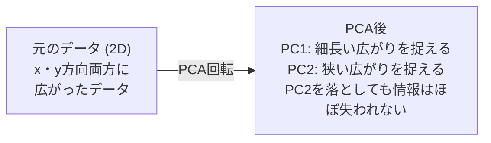

# 次元削減

> 高次元データには構造がある。正しい角度から見ることでそれを見つける。


## 学習目標

- スクラッチからPCAを実装する: データを中心化し、共分散行列を計算し、固有分解し、射影する
- 説明分散比とエルボー法を使って主成分の数を選ぶ
- 2DでMNIST数字を視覚化するためにPCA、t-SNE、UMAPを比較し、それらのトレードオフを説明する
- 標準PCAが扱えない非線形データ構造を分離するためにRBFカーネルのカーネルPCAを適用する

## 問題提起

1サンプルあたり784個の特徴を持つデータセットがある。手書き数字のピクセル値かもしれない。遺伝子発現レベルかもしれない。ユーザー行動シグナルかもしれない。784次元は視覚化できない。プロットできない。考えることもできない。

しかしこれらの784個の特徴のほとんどは冗長だ。実際の情報はずっと小さな面の上にある。手書きの「7」を記述するのに784個の独立した数値は必要ない。いくつかでいい: ストロークの角度、横棒の長さ、どれだけ傾いているか。残りはノイズだ。

次元削減はその小さな面を見つける。784次元データを取り、重要な構造を保ちながら2、10、または50次元に圧縮する。

## 概念

### 次元の呪い

高次元空間は直感に反する。次元が増えるにつれて3つのことが壊れる。

**距離が意味をなさなくなる。** 高次元では、任意の2つのランダムな点の間の距離が同じ値に収束する。すべての点が互いにほぼ同じ距離にあるなら、最近傍探索が機能しなくなる。

```
次元    ランダムな点間の平均距離比（最大/最小）
2       ~5.0
10      ~1.8
100     ~1.2
1000    ~1.02
```

**体積が角に集中する。** d次元の単位超立方体は 2^d 個の角を持つ。100次元では、体積のほとんどが中心から遠い角にある。データ点が端に広がり、モデルは内部でデータに飢える。

**指数関数的により多くのデータが必要になる。** 空間のサンプル密度を同じに保つには、2Dから20Dへ行くと 10^18 倍多くのデータが必要だ。十分なデータは決してない。次元を削減するとデータ密度が扱いやすいものに戻る。

### PCA: 重要な方向を見つける

主成分分析（PCA）はデータが最も変動する軸を見つける。最初の軸が最も多くの分散を捉え、2番目が次の分散を捉え、というようにデータの最大分散方向に座標系を回転させる。

アルゴリズム:

```
1. データを中心化する  （各特徴から平均を引く）
2. 共分散を計算する   （特徴がどう一緒に動くか）
3. 固有分解          （主要な方向を見つける）
4. 固有値でソート     （最大分散を最初に）
5. 射影             （上位k個の固有ベクトルを保持、残りを削除）
```

なぜ固有分解か？共分散行列は対称で半正定値だ。その固有ベクトルは特徴空間の直交方向だ。固有値は各方向がどれだけの分散を捉えるかを教える。最大の固有値を持つ固有ベクトルは最大分散の方向を指す。



- **PCA前:** データの雲はxとy軸の両方に斜めに広がっている
- **PCA後:** PC1が最大分散の方向（細長い広がり）、PC2が最小分散の方向（狭い広がり）に合わせて座標系が回転される
- **次元削減:** PC2を落とすとデータをPC1に射影する、情報をほとんど失わない

### 説明分散比

各主成分は総分散の一部を捉える。説明分散比がどれだけかを教える。

```
成分    固有値    説明比    累積
PC1     4.73     0.473     0.473
PC2     2.51     0.251     0.724
PC3     1.12     0.112     0.836
PC4     0.89     0.089     0.925
...
```

累積説明分散が0.95に達したとき、多くの成分が情報の95%を捉えていることがわかる。それ以降はほとんどがノイズだ。

### 成分数の選び方

3つの戦略:

1. **閾値。** 分散の90〜95%を説明するのに十分な成分を保持する。
2. **エルボー法。** 成分ごとの説明分散をプロットする。急激な落ち込みを探す。
3. **下流のパフォーマンス。** PCAを前処理として使う。kをスイープしてモデルの精度を測る。最適なkは精度がプラトーになる場所だ。

### t-SNE: 近傍関係を保持する

t-分布型確率的近傍埋め込み（t-SNE）は視覚化のために設計されている。どの点が互いに近いかを保ちながら高次元データを2D（または3D）に写す。

直感: 元の空間で、点のペアの距離に基づいて確率分布を計算する。近い点は高い確率を得る。遠い点は低い確率を得る。次に同じ確率分布が成り立つ2D配置を見つける。784次元で近傍だった点は2Dでも近傍にとどまる。

t-SNEの主要な性質:
- 非線形。PCAには展開できない複雑な多様体を展開できる。
- 確率的。異なる実行は異なるレイアウトを生成する。
- パープレキシティパラメータは考慮する近傍数を制御する（一般的な範囲: 5〜50）。
- 出力のクラスタ間の距離は意味がない。クラスタ自体だけが意味を持つ。
- 大きなデータセットでは遅い。デフォルトでO(n^2)。

### UMAP: 速く、グローバル構造も良い

一様多様体近似射影（UMAP）はt-SNEと同様に機能するが2つの利点がある:
- 速い。すべてのペアの距離を計算する代わりに近似最近傍グラフを使う。
- グローバル構造が良い。出力のクラスタの相対位置はt-SNEより意味がある傾向がある。

UMAPは高次元空間で重み付きグラフ（「ファジー位相表現」）を構築し、このグラフをできるだけ保持する低次元レイアウトを見つける。

主要なパラメータ:
- `n_neighbors`: 何個の近傍がローカル構造を定義するか（パープレキシティと同様）。高い値はよりグローバルな構造を保持する。
- `min_dist`: 出力で点がどれだけ密にまとまるか。低い値はより密なクラスタを作る。

### どれを使うか

| 手法 | ユースケース | 保持するもの | 速度 |
|--------|----------|-----------|-------|
| PCA | 学習前の前処理 | グローバルな分散 | 速い（正確）、数百万サンプルに対応 |
| PCA | 素早い探索的視覚化 | 線形構造 | 速い |
| t-SNE | 論文品質の2Dプロット | ローカルな近傍関係 | 遅い（理想は1万サンプル以下） |
| UMAP | スケールでの2D視覚化 | ローカル＋一部グローバル構造 | 中程度（数百万に対応） |
| PCA | モデルの特徴削減 | 分散順位付けされた特徴 | 速い |
| t-SNE / UMAP | クラスタ構造の理解 | クラスタの分離 | 中程度〜遅い |

経験則: 前処理とデータ圧縮にはPCAを使う。2Dで構造を視覚化する必要があるときはt-SNEまたはUMAPを使う。

### カーネルPCA

標準のPCAは線形部分空間を見つける。座標系を回転させて軸を落とす。しかしデータが非線形多様体上にあるとしたら？2Dの円は線で分離できない。標準のPCAは役に立たない。

カーネルPCAはカーネル関数によって引き起こされる高次元特徴空間でPCAを適用する。その空間での座標を明示的に計算することなく。これがカーネルトリック——SVMの背後にある同じアイデアだ。

アルゴリズム:
1. K_ij = k(x_i, x_j) としてカーネル行列Kを計算する
2. 特徴空間でカーネル行列を中心化する
3. 中心化されたカーネル行列を固有分解する
4. 上位固有ベクトル（1/sqrt(固有値)でスケール）が射影だ

よく使われるカーネル関数:

| カーネル | 公式 | 適している場合 |
|--------|---------|----------|
| RBF（ガウシアン） | exp(-gamma * \|\|x - y\|\|^2) | ほとんどの非線形データ、滑らかな多様体 |
| 多項式 | (x · y + c)^d | 多項式関係 |
| シグモイド | tanh(alpha * x · y + c) | ニューラルネットワーク的なマッピング |

カーネルPCA vs 標準PCの使い分け:

| 基準 | 標準PCA | カーネルPCA |
|-----------|-------------|------------|
| データ構造 | 線形部分空間 | 非線形多様体 |
| 速度 | O(min(n^2 d, d^2 n)) | O(n^2 d + n^3) |
| 解釈可能性 | 成分は特徴の線形結合 | 成分は直接の特徴解釈がない |
| スケーラビリティ | 数百万サンプルに対応 | カーネル行列はn×n、メモリ制限あり |
| 再構築 | 直接的な逆変換 | プレイメージ近似が必要 |

古典的な例: 2Dの同心円。2つの点の輪、一方が他方の内側。標準のPCAは両方を同じ線に射影する——分類には役に立たない。RBFカーネルのカーネルPCAは内側の円と外側の円を異なる領域に写し、線形分離可能にする。

### 再構築誤差

次元削減はどれくらい良いか？784次元を50次元に圧縮した。何を失ったか？

再構築誤差を測る:
1. データをk次元に射影する: X_reduced = X @ W_k
2. 再構築する: X_hat = X_reduced @ W_k^T
3. MSEを計算する: mean((X - X_hat)^2)

PCAの場合、再構築誤差は説明分散とのきれいな関係がある:

```
再構築誤差 = 含まれない固有値の和
総分散 = すべての固有値の和
失われた割合 = (落とした固有値の和) / (すべての固有値の和)
```

各成分の説明分散比は:

```
explained_ratio_k = eigenvalue_k / sum(all eigenvalues)
```

成分数に対する累積説明分散のプロットが「エルボー」曲線を与える。適切な成分数は:
- 曲線が平坦になる（収穫逓減）
- 累積分散が閾値を超える（通常0.90か0.95）
- 下流タスクのパフォーマンスがプラトーになる

再構築誤差はk選択以上の用途がある。異常検知に使える: 高い再構築誤差を持つサンプルは学習した部分空間に合わない外れ値だ。これが本番システムでのPCAベース異常検知の基礎だ。

## 実装

### ステップ1: スクラッチからのPCA

```python
import numpy as np

class PCA:
    def __init__(self, n_components):
        self.n_components = n_components
        self.components = None
        self.mean = None
        self.eigenvalues = None
        self.explained_variance_ratio_ = None

    def fit(self, X):
        self.mean = np.mean(X, axis=0)
        X_centered = X - self.mean

        cov_matrix = np.cov(X_centered, rowvar=False)

        eigenvalues, eigenvectors = np.linalg.eigh(cov_matrix)

        sorted_idx = np.argsort(eigenvalues)[::-1]
        eigenvalues = eigenvalues[sorted_idx]
        eigenvectors = eigenvectors[:, sorted_idx]

        self.components = eigenvectors[:, :self.n_components].T
        self.eigenvalues = eigenvalues[:self.n_components]
        total_var = np.sum(eigenvalues)
        self.explained_variance_ratio_ = self.eigenvalues / total_var

        return self

    def transform(self, X):
        X_centered = X - self.mean
        return X_centered @ self.components.T

    def fit_transform(self, X):
        self.fit(X)
        return self.transform(X)
```

### ステップ2: 合成データでテストする

```python
np.random.seed(42)
n_samples = 500

t = np.random.uniform(0, 2 * np.pi, n_samples)
x1 = 3 * np.cos(t) + np.random.normal(0, 0.2, n_samples)
x2 = 3 * np.sin(t) + np.random.normal(0, 0.2, n_samples)
x3 = 0.5 * x1 + 0.3 * x2 + np.random.normal(0, 0.1, n_samples)

X_synthetic = np.column_stack([x1, x2, x3])

pca = PCA(n_components=2)
X_reduced = pca.fit_transform(X_synthetic)

print(f"元の形状: {X_synthetic.shape}")
print(f"削減後の形状:  {X_reduced.shape}")
print(f"説明分散比: {pca.explained_variance_ratio_}")
print(f"捉えた総分散: {sum(pca.explained_variance_ratio_):.4f}")
```

### ステップ3: 2DでのMNIST数字

```python
from sklearn.datasets import fetch_openml

mnist = fetch_openml("mnist_784", version=1, as_frame=False, parser="auto")
X_mnist = mnist.data[:5000].astype(float)
y_mnist = mnist.target[:5000].astype(int)

pca_mnist = PCA(n_components=50)
X_pca50 = pca_mnist.fit_transform(X_mnist)
print(f"50成分が分散の{sum(pca_mnist.explained_variance_ratio_):.2%}を捉えている")

pca_2d = PCA(n_components=2)
X_pca2d = pca_2d.fit_transform(X_mnist)
print(f"2成分が分散の{sum(pca_2d.explained_variance_ratio_):.2%}を捉えている")
```

### ステップ4: sklearnと比較する

```python
from sklearn.decomposition import PCA as SklearnPCA
from sklearn.manifold import TSNE

sklearn_pca = SklearnPCA(n_components=2)
X_sklearn_pca = sklearn_pca.fit_transform(X_mnist)

print(f"\n自作PCA説明分散:     {pca_2d.explained_variance_ratio_}")
print(f"sklearn PCA説明分散: {sklearn_pca.explained_variance_ratio_}")

diff = np.abs(np.abs(X_pca2d) - np.abs(X_sklearn_pca))
print(f"最大絶対差: {diff.max():.10f}")

tsne = TSNE(n_components=2, perplexity=30, random_state=42)
X_tsne = tsne.fit_transform(X_mnist)
print(f"\nt-SNE出力形状: {X_tsne.shape}")
```

### ステップ5: UMAPとの比較

```python
try:
    from umap import UMAP

    reducer = UMAP(n_components=2, n_neighbors=15, min_dist=0.1, random_state=42)
    X_umap = reducer.fit_transform(X_mnist)
    print(f"UMAP出力形状: {X_umap.shape}")
except ImportError:
    print("umap-learnをインストール: pip install umap-learn")
```

## 実際に使う

分類器の前処理としてのPCA:

```python
from sklearn.decomposition import PCA as SklearnPCA
from sklearn.linear_model import LogisticRegression
from sklearn.model_selection import train_test_split
from sklearn.metrics import accuracy_score

X_train, X_test, y_train, y_test = train_test_split(
    X_mnist, y_mnist, test_size=0.2, random_state=42
)

results = {}
for k in [10, 30, 50, 100, 200]:
    pca_k = SklearnPCA(n_components=k)
    X_tr = pca_k.fit_transform(X_train)
    X_te = pca_k.transform(X_test)

    clf = LogisticRegression(max_iter=1000, random_state=42)
    clf.fit(X_tr, y_train)
    acc = accuracy_score(y_test, clf.predict(X_te))
    var_captured = sum(pca_k.explained_variance_ratio_)
    results[k] = (acc, var_captured)
    print(f"k={k:>3d}  精度={acc:.4f}  分散={var_captured:.4f}")
```

パフォーマンスは784次元よりずっと前にプラトーになる。そのプラトーが動作点だ。

## 演習

1. `inverse_transform` をサポートするようにPCAクラスを修正せよ。10、50、200成分からMNIST数字を再構築せよ。各ケースの再構築誤差（元との平均二乗差）を出力せよ。

2. パープレキシティ値5、30、100で同じMNISTサブセットにt-SNEを実行せよ。出力がどう変わるか説明せよ。なぜパープレキシティがクラスタの密度に影響するか？

3. 50個の特徴を持つデータセット（`sklearn.datasets.make_classification` で生成）で5個のみが情報を持つものを用意する。PCAを適用して説明分散曲線がデータが実質5次元であることを正しく識別するか確認せよ。

## キーワード

| 用語 | よく言われること | 実際の意味 |
|------|----------------|----------------------|
| 次元の呪い | 「特徴が多すぎる」 | 次元が増えるにつれて距離、体積、データ密度がすべて直感に反する振る舞いをする。モデルは補うために指数関数的により多くのデータが必要。 |
| PCA | 「次元を削減する」 | 軸が最大分散の方向に合うように座標系を回転させ、低分散の軸を落とす。 |
| 主成分 | 「重要な方向」 | 共分散行列の固有ベクトル。データが最も変動する特徴空間の方向。 |
| 説明分散比 | 「この成分が持つ情報量」 | 1つの主成分が捉える総分散の割合。上位k個の比を足し合わせると、k成分がどれだけ保持するかがわかる。 |
| 共分散行列 | 「特徴の相関関係」 | エントリ(i,j)が特徴iと特徴jがどう一緒に動くかを測る対称行列。対角エントリは個々の分散。 |
| t-SNE | 「あのクラスタプロット」 | ペアの近傍確率を保ちながら高次元データを2Dに写す非線形手法。視覚化には良いが前処理には不向き。 |
| UMAP | 「速いt-SNE」 | 位相的データ解析に基づく非線形手法。ローカルと一部グローバルな構造を保持。t-SNEより良くスケールする。 |
| パープレキシティ | 「t-SNEのつまみ」 | 各点が考慮する有効な近傍数を制御する。低いパープレキシティは非常にローカルな構造に焦点を当てる。高いパープレキシティはより広いパターンを捉える。 |
| 多様体 | 「データが存在する面」 | 高次元空間に埋め込まれた低次元面。3Dで丸めた紙のシートは2D多様体だ。 |

## 参考資料

- [主成分分析のチュートリアル](https://arxiv.org/abs/1404.1100)（Shlens）- 基礎からのPCAの明確な導出
- [t-SNEの効果的な使い方](https://distill.pub/2016/misread-tsne/)（Wattenbergら）- t-SNEの落とし穴とパラメータ選択のインタラクティブガイド
- [UMAPドキュメント](https://umap-learn.readthedocs.io/) - UMAPの著者による理論と実践的なガイダンス
