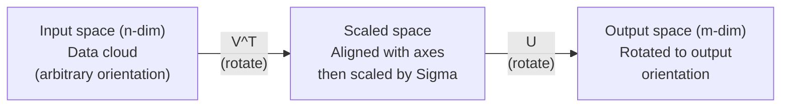
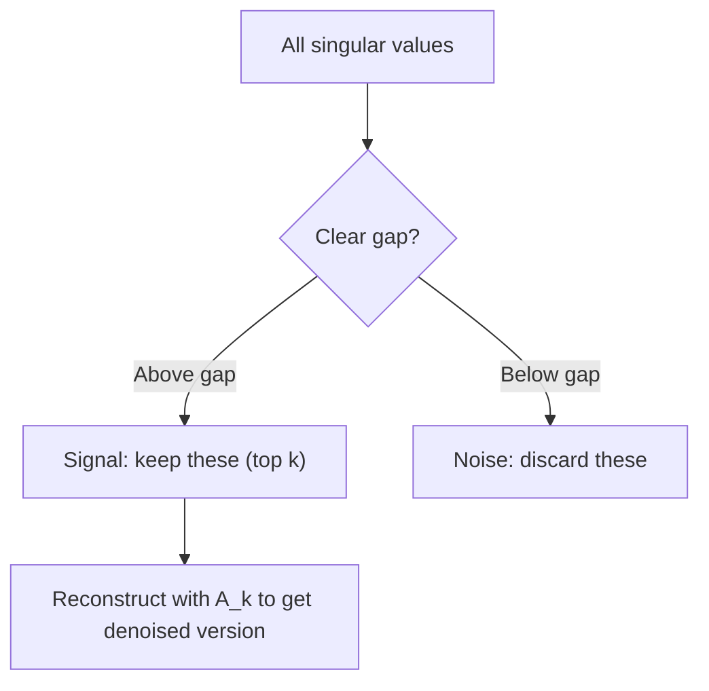

# 特異値分解

> SVD は線形代数のスイスアーミーナイフだ。あらゆる行列に存在し、あらゆるデータサイエンティストが必要とする。


## 学習目標

- べき乗法を用いて SVD を実装し、U、Sigma、V^T の幾何学的な意味を説明する
- 画像圧縮に打ち切り SVD を適用し、圧縮率と再構成誤差を計測する
- SVD を通じて Moore-Penrose 擬似逆行列を計算し、過決定最小二乗系を解く
- SVD と PCA、推薦システム（潜在因子）、NLP の潜在的意味解析との関係を説明する

## 問題

1000×2000 の行列があるとする。ユーザーと映画の評価行列かもしれないし、文書と単語の出現頻度表かもしれないし、画像のピクセル値かもしれない。それを圧縮したい、ノイズ除去したい、隠れた構造を見つけたい、あるいは最小二乗系を解きたいとする。固有分解は正方行列にしか使えない。そもそも、線形独立な固有ベクトルを完全に持つ行列でなければならない。

SVD はあらゆる行列に使える。どんな形状でも、どんなランクでも、条件は不要だ。行列を 3 つの因子に分解し、その行列が空間に対して何を行うかの幾何学的構造を明らかにする。線形代数全体の中で最も汎用的で最も有用な因子分解だ。

## 概念

### SVD の幾何学的な意味

どんな行列も、形状に関わらず、3 つの操作を順に実行する: 回転、スケーリング、回転。SVD はこの分解を明示的に表す。

```
A = U * Sigma * V^T

      m x n     m x m    m x n    n x n
     (任意)   (回転)   (スケール) (回転)
```

任意の行列 A が与えられると、SVD は次のように因子分解する:
- V^T は入力空間（n 次元）のベクトルを回転させる
- Sigma は各軸に沿ってスケーリングする（引き伸ばしまたは圧縮）
- U は結果を出力空間（m 次元）に回転させる



こう考えてみよう。SVD に行列を渡す。すると SVD は言う: 「この行列は球形の入力を取り、まず V^T で回転させ、次に Sigma で楕円体に引き伸ばし、最後に U で楕円体を回転させる」と。特異値は楕円体の各軸の長さだ。

### 完全な分解

形状 m x n の行列 A について:

```
A = U * Sigma * V^T

ここで:
  U     は m x m の直交行列 (U^T U = I)
  Sigma は m x n の対角行列 (対角成分が特異値)
  V     は n x n の直交行列 (V^T V = I)

特異値 sigma_1 >= sigma_2 >= ... >= sigma_r > 0
ここで r = rank(A)
```

U の列を左特異ベクトル、V の列を右特異ベクトル、Sigma の対角成分を特異値と呼ぶ。特異値は常に非負であり、慣例として降順に並べられる。

### 左特異ベクトル、特異値、右特異ベクトル

SVD の各成分には、それぞれ異なる幾何学的意味がある。

**右特異ベクトル（V の列）:** 入力空間（R^n）の正規直交基底を形成する。これらは、行列が出力空間の直交する方向に写す入力空間上の方向だ。領域の自然な座標系と考えればよい。

**特異値（Sigma の対角成分）:** スケーリング因子だ。i 番目の特異値は、行列が i 番目の右特異ベクトルに沿ってベクトルをどれだけ引き伸ばすかを表す。特異値がゼロということは、その方向を完全に潰してしまうことを意味する。

**左特異ベクトル（U の列）:** 出力空間（R^m）の正規直交基底を形成する。i 番目の左特異ベクトルは、i 番目の右特異ベクトルが（スケーリング後に）写される出力空間上の方向だ。

それらの関係:

```
A * v_i = sigma_i * u_i

行列 A は i 番目の右特異ベクトル v_i を取り、
sigma_i でスケールし、i 番目の左特異ベクトル u_i に写す。
```

これにより、任意の行列が行う操作を成分ごとに把握できる。

### 外積形式

SVD はランク 1 行列の和として書ける:

```
A = sigma_1 * u_1 * v_1^T + sigma_2 * u_2 * v_2^T + ... + sigma_r * u_r * v_r^T

各項 sigma_i * u_i * v_i^T はランク 1 行列（外積）だ。
元の行列はそのような r 個の行列の和であり、r はランク。
```

この形式は低ランク近似の基礎だ。各項が構造の一層を追加する。最初の項が最も重要なパターンを捉え、2 番目が次に重要なものを捉える。以降同様。この和を打ち切ることで、任意のランクにおける最良の近似が得られる。

```
ランク 1 近似:    A_1 = sigma_1 * u_1 * v_1^T
                  (支配的なパターンを捉える)

ランク 2 近似:    A_2 = sigma_1 * u_1 * v_1^T + sigma_2 * u_2 * v_2^T
                  (上位 2 つの重要なパターンを捉える)

ランク k 近似:    A_k = 上位 k 項の和
                  (Eckart-Young 定理による最適近似)
```

### 固有分解との関係

SVD と固有分解は深くつながっている。A の特異値・特異ベクトルは、A^T A と A A^T の固有値・固有ベクトルから直接導かれる。

```
A^T A = V * Sigma^T * U^T * U * Sigma * V^T
      = V * Sigma^T * Sigma * V^T
      = V * D * V^T

ここで D = Sigma^T * Sigma は対角成分に sigma_i^2 を持つ対角行列。

よって:
- 右特異ベクトル（V）は A^T A の固有ベクトル
- 特異値の 2 乗（sigma_i^2）は A^T A の固有値

同様に:
A A^T = U * Sigma * V^T * V * Sigma^T * U^T
      = U * Sigma * Sigma^T * U^T

よって:
- 左特異ベクトル（U）は A A^T の固有ベクトル
- A A^T の固有値も sigma_i^2
```

この関係から 3 つのことがわかる:
1. 特異値は常に実数かつ非負だ（半正定値行列の固有値の平方根だから）。
2. A^T A の固有分解を経由して SVD を計算することもできるが、これは条件数を 2 乗して数値精度を失う。専用の SVD アルゴリズムはこれを避ける。
3. A が正方で対称半正定値なら、SVD と固有分解は同一だ。

### 打ち切り SVD: 低ランク近似

Eckart-Young-Mirsky 定理によれば、A への最良のランク k 近似（フロベニウスノルムおよびスペクトルノルムの両方で）は、上位 k 個の特異値とそれに対応するベクトルだけを保持することで得られる:

```
A_k = U_k * Sigma_k * V_k^T

ここで:
  U_k     は m x k  （U の最初の k 列）
  Sigma_k は k x k  （Sigma の左上 k x k ブロック）
  V_k     は n x k  （V の最初の k 列）

近似誤差 = sigma_{k+1}              （スペクトルノルムで）
          = sqrt(sigma_{k+1}^2 + ... + sigma_r^2)  （フロベニウスノルムで）
```

これは単に「良い」近似ではない。ランク k での最良近似であることが証明されている。他のどのランク k 行列も A に近くない。

| 成分 | 相対的な大きさ | ランク 3 近似に含まれるか? |
|-----------|-------------------|------------------------|
| sigma_1 | 最大 | 含まれる |
| sigma_2 | 大 | 含まれる |
| sigma_3 | 中大 | 含まれる |
| sigma_4 | 中 | 含まれない（誤差） |
| sigma_5 | 中小 | 含まれない（誤差） |
| sigma_6 | 小 | 含まれない（誤差） |
| sigma_7 | 非常に小 | 含まれない（誤差） |
| sigma_8 | 微小 | 含まれない（誤差） |

上位 3 つを保持: A_3 は 3 つの最大特異値を捉える。誤差 = 残りの値（sigma_4 から sigma_8）。

特異値の減衰が速ければ、小さな k でほとんどの行列を捉えられる。減衰が遅ければ、その行列には低ランク構造がない。

### SVD による画像圧縮

グレースケール画像はピクセル輝度の行列だ。800×600 の画像には 480,000 個の値がある。SVD を使えば、はるかに少ない値で近似できる。

```
元の画像: 800 x 600 = 480,000 個の値

ランク k の SVD:
  U_k:      800 x k 個の値
  Sigma_k:  k 個の値
  V_k:      600 x k 個の値
  合計:     k * (800 + 600 + 1) = k * 1401 個の値

  k=10:   14,010 個の値   (元の 2.9%)
  k=50:   70,050 個の値  (元の 14.6%)
  k=100: 140,100 個の値  (元の 29.2%)

  k が小さいほど圧縮率は上がるが、画質は低下する。
```

重要な洞察: 自然画像の特異値は急速に減衰する。最初のいくつかの特異値が大まかな構造（形状、グラデーション）を捉える。それ以降は細部とノイズを捉える。ランク 50 で打ち切っても、元の画像とほぼ見分けがつかない画像が得られながら、85% のストレージを削減できることが多い。

### 推薦システムへの SVD の応用

Netflix Prize によってこれは有名になった。大部分のエントリが欠損したユーザーと映画の評価行列がある。

```
             Movie1  Movie2  Movie3  Movie4  Movie5
  User1      [  5      ?       3       ?       1  ]
  User2      [  ?      4       ?       2       ?  ]
  User3      [  3      ?       5       ?       ?  ]
  User4      [  ?      ?       ?       4       3  ]

  ? = 未知の評価
```

考え方: この評価行列は低ランクだ。ユーザーの嗜好が完全に独立しているわけではない。ほとんどの嗜好を説明できる少数の潜在因子（アクション vs. ドラマ、古い vs. 新しい、知的 vs. 感情的）が存在する。

（補完済みの）評価行列に SVD を適用することで次のように分解される:
- U: 潜在因子空間におけるユーザープロファイル
- Sigma: 各潜在因子の重要度
- V^T: 潜在因子空間における映画プロファイル

あるユーザーの映画への予測評価は、そのユーザープロファイルと映画プロファイルの内積（特異値で重み付け）だ。低ランク近似によって欠損エントリが補完される。

実際には、欠損データを直接扱う Simon Funk の逐次 SVD や ALS（交互最小二乗法）などの変種が使われる。しかし核心的なアイデアは同じだ: SVD による潜在因子分解。

### NLP における SVD: 潜在的意味解析

Latent Semantic Analysis（LSA）、別名 Latent Semantic Indexing（LSI）は、単語-文書行列に SVD を適用する。

```
             Doc1   Doc2   Doc3   Doc4
  "cat"      [  3      0      1      0  ]
  "dog"      [  2      0      0      1  ]
  "fish"     [  0      4      1      0  ]
  "pet"      [  1      1      1      1  ]
  "ocean"    [  0      3      0      0  ]

ランク k=2 の SVD 後:

  各文書は 2 次元の「概念空間」の点になる。
  各単語も同じ 2 次元空間の点になる。
  似たトピックの文書はまとまりを形成する。
  似た意味の単語もまとまりを形成する。

  "cat" と "dog" は近くなる（陸上のペット）。
  "fish" と "ocean" は近くなる（水に関連する概念）。
  Doc1 と Doc3 は似たトピックを共有していればまとまる。
```

LSA は生テキストから意味的類似性を捉える最初の成功した手法のひとつだった。同義語的な単語は同様の文書に出現する傾向があり、SVD がそれらを同じ潜在次元にグループ化するため機能する。現代の単語埋め込み（Word2Vec、GloVe）はこのアイデアの子孫とみなせる。

### ノイズ除去への SVD の応用

ノイズを含むデータは、信号が上位の特異値に集中し、ノイズがすべての特異値に広がっている。打ち切りによってノイズのフロアを取り除く。

**クリーンな信号の特異値:**

| 成分 | 大きさ | 種類 |
|-----------|-----------|------|
| sigma_1 | 非常に大きい | 信号 |
| sigma_2 | 大きい | 信号 |
| sigma_3 | 中程度 | 信号 |
| sigma_4 | ほぼゼロ | 無視できる |
| sigma_5 | ほぼゼロ | 無視できる |

**ノイズを含む信号の特異値（ノイズがすべてに加算される）:**

| 成分 | 大きさ | 種類 |
|-----------|-----------|------|
| sigma_1 | 非常に大きい | 信号 |
| sigma_2 | 大きい | 信号 |
| sigma_3 | 中程度 | 信号 |
| sigma_4 | 小さい | ノイズ |
| sigma_5 | 小さい | ノイズ |
| sigma_6 | 小さい | ノイズ |
| sigma_7 | 小さい | ノイズ |



これは信号処理、科学的計測、データクリーニングに使われる。加法性ノイズで汚染された行列があれば、打ち切り SVD は信号とノイズを分離する原理的な方法だ。

### SVD による擬似逆行列

Moore-Penrose 擬似逆行列 A+ は、非正方行列や特異行列への行列逆転を一般化する。SVD を使えば計算は簡単だ。

```
A = U * Sigma * V^T ならば:

A+ = V * Sigma+ * U^T

ここで Sigma+ は次のようにして作る:
  1. Sigma を転置する（行と列を入れ替える）
  2. 各非ゼロ対角成分 sigma_i を 1/sigma_i で置き換える
  3. ゼロはゼロのまま

A が (m x n) の場合:      A+ は (n x m)
Sigma が (m x n) の場合:  Sigma+ は (n x m)
```

擬似逆行列は最小二乗問題を解く。Ax = b に正確な解がない（過決定系）場合、x = A+ b が最小二乗解（||Ax - b|| を最小化）となる。

```
過決定系（未知数より方程式が多い）:

  [1  1]         [3]
  [2  1] x   =   [5]       正確な解は存在しない。
  [3  1]         [6]

  x_ls = A+ b = V * Sigma+ * U^T * b

  これは残差の二乗和を最小化する x を与える。
  正規方程式 (A^T A)^(-1) A^T b と同じ結果だが、
  数値的により安定している。
```

### 数値的安定性の利点

A^T A の固有分解を計算すると、特異値（A^T A の固有値は sigma_i^2）が 2 乗される。これは条件数を 2 乗し、数値誤差を増幅させる。

```
例:
  A の特異値が [1000, 1, 0.001]
  A の条件数: 1000 / 0.001 = 10^6

  A^T A の固有値は [10^6, 1, 10^{-6}]
  A^T A の条件数: 10^6 / 10^{-6} = 10^{12}

  SVD を直接計算: 条件数 10^6 で動作
  A^T A 経由で計算:  条件数 10^{12} で動作
                     （精度が 6 桁失われる）
```

現代の SVD アルゴリズム（Golub-Kahan 双対角化）は直接 A に作用し、A^T A を形成しない。だから常に `np.linalg.eig(A.T @ A)` より `np.linalg.svd(A)` を使うべきだ。

### PCA との関係

PCA は中心化されたデータへの SVD そのものだ。これは類比ではない。文字通り同じ計算だ。

```
データ行列 X（n_samples x n_features）を中心化（平均を引く）した場合:

共分散行列: C = (1/(n-1)) * X^T X

PCA は C の固有ベクトルを見つける。しかし:

  X = U * Sigma * V^T    （X の SVD）

  X^T X = V * Sigma^2 * V^T

  C = (1/(n-1)) * V * Sigma^2 * V^T

つまり主成分は正確に右特異ベクトル V だ。
各成分の説明分散は sigma_i^2 / (n-1) となる。

sklearn では PCA は固有分解ではなく SVD で実装されている。
より高速かつ数値的に安定している。
```

つまり、レッスン 10 で学んだ次元削減はすべて、裏では SVD だ。PCA は機械学習における SVD の最も一般的な応用だ。

## 実装する

### ステップ 1: べき乗法を使ったスクラッチからの SVD

考え方: 最大の特異値とそのベクトルを見つけるには、A^T A（または A A^T）にべき乗法を適用する。その後、行列をデフレートして次の特異値を求める手順を繰り返す。

```python
import numpy as np

def power_iteration(M, num_iters=100):
    n = M.shape[1]
    v = np.random.randn(n)
    v = v / np.linalg.norm(v)

    for _ in range(num_iters):
        Mv = M @ v
        v = Mv / np.linalg.norm(Mv)

    eigenvalue = v @ M @ v
    return eigenvalue, v

def svd_from_scratch(A, k=None):
    m, n = A.shape
    if k is None:
        k = min(m, n)

    sigmas = []
    us = []
    vs = []

    A_residual = A.copy().astype(float)

    for _ in range(k):
        AtA = A_residual.T @ A_residual
        eigenvalue, v = power_iteration(AtA, num_iters=200)

        if eigenvalue < 1e-10:
            break

        sigma = np.sqrt(eigenvalue)
        u = A_residual @ v / sigma

        sigmas.append(sigma)
        us.append(u)
        vs.append(v)

        A_residual = A_residual - sigma * np.outer(u, v)

    U = np.column_stack(us) if us else np.empty((m, 0))
    S = np.array(sigmas)
    V = np.column_stack(vs) if vs else np.empty((n, 0))

    return U, S, V
```

### ステップ 2: テストと NumPy との比較

```python
np.random.seed(42)
A = np.random.randn(5, 4)

U_ours, S_ours, V_ours = svd_from_scratch(A)
U_np, S_np, Vt_np = np.linalg.svd(A, full_matrices=False)

print("Our singular values:", np.round(S_ours, 4))
print("NumPy singular values:", np.round(S_np, 4))

A_reconstructed = U_ours @ np.diag(S_ours) @ V_ours.T
print(f"Reconstruction error: {np.linalg.norm(A - A_reconstructed):.8f}")
```

### ステップ 3: 画像圧縮のデモ

```python
def compress_image_svd(image_matrix, k):
    U, S, Vt = np.linalg.svd(image_matrix, full_matrices=False)
    compressed = U[:, :k] @ np.diag(S[:k]) @ Vt[:k, :]
    return compressed

image = np.random.seed(42)
rows, cols = 200, 300
image = np.random.randn(rows, cols)

for k in [1, 5, 10, 20, 50]:
    compressed = compress_image_svd(image, k)
    error = np.linalg.norm(image - compressed) / np.linalg.norm(image)
    original_size = rows * cols
    compressed_size = k * (rows + cols + 1)
    ratio = compressed_size / original_size
    print(f"k={k:>3d}  error={error:.4f}  storage={ratio:.1%}")
```

### ステップ 4: ノイズ除去

```python
np.random.seed(42)
clean = np.outer(np.sin(np.linspace(0, 4*np.pi, 100)),
                 np.cos(np.linspace(0, 2*np.pi, 80)))
noise = 0.3 * np.random.randn(100, 80)
noisy = clean + noise

U, S, Vt = np.linalg.svd(noisy, full_matrices=False)
denoised = U[:, :5] @ np.diag(S[:5]) @ Vt[:5, :]

print(f"Noisy error:    {np.linalg.norm(noisy - clean):.4f}")
print(f"Denoised error: {np.linalg.norm(denoised - clean):.4f}")
print(f"Improvement:    {(1 - np.linalg.norm(denoised - clean) / np.linalg.norm(noisy - clean)):.1%}")
```

### ステップ 5: 擬似逆行列

```python
A = np.array([[1, 1], [2, 1], [3, 1]], dtype=float)
b = np.array([3, 5, 6], dtype=float)

U, S, Vt = np.linalg.svd(A, full_matrices=False)
S_inv = np.diag(1.0 / S)
A_pinv = Vt.T @ S_inv @ U.T

x_svd = A_pinv @ b
x_lstsq = np.linalg.lstsq(A, b, rcond=None)[0]
x_pinv = np.linalg.pinv(A) @ b

print(f"SVD pseudoinverse solution:  {x_svd}")
print(f"np.linalg.lstsq solution:   {x_lstsq}")
print(f"np.linalg.pinv solution:    {x_pinv}")
```

## 使ってみる

完全な動作デモは `code/svd.py` にある。実行すると、SVD の画像圧縮、推薦システム、潜在的意味解析、ノイズ除去への応用が確認できる。

```bash
python svd.py
```

Julia 版は `code/svd.jl` にあり、Julia のネイティブな `svd()` 関数と `LinearAlgebra` パッケージを使って同じ概念を示している。

```bash
julia svd.jl
```

## 提出する

このレッスンの成果物:
- `outputs/skill-svd.md` — 実プロジェクトで SVD をいつどのように適用するかのスキルガイド

## 演習

1. べき乗法を使わずにスクラッチで完全な SVD を実装する。代わりに A^T A の固有分解で V と特異値を求め、U = A V Sigma^{-1} を計算する。べき乗法版および NumPy と数値精度を比較する。

2. 実際のグレースケール画像（またはグレースケールに変換したもの）を読み込む。ランク 1、5、10、25、50、100 で圧縮する。各ランクで圧縮率と相対誤差を計算する。画像が視覚的に許容できるランクを見つける。

3. 小さな推薦システムを構築する。既知のエントリを持つ 10×8 のユーザーと映画の評価行列を作成する。欠損エントリを行の平均で補完する。SVD を計算してランク 3 近似を再構成する。再構成された行列を使って欠損評価を予測し、予測が妥当かどうかを確認する。

4. 3 つの合成トピックを持つ 100×50 の文書-単語行列を作成する。各トピックには 5 つの関連単語がある。ノイズを加える。SVD を適用し、上位 3 つの特異値が残りよりはるかに大きいことを確認する。文書を 3 次元の潜在空間に射影し、同じトピックの文書がまとまることを確認する。

5. クリーンな低ランク行列（ランク 3、サイズ 50×40）を生成し、さまざまなレベルのガウスノイズ（sigma = 0.1、0.5、1.0、2.0）を加える。各ノイズレベルで、k を 1 から 40 までスイープして再構成誤差をクリーンな行列に対して計測することで最適な打ち切りランクを見つける。最適な k がノイズレベルに応じてどう変化するかをプロットする。

## 主要用語

| 用語 | 一般的な言い方 | 実際の意味 |
|------|----------------|----------------------|
| SVD | 「任意の行列を因子分解する」 | A を U Sigma V^T に分解する。U と V は直交行列、Sigma は非負の対角行列。任意の形状の行列に適用可能。 |
| 特異値 | 「この成分の重要度」 | Sigma の i 番目の対角成分。行列が i 番目の主方向に沿ってどれだけ引き伸ばすかを測る。常に非負で降順に並ぶ。 |
| 左特異ベクトル | 「出力方向」 | U の列。i 番目の右特異ベクトルが（sigma_i でスケールされた後に）写される出力空間の方向。 |
| 右特異ベクトル | 「入力方向」 | V の列。行列が i 番目の左特異ベクトルに写す（sigma_i でスケールされた後に）入力空間の方向。 |
| 打ち切り SVD | 「低ランク近似」 | 上位 k 個の特異値とそのベクトルだけを保持する。元の行列への最良のランク k 近似であることが証明されている（Eckart-Young 定理）。 |
| ランク | 「真の次元数」 | 非ゼロ特異値の個数。行列が実際に使用している独立な方向の数。 |
| 擬似逆行列 | 「一般化された逆行列」 | V Sigma+ U^T。非ゼロの特異値を反転させ、ゼロはゼロのまま。非正方行列や特異行列の最小二乗問題を解く。 |
| 条件数 | 「誤差への感度」 | sigma_max / sigma_min。条件数が大きいと、小さな入力の変化が大きな出力の変化を引き起こす。SVD はこれを直接明らかにする。 |
| 潜在因子 | 「隠れた変数」 | SVD で発見される低ランク空間の次元。推薦システムではジャンル嗜好に対応する場合がある。NLP ではトピックに対応する場合がある。 |
| フロベニウスノルム | 「行列全体のサイズ」 | 成分の 2 乗和の平方根。特異値の 2 乗和の平方根に等しい。近似誤差の計測に使われる。 |
| Eckart-Young 定理 | 「SVD が最良の圧縮を与える」 | 目標ランク k に対して、打ち切り SVD がすべてのランク k 行列の中で近似誤差を最小化する。 |
| べき乗法 | 「最大の固有ベクトルを見つける」 | ランダムベクトルに行列を繰り返し掛けて正規化する。最大固有値を持つ固有ベクトルに収束する。多くの SVD アルゴリズムの基礎。 |

## 参考文献

- [Gilbert Strang: Linear Algebra and Its Applications, Chapter 7](https://math.mit.edu/~gs/linearalgebra/) - 応用を含む SVD の詳細な解説
- [3Blue1Brown: But what is the SVD?](https://www.youtube.com/watch?v=vSczTbgc8Rc) - SVD の幾何学的直感
- [We Recommend a Singular Value Decomposition](https://www.ams.org/publicoutreach/feature-column/fcarc-svd) - American Mathematical Society によるわかりやすい概説
- [Netflix Prize and Matrix Factorization](https://sifter.org/~simon/journal/20061211.html) - Simon Funk の推薦システムへの SVD 応用に関するオリジナルブログ記事
- [Latent Semantic Analysis](https://en.wikipedia.org/wiki/Latent_semantic_analysis) - SVD の NLP への最初の応用
- [Numerical Linear Algebra by Trefethen and Bau](https://people.maths.ox.ac.uk/trefethen/text.html) - SVD アルゴリズムとその数値特性を理解するための標準テキスト
