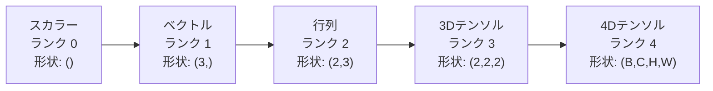
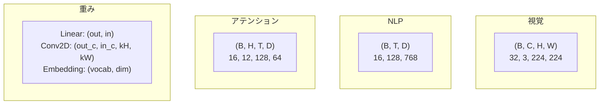
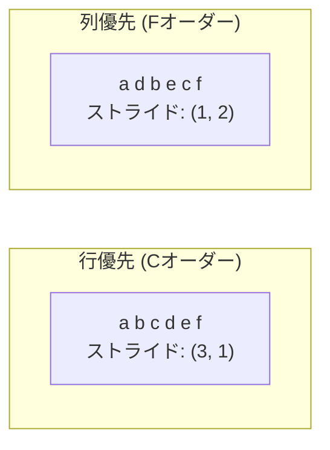
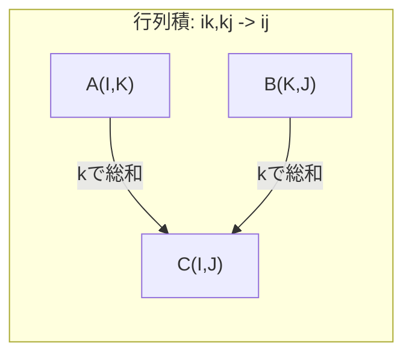

# テンソル演算

> テンソルはデータと深層学習をつなぐ共通言語です。すべての画像、すべての文章、すべての勾配はテンソルを通して流れます。


## 学習目標

- テンソルクラスをゼロから実装する（形状、ストライド、reshape、転置、要素ごとの演算を含む）
- ブロードキャストのルールを適用し、データをコピーせずに異なる形状のテンソルを操作する
- 内積、行列積、外積、バッチ演算のためのeinsum式を書く
- マルチヘッドアテンションの各ステップにおけるテンソル形状を正確に追跡する

## 問題の背景

トランスフォーマーを構築しています。フォワードパスは綺麗に見えます。実行してみると「`RuntimeError: mat1 and mat2 shapes cannot be multiplied (32x768 and 512x768)`」というエラーが出ます。形状を見つめます。転置を試みます。今度は「Expected 4D input (got 3D input)」と言われます。unsqueezeを追加します。また別の何かが壊れます。

形状エラーは深層学習コードで最もよく見られるバグです。概念的には難しくありません―各演算には形状の契約があります―しかし、すぐに連鎖していきます。トランスフォーマーには数十ものreshape、転置、ブロードキャストが連結されています。一つの軸を間違えると、エラーが連鎖します。さらに悪いことに、形状の間違いがエラーにならないこともあります。間違った次元に沿ってブロードキャストしたり、間違った軸で総和を取ったりして、静かにゴミを生成することがあります。

行列は2つのものの集合間の関係を扱います。実際のデータは2次元に収まりません。32枚のRGB画像（224×224ピクセル）は4次元テンソルです：`(32, 3, 224, 224)`。12ヘッドの自己アテンションも4次元です：`(batch, heads, seq_len, head_dim)`。任意の次元数に汎化でき、すべての次元にわたってクリーンに合成できる演算を持つデータ構造が必要です。それがテンソルです。テンソルの演算を習得すれば、形状エラーは簡単にデバッグできるようになります。

## 概念

### テンソルとは何か

テンソルとは、均一なデータ型を持つ多次元配列です。次元の数を**ランク**（または**オーダー**）と呼びます。各次元を**軸**と呼びます。**形状（shape）**は各軸のサイズを列挙したタプルです。



全要素数 = すべてのサイズの積。形状`(2, 3, 4)`は`2 * 3 * 4 = 24`個の要素を持ちます。

### 深層学習におけるテンソル形状

異なるデータ型は慣例によって特定のテンソル形状に対応します。



PyTorchはNHWC（チャネルファースト）を使用します。TensorFlowはNHWC（チャネルラスト）がデフォルトです。レイアウトの不一致は、静かな速度低下やエラーを引き起こします。

### メモリレイアウトの仕組み

2次元配列のメモリは1次元のバイト列です。**ストライド**は、各軸を1ステップ進むために何要素スキップするかを示します。



転置はデータを移動しません。ストライドを入れ替えるため、テンソルが**非連続**になります―行の要素がメモリ上で隣接しなくなります。

### ブロードキャストのルール

ブロードキャストにより、データをコピーせずに異なる形状のテンソルを操作できます。形状を右側から揃えます。2つの次元が等しいか、一方が1のとき互換性があります。次元数が少ない方は左側に1がパディングされます。

```
テンソルA:     (8, 1, 6, 1)
テンソルB:        (7, 1, 5)
パディングしたB: (1, 7, 1, 5)
結果:          (8, 7, 6, 5)
```

### Einsum：汎用テンソル演算

アインシュタイン縮約は各軸に文字ラベルを付けます。入力にあって出力にない軸は総和されます。両方にある軸は保持されます。



主なパターン：`i,i->` (内積)、`i,j->ij` (外積)、`ii->` (トレース)、`ij->ji` (転置)、`bij,bjk->bik` (バッチ行列積)、`bhtd,bhsd->bhts` (アテンションスコア)。

## 実装

コードは`code/tensors.py`にあります。各ステップはそこにある実装を参照しています。

### ステップ1：テンソルのストレージとストライド

テンソルは数値のフラットリストと形状のメタデータを保持します。ストライドはインデックスロジックが多次元インデックスをフラット位置にマッピングする方法を示します。

```python
class Tensor:
    def __init__(self, data, shape=None):
        if isinstance(data, (list, tuple)):
            self._data, self._shape = self._flatten_nested(data)
        elif isinstance(data, np.ndarray):
            self._data = data.flatten().tolist()
            self._shape = tuple(data.shape)
        else:
            self._data = [data]
            self._shape = ()

        if shape is not None:
            total = reduce(lambda a, b: a * b, shape, 1)
            if total != len(self._data):
                raise ValueError(
                    f"Cannot reshape {len(self._data)} elements into shape {shape}"
                )
            self._shape = tuple(shape)

        self._strides = self._compute_strides(self._shape)

    @staticmethod
    def _compute_strides(shape):
        if len(shape) == 0:
            return ()
        strides = [1] * len(shape)
        for i in range(len(shape) - 2, -1, -1):
            strides[i] = strides[i + 1] * shape[i + 1]
        return tuple(strides)
```

形状`(3, 4)`に対してストライドは`(4, 1)`です―1行進むには4要素スキップ、1列進むには1要素スキップします。

### ステップ2：reshape、squeeze、unsqueeze

reshapeは要素の順序を変えずに形状を変更します。要素の総数は同じでなければなりません。サイズを推定させる次元には`-1`を使用します。

```python
t = Tensor(list(range(12)), shape=(2, 6))
r = t.reshape((3, 4))
r = t.reshape((-1, 3))
```

squeezeはサイズ1の軸を削除します。unsqueezeは軸を挿入します。unsqueezeはブロードキャストに重要です―バッチ`(B, T, D)`に加えるバイアスベクトル`(D,)`は`(1, 1, D)`にunsqueezeする必要があります。

```python
t = Tensor(list(range(6)), shape=(1, 3, 1, 2))
s = t.squeeze()
v = Tensor([1, 2, 3])
u = v.unsqueeze(0)
```

### ステップ3：転置とpermute

転置は2つの軸を入れ替えます。permuteはすべての軸を並べ替えます。これはNHWCとNHWCの変換方法です。

```python
mat = Tensor(list(range(6)), shape=(2, 3))
tr = mat.transpose(0, 1)

t4d = Tensor(list(range(24)), shape=(1, 2, 3, 4))
perm = t4d.permute((0, 2, 3, 1))
```

転置またはpermuteの後、テンソルはメモリ上で非連続になります。PyTorchでは、非連続テンソルには`view`が失敗します―`reshape`を使用するか、最初に`.contiguous()`を呼び出してください。

### ステップ4：要素ごとの演算と縮約

要素ごとの演算（加算、乗算、減算）は各要素に独立して適用され、形状を保持します。縮約（sum、mean、max）は1つ以上の軸を潰します。

```python
a = Tensor([[1, 2], [3, 4]])
b = Tensor([[10, 20], [30, 40]])
c = a + b
d = a * 2
s = a.sum(axis=0)
```

CNNでのグローバル平均プーリング：`(B, C, H, W).mean(axis=[2, 3])`は`(B, C)`を生成します。NLPでのシーケンス平均プーリング：`(B, T, D).mean(axis=1)`は`(B, D)`を生成します。

### ステップ5：NumPyによるブロードキャスト

`tensors.py`の`demo_broadcasting_numpy()`関数が主要なパターンを示します。

```python
activations = np.random.randn(4, 3)
bias = np.array([0.1, 0.2, 0.3])
result = activations + bias

images = np.random.randn(2, 3, 4, 4)
scale = np.array([0.5, 1.0, 1.5]).reshape(1, 3, 1, 1)
result = images * scale

a = np.array([1, 2, 3]).reshape(-1, 1)
b = np.array([10, 20, 30, 40]).reshape(1, -1)
outer = a * b
```

ブロードキャストを使ったペアワイズ距離：`(M, 2)`を`(M, 1, 2)`に、`(N, 2)`を`(1, N, 2)`に変形し、引き算、二乗、最終軸に沿って合計、平方根を取ります。結果は`(M, N)`。

### ステップ6：Einsum演算

`demo_einsum()`と`demo_einsum_gallery()`関数が一般的なパターンをすべて説明します。

```python
a = np.array([1.0, 2.0, 3.0])
b = np.array([4.0, 5.0, 6.0])
dot = np.einsum("i,i->", a, b)

A = np.array([[1, 2], [3, 4], [5, 6]], dtype=float)
B = np.array([[7, 8, 9], [10, 11, 12]], dtype=float)
matmul = np.einsum("ik,kj->ij", A, B)

batch_A = np.random.randn(4, 3, 5)
batch_B = np.random.randn(4, 5, 2)
batch_mm = np.einsum("bij,bjk->bik", batch_A, batch_B)
```

縮約の計算コストは、すべてのインデックスサイズ（保持するものも合計するものも）の積です。`bij,bjk->bik`でB=32、I=128、J=64、K=128の場合：`32 * 128 * 64 * 128 = 33,554,432`回の乗算加算。

### ステップ7：einsumによるアテンション機構

`demo_attention_einsum()`関数がマルチヘッドアテンションをエンドツーエンドで実装します。

```python
B, H, T, D = 2, 4, 8, 16
E = H * D

X = np.random.randn(B, T, E)
W_q = np.random.randn(E, E) * 0.02

Q = np.einsum("bte,ek->btk", X, W_q)
Q = Q.reshape(B, T, H, D).transpose(0, 2, 1, 3)

scores = np.einsum("bhtd,bhsd->bhts", Q, K) / np.sqrt(D)
weights = softmax(scores, axis=-1)
attn_output = np.einsum("bhts,bhsd->bhtd", weights, V)

concat = attn_output.transpose(0, 2, 1, 3).reshape(B, T, E)
output = np.einsum("bte,ek->btk", concat, W_o)
```

各ステップはテンソル演算です：射影（einsumによる行列積）、ヘッド分割（reshape + 転置）、アテンションスコア（einsumによるバッチ行列積）、重み付き和（einsumによるバッチ行列積）、ヘッドの結合（転置 + reshape）、出力射影（einsumによる行列積）。

## 活用

### スクラッチ vs NumPy

| 演算 | スクラッチ (Tensorクラス) | NumPy |
|---|---|---|
| 作成 | `Tensor([[1,2],[3,4]])` | `np.array([[1,2],[3,4]])` |
| Reshape | `t.reshape((3,4))` | `a.reshape(3,4)` |
| 転置 | `t.transpose(0,1)` | `a.T` または `a.transpose(0,1)` |
| Squeeze | `t.squeeze(0)` | `np.squeeze(a, 0)` |
| Sum | `t.sum(axis=0)` | `a.sum(axis=0)` |
| Einsum | N/A | `np.einsum("ij,jk->ik", a, b)` |

### スクラッチ vs PyTorch

```python
import torch

t = torch.tensor([[1, 2, 3], [4, 5, 6]], dtype=torch.float32)
t.shape
t.stride()
t.is_contiguous()

t.reshape(3, 2)
t.unsqueeze(0)
t.transpose(0, 1)
t.transpose(0, 1).contiguous()

torch.einsum("ik,kj->ij", A, B)
```

PyTorchには自動微分、GPU対応、最適化されたBLASカーネルが追加されています。形状のセマンティクスは同一です。スクラッチ版を理解すれば、PyTorchの形状エラーが読めるようになります。

### テンソル演算としてのニューラルネットワーク各層

| 演算 | テンソル形式 | Einsum |
|---|---|---|
| 全結合層 | `Y = X @ W.T + b` | `"bd,od->bo"` + バイアス |
| アテンション QKV | `Q = X @ W_q` | `"btd,dh->bth"` |
| アテンションスコア | `Q @ K.T / sqrt(d)` | `"bhtd,bhsd->bhts"` |
| アテンション出力 | `softmax(scores) @ V` | `"bhts,bhsd->bhtd"` |
| バッチ正規化 | `(X - mu) / sigma * gamma` | 要素ごと + ブロードキャスト |
| Softmax | `exp(x) / sum(exp(x))` | 要素ごと + 縮約 |

## 成果物

このレッスンでは再利用可能な2つのプロンプトを生成します：

1. **`outputs/prompt-tensor-shapes.md`** ―テンソル形状の不一致をデバッグするための体系的なプロンプト。一般的な演算（matmul、broadcast、cat、Linear、Conv2d、BatchNorm、softmax）の判断表と修正参照表を含む。

2. **`outputs/prompt-tensor-debugger.md`** ―形状エラーで詰まったときに任意のAIアシスタントに貼り付けるステップバイステップのデバッグプロンプト。エラーメッセージとテンソル形状を入力すれば、正確な修正を得られます。

## 演習

1. **（易）reshape の往復。** 形状`(2, 3, 4)`のテンソルを取ります。`(6, 4)`に変形し、次に`(24,)`に、そして`(2, 3, 4)`に戻します。各ステップでフラットデータを出力して、要素の順序が保持されていることを確認します。

2. **（中）ブロードキャストの実装。** `Tensor`クラスを拡張して`broadcast_to(shape)`メソッドを追加します。このメソッドはサイズ1の次元を目標形状に合わせて拡張します。次に`_elementwise_op`を修正して演算前に自動的にブロードキャストするようにします。形状`(3, 1)`と`(1, 4)`で`(3, 4)`を生成するテストを行います。

3. **（難）einsumをゼロから構築。** 少なくとも以下を処理できる基本的な`einsum(subscripts, *tensors)`関数を実装します：内積（`i,i->`）、行列積（`ij,jk->ik`）、外積（`i,j->ij`）、転置（`ij->ji`）。添字文字列を解析し、縮約インデックスを識別し、すべてのインデックスの組み合わせをループします。結果を`np.einsum`と比較します。

4. **（難）アテンション形状トラッカー。** `batch_size`、`seq_len`、`embed_dim`、`num_heads`を入力として受け取り、マルチヘッドアテンションの各ステップでの正確な形状を出力する関数を書きます：入力、Q/K/V射影、ヘッド分割、アテンションスコア、softmax重み、重み付き和、ヘッド結合、出力射影。`demo_attention_einsum()`の出力と照合して確認します。

## キー用語

| 用語 | よく言われる説明 | 実際の意味 |
|---|---|---|
| テンソル | 「行列の多次元版」 | 均一な型と定義された形状・ストライド・演算を持つ多次元配列 |
| ランク | 「次元の数」 | 軸の数。行列はランク2を持つ（行列ランクとは異なる） |
| 形状 | 「テンソルのサイズ」 | 各軸のサイズを列挙したタプル。`(2, 3)`は2行3列を意味する |
| ストライド | 「メモリのレイアウト方法」 | 各軸を1つ進むためにスキップする要素数 |
| ブロードキャスト | 「形状が違っても動く」 | 厳密なルールのセット：右から揃え、次元は等しいか一方が1でなければならない |
| 連続（Contiguous） | 「テンソルが普通の状態」 | 論理的なレイアウトからギャップや並べ替えなしで、メモリに連続して格納されている |
| Einsum | 「行列積の高級な書き方」 | 任意のテンソル縮約、外積、トレース、転置を1行で表現できる汎用表記 |
| ビュー（View） | 「reshapeと同じ」 | 異なる形状/ストライドのメタデータを持つが同じメモリバッファを共有するテンソル。非連続データでは失敗 |
| 縮約 | 「インデックスを総和する」 | テンソル間の共有インデックスを乗算して総和し、低ランクの結果を生成する汎用演算 |
| NCHW / NHWC | 「PyTorch vs TensorFlowの形式」 | 画像テンソルのメモリレイアウト規約。NCHWは空間次元の前にチャネルを置き、NHWCは後に置く |

## 参考資料

- [NumPy Broadcasting](https://numpy.org/doc/stable/user/basics.broadcasting.html) ―視覚的な例を含む公式ルール
- [PyTorch Tensor Views](https://pytorch.org/docs/stable/tensor_view.html) ―ビューが機能するとき、コピーするとき
- [einops](https://github.com/arogozhnikov/einops) ―テンソルの変形を読みやすく安全にするライブラリ
- [The Illustrated Transformer](https://jalammar.github.io/illustrated-transformer/) ―アテンションを流れるテンソル形状を視覚化
- [Einstein Summation in NumPy](https://numpy.org/doc/stable/reference/generated/numpy.einsum.html) ―例を含む完全なeinsumのドキュメント
