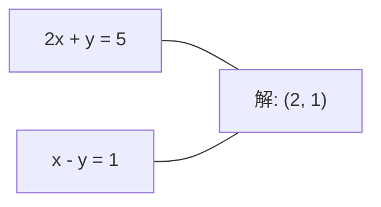
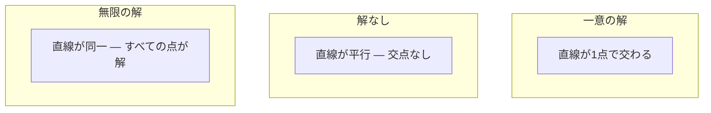

# 線形システム

> Ax = b を解くことは、数学で最も古い問題のひとつであり、今もニューラルネットワークを動かしています。


## 学習目標

- 部分ピボット選択と後退代入によるガウス消去法でAx = bを解く
- LU、QR、コレスキー分解で行列を因数分解し、それぞれが適切な場面を説明する
- 最小二乗法の正規方程式を導出し、線形回帰とリッジ回帰と結びつける
- 条件数を使って悪条件のシステムを診断し、正則化を適用して安定させる

## 問題の背景

線形回帰を学習するたびに、線形システムを解いています。最小二乗フィットを計算するたびに、線形システムを解いています。ニューラルネットワーク層が`y = Wx + b`を計算するたびに、線形システムの一方の辺を評価しています。正則化を加えると、システムを修正します。ガウス過程を使うと、行列を因数分解します。マハラノビス距離のために共分散行列を逆行列にすると、線形システムを解きます。

方程式Ax = bはどこにでも現れます。Aは既知の係数の行列です。bは既知の出力のベクトルです。xは求めたい未知数のベクトルです。線形回帰では、Aはデータ行列、bはターゲットベクトル、xは重みベクトルです。モデル全体はこれに帰着します：Axがなるべくbにになるようなxを見つける。

このレッスンではその方程式を解くためのすべての主要手法をゼロから構築します。なぜある手法は速く、別の手法は安定しているのか、なぜある手法は正方系でしか機能せず、他の手法は過決定系を扱えるのか、なぜ行列の条件数が答えに意味があるかどうかを決定するのかを理解します。

## 概念

### Ax = bの幾何学的意味

線形方程式系には幾何学的解釈があります。各方程式は超平面を定義します。解はすべての超平面が交わる点（または点の集合）です。

```
2x + y = 5          2次元の2本の直線。
x - y  = 1          x=2、y=1で交わる。
```



3つのことが起こり得ます：



行列の形式で「一意の解」はAが可逆であることを意味します。「解なし」はシステムが矛盾していることを意味します。「無限の解」はAが零空間を持つことを意味します。ほとんどのML問題は「厳密な解なし」のカテゴリに入ります。なぜなら未知数（パラメータ）より多くの方程式（データ点）があるためです。そこで最小二乗法が登場します。

### 列像 vs 行像

Ax = bを読む方法は2つあります。

**行像。** Aの各行が1つの方程式を定義します。各方程式は超平面です。解はそれらすべてが交わるところです。

**列像。** Aの各列はベクトルです。問いは次のようになります：Aの列のどの線形結合がbを生み出すか？

```
A = | 2  1 |    b = | 5 |
    | 1 -1 |        | 1 |

行像：2x + y = 5 と x - y = 1 を同時に解く。

列像：x1、x2 を次のように見つける：
  x1 * [2, 1] + x2 * [1, -1] = [5, 1]
  2 * [2, 1] + 1 * [1, -1] = [4+1, 2-1] = [5, 1]   確認。
```

列像がより基本的です。bがAの列空間にあれば、システムに解があります。なければ、列空間内の最も近い点を見つけます。その最も近い点が最小二乗解です。

### ガウス消去法

ガウス消去法はAx = bを後退代入で解ける上三角システムUx = cに変換します。最も直接的な手法です。

アルゴリズム：

```
1. 各列k（ピボット列）について：
   a. 行k以下で列kの最大要素を見つける（部分ピボット選択）。
   b. その行と行kを交換する。
   c. k以下の各行iについて：
      - 乗数 m = A[i][k] / A[k][k] を計算する
      - 行iから m 倍の行kを引く。
2. 後退代入：最後の方程式から上方向に解く。
```

例：

```
元の：
| 2  1  1 | 8 |       R2 = R2 - (2)R1     | 2  1   1 |  8 |
| 4  3  3 |20 |  -->  R3 = R3 - (1)R1 --> | 0  1   1 |  4 |
| 2  3  1 |12 |                            | 0  2   0 |  4 |

                       R3 = R3 - (2)R2     | 2  1   1 |  8 |
                                       --> | 0  1   1 |  4 |
                                           | 0  0  -2 | -4 |

後退代入：
  -2 * x3 = -4    -->  x3 = 2
  x2 + 2  = 4     -->  x2 = 2
  2*x1 + 2 + 2 = 8 --> x1 = 2
```

ガウス消去法にはO(n^3)演算が必要です。1000×1000システムの場合、約10億の浮動小数点演算です。高速ですが、同じAで複数のシステムを解く必要がある場合はより良い方法があります。

### 部分ピボット選択：なぜ重要か

ピボット選択なしでは、ガウス消去法は失敗するか無意味な結果を出す可能性があります。ピボット要素がゼロなら、ゼロで割ることになります。小さければ、丸め誤差が増幅します。

```
悪いピボット：                      部分ピボット選択ありの場合：
| 0.001  1 | 1.001 |            最初に行を交換：
| 1      1 | 2     |            | 1      1 | 2     |
                                 | 0.001  1 | 1.001 |
m = 1/0.001 = 1000              m = 0.001/1 = 0.001
R2 = R2 - 1000*R1               R2 = R2 - 0.001*R1
| 0.001  1     | 1.001   |      | 1      1     | 2     |
| 0     -999   | -999.0  |      | 0      0.999 | 0.999 |

x2 = 1.000 (正解)               x2 = 1.000 (正解)
x1 = (1.001 - 1)/0.001          x1 = (2 - 1)/1 = 1.000 (正解)
   = 0.001/0.001 = 1.000        乗数が小さいため安定。
```

精度が限られた浮動小数点演算では、ピボット選択なしのバージョンで有効桁を失う可能性があります。部分ピボット選択は常にエラーの増幅を最小化するために最大の利用可能なピボットを選択します。

### LU分解

LU分解はAを下三角行列Lと上三角行列Uに因数分解します：A = LU。L行列はガウス消去法の乗数を格納します。U行列は消去の結果です。

```
A = L @ U

| 2  1  1 |   | 1  0  0 |   | 2  1   1 |
| 4  3  3 | = | 2  1  0 | @ | 0  1   1 |
| 2  3  1 |   | 1  2  1 |   | 0  0  -2 |
```

なぜ消去するだけでなく因数分解するのか？LとUを持っていれば、新しいbに対するAx = bの解にはO(n^2)しかかかりません：

```
Ax = b
LUx = b
y = Ux とおく：
  Ly = b    （前進代入、O(n^2)）
  Ux = y    （後退代入、O(n^2)）
```

O(n^3)のコストは因数分解の際に一度だけかかります。後続の各解はO(n^2)です。同じAで異なるbベクトルを使って1000のシステムを解く必要がある場合、LUは総作業量を1000/3倍節約します。

部分ピボット選択付きでは、PA = LUが得られます。ここでPは行の交換を記録する置換行列です。

### QR分解

QR分解はAを直交行列Qと上三角行列Rに因数分解します：A = QR。

直交行列はQ^T Q = Iという性質を持ちます。その列は正規直交ベクトルです。Qで乗算すると長さと角度が保存されます。

```
A = Q @ R

Qは正規直交列を持つ：Q^T Q = I
Rは上三角

Ax = b を解くには：
  QRx = b
  Rx = Q^T b    （Q^Tで乗算するだけ、逆行列不要）
  後退代入でxを得る。
```

QRは最小二乗問題を解くためにLUより数値的に安定しています。グラム＝シュミット法はQを列ごとに構築します：

```
Aの列a1、a2、...を与えられたとき：

q1 = a1 / ||a1||

q2 = a2 - (a2 . q1) * q1        （q1への射影を引く）
q2 = q2 / ||q2||                （正規化）

q3 = a3 - (a3 . q1) * q1 - (a3 . q2) * q2
q3 = q3 / ||q3||

R[i][j] = qi . aj    （i <= jの場合）
```

各ステップは以前のすべてのqベクトルに沿った成分を除去し、新しい直交方向だけを残します。

### コレスキー分解

Aが対称（A = A^T）かつ正定値（すべての固有値が正）の場合、A = L L^TとしてLが下三角となるよう因数分解できます。これがコレスキー分解です。

```
A = L @ L^T

| 4  2 |   | 2  0 |   | 2  1 |
| 2  5 | = | 1  2 | @ | 0  2 |

L[i][i] = sqrt(A[i][i] - sum(L[i][k]^2 for k < i))
L[i][j] = (A[i][j] - sum(L[i][k]*L[j][k] for k < j)) / L[j][j]    （i > jの場合）
```

コレスキーはLUの2倍速くてストレージが半分で済みます。対称正定値行列にのみ機能しますが、それらは頻繁に現れます：

- 共分散行列は対称半正定値（正則化で正定値）。
- ガウス過程のカーネル行列は対称正定値。
- 凸関数の最小値でのヘッセ行列は対称正定値。
- A^T Aは常に対称半正定値。

ガウス過程では、コレスキーでカーネル行列Kを因数分解し、次にK alpha = yを解いて予測平均を得ます。コレスキー因子は周辺尤度のための対数行列式も与えます：log det(K) = 2 * sum(log(diag(L)))。

### 最小二乗法：Ax = bに厳密な解がない場合

Aがmxnでmがnより大きい場合（未知数より方程式が多い）、システムは過決定です。厳密な解はありません。代わりに、二乗誤差を最小化します：

```
minimize ||Ax - b||^2

これは二乗残差の和です：
  sum((A[i,:] @ x - b[i])^2 for i in range(m))
```

最小化は正規方程式を満たします：

```
A^T A x = A^T b
```

導出：||Ax - b||^2 = (Ax - b)^T (Ax - b) = x^T A^T A x - 2 x^T A^T b + b^T b を展開します。xに関する勾配を計算してゼロに設定：2 A^T A x - 2 A^T b = 0。

```
元のシステム（過決定、4方程式、2未知数）：
| 1  1 |         | 3 |
| 1  2 | x     = | 5 |       4つの方程式すべてを満たすxはない。
| 1  3 |         | 6 |
| 1  4 |         | 8 |

正規方程式：
A^T A = | 4  10 |    A^T b = | 22 |
        | 10 30 |            | 63 |

解：x = [1.5, 1.7]

これが線形回帰。x[0]は切片、x[1]は傾き。
```

### 正規方程式 = 線形回帰

対応は厳密です。線形回帰では、データ行列Xはサンプルごとに1行、特徴量ごとに1列を持ちます。ターゲットベクトルyはサンプルごとに1要素を持ちます。重みベクトルwは次を満たします：

```
X^T X w = X^T y
w = (X^T X)^(-1) X^T y
```

これが線形回帰の閉形式解です。`sklearn.linear_model.LinearRegression.fit()`へのすべての呼び出しはこれ（またはQRやSVDによる等価な方法）を計算します。

正則化項 lambda * I を行列に加えると、リッジ回帰が得られます：

```
(X^T X + lambda * I) w = X^T y
w = (X^T X + lambda * I)^(-1) X^T y
```

正則化により行列の条件が改善され（より正確に逆行列にできる）、重みをゼロに向けて縮小することで過学習を防ぎます。lambda > 0のとき行列X^T X + lambda * Iは常に対称正定値なので、コレスキーで解けます。

### 擬似逆行列（ムーア＝ペンローズ）

擬似逆行列A+は行列の逆行列を非正方行列と特異行列に一般化します。任意の行列Aに対して：

```
x = A+ b

ここで A+ = V Sigma+ U^T    （SVDで計算）
```

Sigma+は各非ゼロ特異値の逆数を取り、結果を転置して形成されます。A = U Sigma V^TならばA+ = V Sigma+ U^Tです。

```
A = U Sigma V^T        （SVD）

Sigma = | 5  0 |       Sigma+ = | 1/5  0  0 |
        | 0  2 |                | 0  1/2  0 |
        | 0  0 |

A+ = V Sigma+ U^T
```

擬似逆行列は最小ノルム最小二乗解を与えます。システムが以下の場合：
- 一意の解：A+ bがそれを与えます。
- 解なし：A+ bが最小二乗解を与えます。
- 無限の解：A+ bが最小||x||を持つものを与えます。

NumPyの`np.linalg.lstsq`と`np.linalg.pinv`は両方とも内部でSVDを使います。

### 条件数

条件数は入力の小さな変化に対して解がどれだけ敏感かを測ります。行列Aの条件数は：

```
kappa(A) = ||A|| * ||A^(-1)|| = sigma_max / sigma_min
```

ここでsigma_maxとsigma_minは最大と最小の特異値です。

```
良条件（kappa ~ 1）：                  悪条件（kappa ~ 10^15）：
bの小さな変化 -->                      bの小さな変化 -->
xの小さな変化                          xの巨大な変化

| 2  0 |   kappa = 2/1 = 2            | 1   1          |   kappa ~ 10^15
| 0  1 |   安全に解ける               | 1   1+10^(-15) |   解は無意味
```

経験則：
- kappa < 100：安全、解は正確。
- kappa ~ 10^k：浮動小数点演算からおよそk桁の精度を失う。
- kappa ~ 10^16（float64の場合）：解は無意味。行列は実質的に特異。

MLでは、特徴量がほぼ共線的なときに悪条件が起きます。正則化（lambda * Iを加える）は条件数をsigma_max / sigma_minから(sigma_max + lambda) / (sigma_min + lambda)に改善します。

### 反復法：共役勾配法

非常に大きなスパースシステム（数百万の未知数）では、LUやコレスキーのような直接法は高価すぎます。反復法は多くの反復にわたって推測を改善することで解を近似します。

共役勾配法（CG）はAが対称正定値のときAx = bを解きます。（厳密な演算では）最大n回の反復で厳密な解を見つけますが、Aの固有値が集まっている場合ははるかに速く収束します。

```
アルゴリズムの概略：
  x0 = 初期推測（多くの場合ゼロ）
  r0 = b - A x0           （残差）
  p0 = r0                 （探索方向）

  k = 0, 1, 2, ... に対して：
    alpha = (rk . rk) / (pk . A pk)
    x_{k+1} = xk + alpha * pk
    r_{k+1} = rk - alpha * A pk
    beta = (r_{k+1} . r_{k+1}) / (rk . rk)
    p_{k+1} = r_{k+1} + beta * pk
    if ||r_{k+1}|| < 許容誤差：停止
```

CGが使われる場所：
- 大規模最適化（ニュートン＝CG法）
- PDE離散化の解法
- カーネル行列が因数分解するには大きすぎるカーネル法
- 他の反復ソルバーの前処理

収束速度は条件数に依存します。条件が良いシステムはより速く収束します。これが正則化が役立つもう一つの理由です。

### 全体像：いつどの手法を使うか

| 手法 | 要件 | コスト | ユースケース |
|------|------|--------|------------|
| ガウス消去法 | 正方、非特異A | O(n^3) | 正方システムの一回限りの解法 |
| LU分解 | 正方、非特異A | O(n^3)因数分解 + O(n^2)解法 | 同じAで複数の解法 |
| QR分解 | 任意のA（m >= n） | O(mn^2) | 最小二乗、数値的に安定 |
| コレスキー | 対称正定値A | O(n^3/3) | 共分散行列、ガウス過程、リッジ回帰 |
| 正規方程式 | 過決定（m > n） | O(mn^2 + n^3) | 線形回帰（nが小さい） |
| SVD / 擬似逆行列 | 任意のA | O(mn^2) | ランク欠損システム、最小ノルム解 |
| 共役勾配法 | 対称正定値、スパースA | O(n * k * nnz) | 大規模スパースシステム、k = 反復数 |

### MLとの関係

このレッスンのすべての手法は本番MLで登場します：

**線形回帰。** 閉形式解は正規方程式X^T X w = X^T yを解きます。これはコレスキー（nが小さい場合）、QR（数値安定性が重要な場合）、またはSVD（行列がランク欠損の可能性がある場合）で行われます。

**リッジ回帰。** X^T Xにlambda * Iを加えます。正則化されたシステム(X^T X + lambda * I) w = X^T yは、lambda > 0のとき X^T X + lambda * Iが対称正定値なので常にコレスキーで解けます。

**ガウス過程。** 予測平均はK alpha = yを解く必要があります。Kはカーネル行列です。Kのコレスキー因数分解が標準的アプローチです。対数周辺尤度はlog det(K) = 2 sum(log(diag(L)))を使います。

**ニューラルネットワーク初期化。** 直交初期化はQR分解を使って列が正規直交である重み行列を作成します。これにより深いネットワークでのシグナルの崩壊を防ぎます。

**前処理。** 大規模なオプティマイザは共役勾配ソルバーの前処理として不完全コレスキーや不完全LUを使います。

**特徴量エンジニアリング。** X^T Xの条件数は特徴量が共線的かどうかを教えます。kappaが大きければ、特徴量を削除するか正則化を加えます。

## 実装

### ステップ1：部分ピボット選択付きガウス消去法

```python
import numpy as np

def gaussian_elimination(A, b):
    n = len(b)
    Ab = np.hstack([A.astype(float), b.reshape(-1, 1).astype(float)])

    for k in range(n):
        max_row = k + np.argmax(np.abs(Ab[k:, k]))
        Ab[[k, max_row]] = Ab[[max_row, k]]

        if abs(Ab[k, k]) < 1e-12:
            raise ValueError(f"ピボット {k} で行列が特異または近特異")

        for i in range(k + 1, n):
            m = Ab[i, k] / Ab[k, k]
            Ab[i, k:] -= m * Ab[k, k:]

    x = np.zeros(n)
    for i in range(n - 1, -1, -1):
        x[i] = (Ab[i, -1] - Ab[i, i+1:n] @ x[i+1:n]) / Ab[i, i]

    return x
```

### ステップ2：LU分解

```python
def lu_decompose(A):
    n = A.shape[0]
    L = np.eye(n)
    U = A.astype(float).copy()
    P = np.eye(n)

    for k in range(n):
        max_row = k + np.argmax(np.abs(U[k:, k]))
        if max_row != k:
            U[[k, max_row]] = U[[max_row, k]]
            P[[k, max_row]] = P[[max_row, k]]
            if k > 0:
                L[[k, max_row], :k] = L[[max_row, k], :k]

        for i in range(k + 1, n):
            L[i, k] = U[i, k] / U[k, k]
            U[i, k:] -= L[i, k] * U[k, k:]

    return P, L, U

def lu_solve(P, L, U, b):
    n = len(b)
    Pb = P @ b.astype(float)

    y = np.zeros(n)
    for i in range(n):
        y[i] = Pb[i] - L[i, :i] @ y[:i]

    x = np.zeros(n)
    for i in range(n - 1, -1, -1):
        x[i] = (y[i] - U[i, i+1:] @ x[i+1:]) / U[i, i]

    return x
```

### ステップ3：コレスキー分解

```python
def cholesky(A):
    n = A.shape[0]
    L = np.zeros_like(A, dtype=float)

    for i in range(n):
        for j in range(i + 1):
            s = A[i, j] - L[i, :j] @ L[j, :j]
            if i == j:
                if s <= 0:
                    raise ValueError("行列が正定値でない")
                L[i, j] = np.sqrt(s)
            else:
                L[i, j] = s / L[j, j]

    return L
```

### ステップ4：正規方程式による最小二乗法

```python
def least_squares_normal(A, b):
    AtA = A.T @ A
    Atb = A.T @ b
    return gaussian_elimination(AtA, Atb)

def ridge_regression(A, b, lam):
    n = A.shape[1]
    AtA = A.T @ A + lam * np.eye(n)
    Atb = A.T @ b
    L = cholesky(AtA)
    y = np.zeros(n)
    for i in range(n):
        y[i] = (Atb[i] - L[i, :i] @ y[:i]) / L[i, i]
    x = np.zeros(n)
    for i in range(n - 1, -1, -1):
        x[i] = (y[i] - L.T[i, i+1:] @ x[i+1:]) / L.T[i, i]
    return x
```

### ステップ5：条件数

```python
def condition_number(A):
    U, S, Vt = np.linalg.svd(A)
    return S[0] / S[-1]
```

## 活用

実データでの線形回帰とリッジ回帰への応用：

```python
np.random.seed(42)
X_raw = np.random.randn(100, 3)
w_true = np.array([2.0, -1.0, 0.5])
y = X_raw @ w_true + np.random.randn(100) * 0.1

X = np.column_stack([np.ones(100), X_raw])

w_ols = least_squares_normal(X, y)
print(f"OLS重み（自作）：    {w_ols}")

w_np = np.linalg.lstsq(X, y, rcond=None)[0]
print(f"OLS重み（numpy）：   {w_np}")
print(f"最大差：{np.max(np.abs(w_ols - w_np)):.2e}")

w_ridge = ridge_regression(X, y, lam=1.0)
print(f"リッジ重み（自作）：  {w_ridge}")

from sklearn.linear_model import Ridge
ridge_sk = Ridge(alpha=1.0, fit_intercept=False)
ridge_sk.fit(X, y)
print(f"リッジ重み（sklearn）：{ridge_sk.coef_}")
```

## 成果物

このレッスンは以下を生成します：
- ガウス消去法、LU分解、コレスキー分解、最小二乗法、リッジ回帰のゼロからの実装を含む`code/linear_systems.py`
- 正規方程式とsklearnのLinearRegressionが同じ重みを生成することを示す動作するデモ

## 演習

1. 自作のガウス消去法、LUソルバー、`np.linalg.solve`を使ってシステム`[[1,2,3],[4,5,6],[7,8,10]] x = [6, 15, 27]`を解きます。3つすべてが浮動小数点の許容誤差内で同じ答えを与えることを確認します。

2. 50×5のランダム行列Xとターゲットy = X @ w_true + ノイズを生成します。正規方程式、QR（`np.linalg.qr`経由）、SVD（`np.linalg.svd`経由）、`np.linalg.lstsq`を使ってwを解きます。4つすべての解を比較します。X^T Xの条件数を測定し、それがどの手法を信頼するかにどのように影響するかを説明します。

3. 2つの列をほぼ同一にする（例えば、列2 = 列1 + 1e-10 * ノイズ）ことでほぼ特異な行列を作成します。条件数を計算します。正則化あり（0.01 * Iを加える）となしでAx = bを解きます。解と残差を比較します。正則化が役立つ理由を説明します。

4. 100×100のランダムな対称正定値行列に対して共役勾配アルゴリズムを実装します。許容誤差1e-8に収束するまで何回の反復が必要かを数えます。n回反復という理論的最大値と比較します。

5. 10、50、200、500サイズの対称正定値行列で、自作コレスキーソルバー、LUソルバー、`np.linalg.solve`の速度を計測します。結果をプロットします。コレスキーがLUより約2倍速いことを確認します。

## キー用語

| 用語 | よく言われる説明 | 実際の意味 |
|------|----------------|------------|
| 線形システム | 「xを解く」 | 線形方程式系Ax = b。xを見つけることは変換Aの下で出力bを生み出す入力を見つけること。 |
| ガウス消去法 | 「行列を行階段形に変換する」 | 行操作を使って対角線の下のエントリを系統的にゼロにし、後退代入で解ける上三角システムを生成する。O(n^3)。 |
| 部分ピボット選択 | 「安定性のために行を交換する」 | 列kで消去する前に、その列で最大絶対値を持つ行をピボット位置に交換する。小さな数での除算を防ぐ。 |
| LU分解 | 「三角形に因数分解する」 | A = LUと書く。LはL（乗数を格納）、Uは上三角（消去された行列）。O(n^3)のコストを複数の解法に分散させる。 |
| QR分解 | 「直交因数分解」 | A = QRと書く。Qは正規直交列を持ち、Rは上三角。最小二乗法にLUより安定。 |
| コレスキー分解 | 「行列の平方根」 | 対称正定値AについてA = LL^Tと書く。LUの半分のコスト。共分散行列、カーネル行列、リッジ回帰に使用。 |
| 最小二乗法 | 「厳密が不可能なときの最善適合」 | システムが過決定（未知数より方程式が多い）のとき二乗残差の和||Ax - b||^2を最小化する。 |
| 正規方程式 | 「微積分のショートカット」 | A^T A x = A^T b。||Ax - b||^2の勾配をゼロに設定する。これが線形回帰の閉形式解。 |
| 擬似逆行列 | 「非正方行列の逆行列」 | A+ = V Sigma+ U^T（SVD経由）。正方、長方形、特異に関係なく任意の行列に対する最小ノルム最小二乗解を与える。 |
| 条件数 | 「この答えはどれほど信頼できるか」 | kappa = sigma_max / sigma_min。入力の摂動への感度を測る。約log10(kappa)桁の精度を失う。 |
| リッジ回帰 | 「正則化最小二乗法」 | (X^T X + lambda I) w = X^T yを解く。lambda Iを加えることで条件が改善し、重みがゼロに縮小し、過学習を防ぐ。 |
| 共役勾配法 | 「大きな行列のための反復Ax=b」 | 対称正定値システムのための反復ソルバー。最大nステップで収束する。因数分解が高価な大規模スパースシステムに実用的。 |
| 過決定システム | 「パラメータよりデータが多い」 | m×nシステムでm > n。厳密な解は存在しない。最小二乗法が最善の近似を見つける。これがすべての回帰問題。 |
| 後退代入 | 「下から上に解く」 | 上三角システムが与えられると、最後の方程式から先に解いて後退方向に代入する。O(n^2)。 |
| 前進代入 | 「上から下に解く」 | 下三角システムが与えられると、最初の方程式から先に解いて前進方向に代入する。O(n^2)。LU解法のLステップで使用。 |

## 参考資料

- [MIT 18.06: Linear Algebra](https://ocw.mit.edu/courses/18-06-linear-algebra-spring-2010/)（Gilbert Strang）――線形システムと行列因数分解の決定的なコース
- [Numerical Linear Algebra](https://people.maths.ox.ac.uk/trefethen/text.html)（Trefethen & Bau）――数値安定性、条件付け、アルゴリズムが失敗する理由の標準的リファレンス
- [Matrix Computations](https://www.cs.cornell.edu/cv/GolubVanLoan4/golubandvanloan.htm)（Golub & Van Loan）――すべての行列アルゴリズムの百科事典的リファレンス
- [3Blue1Brown: Inverse Matrices](https://www.3blue1brown.com/lessons/inverse-matrices)――Ax = bを解くことが幾何学的に意味することの視覚的直感
