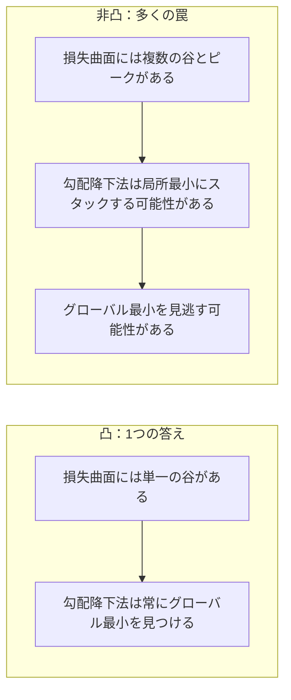
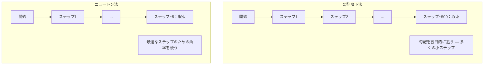
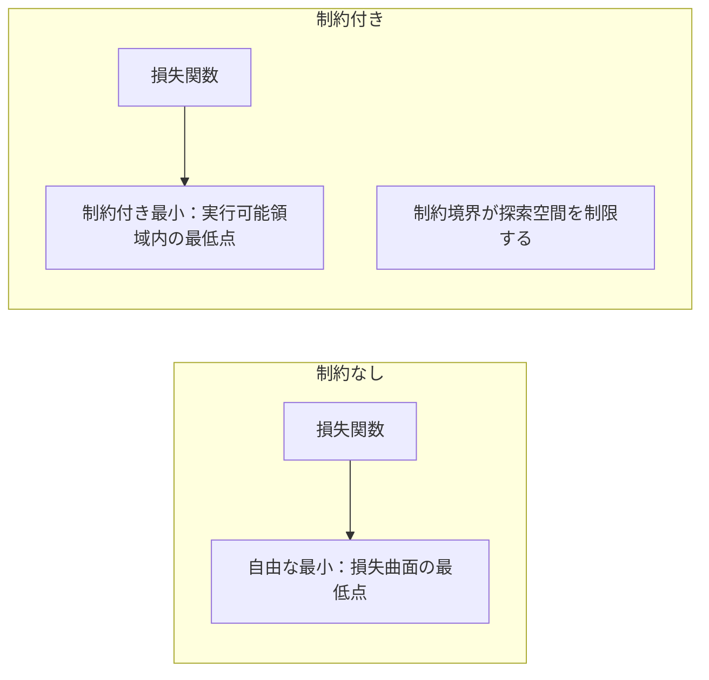
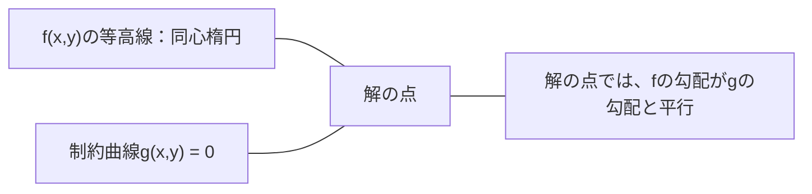

# 凸最適化

> 凸問題には1つの谷があります。ニューラルネットワークには数百万の谷があります。その違いを理解することが重要です。


## 学習目標

- 定義、二次導関数、ヘッセ行列の基準を使って関数の凸性を検定する
- ニュートン法を実装し、勾配降下法と比べた二次収束を比較する
- ラグランジュ乗数を使って制約付き最適化問題を解き、KKT条件を解釈する
- ニューラルネットワークの損失曲面が非凸でもSGDが良い解を見つける理由を説明する

## 問題の背景

レッスン08では勾配降下法、モメンタム、Adamを学びました。これらのオプティマイザはどんな曲面でも下り坂を歩きます。しかし保証がありません。非凸曲面での勾配降下法は悪い局所最小に陥ったり、鞍点でスタックしたり、永遠に振動したりする可能性があります。ニューラルネットワークが非凸で代替手段がないため、それでも使います。

しかし機械学習の多くの問題は凸です。線形回帰、ロジスティック回帰、SVM、LASSO、リッジ回帰。これらには数学的保証を持つより強力なものがあります。凸問題には1つの谷が厳密に存在します。下り坂を歩くあらゆるアルゴリズムがグローバル最小に到達します。再起動不要。学習率スケジュール不要。祈り不要。

凸性を理解すると3つのことが実現します。第一に、問題が簡単（凸）か困難（非凸）かを教えてくれます。第二に、凸問題にはニュートン法のような速いツールを与えてくれます。第三に、ML全体に現れる概念を説明します：制約としての正則化、SVMの双対性、そして凸性が与えるすべての良い性質に違反しているにも関わらずなぜ深層学習が機能するか。

## 概念

### 凸集合

集合Sは、S内の任意の2点を結ぶ線分がS内に完全に収まる場合に凸です。

| 凸集合 | 非凸 |
|--------|------|
| **長方形**：内部の任意の2点を内部にとどまる線分で結べる | **星/三日月形**：内部の2点を結ぶ線が集合の外に出ることがある |
| **三角形**：すべての内部点でこの性質が成立 | **ドーナツ/環状体**：穴があるため一部の線分が集合を出る |
| 任意の2点間の線分が集合内にとどまる | 一部の点のペア間の線分が集合を出る |

形式的な検定：S内の任意の点x、yと[0, 1]の任意のtについて、点tx + (1-t)yもSにある。

凸集合の例：
- 直線、平面、全Rn
- 球（円、球面、超球面）
- 半空間：{x : a^T x <= b}
- 任意の数の凸集合の交差

非凸集合の例：
- ドーナツ（環状体）
- 2つの交わらない円の和集合
- 「くぼみ」や「穴」のある集合

### 凸関数

関数fは、その定義域が凸集合であり、定義域内の任意の2点x、yと[0, 1]の任意のtに対して以下が成立する場合に凸です：

```
f(tx + (1-t)y) <= t*f(x) + (1-t)*f(y)
```

幾何学的に：グラフ上の任意の2点を結ぶ線分はグラフの上か上にあります。

| 性質 | 凸関数 | 非凸関数 |
|------|--------|---------|
| **線分テスト** | グラフ上の任意の2点を結ぶ線が曲線の**上か上に**ある | グラフ上の一部の点を結ぶ線が曲線の**下に**潜る |
| **形状** | 上に向かって湾曲する単一のボウル/谷 | 混合した曲率を持つ複数のピークと谷 |
| **局所最小** | すべての局所最小がグローバル最小 | 異なる高さの複数の局所最小が存在する可能性 |

一般的な凸関数：
- f(x) = x^2（放物線）
- f(x) = |x|（絶対値）
- f(x) = e^x（指数関数）
- f(x) = max(0, x)（ReLU、ただし区分線形）
- f(x) = -log(x) for x > 0（負の対数）
- 任意の線形関数 f(x) = a^T x + b（凸かつ凹）

### 凸性の検定

最も簡単なものから厳密なものまで、3つの実用的な検定があります。

**検定1：二次導関数検定（1次元）。** すべてのxでf''(x) >= 0ならば、fは凸です。

- f(x) = x^2：f''(x) = 2 >= 0。凸。
- f(x) = x^3：f''(x) = 6x。x < 0で負。凸でない。
- f(x) = e^x：f''(x) = e^x > 0。凸。

**検定2：ヘッセ行列検定（多変量）。** すべてのxでヘッセ行列H(x)が半正定値ならば、fは凸です。ヘッセ行列は二次偏微分の行列です。

**検定3：定義検定。** 不等式f(tx + (1-t)y) <= t*f(x) + (1-t)*f(y)を直接確認します。微分の計算が難しい関数に有用です。

### なぜ凸性が重要か

凸最適化の中心定理：

**凸関数では、すべての局所最小がグローバル最小です。**

これは勾配降下法が閉じ込められることができないことを意味します。下り坂のどの経路も同じ答えに至ります。アルゴリズムは最適解に収束することが保証されています。



帰結：
- ランダム再起動が不要
- 洗練された学習率スケジュールが不要
- 収束の証明が可能（速度は関数の性質による）
- 解は一意（平坦な領域まで）

### MLでの凸 vs 非凸

| 問題 | 凸？ | 理由 |
|------|------|------|
| 線形回帰（MSE） | はい | 損失は重みに関して二次的 |
| ロジスティック回帰 | はい | 対数損失は重みに関して凸 |
| SVM（ヒンジ損失） | はい | 線形関数の最大値 |
| LASSO（L1回帰） | はい | 凸関数の和は凸 |
| リッジ回帰（L2） | はい | 二次 + 二次 = 凸 |
| ニューラルネットワーク（任意の損失） | いいえ | 非線形活性化が非凸曲面を作る |
| k-meansクラスタリング | いいえ | 離散割り当てステップ |
| 行列分解 | いいえ | 未知数の積 |

凸損失を持つ線形モデルは凸です。非線形活性化を持つ隠れ層を追加した瞬間、凸性は崩れます。

### ヘッセ行列

関数f: R^n -> Rのヘッセ行列Hは二次偏微分のn×n行列です。

```
H[i][j] = d^2 f / (dx_i dx_j)
```

f(x, y) = x^2 + 3xy + y^2 の場合：

```
df/dx = 2x + 3y       d^2f/dx^2 = 2      d^2f/dxdy = 3
df/dy = 3x + 2y       d^2f/dydx = 3      d^2f/dy^2 = 2

H = [ 2  3 ]
    [ 3  2 ]
```

ヘッセ行列は曲率を教えます：
- 固有値がすべて正：関数はすべての方向で上に向かって湾曲（その点で凸）
- 固有値がすべて負：すべての方向で下に向かって湾曲（凹、局所最大）
- 符号が混在：鞍点（一部の方向で上に、他の方向で下に湾曲）
- ゼロの固有値：その方向で平坦（退化）

凸性のために、ヘッセ行列は1点だけでなくすべての場所で半正定値（固有値すべて >= 0）でなければなりません。

### ニュートン法

勾配降下法は一次情報（勾配）を使います。ニュートン法は二次情報（ヘッセ行列）を使います。現在の点で二次近似をフィットして、その二次関数の最小に直接ジャンプします。

```
更新規則：
  x_new = x - H^(-1) * 勾配

勾配降下法と比較：
  x_new = x - lr * 勾配
```

ニュートン法はスカラーの学習率を逆ヘッセ行列で置き換えます。これにより局所的な曲率に基づいてステップサイズと方向が自動的に調整されます。



利点：
- 最小付近での二次収束（各ステップで誤差が二乗される）
- 調整する学習率が不要
- スケール不変（問題のパラメータ化方法に関係なく機能する）

欠点：
- ヘッセ行列の計算にO(n^2)メモリと反転にO(n^3)が必要
- 100万の重みを持つニューラルネットワークでは10^12エントリと10^18演算
- 深層学習では実用的でない

### 制約付き最適化

制約なし最適化：すべてのxについてf(x)を最小化する。
制約付き最適化：制約を条件としてf(x)を最小化する。

実際の問題には制約があります。コストを最小化したいが予算に限りがある。誤差を最小化したいがモデルの複雑さが制限されている。



### ラグランジュ乗数

ラグランジュ乗数法は制約付き問題を制約なしに変換します。

問題：g(x) = 0の条件下でf(x)を最小化する。

解法：新しい変数（ラグランジュ乗数lambda）を導入して制約なし問題を解きます：

```
L(x, lambda) = f(x) + lambda * g(x)
```

解でLの勾配はゼロ：

```
dL/dx = df/dx + lambda * dg/dx = 0
dL/dlambda = g(x) = 0
```

幾何学的直感：制約付き最小では、fの勾配が制約gの勾配と平行でなければなりません。平行でなければ、制約曲面に沿って移動してfをさらに減らすことができます。



例：x + y = 1の条件下でf(x,y) = x^2 + y^2を最小化する。

```
L = x^2 + y^2 + lambda(x + y - 1)

dL/dx = 2x + lambda = 0  =>  x = -lambda/2
dL/dy = 2y + lambda = 0  =>  y = -lambda/2
dL/dlambda = x + y - 1 = 0

最初の2つから：x = y
代入：2x = 1、したがってx = y = 0.5、lambda = -1
```

直線x + y = 1上の原点に最も近い点は(0.5, 0.5)です。

### KKT条件

カルーシュ＝クーン＝タッカー条件はラグランジュ乗数を不等式制約に拡張します。

問題：i = 1, ..., m に対してg_i(x) <= 0の条件下でf(x)を最小化する。

KKT条件（最適性のための必要条件）：

```
1. 停留性：      df/dx + sum(lambda_i * dg_i/dx) = 0
2. 主実行可能性：g_i(x) <= 0  すべてのiについて
3. 双対実行可能性：lambda_i >= 0  すべてのiについて
4. 相補スラック性：lambda_i * g_i(x) = 0  すべてのiについて
```

相補スラック性が重要な洞察です：制約が活性（g_i = 0、解が境界にある）か乗数がゼロ（制約が問題にならない）かのどちらかです。解に影響しない制約はlambda = 0を持ちます。

KKT条件はSVMの中心です。サポートベクターは制約が活性なデータ点（lambda > 0）です。他のすべてのデータ点はlambda = 0を持ち、決定境界に影響しません。

### 制約付き最適化としての正則化

L1とL2正則化は恣意的なトリックではありません。それらは偽装された制約付き最適化問題です。

**L2正則化（リッジ）：**

```
minimize  Loss(w)  subject to  ||w||^2 <= t

等価な制約なし形式：
minimize  Loss(w) + lambda * ||w||^2
```

制約||w||^2 <= tは球（2次元では円、3次元では球面）を定義します。解は損失の等高線がこの球に最初に触れるところです。

**L1正則化（LASSO）：**

```
minimize  Loss(w)  subject to  ||w||_1 <= t

等価な制約なし形式：
minimize  Loss(w) + lambda * ||w||_1
```

制約||w||_1 <= tはダイヤモンド（2次元では回転した正方形）を定義します。

| 性質 | L2制約（円） | L1制約（ダイヤモンド） |
|------|-------------|---------------------|
| **制約形状** | 円（高次元では球面） | ダイヤモンド（2次元では回転した正方形） |
| **損失等高線が触れる場所** | 滑らかな境界 — 円上のどの点でも | 角 — 軸に沿って配置 |
| **解の挙動** | 重みは小さいが非ゼロ | 一部の重みが厳密にゼロ（スパース） |
| **結果** | 重みの縮小 | 特徴量選択 |

これがL1がスパースなモデル（特徴量選択）を生むがL2は重みを縮小するだけの理由です。ダイヤモンドは軸に沿って配置された角を持ちます。損失等高線は角に触れる可能性が高く、1つ以上の重みが厳密にゼロに設定されます。

### 双対性

すべての制約付き最適化問題（主問題）には伴問題（双対問題）があります。凸問題では、主問題と双対問題は同じ最適値を持ちます。これが強双対性です。

ラグランジュ双対関数：

```
主問題：minimize f(x) subject to g(x) <= 0
ラグランジアン：L(x, lambda) = f(x) + lambda * g(x)
双対関数：d(lambda) = min_x L(x, lambda)
双対問題：maximize d(lambda) subject to lambda >= 0
```

双対性が重要な理由：
- 双対問題が主問題より解きやすい場合がある
- SVMは双対形式で解かれ、データ点間のドット積（カーネルトリックを可能にする）に依存する問題になる
- 双対は主問題の最適値の下限を提供し、解の品質確認に有用

SVM専用では：

```
主問題：余白2/||w||を最大化するw、bを見つける（条件：
        y_i(w^T x_i + b) >= 1 すべてのiについて）

双対問題：sum(alpha_i) - 0.5 * sum_ij(alpha_i * alpha_j * y_i * y_j * x_i^T x_j)を最大化する
          （条件：alpha_i >= 0 かつ sum(alpha_i * y_i) = 0）

双対はドット積x_i^T x_jのみを含む。
x_i^T x_jをK(x_i, x_j)に置き換えるとカーネルトリックが得られる。
```

### 非凸にも関わらず深層学習が機能する理由

ニューラルネットワークの損失関数は激しく非凸です。古典的な指標ではどれも、それらを最適化することは失敗するはずです。それでも確率的勾配降下法は安定して良い解を見つけます。いくつかの要因がこれを説明します。

**ほとんどの局所最小は十分に良い。** 高次元空間では、ランダムな臨界点（勾配がゼロ）は局所最小ではなく圧倒的に鞍点です。存在する少数の局所最小はグローバル最小に近い損失値を持つ傾向があります。パラメータ空間が数百万の次元を持つとき、ひどい局所最小に閉じ込められることは極めてまれです。

**局所最小ではなく鞍点が本当の障害。** n個のパラメータを持つ関数では、鞍点は正と負の曲率方向が混在しています。高次元のランダムな臨界点では、n個すべての固有値が正（局所最小）である確率はおよそ2^(-n)です。ほぼすべての臨界点が鞍点です。SGDのノイズが脱出を助けます。

**過パラメータ化が曲面を滑らかにする。** 学習データより多くのパラメータを持つネットワークはより滑らかで、より接続された損失曲面を持ちます。幅の広いネットワークは悪い局所最小が少ないです。これは直感に反しますが経験的に一貫しています。

**損失曲面の構造：**

| 性質 | 低次元空間 | 高次元空間 |
|------|-----------|-----------|
| **曲面** | 孤立した多くのピークと谷 | 滑らかに接続された谷 |
| **最小** | 多くの孤立した局所最小 | 悪い局所最小は少ない、ほとんどは準最適 |
| **ナビゲーション** | グローバル最小を見つけるのが困難 | 多くの経路が良い解に至る |
| **臨界点** | 局所最小と鞍点の混在 | 圧倒的に鞍点、局所最小でない |

**確率的ノイズが暗黙的正則化として機能する。** ミニバッチSGDは尖った最小に落ち着くことを防ぐノイズを加えます。尖った最小は過学習し、平坦な最小は汎化します。ノイズは最適化を損失曲面の平坦な領域に向けてバイアスします。

### 実用的な二次最適化手法

純粋なニュートン法は大規模モデルには実用的でありません。いくつかの近似が二次情報を使用可能にします。

**L-BFGS（限定メモリBFGS）：** 最後のm個の勾配差を使って逆ヘッセ行列を近似します。O(n^2)ではなくO(mn)メモリが必要です。約10,000パラメータまでの問題でうまく機能します。古典的ML（ロジスティック回帰、CRF）で使用されますが深層学習では使われません。

**自然勾配：** 標準的なヘッセ行列の代わりにフィッシャー情報行列（対数尤度の期待ヘッセ行列）を使います。確率分布の幾何学を考慮します。K-FAC（クロネッカー積で因数分解された近似曲率）はフィッシャー行列をクロネッカー積として近似し、ニューラルネットワークに実用的にします。

**ヘッセフリー最適化：** Hを決して形成せずに共役勾配でHx = gを解きます。ヘッセ＝ベクトル積のみが必要で、自動微分によりO(n)時間で計算できます。

**対角近似：** Adamの第2モーメントはヘッセ行列対角線の対角近似です。AdaHessianはハッチンソン推定量によって実際のヘッセ行列対角要素を使ってこれを拡張します。

| 手法 | メモリ | ステップあたりコスト | いつ使うか |
|------|--------|-------------------|------------|
| 勾配降下法 | O(n) | O(n) | ベースライン、大規模モデル |
| ニュートン法 | O(n^2) | O(n^3) | 小さな凸問題 |
| L-BFGS | O(mn) | O(mn) | 中規模な凸問題 |
| Adam | O(n) | O(n) | 深層学習のデフォルト |
| K-FAC | O(n) | O(n)層ごと | 研究、大バッチ学習 |

## 実装

### ステップ1：凸性チェッカー

点をサンプリングして定義を確認することで凸性を経験的にテストする関数を構築します。

```python
import random
import math

def check_convexity(f, dim, bounds=(-5, 5), samples=1000):
    violations = 0
    for _ in range(samples):
        x = [random.uniform(*bounds) for _ in range(dim)]
        y = [random.uniform(*bounds) for _ in range(dim)]
        t = random.uniform(0, 1)
        mid = [t * xi + (1 - t) * yi for xi, yi in zip(x, y)]
        lhs = f(mid)
        rhs = t * f(x) + (1 - t) * f(y)
        if lhs > rhs + 1e-10:
            violations += 1
    return violations == 0, violations
```

### ステップ2：2次元でのニュートン法

明示的なヘッセ行列を使ったニュートン法を実装します。勾配降下法と比べた収束速度を比較します。

```python
def newtons_method(f, grad_f, hessian_f, x0, steps=50, tol=1e-12):
    x = list(x0)
    history = [x[:]]
    for _ in range(steps):
        g = grad_f(x)
        H = hessian_f(x)
        det = H[0][0] * H[1][1] - H[0][1] * H[1][0]
        if abs(det) < 1e-15:
            break
        H_inv = [
            [H[1][1] / det, -H[0][1] / det],
            [-H[1][0] / det, H[0][0] / det],
        ]
        dx = [
            H_inv[0][0] * g[0] + H_inv[0][1] * g[1],
            H_inv[1][0] * g[0] + H_inv[1][1] * g[1],
        ]
        x = [x[0] - dx[0], x[1] - dx[1]]
        history.append(x[:])
        if sum(gi ** 2 for gi in g) < tol:
            break
    return history
```

### ステップ3：ラグランジュ乗数ソルバー

ラグランジアンの勾配降下法を使って制約付き最適化を解きます。

```python
def lagrange_solve(f_grad, g_val, g_grad, x0, lr=0.01,
                   lr_lambda=0.01, steps=5000):
    x = list(x0)
    lam = 0.0
    history = []
    for _ in range(steps):
        fg = f_grad(x)
        gv = g_val(x)
        gg = g_grad(x)
        x = [
            xi - lr * (fgi + lam * ggi)
            for xi, fgi, ggi in zip(x, fg, gg)
        ]
        lam = lam + lr_lambda * gv
        history.append((x[:], lam, gv))
    return history
```

### ステップ4：一次 vs 二次の比較

同じ二次関数で勾配降下法とニュートン法を実行します。収束までのステップ数を数えます。

```python
def quadratic(x):
    return 5 * x[0] ** 2 + x[1] ** 2

def quadratic_grad(x):
    return [10 * x[0], 2 * x[1]]

def quadratic_hessian(x):
    return [[10, 0], [0, 2]]
```

ニュートン法は1ステップで収束します（二次関数では厳密です）。勾配降下法はヘッセ行列の固有値が5の比率で異なり細長い谷を作るため、何百ステップもかかります。

## 活用

凸性分析はMLモデルとソルバーを選択する際に直接適用されます。

凸問題（ロジスティック回帰、SVM、LASSO）の場合：
- 専用ソルバーを使う（liblinear、CVXPY、scipy.optimize.minimizeのmethod='L-BFGS-B'）
- 一意なグローバル解を期待する
- 二次手法が実用的で高速

非凸問題（ニューラルネットワーク）の場合：
- 一次手法を使う（SGD、Adam）
- 解が初期化とランダム性に依存することを受け入れる
- 暗黙的正則化として過パラメータ化、ノイズ、学習率スケジュールを使う
- グローバル最小を探すことに時間を無駄にしない。良い局所最小で十分です。

```python
from scipy.optimize import minimize

result = minimize(
    fun=lambda w: sum((y - X @ w) ** 2) + 0.1 * sum(w ** 2),
    x0=np.zeros(d),
    method='L-BFGS-B',
    jac=lambda w: -2 * X.T @ (y - X @ w) + 0.2 * w,
)
```

SVMでは、双対形式でカーネルトリックを使えます：

```python
from sklearn.svm import SVC

svm = SVC(kernel='rbf', C=1.0)
svm.fit(X_train, y_train)
print(f"サポートベクター: {svm.n_support_}")
```

## 演習

1. **凸性ギャラリー。** チェッカーを使ってこれらの関数の凸性をテストします：f(x) = x^4、f(x) = sin(x)、f(x,y) = x^2 + y^2、f(x,y) = x*y、f(x) = max(x, 0)。各結果が理にかなっている理由を説明します。

2. **ニュートン法 vs 勾配降下法レース。** 開始点（10, 10）からf(x,y) = 50*x^2 + y^2について両方の手法を実行します。損失 < 1e-10 に達するまでそれぞれ何ステップ必要ですか？ヘッセ行列の条件数（最大と最小の固有値の比）が増加すると勾配降下法に何が起きますか？

3. **ラグランジュ乗数の幾何学。** x + 2y = 4の条件下でf(x,y) = (x-3)^2 + (y-3)^2を最小化します。解でfの勾配がgの勾配と平行であることを確認して解を検証します。

4. **正則化制約。** L1制約付き最適化を実装します：|x| + |y| <= 1の条件下で(x-3)^2 + (y-2)^2を最小化します。解の1つの座標がゼロ（ダイヤモンド制約によるスパース性）であることを示します。

5. **ヘッセ行列固有値分析。** (1,1)と(-1,1)でRosenbrock関数のヘッセ行列を計算します。両方の点で固有値を計算します。固有値が最小値と最小値から遠い点での曲率について何を教えてくれますか？

## キー用語

| 用語 | 意味 |
|------|------|
| 凸集合 | 集合内の任意の2点間の線分が集合内にとどまる集合 |
| 凸関数 | グラフ上の任意の2点間の線がグラフの上または上にある関数。同等にヘッセ行列がすべての場所で半正定値 |
| 局所最小 | すべての近くの点より低い点。凸関数では、すべての局所最小がグローバル最小 |
| グローバル最小 | 全定義域上での関数の最低点 |
| ヘッセ行列 | すべての二次偏微分の行列。曲率情報をエンコード |
| 半正定値 | 固有値がすべて非負の行列。「二次導関数 >= 0」の多次元類似 |
| 条件数 | ヘッセ行列の最大と最小の固有値の比。条件数が高いと細長い谷と遅い勾配降下法を意味する |
| ニュートン法 | ステップの方向とサイズを決定するために逆ヘッセ行列を使う二次オプティマイザ。最小付近で二次収束 |
| ラグランジュ乗数 | 制約付き最適化問題を制約なしに変換するために導入される変数 |
| KKT条件 | 不等式制約付きの最適性のための必要条件。ラグランジュ乗数を一般化 |
| 相補スラック性 | 解では、制約が活性かその乗数がゼロのどちらか。両方が非ゼロになることはない |
| 双対性 | すべての制約付き問題には伴となる双対問題がある。凸問題では両方が同じ最適値を持つ |
| 強双対性 | 主問題と双対問題の最適値が等しい。スレーターの条件を満たす凸問題で成立 |
| L-BFGS | 完全なヘッセ行列の代わりに最後のm個の勾配差を格納する近似二次手法 |
| 鞍点 | 勾配がゼロだが一部の方向では最小、他の方向では最大の点 |
| 過パラメータ化 | 学習データより多くのパラメータを使う。損失曲面を滑らかにして悪い局所最小を減らす |

## 参考資料

- [Boyd & Vandenberghe: Convex Optimization](https://web.stanford.edu/~boyd/cvxbook/) ―標準教科書、オンラインで無料公開
- [Bottou, Curtis, Nocedal: Optimization Methods for Large-Scale Machine Learning (2018)](https://arxiv.org/abs/1606.04838) ―凸最適化理論と深層学習実践を橋渡しする
- [Choromanska et al.: The Loss Surfaces of Multilayer Networks (2015)](https://arxiv.org/abs/1412.0233) ―非凸なニューラルネットワーク曲面がなぜそれほど悪くないか
- [Nocedal & Wright: Numerical Optimization](https://link.springer.com/book/10.1007/978-0-387-40065-5) ―ニュートン法、L-BFGS、制約付き最適化の総合リファレンス
