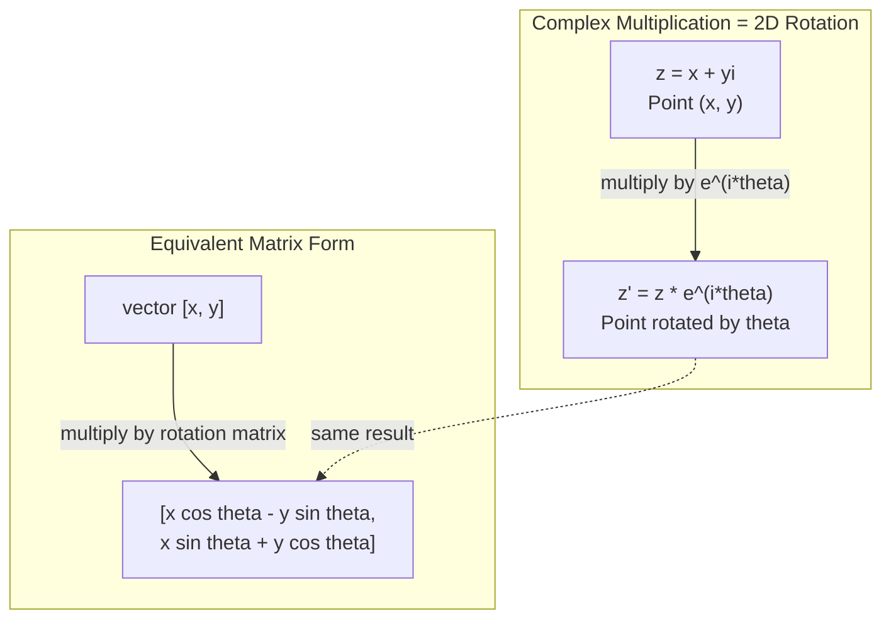
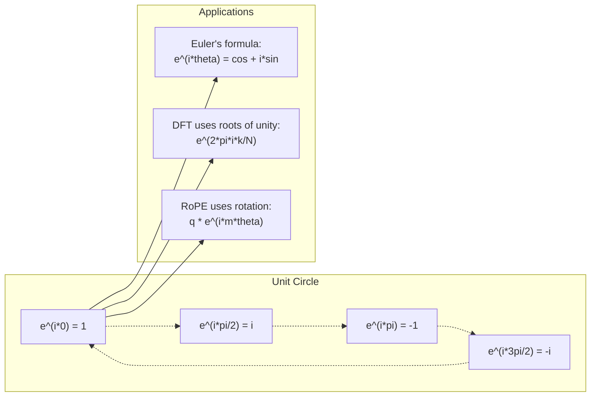

# AIのための複素数

> -1の平方根は「虚」ではありません。それは回転、周波数、そして信号処理の半分を解き明かす鍵です。


## 学習目標

- 直交形式と極形式の両方で複素数の演算（加算、乗算、除算、共役）を行う
- オイラーの公式を適用して複素指数関数と三角関数を相互変換する
- 複素単位根を使って離散フーリエ変換を実装する
- 複素数の回転がトランスフォーマーにおけるRoPEと正弦波位置エンコーディングの基礎となっていることを説明する

## 問題の背景

フーリエ変換の論文を開くと`i`があちこちにあります。トランスフォーマーの位置エンコーディングを見ると異なる周波数での`sin`と`cos`が見えます——これらは複素指数関数の実部と虚部です。量子コンピューティングを読むとすべてが複素ベクトル空間で表現されています。

複素数は抽象的に見えます。-1の平方根の上に構築された数系は数学的なトリックのように感じられます。しかしそれはトリックではありません。それは回転と振動の自然な言語です。何かが回転したり、振動したり、発振したりするたびに、複素数は適切なツールです。

複素数を理解しなければ、離散フーリエ変換を理解できません。FFTを理解できません。現代の言語モデルにおけるRoPE（回転位置埋め込み）がどのように機能するかを理解できません。元のTransformerの論文の正弦波位置エンコーディングが使用する周波数が何故かを理解できません。

このレッスンでは複素数の算術をゼロから構築し、幾何学と結びつけ、機械学習のどこに複素数が現れるかを正確に示します。

## 概念

### 複素数とは何か？

複素数には2つの部分があります：実部と虚部。

```
z = a + bi

ここで：
  a は実部
  b は虚部
  i はi^2 = -1で定義される虚数単位
```

それだけです。数直線を平面に拡張します。実数は一方の軸にあります。虚数はもう一方の軸にあります。すべての複素数はこの平面上の点です。

### 複素数の演算

**加算。** 実部同士、虚部同士を加算します。

```
(a + bi) + (c + di) = (a + c) + (b + d)i

例：(3 + 2i) + (1 + 4i) = 4 + 6i
```

**乗算。** 分配法則を使い、i^2 = -1を覚えておきます。

```
(a + bi)(c + di) = ac + adi + bci + bdi^2
                 = ac + adi + bci - bd
                 = (ac - bd) + (ad + bc)i

例：(3 + 2i)(1 + 4i) = 3 + 12i + 2i + 8i^2
                      = 3 + 14i - 8
                      = -5 + 14i
```

**共役。** 虚部の符号を反転します。

```
(a + bi)の共役 = a - bi
```

複素数とその共役の積は常に実数です：

```
(a + bi)(a - bi) = a^2 + b^2
```

**除算。** 分子と分母に分母の共役を乗算します。

```
(a + bi) / (c + di) = (a + bi)(c - di) / (c^2 + d^2)
```

これで分母から虚部が消え、きれいな複素数が得られます。

### 複素平面

複素平面はすべての複素数を2次元の点にマップします。横軸が実軸、縦軸が虚軸です。

```
z = 3 + 2i  は点(3, 2)に対応
z = -1 + 0i は実軸上の点(-1, 0)に対応
z = 0 + 4i  は点(0, 4)に対応（虚軸上）
```

複素数は同時に点でもあり、原点からのベクトルでもあります。この二重解釈が複素数を幾何学に役立てます。

### 極形式

平面上の任意の点は、原点からの距離と正の実軸からの角度で表せます。

```
z = r * (cos(theta) + i*sin(theta))

ここで：
  r = |z| = sqrt(a^2 + b^2)     （大きさ、または絶対値）
  theta = atan2(b, a)             （偏角、または引数）
```

直交形式（a + bi）は加算に適しています。極形式（r, theta）は乗算に適しています。

**極形式での乗算。** 大きさを乗算し、角度を加算します。

```
z1 = r1 * e^(i*theta1)
z2 = r2 * e^(i*theta2)

z1 * z2 = (r1 * r2) * e^(i*(theta1 + theta2))
```

これが複素数が回転に完璧な理由です。大きさ1の複素数を乗算するのは純粋な回転です。

### オイラーの公式

複素指数関数と三角法の橋渡し：

```
e^(i*theta) = cos(theta) + i*sin(theta)
```

これはこのレッスンで最も重要な公式です。theta = piのとき：

```
e^(i*pi) = cos(pi) + i*sin(pi) = -1 + 0i = -1

したがって：e^(i*pi) + 1 = 0
```

5つの基本定数（e、i、pi、1、0）が1つの方程式で結ばれています。

### オイラーの公式がMLに重要な理由

オイラーの公式は`e^(i*theta)`がthetaの変化に従って単位円を追跡することを示します。theta = 0では(1, 0)にいます。theta = pi/2では(0, 1)にいます。theta = piでは(-1, 0)にいます。theta = 3*pi/2では(0, -1)にいます。一回転はtheta = 2*piです。

これは複素指数関数が回転であることを意味します。そして回転は信号処理とMLのあらゆるところにあります。

### 2次元回転との接続

複素数（x + yi）にe^(i*theta)を乗算すると、点(x, y)が原点周りに角度thetaだけ回転します。

```
複素乗算による回転：
  (x + yi) * (cos(theta) + i*sin(theta))
  = (x*cos(theta) - y*sin(theta)) + (x*sin(theta) + y*cos(theta))i

行列乗算による回転：
  [cos(theta)  -sin(theta)] [x]   [x*cos(theta) - y*sin(theta)]
  [sin(theta)   cos(theta)] [y] = [x*sin(theta) + y*cos(theta)]
```

結果は同一です。複素乗算は2次元回転です。回転行列は行列記法で書かれた複素乗算に過ぎません。



### フェーザーと回転信号

複素指数関数e^(i*omega*t)は角周波数omegaで単位円を回転する点です。tが増加するにつれて、点は円を追跡します。

この回転点の実部はcos(omega*t)です。虚部はsin(omega*t)です。正弦波信号は回転する複素数の影です。

```
e^(i*omega*t) = cos(omega*t) + i*sin(omega*t)

実部：      cos(omega*t)    -- コサイン波
虚部：      sin(omega*t)    -- サイン波
```

これがフェーザー表現です。うねるサイン波を追跡する代わりに、なめらかに回転する矢印を追跡します。位相シフトは角度オフセットになります。振幅変化は大きさの変化になります。信号の加算はベクトル加算になります。

### 単位根

N番目の単位根は単位円上に均等に配置されたN個の点です：

```
w_k = e^(2*pi*i*k/N)    k = 0, 1, 2, ..., N-1について
```

N = 4の場合、根は：1、i、-1、-i（4つの方位点）。
N = 8の場合、4つの方位点に4つの対角線上の点が加わります。

単位根は離散フーリエ変換の基礎です。DFTはN個の等間隔な周波数の成分に信号を分解します。

### DFTへの接続

信号x[0], x[1], ..., x[N-1]の離散フーリエ変換は：

```
X[k] = sum_{n=0}^{N-1} x[n] * e^(-2*pi*i*k*n/N)
```

各X[k]は信号がk番目の単位根（周波数kでの複素正弦波）とどれほど相関しているかを測定します。DFTは信号をN個の回転フェーザーに分解し、それぞれの振幅と位相を教えます。

### iが「虚」でない理由

「虚」という言葉は歴史的な偶然です。デカルトが軽蔑的に使いました。しかしiは、最初人々に拒絶されたときの負の数より「虚」ではありません。負の数は「3から5を引いて何を得るか？」に答えます。虚数単位は「二乗すると-1になるのは何か？」に答えます。

より便利には：iは90度回転演算子です。実数にiを一度乗算すると90度回転して虚軸に移動します。もう一度iを乗算すると（i^2）、さらに90度回転します——今度は負の実数方向を向いています。これがi^2 = -1の理由です。神秘的ではありません。2つの四分の一回転から構成された半回転です。

これが複素数が工学のあらゆるところにある理由です。回転するもの——電磁波、量子状態、信号の発振、位置エンコーディング——はすべて複素数で自然に記述されます。

### 複素指数関数 vs 三角関数

オイラーの公式以前、工学者はA*cos(omega*t + phi)として信号を書いていました——振幅A、周波数omega、位相phi。これは機能しますが算術が面倒です。異なる位相の2つのコサインを加算するには三角恒等式が必要です。

複素指数関数では、同じ信号はA*e^(i*(omega*t + phi))です。2つの信号の加算は単に2つの複素数の加算です。乗算（変調）は単に大きさを乗算して角度を加算することです。位相シフトは角度の加算になります。周波数シフトはフェーザーによる乗算になります。

信号処理の全分野が複素指数関数記法に切り替えたのは、数学がより整理されているためです。「実際の信号」は常に複素表現の実部だけです。虚部はすべての代数が自然に機能するように持ち越される帳簿係として運ばれます。

### トランスフォーマーへの接続

**正弦波位置エンコーディング**（元のTransformerの論文）：

```
PE(pos, 2i) = sin(pos / 10000^(2i/d))
PE(pos, 2i+1) = cos(pos / 10000^(2i/d))
```

sinとcosのペアは、異なる周波数での複素指数関数の実部と虚部です。各周波数は位置をエンコードするための異なる「解像度」を提供します。低周波はゆっくり変化します（粗い位置）。高周波は速く変化します（細かい位置）。合わせて各位置に独自の周波数フィンガープリントを与えます。

**RoPE（回転位置埋め込み）** はさらに進んでいます。クエリとキーベクトルに明示的に複素回転行列を乗算します。2つのトークン間の相対位置が回転角になります。アテンションはこれらの回転されたベクトルを使って計算され、モデルが複素乗算を通じて相対位置に敏感になります。

| 演算 | 代数形式 | 幾何学的意味 |
|------|---------|------------|
| 加算 | (a+c) + (b+d)i | 平面でのベクトル加算 |
| 乗算 | (ac-bd) + (ad+bc)i | 回転とスケーリング |
| 共役 | a - bi | 実軸に関して反射 |
| 大きさ | sqrt(a^2 + b^2) | 原点からの距離 |
| 偏角 | atan2(b, a) | 正の実軸からの角度 |
| 除算 | 共役で乗算 | 回転を逆にしてスケール変更 |
| 累乗 | r^n * e^(i*n*theta) | n回回転、r^nでスケーリング |



## 実装

### ステップ1：Complexクラス

直交形式と極形式の変換、大きさ、偏角、演算をサポートするComplexクラスを構築します。

```python
import math

class Complex:
    def __init__(self, real, imag=0.0):
        self.real = real
        self.imag = imag

    def __add__(self, other):
        return Complex(self.real + other.real, self.imag + other.imag)

    def __mul__(self, other):
        r = self.real * other.real - self.imag * other.imag
        i = self.real * other.imag + self.imag * other.real
        return Complex(r, i)

    def __truediv__(self, other):
        denom = other.real ** 2 + other.imag ** 2
        r = (self.real * other.real + self.imag * other.imag) / denom
        i = (self.imag * other.real - self.real * other.imag) / denom
        return Complex(r, i)

    def magnitude(self):
        return math.sqrt(self.real ** 2 + self.imag ** 2)

    def phase(self):
        return math.atan2(self.imag, self.real)

    def conjugate(self):
        return Complex(self.real, -self.imag)
```

### ステップ2：極形式変換とオイラーの公式

```python
def to_polar(z):
    return z.magnitude(), z.phase()

def from_polar(r, theta):
    return Complex(r * math.cos(theta), r * math.sin(theta))

def euler(theta):
    return Complex(math.cos(theta), math.sin(theta))
```

検証：`euler(theta).magnitude()`は常に1.0になるはずです。`euler(0)`は(1, 0)を返すはずです。`euler(pi)`は(-1, 0)を返すはずです。

### ステップ3：回転

点(x, y)を角度thetaだけ回転させるのは1つの複素乗算です：

```python
point = Complex(3, 4)
rotated = point * euler(math.pi / 4)
```

大きさは変わりません。角度だけが変化します。

### ステップ4：複素演算によるDFT

```python
def dft(signal):
    N = len(signal)
    result = []
    for k in range(N):
        total = Complex(0, 0)
        for n in range(N):
            angle = -2 * math.pi * k * n / N
            total = total + Complex(signal[n], 0) * euler(angle)
        result.append(total)
    return result
```

これはO(N^2)のDFTです。各出力X[k]は信号サンプルに単位根を乗じたものの総和です。

### ステップ5：逆DFT

逆DFTは周波数スペクトルから元の信号を再構成します。順方向DFTからの変更点は指数の符号を反転してNで割ることだけです。

```python
def idft(spectrum):
    N = len(spectrum)
    result = []
    for n in range(N):
        total = Complex(0, 0)
        for k in range(N):
            angle = 2 * math.pi * k * n / N
            total = total + spectrum[k] * euler(angle)
        result.append(Complex(total.real / N, total.imag / N))
    return result
```

これで完全な再構成が得られます。DFTを適用し、次にIDFTを適用すると、機械精度で元の信号が得られます。情報は失われません。

### ステップ6：単位根

```python
def roots_of_unity(N):
    return [euler(2 * math.pi * k / N) for k in range(N)]
```

2つの性質を検証します：
- すべての根の大きさが正確に1.0
- N個のすべての根の和がゼロ（対称性によって打ち消される）

これらの性質がDFTを可逆にします。単位根は周波数領域での直交基底を形成します。

## 活用

PythonにはビルトインのComplex数サポートがあります。リテラル`j`が虚数単位を表します。

```python
z = 3 + 2j
w = 1 + 4j

print(z + w)
print(z * w)
print(abs(z))

import cmath
print(cmath.phase(z))
print(cmath.exp(1j * cmath.pi))
```

配列にはnumpyが複素数をネイティブに処理します：

```python
import numpy as np

z = np.array([1+2j, 3+4j, 5+6j])
print(np.abs(z))
print(np.angle(z))
print(np.conj(z))
print(np.real(z))
print(np.imag(z))

signal = np.sin(2 * np.pi * 5 * np.linspace(0, 1, 128))
spectrum = np.fft.fft(signal)
freqs = np.fft.fftfreq(128, d=1/128)
```

## 成果物

`code/complex_numbers.py`を実行して`outputs/skill-complex-arithmetic.md`を生成します。

## 演習

1. **手計算による複素演算。** (2 + 3i) * (4 - i)を計算してコードで検証します。次に(5 + 2i) / (1 - 3i)を計算します。両方の結果を複素平面に描き、乗算が最初の数を回転させてスケールしたことを確認します。

2. **回転の連続。** 点(1, 0)から始めます。e^(i*pi/6)を12回乗算します。12回の乗算後に(1, 0)に戻ることを検証します。各ステップの座標を出力し、それらが正12角形を追跡することを確認します。

3. **既知の信号のDFT。** sin(2*pi*3*t)と0.5*sin(2*pi*7*t)の和から成る信号を32点でサンプリングします。DFTを実行します。振幅スペクトルが周波数3と7にピークを持ち、7のピークが3のピークの半分の高さであることを検証します。

4. **単位根の可視化。** 8番目の単位根を計算します。合計がゼロになることを検証します。任意の根に原始根e^(2*pi*i/8)を乗算すると次の根になることを検証します。

5. **回転行列の等価性。** 10個のランダムな角度と10個のランダムな点について、複素乗算が2x2回転行列による行列ベクトル乗算と同じ結果を与えることを検証します。最大の数値差を出力します。

## キー用語

| 用語 | 意味 |
|------|------|
| 複素数 | a + biという数、ここでaは実部、bは虚部、i^2 = -1 |
| 虚数単位 | i^2 = -1で定義されるiという数。哲学的な意味では「虚」ではない——回転演算子 |
| 複素平面 | x軸が実数でy軸が虚数の2次元平面。アルガン平面とも呼ばれる |
| 大きさ（絶対値） | 原点からの距離：sqrt(a^2 + b^2)。|z|と書く |
| 偏角（引数） | 正の実軸からの角度：atan2(b, a)。arg(z)と書く |
| 共役 | 実軸に関する鏡像：a + biの共役はa - bi |
| 極形式 | zをa + biの代わりにr * e^(i*theta)として表す。乗算が簡単 |
| オイラーの公式 | e^(i*theta) = cos(theta) + i*sin(theta)。指数関数と三角法を結ぶ |
| フェーザー | 正弦波信号を表す回転する複素数e^(i*omega*t) |
| 単位根 | k = 0からN-1についてのN個の複素数e^(2*pi*i*k/N)。単位円上のN個の等間隔な点 |
| DFT | 離散フーリエ変換。単位根を使って信号を複素正弦波成分に分解する |
| RoPE | 回転位置埋め込み。複素乗算を使ってトランスフォーマーのアテンションで相対位置をエンコードする |

## 参考資料

- [オイラーの公式の視覚的入門](https://betterexplained.com/articles/intuitive-understanding-of-eulers-formula/) — 重い記法なしで幾何学的直感を構築
- [Su et al.: RoFormer (2021)](https://arxiv.org/abs/2104.09864) — 複素回転を使った回転位置埋め込みを紹介した論文
- [Vaswani et al.: Attention Is All You Need (2017)](https://arxiv.org/abs/1706.03762) — 正弦波位置エンコーディングを含む元のTransformerの論文
- [3Blue1Brown：入門群論によるオイラーの公式](https://www.youtube.com/watch?v=mvmuCPvRoWQ) — e^(i*pi) = -1の視覚的説明
- [Needham: Visual Complex Analysis](https://global.oup.com/academic/product/visual-complex-analysis-9780198534464) — 幾何学的洞察に満ちた複素数の最良の視覚的扱い
- [Strang: Introduction to Linear Algebra, Ch. 10](https://math.mit.edu/~gs/linearalgebra/) — 線形代数と固有値の文脈での複素数
