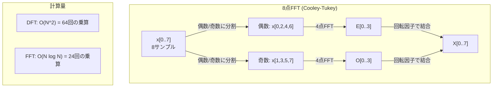
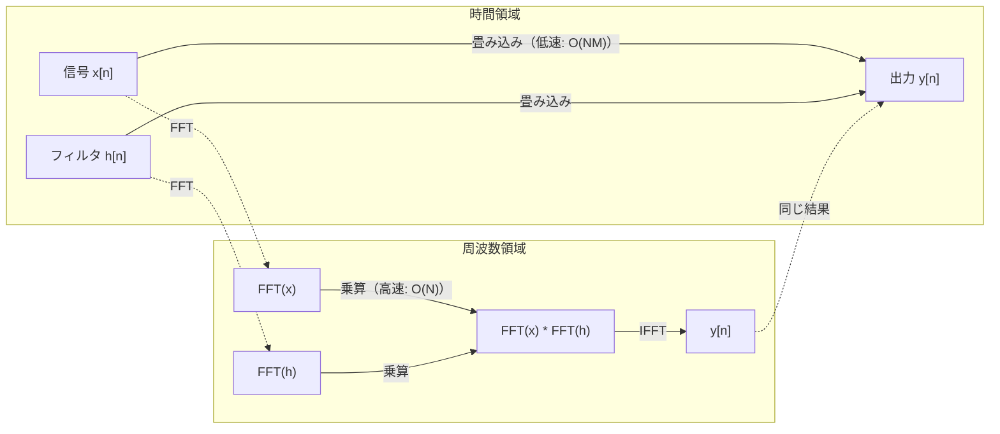

# フーリエ変換

> すべての信号は正弦波の和です。フーリエ変換はどの正弦波かを教えます。


## 学習目標

- DFTをゼロから実装し、O(N log N)のCooley-Tukey FFTと照合して検証する
- 周波数係数を解釈する：信号から振幅、位相、パワースペクトルを抽出する
- 畳み込み定理を適用してFFT乗算による畳み込みを行う
- フーリエ周波数分解をトランスフォーマーの位置エンコーディングとCNNの畳み込み層に結びつける

## 問題の背景

音声録音は時間にわたる気圧測定値の列です。株価は日数にわたる値の列です。画像は空間にわたるピクセル輝度のグリッドです。これらはすべて時間領域（または空間領域）のデータです。何らかのインデックスにわたって変化する値が見えます。

しかし多くのパターンは時間領域では見えません。この音声信号は純音か和音か？この株価には週次サイクルがあるか？この画像には繰り返しのテクスチャがあるか？これらは周波数内容についての質問であり、時間領域はそれを隠しています。

フーリエ変換はデータを時間領域から周波数領域に変換します。信号を取り、異なる周波数の正弦波に分解します。各正弦波には振幅（どれほど強いか）と位相（どこから始まるか）があります。フーリエ変換は両方を教えます。

これはMLに重要です。なぜなら周波数領域の思考はあらゆるところに現れるからです。畳み込みニューラルネットワークは畳み込みを行い、これは周波数領域での乗算です。トランスフォーマーの位置エンコーディングは位置を表現するために周波数分解を使います。音声モデル（音声認識、音楽生成）はスペクトログラム——音の周波数表現——で動作します。時系列モデルは周期的パターンを探します。フーリエ変換を理解することで、これらすべてを扱う語彙が得られます。

## 概念

### DFTの定義

N個のサンプルx[0], x[1], ..., x[N-1]が与えられたとき、離散フーリエ変換はN個の周波数係数X[0], X[1], ..., X[N-1]を生成します：

```
X[k] = sum_{n=0}^{N-1} x[n] * e^(-2*pi*i*k*n/N)

k = 0, 1, ..., N-1について
```

各X[k]は複素数です。その大きさ|X[k]|は周波数kの振幅を教えます。その偏角angle(X[k])はその周波数の位相オフセットを教えます。

重要な洞察：`e^(-2*pi*i*k*n/N)`は周波数kで回転するフェーザーです。DFTは信号とN個の等間隔な周波数のそれぞれとの相関を計算します。信号が周波数kにエネルギーを含む場合、相関は大きいです。そうでなければゼロに近いです。

### 各係数の意味

**X[0]：DC成分。** これはすべてのサンプルの和——平均に比例します。信号の定常（ゼロ周波数）オフセットを表します。

```
X[0] = sum_{n=0}^{N-1} x[n] * e^0 = すべてのサンプルの和
```

**1 <= k <= N/2のX[k]：正の周波数。** X[k]はNサンプルあたりのk周期の周波数を表します。kが大きいほど周波数が高いです（より速い振動）。

**X[N/2]：ナイキスト周波数。** Nサンプルで表現できる最高周波数。これを超えるとエイリアシングが起きます——高周波が低いものに偽装します。

**N/2 < k < NのX[k]：負の周波数。** 実数値信号では、X[N-k] = conj(X[k])。負の周波数は正の周波数の鏡像です。これが有用な情報が最初のN/2 + 1係数にある理由です。

### 逆DFT

逆DFTは周波数係数から元の信号を再構成します：

```
x[n] = (1/N) * sum_{k=0}^{N-1} X[k] * e^(2*pi*i*k*n/N)

n = 0, 1, ..., N-1について
```

順方向DFTとの唯一の違い：指数の符号が正（負でなく）で、1/Nの正規化係数があります。

逆DFTは完全な再構成です。情報は失われません。時間領域から周波数領域へ、そして戻る変換は誤差なしです。DFTは基底変換です——同じ情報を異なる座標系で再表現します。

### FFT：高速化

上で定義されたDFTはO(N^2)です：N個の出力係数のそれぞれに対してN個の入力サンプルを合計します。N = 100万の場合、それは10^12回の演算です。

高速フーリエ変換（FFT）は同じ結果をO(N log N)で計算します。N = 100万の場合、1兆ではなく約2000万回の演算です。これが周波数解析を実用的にします。

Cooley-Tukeyアルゴリズム（最も一般的なFFT）は分割統治で機能します：

1. 信号を偶数インデックスと奇数インデックスのサンプルに分割する。
2. 各半分のDFTを再帰的に計算する。
3. 「回転因子」e^(-2*pi*i*k/N)を使って2つの半分サイズのDFTを結合する。

```
X[k] = E[k] + e^(-2*pi*i*k/N) * O[k]          k = 0, ..., N/2 - 1について
X[k + N/2] = E[k] - e^(-2*pi*i*k/N) * O[k]    k = 0, ..., N/2 - 1について

ここでE = 偶数インデックスサンプルのDFT
      O = 奇数インデックスサンプルのDFT
```

対称性により各再帰レベルはO(N)の仕事をし、log2(N)レベルがあります。合計：O(N log N)。



FFTは信号長が2の冪乗であることを必要とします。実際には、信号は次の2の冪乗にゼロパディングされます。

### スペクトル解析

**パワースペクトル**は|X[k]|^2——各周波数係数の二乗の大きさです。各周波数にどれほどのエネルギーがあるかを示します。

**位相スペクトル**はangle(X[k])——各周波数の位相オフセットです。ほとんどの解析タスクではパワースペクトルを気にして位相は無視します。

```
周波数kのパワー：  P[k] = |X[k]|^2 = X[k].real^2 + X[k].imag^2
周波数kの位相：    phi[k] = atan2(X[k].imag, X[k].real)
```

### 周波数分解能

DFTの周波数分解能はサンプル数Nとサンプリングレートfsに依存します。

```
ビンkの周波数：      f_k = k * fs / N
周波数分解能：        delta_f = fs / N
最大周波数：          f_max = fs / 2  （ナイキスト）
```

互いに近い2つの周波数を分解するには、より多くのサンプルが必要です。高周波を捉えるには、より高いサンプリングレートが必要です。

### 畳み込み定理

これは信号処理で最も重要な結果の1つであり、CNNに直接関連します。

**時間領域での畳み込みは周波数領域での点ごとの乗算に等しい。**

```
x * h = IFFT(FFT(x) . FFT(h))

ここで * は畳み込み、. は要素ごとの乗算
```

これが重要な理由：

- 長さNとMの2つの信号の直接畳み込みはO(N*M)の演算がかかる。
- FFTベースの畳み込みはO(N log N)：両方を変換、乗算、逆変換。
- 大きなカーネルにはFFT畳み込みが劇的に速い。
- これは大きな受容野を持つ畳み込み層で起きることとまったく同じ。

注意：DFTは円形畳み込みを計算します（信号が折り返される）。線形畳み込み（折り返しなし）には、計算前に両方の信号をN + M - 1の長さにゼロパディングします。



### ウィンドウ処理

DFTは信号が周期的であると仮定します——N個のサンプルを無限に繰り返す信号の1周期として扱います。信号が同じ値で始まり終わらない場合、境界で不連続が生じ、スプリアスな高周波コンテンツとして現れます。これをスペクトルリーケージと呼びます。

ウィンドウ処理はDFTを計算する前に信号の両端をゼロに向けてテーパーすることでリーケージを低減します。

一般的なウィンドウ：

| ウィンドウ | 形状 | メインローブ幅 | サイドローブレベル | ユースケース |
|-----------|------|--------------|-----------------|------------|
| 矩形 | 平坦（ウィンドウなし） | 最狭 | 最高（-13 dB） | 信号がNサンプルで正確に周期的な場合 |
| Hann | 持ち上げたコサイン | 中程度 | 低（-31 dB） | 汎用スペクトル解析 |
| Hamming | 修正コサイン | 中程度 | より低（-42 dB） | 音声処理、音声分析 |
| Blackman | 三重コサイン | 広い | 非常に低（-58 dB） | サイドローブ抑制が重要な場合 |

```
Hannウィンドウ：    w[n] = 0.5 * (1 - cos(2*pi*n / (N-1)))
Hammingウィンドウ： w[n] = 0.54 - 0.46 * cos(2*pi*n / (N-1))
```

DFTの前に信号と要素ごとに乗算してウィンドウを適用します：`X = DFT(x * w)`。

### DFTの性質

| 性質 | 時間領域 | 周波数領域 |
|------|---------|----------|
| 線形性 | a*x + b*y | a*X + b*Y |
| 時間シフト | x[n - k] | X[f] * e^(-2*pi*i*f*k/N) |
| 周波数シフト | x[n] * e^(2*pi*i*f0*n/N) | X[f - f0] |
| 畳み込み | x * h | X * H（点ごと） |
| 乗算 | x * h（点ごと） | X * H（円形畳み込み、1/Nでスケーリング） |
| パーセバルの定理 | sum \|x[n]\|^2 | (1/N) * sum \|X[k]\|^2 |
| 共役対称性（実数入力） | x[n]が実数 | X[k] = conj(X[N-k]) |

パーセバルの定理は総エネルギーが両領域で同じであることを示します。エネルギーは変換を通じて保存されます。

### 位置エンコーディングへの接続

元のTransformerは正弦波位置エンコーディングを使います：

```
PE(pos, 2i)   = sin(pos / 10000^(2i/d_model))
PE(pos, 2i+1) = cos(pos / 10000^(2i/d_model))
```

各次元ペア（2i, 2i+1）は異なる周波数で振動します。周波数は高から低（最後の次元）まで幾何学的にスペーシングされています。これにより各位置はすべての周波数帯にわたるユニークなパターンを得ます——フーリエ係数が信号を一意に識別する方法と同様です。

これが提供する主要な性質：

- **一意性：** 2つの位置が同じエンコーディングを持たない。
- **有界値：** sinとcosは常に[-1, 1]内。
- **相対位置：** 位置p+kのエンコーディングは位置pのエンコーディングの線形関数として表現できる。モデルは相対位置にアテンションすることを学習できる。

### CNNへの接続

畳み込み層は学習されたフィルタ（カーネル）を信号や画像にスライドしながら適用します。数学的にはこれが畳み込み演算です。

畳み込み定理により、これは次に等価です：
1. 入力をFFT
2. カーネルをFFT
3. 周波数領域で乗算
4. 結果をIFFT

標準的なCNN実装は直接畳み込みを使います（小さな3×3カーネルには速い）。しかし大きなカーネルやグローバル畳み込みには、FFTベースのアプローチが大幅に速いです。一部のアーキテクチャ（FNetなど）はアテンションを完全にFFTで置き換え、O(N^2)の代わりにO(N log N)の複雑さで競合する精度を達成します。

### スペクトログラムと短時間フーリエ変換

単一のFFTは信号全体の周波数内容を与えますが、それらの周波数がいつ起きるかについては何も教えません。チャープ（時間とともに周波数が増加する信号）と和音（すべての周波数が同時に存在）は同じ大きさのスペクトルを持つことがあります。

短時間フーリエ変換（STFT）は信号の重複するウィンドウについてFFTを計算することでこれを解決します。結果はスペクトログラムです：一方の軸が時間、もう一方が周波数の2次元表現です。各点の強度はその時刻にその周波数のエネルギーを示します。

```
STFT手順：
1. ウィンドウサイズを選ぶ（例：1024サンプル）
2. ホップサイズを選ぶ（例：256サンプル——75%重複）
3. 各ウィンドウ位置について：
   a. ウィンドウされたセグメントを抽出
   b. Hann/Hammingウィンドウを適用
   c. FFTを計算
   d. 大きさのスペクトルをスペクトログラムの1列として保存
```

スペクトログラムは音声MLモデルの標準入力表現です。音声認識モデル（Whisper、DeepSpeech）はメルスペクトログラムで動作します——周波数が人間の音高知覚によりよく一致するメルスケールにマッピングされたスペクトログラムです。

### エイリアシング

信号がfs/2（ナイキスト周波数）を超える周波数を含む場合、レートfsでのサンプリングはエイリアスコピーを作成します。100 Hzでサンプリングされた90 Hz信号は10 Hz信号と同一に見えます。サンプルだけからそれらを区別する方法はありません。

```
例：
  真の信号：90 Hzの正弦波
  サンプリングレート：100 Hz
  見かけの周波数：100 - 90 = 10 Hz

  100 Hzサンプリングレートで90 Hz信号からのサンプルは
  10 Hz信号からのサンプルと同一です。
  どれだけ数学を使っても元の90 Hzを回復できません。
```

これがアナログ-デジタル変換器がサンプリング前にナイキスト以上の周波数を除去するアンチエイリアスフィルターを含む理由です。MLでは、適切なローパスフィルタリングなしに特徴マップをダウンサンプリングするとエイリアシングが現れます——一部のアーキテクチャはアンチエイリアスプーリング層でこれに対処します。

### ゼロパディングは分解能を上げない

よくある誤解：FFTの前に信号をゼロパディングすると周波数分解能が向上する。そうではありません。ゼロパディングは既存の周波数ビンの間を補間し、より滑らかに見えるスペクトルを与えます。しかし元のサンプルに存在しなかった周波数の詳細を明らかにすることはできません。

真の周波数分解能は観測時間T = N / fsだけに依存します。delta_fだけ離れた2つの周波数を分解するには、少なくともT = 1 / delta_f秒のデータが必要です。どれだけゼロパディングしてもこの基本的な限界は変わりません。

## 実装

### ステップ1：DFTをゼロから

O(N^2)のDFTは定義から直接導出されます。

```python
import math

class Complex:
    ...

def dft(x):
    N = len(x)
    result = []
    for k in range(N):
        total = Complex(0, 0)
        for n in range(N):
            angle = -2 * math.pi * k * n / N
            w = Complex(math.cos(angle), math.sin(angle))
            xn = x[n] if isinstance(x[n], Complex) else Complex(x[n])
            total = total + xn * w
        result.append(total)
    return result
```

### ステップ2：逆DFT

同じ構造、正の指数、Nで割ります。

```python
def idft(X):
    N = len(X)
    result = []
    for n in range(N):
        total = Complex(0, 0)
        for k in range(N):
            angle = 2 * math.pi * k * n / N
            w = Complex(math.cos(angle), math.sin(angle))
            total = total + X[k] * w
        result.append(Complex(total.real / N, total.imag / N))
    return result
```

### ステップ3：FFT（Cooley-Tukey）

再帰的FFTは2の冪乗長を必要とします。偶数と奇数に分割、再帰、回転因子で結合します。

```python
def fft(x):
    N = len(x)
    if N <= 1:
        return [x[0] if isinstance(x[0], Complex) else Complex(x[0])]
    if N % 2 != 0:
        return dft(x)

    even = fft([x[i] for i in range(0, N, 2)])
    odd = fft([x[i] for i in range(1, N, 2)])

    result = [Complex(0)] * N
    for k in range(N // 2):
        angle = -2 * math.pi * k / N
        twiddle = Complex(math.cos(angle), math.sin(angle))
        t = twiddle * odd[k]
        result[k] = even[k] + t
        result[k + N // 2] = even[k] - t
    return result
```

### ステップ4：スペクトル解析ヘルパー

```python
def power_spectrum(X):
    return [xk.real ** 2 + xk.imag ** 2 for xk in X]

def convolve_fft(x, h):
    N = len(x) + len(h) - 1
    padded_N = 1
    while padded_N < N:
        padded_N *= 2

    x_padded = x + [0.0] * (padded_N - len(x))
    h_padded = h + [0.0] * (padded_N - len(h))

    X = fft(x_padded)
    H = fft(h_padded)

    Y = [xk * hk for xk, hk in zip(X, H)]

    y = idft(Y)
    return [y[n].real for n in range(N)]
```

## 活用

実際の作業ではnumpyのFFTを使います。高度に最適化されたCライブラリが裏で動いています。

```python
import numpy as np

signal = np.sin(2 * np.pi * 5 * np.arange(256) / 256)
spectrum = np.fft.fft(signal)
freqs = np.fft.fftfreq(256, d=1/256)

power = np.abs(spectrum) ** 2

positive_freqs = freqs[:len(freqs)//2]
positive_power = power[:len(power)//2]
```

ウィンドウ処理とより高度なスペクトル解析のために：

```python
from scipy.signal import windows, stft

window = windows.hann(256)
windowed = signal * window
spectrum = np.fft.fft(windowed)
```

畳み込みのために：

```python
from scipy.signal import fftconvolve

result = fftconvolve(signal, kernel, mode='full')
```

スペクトログラムのために：

```python
from scipy.signal import stft

frequencies, times, Zxx = stft(signal, fs=sample_rate, nperseg=256)
spectrogram = np.abs(Zxx) ** 2
```

スペクトログラム行列は形状（n_frequencies, n_time_frames）です。各列は1つの時間ウィンドウでのパワースペクトルです。これが音声MLモデルの入力として消費されるものです。

## 成果物

`code/fourier.py`を実行して`outputs/prompt-spectral-analyzer.md`を生成します。

## 演習

1. **純音の識別。** 未知の周波数（1〜50 Hzの間）の単一正弦波を持つ信号を128 Hzで1秒間サンプリングして作成します。DFTを使って周波数を識別します。答えが一致することを検証します。次に標準偏差0.5のガウスノイズを加えて繰り返します。ノイズはスペクトルにどう影響しますか？

2. **FFT vs DFT検証。** 長さ64のランダム信号を生成します。DFT（O(N^2)）とFFTの両方を計算します。すべての係数が1e-10以内で一致することを検証します。長さ256、512、1024、2048の信号で両方の関数の時間を測定します。DFT時間とFFT時間の比をプロットします。

3. **畳み込み定理の実例証明。** 信号x = [1, 2, 3, 4, 0, 0, 0, 0]とフィルタh = [1, 1, 1, 0, 0, 0, 0, 0]を作成します。直接（ネストループ）で円形畳み込みを計算します。次にFFT（変換、乗算、逆変換）で計算します。結果が一致することを検証します。次に適切にゼロパディングして線形畳み込みを行います。

4. **ウィンドウ処理の効果。** 10 Hzと12 Hz（非常に近い）の2つの正弦波の和である信号を作成します。128 Hzで1秒間サンプリングします。ウィンドウなし、Hannウィンドウ、Hammingウィンドウでパワースペクトルを計算します。どのウィンドウが2つのピークを最も見分けやすくしますか？なぜですか？

5. **位置エンコーディング解析。** d_model = 128、max_pos = 512の正弦波位置エンコーディングを生成します。各位置のペア（p1, p2）について、エンコーディングのドット積を計算します。ドット積が絶対位置ではなく|p1 - p2|だけに依存することを示します。距離が増加するにつれてドット積はどうなりますか？

## キー用語

| 用語 | 意味 |
|------|------|
| DFT（離散フーリエ変換） | N個の時間領域サンプルをN個の周波数領域係数に変換する。各係数はその周波数での複素正弦波との相関 |
| FFT（高速フーリエ変換） | DFTを計算するO(N log N)アルゴリズム。Cooley-Tukeyアルゴリズムは偶数/奇数インデックスを再帰的に分割 |
| 逆DFT | 周波数係数から時間領域信号を再構成する。指数の符号を反転して1/Nスケーリングしたのと同じ公式 |
| 周波数ビン | DFT出力の各インデックスkは周波数k*fs/N Hzを表す。「ビン」は離散的な周波数スロット |
| DC成分 | X[0]、ゼロ周波数係数。信号の平均に比例 |
| ナイキスト周波数 | サンプリングレートfsで表現できる最大周波数fs/2。これを超えると周波数がエイリアスする |
| パワースペクトル | \|X[k]\|^2、各周波数係数の二乗の大きさ。周波数にわたるエネルギー分布を示す |
| 位相スペクトル | angle(X[k])、各周波数成分の位相オフセット。解析では無視されることが多い |
| スペクトルリーケージ | 非周期信号を周期的として扱うことで生じるスプリアスな周波数コンテンツ。ウィンドウ処理で低減 |
| ウィンドウ関数 | スペクトルリーケージを低減するためDFTの前に適用するテーパリング関数（Hann、Hamming、Blackman） |
| 回転因子 | FFTのバタフライ計算でサブDFTを結合するために使われる複素指数e^(-2*pi*i*k/N) |
| 畳み込み定理 | 時間領域での畳み込みは周波数領域での点ごとの乗算に等しい。信号処理とCNNの基礎 |
| 円形畳み込み | 信号が折り返す畳み込み。DFTが自然に計算するもの |
| 線形畳み込み | 折り返しのない標準的な畳み込み。DFT前にゼロパディングで実現 |
| パーセバルの定理 | 総エネルギーはフーリエ変換を通じて保存される。sum \|x[n]\|^2 = (1/N) sum \|X[k]\|^2 |
| エイリアシング | ナイキスト以上の周波数がサンプリングレート不足で低周波として現れる現象 |

## 参考資料

- [Cooley & Tukey: An Algorithm for the Machine Calculation of Complex Fourier Series (1965)](https://www.ams.org/journals/mcom/1965-19-090/S0025-5718-1965-0178586-1/) — コンピューティングを変えた元のFFT論文
- [3Blue1Brown: But what is the Fourier Transform?](https://www.youtube.com/watch?v=spUNpyF58BY) — フーリエ変換への最良の視覚的入門
- [Lee-Thorp et al.: FNet: Mixing Tokens with Fourier Transforms (2021)](https://arxiv.org/abs/2105.03824) — トランスフォーマーでself-attentionをFFTで置き換える
- [Smith: The Scientist and Engineer's Guide to Digital Signal Processing](http://www.dspguide.com/) — FFT、ウィンドウ処理、スペクトル解析を詳しく扱う無料オンライン教科書
- [Vaswani et al.: Attention Is All You Need (2017)](https://arxiv.org/abs/1706.03762) — フーリエ周波数分解から導出された正弦波位置エンコーディング
- [Radford et al.: Whisper (2022)](https://arxiv.org/abs/2212.04356) — 入力表現としてメルスペクトログラムを使う音声認識
