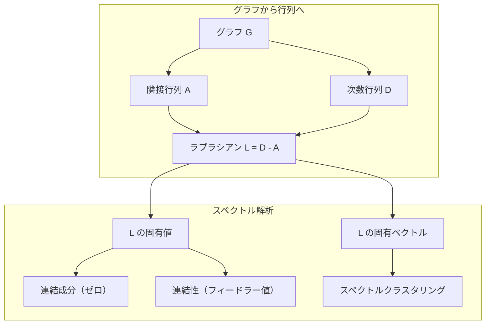

# 機械学習のためのグラフ理論

> グラフは関係のデータ構造です。データに接続がある場合、グラフ理論が必要です。


## 学習目標

- 隣接行列/隣接リスト表現を持つグラフクラスを構築し、BFSとDFSのトラバーサルを実装する
- グラフラプラシアンを計算し、その固有値を使って連結成分を検出してノードをクラスタリングする
- 正規化された隣接行列の乗算としてGNNスタイルのメッセージパッシングの1ラウンドを実装する
- フィードラーベクトルを使ってグラフを分割するためにスペクトルクラスタリングを適用する

## 問題の背景

ソーシャルネットワーク、分子、知識ベース、引用ネットワーク、道路地図——これらはすべてグラフです。従来のMLはデータをフラットなテーブルとして扱います。各行は独立しています。各特徴は列です。しかし接続の構造が重要な場合、テーブルは失敗します。

ソーシャルネットワークを考えてみましょう。ユーザーが購入する商品を予測したいとします。購入履歴は重要です。しかし友人の購入履歴はさらに重要です。接続にシグナルがあります。

あるいは分子を考えましょう。タンパク質に結合するかどうかを予測したいとします。原子は重要ですが、本当に重要なのは原子がどのように結合しているかです。構造がデータです。

グラフニューラルネットワーク（GNN）は深層学習で最も急成長している分野です。創薬、ソーシャルレコメンデーション、不正検知、知識グラフ推論を支えています。すべてのGNNは同じ基礎の上に構築されています：基本的なグラフ理論です。

4つのことが必要です：
1. グラフを行列として表現する方法（乗算できるように）
2. グラフ構造を探索するトラバーサルアルゴリズム
3. ラプラシアン——スペクトルグラフ理論で最も重要な単一の行列
4. メッセージパッシング——GNNを機能させる演算

## 概念

### グラフ：ノードとエッジ

グラフG = (V, E)は頂点（ノード）Vとエッジ（辺）Eから成ります。各エッジは2つのノードを接続します。

**有向グラフ vs 無向グラフ。** 無向グラフでは、エッジ(u, v)はuがvに接続され、かつvがuに接続されることを意味します。有向グラフ（有向グラフ）では、エッジ(u, v)はuがvを指すことを意味しますが、逆方向は必ずしもそうではありません。

**重み付きグラフ vs 重みなしグラフ。** 重みなしグラフでは、エッジが存在するかしないかです。重み付きグラフでは、各エッジに数値の重みがあります——距離、コスト、強度。

| グラフの種類 | 例 |
|-----------|---|
| 無向、重みなし | Facebookの友人ネットワーク |
| 有向、重みなし | Twitterのフォローネットワーク |
| 無向、重み付き | 道路地図（距離） |
| 有向、重み付き | Webページのリンク（PageRankスコア） |

### 隣接行列

隣接行列Aはコア表現です。nノードのグラフについて：

```
A[i][j] = 1    ノードiからノードjへのエッジがある場合
A[i][j] = 0    そうでない場合
```

無向グラフでは、Aは対称です：A[i][j] = A[j][i]。重み付きグラフでは、A[i][j] = エッジ(i, j)の重み。

**例——三角形：**

```
ノード：0、1、2
エッジ：(0,1)、(1,2)、(0,2)

A = [[0, 1, 1],
     [1, 0, 1],
     [1, 1, 0]]
```

隣接行列はすべてのGNNへの入力です。Aに対する行列演算はグラフに対する演算に対応します。

### 次数

ノードの次数は接続されているエッジの数です。有向グラフでは、入次数（入ってくるエッジ）と出次数（出ていくエッジ）があります。

次数行列Dは対角行列です：

```
D[i][i] = ノードiの次数
D[i][j] = 0    i != jについて
```

三角形の例では：D = diag(2, 2, 2)。なぜなら各ノードが他の2つに接続されているため。

次数はノードの重要性を教えます。高次数 = ハブノード。ネットワークの次数分布はその構造を明らかにします。ソーシャルネットワークはべき乗則に従います（少数のハブ、多くのリーフノード）。ランダムグラフはポアソン分布の次数を持ちます。

### BFSとDFS

2つの基本的なグラフトラバーサルアルゴリズムです。両方が必要です。

**幅優先探索（BFS）：** 最初にすべての近隣を探索し、次に近隣の近隣を探索します。キュー（FIFO）を使います。

```
ノード0からのBFS：
  0を訪問
  キュー：[1, 2]        （0の近隣）
  1を訪問
  キュー：[2, 3]        （1の近隣を追加）
  2を訪問
  キュー：[3]           （2の近隣はすでに訪問済み）
  3を訪問
  キュー：[]            （完了）
```

BFSは重みなしグラフで最短経路を見つけます。開始からどのノードへの距離も、そのノードが最初に発見されたBFSレベルに等しいです。これがBFSがソーシャルネットワークのホップ数距離に使われる理由です。

**深さ優先探索（DFS）：** バックトラックする前にできるだけ深く進みます。スタック（LIFO）または再帰を使います。

```
ノード0からのDFS：
  0を訪問
  スタック：[1, 2]      （0の近隣）
  2を訪問               （スタックからポップ）
  スタック：[1, 3]       （2の近隣を追加）
  3を訪問               （スタックからポップ）
  スタック：[1]
  1を訪問               （スタックからポップ）
  スタック：[]           （完了）
```

DFSは以下に役立ちます：
- 連結成分の検出（未訪問ノードからDFSを実行）
- サイクル検出（DFSツリーのバックエッジ）
- 位相ソート（DFS終了順の逆順）

| アルゴリズム | データ構造 | 見つけるもの | ユースケース |
|-----------|----------|-----------|-----------|
| BFS | キュー | 最短経路 | ソーシャルネットワーク距離、知識グラフトラバーサル |
| DFS | スタック | 成分、サイクル | 連結性、位相ソート |

### グラフラプラシアン

L = D - A。スペクトルグラフ理論で最も重要な行列。

三角形の場合：

```
D = [[2, 0, 0],    A = [[0, 1, 1],    L = [[2, -1, -1],
     [0, 2, 0],         [1, 0, 1],         [-1, 2, -1],
     [0, 0, 2]]         [1, 1, 0]]         [-1, -1,  2]]
```

ラプラシアンには注目すべき性質があります：

1. **Lは半正定値。** すべての固有値が >= 0。

2. **ゼロ固有値の数は連結成分の数に等しい。** 連結グラフは正確に1つのゼロ固有値を持ちます。3つの非連結成分を持つグラフは3つのゼロ固有値を持ちます。

3. **最小の非ゼロ固有値（フィードラー値）は連結性を測定する。** 大きなフィードラー値はグラフがよく連結されていることを意味します。小さなフィードラー値はグラフに弱点——ボトルネックがあることを意味します。

4. **フィードラー値の固有ベクトル（フィードラーベクトル）は最良の分割を明らかにする。** 正の値を持つノードは一方のグループへ、負の値を持つノードはもう一方へ。これがスペクトルクラスタリングです。



### スペクトル特性

隣接行列とラプラシアンの固有値は、トラバーサルなしで構造的性質を明らかにします。

**スペクトルクラスタリング**は次のように機能します：
1. ラプラシアンLを計算する
2. Lのk個の最小固有ベクトルを見つける（連結グラフでは全て1の最初のものはスキップ）
3. それらの固有ベクトルを各ノードの新しい座標として使う
4. それらの座標でk-meansを実行する

なぜこれが機能するか？Lの固有ベクトルはグラフ上の「最も滑らかな」関数をエンコードします。よく連結されているノードは類似した固有ベクトルの値を得ます。ボトルネックで分離されたノードは異なる値を得ます。固有ベクトルはクラスターを自然に分離します。

**ランダムウォーク接続。** 正規化ラプラシアンはグラフ上のランダムウォークに関連します。ランダムウォークの定常分布はノードの次数に比例します。混合時間（ウォークが収束する速さ）はスペクトルギャップに依存します。

### メッセージパッシング

グラフニューラルネットワークのコア演算。各ノードは近隣からメッセージを収集し、集約して自身の状態を更新します。

```
h_v^(k+1) = UPDATE(h_v^(k), AGGREGATE({h_u^(k) : u in neighbors(v)}))
```

最も単純な形式では、AGGREGATE = 平均、UPDATE = 線形変換 + 活性化：

```
h_v^(k+1) = sigma(W * mean({h_u^(k) : u in neighbors(v)}))
```

これは変装した行列乗算です。HがすべてのノードFeatureの行列でAが隣接行列の場合：

```
H^(k+1) = sigma(A_norm * H^(k) * W)
```

ここでA_normは正規化された隣接行列（各行の和が1）。

メッセージパッシングの1ラウンドは各ノードが直接の近隣を「見る」ことができます。2ラウンドで近隣の近隣を見ることができます。Kラウンドで各ノードはそのKホップ近傍の情報を得ます。

```mermaid
graph LR
    subgraph "ラウンド 0"
        A0["ノード A: [1,0]"]
        B0["ノード B: [0,1]"]
        C0["ノード C: [1,1]"]
    end
    subgraph "ラウンド 1 (近隣を集約)"]
        A1["ノード A: avg(B,C) = [0.5, 1.0]"]
        B1["ノード B: avg(A,C) = [1.0, 0.5]"]
        C1["ノード C: avg(A,B) = [0.5, 0.5]"]
    end
    A0 --> A1
    B0 --> A1
    C0 --> A1
    A0 --> B1
    C0 --> B1
    A0 --> C1
    B0 --> C1
```

### 概念とMLの応用

| 概念 | MLの応用 |
|------|---------|
| 隣接行列 | GNNの入力表現 |
| グラフラプラシアン | スペクトルクラスタリング、コミュニティ検出 |
| BFS/DFS | 知識グラフトラバーサル、経路探索 |
| 次数分布 | ノードの重要性、特徴エンジニアリング |
| メッセージパッシング | GNN層（GCN、GAT、GraphSAGE） |
| Lの固有値 | コミュニティ検出、グラフ分割 |
| スペクトルクラスタリング | 教師なしノードグループ化 |
| PageRank | ノードの重要性、Webサーチ |

## 実装

### ステップ1：グラフクラスをゼロから

```python
class Graph:
    def __init__(self, n_nodes, directed=False):
        self.n = n_nodes
        self.directed = directed
        self.adj = {i: {} for i in range(n_nodes)}

    def add_edge(self, u, v, weight=1.0):
        self.adj[u][v] = weight
        if not self.directed:
            self.adj[v][u] = weight

    def neighbors(self, node):
        return list(self.adj[node].keys())

    def degree(self, node):
        return len(self.adj[node])

    def adjacency_matrix(self):
        import numpy as np
        A = np.zeros((self.n, self.n))
        for u in range(self.n):
            for v, w in self.adj[u].items():
                A[u][v] = w
        return A

    def degree_matrix(self):
        import numpy as np
        D = np.zeros((self.n, self.n))
        for i in range(self.n):
            D[i][i] = self.degree(i)
        return D

    def laplacian(self):
        return self.degree_matrix() - self.adjacency_matrix()
```

隣接リスト（`self.adj`）は近隣を効率的に格納します。隣接行列変換はnumpyを使います。なぜならすべてのスペクトル演算でそれが必要だからです。

### ステップ2：BFSとDFS

```python
from collections import deque

def bfs(graph, start):
    visited = set()
    order = []
    distances = {}
    queue = deque([(start, 0)])
    visited.add(start)
    while queue:
        node, dist = queue.popleft()
        order.append(node)
        distances[node] = dist
        for neighbor in graph.neighbors(node):
            if neighbor not in visited:
                visited.add(neighbor)
                queue.append((neighbor, dist + 1))
    return order, distances


def dfs(graph, start):
    visited = set()
    order = []
    stack = [start]
    while stack:
        node = stack.pop()
        if node in visited:
            continue
        visited.add(node)
        order.append(node)
        for neighbor in reversed(graph.neighbors(node)):
            if neighbor not in visited:
                stack.append(neighbor)
    return order
```

BFSはO(1)のpopleftのためにdeque（両端キュー）を使います。DFSはリストをスタックとして使います。両方とも各ノードを正確に1回訪問します——O(V + E)時間。

### ステップ3：連結成分とラプラシアン固有値

```python
def connected_components(graph):
    visited = set()
    components = []
    for node in range(graph.n):
        if node not in visited:
            order, _ = bfs(graph, node)
            visited.update(order)
            components.append(order)
    return components


def laplacian_eigenvalues(graph):
    import numpy as np
    L = graph.laplacian()
    eigenvalues = np.linalg.eigvalsh(L)
    return eigenvalues
```

`eigvalsh`は対称行列用です——ラプラシアンは無向グラフでは常に対称です。固有値を昇順で返します。ゼロを数えて連結成分の数を見つけます。

### ステップ4：スペクトルクラスタリング

```python
def spectral_clustering(graph, k=2):
    import numpy as np
    L = graph.laplacian()
    eigenvalues, eigenvectors = np.linalg.eigh(L)
    features = eigenvectors[:, 1:k+1]

    labels = np.zeros(graph.n, dtype=int)
    for i in range(graph.n):
        if features[i, 0] >= 0:
            labels[i] = 0
        else:
            labels[i] = 1
    return labels
```

k=2の場合、フィードラーベクトルの符号がグラフを2つのクラスターに分割します。k>2の場合、最初のk個の固有ベクトル（自明な全て1の固有ベクトルを除く）でk-meansを実行します。

### ステップ5：メッセージパッシング

```python
def message_passing(graph, features, weight_matrix):
    import numpy as np
    A = graph.adjacency_matrix()
    row_sums = A.sum(axis=1, keepdims=True)
    row_sums[row_sums == 0] = 1
    A_norm = A / row_sums
    aggregated = A_norm @ features
    output = aggregated @ weight_matrix
    return output
```

これはGNNメッセージパッシングの1ラウンドです。各ノードの新しい特徴は近隣の特徴の重み付き平均であり、重み行列で変換されます。情報をさらに遠くに伝播させるために複数ラウンドを積み重ねます。

## 活用

networkxとnumpyを使うと、同じ演算が1行になります：

```python
import networkx as nx
import numpy as np

G = nx.karate_club_graph()

A = nx.adjacency_matrix(G).toarray()
L = nx.laplacian_matrix(G).toarray()

eigenvalues = np.linalg.eigvalsh(L.astype(float))
print(f"最小固有値: {eigenvalues[:5]}")
print(f"連結成分: {nx.number_connected_components(G)}")

communities = nx.community.greedy_modularity_communities(G)
print(f"発見されたコミュニティ: {len(communities)}")

pr = nx.pagerank(G)
top_nodes = sorted(pr.items(), key=lambda x: x[1], reverse=True)[:5]
print(f"上位5 PageRankノード: {top_nodes}")
```

networkxは最適化されたCバックエンドで任意のサイズのグラフを処理します。本番環境ではこれを使います。ゼロからの実装は何をするかを理解するために使います。

### numpyによるスペクトル解析

```python
import numpy as np

A = np.array([
    [0, 1, 1, 0, 0],
    [1, 0, 1, 0, 0],
    [1, 1, 0, 1, 0],
    [0, 0, 1, 0, 1],
    [0, 0, 0, 1, 0]
])

D = np.diag(A.sum(axis=1))
L = D - A

eigenvalues, eigenvectors = np.linalg.eigh(L)
print(f"固有値: {np.round(eigenvalues, 4)}")
print(f"フィードラー値: {eigenvalues[1]:.4f}")
print(f"フィードラーベクトル: {np.round(eigenvectors[:, 1], 4)}")

fiedler = eigenvectors[:, 1]
group_a = np.where(fiedler >= 0)[0]
group_b = np.where(fiedler < 0)[0]
print(f"クラスターA: {group_a}")
print(f"クラスターB: {group_b}")
```

フィードラーベクトルが重要な仕事をします。一方のクラスターに正のエントリ、もう一方に負のエントリ。反復最適化は不要——固有値分解1回だけです。

## 成果物

このレッスンは生成します：
- `outputs/skill-graph-analysis.md` — グラフ構造データ解析のためのスキルリファレンス

## つながり

| 概念 | 現れる場所 |
|------|----------|
| 隣接行列 | GCN、GAT、GraphSAGEの入力 |
| ラプラシアン | スペクトルクラスタリング、ChebNetフィルタ |
| BFS | 知識グラフトラバーサル、最短経路クエリ |
| メッセージパッシング | すべてのGNN層、ニューラルメッセージパッシング |
| スペクトルギャップ | グラフの連結性、ランダムウォークの混合時間 |
| 次数分布 | べき乗則ネットワーク、ノード特徴エンジニアリング |
| 連結成分 | 前処理、非連結グラフの処理 |
| PageRank | ノード重要性ランキング、アテンション初期化 |

GNNについて特筆すべきです。GCN（Kipf & Welling, 2017）のグラフ畳み込み演算は自己ループが追加された隣接行列を使います、A_hat = A + I：

```text
H^(l+1) = sigma(D_hat^(-1/2) * A_hat * D_hat^(-1/2) * H^(l) * W^(l))
```

ここでA_hat = A + I（隣接行列プラス自己ループ）、D_hatはA_hatの次数行列です。自己ループは集約中に各ノードが自身の特徴を含めることを保証します。これはまさに対称正規化によるメッセージパッシングです。D_hat^(-1/2) * A_hat * D_hat^(-1/2)は正規化された隣接行列です。この正規化はL_sym = I - D^(-1/2) * A * D^(-1/2)に関連しているためラプラシアンが現れます。ラプラシアンを理解することはGCNが機能する理由を理解することを意味します。

## 演習

1. **ゼロからPageRankを実装する。** 均一スコアから始めます。各ステップで：score(v) = (1-d)/n + d * sum(score(u)/out_degree(u)) vを指すすべてのuについて。d=0.85を使います。収束（変化 < 1e-6）するまで実行します。小さなWebグラフでテストします。

2. **スペクトルクラスタリングでコミュニティを見つける。** 明確に分離された2つのクラスターを持つグラフを作成します（例：単一のエッジで接続された2つのクリーク）。スペクトルクラスタリングを実行し、正しい分割が見つかることを確認します。クラスター間のエッジを追加するにつれて何が起きますか？

3. **ダイクストラのアルゴリズムを実装する。** 重み付きグラフの最短経路のため。均一な重みで同じグラフのBFSと結果を比較します。

4. **2層メッセージパッシングネットワークを構築する。** 異なる重み行列でメッセージパッシングを2回適用します。2ラウンド後、各ノードが2ホップ近傍の情報を持つことを示します。

5. **実世界のグラフを解析する。** 空手クラブグラフを使います（34ノード、78エッジ）。次数分布、ラプラシアン固有値、スペクトルクラスタリングを計算します。スペクトルクラスタリングの結果を既知のグラウンドトゥルース分割と比較します。

## キー用語

| 用語 | 人々が言うこと | 実際に意味すること |
|------|------------|-----------------|
| グラフ | 「ノードとエッジ」 | ペアの関係をエンコードする数学的構造G=(V,E) |
| 隣接行列 | 「接続テーブル」 | ノードiとjが接続されている場合A[i][j] = 1のn x n行列 |
| 次数 | 「ノードがどれほど接続されているか」 | ノードに接触するエッジの数 |
| ラプラシアン | 「DマイナスA」 | L = D - A、固有値がグラフ構造を明らかにする行列 |
| フィードラー値 | 「代数的連結度」 | Lの最小非ゼロ固有値、グラフがどれほどよく連結されているかを測定 |
| BFS | 「レベルごとの探索」 | 深くなる前にすべての近隣を訪問するトラバーサル、最短経路を見つける |
| DFS | 「まず深く進む」 | バックトラックする前に一本の道をその終点まで進むトラバーサル |
| メッセージパッシング | 「ノードが近隣と話す」 | 各ノードが近隣から情報を集約、GNNのコア |
| スペクトルクラスタリング | 「固有ベクトルでクラスタリング」 | ラプラシアンの固有ベクトルを使ってグラフを分割 |
| 連結成分 | 「別々の部分」 | すべてのノードが他のすべてのノードに到達できる最大のサブグラフ |

## 参考資料

- **Kipf & Welling (2017)** — "Semi-Supervised Classification with Graph Convolutional Networks." 現代のGNNを立ち上げた論文。スペクトルグラフ畳み込みがメッセージパッシングに単純化されることを示す。
- **Spielman (2012)** — "Spectral Graph Theory" 講義ノート。ラプラシアン、スペクトルギャップ、グラフ分割の決定的な入門。
- **Hamilton (2020)** — "Graph Representation Learning." 基礎から応用までGNNをカバーする書籍。
- **Bronstein et al. (2021)** — "Geometric Deep Learning: Grids, Groups, Graphs, Geodesics, and Gauges." 統一フレームワークの論文。
- **Veličković et al. (2018)** — "Graph Attention Networks." アテンション機構でメッセージパッシングを拡張。
