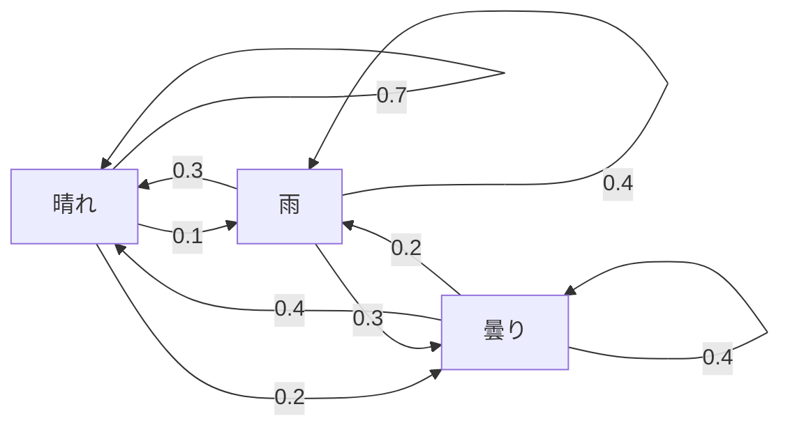
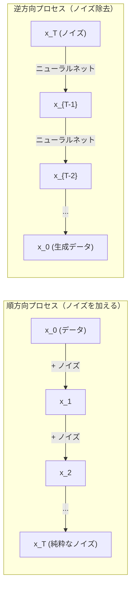

# 確率過程

> 構造を持つランダム性。ランダムウォーク、マルコフ連鎖、拡散モデルの背後にある数学。


## 学習目標

- 1次元と2次元のランダムウォークをシミュレートし、変位のsqrt(n)スケーリングを検証する
- マルコフ連鎖シミュレータを構築し、固有値分解によって定常分布を計算する
- メトロポリス・ヘイスティングスMCMCとランジュバンダイナミクスを実装してターゲット分布からのサンプリングを行う
- 順方向拡散プロセスをブラウン運動に結びつけ、逆方向プロセスがどのようにデータを生成するかを説明する

## 問題の背景

多くのAIシステムは時間とともに進化するランダム性を含みます。静的なランダム性ではありません——各ステップが前のものに依存する構造的で逐次的なランダム性です。

言語モデルはトークンを1つずつ生成します。各トークンは前のコンテキストに依存します。モデルは次のトークンの確率分布を出力し、それからサンプリングして進みます。これが確率過程です。

拡散モデルは画像に純粋なノイズになるまで段階的にノイズを加えます。次にプロセスを逆転させ、新しい画像が現れるまで段階的にデノイズします。順方向プロセスはマルコフ連鎖です。逆方向プロセスはニューラルネットワークで学習された逆方向に走るマルコフ連鎖です。

強化学習エージェントは環境でアクションを取ります。各アクションはある確率で新しい状態につながります。エージェントはランダムな世界でランダムなポリシーに従います。全体がマルコフ決定過程です。

MCMCサンプリング——ベイズ推論のバックボーン——は定常分布がサンプリングしたい事後分布であるマルコフ連鎖を構築します。

これらはすべて4つの基礎的なアイデアに基づいています：
1. ランダムウォーク——最も単純な確率過程
2. マルコフ連鎖——遷移行列を持つ構造的ランダム性
3. ランジュバンダイナミクス——ノイズ付き勾配降下法
4. メトロポリス・ヘイスティングス——任意の分布からのサンプリング

## 概念

### ランダムウォーク

位置0から始めます。各ステップで公平なコインを投げます。表：右へ移動（+1）。裏：左へ移動（-1）。

n歩後、位置はnランダムな+/-1の値の和です。期待位置は0（ウォークは偏りなし）。しかし原点からの期待距離はsqrt(n)として成長します。

これは直感に反します。ウォークは公平です——どちらの方向にも偏りがありません。しかし時間とともに、始まったところからどんどん遠ざかります。n歩後の標準偏差はsqrt(n)です。

```
ステップ0：   位置 = 0
ステップ1：   位置 = +1または-1
ステップ2：   位置 = +2、0、または-2
...
ステップ100： 原点からの期待距離 ~ 10（sqrt(100)）
ステップ10000：原点からの期待距離 ~ 100（sqrt(10000)）
```

**2次元では**、ウォークは等確率で上下左右に移動します。原点からの距離には同じsqrt(n)スケーリングが適用されます。経路はフラクタルのようなパターンを描きます。

**なぜsqrt(n)か？** 各ステップは等確率で+1または-1です。n歩後の位置S_n = X_1 + X_2 + ... + X_nで各X_iは+/-1。各ステップの分散は1で、ステップは独立しているので、Var(S_n) = n。標準偏差 = sqrt(n)。中心極限定理により、S_n / sqrt(n)は標準正規分布に収束します。

このsqrt(n)スケーリングはMLのあらゆるところに現れます。SGDノイズは1/sqrt(batch_size)でスケールします。埋め込み次元はsqrt(d)でスケールします。平方根は独立したランダムな加算のシグネチャです。

**ブラウン運動への接続。** ステップサイズ1/sqrt(n)で単位時間あたりnステップのランダムウォークを取ります。nが無限大に近づくにつれて、ウォークはブラウン運動B(t)——B(t)が平均0、分散tの正規分布に従う連続時間過程——に収束します。

ブラウン運動は拡散の数学的基礎です。流体中の粒子のランダムなゆらぎ、株価の変動、そして——重要なことに——拡散モデルのノイズプロセスをモデル化します。

**ギャンブラーの破滅。** 位置kから始まり、0とNに吸収障壁を持つランダムウォーカー。0より先にNに到達する確率は？公平なウォークでは：P(Nに到達) = k/N。これは驚くほど単純で優雅です。マルチンゲールの理論に接続します——公平なランダムウォークはマルチンゲールです（期待される将来の値 = 現在の値）。

### マルコフ連鎖

マルコフ連鎖は固定確率に従って状態間を遷移するシステムです。重要な性質：次の状態は現在の状態にのみ依存し、履歴には依存しません。

```
P(X_{t+1} = j | X_t = i, X_{t-1} = ...) = P(X_{t+1} = j | X_t = i)
```

これがマルコフ性質です。遷移行列Pで全動態を記述できることを意味します：

```
P[i][j] = 状態iから状態jに移る確率
```

Pの各行の和は1（どこかに行かなければならない）。

**例——天気：**

```
状態：晴れ（0）、雨（1）、曇り（2）

P = [[0.7, 0.1, 0.2],    （晴れなら：70%晴れ、10%雨、20%曇り）
     [0.3, 0.4, 0.3],    （雨なら：30%晴れ、40%雨、30%曇り）
     [0.4, 0.2, 0.4]]    （曇りなら：40%晴れ、20%雨、40%曇り）
```

任意の状態から始めます。多くの遷移後、状態の分布はpi * P = piとなる定常分布piに収束します。これは固有値1を持つPの左固有ベクトルです。

天気の連鎖の場合、定常分布は[0.53, 0.18, 0.29]かもしれません——長期的には、開始状態に関係なく53%の時間が晴れです。



**定常分布の計算。** 2つのアプローチがあります：

1. **べき乗法**：任意の初期分布にPを繰り返し乗算します。十分な反復後に収束します。
2. **固有値法**：固有値1を持つPの左固有ベクトルを見つけます。これは固有値1を持つP^Tの固有ベクトルです。

両方のアプローチには連鎖が収束条件を満たすことが必要です。

**収束条件。** マルコフ連鎖が一意な定常分布に収束するには：
- **既約**：すべての状態が他のすべての状態から到達可能
- **非周期的**：連鎖が固定周期でサイクルしない

MLで遭遇するほとんどの連鎖は両方の条件を満たします。

**吸収状態。** 状態は、一度入ると決して出ない場合に吸収状態です（P[i][i] = 1）。吸収マルコフ連鎖は終端状態を持つプロセスをモデル化します——終わるゲーム、離脱する顧客、テキスト終了トークンに達したトークン列。

**混合時間。** 連鎖が定常分布に「近い」状態になるまでに何ステップかかるか？正式には、定常性からの全変動距離が何らかの閾値を下回るまでのステップ数。速い混合 = 必要なステップ数が少ない。P（1マイナス2番目に大きい固有値）のスペクトルギャップが混合時間を制御します。ギャップが大きいほど混合が速いです。

### 言語モデルへの接続

言語モデルでのトークン生成はおおよそマルコフ過程です。現在のコンテキストが与えられると、モデルは次のトークンの分布を出力します。温度は鋭さを制御します：

```
P(token_i) = exp(logit_i / temperature) / sum(exp(logit_j / temperature))
```

- 温度 = 1.0：標準的な分布
- 温度 < 1.0：より鋭い（より決定論的）
- 温度 > 1.0：より平坦（よりランダム）
- 温度 -> 0：argmax（貪欲）

Top-kサンプリングはk番目までの高確率トークンに切り捨てます。Top-p（ニュークリアス）サンプリングは累積確率がpを超える最小のトークンセットに切り捨てます。両方ともマルコフ遷移確率を変更します。

### ブラウン運動

ランダムウォークの連続時間極限。位置B(t)は3つの性質を持ちます：
1. B(0) = 0
2. B(t) - B(s)は平均0、分散t - sの正規分布に従います（t > sについて）
3. 重複しない区間の増分は独立

ブラウン運動は連続ですが、どこでも微分不可能です——あらゆるスケールでゆらぎます。経路は平面での次元2のフラクタルです。

離散シミュレーションでは、ブラウン運動を次のように近似します：

```
B(t + dt) = B(t) + sqrt(dt) * z、    ここでz ~ N(0, 1)
```

sqrt(dt)スケーリングは重要です。ランダムウォークに適用された中心極限定理から来ています。

### ランジュバンダイナミクス

勾配降下法は関数の最小値を見つけます。ランジュバンダイナミクスはexp(-U(x)/T)に比例する確率分布を見つけます。ここでUはエネルギー関数、Tは温度です。

```
x_{t+1} = x_t - dt * gradient(U(x_t)) + sqrt(2 * T * dt) * z_t
```

2つの力が粒子に作用します：
1. **勾配力**（-dt * gradient(U)）：低エネルギーに向かって押す（勾配降下法のような）
2. **ランダム力**（sqrt(2*T*dt) * z）：ランダムな方向に押す（探索）

温度T = 0では、これは純粋な勾配降下法です。高温では、ほぼランダムウォークです。適切な温度では、粒子はエネルギー景観を探索し、低エネルギー領域でより多くの時間を過ごします。

**拡散モデルへの接続。** 拡散モデルの順方向プロセスは：

```
x_t = sqrt(alpha_t) * x_{t-1} + sqrt(1 - alpha_t) * noise
```

これはデータをノイズで段階的に混合するマルコフ連鎖です。十分なステップの後、x_Tは純粋なガウスノイズです。

逆方向プロセス——ノイズからデータへの移行——もマルコフ連鎖ですが、その遷移確率はニューラルネットワークで学習されます。ネットワークは各ステップで加えられたノイズを予測することを学習し、それを差し引きます。



### MCMC：マルコフ連鎖モンテカルロ

時には（定数まで）評価できるが直接サンプリングできない分布p(x)からサンプリングする必要があります。ベイズ事後分布が典型例です——尤度×事前分布はわかりますが、正規化定数は扱いにくいです。

**メトロポリス・ヘイスティングス**は定常分布がp(x)であるマルコフ連鎖を構築します：

1. 位置xから始める
2. 提案分布Q(x'|x)から新しい位置x'を提案する
3. 採択比を計算する：a = p(x') * Q(x|x') / (p(x) * Q(x'|x))
4. 確率min(1, a)でx'を採択する。そうでなければxに留まる。
5. 繰り返す。

Qが対称の場合（例：Q(x'|x) = Q(x|x') = N(x, sigma^2)）、比はa = p(x') / p(x)に単純化されます。確率の比だけが必要です——正規化定数はキャンセルされます。

連鎖は穏やかな条件の下でp(x)に収束することが保証されています。しかし提案が小さすぎる（ランダムウォーク）または大きすぎる（高棄却率）と収束が遅くなる可能性があります。提案を調整することがMCMCの技術です。

**なぜ機能するか。** 採択比は詳細つりあいを保証します：xにいてx'に移動する確率はx'にいてxに移動する確率に等しいです。詳細つりあいはp(x)が連鎖の定常分布であることを意味します。したがって十分なステップの後、サンプルはp(x)から来ます。

**実用的な考慮事項：**
- **バーンイン**：最初のNサンプルを捨てます。連鎖は出発点から定常分布に到達するのに時間が必要です。
- **間引き**：自己相関を減らすためにk番目ごとのサンプルを保持します。
- **複数の連鎖**：異なる出発点から複数の連鎖を実行します。それらが同じ分布に収束すれば、収束の証拠があります。
- **採択率**：d次元のガウス提案の最適な採択率は約23%（Roberts & Rosenthal, 2001）。高すぎると連鎖がほとんど動かない。低すぎると何でも棄却する。

### AIにおける確率過程

| 過程 | AIの応用 |
|------|---------|
| ランダムウォーク | RLでの探索、Node2Vec埋め込み |
| マルコフ連鎖 | テキスト生成、MCMCサンプリング |
| ブラウン運動 | 拡散モデル（順方向プロセス） |
| ランジュバンダイナミクス | スコアベース生成モデル、SGLD |
| マルコフ決定過程 | 強化学習 |
| メトロポリス・ヘイスティングス | ベイズ推論、事後サンプリング |

## 実装

### ステップ1：ランダムウォークシミュレータ

```python
import numpy as np

def random_walk_1d(n_steps, seed=None):
    rng = np.random.RandomState(seed)
    steps = rng.choice([-1, 1], size=n_steps)
    positions = np.concatenate([[0], np.cumsum(steps)])
    return positions


def random_walk_2d(n_steps, seed=None):
    rng = np.random.RandomState(seed)
    directions = rng.choice(4, size=n_steps)
    dx = np.zeros(n_steps)
    dy = np.zeros(n_steps)
    dx[directions == 0] = 1   # 右
    dx[directions == 1] = -1  # 左
    dy[directions == 2] = 1   # 上
    dy[directions == 3] = -1  # 下
    x = np.concatenate([[0], np.cumsum(dx)])
    y = np.concatenate([[0], np.cumsum(dy)])
    return x, y
```

1Dウォークは累積和を格納します。各ステップは+1または-1です。n歩後の位置が和です。分散はnとともに線形に成長するため、標準偏差はsqrt(n)として成長します。

### ステップ2：マルコフ連鎖

```python
class MarkovChain:
    def __init__(self, transition_matrix, state_names=None):
        self.P = np.array(transition_matrix, dtype=float)
        self.n_states = len(self.P)
        self.state_names = state_names or [str(i) for i in range(self.n_states)]

    def step(self, current_state, rng=None):
        if rng is None:
            rng = np.random.RandomState()
        probs = self.P[current_state]
        return rng.choice(self.n_states, p=probs)

    def simulate(self, start_state, n_steps, seed=None):
        rng = np.random.RandomState(seed)
        states = [start_state]
        current = start_state
        for _ in range(n_steps):
            current = self.step(current, rng)
            states.append(current)
        return states

    def stationary_distribution(self):
        eigenvalues, eigenvectors = np.linalg.eig(self.P.T)
        idx = np.argmin(np.abs(eigenvalues - 1.0))
        stationary = np.real(eigenvectors[:, idx])
        stationary = stationary / stationary.sum()
        return np.abs(stationary)
```

定常分布は固有値1を持つPの左固有ベクトルです。P^Tの固有ベクトルを計算することで見つけます（転置は左固有ベクトルを右固有ベクトルに変換します）。

### ステップ3：ランジュバンダイナミクス

```python
def langevin_dynamics(grad_U, x0, dt, temperature, n_steps, seed=None):
    rng = np.random.RandomState(seed)
    x = np.array(x0, dtype=float)
    trajectory = [x.copy()]
    for _ in range(n_steps):
        noise = rng.randn(*x.shape)
        x = x - dt * grad_U(x) + np.sqrt(2 * temperature * dt) * noise
        trajectory.append(x.copy())
    return np.array(trajectory)
```

勾配はxを低エネルギーに向かって押します。ノイズは閉じ込められるのを防ぎます。平衡では、サンプルの分布はexp(-U(x)/temperature)に比例します。

### ステップ4：メトロポリス・ヘイスティングス

```python
def metropolis_hastings(target_log_prob, proposal_std, x0, n_samples, seed=None):
    rng = np.random.RandomState(seed)
    x = np.array(x0, dtype=float)
    samples = [x.copy()]
    accepted = 0
    for _ in range(n_samples - 1):
        x_proposed = x + rng.randn(*x.shape) * proposal_std
        log_ratio = target_log_prob(x_proposed) - target_log_prob(x)
        if np.log(rng.rand()) < log_ratio:
            x = x_proposed
            accepted += 1
        samples.append(x.copy())
    acceptance_rate = accepted / (n_samples - 1)
    return np.array(samples), acceptance_rate
```

アルゴリズムは新しい点を提案し、確率が高いかどうかを確認し（または確率の比に比例して採択し）、繰り返します。採択率は良い混合のために23〜50%前後にあるべきです。

## 活用

実際には、これらのアルゴリズムには確立されたライブラリを使います。しかしデバッグと調整にはメカニズムを理解することが重要です。

```python
import numpy as np

rng = np.random.RandomState(42)
walk = np.cumsum(rng.choice([-1, 1], size=10000))
print(f"最終位置: {walk[-1]}")
print(f"期待距離: {np.sqrt(10000):.1f}")
print(f"実際の距離: {abs(walk[-1])}")
```

### 遷移行列のためのnumpy

```python
import numpy as np

P = np.array([[0.7, 0.1, 0.2],
              [0.3, 0.4, 0.3],
              [0.4, 0.2, 0.4]])

distribution = np.array([1.0, 0.0, 0.0])
for _ in range(100):
    distribution = distribution @ P

print(f"定常分布: {np.round(distribution, 4)}")
```

初期分布にPを繰り返し乗算します。十分な反復後、始まった場所に関わらず定常分布に収束します。これは支配的な左固有ベクトルを見つけるためのべき乗法です。

### 実際のフレームワークへの接続

- **PyTorch diffusion：** Hugging Face `diffusers`の`DDPMScheduler`は順方向と逆方向のマルコフ連鎖を実装します
- **NumPyro / PyMC：** ベイズ推論にMCMC（NUTSサンプラー、メトロポリス・ヘイスティングスより改善）を使います
- **Gymnasium（RL）：** 環境ステップ関数がマルコフ決定過程を定義します

### マルコフ連鎖収束の検証

```python
import numpy as np

P = np.array([[0.9, 0.1], [0.3, 0.7]])

eigenvalues = np.linalg.eigvals(P)
spectral_gap = 1 - sorted(np.abs(eigenvalues))[-2]
print(f"固有値: {eigenvalues}")
print(f"スペクトルギャップ: {spectral_gap:.4f}")
print(f"おおよその混合時間: {1/spectral_gap:.1f} ステップ")
```

スペクトルギャップは連鎖が初期状態を忘れる速さを教えます。ギャップが0.2なら混合に約5ステップ。ギャップが0.01なら約100ステップ。長いシミュレーションを実行する前に必ずこれを確認してください——遅い混合連鎖は計算を無駄にします。

## 成果物

このレッスンは生成します：
- `outputs/prompt-stochastic-process-advisor.md` — 特定の問題に適する確率過程フレームワークを特定するのに役立つプロンプト

## つながり

| 概念 | 現れる場所 |
|------|----------|
| ランダムウォーク | Node2Vecグラフ埋め込み、RLでの探索 |
| マルコフ連鎖 | LLMでのトークン生成、MCMCサンプリング |
| ブラウン運動 | DDPMの順方向拡散プロセス、SDEベースモデル |
| ランジュバンダイナミクス | スコアベース生成モデル、確率的勾配ランジュバンダイナミクス（SGLD） |
| 定常分布 | MCMC収束ターゲット、PageRank |
| メトロポリス・ヘイスティングス | ベイズ事後サンプリング、焼きなまし法 |
| 温度 | LLMサンプリング、RLでのボルツマン探索、焼きなまし法 |
| 混合時間 | MCMCの収束速度、スペクトルギャップ解析 |
| 吸収状態 | シーケンス終了トークン、RLの終端状態 |
| 詳細つりあい | MCMCサンプラーの正確性保証 |

拡散モデルは特別な注目に値します。DDPM（Ho et al., 2020）は順方向マルコフ連鎖を定義します：

```
q(x_t | x_{t-1}) = N(x_t; sqrt(1-beta_t) * x_{t-1}, beta_t * I)
```

ここでbeta_tはノイズスケジュールです。T歩後、x_Tはおおよそ N(0, I) です。逆方向プロセスはノイズを予測するニューラルネットワークによってパラメータ化されます：

```
p_theta(x_{t-1} | x_t) = N(x_{t-1}; mu_theta(x_t, t), sigma_t^2 * I)
```

生成の各ステップは学習されたマルコフ連鎖のステップです。マルコフ連鎖を理解することは拡散モデルがどのようにして、そしてなぜデータを生成するかを理解することを意味します。

SGLD（確率的勾配ランジュバンダイナミクス）はミニバッチ勾配降下法にランジュバンノイズを組み合わせます。完全な勾配を計算する代わりに確率的推定量を使い、校正されたノイズを加えます。学習率が減衰するにつれて、SGLDは最適化からサンプリングに移行します——ニューラルネットワークからおよそのベイズ事後サンプルが無料で得られます。これはニューラルネットワークから不確実性推定を得る最も単純な方法の1つです。

これらすべての接続における重要な洞察：確率過程は単なる理論的ツールではありません。それらは現代AIシステムの内部にある計算メカニズムです。LLMの温度を調整するとき、マルコフ連鎖を調整しています。拡散モデルを訓練するとき、ブラウン運動のようなプロセスを逆転させることを学習しています。ベイズ推論を実行するとき、事後分布に収束する連鎖を構築しています。

## 演習

1. **1000個のランダムウォークを10000ステップシミュレートする。** 最終位置の分布をプロットします。平均0、標準偏差sqrt(10000) = 100のおおよそガウス分布であることを検証します。

2. **マルコフ連鎖を使ったテキストジェネレータを構築する。** 小さなコーパスで訓練します：各単語について次の単語への遷移をカウントします。遷移行列を構築します。連鎖からサンプリングして新しい文を生成します。

3. **メトロポリス・ヘイスティングスを使って焼きなまし法を実装する。** 高温から始め（ほぼすべてを採択）、徐々に冷やす（改善のみを採択）。多くの局所最小を持つ関数の最小値を見つけるために使います。

4. **異なる温度でのランジュバンダイナミクスを比較する。** 二重井戸ポテンシャルU(x) = (x^2 - 1)^2からサンプリングします。低温ではサンプルが一方の井戸にクラスタリングします。高温では両方に広がります。連鎖が井戸間で混合する臨界温度を見つけます。

5. **順方向拡散プロセスを実装する。** 1D信号（例：サイン波）から始めます。線形ノイズスケジュールで100ステップにわたって段階的にノイズを加えます。信号が純粋なノイズに劣化する様子を示します。次に（単純なものでも）プロセスを逆転させる簡単なデノイザーを実装します。

## キー用語

| 用語 | 人々が言うこと | 実際に意味すること |
|------|------------|-----------------|
| ランダムウォーク | 「コイン投げ移動」 | 各ステップでランダムな増分だけ位置が変化するプロセス |
| マルコフ性質 | 「記憶なし」 | 将来は現在の状態にのみ依存し、履歴には依存しない |
| 遷移行列 | 「確率テーブル」 | P[i][j] = 状態iから状態jに移動する確率 |
| 定常分布 | 「長期的平均」 | pi*P = piが成立する分布pi——連鎖の平衡 |
| ブラウン運動 | 「ランダムなゆらぎ」 | ランダムウォークの連続時間極限、B(t) ~ N(0, t) |
| ランジュバンダイナミクス | 「ノイズ付き勾配降下法」 | 決定論的勾配とランダム摂動を組み合わせた更新則 |
| MCMC | 「ターゲットに向かって歩く」 | 定常分布が求める分布であるマルコフ連鎖を構築すること |
| メトロポリス・ヘイスティングス | 「提案して採択/棄却する」 | 収束を保証するために採択比を使うMCMCアルゴリズム |
| 温度 | 「ランダム性ノブ」 | 探索と活用のトレードオフを制御するパラメータ |
| 拡散プロセス | 「ノイズイン、ノイズアウト」 | 順方向：段階的にノイズを加える。逆方向：段階的に除去する。データを生成する。 |

## 参考資料

- **Ho, Jain, Abbeel (2020)** — "Denoising Diffusion Probabilistic Models." 拡散モデル革命を起こしたDDPM論文。順方向と逆方向のマルコフ連鎖の明確な導出。
- **Song & Ermon (2019)** — "Generative Modeling by Estimating Gradients of the Data Distribution." サンプリングにランジュバンダイナミクスを使ったスコアベースのアプローチ。
- **Roberts & Rosenthal (2004)** — "General state space Markov chains and MCMC algorithms." MCMCがいつなぜ機能するかの理論。
- **Norris (1997)** — "Markov Chains." 標準教科書。収束、定常分布、到達時間をカバー。
- **Welling & Teh (2011)** — "Bayesian Learning via Stochastic Gradient Langevin Dynamics." スケーラブルなベイズ推論のためにSGDにランジュバンダイナミクスを組み合わせる。
