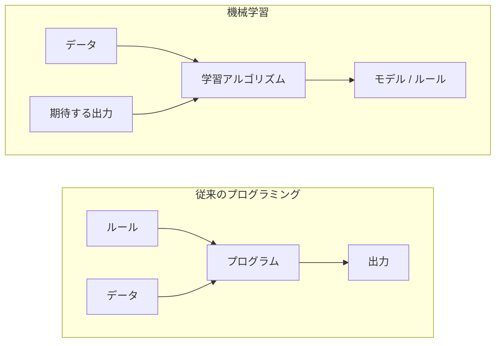
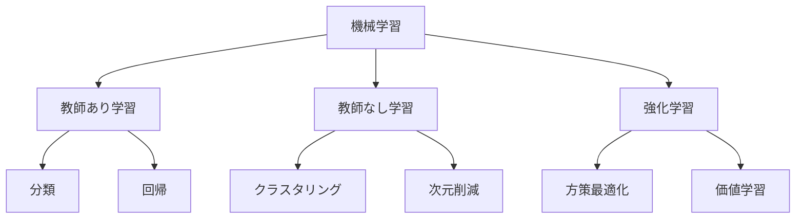
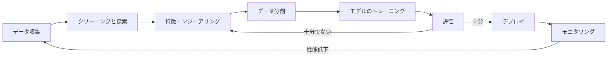
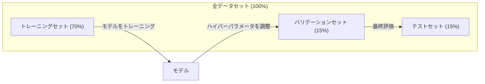
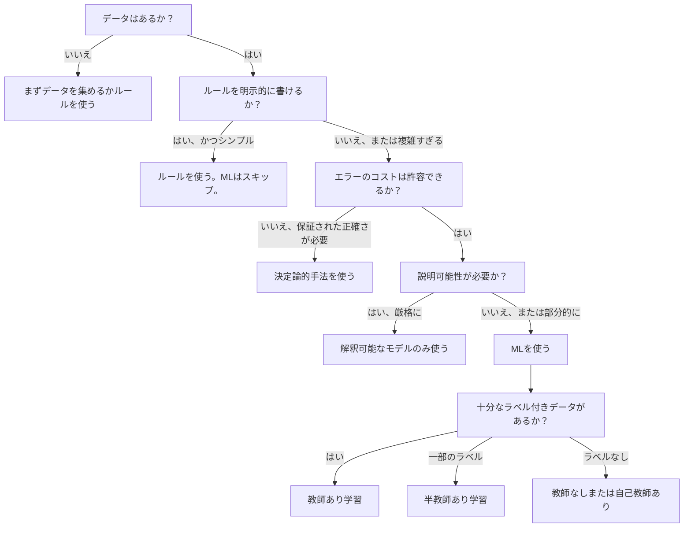

# 機械学習とは何か

> 機械学習とは、ルールを手で書く代わりに、コンピュータにデータのパターンを見つけさせることです。


## 学習目標

- 教師あり学習・教師なし学習・強化学習の違いを説明し、与えられた問題にどのタイプが当てはまるかを特定できる
- 最近傍重心分類器をゼロから実装し、ランダムベースラインと比較して評価できる
- 分類タスクと回帰タスクの違いを区別し、それぞれに適した損失関数を選択できる
- 与えられたビジネス課題が機械学習に適しているか、あるいは決定論的ルールで解決すべきかを評価できる

## 問題

スパムフィルターを作りたいとします。従来のアプローチ: 座って何百ものルールを書く。「メールに『無料でお金を』が含まれていたらスパムにする。感嘆符が3つ以上あったらスパムにする」というように。何週間もかけてルールを書く。するとスパム送信者が表現を変える。ルールが壊れる。またルールを書く。このサイクルは終わらない。

機械学習はこれを逆転させます。ルールを書く代わりに、「スパム」か「スパムでない」とラベル付けされた数千のメールをコンピュータに与え、ルールを自分で見つけ出させます。コンピュータは人間が思いつかなかったパターンを発見します。スパム送信者が戦術を変えたときは、コードを書き直す代わりに新しいデータで再トレーニングするだけです。

「ルールをプログラムする」から「データから学習する」へのこの転換が、機械学習の本質です。あらゆるレコメンデーションエンジン、音声アシスタント、自動運転車、そして言語モデルがこの方法で動いています。

## 概念

### データから学ぶ、ルールからではなく

従来のプログラミングと機械学習は、問題解決の方向が正反対です。



従来のプログラミング: ルールを書く。プログラムがデータにルールを適用して出力を生成する。

機械学習: データと期待する出力を提供する。アルゴリズムがルールを発見する。

トレーニングから得られる「モデル」こそがルールそのものであり、数値（重みやパラメータ）としてエンコードされています。見たことのある例から一般化して、見たことのないデータで予測を行います。

### 機械学習の3つのタイプ



**教師あり学習**: 入力と出力のペアがある。モデルは入力から出力へのマッピングを学習する。
- 「ここに猫か犬かラベル付けされた1万枚の写真がある。区別することを学べ。」
- 「ここに住宅の特徴と価格がある。価格を予測することを学べ。」

**教師なし学習**: 入力のみがある。ラベルはない。モデルが自力で構造を見つける。
- 「ここに1万人の顧客の購買履歴がある。自然なグループを見つけよ。」
- 「ここに1000次元のデータポイントがある。構造を保ちながら2次元に削減せよ。」

**強化学習**: エージェントが環境の中でアクションを取り、報酬またはペナルティを受け取る。合計報酬を最大化する戦略（方策）を学習する。
- 「このゲームをプレイしろ。勝てば+1、負ければ-1。戦略を考えろ。」
- 「このロボットアームを制御せよ。物体を掴めば+1、無駄な1秒ごとに-0.01。」

実践で作るものの大半は教師あり学習を使います。教師なし学習は前処理や探索によく使われます。強化学習はゲームAI、ロボティクス、そして言語モデルのRLHFを支えています。

### 3分類を超えて

上記の3つのカテゴリはシンプルですが、実際のMLはしばしばその境界を曖昧にします。

**半教師あり学習**は少量のラベル付きデータと大量のラベルなしデータを使います。例えば100枚のラベル付き医療画像と10万枚のラベルなし画像があるかもしれません。技術には以下が含まれます:

- **ラベル伝播**: 類似データポイントを結ぶグラフを構築する。ラベルがラベル付きノードからグラフを通じて隣接する未ラベルノードへと広がる。
- **擬似ラベリング**: ラベル付きデータでモデルをトレーニングし、それを使って未ラベルデータのラベルを予測し、すべてで再トレーニングする。モデルが自身のトレーニングセットを bootstrapする。
- **一貫性正則化**: モデルはある入力と、それをわずかに変形させたバージョンに対して同じ予測を与えるべきである。これはラベルがなくても機能する。

**自己教師あり学習**は、データ自体から教師信号を作り出す。人間のラベルは一切不要。モデルがデータの構造から独自の予測タスクを作る。

- **マスク言語モデリング (BERT)**: 文中の単語の15%を隠し、モデルに欠けている単語を予測させる。「ラベル」は元のテキストから得られる。
- **対照学習 (SimCLR)**: 画像を取り、2つの拡張バージョンを作る。それらが同じ画像から来たことを認識するようモデルをトレーニングしながら、他の画像の拡張バージョンから区別させる。
- **次トークン予測 (GPT)**: 前のすべての単語を与えて次の単語を予測する。すべてのテキスト文書がトレーニング例になる。

これらは3分類とは別のカテゴリではありません。教師ありと教師なしのアイデアを組み合わせた戦略です。自己教師あり学習は技術的には教師あり学習（モデルが何かを予測する）ですが、ラベルは人間ではなく自動的に生成されます。

### 分類 vs 回帰

これは2つの主要な教師あり学習タスクです。

| 側面 | 分類 | 回帰 |
|------|------|------|
| 出力 | 離散カテゴリ | 連続値の数値 |
| 例 | 「このメールはスパムか？」 | 「この家の価格はいくらになるか？」 |
| 出力空間 | {猫, 犬, 鳥} | 任意の実数 |
| 損失関数 | 交差エントロピー、正確度 | 平均二乗誤差、MAE |
| 判断 | クラス間の境界 | データに合わせた曲線 |

分類は「どのカテゴリか？」に答えます。回帰は「どのくらいか？」に答えます。

同じ問題を両方の方法で定式化できることもあります。株が上がるか下がるかの予測は分類です。正確な価格の予測は回帰です。

### MLのワークフロー

すべての機械学習プロジェクトは、アルゴリズムに関わらず同じパイプラインに従います。



**データ収集**: 生データを集める。より多くのデータはほぼ常に良いが、量より質が重要。

**クリーニングと探索**: 欠損値の処理、重複の削除、分布の可視化、異常値の発見。このステップはプロジェクト総時間の60〜80%を占めることが多い。

**特徴エンジニアリング**: 生データをモデルが使える特徴に変換する。日付を曜日に変換する。数値列を正規化する。カテゴリ変数をエンコードする。優れた特徴は高度なアルゴリズムより重要。

**データ分割**: トレーニング、バリデーション、テストセットに分割する。モデルはトレーニングデータで学習し、バリデーションデータでハイパーパラメータを調整し、テストデータで最終性能を報告する。

**モデルのトレーニング**: トレーニングデータをアルゴリズムに入力する。アルゴリズムが損失関数を最小化するように内部パラメータを調整する。

**評価**: バリデーション/テストデータで性能を測定する。性能が許容できない場合、別の特徴、アルゴリズム、またはハイパーパラメータを試すために戻る。

**デプロイ**: モデルを本番環境に置き、新しいデータで予測を行う。

**モニタリング**: 時間をかけて性能を追跡する。データの分布が変化し（データドリフト）、モデルが劣化する。性能が低下したら再トレーニングする。

### トレーニング・バリデーション・テスト分割

これは初心者が最もよく間違える重要な概念です。トレーニング中に一度も見ていないデータでモデルを評価しなければなりません。そうしなければ、学習ではなく記憶を測定することになります。



| 分割 | 目的 | 使用時期 | 典型的なサイズ |
|------|------|---------|-------------|
| トレーニング | モデルがこのデータから学習する | トレーニング中 | 60〜80% |
| バリデーション | ハイパーパラメータの調整、モデルの比較 | 各トレーニング実行後 | 10〜20% |
| テスト | 最終的な偏りのない性能推定 | 最後に一度だけ | 10〜20% |

テストセットは神聖です。正確に一度だけ見ます。テストの性能に基づいてモデルを調整し続けると、事実上テストセットでトレーニングしていることになり、報告された数値は無意味になります。

小さなデータセットには、k分割交差検証を使います: データをk個のパーツに分割し、k-1個のパーツでトレーニングし、残りのパーツで検証し、ローテーションして結果を平均します。

### 過学習 vs 未学習


**未学習**: モデルが単純すぎてデータのパターンを捉えられない。曲線の関係に直線を当てはめようとしている。トレーニング誤差が高い。テスト誤差も高い。

**過学習**: モデルが複雑すぎてトレーニングデータ（そのノイズを含む）を記憶してしまう。すべてのトレーニング点を通る波打った曲線だが、新しいデータでは失敗する。トレーニング誤差は低い。テスト誤差は高い。

**適切なフィット**: モデルがノイズを記憶せずに本当のパターンを捉える。トレーニング誤差とテスト誤差の両方が適度に低い。

過学習のサイン:
- トレーニング精度がバリデーション精度より大幅に高い
- モデルがトレーニングデータではうまく機能するが、新しいデータでは機能しない
- トレーニングデータを増やすと性能が向上する（モデルは記憶していたのであって学習していなかった）

過学習の対策:
- より多くのトレーニングデータを取得する
- モデルの複雑さを下げる（パラメータを少なく、アーキテクチャをシンプルに）
- 正則化（大きな重みへのペナルティを追加する）
- ドロップアウト（トレーニング中にニューロンをランダムにゼロにする）
- 早期停止（バリデーション誤差が増加し始めたらトレーニングを止める）

未学習の対策:
- より複雑なモデルを使う
- より多くの特徴を追加する
- 正則化を減らす
- より長くトレーニングする

### バイアス・バリアンスのトレードオフ

これは過学習と未学習の背後にある数学的フレームワークです。

**バイアス**: モデルの誤った仮定から生じる誤差。線形モデルは真の関係が非線形の場合に高いバイアスを持つ。高いバイアスは未学習につながる。

**バリアンス**: トレーニングデータの小さな変動への感度から生じる誤差。高バリアンスのモデルは、データの異なるサブセットでトレーニングすると非常に異なる予測を出す。高いバリアンスは過学習につながる。

| モデルの複雑さ | バイアス | バリアンス | 結果 |
|-------------|---------|---------|------|
| 低すぎる（曲線データへの線形モデル） | 高 | 低 | 未学習 |
| 適切 | 中 | 中 | 良い汎化 |
| 高すぎる（10点に対する20次多項式） | 低 | 高 | 過学習 |

全誤差 = バイアス^2 + バリアンス + 既約ノイズ

既約ノイズは下げられません（データ自体のランダム性です）。バイアス^2 + バリアンスが最小化されるスイートスポットを見つけたいのです。

### ノーフリーランチ定理

すべての問題に最も適したアルゴリズムは存在しません。あるクラスの問題で良い性能を発揮するアルゴリズムは、別のクラスでは悪い性能を出します。これが、データサイエンティストが複数のアルゴリズムを試して比較する理由です。

実際には、選択は以下によって異なります:
- 保有するデータ量
- 特徴の数
- 関係が線形か非線形か
- 解釈可能性が必要かどうか
- 使えるコンピューティングリソース

### 機械学習を使うべきでない場合

MLは強力ですが、常に正しいツールとは限りません。モデルを使う前に、本当に必要かどうかを問いましょう。

**MLを使うべきでない場合:**

- **ルールがシンプルで明確に定義されている。** 税計算、ソートアルゴリズム、単位換算。数行のif文でロジックを書けるなら、モデルは利益なしに複雑さを増すだけ。
- **データがないか、ほとんどない。** MLは学習するための例が必要。10データポイントでは意味のあるものをトレーニングできない。まずデータを収集する。
- **間違いのコストが壊滅的で、保証された正確さが必要。** 医療用量計算、原子炉制御、暗号化検証。MLモデルは確率的。時々間違える。「時々間違える」が許容できない場合は決定論的手法を使う。
- **ルックアップテーブルまたはヒューリスティックで問題が解決できる。** 単純な閾値やテーブルがケースの99%をカバーするなら、MLを追加しても意味のある改善なしにメンテナンスコストが増える。
- **決定を説明できず、説明可能性が必要。** 規制産業（貸付、保険、刑事司法）は、すべての決定が完全に説明可能であることを求めることがある。一部のMLモデルは解釈可能（線形回帰、小さな決定木）。大多数はそうでない。
- **再トレーニングできる速度より問題が変わる方が速い。** ルールが毎日変わり、再トレーニングに1週間かかるなら、モデルは常に陳腐化している。

この判断フローチャートを使いましょう:



## 実装する

`code/ml_intro.py` のコードは、最もシンプルなMLアルゴリズムである最近傍重心分類器をゼロから実装しています。これはコアアイデアを示しています: データから学習し、新しいデータで予測する。

### ステップ1: 最近傍重心分類器をゼロから

最近傍重心分類器は、トレーニングデータの各クラスの中心（平均）を計算します。予測するには、各新しい点を最も近い中心のクラスに割り当てます。

```python
class NearestCentroid:
    def fit(self, X, y):
        self.classes = np.unique(y)
        self.centroids = np.array([
            X[y == c].mean(axis=0) for c in self.classes
        ])

    def predict(self, X):
        distances = np.array([
            np.sqrt(((X - c) ** 2).sum(axis=1))
            for c in self.centroids
        ])
        return self.classes[distances.argmin(axis=0)]
```

これがアルゴリズム全体です。fitは2つの平均を計算します。predictは距離を計算します。勾配降下法なし、反復なし、ハイパーパラメータなし。

### ステップ2: 合成データでトレーニング

わずかに重なる2クラスの2D分類データセットを生成します。重心分類器はクラス中心の間に線形決定境界を描きます。

```python
rng = np.random.RandomState(42)
X_class0 = rng.randn(100, 2) + np.array([1.0, 1.0])
X_class1 = rng.randn(100, 2) + np.array([-1.0, -1.0])
X = np.vstack([X_class0, X_class1])
y = np.array([0] * 100 + [1] * 100)
```

### ステップ3: ベースラインと比較

すべてのMLモデルは自明なベースラインと比較すべきです。ここでは、ベースラインはランダムなクラスを予測します。MLモデルがランダム推測を上回らないなら、何かがおかしい。

```python
baseline_preds = rng.choice([0, 1], size=len(y_test))
baseline_acc = np.mean(baseline_preds == y_test)
```

重心分類器はこのクリーンなデータセットで90%以上の精度を達成するはずです。ランダムベースラインは50%程度です。

### なぜこれが重要か

最近傍重心分類器は極めてシンプルです。ハイパーパラメータなし、反復なし、勾配降下法なし。それでも基本的なMLのパターンを捉えています:

1. **学習**: トレーニングデータから表現を学習する（重心）
2. **予測**: その表現を使って新しいデータで予測する（最近傍距離）
3. **評価**: ベースライン（ランダム推測）と比較する

ロジスティック回帰からトランスフォーマーまで、あらゆるMLアルゴリズムがこの同じ3ステップパターンに従います。表現は複雑になりますが、ワークフローは同じです。

### ステップ4: 重心分類器にできないこと

最近傍重心分類器は、各クラスが単一のブロブを形成すると仮定します。線形決定境界を描きます。次の場合に失敗します:

- クラスに複数のクラスターがある（例えば、数字の「1」はいくつかの異なる書き方がある）
- 決定境界が非線形（例えば、あるクラスが別のクラスを囲んでいる）
- 特徴のスケールが大きく異なる（距離は最大スケールの特徴に支配される）

これらの制限が、これから学ぶすべての他のアルゴリズムの動機となります。K近傍法は複数クラスターを扱います。決定木は非線形境界を扱います。特徴スケーリングはスケールの問題を解決します。各レッスンは前のレッスンの限界の上に構築されます。

## 使ってみる

scikit-learnは `NearestCentroid` と合成データジェネレータを提供しています:

```python
from sklearn.neighbors import NearestCentroid
from sklearn.datasets import make_classification
from sklearn.model_selection import train_test_split

X, y = make_classification(
    n_samples=500, n_features=2, n_redundant=0,
    n_clusters_per_class=1, random_state=42
)
X_train, X_test, y_train, y_test = train_test_split(X, y, test_size=0.3)

clf = NearestCentroid()
clf.fit(X_train, y_train)
print(f"Accuracy: {clf.score(X_test, y_test):.3f}")
```

## 成果物を出す

このレッスンでは `outputs/prompt-ml-problem-framer.md` を生成します。これは曖昧なビジネス問題を具体的なMLタスクに変換するプロンプトです。問題の説明（「解約を減らしたい」や「来四半期の需要を予測したい」）を与えると、学習タイプを特定し、予測ターゲットを定義し、候補特徴をリストアップし、成功指標を選び、ベースラインを確立し、データリークやクラス不均衡などの落とし穴にフラグを立てます。MLプロジェクトの開始時に間違ったものを作るのを避けるために使います。

## キーワード

| 用語 | よく言われること | 実際の意味 |
|------|--------------|-----------|
| モデル | 「AI」 | 入力を出力にマッピングする学習可能なパラメータを持つ数学的関数 |
| トレーニング | 「AIを教える」 | 予測が既知の出力と一致するようにモデルパラメータを調整する最適化アルゴリズムを実行すること |
| 特徴 | 「入力列」 | モデルが予測に使用するデータの測定可能な属性 |
| ラベル | 「答え」 | 誤差信号を計算するために使用される、トレーニング例の既知の出力 |
| ハイパーパラメータ | 「調整する設定」 | トレーニング前に設定され、学習プロセスを制御するパラメータ（学習率、レイヤー数） |
| 損失関数 | 「モデルがどれだけ間違っているか」 | 予測された出力と実際の出力の差を測定する関数で、トレーニングがこれを最小化しようとする |
| 過学習 | 「テストを記憶した」 | モデルが一般的なパターンの代わりにトレーニング固有のノイズを学習し、新しいデータで失敗する |
| 未学習 | 「何も学習しなかった」 | モデルが単純すぎてデータの本当のパターンを捉えられない |
| 汎化 | 「新しいデータで機能する」 | モデルがトレーニングされていないデータで正確な予測を行う能力 |
| 交差検証 | 「異なるチャンクでテストする」 | データをトレーニング/テストのfoldに繰り返し分割して結果を平均し、より堅牢な性能推定を得る |
| 正則化 | 「重みを小さく保つ」 | 過度に複雑なモデルを抑制するペナルティ項を損失関数に追加する |
| データドリフト | 「世界が変わった」 | 入力データの統計的分布が時間とともにシフトし、モデルの性能が劣化する |

## 演習

1. 任意のデータセット（Iris、Titanicなど）を取る。70/15/15でトレーニング/バリデーション/テストに分割する。テストセットでハイパーパラメータを調整すべきでない理由を説明せよ。
2. 3つの実世界の問題をリストアップせよ。それぞれについて、分類、回帰、クラスタリングのいずれであるか、教師ありか教師なしかを特定せよ。
3. モデルのトレーニングデータ精度が99%だがテストデータが60%の場合。問題を診断し、修正するために試す3つのことをリストアップせよ。

## 参考資料

- [統計的学習の入門 (An Introduction to Statistical Learning)](https://www.statlearning.com/) - 実践的な例を交えてすべての古典的ML手法を扱う無料テキスト
- [Googleの機械学習集中講座](https://developers.google.com/machine-learning/crash-course) - ML概念の簡潔なビジュアル入門
- [Scikit-learnユーザーガイド](https://scikit-learn.org/stable/user_guide.html) - PythonでMLを実装するための実践リファレンス
