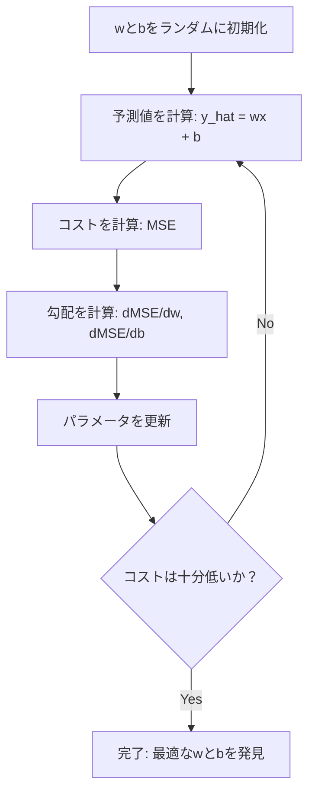

# 線形回帰

> 線形回帰はデータに最も適した直線を引きます。機械学習の「Hello World」です。


## 学習目標

- 平均二乗誤差の勾配降下法の更新ルールを導出し、線形回帰をゼロから実装できる
- 勾配降下法と正規方程式を計算量の観点で比較し、それぞれをいつ使うべきかを説明できる
- 特徴の標準化を行う重回帰モデルを構築し、学習した重みを解釈できる
- Ridge回帰（L2正則化）が大きな重みにペナルティを与えることで過学習を防ぐ仕組みを説明できる

## 問題

データがあります: 住宅の広さとその売値。新しい住宅の広さから価格を予測したい。散布図で目測もできますが、数式が必要です。任意の広さを入力すれば価格予測を返せる、データに最もよく当てはまる直線が必要です。

線形回帰がその直線を与えてくれます。さらに重要なのは、これがMLトレーニングループ全体を導入することです: モデルを定義し、コスト関数を定義し、パラメータを最適化する。すべてのMLアルゴリズムがこの同じパターンに従います。ここで最もシンプルなケースを習得すれば、どこでも認識できるようになります。

これは単純な問題だけのものではありません。線形回帰は需要予測、A/Bテスト分析、財務モデリング、そしてすべての回帰タスクのベースラインとして本番システムで使われています。

## 概念

### モデル

線形回帰は入力（x）と出力（y）の間の線形関係を仮定します:

```
y = wx + b
```

- `w`（重み/傾き）: xが1増えるとyがどれだけ変わるか
- `b`（バイアス/切片）: x = 0のときのyの値

複数の入力（特徴）の場合、これは次のように拡張されます:

```
y = w1*x1 + w2*x2 + ... + wn*xn + b
```

またはベクトル形式で: `y = w^T * x + b`

目標: すべてのトレーニング例において予測されたyが実際のyにできるだけ近くなるようにwとbの値を見つける。

### コスト関数（平均二乗誤差）

「できるだけ近く」をどう測定するか？予測がどれだけ間違っているかを表す単一の数値が必要です。最も一般的な選択は平均二乗誤差（MSE）です:

```
MSE = (1/n) * sum((y_predicted - y_actual)^2)
```

なぜ二乗するのか？2つの理由があります。第一に、小さな誤差より大きな誤差に不均衡に大きなペナルティを与えます（10の誤差は1の誤差より10倍ではなく100倍悪い）。第二に、二乗関数はどこでも滑らかで微分可能で、最適化を容易にします。

コスト関数は曲面を作ります。単一の重みwとバイアスbに対して、MSE曲面はお椀型（凸放物面）に見えます。お椀の底がMSEが最小化される場所です。トレーニングとはその底を見つけることを意味します。

### 勾配降下法

勾配降下法は坂を下っていくことでお椀の底を見つけます。



勾配は2つのことを教えてくれます: 各パラメータをどの方向に動かすか、そしてどれだけ動かすか。

y_hat = wx + bのMSEの場合:

```
dMSE/dw = (2/n) * sum((y_hat - y) * x)
dMSE/db = (2/n) * sum(y_hat - y)
```

更新ルール:

```
w = w - learning_rate * dMSE/dw
b = b - learning_rate * dMSE/db
```

学習率はステップサイズを制御します。大きすぎると: 最小値を飛び越えて発散します。小さすぎると: トレーニングが永遠にかかります。典型的な初期値: 0.01、0.001、または0.0001。

### 正規方程式（閉形式解）

線形回帰に特有の、反復なしに最適な重みを直接与える公式があります:

```
w = (X^T * X)^(-1) * X^T * y
```

これはwを1ステップで解くために行列を逆行列化します。小さなデータセットには完璧に機能します。大きなデータセット（数百万行や数千の特徴）では、行列の逆行列化は特徴数についてO(n^3)であるため、勾配降下法が好まれます。

### 重回帰

複数の特徴を持つ場合、モデルは次のようになります:

```
y = w1*x1 + w2*x2 + ... + wn*xn + b
```

すべては同じように機能します: MSEがコスト関数で、勾配降下法がすべての重みを同時に更新します。唯一の違いは、直線の代わりに超平面に当てはめていることです。

ここでは特徴のスケーリングが重要です。一方の特徴が0から1の範囲で、もう一方が0から1,000,000の範囲の場合、コスト曲面が細長くなるため勾配降下法は苦労します。トレーニング前に特徴を標準化（平均を引いて標準偏差で割る）します。

### 多項式回帰

関係が線形でない場合は？多項式特徴を作成することで線形回帰を使えます:

```
y = w1*x + w2*x^2 + w3*x^3 + b
```

これは依然として「線形」回帰です。モデルが重み（w1、w2、w3）において線形だからです。xの非線形特徴を使っているだけです。

高次多項式はより複雑な曲線に当てはめられますが、過学習のリスクがあります。10次多項式は10点のデータセットのすべての点を通りますが、新しいデータでは予測が悪くなります。

### R二乗スコア

MSEは間違いの程度を教えてくれますが、その数値はyのスケールに依存します。R二乗（R^2）はスケールに依存しない測定値を提供します:

```
R^2 = 1 - (残差の二乗和) / (平均からの偏差の二乗和)
    = 1 - SS_res / SS_tot
```

- R^2 = 1.0: 完璧な予測
- R^2 = 0.0: モデルは毎回平均を予測するより良くない
- R^2 < 0.0: モデルは平均を予測するより悪い

### 正則化プレビュー（Ridge回帰）

多くの特徴がある場合、モデルは大きな重みを割り当てることで過学習する可能性があります。Ridge回帰（L2正則化）はペナルティを追加します:

```
Cost = MSE + lambda * sum(w_i^2)
```

ペナルティ項は大きな重みを抑制します。ハイパーパラメータlambdaはトレードオフを制御します: lambdaが大きいほど重みが小さく、正則化が強くなります。これは後のレッスンで詳しく説明します。今は存在することとなぜ役立つかを知っておきましょう。

## 実装する

### ステップ1: サンプルデータの生成

```python
import random
import math

random.seed(42)

TRUE_W = 3.0
TRUE_B = 7.0
N_SAMPLES = 100

X = [random.uniform(0, 10) for _ in range(N_SAMPLES)]
y = [TRUE_W * x + TRUE_B + random.gauss(0, 2.0) for x in X]

print(f"Generated {N_SAMPLES} samples")
print(f"True relationship: y = {TRUE_W}x + {TRUE_B} (+ noise)")
print(f"First 5 points: {[(round(X[i], 2), round(y[i], 2)) for i in range(5)]}")
```

### ステップ2: 勾配降下法による線形回帰をゼロから

```python
class LinearRegression:
    def __init__(self, learning_rate=0.01):
        self.w = 0.0
        self.b = 0.0
        self.lr = learning_rate
        self.cost_history = []

    def predict(self, X):
        return [self.w * x + self.b for x in X]

    def compute_cost(self, X, y):
        predictions = self.predict(X)
        n = len(y)
        cost = sum((pred - actual) ** 2 for pred, actual in zip(predictions, y)) / n
        return cost

    def compute_gradients(self, X, y):
        predictions = self.predict(X)
        n = len(y)
        dw = (2 / n) * sum((pred - actual) * x for pred, actual, x in zip(predictions, y, X))
        db = (2 / n) * sum(pred - actual for pred, actual in zip(predictions, y))
        return dw, db

    def fit(self, X, y, epochs=1000, print_every=200):
        for epoch in range(epochs):
            dw, db = self.compute_gradients(X, y)
            self.w -= self.lr * dw
            self.b -= self.lr * db
            cost = self.compute_cost(X, y)
            self.cost_history.append(cost)
            if epoch % print_every == 0:
                print(f"  Epoch {epoch:4d} | Cost: {cost:.4f} | w: {self.w:.4f} | b: {self.b:.4f}")
        return self

    def r_squared(self, X, y):
        predictions = self.predict(X)
        y_mean = sum(y) / len(y)
        ss_res = sum((actual - pred) ** 2 for actual, pred in zip(y, predictions))
        ss_tot = sum((actual - y_mean) ** 2 for actual in y)
        return 1 - (ss_res / ss_tot)


print("=== Training Linear Regression (Gradient Descent) ===")
model = LinearRegression(learning_rate=0.005)
model.fit(X, y, epochs=1000, print_every=200)
print(f"\nLearned: y = {model.w:.4f}x + {model.b:.4f}")
print(f"True:    y = {TRUE_W}x + {TRUE_B}")
print(f"R-squared: {model.r_squared(X, y):.4f}")
```

### ステップ3: 正規方程式（閉形式解）

```python
class LinearRegressionNormal:
    def __init__(self):
        self.w = 0.0
        self.b = 0.0

    def fit(self, X, y):
        n = len(X)
        x_mean = sum(X) / n
        y_mean = sum(y) / n
        numerator = sum((X[i] - x_mean) * (y[i] - y_mean) for i in range(n))
        denominator = sum((X[i] - x_mean) ** 2 for i in range(n))
        self.w = numerator / denominator
        self.b = y_mean - self.w * x_mean
        return self

    def predict(self, X):
        return [self.w * x + self.b for x in X]

    def r_squared(self, X, y):
        predictions = self.predict(X)
        y_mean = sum(y) / len(y)
        ss_res = sum((actual - pred) ** 2 for actual, pred in zip(y, predictions))
        ss_tot = sum((actual - y_mean) ** 2 for actual in y)
        return 1 - (ss_res / ss_tot)


print("\n=== Normal Equation (Closed-Form) ===")
model_normal = LinearRegressionNormal()
model_normal.fit(X, y)
print(f"Learned: y = {model_normal.w:.4f}x + {model_normal.b:.4f}")
print(f"R-squared: {model_normal.r_squared(X, y):.4f}")
```

### ステップ4: 重回帰

```python
class MultipleLinearRegression:
    def __init__(self, n_features, learning_rate=0.01):
        self.weights = [0.0] * n_features
        self.bias = 0.0
        self.lr = learning_rate
        self.cost_history = []

    def predict_single(self, x):
        return sum(w * xi for w, xi in zip(self.weights, x)) + self.bias

    def predict(self, X):
        return [self.predict_single(x) for x in X]

    def compute_cost(self, X, y):
        predictions = self.predict(X)
        n = len(y)
        return sum((pred - actual) ** 2 for pred, actual in zip(predictions, y)) / n

    def fit(self, X, y, epochs=1000, print_every=200):
        n = len(y)
        n_features = len(X[0])
        for epoch in range(epochs):
            predictions = self.predict(X)
            errors = [pred - actual for pred, actual in zip(predictions, y)]
            for j in range(n_features):
                grad = (2 / n) * sum(errors[i] * X[i][j] for i in range(n))
                self.weights[j] -= self.lr * grad
            grad_b = (2 / n) * sum(errors)
            self.bias -= self.lr * grad_b
            cost = self.compute_cost(X, y)
            self.cost_history.append(cost)
            if epoch % print_every == 0:
                print(f"  Epoch {epoch:4d} | Cost: {cost:.4f}")
        return self

    def r_squared(self, X, y):
        predictions = self.predict(X)
        y_mean = sum(y) / len(y)
        ss_res = sum((actual - pred) ** 2 for actual, pred in zip(y, predictions))
        ss_tot = sum((actual - y_mean) ** 2 for actual in y)
        return 1 - (ss_res / ss_tot)


random.seed(42)
N = 100
X_multi = []
y_multi = []
for _ in range(N):
    size = random.uniform(500, 3000)
    bedrooms = random.randint(1, 5)
    age = random.uniform(0, 50)
    price = 50 * size + 10000 * bedrooms - 1000 * age + 50000 + random.gauss(0, 20000)
    X_multi.append([size, bedrooms, age])
    y_multi.append(price)


def standardize(X):
    n_features = len(X[0])
    means = [sum(X[i][j] for i in range(len(X))) / len(X) for j in range(n_features)]
    stds = []
    for j in range(n_features):
        variance = sum((X[i][j] - means[j]) ** 2 for i in range(len(X))) / len(X)
        stds.append(variance ** 0.5)
    X_scaled = []
    for i in range(len(X)):
        row = [(X[i][j] - means[j]) / stds[j] if stds[j] > 0 else 0 for j in range(n_features)]
        X_scaled.append(row)
    return X_scaled, means, stds


y_mean_val = sum(y_multi) / len(y_multi)
y_std_val = (sum((yi - y_mean_val) ** 2 for yi in y_multi) / len(y_multi)) ** 0.5
y_scaled = [(yi - y_mean_val) / y_std_val for yi in y_multi]

X_scaled, x_means, x_stds = standardize(X_multi)

print("\n=== Multiple Linear Regression (3 features) ===")
print("Features: house size, bedrooms, age")
multi_model = MultipleLinearRegression(n_features=3, learning_rate=0.01)
multi_model.fit(X_scaled, y_scaled, epochs=1000, print_every=200)

print(f"\nWeights (standardized): {[round(w, 4) for w in multi_model.weights]}")
print(f"Bias (standardized): {multi_model.bias:.4f}")
print(f"R-squared: {multi_model.r_squared(X_scaled, y_scaled):.4f}")
```

### ステップ5: 多項式回帰

```python
class PolynomialRegression:
    def __init__(self, degree, learning_rate=0.01):
        self.degree = degree
        self.weights = [0.0] * degree
        self.bias = 0.0
        self.lr = learning_rate

    def make_features(self, X):
        return [[x ** (d + 1) for d in range(self.degree)] for x in X]

    def predict(self, X):
        features = self.make_features(X)
        return [sum(w * f for w, f in zip(self.weights, row)) + self.bias for row in features]

    def fit(self, X, y, epochs=1000, print_every=200):
        features = self.make_features(X)
        n = len(y)
        for epoch in range(epochs):
            predictions = [sum(w * f for w, f in zip(self.weights, row)) + self.bias for row in features]
            errors = [pred - actual for pred, actual in zip(predictions, y)]
            for j in range(self.degree):
                grad = (2 / n) * sum(errors[i] * features[i][j] for i in range(n))
                self.weights[j] -= self.lr * grad
            grad_b = (2 / n) * sum(errors)
            self.bias -= self.lr * grad_b
            if epoch % print_every == 0:
                cost = sum(e ** 2 for e in errors) / n
                print(f"  Epoch {epoch:4d} | Cost: {cost:.6f}")
        return self

    def r_squared(self, X, y):
        predictions = self.predict(X)
        y_mean = sum(y) / len(y)
        ss_res = sum((actual - pred) ** 2 for actual, pred in zip(y, predictions))
        ss_tot = sum((actual - y_mean) ** 2 for actual in y)
        return 1 - (ss_res / ss_tot)


random.seed(42)
X_poly = [x / 10.0 for x in range(0, 50)]
y_poly = [0.5 * x ** 2 - 2 * x + 3 + random.gauss(0, 1.0) for x in X_poly]

x_max = max(abs(x) for x in X_poly)
X_poly_norm = [x / x_max for x in X_poly]
y_poly_mean = sum(y_poly) / len(y_poly)
y_poly_std = (sum((yi - y_poly_mean) ** 2 for yi in y_poly) / len(y_poly)) ** 0.5
y_poly_norm = [(yi - y_poly_mean) / y_poly_std for yi in y_poly]

print("\n=== Polynomial Regression (degree 2 vs degree 5) ===")
print("True relationship: y = 0.5x^2 - 2x + 3")

print("\nDegree 2:")
poly2 = PolynomialRegression(degree=2, learning_rate=0.1)
poly2.fit(X_poly_norm, y_poly_norm, epochs=2000, print_every=500)
print(f"  R-squared: {poly2.r_squared(X_poly_norm, y_poly_norm):.4f}")

print("\nDegree 5:")
poly5 = PolynomialRegression(degree=5, learning_rate=0.1)
poly5.fit(X_poly_norm, y_poly_norm, epochs=2000, print_every=500)
print(f"  R-squared: {poly5.r_squared(X_poly_norm, y_poly_norm):.4f}")

print("\nDegree 2 fits the true curve well. Degree 5 fits training data slightly better")
print("but risks overfitting on new data.")
```

### ステップ6: Ridge回帰（L2正則化）

```python
class RidgeRegression:
    def __init__(self, n_features, learning_rate=0.01, alpha=1.0):
        self.weights = [0.0] * n_features
        self.bias = 0.0
        self.lr = learning_rate
        self.alpha = alpha

    def predict_single(self, x):
        return sum(w * xi for w, xi in zip(self.weights, x)) + self.bias

    def predict(self, X):
        return [self.predict_single(x) for x in X]

    def fit(self, X, y, epochs=1000, print_every=200):
        n = len(y)
        n_features = len(X[0])
        for epoch in range(epochs):
            predictions = self.predict(X)
            errors = [pred - actual for pred, actual in zip(predictions, y)]
            mse = sum(e ** 2 for e in errors) / n
            reg_term = self.alpha * sum(w ** 2 for w in self.weights)
            cost = mse + reg_term
            for j in range(n_features):
                grad = (2 / n) * sum(errors[i] * X[i][j] for i in range(n))
                grad += 2 * self.alpha * self.weights[j]
                self.weights[j] -= self.lr * grad
            grad_b = (2 / n) * sum(errors)
            self.bias -= self.lr * grad_b
            if epoch % print_every == 0:
                print(f"  Epoch {epoch:4d} | Cost: {cost:.4f} | L2 penalty: {reg_term:.4f}")
        return self


print("\n=== Ridge Regression (L2 Regularization) ===")
print("Same data as multiple regression, with alpha=0.1")
ridge = RidgeRegression(n_features=3, learning_rate=0.01, alpha=0.1)
ridge.fit(X_scaled, y_scaled, epochs=1000, print_every=200)
print(f"\nRidge weights: {[round(w, 4) for w in ridge.weights]}")
print(f"Plain weights: {[round(w, 4) for w in multi_model.weights]}")
print("Ridge weights are smaller (shrunk toward zero) due to the L2 penalty.")
```

## 使ってみる

同じことをscikit-learnで行います。これが実際に本番で使うものです。

```python
from sklearn.linear_model import LinearRegression as SklearnLR
from sklearn.linear_model import Ridge
from sklearn.preprocessing import PolynomialFeatures, StandardScaler
from sklearn.model_selection import train_test_split
from sklearn.metrics import mean_squared_error, r2_score
import numpy as np

np.random.seed(42)
X_sk = np.random.uniform(0, 10, (100, 1))
y_sk = 3.0 * X_sk.squeeze() + 7.0 + np.random.normal(0, 2.0, 100)

X_train, X_test, y_train, y_test = train_test_split(X_sk, y_sk, test_size=0.2, random_state=42)

lr = SklearnLR()
lr.fit(X_train, y_train)
y_pred = lr.predict(X_test)

print("=== Scikit-learn Linear Regression ===")
print(f"Coefficient (w): {lr.coef_[0]:.4f}")
print(f"Intercept (b): {lr.intercept_:.4f}")
print(f"R-squared (test): {r2_score(y_test, y_pred):.4f}")
print(f"MSE (test): {mean_squared_error(y_test, y_pred):.4f}")

poly = PolynomialFeatures(degree=2, include_bias=False)
X_poly_sk = poly.fit_transform(X_train)
X_poly_test = poly.transform(X_test)

lr_poly = SklearnLR()
lr_poly.fit(X_poly_sk, y_train)
print(f"\nPolynomial degree 2 R-squared: {r2_score(y_test, lr_poly.predict(X_poly_test)):.4f}")

scaler = StandardScaler()
X_train_scaled = scaler.fit_transform(X_train)
X_test_scaled = scaler.transform(X_test)

ridge = Ridge(alpha=1.0)
ridge.fit(X_train_scaled, y_train)
print(f"Ridge R-squared: {r2_score(y_test, ridge.predict(X_test_scaled)):.4f}")
print(f"Ridge coefficient: {ridge.coef_[0]:.4f}")
```

ゼロからの実装とscikit-learnは同じ結果を生成します。違いは: scikit-learnがエッジケース、数値的安定性、パフォーマンスの最適化を処理します。本番にはライブラリを使います。何が起こっているかを理解するためにゼロからの実装を使います。

## 成果物を出す

このレッスンでは:
- `outputs/skill-regression.md` - 問題に基づいて適切な回帰アプローチを選択するためのスキル

## 演習

1. バッチ勾配降下法、確率的勾配降下法（SGD）、ミニバッチ勾配降下法を実装せよ。同じデータセットで収束速度を比較する。どれが最も速く収束するか？どれがコスト曲線が最も滑らかか？
2. 3次関数（y = ax^3 + bx^2 + cx + d + ノイズ）からデータを生成する。1次、3次、10次の多項式を当てはめる。トレーニングR^2とテストR^2を比較する。何次から過学習が明らかになるか？
3. Lasso回帰（L1正則化: ペナルティ = alpha * sum(|w_i|)）を実装せよ。多特徴の住宅データでトレーニングする。どの重みがゼロになるかをRidgeと比較する。なぜL1はスパース解を生成し、L2は生成しないのか？

## キーワード

| 用語 | よく言われること | 実際の意味 |
|------|--------------|-----------|
| 線形回帰 | 「データに直線を引く」 | 予測wx+bと実際のy値の二乗差の和を最小化する重みwとバイアスbを見つける |
| コスト関数 | 「モデルの悪さ」 | モデルパラメータを予測誤差を測定する単一の数値にマッピングする関数。最適化がこれを最小化する |
| 平均二乗誤差 | 「二乗誤差の平均」 | (1/n) * (予測 - 実際)^2の和。大きな誤差を不均衡に大きく罰する |
| 勾配降下法 | 「坂を下る」 | 偏微分を使ってコスト関数を減少させる方向にパラメータを反復的に調整する |
| 学習率 | 「ステップサイズ」 | 勾配降下法の1ステップでパラメータがどれだけ変化するかを制御するスカラー |
| 正規方程式 | 「直接解く」 | 反復なしに最適な重みを与える閉形式解 w = (X^T X)^-1 X^T y |
| R二乗 | 「フィットの良さ」 | モデルによって説明されるyの分散の割合。負の無限大から1.0の範囲 |
| 特徴スケーリング | 「特徴を比較可能にする」 | 特徴を同じような範囲に変換する（例: 平均ゼロ、単位分散）ことで勾配降下法の収束を速める |
| 正則化 | 「複雑さにペナルティを与える」 | 重みを縮小させるコスト関数へのペナルティ項の追加。過学習を防ぐ |
| Ridge回帰 | 「L2正則化」 | MSEにlambda * sum(w_i^2)のペナルティを加えた線形回帰 |
| 多項式回帰 | 「線形数学で曲線を当てはめる」 | 多項式特徴（x、x^2、x^3、...）に対する線形回帰。重みにおいて依然として線形 |
| 過学習 | 「トレーニングデータを記憶する」 | モデルがトレーニングデータのノイズを当てはめ、新しいデータで失敗するほど複雑 |

## 参考資料

- [統計的学習の入門 (ISLR)](https://www.statlearning.com/) -- 無料PDF、第3章と第6章が線形回帰と正則化を実践的なR例とともに扱う
- [統計的学習の要素 (ESL)](https://hastie.su.domains/ElemStatLearn/) -- 無料PDF、ridgeとlassoをより深く扱うISLRの数学的な姉妹書
- [スタンフォードCS229 線形回帰講義ノート](https://cs229.stanford.edu/main_notes.pdf) -- Andrew Ngが正規方程式と勾配降下法を第一原理から導出したノート
- [scikit-learn LinearRegression ドキュメント](https://scikit-learn.org/stable/modules/linear_model.html) -- コード例付きのLinearRegression、Ridge、Lasso、ElasticNetの実践リファレンス
