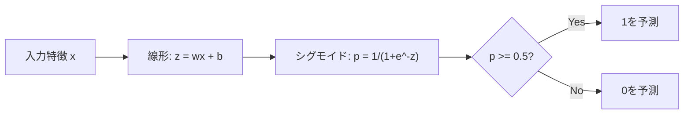
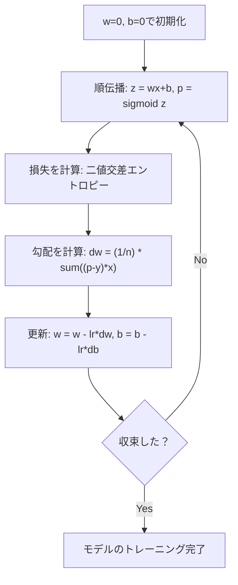

# ロジスティック回帰

> ロジスティック回帰は直線をS字曲線に曲げ、確率でイエス・ノー問題に答えます。


## 学習目標

- シグモイド関数と二値交差エントロピー損失を使ってロジスティック回帰をゼロから実装できる
- 二値分類の精度、再現率、F1スコア、混同行列を計算して解釈できる
- 分類にMSEが失敗する理由と、二値交差エントロピーが凸コスト曲面を生成する理由を説明できる
- 多クラス分類のためのソフトマックス回帰モデルを構築し、閾値チューニングのトレードオフを評価できる

## 問題

腫瘍のサイズから良性か悪性かを予測したいとします。線形回帰を試します。0.3や1.7や-0.5といった数値が出力されます。それらは何を意味するのか？1.7は「非常に悪性」なのか？-0.5は「非常に良性」なのか？線形回帰は無制限の数値を出力します。分類には0から1の間の有界な確率と、明確な判断（イエスかノーか）が必要です。

ロジスティック回帰がこれを解決します。同じ線形結合（wx + b）を取り、シグモイド関数を通すことで、任意の数値を(0, 1)の範囲に圧縮します。出力は確率です。閾値（通常0.5）を設定して判断を下します。

これは実践で最も広く使われるアルゴリズムの1つです。名前に「回帰」とあるにもかかわらず、ロジスティック回帰は分類アルゴリズムであり、回帰アルゴリズムではありません。名前は使用するロジスティック（シグモイド）関数から来ています。

## 概念

### なぜ分類に線形回帰が失敗するか

学習時間を基に合否（1/0）を予測することを想像してください。線形回帰はデータに直線を当てはめます:

```
時間:  1   2   3   4   5   6   7   8   9   10
実際: 0   0   0   0   1   1   1   1   1   1
```

線形フィットは1時間目に-0.2、10時間目に1.3のような予測を生成するかもしれません。これらの値は確率ではありません。0を下回り、1を超えます。さらに悪いことに、外れ値（50時間勉強した人）が直線全体を引っ張り、すべての人の予測を変えてしまいます。

分類には次のような関数が必要です:
- 0から1の間の値（確率）を出力する
- 急激な遷移（決定境界）を作る
- 境界から遠い外れ値に歪められない

### シグモイド関数

シグモイド関数がまさにこれを行います:

```
sigmoid(z) = 1 / (1 + e^(-z))
```

特性:
- zが大きく正のとき、sigmoid(z)は1に近づく
- zが大きく負のとき、sigmoid(z)は0に近づく
- z = 0のとき、sigmoid(z) = 0.5
- 出力は常に0から1の間
- 関数はどこでも滑らかで微分可能

導関数は便利な形式を持ちます: sigmoid'(z) = sigmoid(z) * (1 - sigmoid(z))。これにより勾配計算が効率的になります。

### ロジスティック回帰 = 線形モデル + シグモイド

モデルはz = wx + b（線形回帰と同じ）を計算し、シグモイドを適用します:



出力pはP(y=1 | x)、入力がクラス1に属する確率と解釈されます。決定境界はwx + b = 0のところで、シグモイドが正確に0.5を出力します。

### 二値交差エントロピー損失

ロジスティック回帰にはMSEを使えません。シグモイドとMSEは多くの局所最小値を持つ非凸コスト曲面を作ります。代わりに二値交差エントロピー（ログ損失）を使います:

```
Loss = -(1/n) * sum(y * log(p) + (1-y) * log(1-p))
```

なぜこれが機能するか:
- y=1でpが1に近い場合: log(1) = 0なので損失はほぼ0（正解、低コスト）
- y=1でpが0に近い場合: log(0)は負の無限大に近づくので損失は巨大（間違い、高コスト）
- y=0でpが0に近い場合: log(1) = 0なので損失はほぼ0（正解、低コスト）
- y=0でpが1に近い場合: log(0)は負の無限大に近づくので損失は巨大（間違い、高コスト）

この損失関数はロジスティック回帰に対して凸で、単一の大域的最小値を保証します。

### ロジスティック回帰の勾配降下法

シグモイドを使った二値交差エントロピーの勾配はきれいな形式を持ちます:

```
dL/dw = (1/n) * sum((p - y) * x)
dL/db = (1/n) * sum(p - y)
```

これらは線形回帰の勾配と同一に見えます。違いはp = sigmoid(wx + b)であることで、p = wx + bではありません。シグモイドが非線形性を導入しますが、勾配更新ルールは同じです。



### 決定境界

2D入力（2つの特徴）の場合、決定境界は次の直線です:

```
w1*x1 + w2*x2 + b = 0
```

一方の側の点は1に分類され、他方の側の点は0に分類されます。ロジスティック回帰は常に線形決定境界を生成します。曲線境界が必要な場合は、多項式特徴を追加するか、非線形モデルを使います。

### ソフトマックスによる多クラス分類

二値ロジスティック回帰は2クラスを扱います。k個のクラスにはソフトマックス関数を使います:

```
softmax(z_i) = e^(z_i) / sum(e^(z_j) すべてのjについて)
```

各クラスが独自の重みベクトルを持ちます。モデルは各クラスのスコアz_iを計算し、ソフトマックスがスコアを合計が1になる確率に変換します。予測クラスは最も高い確率を持つものです。

損失関数はカテゴリカル交差エントロピーになります:

```
Loss = -(1/n) * sum(sum(y_k * log(p_k)))
```

ここでy_kは真のクラスに対して1、他のすべてに対して0です（ワンホットエンコーディング）。

### 評価指標

精度だけでは不十分です。95%が負例で5%が正例のデータセットでは、常に負例を予測するモデルが95%の精度を得ますが、使い物になりません。

**混同行列**:

| | 予測正例 | 予測負例 |
|---|---|---|
| 実際正例 | 真陽性 (TP) | 偽陰性 (FN) |
| 実際負例 | 偽陽性 (FP) | 真陰性 (TN) |

**精度（Precision）**: 予測した正例のうち、実際に正例はどれだけか？
```
精度 = TP / (TP + FP)
```

**再現率（Recall）（感度）**: 実際の正例のうち、どれだけ捉えたか？
```
再現率 = TP / (TP + FN)
```

**F1スコア**: 精度と再現率の調和平均。両方の指標のバランスを取る。
```
F1 = 2 * (精度 * 再現率) / (精度 + 再現率)
```

優先する場面:
- **精度**: 偽陽性のコストが高い場合（スパムフィルター: 正当なメールをブロックしたくない）
- **再現率**: 偽陰性のコストが高い場合（がん検診: 腫瘍を見逃したくない）
- **F1**: バランスの取れた単一指標が必要な場合

## 実装する

### ステップ1: シグモイド関数とデータ生成

```python
import random
import math

def sigmoid(z):
    z = max(-500, min(500, z))
    return 1.0 / (1.0 + math.exp(-z))


random.seed(42)
N = 200
X = []
y = []

for _ in range(N // 2):
    X.append([random.gauss(2, 1), random.gauss(2, 1)])
    y.append(0)

for _ in range(N // 2):
    X.append([random.gauss(5, 1), random.gauss(5, 1)])
    y.append(1)

combined = list(zip(X, y))
random.shuffle(combined)
X, y = zip(*combined)
X = list(X)
y = list(y)

print(f"Generated {N} samples (2 classes, 2 features)")
print(f"Class 0 center: (2, 2), Class 1 center: (5, 5)")
print(f"First 5 samples:")
for i in range(5):
    print(f"  Features: [{X[i][0]:.2f}, {X[i][1]:.2f}], Label: {y[i]}")
```

### ステップ2: ロジスティック回帰をゼロから

```python
class LogisticRegression:
    def __init__(self, n_features, learning_rate=0.01):
        self.weights = [0.0] * n_features
        self.bias = 0.0
        self.lr = learning_rate
        self.loss_history = []

    def predict_proba(self, x):
        z = sum(w * xi for w, xi in zip(self.weights, x)) + self.bias
        return sigmoid(z)

    def predict(self, x, threshold=0.5):
        return 1 if self.predict_proba(x) >= threshold else 0

    def compute_loss(self, X, y):
        n = len(y)
        total = 0.0
        for i in range(n):
            p = self.predict_proba(X[i])
            p = max(1e-15, min(1 - 1e-15, p))
            total += y[i] * math.log(p) + (1 - y[i]) * math.log(1 - p)
        return -total / n

    def fit(self, X, y, epochs=1000, print_every=200):
        n = len(y)
        n_features = len(X[0])
        for epoch in range(epochs):
            dw = [0.0] * n_features
            db = 0.0
            for i in range(n):
                p = self.predict_proba(X[i])
                error = p - y[i]
                for j in range(n_features):
                    dw[j] += error * X[i][j]
                db += error
            for j in range(n_features):
                self.weights[j] -= self.lr * (dw[j] / n)
            self.bias -= self.lr * (db / n)
            loss = self.compute_loss(X, y)
            self.loss_history.append(loss)
            if epoch % print_every == 0:
                print(f"  Epoch {epoch:4d} | Loss: {loss:.4f} | w: [{self.weights[0]:.3f}, {self.weights[1]:.3f}] | b: {self.bias:.3f}")
        return self

    def accuracy(self, X, y):
        correct = sum(1 for i in range(len(y)) if self.predict(X[i]) == y[i])
        return correct / len(y)


split = int(0.8 * N)
X_train, X_test = X[:split], X[split:]
y_train, y_test = y[:split], y[split:]

print("\n=== Training Logistic Regression ===")
model = LogisticRegression(n_features=2, learning_rate=0.1)
model.fit(X_train, y_train, epochs=1000, print_every=200)

print(f"\nTrain accuracy: {model.accuracy(X_train, y_train):.4f}")
print(f"Test accuracy:  {model.accuracy(X_test, y_test):.4f}")
print(f"Weights: [{model.weights[0]:.4f}, {model.weights[1]:.4f}]")
print(f"Bias: {model.bias:.4f}")
```

### ステップ3: 混同行列と指標をゼロから

```python
class ClassificationMetrics:
    def __init__(self, y_true, y_pred):
        self.tp = sum(1 for t, p in zip(y_true, y_pred) if t == 1 and p == 1)
        self.tn = sum(1 for t, p in zip(y_true, y_pred) if t == 0 and p == 0)
        self.fp = sum(1 for t, p in zip(y_true, y_pred) if t == 0 and p == 1)
        self.fn = sum(1 for t, p in zip(y_true, y_pred) if t == 1 and p == 0)

    def accuracy(self):
        total = self.tp + self.tn + self.fp + self.fn
        return (self.tp + self.tn) / total if total > 0 else 0

    def precision(self):
        denom = self.tp + self.fp
        return self.tp / denom if denom > 0 else 0

    def recall(self):
        denom = self.tp + self.fn
        return self.tp / denom if denom > 0 else 0

    def f1(self):
        p = self.precision()
        r = self.recall()
        return 2 * p * r / (p + r) if (p + r) > 0 else 0

    def print_confusion_matrix(self):
        print(f"\n  Confusion Matrix:")
        print(f"                  Predicted")
        print(f"                  Pos   Neg")
        print(f"  Actual Pos     {self.tp:4d}  {self.fn:4d}")
        print(f"  Actual Neg     {self.fp:4d}  {self.tn:4d}")

    def print_report(self):
        self.print_confusion_matrix()
        print(f"\n  Accuracy:  {self.accuracy():.4f}")
        print(f"  Precision: {self.precision():.4f}")
        print(f"  Recall:    {self.recall():.4f}")
        print(f"  F1 Score:  {self.f1():.4f}")


y_pred_test = [model.predict(x) for x in X_test]
print("\n=== Classification Report (Test Set) ===")
metrics = ClassificationMetrics(y_test, y_pred_test)
metrics.print_report()
```

### ステップ4: 決定境界の分析

```python
print("\n=== Decision Boundary ===")
w1, w2 = model.weights
b = model.bias
print(f"Decision boundary: {w1:.4f}*x1 + {w2:.4f}*x2 + {b:.4f} = 0")
if abs(w2) > 1e-10:
    print(f"Solved for x2:     x2 = {-w1/w2:.4f}*x1 + {-b/w2:.4f}")

print("\nSample predictions near the boundary:")
test_points = [
    [3.0, 3.0],
    [3.5, 3.5],
    [4.0, 4.0],
    [2.5, 2.5],
    [5.0, 5.0],
]
for point in test_points:
    prob = model.predict_proba(point)
    pred = model.predict(point)
    print(f"  [{point[0]}, {point[1]}] -> prob={prob:.4f}, class={pred}")
```

### ステップ5: ソフトマックスによる多クラス

```python
class SoftmaxRegression:
    def __init__(self, n_features, n_classes, learning_rate=0.01):
        self.n_features = n_features
        self.n_classes = n_classes
        self.lr = learning_rate
        self.weights = [[0.0] * n_features for _ in range(n_classes)]
        self.biases = [0.0] * n_classes

    def softmax(self, scores):
        max_score = max(scores)
        exp_scores = [math.exp(s - max_score) for s in scores]
        total = sum(exp_scores)
        return [e / total for e in exp_scores]

    def predict_proba(self, x):
        scores = [
            sum(self.weights[k][j] * x[j] for j in range(self.n_features)) + self.biases[k]
            for k in range(self.n_classes)
        ]
        return self.softmax(scores)

    def predict(self, x):
        probs = self.predict_proba(x)
        return probs.index(max(probs))

    def fit(self, X, y, epochs=1000, print_every=200):
        n = len(y)
        for epoch in range(epochs):
            grad_w = [[0.0] * self.n_features for _ in range(self.n_classes)]
            grad_b = [0.0] * self.n_classes
            total_loss = 0.0
            for i in range(n):
                probs = self.predict_proba(X[i])
                for k in range(self.n_classes):
                    target = 1.0 if y[i] == k else 0.0
                    error = probs[k] - target
                    for j in range(self.n_features):
                        grad_w[k][j] += error * X[i][j]
                    grad_b[k] += error
                true_prob = max(probs[y[i]], 1e-15)
                total_loss -= math.log(true_prob)
            for k in range(self.n_classes):
                for j in range(self.n_features):
                    self.weights[k][j] -= self.lr * (grad_w[k][j] / n)
                self.biases[k] -= self.lr * (grad_b[k] / n)
            if epoch % print_every == 0:
                print(f"  Epoch {epoch:4d} | Loss: {total_loss / n:.4f}")
        return self

    def accuracy(self, X, y):
        correct = sum(1 for i in range(len(y)) if self.predict(X[i]) == y[i])
        return correct / len(y)


random.seed(42)
X_3class = []
y_3class = []

centers = [(1, 1), (5, 1), (3, 5)]
for label, (cx, cy) in enumerate(centers):
    for _ in range(50):
        X_3class.append([random.gauss(cx, 0.8), random.gauss(cy, 0.8)])
        y_3class.append(label)

combined = list(zip(X_3class, y_3class))
random.shuffle(combined)
X_3class, y_3class = zip(*combined)
X_3class = list(X_3class)
y_3class = list(y_3class)

split_3 = int(0.8 * len(X_3class))
X_train_3 = X_3class[:split_3]
y_train_3 = y_3class[:split_3]
X_test_3 = X_3class[split_3:]
y_test_3 = y_3class[split_3:]

print("\n=== Multi-class Softmax Regression (3 classes) ===")
softmax_model = SoftmaxRegression(n_features=2, n_classes=3, learning_rate=0.1)
softmax_model.fit(X_train_3, y_train_3, epochs=1000, print_every=200)
print(f"\nTrain accuracy: {softmax_model.accuracy(X_train_3, y_train_3):.4f}")
print(f"Test accuracy:  {softmax_model.accuracy(X_test_3, y_test_3):.4f}")

print("\nSample predictions:")
for i in range(5):
    probs = softmax_model.predict_proba(X_test_3[i])
    pred = softmax_model.predict(X_test_3[i])
    print(f"  True: {y_test_3[i]}, Predicted: {pred}, Probs: [{', '.join(f'{p:.3f}' for p in probs)}]")
```

### ステップ6: 閾値チューニング

```python
print("\n=== Threshold Tuning ===")
print("Default threshold: 0.5. Adjusting the threshold trades precision for recall.\n")

thresholds = [0.3, 0.4, 0.5, 0.6, 0.7]
print(f"{'Threshold':>10} {'Accuracy':>10} {'Precision':>10} {'Recall':>10} {'F1':>10}")
print("-" * 52)

for t in thresholds:
    y_pred_t = [1 if model.predict_proba(x) >= t else 0 for x in X_test]
    m = ClassificationMetrics(y_test, y_pred_t)
    print(f"{t:>10.1f} {m.accuracy():>10.4f} {m.precision():>10.4f} {m.recall():>10.4f} {m.f1():>10.4f}")
```

## 使ってみる

同じことをscikit-learnで行います。

```python
from sklearn.linear_model import LogisticRegression as SklearnLR
from sklearn.metrics import accuracy_score, precision_score, recall_score, f1_score
from sklearn.metrics import confusion_matrix, classification_report
from sklearn.model_selection import train_test_split
from sklearn.preprocessing import StandardScaler
import numpy as np

np.random.seed(42)
X_0 = np.random.randn(100, 2) + [2, 2]
X_1 = np.random.randn(100, 2) + [5, 5]
X_sk = np.vstack([X_0, X_1])
y_sk = np.array([0] * 100 + [1] * 100)

X_tr, X_te, y_tr, y_te = train_test_split(X_sk, y_sk, test_size=0.2, random_state=42)

scaler = StandardScaler()
X_tr_sc = scaler.fit_transform(X_tr)
X_te_sc = scaler.transform(X_te)

lr = SklearnLR()
lr.fit(X_tr_sc, y_tr)
y_pred = lr.predict(X_te_sc)

print("=== Scikit-learn Logistic Regression ===")
print(f"Accuracy:  {accuracy_score(y_te, y_pred):.4f}")
print(f"Precision: {precision_score(y_te, y_pred):.4f}")
print(f"Recall:    {recall_score(y_te, y_pred):.4f}")
print(f"F1:        {f1_score(y_te, y_pred):.4f}")
print(f"\nConfusion Matrix:\n{confusion_matrix(y_te, y_pred)}")
print(f"\nClassification Report:\n{classification_report(y_te, y_pred)}")
```

ゼロからの実装は同じ決定境界と指標を生成します。scikit-learnはソルバーオプション（liblinear、lbfgs、saga）、自動正則化、多クラス戦略（OVR、多項式）、数値的安定性の最適化を追加します。

## 成果物を出す

このレッスンでは:
- `code/logistic_regression.py` - 指標付きのゼロから実装したロジスティック回帰

## 演習

1. 線形分離不可能なデータセット（例えば、2つの同心円）を生成する。ロジスティック回帰をトレーニングして失敗を観察する。次に多項式特徴（x1^2、x2^2、x1*x2）を追加して再トレーニングする。精度が向上することを示せ。
2. 3クラスソフトマックスモデルの多クラス混同行列を実装する。クラスごとの精度と再現率を計算する。どのクラスが最も分類が難しいか？
3. 0から1まで100の閾値でROC曲線をゼロから構築する。各閾値で真陽性率と偽陽性率を計算する。台形則を使ってAUC（曲線下面積）を計算する。

## キーワード

| 用語 | よく言われること | 実際の意味 |
|------|--------------|-----------|
| ロジスティック回帰 | 「分類のための回帰」 | クラス確率を出力するシグモイド関数が後に続く線形モデル |
| シグモイド関数 | 「S字曲線」 | 任意の実数を(0, 1)の範囲にマッピングする関数 1/(1+e^(-z)) |
| 二値交差エントロピー | 「ログ損失」 | 確信を持った間違いを厳しく罰する損失関数 -[y*log(p) + (1-y)*log(1-p)] |
| 決定境界 | 「分割線」 | モデルの出力確率が0.5に等しい面で、予測クラスを分離する |
| ソフトマックス | 「多クラスのシグモイド」 | スコアのベクトルを合計が1の確率に変換する関数 |
| 精度（Precision） | 「選択したうち何が関連するか」 | TP / (TP + FP)、実際に正例である正例予測の割合 |
| 再現率（Recall） | 「関連するうち何を選んだか」 | TP / (TP + FN)、モデルが正しく識別した実際の正例の割合 |
| F1スコア | 「バランスの取れた精度」 | 精度と再現率の調和平均: 2*P*R / (P+R) |
| 混同行列 | 「エラーの内訳」 | 各クラスペアのTP、TN、FP、FNのカウントを示す表 |
| 閾値 | 「カットオフ」 | モデルがクラス1を予測する確率値（デフォルト0.5、調整可能） |
| ワンホットエンコーディング | 「カテゴリのバイナリ列」 | クラスkをk番目の位置に1がある0のベクトルで表現する |
| カテゴリカル交差エントロピー | 「多クラスのログ損失」 | ワンホットエンコードされたラベルを使ったk個のクラスへの二値交差エントロピーの拡張 |
