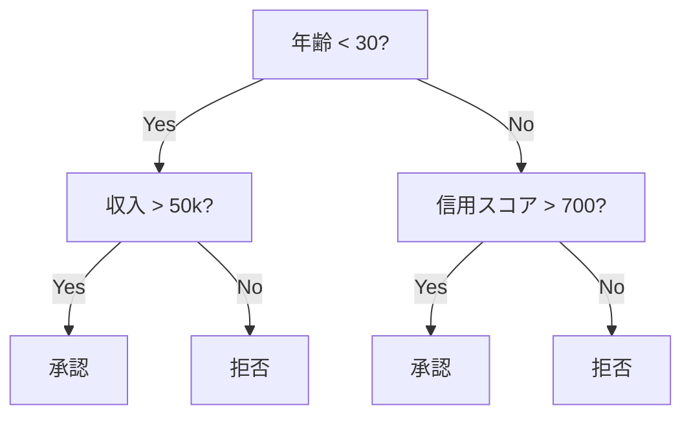
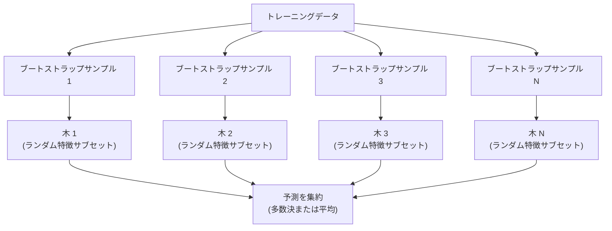

# 決定木とランダムフォレスト

> 決定木はただのフローチャートです。しかしその森は、MLの最強ツールの1つです。


## 学習目標

- ジニ不純度、エントロピー、情報利得の計算を実装して、決定木の最適な分割を見つけられる
- 事前剪定制御（最大深さ、最小サンプル数）を持つ決定木分類器をゼロから構築できる
- ブートストラップサンプリングと特徴ランダム化を使ったランダムフォレストを構築し、なぜバリアンスを低減するかを説明できる
- MDI特徴重要度と置換重要度を比較し、MDIがバイアスを持つ場合を特定できる

## 問題

表形式のデータがあります。行がサンプル、列が特徴で、予測したいターゲット列があります。ニューラルネットワークを使うこともできますが、表形式データでは木ベースのモデル（決定木、ランダムフォレスト、勾配ブースト木）が常にディープラーニングを凌駕します。構造化データのKaggleコンペはトランスフォーマーではなく、XGBoostとLightGBMが席巻しています。

なぜか？木は前処理なしに混合特徴タイプ（数値とカテゴリカル）を扱います。特徴エンジニアリングなしに非線形関係を扱います。解釈可能です: 木を見れば予測が行われた正確な理由がわかります。ランダムフォレストは多数の木を平均し、中規模データセットでの過学習に対して高い耐性を持ちます。

このレッスンでは再帰的分割を使って決定木をゼロから構築し、その上にランダムフォレストを構築します。分割基準の背後にある数学（ジニ不純度、エントロピー、情報利得）を実装し、弱い学習器のアンサンブルがなぜ強くなるかを理解します。

## 概念

### 決定木が行うこと

決定木は一連のイエス・ノー質問によって特徴空間を長方形領域に分割します。



各内部ノードは特徴を閾値に対してテストします。各葉ノードが予測を行います。新しいデータポイントを分類するには、ルートから始めて葉に達するまで枝をたどります。

木はトップダウンで構築され、各ノードでデータを最も良く分離する特徴と閾値を選びます。「最も良く」は分割基準によって定義されます。

### 分割基準: 不純度の測定

各ノードでサンプルのセットがあります。結果の子ノードができるだけ「純粋」になるように分割したい（各子ノードがほとんど1つのクラスを含む）。

**ジニ不純度**は、そのノードでのクラス分布に従ってラベル付けされた場合に、ランダムに選ばれたサンプルが誤分類される確率を測定します。

```
Gini(S) = 1 - sum(p_k^2)

ここでp_kはセットSにおけるクラスkの割合。
```

純粋なノード（すべて1クラス）の場合、ジニ = 0。二値分割で50/50クラスの場合、ジニ = 0.5。低い方が良い。

```
例: 猫6匹、犬4匹

Gini = 1 - (0.6^2 + 0.4^2) = 1 - (0.36 + 0.16) = 0.48
```

**エントロピー**はノードの情報量（無秩序度）を測定します。フェーズ1 レッスン09でカバーされています。

```
Entropy(S) = -sum(p_k * log2(p_k))
```

純粋なノードの場合、エントロピー = 0。二値分割で50/50の場合、エントロピー = 1.0。低い方が良い。

```
例: 猫6匹、犬4匹

Entropy = -(0.6 * log2(0.6) + 0.4 * log2(0.4))
        = -(0.6 * -0.737 + 0.4 * -1.322)
        = 0.442 + 0.529
        = 0.971 ビット
```

**情報利得**は分割後の不純度（エントロピーまたはジニ）の削減です。

```
IG(S, feature, threshold) = Impurity(S) - weighted_avg(Impurity(S_left), Impurity(S_right))

重みは各子の中のサンプルの割合です。
```

各ノードでのグリーディアルゴリズム: すべての特徴とすべての可能な閾値を試す。情報利得を最大化する（特徴、閾値）ペアを選ぶ。

### 分割の仕組み

現在のノードにn個の特徴とm個のサンプルがあるデータセットの場合:

1. 各特徴j（j = 1 から n）について:
   - 特徴jでサンプルをソートする
   - 連続する異なる値の間のすべての中点を閾値として試す
   - 各閾値の情報利得を計算する
2. 最も高い情報利得を持つ特徴と閾値を選ぶ
3. データを左（特徴 <= 閾値）と右（特徴 > 閾値）に分割する
4. 各子で再帰する

このグリーディアプローチは大域的に最適な木を保証しません。最適な木を見つけることはNP困難です。しかしグリーディ分割は実践でうまく機能します。

### 停止条件

停止条件なしでは、木はすべての葉が純粋になるまで成長します（1サンプル/葉）。これはトレーニングデータを完全に記憶しますが、汎化は非常に悪くなります。

**事前剪定**は木が完全に成長する前に停止します:
- 最大深さ: 木が設定した深さに達したら分割を停止する
- 葉あたりの最小サンプル数: ノードがk個未満のサンプルを持つ場合に停止
- 最小情報利得: 最良分割が不純度を閾値以下しか改善しない場合に停止
- 最大葉ノード数: 葉の総数を制限する

**事後剪定**は完全な木を成長させてから刈り込みます:
- コスト複雑度剪定（scikit-learnが使用）: 葉の数に比例したペナルティを追加する。ペナルティを増やすとより小さな木になる
- 削減誤差剪定: バリデーション誤差が増加しない場合にサブツリーを削除する

事前剪定はシンプルで速い。事後剪定はしばしばより良い木を生成します。有用なさらなる分割につながる可能性がある分割を早期に停止しないからです。

### 回帰の決定木

回帰の場合、葉の予測はその葉のターゲット値の平均です。分割基準も変わります:

**分散削減**が情報利得に取って代わります:

```
VR(S, feature, threshold) = Var(S) - weighted_avg(Var(S_left), Var(S_right))
```

分散を最も削減する分割を選びます。木は入力空間を領域に分割し、各領域で定数（平均）を予測します。

### ランダムフォレスト: アンサンブルの力

単一の決定木は高バリアンスです。データの小さな変化が完全に異なる木を生成することがあります。ランダムフォレストは多くの木を平均することでこれを解決します。



木を多様にする2つのランダム性の源があります:

**バギング（ブートストラップ集約）:** 各木はブートストラップサンプル（トレーニングデータからの重複ありランダムサンプル）でトレーニングされます。元のサンプルの約63%が各ブートストラップに現れます（残りはアウトオブバッグサンプルでバリデーションに使用できます）。

**特徴ランダム化:** 各分割で、特徴のランダムなサブセットのみが考慮されます。分類のデフォルトはsqrt(n_features)。回帰ではn_features/3。これにより、すべての木が同じ支配的な特徴で分割されるのを防ぎます。

重要な洞察: 多くの無相関な木を平均することで、バイアスを増やさずにバリアンスが削減されます。個々の木は平凡かもしれません。アンサンブルは強い。

### 特徴重要度

ランダムフォレストは自然に特徴重要度スコアを提供します。最も一般的な方法:

**平均不純度減少（MDI）:** 各特徴について、その特徴が使用されるすべての木とすべてのノードにわたる不純度の総削減量を合計します。早期の分割でより大きな不純度削減をもたらす特徴の方が重要です。

```
importance(feature_j) = feature_jが使用されるすべてのノードにわたる合計:
    (ノードのサンプル数 / 総サンプル数) * 不純度の減少
```

これは高速（トレーニング中に計算）ですが、高カーディナリティの特徴や多くの可能な分割点を持つ特徴に向けてバイアスがあります。

**置換重要度**は代替です: 1つの特徴の値をシャッフルして、モデルの精度がどれだけ落ちるかを測定します。より信頼性が高いですが遅い。

### 木がニューラルネットワークを打ち破る場合

木とフォレストは表形式データではニューラルネットワークを支配します。いくつかの理由があります:

| 要因 | 木 | ニューラルネットワーク |
|------|---|---------------|
| 混合タイプ（数値 + カテゴリカル） | ネイティブサポート | エンコーディングが必要 |
| 小さなデータセット（< 1万行） | うまく機能 | 過学習 |
| 特徴の相互作用 | 分割で発見 | アーキテクチャ設計が必要 |
| 解釈可能性 | 完全な透明性 | ブラックボックス |
| トレーニング時間 | 分単位 | 時間単位 |
| ハイパーパラメータ感度 | 低 | 高 |

ニューラルネットワークはデータに空間的または順序的な構造がある場合（画像、テキスト、音声）に勝ります。特徴の平坦なテーブルにはデフォルトで木を使います。

## 実装する

### ステップ1: ジニ不純度とエントロピー

両方の分割基準をゼロから構築し、どの分割が良いかについて一致するか確認します。

```python
import math

def gini_impurity(labels):
    n = len(labels)
    if n == 0:
        return 0.0
    counts = {}
    for label in labels:
        counts[label] = counts.get(label, 0) + 1
    return 1.0 - sum((c / n) ** 2 for c in counts.values())

def entropy(labels):
    n = len(labels)
    if n == 0:
        return 0.0
    counts = {}
    for label in labels:
        counts[label] = counts.get(label, 0) + 1
    return -sum(
        (c / n) * math.log2(c / n) for c in counts.values() if c > 0
    )
```

### ステップ2: 最良分割を見つける

すべての特徴とすべての閾値を試す。最も高い情報利得を持つものを返す。

```python
def information_gain(parent_labels, left_labels, right_labels, criterion="gini"):
    measure = gini_impurity if criterion == "gini" else entropy
    n = len(parent_labels)
    n_left = len(left_labels)
    n_right = len(right_labels)
    if n_left == 0 or n_right == 0:
        return 0.0
    parent_impurity = measure(parent_labels)
    child_impurity = (
        (n_left / n) * measure(left_labels) +
        (n_right / n) * measure(right_labels)
    )
    return parent_impurity - child_impurity
```

### ステップ3: DecisionTreeクラスの構築

再帰的分割、予測、特徴重要度の追跡。

```python
class DecisionTree:
    def __init__(self, max_depth=None, min_samples_split=2,
                 min_samples_leaf=1, criterion="gini",
                 max_features=None):
        self.max_depth = max_depth
        self.min_samples_split = min_samples_split
        self.min_samples_leaf = min_samples_leaf
        self.criterion = criterion
        self.max_features = max_features
        self.tree = None
        self.feature_importances_ = None

    def fit(self, X, y):
        self.n_features = len(X[0])
        self.feature_importances_ = [0.0] * self.n_features
        self.n_samples = len(X)
        self.tree = self._build(X, y, depth=0)
        total = sum(self.feature_importances_)
        if total > 0:
            self.feature_importances_ = [
                fi / total for fi in self.feature_importances_
            ]

    def predict(self, X):
        return [self._predict_one(x, self.tree) for x in X]
```

### ステップ4: RandomForestクラスの構築

ブートストラップサンプリング、特徴ランダム化、多数決。

```python
class RandomForest:
    def __init__(self, n_trees=100, max_depth=None,
                 min_samples_split=2, max_features="sqrt",
                 criterion="gini"):
        self.n_trees = n_trees
        self.max_depth = max_depth
        self.min_samples_split = min_samples_split
        self.max_features = max_features
        self.criterion = criterion
        self.trees = []

    def fit(self, X, y):
        n = len(X)
        for _ in range(self.n_trees):
            indices = [random.randint(0, n - 1) for _ in range(n)]
            X_boot = [X[i] for i in indices]
            y_boot = [y[i] for i in indices]
            tree = DecisionTree(
                max_depth=self.max_depth,
                min_samples_split=self.min_samples_split,
                max_features=self.max_features,
                criterion=self.criterion,
            )
            tree.fit(X_boot, y_boot)
            self.trees.append(tree)

    def predict(self, X):
        all_preds = [tree.predict(X) for tree in self.trees]
        predictions = []
        for i in range(len(X)):
            votes = {}
            for preds in all_preds:
                v = preds[i]
                votes[v] = votes.get(v, 0) + 1
            predictions.append(max(votes, key=votes.get))
        return predictions
```

すべてのヘルパーメソッドを含む完全な実装は `code/trees.py` を参照してください。

## 使ってみる

scikit-learnでは、ランダムフォレストのトレーニングは3行です:

```python
from sklearn.ensemble import RandomForestClassifier
from sklearn.datasets import load_iris
from sklearn.model_selection import train_test_split

X, y = load_iris(return_X_y=True)
X_train, X_test, y_train, y_test = train_test_split(X, y, random_state=42)

rf = RandomForestClassifier(n_estimators=100, random_state=42)
rf.fit(X_train, y_train)
print(f"Accuracy: {rf.score(X_test, y_test):.4f}")
print(f"Feature importances: {rf.feature_importances_}")
```

実際には、勾配ブースト木（XGBoost、LightGBM、CatBoost）はしばしばランダムフォレストより強力です。木を順次構築し、各木が前の木の誤差を修正するからです。しかしランダムフォレストは設定ミスがしにくく、ハイパーパラメータのチューニングをほとんど必要としません。

## 成果物を出す

このレッスンでは `outputs/prompt-tree-interpreter.md` を生成します。これは決定木の分割をビジネスステークホルダー向けに解釈するプロンプトです。トレーニングされた木の構造（深さ、特徴、分割閾値、精度）を与えると、モデルをわかりやすい言葉のルールに変換し、特徴重要度をランク付けし、過学習やリークにフラグを立て、次のステップを推奨します。コードを読まない人に木ベースモデルを説明する必要があるときに使います。

## 演習

1. 3クラスの2Dデータセットに単一の決定木をトレーニングする。分割を手動でたどり、長方形の決定境界を描く。max_depth=2とmax_depth=10での境界を比較する。

2. 回帰木の分散削減分割を実装する。200点に対して y = sin(x) + ノイズを生成し、回帰木を当てはめる。木の区分定数予測を真の曲線に対してプロットする。

3. 1、5、10、50、200本の木でランダムフォレストを構築する。木の数に対するトレーニング精度とテスト精度をプロットする。テスト精度がプラトーに達するが低下しないことを観察する（フォレストは過学習に抵抗する）。

4. 5つの異なるデータセットでジニ不純度とエントロピーを分割基準として比較する。精度と木の深さを測定する。ほとんどの場合、ほぼ同一の結果を生成する。なぜかを説明せよ。

5. 置換重要度を実装する。MDI重要度と、1つの特徴がランダムノイズだが高カーディナリティのデータセットで比較する。MDIはノイズ特徴を高くランク付けする。置換重要度はそうしない。

## キーワード

| 用語 | よく言われること | 実際の意味 |
|------|--------------|-----------|
| 決定木 | 「予測のフローチャート」 | 一連のif/else分割を学習することで特徴空間を長方形領域に分割するモデル |
| ジニ不純度 | 「ノードがどれだけ混在しているか」 | ノードでランダムサンプルを誤分類する確率。0 = 純粋、二値の最大不純度 = 0.5 |
| エントロピー | 「ノードの無秩序度」 | ノードでの情報量。0 = 純粋、二値の最大不確実性 = 1.0。情報理論から |
| 情報利得 | 「分割の良さ」 | 分割後の不純度削減。分割を選ぶためのグリーディ基準 |
| 事前剪定 | 「早めに木を止める」 | 最大深さ、最小サンプル数、最小利得閾値を設定して早期に木の成長を停止 |
| 事後剪定 | 「後から木を刈り込む」 | 完全な木を成長させてから、バリデーション性能を改善しないサブツリーを削除 |
| バギング | 「ランダムサブセットでトレーニング」 | ブートストラップ集約。各モデルを重複ありランダムサンプルで異なるデータでトレーニング |
| ランダムフォレスト | 「木の集まり」 | 各分割でブートストラップサンプルとランダム特徴サブセットでトレーニングされた決定木のアンサンブル |
| 特徴重要度（MDI） | 「どの特徴が重要か」 | すべての木とノードにわたって各特徴が提供した総不純度減少 |
| 置換重要度 | 「シャッフルして確認」 | 特徴の値がランダムにシャッフルされたときの精度の低下。ノイズの多い特徴にはMDIより信頼性が高い |
| 分散削減 | 「情報利得の回帰版」 | 情報利得の回帰木アナログ。ターゲット分散を最も削減する分割を選ぶ |
| ブートストラップサンプル | 「重複ありランダムサンプル」 | 元のデータセットから重複ありで引かれたランダムサンプル。同じサイズだが重複あり |

## 参考資料

- [Breiman: Random Forests (2001)](https://link.springer.com/article/10.1023/A:1010933404324) - 元のランダムフォレスト論文
- [Grinsztajn et al.: Why do tree-based models still outperform deep learning on tabular data? (2022)](https://arxiv.org/abs/2207.08815) - 表形式タスクでの木とニューラルネットワークの厳密な比較
- [scikit-learn 決定木ドキュメント](https://scikit-learn.org/stable/modules/tree.html) - 可視化ツール付きの実践ガイド
- [XGBoost: A Scalable Tree Boosting System (Chen & Guestrin, 2016)](https://arxiv.org/abs/1603.02754) - Kaggleを支配する勾配ブースティング論文
