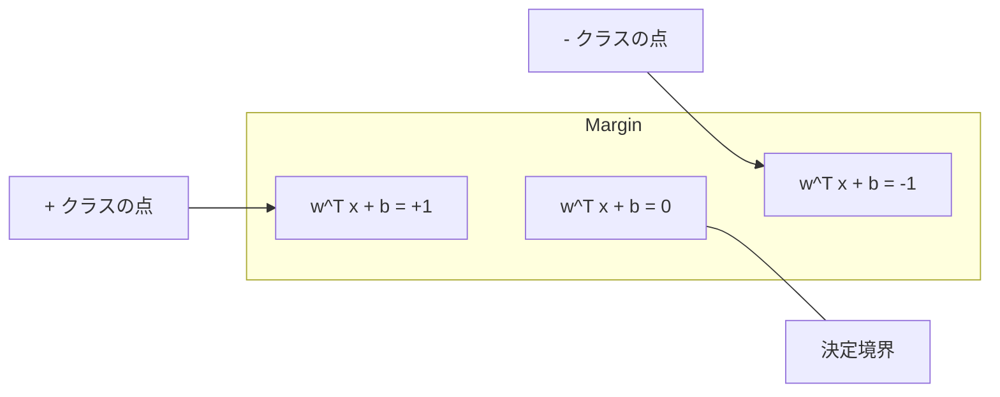
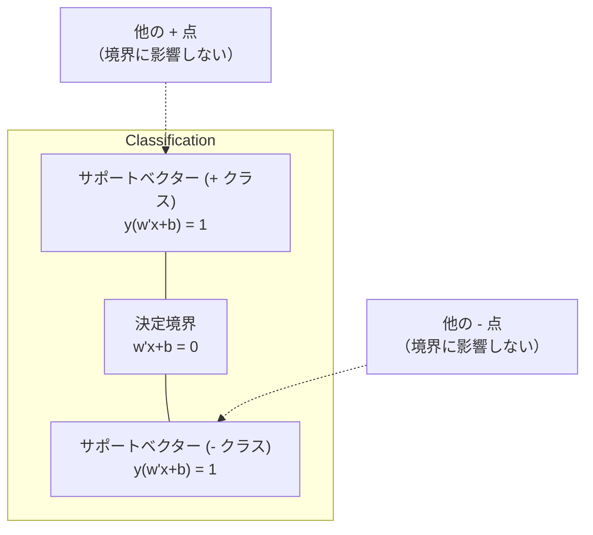
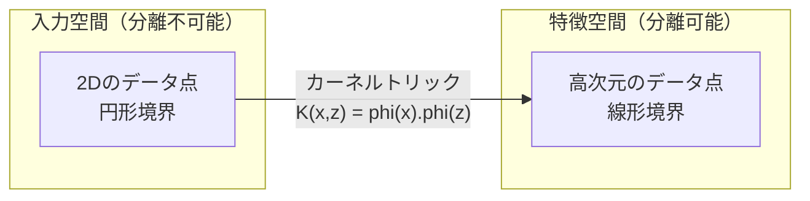

# サポートベクターマシン

> 2つのクラスの間に最も広い「道」を見つけよ。それがすべてのアイデアです。


## 学習目標

- ヒンジ損失と主問題の勾配降下法を使って線形SVMをゼロから実装できる
- 最大マージン原理を説明し、トレーニング済みモデルからサポートベクターを特定できる
- 線形、多項式、RBFカーネルを比較し、カーネルトリックが明示的な高次元マッピングを回避する仕組みを説明できる
- マージン幅と分類誤差のトレードオフを制御するCパラメータを評価できる

## 問題

2つのクラスのデータポイントがあり、それらを分離する直線（または超平面）を引く必要があります。無限に多くの直線が機能する可能性があります。どれを選ぶべきか？

最も大きなマージンを持つものです。マージンは決定境界と各側の最も近いデータポイントの間の距離です。より広いマージンは分類器がより自信を持ち、未見データにより良く汎化することを意味します。

この直感がサポートベクターマシン（SVM）につながります。MLの中で数学的に最も優雅なアルゴリズムの1つです。SVMはディープラーニング以前の主要な分類手法であり、小さなデータセット、高次元データ、理論的保証を持つ原則的な理解されたモデルが必要な問題に対しては依然として最良の選択です。

SVMはフェーズ1と直接つながります: 最適化は凸（レッスン18）で、マージンはノルムで測定され（レッスン14）、カーネルトリックは高次元空間を明示的に計算することなくドット積を利用して非線形境界を扱います。

## 概念

### 最大マージン分類器

{-1, +1}のラベルy_iと特徴ベクトルx_iを持つ線形分離可能なデータに対して、クラスを分離する超平面 w^T x + b = 0 を求めます。

点x_iから超平面までの距離は:

```
distance = |w^T x_i + b| / ||w||
```

正しく分類された点の場合: y_i * (w^T x_i + b) > 0。マージンは超平面から各側の最も近い点までの距離の2倍です。



最適化問題:

```
最大化    2 / ||w||     (マージン幅)
制約      y_i * (w^T x_i + b) >= 1  すべてのiについて
```

等価的に（||w||^2の最小化の方が最適化しやすい）:

```
最小化    (1/2) ||w||^2
制約      y_i * (w^T x_i + b) >= 1  すべてのiについて
```

これは凸二次計画問題です。一意の大域的解があります。マージン境界上に正確に位置するデータポイント（y_i * (w^T x_i + b) = 1のもの）がサポートベクターです。決定境界を決定する唯一の点です。サポートベクターでない点を動かしたり削除したりしても、境界は変わりません。

### サポートベクター: 少数の決定的な点



ほとんどのトレーニング点は無関係です。重要なのはサポートベクターだけです。これがSVMが予測時にメモリ効率が良い理由です: トレーニングセット全体ではなく、サポートベクターだけを保存する必要があります。

サポートベクターの数は汎化誤差の境界も与えます。データセットサイズに対してサポートベクターが少ないほど、より良い汎化を意味します。

### ソフトマージン: Cパラメータによるノイズの処理

現実のデータはめったに完全に分離可能ではありません。一部の点が境界の誤った側、またはマージン内にある可能性があります。ソフトマージン定式化はスラック変数を導入することで違反を許容します。

```
最小化    (1/2) ||w||^2 + C * sum(xi_i)
制約      y_i * (w^T x_i + b) >= 1 - xi_i
          xi_i >= 0  すべてのiについて
```

スラック変数xi_iは点iがマージンをどれだけ違反するかを測定します。Cはトレードオフを制御します:

| Cの値 | 挙動 |
|-------|------|
| 大きいC | 違反を重く罰する。狭いマージン、少ない誤分類。過学習 |
| 小さいC | より多くの違反を許容。広いマージン、多い誤分類。未学習 |

Cは正則化強度で、逆転しています。大きいC = 少ない正則化。小さいC = 多い正則化。

### ヒンジ損失: SVM損失関数

ソフトマージンSVMは制約なし最適化として書き直せます:

```
最小化    (1/2) ||w||^2 + C * sum(max(0, 1 - y_i * (w^T x_i + b)))
```

max(0, 1 - y_i * f(x_i))という項がヒンジ損失です。点が正しく分類されマージンの外にある場合はゼロ。マージン内または誤分類の場合は線形です。

```
1点のヒンジ損失:

損失
  |
  | \
  |  \
  |   \
  |    \
  |     \_______________
  |
  +-----|-----|-------->  y * f(x)
       0     1

y*f(x) >= 1のとき（正しく分類されマージン外）損失はゼロ。
y*f(x) < 1のとき線形ペナルティ。
```

ロジスティック損失（ロジスティック回帰）との比較:

```
ヒンジ:     max(0, 1 - y*f(x))          マージンでのハードカットオフ
ロジスティック: log(1 + exp(-y*f(x)))    滑らか、厳密にはゼロにならない
```

ヒンジ損失はスパース解を生成します（サポートベクターのみが非ゼロの寄与を持つ）。ロジスティック損失はすべてのデータ点を使います。これによりSVMは予測時のメモリ効率が高くなります。

### 勾配降下法による線形SVMのトレーニング

制約付き二次計画法を解かずに、ヒンジ損失とL2正則化の勾配降下法を使って線形SVMをトレーニングできます:

```
L(w, b) = (lambda/2) * ||w||^2 + (1/n) * sum(max(0, 1 - y_i * (w^T x_i + b)))

wに関する勾配:
  y_i * (w^T x_i + b) >= 1の場合:  dL/dw = lambda * w
  y_i * (w^T x_i + b) < 1の場合:   dL/dw = lambda * w - y_i * x_i

bに関する勾配:
  y_i * (w^T x_i + b) >= 1の場合:  dL/db = 0
  y_i * (w^T x_i + b) < 1の場合:   dL/db = -y_i
```

これは主問題定式化と呼ばれます。エポックあたりO(n * d)で動作し、nはサンプル数、dは特徴数。大規模でスパースな高次元データ（テキスト分類）に対して高速です。

### 双対定式化とカーネルトリック

SVM問題のラグランジュ双対（フェーズ1 レッスン18、KKT条件）は:

```
最大化    sum(alpha_i) - (1/2) * sum_ij(alpha_i * alpha_j * y_i * y_j * (x_i . x_j))
制約      0 <= alpha_i <= C
          sum(alpha_i * y_i) = 0
```

双対はデータポイント間のドット積 x_i . x_j にのみ依存します。これが重要な洞察です。すべてのドット積をカーネル関数K(x_i, x_j)に置き換えると、SVMは変換を明示的に計算することなく非線形境界を学習できます。

```
線形カーネル:      K(x, z) = x . z
多項式カーネル:  K(x, z) = (x . z + c)^d
RBF（ガウシアン）: K(x, z) = exp(-gamma * ||x - z||^2)
```

RBFカーネルはデータを無限次元空間にマッピングします。入力空間で近い点は1に近いカーネル値を持ちます。遠い点は0に近いカーネル値を持ちます。任意の滑らかな決定境界を学習できます。



カーネルトリックは、高次元空間に行くことなく、その空間でのドット積を計算します。D次元でd次の多項式カーネルの明示的特徴空間はO(D^d)次元を持ちます。しかしK(x, z)はO(D)時間で計算されます。

### 回帰のためのSVM（SVR）

サポートベクター回帰はデータの周りにイプシロン幅のチューブを当てはめます。チューブ内の点は損失ゼロ。チューブ外の点は線形にペナルティを受けます。

```
最小化    (1/2) ||w||^2 + C * sum(xi_i + xi_i*)
制約      y_i - (w^T x_i + b) <= epsilon + xi_i
          (w^T x_i + b) - y_i <= epsilon + xi_i*
          xi_i, xi_i* >= 0
```

epsilonパラメータがチューブ幅を制御します。より広いチューブ = 少ないサポートベクター = 滑らかなフィット。より狭いチューブ = 多いサポートベクター = タイトなフィット。

### SVMがディープラーニングに負けた理由（そして依然として勝つ場合）

SVMは1990年代後半から2010年代初頭まで機械学習を支配していました。ディープラーニングがいくつかの理由でそれを上回りました:

| 要因 | SVM | ディープラーニング |
|------|-----|------------|
| 特徴エンジニアリング | 必要 | 特徴を学習 |
| スケーラビリティ | カーネルにO(n^2)〜O(n^3) | SGDでエポックあたりO(n) |
| 画像/テキスト/音声 | 手作りの特徴が必要 | 生データから学習 |
| 大規模データセット（>10万） | 遅い | よくスケールする |
| GPU加速 | 限られた恩恵 | 大規模なスピードアップ |

SVMはこれらの状況では依然として勝ります:
- 小さなデータセット（数百から数千のサンプル）
- 高次元スパースデータ（TF-IDF特徴を持つテキスト）
- 数学的保証が必要な場合（マージン境界）
- トレーニング時間を最小化する必要がある場合（線形SVMは非常に速い）
- 明確なマージン構造を持つ二値分類
- 異常検出（ワンクラスSVM）

## 実装する

### ステップ1: ヒンジ損失と勾配

基礎。バッチのヒンジ損失とその勾配を計算します。

```python
def hinge_loss(X, y, w, b):
    n = len(X)
    total_loss = 0.0
    for i in range(n):
        margin = y[i] * (dot(w, X[i]) + b)
        total_loss += max(0.0, 1.0 - margin)
    return total_loss / n
```

### ステップ2: 勾配降下法による線形SVM

正則化されたヒンジ損失の最小化によるトレーニング。二次計画法ソルバー不要。

```python
class LinearSVM:
    def __init__(self, lr=0.001, lambda_param=0.01, n_epochs=1000):
        self.lr = lr
        self.lambda_param = lambda_param
        self.n_epochs = n_epochs
        self.w = None
        self.b = 0.0

    def fit(self, X, y):
        n_features = len(X[0])
        self.w = [0.0] * n_features
        self.b = 0.0

        for epoch in range(self.n_epochs):
            for i in range(len(X)):
                margin = y[i] * (dot(self.w, X[i]) + self.b)
                if margin >= 1:
                    self.w = [wj - self.lr * self.lambda_param * wj
                              for wj in self.w]
                else:
                    self.w = [wj - self.lr * (self.lambda_param * wj - y[i] * X[i][j])
                              for j, wj in enumerate(self.w)]
                    self.b -= self.lr * (-y[i])

    def predict(self, X):
        return [1 if dot(self.w, x) + self.b >= 0 else -1 for x in X]
```

### ステップ3: カーネル関数

線形、多項式、RBFカーネルを実装します。

```python
def linear_kernel(x, z):
    return dot(x, z)

def polynomial_kernel(x, z, degree=3, c=1.0):
    return (dot(x, z) + c) ** degree

def rbf_kernel(x, z, gamma=0.5):
    diff = [xi - zi for xi, zi in zip(x, z)]
    return math.exp(-gamma * dot(diff, diff))
```

### ステップ4: マージンとサポートベクターの特定

トレーニング後、どの点がサポートベクターかを特定してマージン幅を計算します。

```python
def find_support_vectors(X, y, w, b, tol=1e-3):
    support_vectors = []
    for i in range(len(X)):
        margin = y[i] * (dot(w, X[i]) + b)
        if abs(margin - 1.0) < tol:
            support_vectors.append(i)
    return support_vectors
```

すべてのデモを含む完全な実装は `code/svm.py` を参照してください。

## 使ってみる

scikit-learnで:

```python
from sklearn.svm import SVC, LinearSVC, SVR
from sklearn.preprocessing import StandardScaler
from sklearn.pipeline import Pipeline

clf = Pipeline([
    ("scaler", StandardScaler()),
    ("svm", SVC(kernel="rbf", C=1.0, gamma="scale")),
])
clf.fit(X_train, y_train)
print(f"Accuracy: {clf.score(X_test, y_test):.4f}")
print(f"Support vectors: {clf['svm'].n_support_}")
```

重要: SVMをトレーニングする前に必ず特徴をスケーリングしてください。SVMは特徴の大きさに敏感です。マージンは||w||に依存するため、スケールされていない特徴が幾何学を歪めます。

大きなデータセットには、`SVC`（双対定式化、O(n^2)〜O(n^3)）の代わりに`LinearSVC`（主問題定式化、エポックあたりO(n)）を使います:

```python
from sklearn.svm import LinearSVC

clf = Pipeline([
    ("scaler", StandardScaler()),
    ("svm", LinearSVC(C=1.0, max_iter=10000)),
])
```

## 演習

1. 2D線形分離可能なデータセットを生成する。LinearSVMをトレーニングしてサポートベクターを特定する。サポートベクターが決定境界に最も近い点であることを検証せよ。

2. ノイズの多いデータセットでCを0.001から1000まで変化させる。各C値の決定境界をプロットする。広いマージン（未学習）から狭いマージン（過学習）への遷移を観察する。

3. クラス境界が円形（線形でない）のデータセットを作成する。線形SVMが失敗することを示す。RBFカーネル行列を計算して、クラスがカーネル誘導特徴空間で分離可能になることを示す。

4. 同じデータセットでヒンジ損失とロジスティック損失を比較する。線形SVMとロジスティック回帰をトレーニングする。各モデルの決定境界に寄与するトレーニング点の数を数える（サポートベクター対すべての点）。

5. SVR（イプシロン非感受損失）を実装する。y = sin(x) + ノイズに当てはめる。予測の周りのイプシロンチューブをプロットし、サポートベクター（チューブ外の点）をハイライトする。

## キーワード

| 用語 | 実際の意味 |
|------|-----------|
| サポートベクター | 決定境界に最も近いトレーニング点。超平面を決定する唯一の点 |
| マージン | 決定境界と最も近いサポートベクターの間の距離。SVMはこれを最大化する |
| ヒンジ損失 | max(0, 1 - y*f(x))。正しく分類されマージン外の場合ゼロ。それ以外は線形ペナルティ |
| Cパラメータ | マージン幅と分類誤差のトレードオフ。大きいC = 狭いマージン、小さいC = 広いマージン |
| ソフトマージン | スラック変数によるマージン違反を許容するSVM定式化。分離不可能なデータを扱う |
| カーネルトリック | 高次元特徴空間に明示的にマッピングせずにその空間でのドット積を計算する |
| 線形カーネル | K(x, z) = x . z。標準的なドット積と等価。線形分離可能なデータ用 |
| RBFカーネル | K(x, z) = exp(-gamma * \|\|x-z\|\|^2)。無限次元にマッピング。任意の滑らかな境界を学習 |
| 多項式カーネル | K(x, z) = (x . z + c)^d。多項式の組み合わせの特徴空間にマッピング |
| 双対定式化 | データポイント間のドット積のみに依存するSVM問題の再定式化。カーネルを可能にする |
| SVR | サポートベクター回帰。データの周りにイプシロンチューブを当てはめる。チューブ内の点は損失ゼロ |
| スラック変数 | xi_i: 点がどれだけマージンに違反するかを測定。マージン外の正しく分類された点にはゼロ |
| 最大マージン | 各クラスの最も近い点までの距離を最大化する超平面を選ぶ原則 |

## 参考資料

- [Vapnik: The Nature of Statistical Learning Theory (1995)](https://link.springer.com/book/10.1007/978-1-4757-3264-1) - SVMと統計的学習の基礎テキスト
- [Cortes & Vapnik: Support-vector networks (1995)](https://link.springer.com/article/10.1007/BF00994018) - 元のSVM論文
- [Platt: Sequential Minimal Optimization (1998)](https://www.microsoft.com/en-us/research/publication/sequential-minimal-optimization-a-fast-algorithm-for-training-support-vector-machines/) - SVMトレーニングを実用的にしたSMOアルゴリズム
- [scikit-learn SVMドキュメント](https://scikit-learn.org/stable/modules/svm.html) - 実装の詳細を含む実践ガイド
- [LIBSVM: A Library for Support Vector Machines](https://www.csie.ntu.edu.tw/~cjlin/libsvm/) - ほとんどのSVM実装の背後にあるC++ライブラリ
