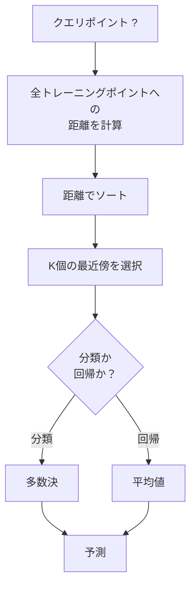
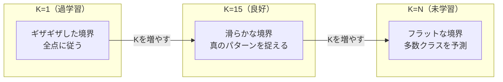
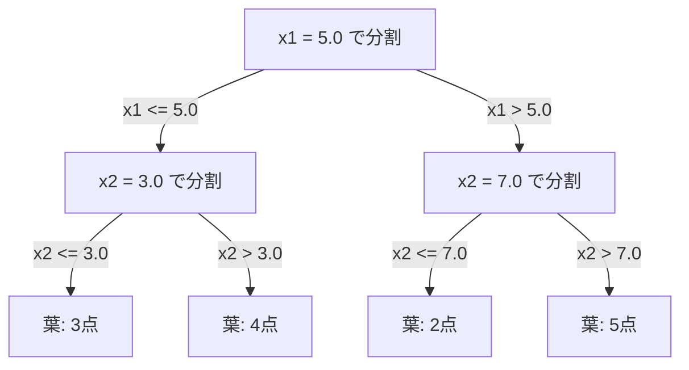

# K近傍法と距離

> すべてを保存する。隣人を見て予測する。実際に機能する最もシンプルなアルゴリズム。


## 学習目標

- 設定可能なKと距離加重投票を持つKNN分類と回帰をゼロから実装できる
- L1、L2、コサイン、ミンコフスキー距離指標を比較し、与えられたデータタイプに適したものを選択できる
- 次元の呪いを説明し、高次元空間でKNNが劣化する理由を示せる
- 効率的な最近傍探索のためのKDツリーを構築し、ブルートフォースより優れるタイミングを分析できる

## 問題

データセットがあります。新しいデータポイントが来ます。それを分類するか値を予測する必要があります。線形回帰やSVMのようにデータからパラメータを学習する代わりに、単に新しいポイントに最も近いKつのトレーニングポイントを見つけ、それらに投票させます。

これがK近傍法（KNN）です。トレーニングフェーズはありません。学習するパラメータもありません。最小化する損失関数もありません。トレーニングセット全体を保存し、予測時に距離を計算します。

機能するには単純すぎるように思えます。しかしKNNは多くの問題、特に小から中規模のデータセットに対して驚くほど競争力があります。そして深く理解することで基本的な概念が明らかになります: 距離指標の選択（フェーズ1 レッスン14とつながる）、次元の呪い、怠惰学習と熱心学習の違いです。

KNNはまた、現代のAIの至る所に現れますが、別の名前で知られています。ベクターデータベースはEmbeddingに対してKNN検索を行います。RAG（検索拡張生成）は最も近いKつの文書チャンクを見つけます。推薦システムは似たユーザーやアイテムを見つけます。アルゴリズムは同じです。スケールとデータ構造が異なるだけです。

## 概念

### KNNの仕組み

ラベル付きポイントのデータセットと新しいクエリポイントが与えられた場合:

1. クエリからデータセットのすべてのポイントへの距離を計算する
2. 距離でソートする
3. 最も近いKつのポイントを取る
4. 分類の場合: K近傍間の多数決
5. 回帰の場合: K近傍の値の平均（または加重平均）



これがアルゴリズム全体です。フィッティングなし。勾配降下法なし。エポックなし。

### Kの選び方

Kは唯一のハイパーパラメータです。バイアスと分散のトレードオフを制御します:

| K | 挙動 |
|---|------|
| K = 1 | 決定境界はすべての点に従う。トレーニング誤差ゼロ。高い分散。過学習 |
| 小さいK (3-5) | ローカル構造に敏感。複雑な境界を捉えられる |
| 大きいK | 滑らかな境界。ノイズに対してより頑健。未学習の可能性 |
| K = N | すべての点で多数クラスを予測。最大バイアス |

N点のデータセットに対して K = sqrt(N) がよくある出発点です。同数票を避けるために二値分類では奇数のKを使います。



### 距離指標

距離関数は「近い」の意味を定義します。異なる指標は異なる近傍、異なる予測を生み出します。

**L2（ユークリッド距離）** はデフォルトです。直線距離。

```
d(a, b) = sqrt(sum((a_i - b_i)^2))
```

特徴のスケールに敏感です。KNNでL2を使う前に必ず特徴を標準化してください。

**L1（マンハッタン距離）** は絶対差の和です。差を二乗しないのでL2より外れ値に頑健です。

```
d(a, b) = sum(|a_i - b_i|)
```

**コサイン距離** はベクトル間の角度を測定し、大きさを無視します。テキストとEmbeddingデータに必須です。

```
d(a, b) = 1 - (a . b) / (||a|| * ||b||)
```

**ミンコフスキー距離** はパラメータpでL1とL2を一般化します。

```
d(a, b) = (sum(|a_i - b_i|^p))^(1/p)

p=1: マンハッタン
p=2: ユークリッド
p->inf: チェビシェフ（最大絶対差）
```

どの指標を使うかはデータに依存します:

| データタイプ | 最適な指標 | 理由 |
|------------|----------|------|
| 数値特徴、同スケール | L2（ユークリッド） | デフォルト、空間データに機能する |
| 数値特徴、外れ値あり | L1（マンハッタン） | 頑健、大きな差を増幅しない |
| テキストEmbedding | コサイン | 大きさはノイズ、方向が意味 |
| 高次元スパース | コサインまたはL1 | L2は次元の呪いに苦しむ |
| 混合タイプ | カスタム距離 | 特徴タイプ別に指標を組み合わせる |

### 加重KNN

標準的なKNNはすべてのK近傍に等しい重みを与えます。しかし距離0.1の近傍は距離5.0の近傍より重要であるべきです。

**距離加重KNN** は各近傍を距離の逆数で重み付けします:

```
weight_i = 1 / (distance_i + epsilon)

分類の場合: 加重投票
回帰の場合: 加重平均 = sum(w_i * y_i) / sum(w_i)
```

epsilonはクエリポイントがトレーニングポイントと完全に一致する場合のゼロ除算を防ぎます。

加重KNNはKの選択に対して敏感でなくなります。なぜなら距離の遠い近傍はいずれにせよほとんど寄与しないためです。

### 次元の呪い

KNNの性能は高次元で劣化します。これは漠然とした懸念ではありません。数学的な事実です。

**問題1: 距離が収束する。** 次元が増加するにつれ、最大距離と最小距離の比が1に近づきます。すべての点がクエリから等しく「遠く」なります。

```
d次元において、ランダムな一様点に対して:

d=2:    max_dist / min_dist = 大きく変動
d=100:  max_dist / min_dist ~ 1.01
d=1000: max_dist / min_dist ~ 1.001

すべての距離がほぼ等しい場合、「最近傍」は意味を失う。
```

**問題2: 体積が爆発する。** データの固定された割合内にK近傍を捉えるためには、特徴空間のはるかに大きな割合をカバーするまで探索半径を拡大する必要があります。高次元の「近傍」は空間のほとんどを網羅します。

**問題3: 角が支配する。** d次元の単位超立方体では、体積のほとんどが中心ではなく角の付近に集中しています。立方体に内接する球が含む体積の割合はdが大きくなるにつれて消えていきます。

実際的な結果: KNNは約20〜50の特徴まではうまく機能します。それを超えると、KNNを適用する前に次元削減（PCA、UMAP、t-SNE）が必要です。あるいはデータの固有の低い次元を利用するツリーベースの探索構造を使う必要があります。

### KDツリー: 高速な最近傍探索

ブルートフォースKNNはクエリからすべてのトレーニングポイントへの距離を計算します。クエリあたりO(n * d)です。大きなデータセットでは遅すぎます。

KDツリーは特徴軸に沿って空間を再帰的に分割します。各レベルで中央値でひとつの次元に沿って分割します。



最近傍を見つけるには、クエリを含む葉にツリーを辿り、より近い点を含む可能性がある場合のみ隣接パーティションを確認しながらバックトラックします。

平均クエリ時間: 低次元でO(log n)。しかしKDツリーは高次元（d > 20）でO(n)に劣化します。なぜなバックトラッキングが枝をますます少なくしか除去できなくなるためです。

### ボールツリー: 中程度の次元に対してより良い

ボールツリーは軸に沿ったボックスの代わりに入れ子になった超球体でデータを分割します。各ノードはそのサブツリーのすべての点を含む球（中心+半径）を定義します。

KDツリーに対する利点:
- 中程度の次元（最大約50）でよりうまく機能する
- 軸に揃っていない構造を処理する
- タイトな境界ボリュームにより探索中により多くの枝が剪定される

KDツリーとボールツリーはどちらも厳密なアルゴリズムです。真に大規模な探索（数百万点、数百次元）では、近似最近傍法（HNSW、IVF、積量子化）が代わりに使われます。これらはフェーズ1 レッスン14でカバーされています。

### 怠惰学習と熱心学習

KNNは怠惰学習者です: トレーニング時に何も作業せず、予測時にすべての作業をします。ほとんどの他のアルゴリズム（線形回帰、SVM、ニューラルネットワーク）は熱心学習者です: トレーニング時に重い計算を行ってコンパクトなモデルを構築し、予測は高速です。

| 側面 | 怠惰（KNN） | 熱心（SVM、ニューラルネット） |
|------|------------|---------------------------|
| トレーニング時間 | O(1) データ保存のみ | O(n * epochs) |
| 予測時間 | クエリあたりO(n * d) | O(d)またはO(パラメータ数) |
| 予測時のメモリ | トレーニングセット全体を保存 | モデルパラメータのみ保存 |
| 新データへの適応 | 即座に点を追加 | モデルを再トレーニング |
| 決定境界 | 暗黙的、その場で計算 | 明示的、トレーニング後に固定 |

怠惰学習が理想的な場合:
- データセットが頻繁に変わる（再トレーニングなしに点を追加/削除）
- 非常に少ないクエリの予測が必要
- トレーニング時間をゼロにしたい
- ブルートフォース探索が速いほど小さいデータセット

### 回帰のためのKNN

多数決の代わりに、回帰のためのKNNはK近傍のターゲット値を平均します。

```
prediction = (1/K) * sum(y_i for i in K nearest neighbors)

または距離加重を使って:
prediction = sum(w_i * y_i) / sum(w_i)
where w_i = 1 / distance_i
```

KNN回帰は区分定数（加重あり区分滑らか）の予測を生成します。トレーニングデータの範囲を超えて外挿できません。トレーニングターゲットがすべて0から100の間なら、KNNは200を予測することはありません。

## 実装する

### ステップ1: 距離関数

基礎。L1、L2、コサイン、ミンコフスキー距離を実装します。フェーズ1 レッスン14と直接つながります。

```python
import math

def l2_distance(a, b):
    return math.sqrt(sum((ai - bi) ** 2 for ai, bi in zip(a, b)))

def l1_distance(a, b):
    return sum(abs(ai - bi) for ai, bi in zip(a, b))

def cosine_distance(a, b):
    dot_val = sum(ai * bi for ai, bi in zip(a, b))
    norm_a = math.sqrt(sum(ai ** 2 for ai in a))
    norm_b = math.sqrt(sum(bi ** 2 for bi in b))
    if norm_a == 0 or norm_b == 0:
        return 1.0
    return 1.0 - dot_val / (norm_a * norm_b)

def minkowski_distance(a, b, p=2):
    if p == float('inf'):
        return max(abs(ai - bi) for ai, bi in zip(a, b))
    return sum(abs(ai - bi) ** p for ai, bi in zip(a, b)) ** (1 / p)
```

### ステップ2: KNN分類器と回帰器

設定可能なK、距離指標、オプションの距離加重を持つ完全なKNNを構築します。

```python
class KNN:
    def __init__(self, k=5, distance_fn=l2_distance, weighted=False,
                 task="classification"):
        self.k = k
        self.distance_fn = distance_fn
        self.weighted = weighted
        self.task = task
        self.X_train = None
        self.y_train = None

    def fit(self, X, y):
        self.X_train = X
        self.y_train = y

    def predict(self, X):
        return [self._predict_one(x) for x in X]
```

### ステップ3: 効率的な探索のためのKDツリー

各次元の中央値で再帰的に分割するKDツリーをゼロから構築します。

```python
class KDTree:
    def __init__(self, X, indices=None, depth=0):
        # データを再帰的に分割
        self.axis = depth % len(X[0])
        # 現在の軸の中央値で分割
        ...

    def query(self, point, k=1):
        # 葉にたどり着き、バックトラックする
        ...
```

すべてのデモを含む完全な実装は `code/knn.py` を参照してください。

### ステップ4: 特徴のスケーリング

KNNは特徴のスケーリングが必要です。なぜなら距離は特徴の大きさに敏感だからです。0から1000の範囲の特徴は0から1の範囲の特徴を支配します。

```python
def standardize(X):
    n = len(X)
    d = len(X[0])
    means = [sum(X[i][j] for i in range(n)) / n for j in range(d)]
    stds = [
        max(1e-10, (sum((X[i][j] - means[j]) ** 2 for i in range(n)) / n) ** 0.5)
        for j in range(d)
    ]
    return [[((X[i][j] - means[j]) / stds[j]) for j in range(d)] for i in range(n)], means, stds
```

## 使ってみる

scikit-learnで:

```python
from sklearn.neighbors import KNeighborsClassifier
from sklearn.preprocessing import StandardScaler
from sklearn.pipeline import Pipeline

clf = Pipeline([
    ("scaler", StandardScaler()),
    ("knn", KNeighborsClassifier(n_neighbors=5, metric="euclidean")),
])
clf.fit(X_train, y_train)
print(f"Accuracy: {clf.score(X_test, y_test):.4f}")
```

scikit-learnはデータセットが十分に大きく次元数が十分に低い場合、自動的にKDツリーやボールツリーを使います。高次元データの場合はブルートフォースにフォールバックします。これは`algorithm`パラメータで制御できます。

大規模な最近傍探索（数百万ベクトル）には、FAISSやAnnoy、またはベクターデータベースを使います:

```python
import faiss

index = faiss.IndexFlatL2(dimension)
index.add(embeddings)
distances, indices = index.search(query_vectors, k=5)
```

## 演習

1. 3クラスの2Dデータセットに対してKNN分類を実装する。K=1、K=5、K=15、K=Nの決定境界をプロットする。過学習から未学習への遷移を観察する。

2. 2、5、10、50、100、500次元でランダムな1000点を生成する。各次元に対して最大ペアワイズ距離と最小ペアワイズ距離の比を計算する。比と次元数のグラフをプロットして次元の呪いを可視化する。

3. テキスト分類問題（TF-IDFベクトルを使用）でL1、L2、コサイン距離をKNNで比較する。どの指標が最も良い精度を与えるか？なぜコサインがテキストで勝つ傾向があるか？

4. KDツリーを実装し、2D、10D、50Dの1k、10k、100kポイントのデータセットに対してクエリ時間とブルートフォースを比較する。KDツリーがブルートフォースより速くなくなる次元数はいくつか？

5. y = sin(x) + ノイズに対して加重KNN回帰器を構築する。K=3、10、30の加重なしKNNと比較する。加重が滑らかな予測を生成することを示す。特に大きなKに対して。

## キーワード

| 用語 | 実際の意味 |
|------|-----------|
| K近傍法 | クエリに最も近いKつのトレーニング点を見つけることで予測する非パラメトリックアルゴリズム |
| 怠惰学習 | トレーニング時に計算なし。すべての作業が予測時に起こる。KNNが典型例 |
| 熱心学習 | トレーニング時に重い計算でコンパクトなモデルを構築。ほとんどのMLアルゴリズムが該当 |
| 次元の呪い | 高次元では距離が収束し、近傍が空間のほとんどを網羅してKNNを無効にする |
| KDツリー | 特徴軸に沿って空間を再帰的に分割する二分木。低次元でO(log n)クエリ |
| ボールツリー | 入れ子になった超球体のツリー。中程度の次元（最大約50）でKDツリーより優れる |
| 加重KNN | 距離の逆数で重み付けした近傍。近い近傍が予測により大きな影響を持つ |
| 特徴スケーリング | 特徴を比較可能な範囲に正規化。KNNのような距離ベースの手法に必要 |
| 多数決 | K近傍で最も一般的なクラスを数えることによる分類 |
| ブルートフォース探索 | すべてのトレーニングポイントへの距離を計算。クエリあたりO(n*d)。正確だが大きなnでは遅い |
| 近似最近傍 | 厳密な探索より大幅に速く近似的に最近傍点を見つけるアルゴリズム（HNSW、LSH、IVF） |
| ボロノイ図 | 各領域が他のどのトレーニング点よりも一つのトレーニング点に近いすべての点を含む空間の分割。K=1のKNNはボロノイ境界を生成する |

## 参考資料

- [Cover & Hart: Nearest Neighbor Pattern Classification (1967)](https://ieeexplore.ieee.org/document/1053964) - ベイズ最適の最大2倍の誤り率であることを証明した基礎的なKNN論文
- [Friedman, Bentley, Finkel: An Algorithm for Finding Best Matches in Logarithmic Expected Time (1977)](https://dl.acm.org/doi/10.1145/355744.355745) - オリジナルのKDツリー論文
- [Beyer et al.: When Is "Nearest Neighbor" Meaningful? (1999)](https://link.springer.com/chapter/10.1007/3-540-49257-7_15) - 最近傍に対する次元の呪いの形式的分析
- [scikit-learn 最近傍ドキュメント](https://scikit-learn.org/stable/modules/neighbors.html) - アルゴリズム選択を含む実践ガイド
- [FAISS: A Library for Efficient Similarity Search](https://github.com/facebookresearch/faiss) - 十億規模の近似最近傍探索のためのMetaのライブラリ
