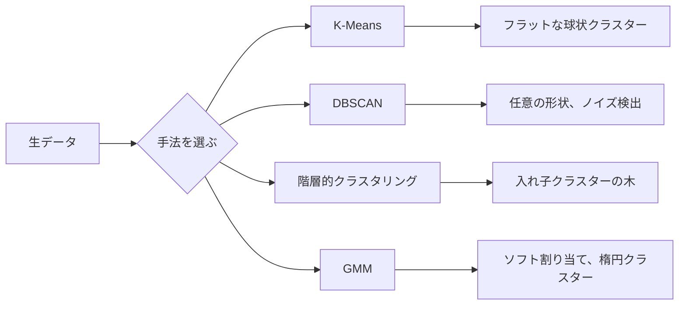

# 教師なし学習

> ラベルなし、教師なし。アルゴリズムが自分で構造を見つける。


## 学習目標

- K-Means、DBSCAN、ガウス混合モデルをゼロから実装し、クラスタリング挙動を比較できる
- シルエットスコアとエルボー法を使ってクラスター品質を評価し、最適なKを選択できる
- DBSCANがK-Meansを上回るタイミングを説明し、非球状クラスターと外れ値を処理するアルゴリズムを特定できる
- クラスタリング手法を使って通常パターンから逸脱した点に印をつける異常検出パイプラインを構築できる

## 問題

これまでのMLレッスンはすべてラベル付きデータを仮定していました: 「これが入力、これが正しい出力」。現実世界では、ラベルは高価です。病院には何百万もの患者記録があっても、誰も各記録を疾患カテゴリで手動タグ付けしていません。ECサイトには何百万ものユーザーセッションがあっても、誰も顧客セグメントを手動ラベル付けしていません。セキュリティチームにはネットワークログがあっても、誰もすべての異常にフラグを立てたわけではありません。

教師なし学習は何を探すかを言われずにパターンを見つけます。似たデータポイントをグループ化し、隠れた構造を発見し、異常を表面化させます。教師あり学習が答えのある教科書から学ぶとするなら、教師なし学習はパターンが自ら明らかになるまで生データを見つめることです。

落とし穴: ラベルがなければ「正解」や「不正解」を直接測定できません。アルゴリズムが見つけた構造が意味のあるものかどうかを評価するために、異なるツールが必要です。

## 概念

### クラスタリング: 似たものをグループ化する

クラスタリングは各データポイントをグループ（クラスター）に割り当て、同じグループ内の点が他のグループの点よりも互いに似ているようにします。常に問われるのは: 「似ている」とはどういう意味か？



### K-Means: 主力アルゴリズム

K-Meansはデータをちょうどつのクラスターに分割します。各クラスターには重心（重心）があり、すべての点は最も近い重心に属します。

ロイドのアルゴリズム:

1. ランダムにK点を初期重心として選ぶ
2. 各データ点を最も近い重心に割り当てる
3. 各重心を割り当てられた点の平均として再計算する
4. 割り当てが変わらなくなるまでステップ2-3を繰り返す

目的関数（慣性）は各点からその割り当て重心までの総二乗距離を測定します。K-Meansこれを最小化しますが、局所最小しか見つけられません。異なる初期化は異なる結果を生む可能性があります。

### Kの選び方

2つの標準的な方法:

**エルボー法:** K = 1、2、3、...、nでK-Meansを実行します。慣性対Kをプロットします。クラスターを増やしても慣性の削減がほとんどない「エルボー」を探します。

**シルエットスコア:** 各点について、自分のクラスター(a)に対する類似度と最も近い別クラスター(b)に対する類似度を測定します。シルエット係数は(b - a) / max(a, b)で、-1（間違いクラスター）から+1（うまくクラスタリングされている）の範囲です。全点の平均がグローバルスコアです。

### DBSCAN: 密度ベースクラスタリング

K-Meansはクラスターが球状であると仮定し、事前にKを選ぶ必要があります。DBSCANはどちらの仮定も置きません。疎な領域で区切られた密な領域としてクラスターを見つけます。

2つのパラメータ:
- **eps**: 近傍の半径
- **min_samples**: 密な領域を形成するために必要な最小点数

3種類の点:
- **コア点**: eps距離内に少なくともmin_samples個の点を持つ
- **境界点**: コア点のeps内にあるが、自身はコア点でない
- **ノイズ点**: コアでも境界でもない。これらが外れ値です。

DBSCANはeps内にある同士のコア点を同じクラスターに接続します。境界点は近くのコア点のクラスターに加わります。ノイズ点はどのクラスターにも属しません。

強み: 任意の形状のクラスターを見つけ、クラスター数を自動的に決定し、外れ値を特定します。弱点: 密度が異なるクラスターに苦労します。

### 階層的クラスタリング

クラスターの入れ子ツリー（デンドログラム）を構築します。

凝集法（ボトムアップ）:
1. 各点を独自のクラスターとして開始
2. 最も近い2つのクラスターをマージ
3. クラスターが1つだけになるまで繰り返す
4. 希望するレベルでデンドログラムを切断してKクラスターを得る

クラスター間の「近さ」は次のように測定できます:
- **単連結**: 2つのクラスター内の任意の2点間の最小距離
- **完全連結**: 2つの任意の点間の最大距離
- **平均連結**: すべてのペアの平均距離
- **ウォード法**: クラスター内総分散の増加が最小となるマージ

### ガウス混合モデル（GMM）

K-Meansはハード割り当てを行います: 各点はちょうど1つのクラスターに属します。GMMはソフト割り当てを行います: 各点は各クラスターに属する確率を持ちます。

GMMはデータがK個のガウス分布（各々独自の平均と共分散を持つ）の混合から生成されると仮定します。期待値最大化（EM）アルゴリズムは次を繰り返します:

- **Eステップ**: 各点が各ガウシアンに属する確率を計算
- **Mステップ**: データの尤度を最大化するように各ガウシアンの平均、共分散、混合重みを更新

GMMは楕円クラスター（K-Meansのような球状だけでなく）をモデル化でき、重なり合うクラスターを自然に扱います。

### どれをいつ使うか

| 手法 | 最適な場合 | 避けるべき場合 |
|------|----------|-------------|
| K-Means | 大きなデータセット、球状クラスター、Kが既知 | 不規則な形状、外れ値あり |
| DBSCAN | Kが未知、任意の形状、外れ値検出 | 密度が異なる、非常に高次元 |
| 階層的 | 小さなデータセット、デンドログラムが必要、Kが未知 | 大きなデータセット（O(n^2)メモリ） |
| GMM | 重なり合うクラスター、ソフト割り当てが必要 | 非常に大きなデータセット、次元が多すぎる |

### クラスタリングによる異常検出

クラスタリングは自然に異常検出をサポートします:
- **K-Means**: どの重心からも遠い点が異常
- **DBSCAN**: ノイズ点が定義上異常
- **GMM**: すべてのガウシアンの下で低確率の点が異常

## 実装する

### ステップ1: K-Meansをゼロから

```python
import math
import random


def euclidean_distance(a, b):
    return math.sqrt(sum((ai - bi) ** 2 for ai, bi in zip(a, b)))


def kmeans(data, k, max_iterations=100, seed=42):
    random.seed(seed)
    n_features = len(data[0])

    centroids = random.sample(data, k)

    for iteration in range(max_iterations):
        clusters = [[] for _ in range(k)]
        assignments = []

        for point in data:
            distances = [euclidean_distance(point, c) for c in centroids]
            nearest = distances.index(min(distances))
            clusters[nearest].append(point)
            assignments.append(nearest)

        new_centroids = []
        for cluster in clusters:
            if len(cluster) == 0:
                new_centroids.append(random.choice(data))
                continue
            centroid = [
                sum(point[j] for point in cluster) / len(cluster)
                for j in range(n_features)
            ]
            new_centroids.append(centroid)

        if all(
            euclidean_distance(old, new) < 1e-6
            for old, new in zip(centroids, new_centroids)
        ):
            print(f"  反復{iteration + 1}で収束")
            break

        centroids = new_centroids

    return assignments, centroids
```

### ステップ2: エルボー法とシルエットスコア

```python
def compute_inertia(data, assignments, centroids):
    total = 0.0
    for point, cluster_id in zip(data, assignments):
        total += euclidean_distance(point, centroids[cluster_id]) ** 2
    return total


def silhouette_score(data, assignments):
    n = len(data)
    if n < 2:
        return 0.0

    clusters = {}
    for i, c in enumerate(assignments):
        clusters.setdefault(c, []).append(i)

    if len(clusters) < 2:
        return 0.0

    scores = []
    for i in range(n):
        own_cluster = assignments[i]
        own_members = [j for j in clusters[own_cluster] if j != i]

        if len(own_members) == 0:
            scores.append(0.0)
            continue

        a = sum(euclidean_distance(data[i], data[j]) for j in own_members) / len(own_members)

        b = float("inf")
        for cluster_id, members in clusters.items():
            if cluster_id == own_cluster:
                continue
            avg_dist = sum(euclidean_distance(data[i], data[j]) for j in members) / len(members)
            b = min(b, avg_dist)

        if max(a, b) == 0:
            scores.append(0.0)
        else:
            scores.append((b - a) / max(a, b))

    return sum(scores) / len(scores)


def find_best_k(data, max_k=10):
    print("エルボー法:")
    inertias = []
    for k in range(1, max_k + 1):
        assignments, centroids = kmeans(data, k)
        inertia = compute_inertia(data, assignments, centroids)
        inertias.append(inertia)
        print(f"  K={k}: 慣性={inertia:.2f}")

    print("\nシルエットスコア:")
    for k in range(2, max_k + 1):
        assignments, centroids = kmeans(data, k)
        score = silhouette_score(data, assignments)
        print(f"  K={k}: シルエット={score:.4f}")

    return inertias
```

### ステップ3: DBSCANをゼロから

```python
def dbscan(data, eps, min_samples):
    n = len(data)
    labels = [-1] * n
    cluster_id = 0

    def region_query(point_idx):
        neighbors = []
        for i in range(n):
            if euclidean_distance(data[point_idx], data[i]) <= eps:
                neighbors.append(i)
        return neighbors

    visited = [False] * n

    for i in range(n):
        if visited[i]:
            continue
        visited[i] = True

        neighbors = region_query(i)

        if len(neighbors) < min_samples:
            labels[i] = -1
            continue

        labels[i] = cluster_id
        seed_set = list(neighbors)
        seed_set.remove(i)

        j = 0
        while j < len(seed_set):
            q = seed_set[j]

            if not visited[q]:
                visited[q] = True
                q_neighbors = region_query(q)
                if len(q_neighbors) >= min_samples:
                    for nb in q_neighbors:
                        if nb not in seed_set:
                            seed_set.append(nb)

            if labels[q] == -1:
                labels[q] = cluster_id

            j += 1

        cluster_id += 1

    return labels
```

### ステップ4: ガウス混合モデル（EMアルゴリズム）

```python
def gmm(data, k, max_iterations=100, seed=42):
    random.seed(seed)
    n = len(data)
    d = len(data[0])

    indices = random.sample(range(n), k)
    means = [list(data[i]) for i in indices]
    variances = [1.0] * k
    weights = [1.0 / k] * k

    def gaussian_pdf(x, mean, variance):
        d = len(x)
        coeff = 1.0 / ((2 * math.pi * variance) ** (d / 2))
        exponent = -sum((xi - mi) ** 2 for xi, mi in zip(x, mean)) / (2 * variance)
        return coeff * math.exp(max(exponent, -500))

    for iteration in range(max_iterations):
        responsibilities = []
        for i in range(n):
            probs = []
            for j in range(k):
                probs.append(weights[j] * gaussian_pdf(data[i], means[j], variances[j]))
            total = sum(probs)
            if total == 0:
                total = 1e-300
            responsibilities.append([p / total for p in probs])

        old_means = [list(m) for m in means]

        for j in range(k):
            r_sum = sum(responsibilities[i][j] for i in range(n))
            if r_sum < 1e-10:
                continue

            weights[j] = r_sum / n

            for dim in range(d):
                means[j][dim] = sum(
                    responsibilities[i][j] * data[i][dim] for i in range(n)
                ) / r_sum

            variances[j] = sum(
                responsibilities[i][j]
                * sum((data[i][dim] - means[j][dim]) ** 2 for dim in range(d))
                for i in range(n)
            ) / (r_sum * d)
            variances[j] = max(variances[j], 1e-6)

        shift = sum(
            euclidean_distance(old_means[j], means[j]) for j in range(k)
        )
        if shift < 1e-6:
            print(f"  GMM 反復{iteration + 1}で収束")
            break

    assignments = []
    for i in range(n):
        assignments.append(responsibilities[i].index(max(responsibilities[i])))

    return assignments, means, weights, responsibilities
```

### ステップ5: テストデータを生成してすべて実行

```python
def make_blobs(centers, n_per_cluster=50, spread=0.5, seed=42):
    random.seed(seed)
    data = []
    true_labels = []
    for label, (cx, cy) in enumerate(centers):
        for _ in range(n_per_cluster):
            x = cx + random.gauss(0, spread)
            y = cy + random.gauss(0, spread)
            data.append([x, y])
            true_labels.append(label)
    return data, true_labels


def make_moons(n_samples=200, noise=0.1, seed=42):
    random.seed(seed)
    data = []
    labels = []
    n_half = n_samples // 2
    for i in range(n_half):
        angle = math.pi * i / n_half
        x = math.cos(angle) + random.gauss(0, noise)
        y = math.sin(angle) + random.gauss(0, noise)
        data.append([x, y])
        labels.append(0)
    for i in range(n_half):
        angle = math.pi * i / n_half
        x = 1 - math.cos(angle) + random.gauss(0, noise)
        y = 1 - math.sin(angle) - 0.5 + random.gauss(0, noise)
        data.append([x, y])
        labels.append(1)
    return data, labels


if __name__ == "__main__":
    centers = [[2, 2], [8, 3], [5, 8]]
    data, true_labels = make_blobs(centers, n_per_cluster=50, spread=0.8)

    print("=== 3つのblobに対するK-Means ===")
    assignments, centroids = kmeans(data, k=3)
    print(f"  重心: {[[round(c, 2) for c in cent] for cent in centroids]}")
    sil = silhouette_score(data, assignments)
    print(f"  シルエットスコア: {sil:.4f}")

    print("\n=== エルボー法 ===")
    find_best_k(data, max_k=6)

    print("\n=== 3つのblobに対するDBSCAN ===")
    db_labels = dbscan(data, eps=1.5, min_samples=5)
    n_clusters = len(set(db_labels) - {-1})
    n_noise = db_labels.count(-1)
    print(f"  {n_clusters}クラスター、{n_noise}ノイズ点を検出")

    print("\n=== 3つのblobに対するGMM ===")
    gmm_assignments, gmm_means, gmm_weights, _ = gmm(data, k=3)
    print(f"  平均: {[[round(m, 2) for m in mean] for mean in gmm_means]}")
    print(f"  重み: {[round(w, 3) for w in gmm_weights]}")
    gmm_sil = silhouette_score(data, gmm_assignments)
    print(f"  シルエットスコア: {gmm_sil:.4f}")

    print("\n=== 月型（非球状クラスター）に対するDBSCAN ===")
    moon_data, moon_labels = make_moons(n_samples=200, noise=0.1)
    moon_db = dbscan(moon_data, eps=0.3, min_samples=5)
    n_moon_clusters = len(set(moon_db) - {-1})
    n_moon_noise = moon_db.count(-1)
    print(f"  {n_moon_clusters}クラスター、{n_moon_noise}ノイズ点を検出")

    print("\n=== 月型に対するK-Means（分離に失敗する） ===")
    moon_km, moon_centroids = kmeans(moon_data, k=2)
    moon_sil = silhouette_score(moon_data, moon_km)
    print(f"  シルエットスコア: {moon_sil:.4f}")
    print("  K-Meansは非球状のため月型をうまく分割できない")

    print("\n=== DBSCANによる異常検出 ===")
    anomaly_data = list(data)
    anomaly_data.append([20.0, 20.0])
    anomaly_data.append([-5.0, -5.0])
    anomaly_data.append([15.0, 0.0])
    anomaly_labels = dbscan(anomaly_data, eps=1.5, min_samples=5)
    anomalies = [
        anomaly_data[i]
        for i in range(len(anomaly_labels))
        if anomaly_labels[i] == -1
    ]
    print(f"  {len(anomalies)}個の異常を検出")
    for a in anomalies[-3:]:
        print(f"    点 {[round(v, 2) for v in a]}")
```

## 使ってみる

scikit-learnでは同じアルゴリズムが1行で書けます:

```python
from sklearn.cluster import KMeans, DBSCAN, AgglomerativeClustering
from sklearn.mixture import GaussianMixture
from sklearn.metrics import silhouette_score as sklearn_silhouette

km = KMeans(n_clusters=3, random_state=42).fit(data)
db = DBSCAN(eps=1.5, min_samples=5).fit(data)
agg = AgglomerativeClustering(n_clusters=3).fit(data)
gmm_model = GaussianMixture(n_components=3, random_state=42).fit(data)
```

ゼロからの実装はこれらのライブラリが何を計算するかを正確に示します。K-Meansは割り当てと再計算を交互に行います。DBSCANは密な種からクラスターを成長させます。GMMは期待値と最大化を交互に行います。ライブラリ版は数値安定性、スマートな初期化（K-Means++）、GPU加速を追加していますが、コアロジックは同じです。

## 成果物を出す

このレッスンはゼロからのK-Means、DBSCAN、GMMの動作する実装を生成します。このクラスタリングコードはより高度な教師なし手法の基礎として再利用できます。

## 演習

1. K-Means++初期化を実装する: ランダムに重心を選ぶ代わりに、最初をランダムに選び、その後の各重心を最も近い既存重心からの二乗距離に比例した確率で選ぶ。ランダム初期化と収束速度を比較する。
2. 階層的凝集クラスタリングをコードに追加する。ウォードリンケージを実装し、デンドログラム（マージのネストリストとして）を生成する。異なるレベルで切断してK-Meansの結果と比較する。
3. シンプルな異常検出パイプラインを構築する: 同じデータに対してDBSCANとGMMを実行し、両方の手法が外れ値だと同意した点にフラグを立てる（DBSCANではノイズ、GMMでは低確率）。重複を測定し、手法が一致しない場合について議論する。

## キーワード

| 用語 | よく言われること | 実際の意味 |
|------|--------------|-----------|
| クラスタリング | 「似たものをグループ化」 | グループ内類似度がグループ間類似度を超えるようにデータをサブセットに分割、特定の距離指標で測定 |
| 重心 | 「クラスターの中心」 | クラスターに割り当てられたすべての点の平均; K-Meansでクラスター代表として使用 |
| 慣性 | 「クラスターの密集度」 | 各点からその割り当て重心までの二乗距離の和; 低いほど密集 |
| シルエットスコア | 「クラスターの分離度」 | 各点について、aは平均クラスター内距離、bは平均最近傍クラスター距離として (b - a) / max(a, b) |
| コア点 | 「密な領域の点」 | DBSCAN内でeps距離内に少なくともmin_samples個の近傍を持つ点 |
| EMアルゴリズム | 「ソフトK-Means」 | 期待値最大化: 反復的にメンバーシップ確率を計算（Eステップ）して分布パラメータを更新（Mステップ） |
| デンドログラム | 「クラスターのツリー」 | 階層的クラスタリングでクラスターがマージされた順序と距離を示すツリー図 |
| 異常 | 「外れ値」 | 期待されるパターンに適合しないデータ点、DBSCANでノイズとして特定、GMMで低確率 |

## 参考資料

- [Stanford CS229 - 教師なし学習](https://cs229.stanford.edu/notes2022fall/main_notes.pdf) - クラスタリングとEMについてのAndrew Ngの講義ノート
- [scikit-learn クラスタリングガイド](https://scikit-learn.org/stable/modules/clustering.html) - 視覚的な例を含む全クラスタリングアルゴリズムの実践的な比較
- [DBSCANオリジナル論文 (Ester et al., 1996)](https://www.aaai.org/Papers/KDD/1996/KDD96-037.pdf) - 密度ベースクラスタリングを導入した論文
