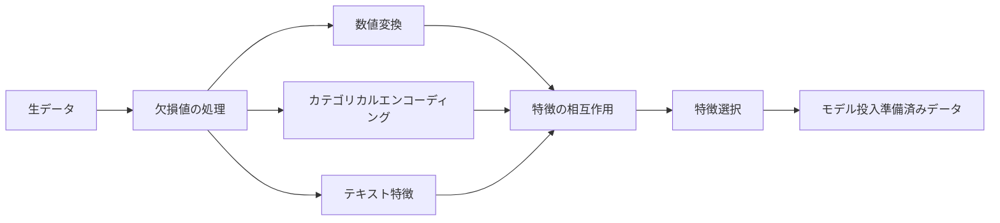

# 特徴エンジニアリングと特徴選択

> 良い特徴量は1000個のデータポイントに匹敵する。


## 学習目標

- 数値変換（標準化、最小最大スケーリング、対数変換、ビニング）を実装し、それぞれがいつ適切かを説明できる
- カテゴリカル特徴に対するワンホット、ラベル、ターゲットエンコーディングを構築し、ターゲットエンコーディングのデータ漏洩リスクを特定できる
- TF-IDFベクトライザーをゼロから構築し、テキスト分類において生の単語カウントを上回る理由を説明できる
- フィルタベースの特徴選択（分散閾値、相関、相互情報量）を適用して次元削減できる

## 問題

データセットがあります。アルゴリズムを選びます。トレーニングします。結果は平凡です。より高度なアルゴリズムを試します。まだ平凡です。ハイパーパラメータのチューニングに1週間費やします。わずかな改善。

そして誰かが生データをより良い特徴に変換し、シンプルなロジスティック回帰がチューニングされた勾配ブースティングアンサンブルを打ち負かします。

これは常に起こります。古典的なMLでは、データの表現はアルゴリズムの選択より重要です。「床面積」と「寝室数」を持つ住宅価格モデルは、学習器がどれほど洗練されていても「生の文字列としての住所」を持つモデルを打ち負かします。アルゴリズムはあなたが与えたもので動作するしかありません。

特徴エンジニアリングは生データをモデルがパターンを見つけやすい表現に変換するプロセスです。特徴選択はシグナルを加えずにノイズを加える特徴を捨てるプロセスです。合わせると、古典的MLで最もレバレッジの高い活動です。

## 概念

### 特徴パイプライン



### 数値特徴

生の数値はめったにモデル投入準備ができていません。一般的な変換:

**スケーリング:** 距離ベースのアルゴリズム（K-Means、KNN、SVM）がすべての特徴を等しく扱えるよう、特徴を同じ範囲にします。最小最大スケーリングは[0, 1]にマッピングします。標準化（zスコア）は平均=0、標準偏差=1にマッピングします。

**対数変換:** 右に歪んだ分布（収入、人口、単語カウント）を圧縮します。乗法的な関係を加法的なものに変えます。

**ビニング:** 連続値をカテゴリーに変換します。特徴とターゲットの関係が非線形だがステップ状の場合（例: 年齢グループ）に有用です。

**多項式特徴:** x^2、x^3、x1*x2の項を作成します。線形モデルがより多くの特徴のコストで非線形関係を捉えられるようにします。

### カテゴリカル特徴

モデルには数値が必要です。カテゴリにはエンコーディングが必要です。

**ワンホットエンコーディング:** 各カテゴリに対して二値列を作成します。「color = red/blue/green」は3つの列になります: is_red、is_blue、is_green。低カーディナリティの特徴には有効ですが、多くのカテゴリがあると爆発します。

**ラベルエンコーディング:** 各カテゴリを整数にマッピングします: red=0、blue=1、green=2。偽の順序を導入します（モデルはgreen > blue > redと思うかもしれません）。個々の値で分割するツリーベースのモデルにのみ適切です。

**ターゲットエンコーディング:** 各カテゴリをそのカテゴリのターゲット変数の平均に置き換えます。強力ですが危険です: データ漏洩の高いリスクがあります。トレーニングデータのみで計算し、テストデータに適用しなければなりません。

### テキスト特徴

**カウントベクトライザー:** 各単語が文書に何回出現するかを数えます。"the cat sat on the mat"は{the: 2, cat: 1, sat: 1, on: 1, mat: 1}になります。

**TF-IDF:** 単語頻度-逆文書頻度。文書間でどれだけユニークかによって単語に重みをつけます。「the」のような一般的な単語は低い重みを得ます。稀で特徴的な単語は高い重みを得ます。

```
TF(単語, 文書) = 文書内の単語カウント / 文書内の総単語数
IDF(単語) = log(総文書数 / 単語を含む文書数)
TF-IDF = TF * IDF
```

### 欠損値

現実のデータには穴があります。戦略:

- **行を削除:** 欠損データが少なく、ランダムな場合のみ
- **平均/中央値代入:** シンプル、分布の形状を保持（中央値は外れ値に対してより頑健）
- **最頻値代入:** カテゴリカル特徴に対して
- **指示列:** 代入前に「これは欠損していたか」という二値列を追加。データが欠損しているという事実自体が情報を持てる
- **前方/後方補完:** 時系列データに対して

### 特徴の相互作用

時として関係は組み合わせの中にあります。「身長」と「体重」だけは「BMI = 体重 / 身長^2」より予測力が低いです。特徴の相互作用は特徴空間を乗算するので、ドメイン知識を使って適切なものを選んでください。

### 特徴選択

特徴が多いことは常に良いとは限りません。無関係な特徴はノイズを加え、トレーニング時間を増加させ、過学習を引き起こす可能性があります。

**フィルター法（モデル前）:**
- 相関: 互いに高度に相関した特徴を削除（冗長）
- 相互情報量: ある特徴を知ることがターゲットに関する不確かさをどれだけ削減するかを測定
- 分散閾値: ほとんど変動しない特徴を削除

**ラッパー法（モデルベース）:**
- L1正則化（Lasso）: 無関係な特徴の重みを正確にゼロに駆動
- 再帰的特徴削除: トレーニング、最も重要でない特徴を削除、繰り返す

**なぜ選択が重要か:** 10の良い特徴を持つモデルは、通常、10の良い特徴と90のノイズの多い特徴を持つモデルを上回ります。ノイズの多い特徴はモデルに汎化しないトレーニングデータパターンに過学習する機会を与えます。

## 実装する

### ステップ1: 数値変換をゼロから

```python
import math


def min_max_scale(values):
    min_val = min(values)
    max_val = max(values)
    if max_val == min_val:
        return [0.0] * len(values)
    return [(v - min_val) / (max_val - min_val) for v in values]


def standardize(values):
    n = len(values)
    mean = sum(values) / n
    variance = sum((v - mean) ** 2 for v in values) / n
    std = math.sqrt(variance) if variance > 0 else 1.0
    return [(v - mean) / std for v in values]


def log_transform(values):
    return [math.log(v + 1) for v in values]


def bin_values(values, n_bins=5):
    min_val = min(values)
    max_val = max(values)
    bin_width = (max_val - min_val) / n_bins
    if bin_width == 0:
        return [0] * len(values)
    result = []
    for v in values:
        bin_idx = int((v - min_val) / bin_width)
        bin_idx = min(bin_idx, n_bins - 1)
        result.append(bin_idx)
    return result


def polynomial_features(row, degree=2):
    n = len(row)
    result = list(row)
    if degree >= 2:
        for i in range(n):
            result.append(row[i] ** 2)
        for i in range(n):
            for j in range(i + 1, n):
                result.append(row[i] * row[j])
    return result
```

### ステップ2: カテゴリカルエンコーディングをゼロから

```python
def one_hot_encode(values):
    categories = sorted(set(values))
    cat_to_idx = {cat: i for i, cat in enumerate(categories)}
    n_cats = len(categories)

    encoded = []
    for v in values:
        row = [0] * n_cats
        row[cat_to_idx[v]] = 1
        encoded.append(row)

    return encoded, categories


def label_encode(values):
    categories = sorted(set(values))
    cat_to_int = {cat: i for i, cat in enumerate(categories)}
    return [cat_to_int[v] for v in values], cat_to_int


def target_encode(feature_values, target_values, smoothing=10):
    global_mean = sum(target_values) / len(target_values)

    category_stats = {}
    for feat, target in zip(feature_values, target_values):
        if feat not in category_stats:
            category_stats[feat] = {"sum": 0.0, "count": 0}
        category_stats[feat]["sum"] += target
        category_stats[feat]["count"] += 1

    encoding = {}
    for cat, stats in category_stats.items():
        cat_mean = stats["sum"] / stats["count"]
        weight = stats["count"] / (stats["count"] + smoothing)
        encoding[cat] = weight * cat_mean + (1 - weight) * global_mean

    return [encoding[v] for v in feature_values], encoding
```

### ステップ3: テキスト特徴をゼロから

```python
def count_vectorize(documents):
    vocab = {}
    idx = 0
    for doc in documents:
        for word in doc.lower().split():
            if word not in vocab:
                vocab[word] = idx
                idx += 1

    vectors = []
    for doc in documents:
        vec = [0] * len(vocab)
        for word in doc.lower().split():
            vec[vocab[word]] += 1
        vectors.append(vec)

    return vectors, vocab


def tfidf(documents):
    n_docs = len(documents)

    vocab = {}
    idx = 0
    for doc in documents:
        for word in doc.lower().split():
            if word not in vocab:
                vocab[word] = idx
                idx += 1

    doc_freq = {}
    for doc in documents:
        seen = set()
        for word in doc.lower().split():
            if word not in seen:
                doc_freq[word] = doc_freq.get(word, 0) + 1
                seen.add(word)

    vectors = []
    for doc in documents:
        words = doc.lower().split()
        word_count = len(words)
        tf_map = {}
        for word in words:
            tf_map[word] = tf_map.get(word, 0) + 1

        vec = [0.0] * len(vocab)
        for word, count in tf_map.items():
            tf = count / word_count
            idf = math.log(n_docs / doc_freq[word])
            vec[vocab[word]] = tf * idf
        vectors.append(vec)

    return vectors, vocab
```

### ステップ4: 欠損値代入をゼロから

```python
def impute_mean(values):
    present = [v for v in values if v is not None]
    if not present:
        return [0.0] * len(values), 0.0
    mean = sum(present) / len(present)
    return [v if v is not None else mean for v in values], mean


def impute_median(values):
    present = sorted(v for v in values if v is not None)
    if not present:
        return [0.0] * len(values), 0.0
    n = len(present)
    if n % 2 == 0:
        median = (present[n // 2 - 1] + present[n // 2]) / 2
    else:
        median = present[n // 2]
    return [v if v is not None else median for v in values], median


def impute_mode(values):
    present = [v for v in values if v is not None]
    if not present:
        return values, None
    counts = {}
    for v in present:
        counts[v] = counts.get(v, 0) + 1
    mode = max(counts, key=counts.get)
    return [v if v is not None else mode for v in values], mode


def add_missing_indicator(values):
    return [0 if v is not None else 1 for v in values]
```

### ステップ5: 特徴選択をゼロから

```python
def correlation(x, y):
    n = len(x)
    mean_x = sum(x) / n
    mean_y = sum(y) / n
    cov = sum((xi - mean_x) * (yi - mean_y) for xi, yi in zip(x, y)) / n
    std_x = math.sqrt(sum((xi - mean_x) ** 2 for xi in x) / n)
    std_y = math.sqrt(sum((yi - mean_y) ** 2 for yi in y) / n)
    if std_x == 0 or std_y == 0:
        return 0.0
    return cov / (std_x * std_y)


def mutual_information(feature, target, n_bins=10):
    feat_min = min(feature)
    feat_max = max(feature)
    bin_width = (feat_max - feat_min) / n_bins if feat_max != feat_min else 1.0
    feat_binned = [
        min(int((f - feat_min) / bin_width), n_bins - 1) for f in feature
    ]

    n = len(feature)
    target_classes = sorted(set(target))

    feat_bins = sorted(set(feat_binned))
    p_feat = {}
    for b in feat_bins:
        p_feat[b] = feat_binned.count(b) / n

    p_target = {}
    for t in target_classes:
        p_target[t] = target.count(t) / n

    mi = 0.0
    for b in feat_bins:
        for t in target_classes:
            joint_count = sum(
                1 for fb, tv in zip(feat_binned, target) if fb == b and tv == t
            )
            p_joint = joint_count / n
            if p_joint > 0:
                mi += p_joint * math.log(p_joint / (p_feat[b] * p_target[t]))

    return mi


def variance_threshold(features, threshold=0.01):
    n_features = len(features[0])
    n_samples = len(features)
    selected = []

    for j in range(n_features):
        col = [features[i][j] for i in range(n_samples)]
        mean = sum(col) / n_samples
        var = sum((v - mean) ** 2 for v in col) / n_samples
        if var >= threshold:
            selected.append(j)

    return selected


def remove_correlated(features, threshold=0.9):
    n_features = len(features[0])
    n_samples = len(features)

    to_remove = set()
    for i in range(n_features):
        if i in to_remove:
            continue
        col_i = [features[r][i] for r in range(n_samples)]
        for j in range(i + 1, n_features):
            if j in to_remove:
                continue
            col_j = [features[r][j] for r in range(n_samples)]
            corr = abs(correlation(col_i, col_j))
            if corr >= threshold:
                to_remove.add(j)

    return [i for i in range(n_features) if i not in to_remove]
```

### ステップ6: 完全なパイプラインとデモ

```python
import random


def make_housing_data(n=200, seed=42):
    random.seed(seed)
    data = []
    for _ in range(n):
        sqft = random.uniform(500, 5000)
        bedrooms = random.choice([1, 2, 3, 4, 5])
        age = random.uniform(0, 50)
        neighborhood = random.choice(["downtown", "suburbs", "rural"])
        has_pool = random.choice([True, False])

        sqft_with_missing = sqft if random.random() > 0.05 else None
        age_with_missing = age if random.random() > 0.08 else None

        price = (
            50 * sqft
            + 20000 * bedrooms
            - 1000 * age
            + (50000 if neighborhood == "downtown" else 10000 if neighborhood == "suburbs" else 0)
            + (15000 if has_pool else 0)
            + random.gauss(0, 20000)
        )

        data.append({
            "sqft": sqft_with_missing,
            "bedrooms": bedrooms,
            "age": age_with_missing,
            "neighborhood": neighborhood,
            "has_pool": has_pool,
            "price": price,
        })
    return data


if __name__ == "__main__":
    data = make_housing_data(200)

    print("=== 生データサンプル ===")
    for row in data[:3]:
        print(f"  {row}")

    sqft_raw = [d["sqft"] for d in data]
    age_raw = [d["age"] for d in data]
    prices = [d["price"] for d in data]

    print("\n=== 欠損値処理 ===")
    sqft_missing = sum(1 for v in sqft_raw if v is None)
    age_missing = sum(1 for v in age_raw if v is None)
    print(f"  sqft 欠損: {sqft_missing}/{len(sqft_raw)}")
    print(f"  age 欠損: {age_missing}/{len(age_raw)}")

    sqft_indicator = add_missing_indicator(sqft_raw)
    age_indicator = add_missing_indicator(age_raw)
    sqft_imputed, sqft_fill = impute_median(sqft_raw)
    age_imputed, age_fill = impute_mean(age_raw)
    print(f"  sqft 中央値で補完: {sqft_fill:.0f}")
    print(f"  age 平均で補完: {age_fill:.1f}")

    print("\n=== 数値変換 ===")
    sqft_scaled = standardize(sqft_imputed)
    age_scaled = min_max_scale(age_imputed)
    sqft_log = log_transform(sqft_imputed)
    age_binned = bin_values(age_imputed, n_bins=5)
    print(f"  sqft 標準化: 平均={sum(sqft_scaled)/len(sqft_scaled):.4f}, 標準偏差={math.sqrt(sum(v**2 for v in sqft_scaled)/len(sqft_scaled)):.4f}")
    print(f"  age 最小最大: [{min(age_scaled):.2f}, {max(age_scaled):.2f}]")
    print(f"  age ビン: {sorted(set(age_binned))}")

    print("\n=== カテゴリカルエンコーディング ===")
    neighborhoods = [d["neighborhood"] for d in data]

    ohe, ohe_cats = one_hot_encode(neighborhoods)
    print(f"  ワンホットカテゴリ: {ohe_cats}")
    print(f"  サンプルエンコーディング: {neighborhoods[0]} -> {ohe[0]}")

    le, le_map = label_encode(neighborhoods)
    print(f"  ラベルエンコーディングマップ: {le_map}")

    te, te_map = target_encode(neighborhoods, prices, smoothing=10)
    print(f"  ターゲットエンコーディング: {({k: round(v) for k, v in te_map.items()})}")

    print("\n=== テキスト特徴 ===")
    descriptions = [
        "large modern house with pool",
        "small cozy cottage near downtown",
        "spacious family home with large yard",
        "modern apartment downtown with view",
        "rustic cabin in rural area",
    ]
    cv, cv_vocab = count_vectorize(descriptions)
    print(f"  語彙サイズ: {len(cv_vocab)}")
    print(f"  文書0の非ゼロ特徴: {sum(1 for v in cv[0] if v > 0)}")

    tf, tf_vocab = tfidf(descriptions)
    print(f"  TF-IDF語彙サイズ: {len(tf_vocab)}")
    top_words = sorted(tf_vocab.keys(), key=lambda w: tf[0][tf_vocab[w]], reverse=True)[:3]
    print(f"  文書0のTF-IDF上位単語: {top_words}")

    print("\n=== 多項式特徴 ===")
    sample_row = [sqft_scaled[0], age_scaled[0]]
    poly = polynomial_features(sample_row, degree=2)
    print(f"  入力: {[round(v, 4) for v in sample_row]}")
    print(f"  多項式: {[round(v, 4) for v in poly]}")
    print(f"  特徴: [x1, x2, x1^2, x2^2, x1*x2]")

    print("\n=== 特徴選択 ===")
    feature_matrix = [
        [sqft_scaled[i], age_scaled[i], float(sqft_indicator[i]), float(age_indicator[i])]
        + ohe[i]
        for i in range(len(data))
    ]

    print(f"  総特徴数: {len(feature_matrix[0])}")

    surviving_var = variance_threshold(feature_matrix, threshold=0.01)
    print(f"  分散閾値後 (0.01): {len(surviving_var)}特徴を保持")

    surviving_corr = remove_correlated(feature_matrix, threshold=0.9)
    print(f"  相関フィルター後 (0.9): {len(surviving_corr)}特徴を保持")

    binary_prices = [1 if p > sum(prices) / len(prices) else 0 for p in prices]
    print("\n  ターゲットとの相互情報量:")
    feature_names = ["sqft", "age", "sqft_missing", "age_missing"] + [f"neigh_{c}" for c in ohe_cats]
    for j in range(len(feature_matrix[0])):
        col = [feature_matrix[i][j] for i in range(len(feature_matrix))]
        mi = mutual_information(col, binary_prices, n_bins=10)
        print(f"    {feature_names[j]}: MI={mi:.4f}")

    print("\n  価格との相関:")
    for j in range(len(feature_matrix[0])):
        col = [feature_matrix[i][j] for i in range(len(feature_matrix))]
        corr = correlation(col, prices)
        print(f"    {feature_names[j]}: r={corr:.4f}")
```

## 使ってみる

scikit-learnでは、これらの変換は合成可能なパイプラインです:

```python
from sklearn.preprocessing import StandardScaler, OneHotEncoder, PolynomialFeatures
from sklearn.impute import SimpleImputer
from sklearn.feature_extraction.text import TfidfVectorizer
from sklearn.feature_selection import mutual_info_classif, VarianceThreshold
from sklearn.compose import ColumnTransformer
from sklearn.pipeline import Pipeline

numeric_pipe = Pipeline([
    ("imputer", SimpleImputer(strategy="median")),
    ("scaler", StandardScaler()),
])

categorical_pipe = Pipeline([
    ("encoder", OneHotEncoder(sparse_output=False)),
])

preprocessor = ColumnTransformer([
    ("num", numeric_pipe, ["sqft", "age"]),
    ("cat", categorical_pipe, ["neighborhood"]),
])
```

ゼロからの実装は各変換の内部で何が起こるかを正確に示します。ライブラリ版はエッジケース処理、スパース行列サポート、パイプライン合成を追加していますが、数学は同じです。

## 成果物を出す

このレッスンは以下を生成します:
- `outputs/prompt-feature-engineer.md` - 生データから体系的に特徴をエンジニアリングするためのプロンプト

## 演習

1. 数値変換にロバストスケーリング（平均と標準偏差の代わりに中央値と四分位範囲を使用）を追加する。極端な外れ値があるデータで標準スケーリングと比較する。
2. リーブワンアウトターゲットエンコーディングを実装する: 各行について、その行自身のターゲット値を除いたターゲット平均を計算する。単純なターゲットエンコーディングと比較して過学習がどのように削減されるかを示す。
3. 分散閾値、相関フィルタリング、相互情報量ランキングを組み合わせた自動特徴選択パイプラインを構築する。住宅データセットに適用し、全特徴対選択された特徴でモデル性能（シンプルな線形回帰を使用）を比較する。

## キーワード

| 用語 | よく言われること | 実際の意味 |
|------|--------------|-----------|
| 特徴エンジニアリング | 「新しい列を作る」 | 生データをモデルへパターンを提示する表現に変換する |
| 標準化 | 「正規化する」 | 平均を引いて標準偏差で割り、特徴の平均=0、標準偏差=1にする |
| ワンホットエンコーディング | 「ダミー変数を作る」 | カテゴリごとに1つの二値列を作成し、各行でちょうど1列が1になる |
| ターゲットエンコーディング | 「答えを使ってエンコードする」 | 各カテゴリをそのカテゴリの平均ターゲット値に置き換える、過学習を防ぐスムージング付き |
| TF-IDF | 「高度な単語カウント」 | 単語頻度×逆文書頻度: コーパス全体でどれだけ特徴的かによって重み付けされた単語 |
| 代入 | 「空白を埋める」 | 欠損値を推定値（平均、中央値、最頻値、またはモデル予測）で置き換える |
| 特徴選択 | 「悪い列を捨てる」 | ノイズや冗長性を加える特徴を削除し、ターゲットに関するシグナルを持つものだけを保持 |
| 相互情報量 | 「ある事がどれだけ別の事を教えるか」 | 変数Xを観察することで変数Yに関する不確かさがどれだけ削減されるかの尺度 |
| データ漏洩 | 「偶然にカンニングする」 | 予測時に利用できないはずの情報をトレーニング中に使用し、偽りの楽観的な結果を生む |

## 参考資料

- [Feature Engineering and Selection (Max Kuhn & Kjell Johnson)](http://www.feat.engineering/) - 特徴エンジニアリングの全景をカバーする無料オンラインブック
- [scikit-learn 前処理ガイド](https://scikit-learn.org/stable/modules/preprocessing.html) - すべての標準変換の実践的リファレンス
- [Target Encoding Done Right (Micci-Barreca, 2001)](https://dl.acm.org/doi/10.1145/507533.507538) - スムージング付きターゲットエンコーディングのオリジナル論文
