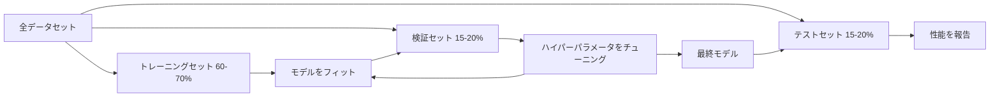

# モデル評価

> モデルの価値は、それをどのように測定するかによって決まる。


## 学習目標

- K分割交差検証と層化K分割交差検証をゼロから実装し、不均衡データに対して層化が重要な理由を説明できる
- 精度、再現率、F1、AUC-ROC、回帰指標（MSE、RMSE、MAE、R二乗）をゼロから計算できる
- 学習曲線を解釈してモデルが高バイアスか高バリアンスかを診断できる
- データ漏洩、誤った指標選択、テストセット汚染を含む一般的な評価ミスを特定できる

## 問題

モデルをトレーニングしました。データで95%の精度を得ました。良いのでしょうか？

どうとも言えません。データの95%が1つのクラスに属する場合、常にそのクラスを予測するモデルは完全に役に立ちながら95%の精度を得ます。トレーニングしたのと同じデータで評価した場合、モデルが答えを暗記しただけなので95%という数値は意味がありません。データセットに時間的要素があり、分割前にランダムにシャッフルした場合、モデルは過去を予測するために未来のデータを使っているかもしれません。

モデル評価はほとんどのMLプロジェクトが失敗するところです。間違った指標が悪いモデルを良く見せます。間違った分割がモデルにカンニングを許します。間違った比較がより悪いモデルを選ばせます。評価を正しく行うことはオプションではありません。本番環境で機能するモデルと実際のデータを見た瞬間に失敗するモデルの違いです。

## 概念

### トレーニング、検証、テスト



3つの分割、3つの目的:

- **トレーニングセット**: モデルがこのデータから学ぶ。トレーニング中にこれらの例を見ます。
- **検証セット**: ハイパーパラメータをチューニングしモデル間で選択するために使います。モデルはこのデータでトレーニングしませんが、決定はこれに影響されます。
- **テストセット**: 最終性能を報告するために最後に1回だけ使います。テスト性能を見てモデルを変更しに戻ると、それはもはやテストセットではありません。2番目の検証セットになってしまいます。

テストセットは、報告された性能が真に未見のデータでどうなるかを反映するというホールドアウト保証です。

### K分割交差検証

小さなデータセットでは、単一のトレーニング/検証分割はデータを無駄にし、ノイズの多い推定を与えます。K分割交差検証はトレーニングと検証の両方にすべてのデータを使います:


1. データをK個の等サイズの折りに分割する
2. 各折りについて、K-1個の折りでトレーニングし残りの折りで検証する
3. K個の検証スコアを平均する

K=5またはK=10が標準的な選択です。すべてのデータポイントがちょうど1回検証に使われます。平均スコアは単一の分割より安定した推定です。

**層化K分割**: 各折りでクラス分布を保持します。データセットが70%クラスAと30%クラスBの場合、各折りはほぼ同じ比率を持ちます。これはランダムな分割がマイノリティサンプルを1つの折りに入れてしまう可能性がある不均衡データセットに重要です。

### 分類指標

**混同行列**: 基礎。二値分類について:

|  | 予測陽性 | 予測陰性 |
|--|---------|---------|
| 実際に陽性 | 真陽性 (TP) | 偽陰性 (FN) |
| 実際に陰性 | 偽陽性 (FP) | 真陰性 (TN) |

この行列から、他のすべての指標が導かれます:

- **精度（Accuracy）** = (TP + TN) / (TP + TN + FP + FN)。正しい予測の割合。クラスが不均衡の場合は誤解を招く。
- **適合率（Precision）** = TP / (TP + FP)。陽性と予測したもののうち実際に陽性のもの。偽陽性がコスト高な場合に使う（例: スパムフィルターが本物のメールをスパムとマークする）。
- **再現率（Recall）**（感度） = TP / (TP + FN)。実際の陽性のうち捉えられたもの。偽陰性がコスト高な場合に使う（例: がん検診で腫瘍を見逃す）。
- **F1スコア** = 2 * 適合率 * 再現率 / (適合率 + 再現率)。適合率と再現率の調和平均。どちらかが明らかに支配的でない場合に両方のバランスをとる。
- **AUC-ROC**: ROC曲線下面積。さまざまな分類閾値で真陽性率対偽陽性率をプロット。AUC = 0.5はランダム推測、AUC = 1.0は完全な分離を意味する。閾値に依存しない: 選択したカットオフに関係なく、モデルが陰性の上に陽性をどれだけうまくランク付けするかを測定する。

### 回帰指標

- **MSE**（平均二乗誤差）= mean((y_true - y_pred)^2)。大きなエラーを二乗してペナルティを与える。外れ値に敏感。
- **RMSE**（二乗平均平方根誤差）= sqrt(MSE)。ターゲット変数と同じ単位。MSEより解釈しやすい。
- **MAE**（平均絶対誤差）= mean(|y_true - y_pred|)。すべてのエラーを線形に扱う。MSEより外れ値に頑健。
- **R二乗** = 1 - SS_res / SS_tot、SS_res = sum((y_true - y_pred)^2)、SS_tot = sum((y_true - y_mean)^2)。モデルで説明される分散の割合。R^2 = 1.0が完璧。R^2 = 0.0はモデルが常に平均を予測するより良くないことを意味する。R^2はモデルが平均より悪い場合は負になることがある。

### 学習曲線

トレーニングセットサイズの関数としてトレーニングと検証スコアをプロット:

- **高バイアス（未学習）**: 両方の曲線が低いスコアに収束する。データを増やしても助けにならない。より複雑なモデルが必要。
- **高バリアンス（過学習）**: トレーニングスコアは高いが検証スコアははるかに低い。両者の差が大きい。データを増やすべき。

### 検証曲線

ハイパーパラメータの関数としてトレーニングと検証スコアをプロット:

- 低い複雑さで: 両方のスコアが低い（未学習）
- 適切な複雑さで: 両方のスコアが高く近い
- 高い複雑さで: トレーニングスコアは高いままだが検証スコアが下がる（過学習）

最適なハイパーパラメータ値は検証スコアがピークになるところです。

### よくある評価ミス

**データ漏洩**: テストセットからの情報がトレーニングに漏洩する。例: 分割前に全データセットでスケーラーをフィット、時系列予測に未来のデータを含める、ターゲットから導出された特徴を使う。常に先に分割し、それから前処理する。

**クラス不均衡**: トランザクションの99%は正常、1%が不正。常に「正常」を予測するモデルは99%の精度を得る。代わりに適合率、再現率、F1、AUC-ROCを使う。

**間違った指標**: 再現率を最適化すべきなのに精度を最適化する（医療診断）、または外れ値が多いデータでRMSEを最適化する（代わりにMAEを使う）。

**層化分割を使わない**: 不均衡データでは、ランダムな分割が検証折りに非常に少数のマイノリティサンプルしか入れず、不安定な推定を与えることがある。

**テストを頻繁にしすぎる**: テスト性能を見て調整するたびに、テストセットに過学習する。テストセットは1回限り使用。

## 実装する

### ステップ1: トレーニング/検証/テスト分割

```python
import random
import math


def train_val_test_split(X, y, train_ratio=0.6, val_ratio=0.2, seed=42):
    random.seed(seed)
    n = len(X)
    indices = list(range(n))
    random.shuffle(indices)

    train_end = int(n * train_ratio)
    val_end = int(n * (train_ratio + val_ratio))

    train_idx = indices[:train_end]
    val_idx = indices[train_end:val_end]
    test_idx = indices[val_end:]

    X_train = [X[i] for i in train_idx]
    y_train = [y[i] for i in train_idx]
    X_val = [X[i] for i in val_idx]
    y_val = [y[i] for i in val_idx]
    X_test = [X[i] for i in test_idx]
    y_test = [y[i] for i in test_idx]

    return X_train, y_train, X_val, y_val, X_test, y_test
```

### ステップ2: K分割交差検証と層化K分割交差検証

```python
def kfold_split(n, k=5, seed=42):
    random.seed(seed)
    indices = list(range(n))
    random.shuffle(indices)

    fold_size = n // k
    folds = []

    for i in range(k):
        start = i * fold_size
        end = start + fold_size if i < k - 1 else n
        val_idx = indices[start:end]
        train_idx = indices[:start] + indices[end:]
        folds.append((train_idx, val_idx))

    return folds


def stratified_kfold_split(y, k=5, seed=42):
    random.seed(seed)

    class_indices = {}
    for i, label in enumerate(y):
        class_indices.setdefault(label, []).append(i)

    for label in class_indices:
        random.shuffle(class_indices[label])

    folds = [{"train": [], "val": []} for _ in range(k)]

    for label, indices in class_indices.items():
        fold_size = len(indices) // k
        for i in range(k):
            start = i * fold_size
            end = start + fold_size if i < k - 1 else len(indices)
            val_part = indices[start:end]
            train_part = indices[:start] + indices[end:]
            folds[i]["val"].extend(val_part)
            folds[i]["train"].extend(train_part)

    return [(f["train"], f["val"]) for f in folds]


def cross_validate(X, y, model_fn, k=5, metric_fn=None, stratified=False):
    n = len(X)

    if stratified:
        folds = stratified_kfold_split(y, k)
    else:
        folds = kfold_split(n, k)

    scores = []
    for train_idx, val_idx in folds:
        X_train = [X[i] for i in train_idx]
        y_train = [y[i] for i in train_idx]
        X_val = [X[i] for i in val_idx]
        y_val = [y[i] for i in val_idx]

        model = model_fn()
        model.fit(X_train, y_train)
        predictions = [model.predict(x) for x in X_val]

        if metric_fn:
            score = metric_fn(y_val, predictions)
        else:
            score = sum(1 for yt, yp in zip(y_val, predictions) if yt == yp) / len(y_val)
        scores.append(score)

    return scores
```

### ステップ3: 混同行列と分類指標

```python
def confusion_matrix(y_true, y_pred):
    tp = sum(1 for yt, yp in zip(y_true, y_pred) if yt == 1 and yp == 1)
    tn = sum(1 for yt, yp in zip(y_true, y_pred) if yt == 0 and yp == 0)
    fp = sum(1 for yt, yp in zip(y_true, y_pred) if yt == 0 and yp == 1)
    fn = sum(1 for yt, yp in zip(y_true, y_pred) if yt == 1 and yp == 0)
    return tp, tn, fp, fn


def accuracy(y_true, y_pred):
    tp, tn, fp, fn = confusion_matrix(y_true, y_pred)
    total = tp + tn + fp + fn
    return (tp + tn) / total if total > 0 else 0.0


def precision(y_true, y_pred):
    tp, tn, fp, fn = confusion_matrix(y_true, y_pred)
    return tp / (tp + fp) if (tp + fp) > 0 else 0.0


def recall(y_true, y_pred):
    tp, tn, fp, fn = confusion_matrix(y_true, y_pred)
    return tp / (tp + fn) if (tp + fn) > 0 else 0.0


def f1_score(y_true, y_pred):
    p = precision(y_true, y_pred)
    r = recall(y_true, y_pred)
    return 2 * p * r / (p + r) if (p + r) > 0 else 0.0


def roc_curve(y_true, y_scores):
    thresholds = sorted(set(y_scores), reverse=True)
    tpr_list = []
    fpr_list = []

    total_positives = sum(y_true)
    total_negatives = len(y_true) - total_positives

    for threshold in thresholds:
        y_pred = [1 if s >= threshold else 0 for s in y_scores]
        tp = sum(1 for yt, yp in zip(y_true, y_pred) if yt == 1 and yp == 1)
        fp = sum(1 for yt, yp in zip(y_true, y_pred) if yt == 0 and yp == 1)

        tpr = tp / total_positives if total_positives > 0 else 0.0
        fpr = fp / total_negatives if total_negatives > 0 else 0.0

        tpr_list.append(tpr)
        fpr_list.append(fpr)

    return fpr_list, tpr_list, thresholds


def auc_roc(y_true, y_scores):
    fpr_list, tpr_list, _ = roc_curve(y_true, y_scores)

    pairs = sorted(zip(fpr_list, tpr_list))
    fpr_sorted = [p[0] for p in pairs]
    tpr_sorted = [p[1] for p in pairs]

    area = 0.0
    for i in range(1, len(fpr_sorted)):
        width = fpr_sorted[i] - fpr_sorted[i - 1]
        height = (tpr_sorted[i] + tpr_sorted[i - 1]) / 2
        area += width * height

    return area
```

### ステップ4: 回帰指標

```python
def mse(y_true, y_pred):
    n = len(y_true)
    return sum((yt - yp) ** 2 for yt, yp in zip(y_true, y_pred)) / n


def rmse(y_true, y_pred):
    return math.sqrt(mse(y_true, y_pred))


def mae(y_true, y_pred):
    n = len(y_true)
    return sum(abs(yt - yp) for yt, yp in zip(y_true, y_pred)) / n


def r_squared(y_true, y_pred):
    mean_y = sum(y_true) / len(y_true)
    ss_res = sum((yt - yp) ** 2 for yt, yp in zip(y_true, y_pred))
    ss_tot = sum((yt - mean_y) ** 2 for yt in y_true)
    if ss_tot == 0:
        return 0.0
    return 1.0 - ss_res / ss_tot
```

### ステップ5: 学習曲線

```python
def learning_curve(X, y, model_fn, metric_fn, train_sizes=None, val_ratio=0.2, seed=42):
    random.seed(seed)
    n = len(X)
    indices = list(range(n))
    random.shuffle(indices)

    val_size = int(n * val_ratio)
    val_idx = indices[:val_size]
    pool_idx = indices[val_size:]

    X_val = [X[i] for i in val_idx]
    y_val = [y[i] for i in val_idx]

    if train_sizes is None:
        train_sizes = [int(len(pool_idx) * r) for r in [0.1, 0.2, 0.4, 0.6, 0.8, 1.0]]

    train_scores = []
    val_scores = []

    for size in train_sizes:
        subset = pool_idx[:size]
        X_train = [X[i] for i in subset]
        y_train = [y[i] for i in subset]

        model = model_fn()
        model.fit(X_train, y_train)

        train_pred = [model.predict(x) for x in X_train]
        val_pred = [model.predict(x) for x in X_val]

        train_scores.append(metric_fn(y_train, train_pred))
        val_scores.append(metric_fn(y_val, val_pred))

    return train_sizes, train_scores, val_scores
```

### ステップ6: テスト用シンプルな分類器と完全なデモ

```python
class SimpleLogistic:
    def __init__(self, lr=0.1, epochs=100):
        self.lr = lr
        self.epochs = epochs
        self.weights = None
        self.bias = 0.0

    def sigmoid(self, z):
        z = max(-500, min(500, z))
        return 1.0 / (1.0 + math.exp(-z))

    def fit(self, X, y):
        n_features = len(X[0])
        self.weights = [0.0] * n_features
        self.bias = 0.0

        for _ in range(self.epochs):
            for xi, yi in zip(X, y):
                z = sum(w * x for w, x in zip(self.weights, xi)) + self.bias
                pred = self.sigmoid(z)
                error = yi - pred
                for j in range(n_features):
                    self.weights[j] += self.lr * error * xi[j]
                self.bias += self.lr * error

    def predict_proba(self, x):
        z = sum(w * xi for w, xi in zip(self.weights, x)) + self.bias
        return self.sigmoid(z)

    def predict(self, x):
        return 1 if self.predict_proba(x) >= 0.5 else 0


class SimpleLinearRegression:
    def __init__(self, lr=0.001, epochs=200):
        self.lr = lr
        self.epochs = epochs
        self.weights = None
        self.bias = 0.0

    def fit(self, X, y):
        n_features = len(X[0])
        self.weights = [0.0] * n_features
        self.bias = 0.0
        n = len(X)

        for _ in range(self.epochs):
            for xi, yi in zip(X, y):
                pred = sum(w * x for w, x in zip(self.weights, xi)) + self.bias
                error = yi - pred
                for j in range(n_features):
                    self.weights[j] += self.lr * error * xi[j] / n
                self.bias += self.lr * error / n

    def predict(self, x):
        return sum(w * xi for w, xi in zip(self.weights, x)) + self.bias


def standardize(values):
    n = len(values)
    mean = sum(values) / n
    var = sum((v - mean) ** 2 for v in values) / n
    std = math.sqrt(var) if var > 0 else 1.0
    return [(v - mean) / std for v in values], mean, std


def make_classification_data(n=300, seed=42):
    random.seed(seed)
    X = []
    y = []
    for _ in range(n):
        x1 = random.gauss(0, 1)
        x2 = random.gauss(0, 1)
        label = 1 if (x1 + x2 + random.gauss(0, 0.5)) > 0 else 0
        X.append([x1, x2])
        y.append(label)
    return X, y


def make_regression_data(n=200, seed=42):
    random.seed(seed)
    X = []
    y = []
    for _ in range(n):
        x1 = random.uniform(0, 10)
        x2 = random.uniform(0, 5)
        target = 3 * x1 + 2 * x2 + random.gauss(0, 2)
        X.append([x1, x2])
        y.append(target)
    return X, y


def make_imbalanced_data(n=300, minority_ratio=0.05, seed=42):
    random.seed(seed)
    X = []
    y = []
    for _ in range(n):
        if random.random() < minority_ratio:
            x1 = random.gauss(3, 0.5)
            x2 = random.gauss(3, 0.5)
            label = 1
        else:
            x1 = random.gauss(0, 1)
            x2 = random.gauss(0, 1)
            label = 0
        X.append([x1, x2])
        y.append(label)
    return X, y


if __name__ == "__main__":
    X_clf, y_clf = make_classification_data(300)

    print("=== トレーニング/検証/テスト分割 ===")
    X_train, y_train, X_val, y_val, X_test, y_test = train_val_test_split(X_clf, y_clf)
    print(f"  トレーニング: {len(X_train)}, 検証: {len(X_val)}, テスト: {len(X_test)}")
    print(f"  トレーニングクラス分布: {sum(y_train)}/{len(y_train)} 陽性")
    print(f"  検証クラス分布: {sum(y_val)}/{len(y_val)} 陽性")

    model = SimpleLogistic(lr=0.1, epochs=200)
    model.fit(X_train, y_train)

    print("\n=== 分類指標 ===")
    y_pred = [model.predict(x) for x in X_test]
    tp, tn, fp, fn = confusion_matrix(y_test, y_pred)
    print(f"  混同行列: TP={tp}, TN={tn}, FP={fp}, FN={fn}")
    print(f"  精度:       {accuracy(y_test, y_pred):.4f}")
    print(f"  適合率:     {precision(y_test, y_pred):.4f}")
    print(f"  再現率:     {recall(y_test, y_pred):.4f}")
    print(f"  F1スコア:   {f1_score(y_test, y_pred):.4f}")

    y_scores = [model.predict_proba(x) for x in X_test]
    auc = auc_roc(y_test, y_scores)
    print(f"  AUC-ROC:   {auc:.4f}")

    print("\n=== K分割交差検証 (K=5) ===")
    cv_scores = cross_validate(
        X_clf, y_clf,
        model_fn=lambda: SimpleLogistic(lr=0.1, epochs=200),
        k=5,
        metric_fn=accuracy,
    )
    mean_cv = sum(cv_scores) / len(cv_scores)
    std_cv = math.sqrt(sum((s - mean_cv) ** 2 for s in cv_scores) / len(cv_scores))
    print(f"  折りスコア: {[round(s, 4) for s in cv_scores]}")
    print(f"  平均: {mean_cv:.4f} (+/- {std_cv:.4f})")

    print("\n=== 層化K分割交差検証 (K=5) ===")
    strat_scores = cross_validate(
        X_clf, y_clf,
        model_fn=lambda: SimpleLogistic(lr=0.1, epochs=200),
        k=5,
        metric_fn=accuracy,
        stratified=True,
    )
    strat_mean = sum(strat_scores) / len(strat_scores)
    strat_std = math.sqrt(sum((s - strat_mean) ** 2 for s in strat_scores) / len(strat_scores))
    print(f"  折りスコア: {[round(s, 4) for s in strat_scores]}")
    print(f"  平均: {strat_mean:.4f} (+/- {strat_std:.4f})")

    print("\n=== 不均衡データ: なぜ精度が嘘をつくか ===")
    X_imb, y_imb = make_imbalanced_data(300, minority_ratio=0.05)
    positives = sum(y_imb)
    print(f"  クラス分布: {positives} 陽性, {len(y_imb) - positives} 陰性 ({positives/len(y_imb)*100:.1f}% 陽性)")

    always_negative = [0] * len(y_imb)
    print(f"  常に陰性のベースライン:")
    print(f"    精度:       {accuracy(y_imb, always_negative):.4f}")
    print(f"    適合率:     {precision(y_imb, always_negative):.4f}")
    print(f"    再現率:     {recall(y_imb, always_negative):.4f}")
    print(f"    F1スコア:   {f1_score(y_imb, always_negative):.4f}")

    X_tr_i, y_tr_i, X_v_i, y_v_i, X_te_i, y_te_i = train_val_test_split(X_imb, y_imb)
    model_imb = SimpleLogistic(lr=0.5, epochs=500)
    model_imb.fit(X_tr_i, y_tr_i)
    y_pred_imb = [model_imb.predict(x) for x in X_te_i]
    print(f"\n  不均衡データでトレーニングされたモデル:")
    print(f"    精度:       {accuracy(y_te_i, y_pred_imb):.4f}")
    print(f"    適合率:     {precision(y_te_i, y_pred_imb):.4f}")
    print(f"    再現率:     {recall(y_te_i, y_pred_imb):.4f}")
    print(f"    F1スコア:   {f1_score(y_te_i, y_pred_imb):.4f}")

    print("\n=== 回帰指標 ===")
    X_reg, y_reg = make_regression_data(200)

    col0 = [x[0] for x in X_reg]
    col1 = [x[1] for x in X_reg]
    col0_s, m0, s0 = standardize(col0)
    col1_s, m1, s1 = standardize(col1)
    X_reg_scaled = [[col0_s[i], col1_s[i]] for i in range(len(X_reg))]

    X_tr_r, y_tr_r, X_v_r, y_v_r, X_te_r, y_te_r = train_val_test_split(X_reg_scaled, y_reg)
    reg_model = SimpleLinearRegression(lr=0.01, epochs=500)
    reg_model.fit(X_tr_r, y_tr_r)
    y_pred_r = [reg_model.predict(x) for x in X_te_r]

    print(f"  MSE:       {mse(y_te_r, y_pred_r):.4f}")
    print(f"  RMSE:      {rmse(y_te_r, y_pred_r):.4f}")
    print(f"  MAE:       {mae(y_te_r, y_pred_r):.4f}")
    print(f"  R二乗:     {r_squared(y_te_r, y_pred_r):.4f}")

    mean_baseline = [sum(y_tr_r) / len(y_tr_r)] * len(y_te_r)
    print(f"\n  平均ベースライン:")
    print(f"    MSE:       {mse(y_te_r, mean_baseline):.4f}")
    print(f"    R二乗:     {r_squared(y_te_r, mean_baseline):.4f}")

    print("\n=== 学習曲線 ===")
    sizes, train_sc, val_sc = learning_curve(
        X_clf, y_clf,
        model_fn=lambda: SimpleLogistic(lr=0.1, epochs=200),
        metric_fn=accuracy,
    )
    print(f"  {'サイズ':>6} {'トレーニング':>12} {'検証':>8}")
    for s, tr, va in zip(sizes, train_sc, val_sc):
        print(f"  {s:>6} {tr:>12.4f} {va:>8.4f}")

    print("\n=== 統計的モデル比較 ===")
    model_a_scores = cross_validate(
        X_clf, y_clf,
        model_fn=lambda: SimpleLogistic(lr=0.1, epochs=100),
        k=5, metric_fn=accuracy,
    )
    model_b_scores = cross_validate(
        X_clf, y_clf,
        model_fn=lambda: SimpleLogistic(lr=0.1, epochs=500),
        k=5, metric_fn=accuracy,
    )
    diffs = [a - b for a, b in zip(model_a_scores, model_b_scores)]
    mean_diff = sum(diffs) / len(diffs)
    std_diff = math.sqrt(sum((d - mean_diff) ** 2 for d in diffs) / len(diffs))
    t_stat = mean_diff / (std_diff / math.sqrt(len(diffs))) if std_diff > 0 else 0.0
    print(f"  モデルA (100エポック) 平均: {sum(model_a_scores)/len(model_a_scores):.4f}")
    print(f"  モデルB (500エポック) 平均: {sum(model_b_scores)/len(model_b_scores):.4f}")
    print(f"  平均差: {mean_diff:.4f}")
    print(f"  対応t統計量: {t_stat:.4f}")
    print(f"  (|t| > 2.78でdf=4のとき p<0.05で有意)")
```

## 使ってみる

scikit-learnでは、評価はワークフローに組み込まれています:

```python
from sklearn.model_selection import cross_val_score, StratifiedKFold, learning_curve
from sklearn.metrics import (
    accuracy_score, precision_score, recall_score, f1_score,
    roc_auc_score, confusion_matrix, mean_squared_error, r2_score,
)
from sklearn.linear_model import LogisticRegression

model = LogisticRegression()
scores = cross_val_score(model, X, y, cv=StratifiedKFold(5), scoring="f1")
```

ゼロからの実装は交差検証が何をするかを正確に示します（魔法はなく、forループとインデックス追跡だけです）、各指標がどのように計算されるか（TP/FP/TN/FNを数えるだけです）、なぜ層化が重要か（各折りでクラス比率を保持）。ライブラリ版は並列処理、より多くのスコアリングオプション、パイプラインとの統合を追加します。

## 成果物を出す

このレッスンは以下を生成します:
- `outputs/skill-evaluation.md` - 分類と回帰モデルの評価戦略をカバーするスキル

## 演習

1. 適合率-再現率曲線を実装する: 異なる閾値で適合率対再現率をプロット。PR曲線の下の面積（平均適合率）を計算する。不均衡データセットでPR曲線とROC曲線を比較し、それぞれがより情報的なタイミングを説明する。
2. ネストした交差検証ループを構築する: 外側のループがモデル性能を評価し、内側のループがハイパーパラメータをチューニングする。評価データを検証データに漏洩させることなく、2つのモデルを公平に比較するために使う。
3. モデル比較のための順列検定を実装する: ラベルをシャッフルし、再トレーニングし、性能を測定する。帰無分布を構築するために100回繰り返す。この分布に対して観察されたモデル性能のp値を計算する。

## キーワード

| 用語 | よく言われること | 実際の意味 |
|------|--------------|-----------|
| 過学習 | 「トレーニングデータを暗記する」 | モデルがトレーニングデータのノイズを捉え、トレーニングではうまくいくが未見データではうまくいかない |
| 交差検証 | 「異なるサブセットでテストする」 | データのどの部分を検証に使うかを系統的に回転させ、すべての回転でスコアを平均化する |
| 適合率 | 「陽性と予測したものがどれだけ正しいか」 | TP / (TP + FP): 実際に陽性だった陽性予測の割合 |
| 再現率 | 「実際の陽性をどれだけ見つけたか」 | TP / (TP + FN): 正しく特定された実際の陽性の割合 |
| AUC-ROC | 「モデルがクラスをどれだけうまく分離するか」 | すべての閾値にわたる真陽性率対偽陽性率の曲線下面積、0.5（ランダム）から1.0（完璧）まで |
| R二乗 | 「どれだけの分散が説明されているか」 | 1 - (残差二乗和 / 総二乗和): モデルが捉えるターゲット分散の割合 |
| データ漏洩 | 「モデルがカンニングした」 | 予測時に利用できない情報をトレーニング中に使い、楽観的な評価につながる |
| 学習曲線 | 「データが増えると性能がどう変わるか」 | トレーニングセットサイズ対トレーニングと検証スコアのプロット、未学習または過学習を明らかにする |
| 層化分割 | 「クラス比率のバランスを保つ」 | 各サブセットが全データセットと同じ各クラスの比率を持つようにデータを分割する |

## 参考資料

- [scikit-learn モデル選択ガイド](https://scikit-learn.org/stable/model_selection.html) - 交差検証、指標、ハイパーパラメータチューニングの包括的リファレンス
- [精度を超えて: 適合率と再現率 (Google ML Crash Course)](https://developers.google.com/machine-learning/crash-course/classification/precision-and-recall) - インタラクティブな例を含む明快な説明
- [交差検証手順のサーベイ (Arlot & Celisse, 2010)](https://projecteuclid.org/journals/statistics-surveys/volume-4/issue-none/A-survey-of-cross-validation-procedures-for-model-selection/10.1214/09-SS054.full) - 異なるCV戦略がいつなぜ機能するかの厳密な扱い
