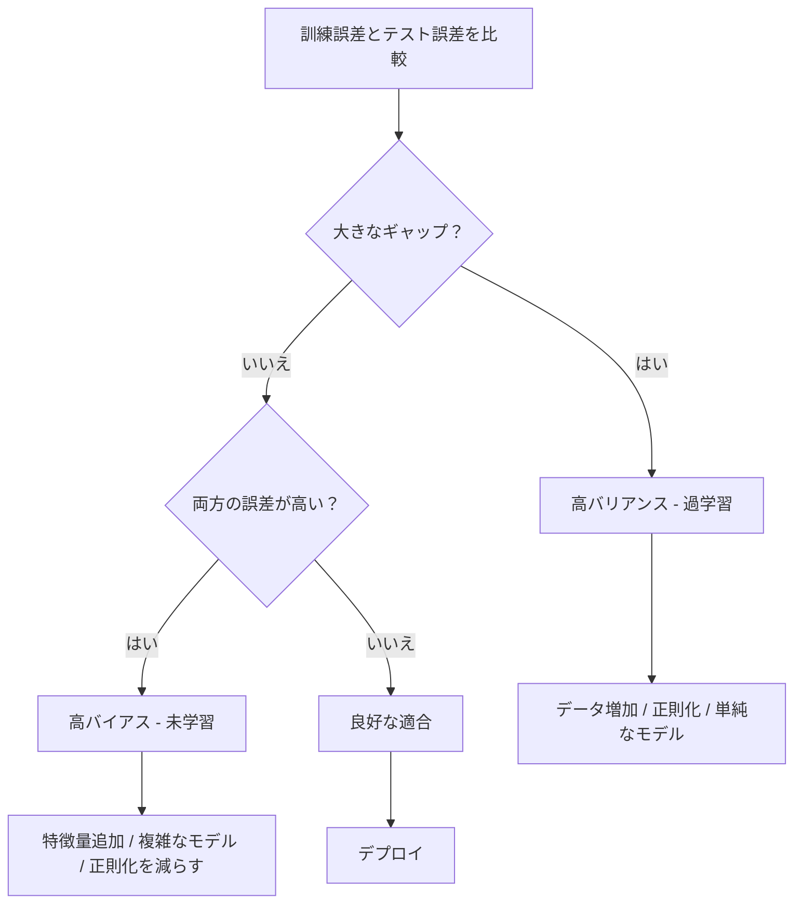
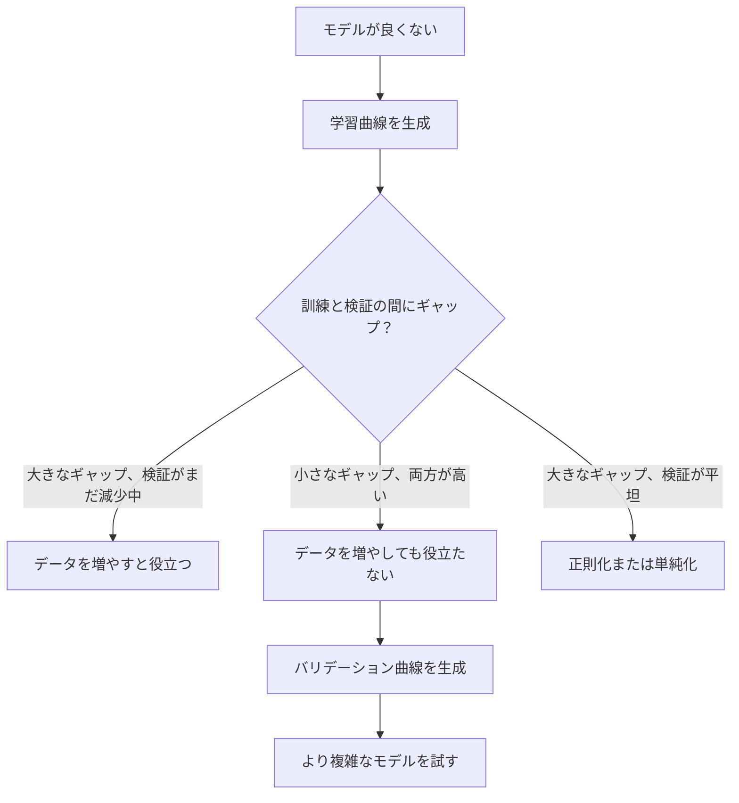

# バイアス・バリアンストレードオフ

> モデルの誤差は必ず3つの源泉のいずれかから生じる：バイアス、バリアンス、ノイズ。制御できるのは最初の2つだけだ。


## 学習目標

- 期待予測誤差のバイアス・バリアンス分解を導出し、既約ノイズの役割を説明する
- 訓練誤差とテスト誤差のパターンを使って、モデルが高バイアスか高バリアンスかを診断する
- 正則化技術（L1、L2、ドロップアウト、早期停止）がどのようにバイアスをバリアンスと引き換えにするかを説明する
- 複雑度が増加するモデル群においてバイアス・バリアンストレードオフを可視化する実験を実装する

## 問題

モデルを訓練した。テストデータにいくらかの誤差がある。その誤差はどこから来るのか？

モデルが単純すぎる場合（曲線データセットに対する線形回帰）、真のパターンを常に外し続ける。これがバイアスだ。モデルが複雑すぎる場合（15データ点に対する20次多項式）、訓練データには完全に適合するが、新しいデータでは全く異なる予測を出す。これがバリアンスだ。

固定モデル容量のまま両方を同時に最小化することはできない。バイアスを下げるとバリアンスが上がる。バリアンスを下げるとバイアスが上がる。このトレードオフを理解することは機械学習において最も有用な診断スキルだ。モデルをより複雑にすべきか単純にすべきか、データをもっと取得すべきかより良い特徴量を設計すべきか、正則化を増やすべきか減らすべきかを教えてくれる。

## コンセプト

### バイアス：系統的誤差

バイアスは、モデルの平均予測値が真の値からどれだけ離れているかを測る。同じ分布から引き出した多くの異なる訓練セットで同じモデルを訓練して予測を平均したとき、バイアスはその平均と真値とのギャップだ。

高バイアスは、モデルが実際のパターンを捉えるには硬すぎることを意味する。放物線に直線を当てはめると、どれだけデータを与えても常に曲線を外し続ける。これが未学習（アンダーフィッティング）だ。

```
高バイアス（未学習）：
  モデルは常に同じような間違いを予測する。
  訓練誤差：高
  テスト誤差：高
  両者のギャップ：小
```

### バリアンス：訓練データへの感度

バリアンスは、異なるデータのサブセットで訓練したときに予測がどれだけ変化するかを測る。訓練セットの小さな変化がモデルの大きな変化を引き起こすなら、バリアンスは高い。

高バリアンスは、モデルが基礎にあるシグナルではなく訓練データのノイズに適合していることを意味する。20次多項式はすべての訓練点を通り抜けるが、その間で激しく振動する。これが過学習（オーバーフィッティング）だ。

```
高バリアンス（過学習）：
  モデルは訓練データに完璧に適合するが新しいデータでは失敗する。
  訓練誤差：低
  テスト誤差：高
  両者のギャップ：大
```

### 分解式

任意の点 x において、二乗損失のもとでの期待予測誤差は正確に分解できる：

```
期待誤差 = Bias^2 + Variance + 既約ノイズ

ここで：
  Bias^2   = (E[f_hat(x)] - f(x))^2
  Variance = E[(f_hat(x) - E[f_hat(x)])^2]
  Noise    = E[(y - f(x))^2]             (sigma^2)
```

- `f(x)` は真の関数
- `f_hat(x)` はモデルの予測
- `E[...]` は異なる訓練セットにわたる期待値
- `y` は観測ラベル（真の関数にノイズを加えたもの）

ノイズ項は既約だ。ノイズのあるデータでは、どんなモデルも sigma^2 より良くはできない。あなたの仕事は Bias^2 とバリアンスの適切なバランスを見つけることだ。

### モデルの複雑度と誤差


古典的なU字型カーブ：

| 複雑度 | バイアス | バリアンス | 総誤差 |
|--------|---------|-----------|--------|
| 低すぎる | 高 | 低 | 高（未学習） |
| 適切 | 中程度 | 中程度 | 最低 |
| 高すぎる | 低 | 高 | 高（過学習） |

### バイアス・バリアンス制御としての正則化

正則化はバリアンスを減らすためにバイアスを意図的に増やす。モデルがノイズを追いかけられないよう制約する。

- **L2（リッジ）：** すべての重みをゼロに向けて縮小する。全特徴量を保持しつつその影響を減らす。
- **L1（ラッソ）：** 一部の重みをちょうどゼロに押しやる。特徴量選択を行う。
- **ドロップアウト：** 訓練中にランダムにニューロンを無効化する。冗長な表現を強制する。
- **早期停止：** モデルが訓練データに完全適合する前に訓練を停止する。

正則化の強度（lambda、ドロップアウト率、エポック数）は、バイアス・バリアンスカーブ上の位置を直接制御する。正則化が強いほどバイアスが増え、バリアンスが減る。

### 二重降下：現代的視点

古典的理論では：スイートスポットを超えた後、複雑度が増すほど常に悪化すると言われる。しかし2019年以降の研究により、予想外のことが判明した。モデルの容量を補間閾値（モデルが訓練データを完全に適合できるだけのパラメータを持つ点）をはるかに超えて増やし続けると、テスト誤差が再び減少する可能性がある。


この「二重降下」現象は、大規模に過パラメータ化されたニューラルネットワーク（訓練サンプル数をはるかに超えるパラメータを持つ）がなぜ汎化できるかを説明する。古典的なバイアス・バリアンストレードオフは間違いではないが、現代的な領域では不完全だ。

二重降下に関する主要な観察：
- 線形モデル、決定木、ニューラルネットワークで起きる
- 補間領域ではデータを増やすと実際に悪化することがある（サンプル単位の二重降下）
- 訓練エポックを増やしても引き起こされる（エポック単位の二重降下）
- 正則化によりピークは平滑化されるが消えるわけではない

なぜこれが起きるのか？補間閾値では、モデルはすべての訓練点を適合するにちょうど十分な容量を持つ。すべての点を通り抜ける非常に特殊な解に強制され、データの小さな摂動が適合の大きな変化を引き起こす。これがバリアンスがピークに達する場所だ。閾値を超えると、モデルはデータに完全に適合する多くの解候補を持つ。学習アルゴリズム（例：暗黙の正則化を持つ勾配降下法）はそれらの中で最も単純なものを選ぶ傾向がある。シンプルな解への暗黙のバイアスが、過パラメータ化モデルが汎化する理由だ。

| 領域 | パラメータ vs サンプル | 挙動 |
|------|---------------------|------|
| 過少パラメータ | p << n | 古典的トレードオフが適用 |
| 補間閾値 | p ~ n | バリアンスがピーク、テスト誤差がスパイク |
| 過剰パラメータ | p >> n | 暗黙の正則化が機能し、テスト誤差が下がる |

実践的には：ニューラルネットワークや大規模ツリーアンサンブルを使う場合、補間閾値で止めないこと。明示的な正則化でその大幅に下に留めるか、大幅に超えるかのどちらかにする。最悪の場所は閾値のちょうど上だ。

### モデルの診断



| 症状 | 診断 | 対処法 |
|------|------|--------|
| 訓練誤差高、テスト誤差高 | バイアス | 特徴量追加、複雑なモデル、正則化を減らす |
| 訓練誤差低、テスト誤差高 | バリアンス | データ増加、正則化、単純なモデル、ドロップアウト |
| 訓練誤差低、テスト誤差低 | 良好な適合 | リリースする |
| 訓練誤差が下がり、テスト誤差が上がる | 過学習が進行中 | 早期停止 |

### 実践的な戦略

**バイアスが問題の場合：**
- 多項式特徴量や交互作用特徴量を追加する
- より柔軟なモデルを使用する（線形モデルの代わりにツリーアンサンブル）
- 正則化の強度を下げる
- もし収束していなければ長く訓練する

**バリアンスが問題の場合：**
- 訓練データを増やす
- バギングを使用する（ランダムフォレスト）
- 正則化を増やす（より高い lambda、より多いドロップアウト）
- 特徴量選択（ノイズの多い特徴量を除去）
- 早期検出にクロスバリデーションを使用する

### アンサンブル手法とバリアンス削減

アンサンブル手法はバリアンスと戦うための最も実用的なツールだ。

**バギング（ブートストラップ集約）** は、訓練データの異なるブートストラップサンプルで複数のモデルを訓練し、その予測を平均する。個々のモデルは高バリアンスを持つが、平均はバリアンスが大幅に低くなる。ランダムフォレストは決定木に適用されたバギングだ。

数学的になぜ機能するか：各バリアンス sigma^2 を持つN個の独立した予測を平均すると、平均のバリアンスは sigma^2 / N になる。モデルは真に独立ではない（すべて似たデータを見る）ので削減は 1/N より少ないが、それでも実質的だ。

**ブースティング** はモデルを順次構築し、各新しいモデルがこれまでのアンサンブルの誤差に焦点を当てることでバイアスを減らす。勾配ブースティングとAdaBoostが主な例だ。ブースティングはモデルを追加しすぎると過学習する可能性があるため、早期停止または正則化が必要だ。

| 手法 | 主な効果 | バイアス変化 | バリアンス変化 |
|------|---------|------------|--------------|
| バギング | バリアンス削減 | 変化なし | 減少 |
| ブースティング | バイアス削減 | 減少 | 増加の可能性 |
| スタッキング | 両方削減 | メタ学習器次第 | ベースモデル次第 |
| ドロップアウト | 暗黙のバギング | わずかに増加 | 減少 |

**実践ルール：** ベースモデルが高バリアンスを持つ場合（深いツリー、高次多項式）はバギングを使用する。ベースモデルが高バイアスを持つ場合（浅いスタンプ、単純な線形モデル）はブースティングを使用する。

### 学習曲線

学習曲線は訓練セットのサイズの関数として訓練誤差と検証誤差をプロットする。これは手元にある最も実用的な診断ツールだ。単一の訓練/テスト比較とは異なり、学習曲線はモデルの軌跡を示し、データを増やすことが役立つかどうかを教えてくれる。


読み方：

| シナリオ | 訓練誤差 | 検証誤差 | ギャップ | 意味 | 対処法 |
|---------|---------|---------|---------|------|--------|
| 高バイアス | 高 | 高 | 小 | モデルがパターンを捉えられない | 特徴量追加、複雑なモデル、正則化を減らす |
| 高バリアンス | 低 | 高 | 大 | モデルが訓練データを暗記している | データ増加、正則化、単純なモデル |
| 良好な適合 | 中程度 | 中程度 | 小 | モデルが良好に汎化している | リリースする |
| 高バリアンス・改善中 | 低 | データ増加で減少 | 縮小中 | データで解決できるバリアンス問題 | データを収集する |
| 高バイアス・平坦 | 高 | 高くて平坦 | 小くて平坦 | データ追加は役に立たない | モデルアーキテクチャを変更する |

重要な洞察：両方の曲線がプラトーに達していてギャップが小さいが両方の誤差が高い場合、データを増やしても無駄だ。より良いモデルが必要だ。ギャップが大きくてまだ縮小中なら、データを増やすことが役立つ。

### 学習曲線の生成方法

2つのアプローチがある：

**アプローチ1：訓練セットサイズを変化、モデルは固定。** モデルとハイパーパラメータを一定に保つ。訓練データの増加するサブセットで訓練する。各サイズで訓練誤差と検証誤差を測定する。これが標準的な学習曲線だ。

**アプローチ2：モデルの複雑度を変化、データは固定。** データを一定に保つ。複雑度パラメータ（多項式の次数、ツリーの深さ、層数）を変化させる。各複雑度で訓練誤差と検証誤差を測定する。これはバリデーション曲線であり、バイアス・バリアンストレードオフを直接示す。

両アプローチは補完的だ。最初のアプローチはデータを増やすことが役立つかを教える。2番目のアプローチは異なるモデルが役立つかを教える。次のステップについて決定する前に両方を実行すること。



## 実装する

`code/bias_variance.py` のコードは完全なバイアス・バリアンス分解実験を実行する。ステップバイステップのアプローチを示す。

### ステップ1：既知の関数から合成データを生成する

真の関数がわかっているとバイアスとバリアンスを正確に計算できるため、`f(x) = sin(1.5x) + 0.5x` とガウスノイズを使用する。

```python
def true_function(x):
    return np.sin(1.5 * x) + 0.5 * x

def generate_data(n_samples=30, noise_std=0.5, x_range=(-3, 3), seed=None):
    rng = np.random.RandomState(seed)
    x = rng.uniform(x_range[0], x_range[1], n_samples)
    y = true_function(x) + rng.normal(0, noise_std, n_samples)
    return x, y
```

### ステップ2：ブートストラップサンプリングと多項式フィッティング

各多項式次数について、多くのブートストラップ訓練セットを引き出し、多項式を当てはめ、固定テストグリッド上での予測を記録する。これにより各テスト点での予測の分布が得られる。

```python
def fit_polynomial(x_train, y_train, degree, lam=0.0):
    X = np.column_stack([x_train ** d for d in range(degree + 1)])
    if lam > 0:
        penalty = lam * np.eye(X.shape[1])
        penalty[0, 0] = 0
        w = np.linalg.solve(X.T @ X + penalty, X.T @ y_train)
    else:
        w = np.linalg.lstsq(X, y_train, rcond=None)[0]
    return w
```

200個の異なるブートストラップサンプルで適合する。各ブートストラップサンプルは同じ基礎分布から引き出されるが、異なる点を含む。

### ステップ3：Bias^2、バリアンス分解の計算

各テスト点での200組の予測があれば、定義から直接分解を計算できる：

```python
mean_pred = predictions.mean(axis=0)
bias_sq = np.mean((mean_pred - y_true) ** 2)
variance = np.mean(predictions.var(axis=0))
total_error = np.mean(np.mean((predictions - y_true) ** 2, axis=1))
```

- `mean_pred` はブートストラップサンプルから推定した E[f_hat(x)]
- `bias_sq` は平均予測と真値のギャップの二乗
- `variance` はブートストラップサンプル間での予測の平均拡がり
- `total_error` は近似的に bias^2 + variance + noise と等しくなるはず

### ステップ4：学習曲線

学習曲線はモデルの複雑度を固定しつつ訓練セットサイズを変化させる。モデルがデータ制限か容量制限かを示す。

```python
def demo_learning_curves():
    sizes = [10, 15, 20, 30, 50, 75, 100, 150, 200, 300]
    degree = 5

    for n in sizes:
        train_errors = []
        test_errors = []
        for seed in range(50):
            x_train, y_train = generate_data(n_samples=n, seed=seed * 100)
            w = fit_polynomial(x_train, y_train, degree)
            train_pred = predict_polynomial(x_train, w)
            train_mse = np.mean((train_pred - y_train) ** 2)
            test_pred = predict_polynomial(x_test, w)
            test_mse = np.mean((test_pred - y_test) ** 2)
            train_errors.append(train_mse)
            test_errors.append(test_mse)
        # 実行の平均が学習曲線の点を与える
```

高バリアンスモデル（小データでの5次）では：
- 訓練誤差は低い状態から始まり、データが増えるにつれ暗記が難しくなるため上昇する
- テスト誤差は高い状態から始まり、モデルがより多くのシグナルを得るにつれ減少する
- ギャップはデータ増加とともに縮まる

高バイアスモデル（1次）では、両方の誤差は素早く同じ高い値に収束し、データを増やしても役に立たない。

### ステップ5：正則化スイープ

コードには `demo_regularization_sweep()` も含まれており、高次多項式（15次）を固定してリッジ正則化の強度を0.001から100まで変化させる。これは異なる角度からバイアス・バリアンストレードオフを示す：モデルの複雑度を変えるのではなく、制約の強度を変える。

```python
def demo_regularization_sweep():
    alphas = [0.001, 0.005, 0.01, 0.05, 0.1, 0.5, 1.0, 5.0, 10.0, 50.0, 100.0]
    for alpha in alphas:
        results = bias_variance_decomposition([15], lam=alpha)
        r = results[15]
        print(f"alpha={alpha:.3f}  bias={r['bias_sq']:.4f}  var={r['variance']:.4f}")
```

低い alpha では、15次多項式はほぼ無制約だ。モデルが各ブートストラップサンプルのノイズを追いかけるため、バリアンスが支配的になる。高い alpha では、ペナルティが非常に強いためモデルは実質的にほぼ定数関数になる。バイアスが支配的になる。最適な alpha はこれら極端の中間にある。

これは多項式次数を変えるときと同じU字型カーブだが、離散的なものではなく連続的なノブで制御される。実践的には、正則化は特徴量セットを変えることなく細かい制御ができるため、トレードオフを制御する好ましい方法だ。

## 使う

sklearnは `learning_curve` と `validation_curve` を提供し、ブートストラップループを書かずにこれらの診断を自動化できる。

### バリデーション曲線：モデルの複雑度を変化させる

```python
from sklearn.model_selection import validation_curve
from sklearn.pipeline import make_pipeline
from sklearn.preprocessing import PolynomialFeatures
from sklearn.linear_model import Ridge

degrees = list(range(1, 16))
train_scores_all = []
val_scores_all = []

for d in degrees:
    pipe = make_pipeline(PolynomialFeatures(d), Ridge(alpha=0.01))
    train_scores, val_scores = validation_curve(
        pipe, X, y, param_name="polynomialfeatures__degree",
        param_range=[d], cv=5, scoring="neg_mean_squared_error"
    )
    train_scores_all.append(-train_scores.mean())
    val_scores_all.append(-val_scores.mean())
```

これによりバイアス・バリアンストレードオフカーブが直接得られる。訓練スコアに対して検証スコアが最も悪い場所では、バリアンスが支配的だ。両方が悪い場所では、バイアスが支配的だ。

### 学習曲線：訓練セットサイズを変化させる

```python
from sklearn.model_selection import learning_curve

pipe = make_pipeline(PolynomialFeatures(5), Ridge(alpha=0.01))
train_sizes, train_scores, val_scores = learning_curve(
    pipe, X, y, train_sizes=np.linspace(0.1, 1.0, 10),
    cv=5, scoring="neg_mean_squared_error"
)
train_mse = -train_scores.mean(axis=1)
val_mse = -val_scores.mean(axis=1)
```

`train_mse` と `val_mse` を `train_sizes` に対してプロットする。形状からモデルについてのすべてがわかる。

### 正則化スイープとクロスバリデーション

```python
from sklearn.model_selection import cross_val_score

alphas = [0.001, 0.01, 0.1, 1.0, 10.0, 100.0]
for alpha in alphas:
    pipe = make_pipeline(PolynomialFeatures(10), Ridge(alpha=alpha))
    scores = cross_val_score(pipe, X, y, cv=5, scoring="neg_mean_squared_error")
    print(f"alpha={alpha:>7.3f}  MSE={-scores.mean():.4f} +/- {scores.std():.4f}")
```

これは固定モデル複雑度に対して正則化の強度を変化させる。同じバイアス・バリアンストレードオフが見られる：低い alpha は高バリアンス、高い alpha は高バイアス。

### まとめ：完全な診断ワークフロー

実践では、これらの診断を順番に実行する：

1. モデルを訓練する。訓練誤差とテスト誤差を計算する。
2. 両方が高い場合：バイアスの問題がある。ステップ4へ。
3. 訓練が低いがテストが高い場合：バリアンスの問題がある。データを増やすことが役立つかを見るために学習曲線を生成する。役立たない場合は正則化する。
4. 主な複雑度パラメータを変化させたバリデーション曲線を生成する。スイートスポットを見つける。
5. スイートスポットで学習曲線を生成する。ギャップがまだ大きければ、データが必要か正則化が必要だ。
6. `cross_val_score` を使って異なる alpha 値でリッジ/ラッソを試す。クロスバリデーション誤差が最低のalphaを選ぶ。

ほとんどの表形式データセットでは10〜15分の計算で、何時間もの推測を節約できる。

## 出荷する

このレッスンの成果物：`outputs/prompt-model-diagnostics.md`

## 演習

1. `noise_std=0`（ノイズなし）で分解を実行する。既約誤差の項に何が起きるか？最適な複雑度は変化するか？

2. 訓練セットのサイズを30から300に増やす。バリアンス成分にどう影響するか？最適な多項式次数はシフトするか？

3. 実験にL2正則化（リッジ回帰）を追加する。固定した高次多項式（15次）に対して、lambdaを0から100まで変化させる。Bias^2とバリアンスをlambdaの関数としてプロットする。

4. 真の関数を多項式から `sin(x)` に変更する。バイアス・バリアンス分解はどう変わるか？明確な最適次数はまだあるか？

5. 単純なブートストラップ集約（バギング）ラッパーを実装する：ブートストラップサンプルで10個のモデルを訓練して予測を平均する。これがバイアスをそれほど増やさずにバリアンスを減らすことを示す。

## 主要用語

| 用語 | 人々がよく言うこと | 実際の意味 |
|------|----------------|-----------|
| バイアス | 「モデルが単純すぎる」 | 誤った仮定からの系統的誤差。平均モデル予測と真値のギャップ。 |
| バリアンス | 「モデルが過学習している」 | 訓練データへの感度からの誤差。異なる訓練セット間での予測の変化量。 |
| 既約誤差 | 「データのノイズ」 | 真のデータ生成プロセスのランダム性からの誤差。どんなモデルも除去できない。 |
| 未学習 | 「十分に学習できていない」 | モデルが高バイアスを持つ。訓練データ上でさえ実際のパターンを外す。 |
| 過学習 | 「データを暗記している」 | モデルが高バリアンスを持つ。汎化しない訓練データのノイズに適合する。 |
| 正則化 | 「モデルを制約する」 | モデルの複雑度を減らすペナルティを追加し、低いバリアンスのためにバイアスをトレードする。 |
| 二重降下 | 「パラメータが多い方が役立つ」 | モデル容量が補間閾値をはるかに超えると、テスト誤差が再び減少する。 |
| モデルの複雑度 | 「モデルの柔軟性」 | 任意のパターンに適合するモデルの能力。アーキテクチャ、特徴量、または正則化で制御。 |

## さらに読む

- [Hastie, Tibshirani, Friedman: Elements of Statistical Learning, Ch. 7](https://hastie.su.domains/ElemStatLearn/) -- バイアス・バリアンス分解の決定的な扱い
- [Belkin et al., Reconciling modern machine learning practice and the bias-variance trade-off (2019)](https://arxiv.org/abs/1812.11118) -- 二重降下の論文
- [Nakkiran et al., Deep Double Descent (2019)](https://arxiv.org/abs/1912.02292) -- エポック単位とサンプル単位の二重降下
- [Scott Fortmann-Roe: Understanding the Bias-Variance Tradeoff](http://scott.fortmann-roe.com/docs/BiasVariance.html) -- 明快な視覚的説明
