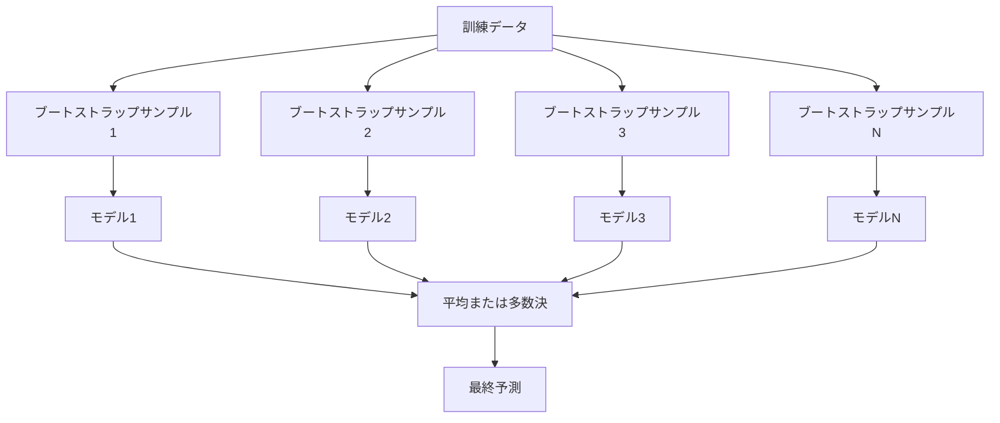
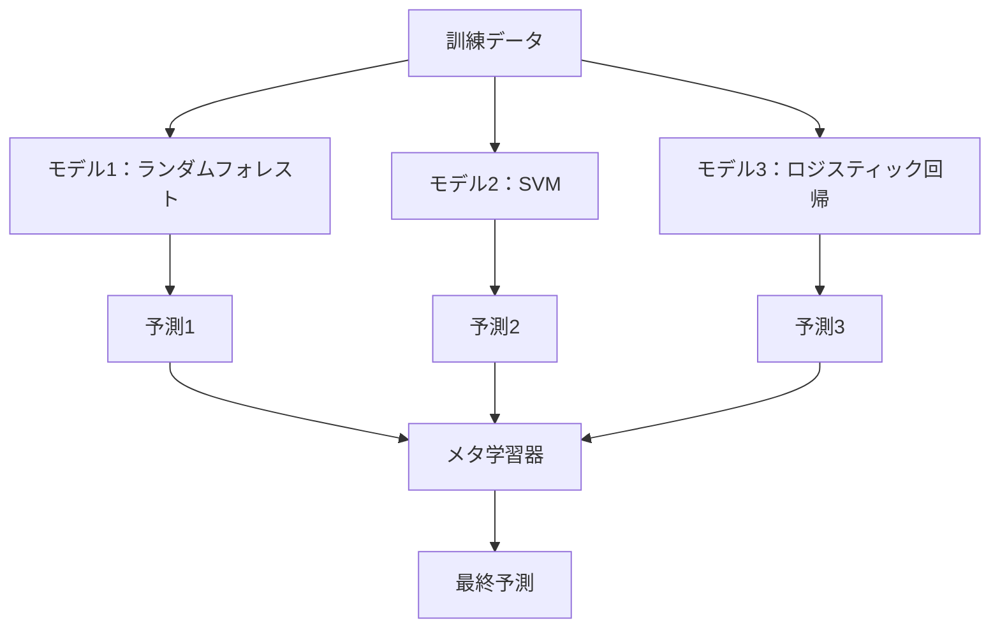

# アンサンブル手法

> 弱い学習器のグループも正しく組み合わせると強い学習器になる。これは比喩ではない。定理だ。


## 学習目標

- AdaBoostと勾配ブースティングをスクラッチから実装し、ブースティングがバイアスを順次削減する方法を説明する
- バギングアンサンブルを構築し、無相関モデルの平均化がバイアスを増やさずにバリアンスを削減することを実証する
- バギング、ブースティング、スタッキングをそれぞれが対象とする誤差成分の観点から比較する
- アンサンブルの多様性を評価し、独立した弱い学習器が増えるにつれて多数決の精度がなぜ向上するかを説明する

## 問題

単一の決定木は訓練が速くて解釈しやすいが、過学習する。単一の線形モデルは複雑な境界では未学習になる。完璧なモデルアーキテクチャを設計するのに何日も費やすこともできる。あるいは不完全なモデルの束を組み合わせて、それらのいずれよりも良いものを得ることができる。

アンサンブル手法はまさにこれを行う。Kaggleコンペティションで表形式データを勝ち抜くための最も信頼できる技術であり、ほとんどの本番MLシステムを支えており、バイアス・バリアンストレードオフを実際に示している。バギングはバリアンスを削減する。ブースティングはバイアスを削減する。スタッキングはどのモデルをどの入力に信頼するかを学習する。

## コンセプト

### アンサンブルが機能する理由

精度 p > 0.5 のN個の独立した分類器があるとする。多数決の精度は：

```
P(多数決が正しい) = k > N/2 の sum C(N,k) * p^k * (1-p)^(N-k)
```

各60%精度の21個の分類器について、多数決の精度は約74%だ。101個の分類器では84%に上がる。モデルが異なるミスを犯すとき、誤差は打ち消し合う。

重要な要件は**多様性**だ。すべてのモデルが同じ誤差を犯すなら、組み合わせても何も役に立たない。アンサンブルは次の手段で多様なモデルを生成することで機能する：

- 異なる訓練サブセット（バギング）
- 異なる特徴量サブセット（ランダムフォレスト）
- 順次誤差修正（ブースティング）
- 異なるモデルファミリー（スタッキング）

### バギング（ブートストラップ集約）

バギングは各モデルを訓練データの異なるブートストラップサンプルで訓練することで多様性を生み出す。



ブートストラップサンプルは元のデータから復元抽出で引き出され、元と同じサイズだ。ユニークなサンプルの約63.2%が各ブートストラップに含まれる。残りの36.8%（バッグ外サンプル）は無料の検証セットとなる。

バギングはバイアスをあまり増やさずにバリアンスを削減する。個々のツリーはそれぞれのブートストラップサンプルに過学習するが、過学習の仕方が各ツリーで異なるため、平均化によってノイズが打ち消される。

**ランダムフォレスト**はバギングに追加のひねりを加えたものだ：各分割で、特徴量のランダムなサブセットのみが考慮される。これによりツリー間でさらに多様性が生まれる。候補特徴量の典型的な数は、分類では `sqrt(n_features)`、回帰では `n_features / 3` だ。

### ブースティング（順次誤差修正）

ブースティングはモデルを順次訓練する。各新しいモデルは、前のモデルが間違えた例に焦点を当てる。


ブースティングはバイアスを削減する。各新しいモデルはこれまでのアンサンブルの系統的誤差を修正する。最終予測はすべてのモデルの重み付き合計であり、より良いモデルほど高い重みが与えられる。

トレードオフ：ブースティングはラウンドを実行しすぎると過学習する可能性がある。なぜならより難しい例、その一部はノイズかもしれない例を適合し続けるためだ。

### AdaBoost

AdaBoost（適応ブースティング）は最初の実用的なブースティングアルゴリズムだ。任意のベース学習器、典型的には決定スタンプ（深さ1のツリー）で機能する。

アルゴリズム：

```
1. サンプル重みを初期化：w_i = 1/N（すべてのiについて）

2. t = 1 から T まで：
   a. 重み付きデータで弱い学習器 h_t を訓練
   b. 重み付き誤差を計算：
      err_t = sum(w_i * I(h_t(x_i) != y_i)) / sum(w_i)
   c. モデル重みを計算：
      alpha_t = 0.5 * ln((1 - err_t) / err_t)
   d. サンプル重みを更新：
      w_i = w_i * exp(-alpha_t * y_i * h_t(x_i))
   e. 合計が1になるよう重みを正規化

3. 最終予測：H(x) = sign(sum(alpha_t * h_t(x)))
```

誤差が低いモデルほど高い alpha が与えられる。誤分類されたサンプルほど次のモデルがそれらに集中するよう高い重みが与えられる。

### 勾配ブースティング

勾配ブースティングはブースティングを任意の損失関数に一般化する。サンプルを再重み付けする代わりに、各新しいモデルを現在のアンサンブルの残差（損失の負の勾配）に適合させる。

```
1. 初期化：F_0(x) = argmin_c sum(L(y_i, c))

2. t = 1 から T まで：
   a. 擬似残差を計算：
      r_i = -dL(y_i, F_{t-1}(x_i)) / dF_{t-1}(x_i)
   b. 残差 r_i にツリー h_t を適合
   c. 最適なステップサイズを求める：
      gamma_t = argmin_gamma sum(L(y_i, F_{t-1}(x_i) + gamma * h_t(x_i)))
   d. 更新：
      F_t(x) = F_{t-1}(x) + learning_rate * gamma_t * h_t(x)

3. 最終予測：F_T(x)
```

二乗誤差損失の場合、擬似残差はちょうど実際の残差だ：`r_i = y_i - F_{t-1}(x_i)`。各ツリーは文字通り前のアンサンブルの誤差に適合する。

学習率（縮小）は各ツリーがどれだけ寄与するかを制御する。学習率が小さいほど多くのツリーが必要だが汎化が良くなる。典型的な値：0.01〜0.3。

### XGBoost：なぜ表形式データを支配するのか

XGBoost（eXtreme Gradient Boosting）は、高速で正確で過学習に強い工学的最適化を持つ勾配ブースティングだ：

- **正則化された目的関数：** 葉の重みにL1とL2ペナルティを付け、個々のツリーが過信するのを防ぐ
- **二次近似：** 損失の一次と二次の両方の導関数を使用し、より良い分割決定を与える
- **スパース対応分割：** 欠損値を、各分割で欠損データの最適な方向を学習することでネイティブに処理する
- **列サブサンプリング：** ランダムフォレストと同様、多様性のために各分割で特徴量をサンプリングする
- **重み付き分位点スケッチ：** 分散データの連続特徴量に対して効率的に分割点を見つける
- **キャッシュ対応ブロック構造：** CPUキャッシュラインに最適化されたメモリレイアウト

表形式データでは、XGBoost（およびその後継のLightGBM）はニューラルネットワークを一貫して上回る。これはすぐには変わらない。データが行と列のテーブルに収まるなら、勾配ブースティングから始めよう。

### スタッキング（メタ学習）

スタッキングは複数のベースモデルの予測をメタ学習器の特徴量として使用する。



メタ学習器はどの入力にどのベースモデルを信頼するかを学習する。ランダムフォレストがある領域で優れていてSVMが他の領域で優れている場合、メタ学習器は適切にルーティングする方法を学習する。

データ漏洩を避けるため、ベースモデルの予測は訓練セットに対してクロスバリデーションで生成される。ベースモデルを訓練してメタ特徴量を生成するのに同じデータは使わない。

### 投票

最もシンプルなアンサンブル。予測を直接組み合わせる。

- **ハード投票：** クラスラベルの多数決。
- **ソフト投票：** 予測確率を平均し、最も高い平均確率のクラスを選ぶ。確信度情報を使用するため通常こちらの方が良い。

## 実装する

### ステップ1：決定スタンプ（ベース学習器）

`code/ensembles.py` のコードはすべてをスクラッチから実装する。単一の分割を持つツリーである決定スタンプから始める。

```python
class DecisionStump:
    def __init__(self):
        self.feature_idx = None
        self.threshold = None
        self.polarity = 1
        self.alpha = None

    def fit(self, X, y, weights):
        n_samples, n_features = X.shape
        best_error = float("inf")

        for f in range(n_features):
            thresholds = np.unique(X[:, f])
            for thresh in thresholds:
                for polarity in [1, -1]:
                    pred = np.ones(n_samples)
                    pred[polarity * X[:, f] < polarity * thresh] = -1
                    error = np.sum(weights[pred != y])
                    if error < best_error:
                        best_error = error
                        self.feature_idx = f
                        self.threshold = thresh
                        self.polarity = polarity

    def predict(self, X):
        n = X.shape[0]
        pred = np.ones(n)
        idx = self.polarity * X[:, self.feature_idx] < self.polarity * self.threshold
        pred[idx] = -1
        return pred
```

### ステップ2：AdaBoostをスクラッチから実装

```python
class AdaBoostScratch:
    def __init__(self, n_estimators=50):
        self.n_estimators = n_estimators
        self.stumps = []
        self.alphas = []

    def fit(self, X, y):
        n = X.shape[0]
        weights = np.full(n, 1 / n)

        for _ in range(self.n_estimators):
            stump = DecisionStump()
            stump.fit(X, y, weights)
            pred = stump.predict(X)

            err = np.sum(weights[pred != y])
            err = np.clip(err, 1e-10, 1 - 1e-10)

            alpha = 0.5 * np.log((1 - err) / err)
            weights *= np.exp(-alpha * y * pred)
            weights /= weights.sum()

            stump.alpha = alpha
            self.stumps.append(stump)
            self.alphas.append(alpha)

    def predict(self, X):
        total = sum(a * s.predict(X) for a, s in zip(self.alphas, self.stumps))
        return np.sign(total)
```

### ステップ3：勾配ブースティングをスクラッチから実装

```python
class GradientBoostingScratch:
    def __init__(self, n_estimators=100, learning_rate=0.1, max_depth=3):
        self.n_estimators = n_estimators
        self.lr = learning_rate
        self.max_depth = max_depth
        self.trees = []
        self.initial_pred = None

    def fit(self, X, y):
        self.initial_pred = np.mean(y)
        current_pred = np.full(len(y), self.initial_pred)

        for _ in range(self.n_estimators):
            residuals = y - current_pred
            tree = SimpleRegressionTree(max_depth=self.max_depth)
            tree.fit(X, residuals)
            update = tree.predict(X)
            current_pred += self.lr * update
            self.trees.append(tree)

    def predict(self, X):
        pred = np.full(X.shape[0], self.initial_pred)
        for tree in self.trees:
            pred += self.lr * tree.predict(X)
        return pred
```

### ステップ4：sklearnとの比較

コードは、スクラッチから実装したものがsklearnの `AdaBoostClassifier` と `GradientBoostingClassifier` に近い精度を出すことを検証し、全手法を並べて比較する。

## 使う

### 各手法をいつ使うか

| 手法 | 削減するもの | 最適な用途 | 注意点 |
|------|------------|----------|--------|
| バギング / ランダムフォレスト | バリアンス | ノイズの多いデータ、多数の特徴量 | バイアスには役立たない |
| AdaBoost | バイアス | クリーンなデータ、シンプルなベース学習器 | 外れ値とノイズに敏感 |
| 勾配ブースティング | バイアス | 表形式データ、コンペティション | 訓練が遅く、チューニングなしで過学習しやすい |
| XGBoost / LightGBM | 両方 | 本番の表形式ML | ハイパーパラメータが多い |
| スタッキング | 両方 | 最後の1〜2%の精度を得る | 複雑で、メタ学習器の過学習リスクあり |
| 投票 | バリアンス | 多様なモデルの素早い組み合わせ | モデルが多様な場合のみ役立つ |

### 表形式データの本番スタック

ほとんどの表形式予測問題では、以下の順で試す：

1. デフォルトパラメータで **LightGBM または XGBoost**
2. n_estimators、learning_rate、max_depth、min_child_weight をチューニング
3. 最後の0.5%が必要なら3〜5個の多様なモデルでスタッキングアンサンブルを構築
4. 全体でクロスバリデーションを使用する

表形式データにおけるニューラルネットワークは、継続的な研究の試みにもかかわらず、ほぼ常に勾配ブースティングより悪い。TabNet、NODE、および類似のアーキテクチャは時々並ぶことはあるが、うまくチューニングされたXGBoostを上回ることは稀だ。

## 出荷する

このレッスンは `outputs/prompt-ensemble-selector.md` を生成する -- 与えられたデータセットに対して適切なアンサンブル手法を選ぶためのプロンプト。データ（サイズ、特徴量タイプ、ノイズレベル、クラスバランス）と解くべき問題を説明する。プロンプトは決定チェックリストを進め、手法を推薦し、推奨の開始ハイパーパラメータを提示し、その手法の一般的なミスについて警告する。また `outputs/skill-ensemble-builder.md` に完全な選択ガイドを生成する。

## 演習

1. AdaBoostの実装を修正して各ラウンド後の訓練精度を追跡する。精度 vs 推定器数をプロットする。いつ収束するか？

2. 回帰ツリーにランダムな特徴量サブサンプリングを追加してランダムフォレストをスクラッチから実装する。`max_features=sqrt(n_features)` で100個のツリーを訓練して予測を平均する。単一ツリーと比べてバリアンスの削減を比較する。

3. 勾配ブースティングの実装に早期停止を追加する：各ラウンド後に検証損失を追跡し、10連続ラウンドで改善がなければ停止する。実際には何個のツリーが必要か？

4. 3つのベースモデル（ロジスティック回帰、決定木、k最近傍法）とロジスティック回帰メタ学習器でスタッキングアンサンブルを構築する。5分割クロスバリデーションでメタ特徴量を生成する。各ベースモデル単独と比較する。

5. 同じデータセットにデフォルトパラメータでXGBoostを実行する。スクラッチの勾配ブースティングと精度を比較する。両方のタイムを計測する。速度差はどれほどか？

## 主要用語

| 用語 | 人々がよく言うこと | 実際の意味 |
|------|----------------|-----------|
| バギング | 「ランダムサブセットで訓練する」 | ブートストラップ集約：ブートストラップサンプルでモデルを訓練し、予測を平均してバリアンスを削減する |
| ブースティング | 「難しい例に集中する」 | モデルを順次訓練し、各モデルがこれまでのアンサンブルの誤差を修正してバイアスを削減する |
| AdaBoost | 「データを再重み付けする」 | サンプル重み更新によるブースティング；誤分類された点は次の学習器のためにより高い重みを得る |
| 勾配ブースティング | 「残差に適合する」 | 各新しいモデルを損失関数の負の勾配に適合させることによるブースティング |
| XGBoost | 「Kaggleの武器」 | 正則化、二次最適化、システムレベルの速度改善を持つ勾配ブースティング |
| スタッキング | 「モデルの上にモデル」 | ベースモデルの予測をメタ学習器の入力特徴量として使用する |
| ランダムフォレスト | 「多くのランダム化されたツリー」 | 多様性のために各分割でランダムな特徴量サブサンプリングを追加した決定木によるバギング |
| アンサンブルの多様性 | 「異なるミスをする」 | アンサンブルが個々のモデルを上回るためには、モデルの誤差が無相関でなければならない |
| バッグ外誤差 | 「無料の検証」 | ブートストラップ抽出に含まれないサンプル（約36.8%）はホールドアウトなしで検証セットとなる |

## さらに読む

- [Schapire & Freund: Boosting: Foundations and Algorithms](https://mitpress.mit.edu/9780262526036/) -- AdaBoostの作者による書籍
- [Friedman: Greedy Function Approximation: A Gradient Boosting Machine (2001)](https://statweb.stanford.edu/~jhf/ftp/trebst.pdf) -- 元の勾配ブースティング論文
- [Chen & Guestrin: XGBoost (2016)](https://arxiv.org/abs/1603.02754) -- XGBoostの論文
- [Wolpert: Stacked Generalization (1992)](https://www.sciencedirect.com/science/article/abs/pii/S0893608005800231) -- 元のスタッキング論文
- [scikit-learn アンサンブル手法](https://scikit-learn.org/stable/modules/ensemble.html) -- 実践的なリファレンス
