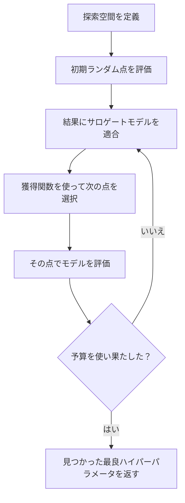
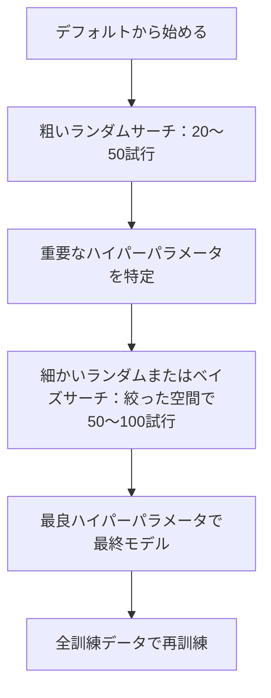
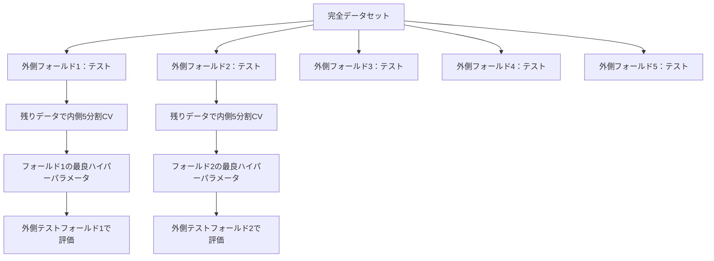

# ハイパーパラメータチューニング

> ハイパーパラメータは訓練が始まる前に回すノブだ。うまく回すことが、平凡なモデルと優れたモデルの差を生む。


## 学習目標

- グリッドサーチ、ランダムサーチ、ベイズ最適化をスクラッチから実装し、そのサンプル効率を比較する
- ほとんどのハイパーパラメータが実効次元数が低い場合にランダムサーチがグリッドサーチを上回る理由を説明する
- サロゲートモデルと獲得関数を使ったベイズ最適化ループを構築してサーチを誘導する
- 適切なクロスバリデーションによって検証セットへの過学習を避けるハイパーパラメータチューニング戦略を設計する

## 問題

勾配ブースティングモデルには学習率、ツリー数、最大深さ、葉あたり最小サンプル数、サブサンプル比率、列サンプル比率がある。6個のハイパーパラメータだ。それぞれに5つの妥当な値があれば、グリッドは 5^6 = 15,625 の組み合わせになる。各訓練に10秒かかるとすると、すべてを試すのに43時間かかる。

グリッドサーチは明らかなアプローチだが、スケールが上がると最悪の方法だ。ランダムサーチは少ない計算量でより良い結果を出す。ベイズ最適化は過去の評価から学習することでさらに良い結果を出す。どの戦略を使うべきかを知り、どのハイパーパラメータが実際に重要かを知ることで、無駄なGPU時間を何日も節約できる。

## コンセプト

### パラメータ vs ハイパーパラメータ

パラメータは訓練中に学習される（重み、バイアス、分割閾値）。ハイパーパラメータは訓練開始前に設定され、学習の仕方を制御する。

| ハイパーパラメータ | 制御するもの | 典型的な範囲 |
|----------------|------------|------------|
| 学習率 | 更新ごとのステップサイズ | 0.001〜1.0 |
| ツリー数/エポック数 | 訓練の長さ | 10〜10,000 |
| 最大深さ | モデルの複雑度 | 1〜30 |
| 正則化（lambda） | 過学習防止 | 0.0001〜100 |
| バッチサイズ | 勾配推定のノイズ | 16〜512 |
| ドロップアウト率 | ドロップされるニューロンの割合 | 0.0〜0.5 |

### グリッドサーチ

グリッドサーチは指定された値のすべての組み合わせを評価する。網羅的で理解しやすいが、ハイパーパラメータ数に対して指数関数的にスケールする。

```
2ハイパーパラメータのグリッド：

  learning_rate: [0.01, 0.1, 1.0]
  max_depth:     [3, 5, 7]

  評価数：3 x 3 = 9組み合わせ

  (0.01, 3)  (0.01, 5)  (0.01, 7)
  (0.1,  3)  (0.1,  5)  (0.1,  7)
  (1.0,  3)  (1.0,  5)  (1.0,  7)
```

グリッドサーチには根本的な欠点がある：1つのハイパーパラメータが重要で他が重要でない場合、ほとんどの評価が無駄になる。9回の評価から重要なパラメータのユニークな値は3つしか得られない。

### ランダムサーチ

ランダムサーチはグリッドではなく分布からハイパーパラメータをサンプリングする。同じ9回の評価予算で、各ハイパーパラメータについて9つのユニークな値が得られる。


ランダムがグリッドに勝る理由（Bergstra & Bengio, 2012）：

- ほとんどのハイパーパラメータは実効次元数が低い。ある問題では6個中1〜2個のハイパーパラメータしか重要でない場合が多い。
- グリッドサーチは重要でない次元で評価を無駄にする。
- ランダムサーチは同じ予算でより重要な次元をより密に網羅する。
- 60回のランダム試行で、探索空間に最適値が存在するなら95%の確率で最適値の5%以内を見つける。

### ベイズ最適化

ランダムサーチは結果を無視する。高い学習率が発散を引き起こすことや、深さ3が常に深さ10より良いことを学習しない。ベイズ最適化は過去の評価を使って次にどこを探索するかを決定する。



2つの主要コンポーネント：

**サロゲートモデル：** 高コストな目的関数を近似する安価に評価できるモデル（通常はガウス過程）。探索空間の任意の点で予測と不確実性の両方を与える。

**獲得関数：** 既知の良い点の近く（活用）と不確実性の高い場所（探索）のバランスを取ることで、次にどこを評価するかを決定する。一般的な選択肢：

- **期待改善（EI）：** この点で現在のベストからどれだけ改善が期待できるか？
- **上信頼限界（UCB）：** 予測値に不確実性の倍数を加えたもの。高いUCBは有望または未探索を意味する。
- **改善確率（PI）：** この点が現在のベストを上回る確率は？

ベイズ最適化は通常、2〜5倍少ない評価でランダムサーチより良いハイパーパラメータを見つける。サロゲートモデルを適合するオーバーヘッドは実際のモデルの訓練と比較して無視できる。

### 早期停止

すべての訓練ランを最後まで実行する必要はない。設定が10エポック後に明らかに悪いなら、停止して次に進む。これがハイパーパラメータサーチの文脈での早期停止だ。

戦略：
- **忍耐ベース：** N連続エポックで検証損失が改善しなければ停止
- **中央値プルーニング：** 試行の中間結果が同ステップで完了した試行の中央値より悪ければ停止
- **Hyperband：** 多くの設定に小さな予算を割り当て、最良のものの予算を段階的に増やす

Hyperbandは特に効果的だ。81の設定を各1エポックで始め、上位3分の1を維持し3エポック与え、上位3分の1を維持する、を繰り返す。全設定をフルバジェットで評価するより10〜50倍速く良い設定を見つける。

### 学習率スケジューラー

学習率はほとんど常に最も重要なハイパーパラメータだ。固定に保つのではなく、スケジューラーが訓練中に調整する。

| スケジューラー | 式 | 使用場面 |
|-------------|---|---------|
| ステップ減衰 | Nエポックごとに0.1倍 | 古典的なCNN訓練 |
| コサインアニーリング | lr * 0.5 * (1 + cos(pi * t / T)) | 現代的なデフォルト |
| ウォームアップ + 減衰 | 線形増加後にコサイン減衰 | トランスフォーマー |
| ワンサイクル | 1サイクルで増加後に減少 | 高速収束 |
| プラトー時に減少 | メトリクスが停滞したら係数で削減 | 安全なデフォルト |

### ハイパーパラメータの重要度

すべてのハイパーパラメータが等しく重要というわけではない。ランダムフォレスト（Probst et al., 2019）と勾配ブースティングの研究は一貫したパターンを示す：

**重要度高：**
- 学習率（常に最初にチューニングする）
- 推定器数/エポック数（チューニングではなく早期停止を使う）
- 正則化の強度

**重要度中：**
- 最大深さ/層数
- 葉あたり最小サンプル数/重み減衰
- サブサンプル比率

**重要度低：**
- 最大特徴量数（ランダムフォレスト）
- 特定の活性化関数の選択
- バッチサイズ（合理的な範囲内）

重要なものを最初にチューニングし、残りはデフォルトのままにする。

### 実践的な戦略



具体的なワークフロー：

1. **ライブラリのデフォルトから始める。** 経験豊富な実践者が選んでおり、しばしば80%のところまで来ている。
2. **粗いランダムサーチ。** 広い範囲、20〜50試行。悪いランを早く終わらせるため早期停止を使う。
3. **結果を分析する。** どのハイパーパラメータがパフォーマンスと相関するか？探索空間を絞る。
4. **細かいサーチ。** 絞った空間でのベイズ最適化または集中的なランダムサーチ。50〜100試行。
5. **見つかった最良ハイパーパラメータで全訓練データで再訓練する。**

### クロスバリデーションの統合

単一の検証分割でハイパーパラメータをチューニングするのはリスクがある。最良のハイパーパラメータは特定の検証フォールドに過学習するかもしれない。ネストしたクロスバリデーションはこれを2つのループで解決する：

- **外側ループ**（評価）：データを訓練+検証とテストに分割する。偏りのないパフォーマンスを報告する。
- **内側ループ**（チューニング）：訓練+検証を訓練と検証に分割する。最良のハイパーパラメータを見つける。



各外側フォールドは独立して自身の最良ハイパーパラメータを見つける。外側のスコアは汎化パフォーマンスの偏りのない推定だ。

sklearnで：

```python
from sklearn.model_selection import cross_val_score, GridSearchCV
from sklearn.ensemble import GradientBoostingRegressor

inner_cv = GridSearchCV(
    GradientBoostingRegressor(),
    param_grid={
        "learning_rate": [0.01, 0.05, 0.1],
        "max_depth": [2, 3, 5],
        "n_estimators": [50, 100, 200],
    },
    cv=5,
    scoring="neg_mean_squared_error",
)

outer_scores = cross_val_score(
    inner_cv, X, y, cv=5, scoring="neg_mean_squared_error"
)

print(f"ネストCV MSE: {-outer_scores.mean():.4f} +/- {outer_scores.std():.4f}")
```

これは高コストだが（5外側フォールド × 5内側フォールド × 27グリッド点 = 675モデル適合）、信頼できるパフォーマンス推定を与える。論文での最終結果報告や意思決定のリスクが高い場合に使用する。

### 実践的なヒント

**まず学習率から始める。** 勾配ベース手法では常に最も重要なハイパーパラメータだ。悪い学習率は他のすべてを無意味にする。他のハイパーパラメータをデフォルトに固定して、まず学習率を変化させる。

**学習率と正則化にはログ均一分布を使う。** 0.001と0.01の差は0.1と1.0の差と同じくらい重要だ。線形に探索すると大きな端に予算を無駄にする。

**n_estimators のチューニングには早期停止を使う。** ブースティングとニューラルネットワークでは n_estimators またはエポック数を高く設定して、早期停止にいつ停止するかを決めさせる。これにより探索から1つのハイパーパラメータが除外される。

**予算の割り当て。** チューニング予算の60%を最も重要な2つのハイパーパラメータに使う。残りの40%をすべてに使う。上位2つがパフォーマンス変動のほとんどを占める。

**スケールが重要だ。** バッチサイズはログスケールで探索しない（16、32、64で十分）。学習率は常にログスケールで探索する。ハイパーパラメータがモデルにどう影響するかに探索分布を合わせる。

| モデルタイプ | 主要ハイパーパラメータ | 推奨サーチ | 予算 |
|------------|-------------------|---------|-----|
| ランダムフォレスト | n_estimators、max_depth、min_samples_leaf | ランダムサーチ、50試行 | 低（訓練が速い） |
| 勾配ブースティング | learning_rate、n_estimators、max_depth | ベイズ、100試行 + 早期停止 | 中 |
| ニューラルネットワーク | learning_rate、weight_decay、batch_size | ベイズまたはランダム、100+試行 | 高（訓練が遅い） |
| SVM | C、gamma（RBFカーネル） | ログスケールのグリッド、25〜50試行 | 低（2パラメータ） |
| ラッソ/リッジ | alpha | ログスケールの1D探索、20試行 | 非常に低 |
| XGBoost | learning_rate、max_depth、subsample、colsample | ベイズ、100〜200試行 + 早期停止 | 中 |

**迷ったとき：** ハイパーパラメータ数の2倍の試行数でランダムサーチ（例：6パラメータ = 最低12+試行）。慎重に設計されたグリッドサーチを50試行のランダムサーチがどれほど頻繁に上回るか驚くだろう。

## 実装する

### ステップ1：グリッドサーチをスクラッチから実装

`code/tuning.py` のコードはグリッドサーチ、ランダムサーチ、シンプルなベイズオプティマイザーをスクラッチから実装する。

```python
def grid_search(model_fn, param_grid, X_train, y_train, X_val, y_val):
    keys = list(param_grid.keys())
    values = list(param_grid.values())
    best_score = -float("inf")
    best_params = None
    n_evals = 0

    for combo in itertools.product(*values):
        params = dict(zip(keys, combo))
        model = model_fn(**params)
        model.fit(X_train, y_train)
        score = evaluate(model, X_val, y_val)
        n_evals += 1

        if score > best_score:
            best_score = score
            best_params = params

    return best_params, best_score, n_evals
```

### ステップ2：ランダムサーチをスクラッチから実装

```python
def random_search(model_fn, param_distributions, X_train, y_train,
                  X_val, y_val, n_iter=50, seed=42):
    rng = np.random.RandomState(seed)
    best_score = -float("inf")
    best_params = None

    for _ in range(n_iter):
        params = {k: sample(v, rng) for k, v in param_distributions.items()}
        model = model_fn(**params)
        model.fit(X_train, y_train)
        score = evaluate(model, X_val, y_val)

        if score > best_score:
            best_score = score
            best_params = params

    return best_params, best_score, n_iter
```

### ステップ3：ベイズ最適化（簡略版）

核心的なアイデア：観測された（ハイパーパラメータ、スコア）ペアにガウス過程を適合させ、獲得関数を使って次にどこを見るかを決定する。

```python
class SimpleBayesianOptimizer:
    def __init__(self, search_space, n_initial=5):
        self.search_space = search_space
        self.n_initial = n_initial
        self.X_observed = []
        self.y_observed = []

    def _kernel(self, x1, x2, length_scale=1.0):
        dists = np.sum((x1[:, None, :] - x2[None, :, :]) ** 2, axis=2)
        return np.exp(-0.5 * dists / length_scale ** 2)

    def _fit_gp(self, X_new):
        X_obs = np.array(self.X_observed)
        y_obs = np.array(self.y_observed)
        y_mean = y_obs.mean()
        y_centered = y_obs - y_mean

        K = self._kernel(X_obs, X_obs) + 1e-4 * np.eye(len(X_obs))
        K_star = self._kernel(X_new, X_obs)

        L = np.linalg.cholesky(K)
        alpha = np.linalg.solve(L.T, np.linalg.solve(L, y_centered))
        mu = K_star @ alpha + y_mean

        v = np.linalg.solve(L, K_star.T)
        var = 1.0 - np.sum(v ** 2, axis=0)
        var = np.maximum(var, 1e-6)

        return mu, var

    def _expected_improvement(self, mu, var, best_y):
        sigma = np.sqrt(var)
        z = (mu - best_y) / (sigma + 1e-10)
        ei = sigma * (z * norm_cdf(z) + norm_pdf(z))
        return ei

    def suggest(self):
        if len(self.X_observed) < self.n_initial:
            return sample_random(self.search_space)

        candidates = [sample_random(self.search_space) for _ in range(500)]
        X_cand = np.array([to_vector(c) for c in candidates])
        mu, var = self._fit_gp(X_cand)
        ei = self._expected_improvement(mu, var, max(self.y_observed))
        return candidates[np.argmax(ei)]

    def observe(self, params, score):
        self.X_observed.append(to_vector(params))
        self.y_observed.append(score)
```

GPサロゲートは各候補点で2つのものを与える：予測スコア（mu）と不確実性（var）。期待改善はこれらのバランスを取る：モデルが高いスコアを予測する場所、または不確実性が高い場所を優先する。初期は不確実性が高いためオプティマイザーは探索する。後半は最も有望な領域に集中する。

### ステップ4：全手法の比較

同じ合成目的関数で3つの手法すべてを実行して比較する。この比較は直接の目的関数（モデル訓練なし）で各オプティマイザーを呼び出す簡略ラッパーを使うため、上記のモデルベース実装とAPIが異なる：

```python
def synthetic_objective(params):
    lr = params["learning_rate"]
    depth = params["max_depth"]
    return -(np.log10(lr) + 2) ** 2 - (depth - 4) ** 2 + 10

param_grid = {
    "learning_rate": [0.001, 0.01, 0.1, 1.0],
    "max_depth": [2, 3, 4, 5, 6, 7, 8],
}

grid_best = None
grid_score = -float("inf")
grid_history = []
for combo in itertools.product(*param_grid.values()):
    params = dict(zip(param_grid.keys(), combo))
    score = synthetic_objective(params)
    grid_history.append((params, score))
    if score > grid_score:
        grid_score = score
        grid_best = params

param_dist = {
    "learning_rate": ("log_float", 0.001, 1.0),
    "max_depth": ("int", 2, 8),
}

rand_best = None
rand_score = -float("inf")
rand_history = []
rng = np.random.RandomState(42)
for _ in range(28):
    params = {k: sample(v, rng) for k, v in param_dist.items()}
    score = synthetic_objective(params)
    rand_history.append((params, score))
    if score > rand_score:
        rand_score = score
        rand_best = params

optimizer = SimpleBayesianOptimizer(param_dist, n_initial=5)
bayes_history = []
for _ in range(28):
    params = optimizer.suggest()
    score = synthetic_objective(params)
    optimizer.observe(params, score)
    bayes_history.append((params, score))
bayes_score = max(s for _, s in bayes_history)

print(f"{'手法':<20} {'最良スコア':>12} {'評価数':>12}")
print("-" * 50)
print(f"{'グリッドサーチ':<20} {grid_score:>12.4f} {len(grid_history):>12}")
print(f"{'ランダムサーチ':<20} {rand_score:>12.4f} {len(rand_history):>12}")
print(f"{'ベイズ最適化':<20} {bayes_score:>12.4f} {len(bayes_history):>12}")
```

同じ予算で、ベイズ最適化は明らかに悪い領域に評価を無駄にしないため、最も速く最良スコアを見つける。ランダムサーチはグリッドサーチより広範囲をカバーする。グリッドサーチはハイパーパラメータが非常に少なく、網羅的に評価できる場合のみ勝つ。

## 使う

### Optunaを実際に使う

Optunaはシリアスなハイパーパラメータチューニングに推奨されるライブラリだ。プルーニング、分散サーチ、可視化をすぐに使える形でサポートする。

```python
import optuna

def objective(trial):
    lr = trial.suggest_float("learning_rate", 1e-4, 1e-1, log=True)
    n_est = trial.suggest_int("n_estimators", 50, 500)
    max_depth = trial.suggest_int("max_depth", 2, 10)

    model = GradientBoostingRegressor(
        learning_rate=lr,
        n_estimators=n_est,
        max_depth=max_depth,
    )
    model.fit(X_train, y_train)
    return mean_squared_error(y_val, model.predict(X_val))

study = optuna.create_study(direction="minimize")
study.optimize(objective, n_trials=100)

print(f"最良パラメータ: {study.best_params}")
print(f"最良MSE: {study.best_value:.4f}")
```

Optunaの主要機能：
- `suggest_float(..., log=True)` でログスケールで探索するパラメータ（学習率、正則化）
- `suggest_int` で整数パラメータ
- `suggest_categorical` で離散的な選択肢
- 悪い試行の早期停止のための組み込みMedianPruner
- 分析用の `study.trials_dataframe()`

### プルーニング付きOptuna

プルーニングは有望でない試行を早く停止し、大量の計算を節約する。パターンはこうだ：

```python
import optuna
from sklearn.model_selection import cross_val_score

def objective(trial):
    params = {
        "learning_rate": trial.suggest_float("lr", 1e-4, 0.5, log=True),
        "max_depth": trial.suggest_int("max_depth", 2, 10),
        "n_estimators": trial.suggest_int("n_estimators", 50, 500),
        "subsample": trial.suggest_float("subsample", 0.5, 1.0),
    }

    model = GradientBoostingRegressor(**params)
    scores = cross_val_score(model, X_train, y_train, cv=3,
                             scoring="neg_mean_squared_error")
    mean_score = -scores.mean()

    trial.report(mean_score, step=0)
    if trial.should_prune():
        raise optuna.TrialPruned()

    return mean_score

pruner = optuna.pruners.MedianPruner(n_startup_trials=10, n_warmup_steps=5)
study = optuna.create_study(direction="minimize", pruner=pruner)
study.optimize(objective, n_trials=200)
```

`MedianPruner` は試行の中間値が同ステップで完了した試行の中央値より悪ければその試行を停止する。プルーニングには中間メトリクスを報告するための `trial.report()` と試行を停止すべきかチェックするための `trial.should_prune()` の呼び出しが必要だ。`n_startup_trials=10` によりプルーニングが始まる前に少なくとも10試行が完全に完了することを保証する。これにより通常総計算量の40〜60%が節約される。

### sklearnの組み込みチューナー

クイックな実験では、sklearnが `GridSearchCV`、`RandomizedSearchCV`、`HalvingRandomSearchCV` を提供する：

```python
from sklearn.model_selection import RandomizedSearchCV
from scipy.stats import loguniform, randint

param_dist = {
    "learning_rate": loguniform(1e-4, 0.5),
    "max_depth": randint(2, 10),
    "n_estimators": randint(50, 500),
}

search = RandomizedSearchCV(
    GradientBoostingRegressor(),
    param_dist,
    n_iter=100,
    cv=5,
    scoring="neg_mean_squared_error",
    random_state=42,
    n_jobs=-1,
)
search.fit(X_train, y_train)
print(f"最良パラメータ: {search.best_params_}")
print(f"最良CV MSE: {-search.best_score_:.4f}")
```

学習率と正則化にはscipyの `loguniform` を使う。整数ハイパーパラメータには `randint` を使う。`n_jobs=-1` フラグはすべてのCPUコアで並列化する。

### ハイパーパラメータチューニングの一般的なミス

**前処理によるデータ漏洩。** クロスバリデーション前に完全データセットでスケーラーを適合させると、検証フォールドからの情報が訓練に漏れる。前処理は常に `Pipeline` の中に入れ、訓練フォールドのみで適合するようにする。

**検証セットへの過学習。** 何千もの試行を実行することは効果的に検証セットで訓練することになる。最終パフォーマンス推定にはネストしたクロスバリデーションを使うか、チューニング中には決して触れない別のテストセットを取っておく。

**狭すぎる範囲を探索する。** 最良値が探索空間の境界にあれば、十分に広く探索できていない。最適値が範囲外かもしれない。常に最良パラメータが端にないか確認する。

**相互作用効果を無視する。** 学習率と推定器数はブースティングで強く相互作用する。低い学習率はより多くの推定器を必要とする。独立してチューニングすると一緒にチューニングするより悪い結果になる。

**反復モデルの早期停止を使わない。** 勾配ブースティングとニューラルネットワークでは、n_estimatorsまたはエポック数を高い値に設定して早期停止を使う。これはイテレーション数をハイパーパラメータとしてチューニングするより厳密に良い。

## 演習

1. グリッドサーチとランダムサーチを同じ総予算（例：50評価）で実行する。見つかった最良スコアを比較する。異なるシードで10回実験を実行する。ランダムサーチが何回勝つか？

2. Hyperbandをスクラッチから実装する。81の設定を各1エポックで始め、各ラウンドで上位1/3を維持して予算を3倍にする。全設定をフルバジェットで実行する場合と比べた総計算量（全設定の全エポックの合計）を比較する。

3. レッスン11の勾配ブースティング実装に学習率スケジューラー（コサインアニーリング）を追加する。固定学習率と比べて役立つか？

4. Optunaを使って実際のデータセット（例：sklearnのbreast cancerデータセット）でRandomForestClassifierをチューニングする。`optuna.visualization.plot_param_importances(study)` を使ってどのハイパーパラメータが最も重要かを見る。このレッスンの重要度ランキングと一致するか？

5. シンプルな獲得関数（期待改善）を実装して探索と活用のデモンストレーションをする。サロゲートモデルの平均と不確実性をプロットし、EIが次にどこを評価するかを選ぶかを示す。

## 主要用語

| 用語 | 人々がよく言うこと | 実際の意味 |
|------|----------------|-----------|
| ハイパーパラメータ | 「自分で選ぶ設定」 | 訓練前に設定する値で、学習プロセスを制御し、データから学習されない |
| グリッドサーチ | 「すべての組み合わせを試す」 | 指定されたパラメータグリッドの網羅的なサーチ。指数関数的コスト。 |
| ランダムサーチ | 「ランダムにサンプリングするだけ」 | 分布からハイパーパラメータをサンプリング。グリッドサーチより重要な次元をより密に網羅。 |
| ベイズ最適化 | 「賢いサーチ」 | 目的関数のサロゲートモデルを使って、探索と活用のバランスを取りながら次にどこを評価するかを決定する |
| サロゲートモデル | 「安価な近似」 | 観測された評価から高コストな目的関数を近似するモデル（通常はガウス過程） |
| 獲得関数 | 「次にどこを見るか」 | 期待改善と不確実性のバランスを取って候補点をスコアリングする。EIとUCBが一般的な選択肢。 |
| 早期停止 | 「時間を無駄にするのをやめる」 | 検証パフォーマンスが改善しなくなったら早期に訓練を終了する |
| Hyperband | 「設定のトーナメント」 | 適応的リソース割り当て：多くの設定に小さな予算で始め、最良のものを維持して予算を増やす |
| 学習率スケジューラー | 「訓練中に学習率を変える」 | より良い収束のために訓練経過に合わせて学習率を調整する関数 |

## さらに読む

- [Bergstra & Bengio: Random Search for Hyper-Parameter Optimization (2012)](https://jmlr.org/papers/v13/bergstra12a.html) -- ランダムがグリッドに勝つことを示した論文
- [Snoek et al., Practical Bayesian Optimization of Machine Learning Algorithms (2012)](https://arxiv.org/abs/1206.2944) -- MLのためのベイズ最適化
- [Li et al., Hyperband: A Novel Bandit-Based Approach (2018)](https://jmlr.org/papers/v18/16-558.html) -- Hyperbandの論文
- [Optuna: A Next-generation Hyperparameter Optimization Framework](https://arxiv.org/abs/1907.10902) -- Optunaの論文
- [Probst et al., Tunability: Importance of Hyperparameters (2019)](https://jmlr.org/papers/v20/18-444.html) -- どのハイパーパラメータが重要か
