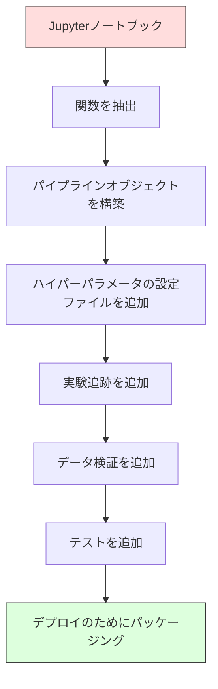

# MLパイプライン

> モデルは製品ではない。パイプラインが製品だ。パイプラインは生データからデプロイされた予測までのすべてであり、すべてのステップが再現可能でなければならない。


## 学習目標

- 欠損値補完、スケーリング、エンコーディング、モデル訓練を単一の再現可能なオブジェクトに連結するMLパイプラインをスクラッチから構築する
- データ漏洩のシナリオを特定し、変換器を訓練データのみで適合させることでパイプラインがそれをどう防ぐかを説明する
- 数値特徴量とカテゴリカル特徴量に異なる前処理を適用するColumnTransformerを構築する
- パイプラインのシリアライズを実装し、適合済みの同じパイプラインが訓練と本番で同一の結果を生成することを実証する

## 問題

データを読み込み、欠損値を中央値で埋め、特徴量をスケーリングし、モデルを訓練して精度を出力するノートブックがある。機能している。リリースした。

1ヶ月後、誰かがモデルを再訓練すると異なる結果が出た。中央値はテストデータを含む完全なデータセットで計算されていた（データ漏洩）。スケーリングパラメータが保存されていなかったため、推論では異なる統計を使用する。特徴量エンジニアリングコードが訓練とサービング間でコピー＆ペーストされ、コピーが分岐した。カテゴリカル列が本番で新しい値を持つようになり、エンコーダーがそれを見たことがない。

これらは仮定の話ではない。MLシステムが本番で失敗する最も一般的な理由だ。パイプラインはすべての変換ステップを単一の順序付けられた再現可能なオブジェクトにパッケージングすることで、これらすべてを解決する。

## コンセプト

### パイプラインとは何か

パイプラインはデータ変換の順序付きシーケンスとモデルだ。各ステップは前のステップの出力を入力として取る。パイプライン全体は訓練データで一度適合される。推論時には、同じ適合済みパイプラインが新しいデータを変換して予測を生成する。


パイプラインは以下を保証する：
- 変換は訓練データのみで適合される（漏洩なし）
- 推論時に同じ変換が適用される
- オブジェクト全体を1つのアーティファクトとしてシリアライズしてデプロイできる
- クロスバリデーションはフォールドごとにパイプラインを適用し、微妙な漏洩を防ぐ

### データ漏洩：サイレントキラー

データ漏洩は、テストセットまたは将来のデータからの情報が訓練を汚染するときに起きる。パイプラインは最も一般的な形式を防ぐ。

**漏洩あり（間違い）：**
```python
X = df.drop("target", axis=1)
y = df["target"]

scaler = StandardScaler()
X_scaled = scaler.fit_transform(X)

X_train, X_test = X_scaled[:800], X_scaled[800:]
y_train, y_test = y[:800], y[800:]
```

スケーラーがテストデータを見た。平均と標準偏差にテストサンプルが含まれる。精度の推定が過大評価される。

**正しい方法：**
```python
X_train, X_test = X[:800], X[800:]

scaler = StandardScaler()
X_train_scaled = scaler.fit_transform(X_train)
X_test_scaled = scaler.transform(X_test)
```

パイプラインを使えば、これについて考える必要はない。パイプラインが自動的に処理する。

### sklearnパイプライン

sklearnの `Pipeline` は変換器と推定器を連結する。すべてのステップを順番に適用する `.fit()`、`.predict()`、`.score()` を公開する。

```python
from sklearn.pipeline import Pipeline
from sklearn.preprocessing import StandardScaler
from sklearn.linear_model import LogisticRegression

pipe = Pipeline([
    ("scaler", StandardScaler()),
    ("model", LogisticRegression()),
])

pipe.fit(X_train, y_train)
predictions = pipe.predict(X_test)
```

`pipe.fit(X_train, y_train)` を呼ぶとき：
1. スケーラーは X_train で `fit_transform` を呼ぶ
2. モデルはスケーリングされた X_train で `fit` を呼ぶ

`pipe.predict(X_test)` を呼ぶとき：
1. スケーラーは X_test で `transform` を呼ぶ（fit_transformではない）
2. モデルはスケーリングされた X_test で `predict` を呼ぶ

スケーラーは適合中にテストデータを決して見ない。これがポイントだ。

### ColumnTransformer：列ごとに異なるパイプライン

実際のデータセットには異なる前処理が必要な数値列とカテゴリカル列がある。`ColumnTransformer` がこれを処理する。

```python
from sklearn.compose import ColumnTransformer
from sklearn.preprocessing import StandardScaler, OneHotEncoder
from sklearn.impute import SimpleImputer

numeric_pipe = Pipeline([
    ("impute", SimpleImputer(strategy="median")),
    ("scale", StandardScaler()),
])

categorical_pipe = Pipeline([
    ("impute", SimpleImputer(strategy="most_frequent")),
    ("encode", OneHotEncoder(handle_unknown="ignore")),
])

preprocessor = ColumnTransformer([
    ("num", numeric_pipe, ["age", "income", "score"]),
    ("cat", categorical_pipe, ["city", "gender", "plan"]),
])

full_pipeline = Pipeline([
    ("preprocess", preprocessor),
    ("model", GradientBoostingClassifier()),
])
```

OneHotEncoderの `handle_unknown="ignore"` は本番では重要だ。新しいカテゴリ（モデルが見たことのない都市）が現れると、クラッシュする代わりにゼロベクトルを生成する。

### 実験追跡

パイプラインは訓練を再現可能にするが、実験間で何が起きたかも追跡する必要がある：使用されたハイパーパラメータ、データセットバージョン、メトリクス、実行されたコード。

**MLflow** は最も一般的なオープンソースソリューションだ：

```python
import mlflow

with mlflow.start_run():
    mlflow.log_param("max_depth", 5)
    mlflow.log_param("n_estimators", 100)
    mlflow.log_param("learning_rate", 0.1)

    pipe.fit(X_train, y_train)
    accuracy = pipe.score(X_test, y_test)

    mlflow.log_metric("accuracy", accuracy)
    mlflow.sklearn.log_model(pipe, "model")
```

すべての実行がパラメータ、メトリクス、アーティファクト、完全なモデルとともに記録される。実行を比較し、任意の実験を再現し、任意のモデルバージョンをデプロイできる。

**Weights & Biases（wandb）** はホストされたダッシュボードで同じ機能を提供する：

```python
import wandb

wandb.init(project="my-pipeline")
wandb.config.update({"max_depth": 5, "n_estimators": 100})

pipe.fit(X_train, y_train)
accuracy = pipe.score(X_test, y_test)

wandb.log({"accuracy": accuracy})
```

### モデルバージョニング

実験追跡の後、モデルバージョンを管理する必要がある。どのモデルが本番にあるか？どれがステージングか？先週のはどれか？

MLflowのモデルレジストリは以下を提供する：
- **バージョン追跡：** 保存されたすべてのモデルにバージョン番号が付く
- **ステージ遷移：** 「ステージング」、「本番」、「アーカイブ」
- **承認ワークフロー：** モデルは明示的に本番に昇格される必要がある
- **ロールバック：** 即座に前のバージョンに切り替える

### DVCによるデータバージョニング

コードはgitでバージョン管理される。データもバージョン管理されるべきだが、gitは大きなファイルを扱えない。DVC（Data Version Control）がこれを解決する。

```
dvc init
dvc add data/training.csv
git add data/training.csv.dvc data/.gitignore
git commit -m "Track training data"
dvc push
```

DVCは実際のデータをリモートストレージ（S3、GCS、Azure）に保存し、ハッシュを記録する小さな `.dvc` ファイルをgitに残す。gitコミットをチェックアウトすると、`dvc checkout` で使用されたデータを正確に復元できる。

つまりすべてのgitコミットがコードとデータの両方を固定する。完全な再現性だ。

### 再現可能な実験

再現可能な実験には4つのことが必要だ：

1. **固定されたランダムシード：** numpy、random、フレームワーク（torch、sklearn）のシードを設定する
2. **固定された依存関係：** 正確なバージョンを記載した requirements.txt または poetry.lock
3. **バージョン管理されたデータ：** DVCまたは同様のもの
4. **設定ファイル：** すべてのハイパーパラメータを設定に記載し、ハードコードしない

```python
import numpy as np
import random

def set_seed(seed=42):
    random.seed(seed)
    np.random.seed(seed)
    try:
        import torch
        torch.manual_seed(seed)
        torch.cuda.manual_seed_all(seed)
        torch.backends.cudnn.deterministic = True
    except ImportError:
        pass
```

### ノートブックから本番パイプラインへ



典型的な進行：

1. **ノートブックでの探索：** クイックな実験、可視化、特徴量のアイデア
2. **関数を抽出：** 前処理、特徴量エンジニアリング、評価をモジュールに移動
3. **パイプラインを構築：** 変換をsklearnパイプラインまたはカスタムクラスに連結
4. **設定管理：** すべてのハイパーパラメータをYAML/JSON設定に移動
5. **実験追跡：** MLflowまたはwandbのロギングを追加
6. **データ検証：** 訓練前にスキーマ、分布、欠損値パターンを確認
7. **テスト：** 変換器の単体テスト、完全パイプラインの統合テスト
8. **デプロイ：** パイプラインをシリアライズし、APIでラップ（FastAPI、Flask）、コンテナ化

### パイプラインの一般的なミス

| ミス | なぜ悪いか | 対処法 |
|------|---------|--------|
| 分割前に完全データで適合 | データ漏洩 | Pipeline と cross_val_score を使う |
| パイプライン外での特徴量エンジニアリング | 訓練とサービングで異なる変換 | すべての変換をパイプラインに入れる |
| 未知のカテゴリを処理しない | 新しい値で本番クラッシュ | OneHotEncoder(handle_unknown="ignore") |
| ハードコードされた列名 | スキーマ変更時に壊れる | 設定から列名リストを使う |
| データ検証なし | 悪いデータで静かに間違った予測 | 予測前にスキーマチェックを追加 |
| 訓練/サービングスキュー | モデルが本番で異なる特徴量を見る | 両方に1つのパイプラインオブジェクト |

## 実装する

`code/pipeline.py` のコードはスクラッチから完全なMLパイプラインを構築する：

### ステップ1：カスタム変換器

```python
class CustomTransformer:
    def __init__(self):
        self.means = None
        self.stds = None

    def fit(self, X):
        self.means = np.mean(X, axis=0)
        self.stds = np.std(X, axis=0)
        self.stds[self.stds == 0] = 1.0
        return self

    def transform(self, X):
        return (X - self.means) / self.stds

    def fit_transform(self, X):
        return self.fit(X).transform(X)
```

### ステップ2：スクラッチからのパイプライン

```python
class PipelineFromScratch:
    def __init__(self, steps):
        self.steps = steps

    def fit(self, X, y=None):
        X_current = X.copy()
        for name, step in self.steps[:-1]:
            X_current = step.fit_transform(X_current)
        name, model = self.steps[-1]
        model.fit(X_current, y)
        return self

    def predict(self, X):
        X_current = X.copy()
        for name, step in self.steps[:-1]:
            X_current = step.transform(X_current)
        name, model = self.steps[-1]
        return model.predict(X_current)
```

### ステップ3：パイプラインとのクロスバリデーション

コードはパイプラインとのクロスバリデーションがどのようにデータ漏洩を防ぐかを実演する：スケーラーは各フォールドの訓練データで個別に適合される。

### ステップ4：sklearnを使った完全な本番パイプライン

適切なクロスバリデーションと実験ロギングで訓練された、`ColumnTransformer`、複数の前処理パス、モデルを持つ完全なパイプライン。

## 出荷する

このレッスンの成果物：
- `outputs/prompt-ml-pipeline.md` -- MLパイプラインの構築とデバッグのためのスキル
- `code/pipeline.py` -- スクラッチからsklearnまでの完全なパイプライン

## 演習

1. 3つの数値列と2つのカテゴリカル列を持つデータセットを処理するパイプラインを構築する。`ColumnTransformer` を使って数値には中央値補完 + スケーリングを、カテゴリカルには最頻値補完 + ワンホットエンコーディングを適用する。5分割クロスバリデーションで訓練する。

2. 意図的にデータ漏洩を引き起こす：分割前に完全データセットでスケーラーを適合させる。クロスバリデーションスコア（漏洩あり）をパイプラインのクロスバリデーションスコア（クリーン）と比較する。差はどれほどか？

3. `joblib.dump` でパイプラインをシリアライズする。別のスクリプトで読み込んで予測を実行する。予測が同一であることを確認する。

4. 2つの最も重要な数値列の多項式特徴量（2次）を作成するカスタム変換器をパイプラインに追加する。パイプラインのどこに入れるべきか？

5. パイプラインのMLflow追跡を設定する。異なるハイパーパラメータで5回の実験を実行する。MLflow UI（`mlflow ui`）を使って実行を比較し、最良のモデルを選ぶ。

## 主要用語

| 用語 | 人々がよく言うこと | 実際の意味 |
|------|----------------|-----------|
| パイプライン | 「変換 + モデルの連結」 | 漏洩を防ぐために1つの単位として適用される、適合済み変換器とモデルの順序付きシーケンス |
| データ漏洩 | 「テスト情報が訓練に漏れた」 | 訓練セット外の情報を使ってモデルを構築し、パフォーマンス推定を過大評価する |
| ColumnTransformer | 「列ごとに異なる前処理」 | 異なる列サブセットに異なるパイプラインを適用し、結果を結合する |
| 実験追跡 | 「実行をロギングする」 | すべての訓練実行のパラメータ、メトリクス、アーティファクト、コードバージョンを記録する |
| MLflow | 「モデルを追跡してデプロイする」 | 実験追跡、モデルレジストリ、デプロイのためのオープンソースプラットフォーム |
| DVC | 「データのためのgit」 | 大きなデータファイルのバージョン管理システム。gitにハッシュを保存し、データをリモートストレージに保存 |
| モデルレジストリ | 「モデルバージョンカタログ」 | ステージラベル（ステージング、本番、アーカイブ）とともにモデルバージョンを追跡するシステム |
| 訓練/サービングスキュー | 「ノートブックでは動いた」 | 訓練と推論でデータが処理される方法の違いが、サイレントなエラーを引き起こす |
| 再現性 | 「同じコード、同じ結果」 | 同じコード、データ、設定から同一の結果を得られる能力 |

## さらに読む

- [scikit-learn パイプラインドキュメント](https://scikit-learn.org/stable/modules/compose.html) -- 公式パイプラインリファレンス
- [MLflow ドキュメント](https://mlflow.org/docs/latest/index.html) -- 実験追跡とモデルレジストリ
- [DVC ドキュメント](https://dvc.org/doc) -- データバージョニング
- [Sculley et al., Hidden Technical Debt in Machine Learning Systems (2015)](https://papers.nips.cc/paper/2015/hash/86df7dcfd896fcaf2674f757a2463eba-Abstract.html) -- MLシステムの複雑さに関する先駆的な論文
- [Google ML ベストプラクティス：Rules of ML](https://developers.google.com/machine-learning/guides/rules-of-ml) -- 実践的な本番MLアドバイス
