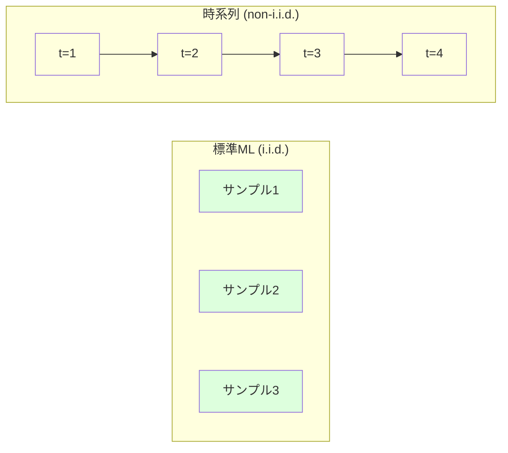
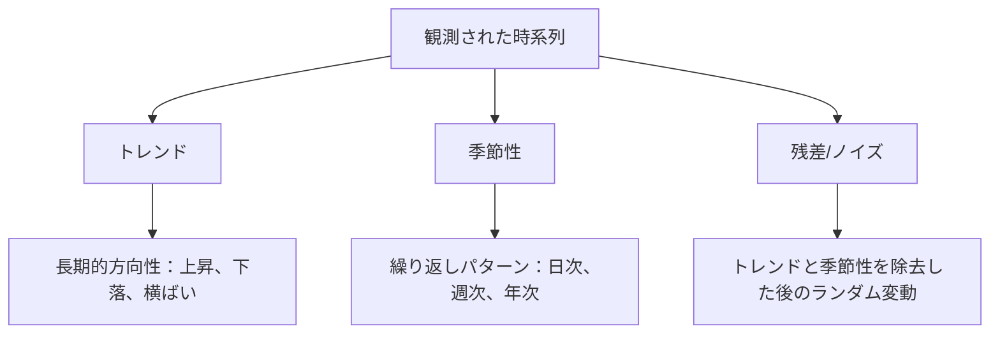
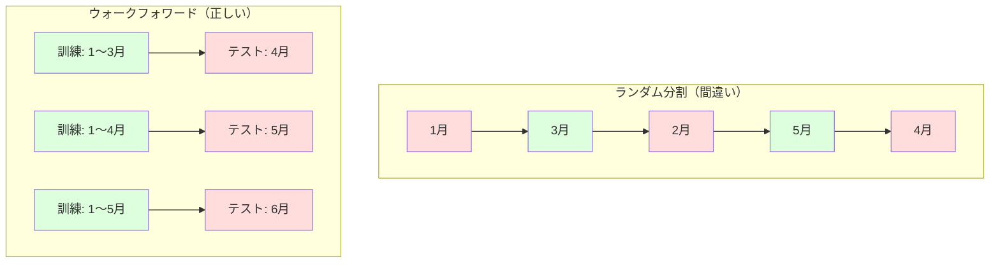

# 時系列の基礎

> 過去のパフォーマンスは将来の結果を予測する -- まず定常性を確認すれば。


## 学習目標

- 時系列をトレンド、季節性、残差成分に分解し、定常性をテストする
- ラグ特徴量とローリング統計を実装して時系列を教師あり学習問題に変換する
- 将来データが訓練に漏洩するのを防ぐウォークフォワード検証フレームワークを構築する
- ランダムな訓練/テスト分割が時系列で無効な理由を説明し、適切な時間的分割との性能差を実証する

## 問題

時間順に並んだデータがある。日次売上、時間毎の気温、1分毎のCPU使用率、週次株価。次の値、次の週、次の四半期を予測したい。

標準的なMLツールキットに手を伸ばす：ランダムな訓練/テスト分割、クロスバリデーション、特徴量行列を入れて予測を出す。すべてのステップが間違っている。

時系列は標準MLが依存する仮定を破る。サンプルは独立していない -- 今日の気温は昨日に依存する。ランダム分割は将来情報を過去に漏洩させる。バックテストで見栄えの良い特徴量が本番で失敗するのは、時間とともに変化するパターンに依存しているからだ。

ランダムクロスバリデーションで95%の精度を得るモデルが、適切な時間ベースの評価では55%になることがある。この差は技術的な細かい話ではない。紙の上でしか機能しないモデルと本番で機能するモデルの違いだ。

このレッスンでは基礎をカバーする：時間データを特別にする要因、モデルを正直に評価する方法、時系列を標準MLモデルが使える特徴量に変換する方法。

## コンセプト

### 時系列が違う理由

標準MLはi.i.d. -- 独立同分布 -- を仮定する。各サンプルは同じ分布から、他のサンプルとは独立に抽出される。時系列は両方に違反する：

- **独立ではない。** 今日の株価は昨日に依存する。今週の売上は先週と相関する。
- **同分布ではない。** 分布は時間とともに変化する。12月の売上は3月の売上とは見た目が違う。

これらの違反は軽微ではない。特徴量の構築方法、モデルの評価方法、機能するアルゴリズムを変える。



標準MLではサンプルは交換可能だ。シャッフルしても何も変わらない。時系列では順序がすべてだ。シャッフルするとシグナルが破壊される。

### 時系列の成分

すべての時系列は以下の組み合わせだ：



- **トレンド**：長期的方向性。年10%成長する収益。上昇する地球気温。
- **季節性**：固定間隔で繰り返すパターン。12月に急増する小売売上。7月にピークになるエアコン使用量。
- **残差**：トレンドと季節性を除去した後に残るもの。残差がホワイトノイズに見える場合、分解はシグナルを捉えた。

### 定常性

時系列は、その統計的特性（平均、分散、自己相関）が時間とともに変化しない場合に定常だ。ほとんどの予測手法は定常性を仮定する。

**重要な理由：** 非定常系列はドリフトする平均を持つ。1月のデータで訓練したモデルは、2月が示す平均とは異なる平均を学習した。系統的に間違うことになる。

**確認方法：** ウィンドウにわたるローリング平均とローリング標準偏差を計算する。ドリフトする場合、系列は非定常だ。

**修正方法：** 差分法。生の値をモデル化する代わりに、連続する値の変化をモデル化する：

```
diff[t] = value[t] - value[t-1]
```

1回の差分で系列が定常にならない場合、再度適用する（2次差分）。ほとんどの実世界の系列には最大2回が必要だ。

**例：**

元の系列: [100, 102, 106, 112, 120]
1次差分:   [2, 4, 6, 8] （まだ上昇トレンド）
2次差分:   [2, 2, 2] （定数 -- 定常）

元の系列は2次トレンドを持っていた。1次差分で線形トレンドになった。2次差分で平坦になった。実践では2回以上必要なことは稀だ。

**正式テスト：** 拡張ディッキー・フラー（ADF）テストは定常性の標準統計テストだ。帰無仮説は「系列は非定常だ」。p値が0.05未満なら帰無仮説を棄却して定常性を結論できる。ADFはスクラッチから実装しない（漸近分布テーブルが必要）が、コードのローリング統計アプローチは実践的な視覚的確認を提供する。

### 自己相関

自己相関は時刻tの値が時刻t-k（k時点前）の値とどれだけ相関するかを測定する。自己相関関数（ACF）は各ラグkでのこの相関をプロットする。

**ACFが教えること：**
- 系列がどこまで記憶するか。ACFがラグ5の後でゼロになれば、5時点以上前の値は無関係だ。
- 季節性が存在するか。ACFがラグ12（月次データ）でスパイクすれば、年次季節性がある。
- 作成すべきラグ特徴量の数。ACFが無視できるほど小さくなるまでのラグを使う。

**PACF（偏自己相関関数）** は間接的な相関を除去する。今日が3日前と相関するのが、両方が昨日と相関するためだけなら、ラグ3のPACFはゼロになるがACFラグ3はならない。

### ラグ特徴量：時系列を教師あり学習に変換

標準MLモデルには特徴量行列Xと目標yが必要だ。時系列は1列の値を与える。橋渡しはラグ特徴量だ。

系列 [10, 12, 14, 13, 15] を取り、ラグ-1とラグ-2の特徴量を作る：

| lag_2 | lag_1 | target |
|-------|-------|--------|
| 10    | 12    | 14     |
| 12    | 14    | 13     |
| 14    | 13    | 15     |

これで標準回帰問題になった。どのMLモデル（線形回帰、ランダムフォレスト、勾配ブースティング）もラグから目標を予測できる。

エンジニアリングできる追加特徴量：
- **ローリング統計：** 直近k値にわたる平均、標準偏差、最小値、最大値
- **カレンダー特徴量：** 曜日、月、祝日フラグ、週末フラグ
- **差分値：** 前のステップからの変化
- **拡張統計：** 累積平均、累積合計
- **比率特徴量：** 現在値 / ローリング平均（直近平均からどれだけ離れているか）
- **交互作用特徴量：** lag_1 * 曜日（モメンタムへの平日効果）

**ラグの数は？** 自己相関関数を使う。ACFがラグ10まで有意なら少なくとも10ラグを使う。週次季節性があればラグ7（場合によっては14も）を含める。ラグが多いほどモデルに多くの履歴を与えるが、特徴量も増えて過学習リスクが高まる。

**目標アライメントの罠。** ラグ特徴量を作成するとき、目標は時刻tの値で、すべての特徴量は時刻t-1以前の値でなければならない。誤って時刻tの値を特徴量として含めると、完璧な予測器 -- そして完全に役に立たないモデル -- ができる。これは時系列特徴量エンジニアリングで最も一般的なバグだ。

### ウォークフォワード検証

これはこのレッスンで最も重要なコンセプトだ。標準的なk分割クロスバリデーションはサンプルをランダムに訓練とテストに割り当てる。時系列ではこれが将来情報を漏洩させる。



ウォークフォワード検証：
1. 時刻tまでのデータで訓練
2. 時刻t+1（またはt+1からt+kの複数ステップ）を予測
3. ウィンドウを前に進める
4. 繰り返す

各テストフォールドはすべての訓練データの後のデータのみを含む。将来の漏洩なし。デプロイ時のモデルのパフォーマンスの正直な推定が得られる。

**拡張ウィンドウ** は訓練に全歴史データを使う（ウィンドウが成長する）。**スライディングウィンドウ** は固定サイズの訓練ウィンドウを使う（ウィンドウがスライドする）。古いデータが依然関連すると考えるなら拡張を使う。世界が変化して古いデータが害になるならスライディングを使う。

### ARIMAの直感

ARIMAは古典的な時系列モデルだ。3つの成分を持つ：

- **AR（自己回帰）：** 過去の値から予測する。AR(p) は直近p個の値を使う。
- **I（和分）：** 定常性を達成するための差分。I(d) はd回の差分を適用する。
- **MA（移動平均）：** 過去の予測誤差から予測する。MA(q) は直近q個の誤差を使う。

ARIMA(p, d, q) は3つを組み合わせる。ACF/PACF分析または自動探索（auto-ARIMA）に基づいてp, d, qを選ぶ。

ARIMAはスクラッチから実装しない -- このレッスンの範囲を超える数値最適化が必要だ。重要な洞察は各成分が何をするかを理解することで、ARIMAの結果を解釈していつ使うかを知ることができる。

### いつ何を使うか

| アプローチ | 最適な用途 | 季節性の扱い | 外部特徴量の扱い |
|----------|---------|------------|--------------|
| ラグ特徴量 + ML | 多くの外部特徴量を持つ表形式データ | カレンダー特徴量で | はい |
| ARIMA | 単変量系列、短期 | SARIMAバリアント | なし（限定的はARIMAX） |
| 指数平滑化 | シンプルなトレンド + 季節性 | はい（ホルト・ウィンタース） | なし |
| Prophet | ビジネス予測、祝日 | はい（フーリエ項） | 限定的 |
| ニューラルネットワーク（LSTM、Transformer） | 長いシーケンス、多くの系列 | 学習済み | はい |

ほとんどの実際の問題では、ラグ特徴量 + 勾配ブースティングが最強のスタート地点だ。外部特徴量を自然に扱い、定常性を必要とせず、デバッグが簡単だ。

### 予測ホライズンと戦略

単一ステップ予測は1時間ステップ先を予測する。複数ステップ予測は複数ステップを予測する。3つの戦略がある：

**再帰的（反復的）：** 1ステップ先を予測し、次のステップの入力として予測を使う。シンプルだが誤差が蓄積する -- 各予測が前の予測を使うため、間違いが複合する。

**直接：** 各ホライズンに対して別々のモデルを訓練する。モデル-1はt+1を予測し、モデル-5はt+5を予測する。誤差蓄積なし、でも各モデルの訓練サンプルが少なく情報を共有しない。

**多出力：** すべてのホライズンを同時に出力する1つのモデルを訓練する。ホライズン間で情報を共有するが、複数出力をサポートするモデル（またはカスタム損失関数）が必要だ。

ほとんどの実際の問題では、短いホライズン（1〜5ステップ）には再帰的から始め、長いホライズンには直接を使う。

### 時系列での一般的な間違い

| 間違い | 発生理由 | 修正方法 |
|--------|---------|---------|
| ランダム訓練/テスト分割 | 標準MLの習慣 | ウォークフォワードまたは時間的分割を使う |
| 将来特徴量の使用 | 誤って時刻tの特徴量を含める | すべての特徴量の時間的アライメントを監査する |
| 季節性への過学習 | モデルがカレンダーパターンを暗記 | テストセットに完全な季節サイクルを1つ保留する |
| スケール変化の無視 | 収益は倍増するがパターンは維持 | 絶対値の代わりに変化率をモデル化する |
| ラグ特徴量が多すぎる | 「履歴が多いほど良い」 | ACFを使って関連ラグを決定する |
| 差分しない | 「モデルが解決するだろう」 | ツリーモデルはトレンドを扱える；線形モデルは定常性が必要 |

## 実装する

`code/time_series.py` のコードはコアの構成要素をスクラッチから実装する。

### ラグ特徴量作成器

```python
def make_lag_features(series, n_lags):
    n = len(series)
    X = np.full((n, n_lags), np.nan)
    for lag in range(1, n_lags + 1):
        X[lag:, lag - 1] = series[:-lag]
    valid = ~np.isnan(X).any(axis=1)
    return X[valid], series[valid]
```

これは1D系列を特徴量行列に変換する。各行は最後の `n_lags` 個の値を特徴量として持ち、現在の値を目標として持つ。

### ウォークフォワードクロスバリデーション

```python
def walk_forward_split(n_samples, n_splits=5, min_train=50):
    assert min_train < n_samples, "min_train must be less than n_samples"
    step = max(1, (n_samples - min_train) // n_splits)
    for i in range(n_splits):
        train_end = min_train + i * step
        test_end = min(train_end + step, n_samples)
        if train_end >= n_samples:
            break
        yield slice(0, train_end), slice(train_end, test_end)
```

各分割は訓練データがテストデータより厳密に前にくることを保証する。訓練ウィンドウは各フォールドで拡張される。

### シンプルな自己回帰モデル

純粋なARモデルはラグ特徴量への線形回帰だ：

```python
class SimpleAR:
    def __init__(self, n_lags=5):
        self.n_lags = n_lags
        self.weights = None
        self.bias = None

    def fit(self, series):
        X, y = make_lag_features(series, self.n_lags)
        # 正規方程式で解く
        X_b = np.column_stack([np.ones(len(X)), X])
        theta = np.linalg.lstsq(X_b, y, rcond=None)[0]
        self.bias = theta[0]
        self.weights = theta[1:]
        return self
```

これはレッスン02の線形回帰と概念的に同一だが、同じ変数の時間ラグバージョンに適用される。

### 定常性確認

コードはローリング統計を計算して定常性を視覚的・数値的に評価する：

```python
def check_stationarity(series, window=50):
    rolling_mean = np.array([
        series[max(0, i - window):i].mean()
        for i in range(1, len(series) + 1)
    ])
    rolling_std = np.array([
        series[max(0, i - window):i].std()
        for i in range(1, len(series) + 1)
    ])
    return rolling_mean, rolling_std
```

ローリング平均がドリフトするかローリング標準偏差が変化する場合、系列は非定常だ。差分を適用して再確認する。

コードはまた系列の前半と後半を比較して定常性を確認する。平均が標準偏差の半分以上異なるか、分散比が2倍を超えると非定常としてフラグが立つ。

### 自己相関

```python
def autocorrelation(series, max_lag=20):
    n = len(series)
    mean = series.mean()
    var = series.var()
    acf = np.zeros(max_lag + 1)
    for k in range(max_lag + 1):
        cov = np.mean((series[:n-k] - mean) * (series[k:] - mean))
        acf[k] = cov / var if var > 0 else 0
    return acf
```

## 使う

sklearnでは、ラグ特徴量を任意のリグレッサーで直接使う：

```python
from sklearn.linear_model import Ridge
from sklearn.ensemble import GradientBoostingRegressor

X, y = make_lag_features(series, n_lags=10)

for train_idx, test_idx in walk_forward_split(len(X)):
    model = Ridge(alpha=1.0)
    model.fit(X[train_idx], y[train_idx])
    predictions = model.predict(X[test_idx])
```

ARIMAにはstatsmodelsを使う：

```python
from statsmodels.tsa.arima.model import ARIMA

model = ARIMA(train_series, order=(5, 1, 2))
fitted = model.fit()
forecast = fitted.forecast(steps=30)
```

`time_series.py` のコードは両方のアプローチを実演し、ウォークフォワード検証を使って比較する。

### sklearn TimeSeriesSplit

sklearnは `TimeSeriesSplit` を提供しており、ウォークフォワード検証を実装している：

```python
from sklearn.model_selection import TimeSeriesSplit

tscv = TimeSeriesSplit(n_splits=5)
for train_index, test_index in tscv.split(X):
    X_train, X_test = X[train_index], X[test_index]
    y_train, y_test = y[train_index], y[test_index]
    model.fit(X_train, y_train)
    score = model.score(X_test, y_test)
```

これはスクラッチからの `walk_forward_split` と同等だが、sklearnのクロスバリデーションフレームワークに統合されている。`cross_val_score` で使うことができる：

```python
from sklearn.model_selection import cross_val_score

scores = cross_val_score(model, X, y, cv=TimeSeriesSplit(n_splits=5))
print(f"Mean score: {scores.mean():.4f} +/- {scores.std():.4f}")
```

### 評価指標

時系列予測は回帰指標を使うが、時間認識のコンテキストで：

- **MAE（平均絶対誤差）：** |y_true - y_pred| の平均。元の単位で解釈しやすい。「平均して予測は3.2度ずれている。」
- **RMSE（二乗平均平方根誤差）：** 平均二乗誤差の平方根。大きな誤差をMAEより重く罰する。大きな誤差が多くの小さな誤差より悪い場合に使う。
- **MAPE（平均絶対パーセンテージ誤差）：** |誤差 / 真の値| * 100 の平均。スケール独立で、異なる系列を比較するのに便利。ただし真の値がゼロのときは未定義。
- **ナイーブベースライン比較：** 常にシンプルなベースラインと比較する。季節的ナイーブベースラインは1期間前の値（昨日、先週）を予測する。モデルがナイーブを上回れなければ、何かが間違っている。

### ローリング特徴量

コードはラグ特徴量にローリング統計（7日と14日のウィンドウにわたる平均、標準偏差、最小値、最大値）を追加する実演をする。これにより、ラグ特徴量だけでは捉えられない最近のトレンドやボラティリティに関する情報をモデルに与える。

例えば、ローリング平均が上昇していれば上昇トレンドを示唆する。ローリング標準偏差が増加していれば、増大するボラティリティを示唆する。これらはツリーベースのモデルが学習できる種類のパターンだが、線形モデルにはできない。

## 出荷する

このレッスンの成果物：
- `outputs/prompt-time-series-advisor.md` -- 時系列問題をフレーミングするためのプロンプト
- `code/time_series.py` -- ラグ特徴量、ウォークフォワード検証、ARモデル、定常性確認

### 上回らなければならないベースライン

モデル構築前に、ベースラインを確立する：

1. **直近値（パーシスタンス）。** 明日は今日と同じと予測する。多くの系列では、これを上回るのは驚くほど難しい。
2. **季節的ナイーブ。** 今日は先週（または去年）の同じ日と同じと予測する。モデルがこれを上回れなければ、季節性を超えた有用なパターンを学習していない。
3. **移動平均。** 直近k値の平均を予測する。ノイズを平滑化するが突然の変化を捉えられない。

高機能なMLモデルが季節的ナイーブベースラインに負けるなら、バグがある。最も一般的なのは：特徴量の将来漏洩、誤った評価方法、または系列が真にランダムで予測不可能。

### 実践的なヒント

1. **プロットから始める。** モデリングの前に生の系列をプロットする。トレンド、季節性、外れ値、構造的ブレイク（行動の突然の変化）を探す。30秒の視覚的検査が1時間の自動分析より多くを教えることが多い。

2. **差分してからモデル化する。** 系列に明確なトレンドがあれば、ラグ特徴量を作る前に差分する。ツリーベースのモデルはトレンドを扱えるが線形モデルはできず、差分は決して悪影響を与えない。

3. **少なくとも1つの完全な季節サイクルを保留する。** 週次季節性があれば、テストセットには少なくとも1週間が必要だ。月次なら少なくとも1ヶ月。そうでなければモデルが季節パターンを捉えたか評価できない。

4. **本番でモニタリングする。** 世界が変化するにつれて時系列モデルは劣化する。ローリングベースで予測誤差を追跡する。誤差が増加し始めたら、最近のデータでモデルを再訓練する。

5. **体制変化に注意する。** パンデミック前のデータで訓練したモデルはパンデミック後の行動を予測しない。既知の体制変化の指標を特徴量として含めるか、古いデータを忘れるスライディングウィンドウを使う。

6. **歪んだ系列を対数変換する。** 収益、価格、カウントはしばしば右歪みだ。対数を取ることで分散を安定させ、乗法的なパターンを加法的にする（線形モデルが扱える）。対数空間で予測し、元の単位に戻すために指数を取る。

## 演習

1. **定常性実験。** 線形トレンドを持つ系列を生成する。ローリング統計で定常性を確認する。1次差分を適用する。再確認する。2次トレンドには何回差分が必要か？

2. **ラグ選択。** 季節的系列（period=7）でACFを計算する。どのラグが最も高い自己相関を持つか？連続したラグ1〜7の代わりに、それらのラグのみを使ったラグ特徴量を作成する。精度は改善するか？

3. **ウォークフォワード vs ランダム分割。** ラグ特徴量でリッジ回帰を訓練する。ランダム80/20分割とウォークフォワード検証で評価する。ランダム分割はパフォーマンスをどれだけ過大評価するか？

4. **特徴量エンジニアリング。** ラグ特徴量にローリング平均（window=7）、ローリング標準偏差（window=7）、曜日特徴量を追加する。ウォークフォワード検証を使って、これらの追加ありとなしの精度を比較する。

5. **複数ステップ予測。** ARモデルを1ステップの代わりに5ステップ先を予測するように変更する。2つの戦略を比較する：（a）1ステップ予測して、次のステップの入力として予測を使う（再帰的）、（b）各ホライズンに対して別々のモデルを訓練する（直接的）。どちらがより正確か？

## 主要用語

| 用語 | 人々がよく言うこと | 実際の意味 |
|------|----------------|-----------|
| 定常性 | 「統計が時間とともに変わらない」 | 平均、分散、自己相関構造が時間とともに一定な系列 |
| 差分 | 「連続した値を引く」 | トレンドを除去して定常性を達成するためにy[t] - y[t-1]を計算する |
| 自己相関（ACF） | 「系列が自分と相関する方法」 | ラグの関数として時系列とそのラグコピーの間の相関 |
| 偏自己相関（PACF） | 「直接の相関のみ」 | すべての短いラグの効果を除去した後のラグkでの自己相関 |
| ラグ特徴量 | 「入力として過去の値」 | y[t]を予測するためにy[t-1], y[t-2], ..., y[t-k]を特徴量として使う |
| ウォークフォワード検証 | 「時間を尊重するクロスバリデーション」 | 訓練データが常に時系列でテストデータより前になる評価 |
| ARIMA | 「古典的な時系列モデル」 | 自己回帰和分移動平均：過去の値（AR）、差分（I）、過去の誤差（MA）を組み合わせる |
| 季節性 | 「繰り返すカレンダーパターン」 | カレンダー期間（日次、週次、年次）に結びついた時系列の規則的で予測可能なサイクル |
| トレンド | 「長期的方向性」 | 時間とともに系列レベルの持続的な増加または減少 |
| 拡張ウィンドウ | 「全履歴を使う」 | 各フォールドで訓練セットが成長するウォークフォワード検証 |
| スライディングウィンドウ | 「固定サイズの履歴」 | 固定長の訓練ウィンドウが前に進むウォークフォワード検証 |

## さらに読む

- [Hyndman and Athanasopoulos, Forecasting: Principles and Practice (3rd ed.)](https://otexts.com/fpp3/) -- 時系列予測に関する最良の無料教科書
- [scikit-learn Time Series Split](https://scikit-learn.org/stable/modules/generated/sklearn.model_selection.TimeSeriesSplit.html) -- sklearnのウォークフォワードスプリッター
- [statsmodels ARIMA docs](https://www.statsmodels.org/stable/generated/statsmodels.tsa.arima.model.ARIMA.html) -- 診断機能付きARIMA実装
- [Makridakis et al., The M5 Competition (2022)](https://www.sciencedirect.com/science/article/pii/S0169207021001874) -- ML手法と統計手法を比較する大規模予測コンペティション
