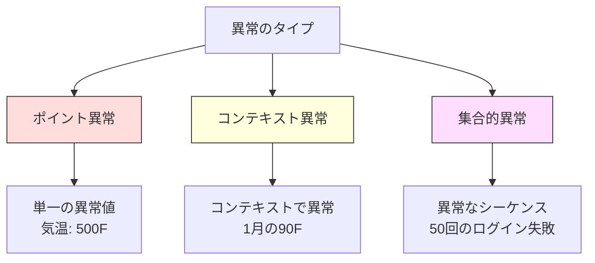
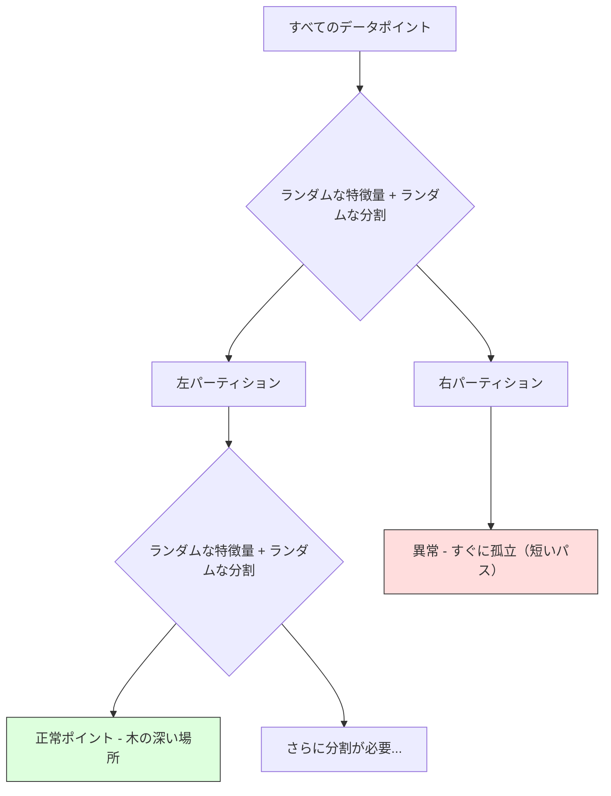
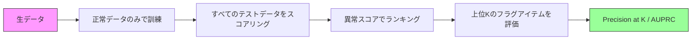

# 異常検知

> 正常は定義しやすい。異常は適合しないものだ。


## 学習目標

- Zスコア、IQR、アイソレーションフォレストの異常検知手法をスクラッチから実装する
- ポイント異常、コンテキスト異常、集合的異常を区別し、それぞれに適切な検知手法を選択する
- 異常検知が異常を分類するのではなく正常データをモデル化するとしてフレーミングされる理由を説明する
- 教師なし異常検知と教師あり分類を比較し、新規異常カバレッジと精度のトレードオフを評価する

## 問題

クレジットカードが午後2時にニューヨークで使われ、2時5分に東京で使われた。工場のセンサーが通常80〜120度の範囲なのに150度を読み取る。サーバーが1秒に50,000リクエストを送るが、日次平均は200だ。

これらは異常だ。発見することが重要だ。詐欺は何十億ものコストをかける。設備の故障はダウンタイムのコストをかける。ネットワーク侵入はデータのコストをかける。

課題：異常のラベル付きサンプルがほとんどない。詐欺は取引の0.1%だ。設備故障は年に数回しかない。「異常」クラスに学習するものがほとんどないため、標準的な分類器を訓練できない。ラベルがあっても、見てきた異常だけが遭遇するすべての種類ではない。明日の詐欺手口は今日のものとは違う。

異常検知は問題を反転させる。異常なものを学習する代わりに、正常なものを学習する。正常から外れるものは何でも疑わしい。これはラベルなしで機能し、新しいタイプの異常に適応し、大規模なデータセットにスケールする。

## コンセプト

### 異常のタイプ

すべての異常は同じではない：

- **ポイント異常。** コンテキストに関係なく異常な単一データポイント。500度の温度読み取り。通常50ドルを使うアカウントからの50,000ドルの取引。
- **コンテキスト異常。** コンテキストを考えると異常なデータポイント。90度の気温は夏は正常だが冬は異常だ。同じ値、異なるコンテキスト。
- **集合的異常。** 個々のポイントは正常かもしれないが、グループとして異常なデータポイントのシーケンス。5回のログイン失敗は正常だ。連続50回はブルートフォース攻撃だ。

ほとんどの手法はポイント異常を検知する。コンテキスト異常には時間や場所の特徴量が必要だ。集合的異常にはシーケンス認識手法が必要だ。



### 教師なしのフレーミング

標準的な分類では両クラスのラベルを持つ。異常検知では通常3つの状況のいずれかだ：

1. **完全教師なし。** ラベルがまったくない。すべてのデータで検知器を適合させ、異常が「正常」モデルを汚染しないほど稀であることを願う。
2. **半教師あり。** 正常データのみのクリーンなデータセットを持つ。このクリーンセットで適合させ、他のすべてをスコアリングする。可能なときに最強のセットアップだ。
3. **弱教師あり。** ラベル付き異常がいくつかある。評価に使うが訓練には使わない。教師なしで訓練し、ラベル付きサブセットで精度/再現率を測定する。

重要な洞察：異常検知は分類と根本的に違う。2クラスの決定境界ではなく、正常データの分布をモデル化している。

### 教師あり vs 教師なし：トレードオフ

ラベル付き異常がある場合、訓練に使う（教師あり分類）か評価のみに使う（教師なし検知）か？

**教師あり（分類として扱う）：**
- 以前に見た正確なタイプの異常を捉える
- 既知の異常タイプで高い精度
- 新規の異常タイプを完全に見逃す
- 新しい異常タイプが出ると再訓練が必要
- 十分な異常サンプルが必要（しばしば少なすぎる）

**教師なし（正常をモデル化し、逸脱をフラグ）：**
- 新規タイプを含む、正常からのどんな逸脱も捉える
- ラベル付き異常が不要
- より高い偽陽性率（すべての異常なものが悪いわけではない）
- 分布シフトに対してより堅牢

実践では、最善のシステムは両方を組み合わせる：広いカバレッジのための教師なし検知、既知の高優先度異常タイプのための教師ありモデル、曖昧なケースのための人間によるレビュー。

### Zスコア法

最もシンプルなアプローチ。各特徴量の平均と標準偏差を計算する。平均からk標準偏差以上離れた点をフラグする。

```text
z_score = (x - mean) / std
|z_score| > threshold なら異常
```

デフォルトの閾値は3.0（ガウス分布では正常データの99.7%が3標準偏差以内に収まる）。

**強み：** シンプル。速い。解釈しやすい（「この値は正常から4.5標準偏差離れている」）。

**弱み：** データが正規分布していることを仮定する。訓練データの外れ値に敏感（外れ値が平均をシフトして標準偏差を膨らませ、検知が難しくなる）。多峰性分布では失敗する。

**うまく機能する場合：** データがほぼベル型の単一特徴量モニタリング。サーバー応答時間、製造公差、安定したベースラインを持つセンサー読み取り。

**失敗する場合：** マルチクラスタデータ（異なるベース温度を持つ2つのオフィスロケーション）、歪んだデータ（1,000ドルの取引は稀だが異常ではない取引金額）、訓練セットに外れ値があるデータ。

### IQR法

Zスコアより堅牢。平均と標準偏差の代わりに四分位範囲を使う。

```
Q1 = 25パーセンタイル
Q3 = 75パーセンタイル
IQR = Q3 - Q1
lower_bound = Q1 - factor * IQR
upper_bound = Q3 + factor * IQR
x < lower_bound または x > upper_bound なら異常
```

デフォルトのファクターは1.5。

**強み：** 外れ値に堅牢（パーセンタイルは極端な値に影響されない）。歪んだ分布で機能する。正規性の仮定なし。

**弱み：** 一変量のみ（特徴量ごとに独立して適用）。特徴量を一緒に考えたときだけ異常なポイントを検知できない（各特徴量単独では正常かもしれないが、結合空間では異常）。

**実践的なメモ：** IQRの1.5ファクターは箱ひげ図のヒゲに相当する。ヒゲの外のポイントは潜在的外れ値だ。1.5の代わりに3.0を使うと検知器がより保守的になる（フラグ少なく、偽陽性少なく）。適切なファクターは誤警報への許容度に依存する。

### アイソレーションフォレスト

重要な洞察：異常は少なく異なる。データのランダムな分割では、異常は孤立しやすい -- 他の残りから分離するのに少ないランダムな分割しか必要としない。



**機能の仕組み：**
1. 多くのランダムな木を構築する（アイソレーションフォレスト）
2. 各ノードで、ランダムな特徴量を選び、特徴量の最小値と最大値の間のランダムな分割値を選ぶ
3. すべてのポイントが孤立する（自分自身の葉に）まで分割し続ける
4. 異常はすべての木で平均パス長が短い

**なぜ機能するか：** 正常ポイントは密な領域に存在する。隣接ポイントから1つを孤立させるのに多くのランダム分割が必要だ。異常は疎な領域に存在する。孤立させるのに1〜2のランダム分割で十分だ。

異常スコアはすべての木にわたる平均パス長に基づいており、ランダム二分探索木の期待パス長で正規化される：

```
score(x) = 2^(-average_path_length(x) / c(n))
```

`c(n)` はn個のサンプルの期待パス長。スコアが1に近いほど異常。0.5に近いほど正常。0に近いほど非常に正常（密なクラスタの深い場所）。

**強み：** 分布の仮定なし。高次元で機能する。スケールが良い（各木がサブサンプルを使うためサンプルサイズに対してサブ線形）。混合特徴量タイプを扱う。

**弱み：** 密な領域の異常に苦労する（マスキング効果）。多くの特徴量が無関係なときランダム分割は効果が薄い。

**重要なハイパーパラメータ：**
- `n_estimators`: 木の数。通常100で十分。木が多いほどスコアが安定するが計算が遅い。
- `max_samples`: 木あたりのサンプル数。元論文のデフォルトは256。小さい値は個々の木の精度を下げるが多様性を高める。サブサンプリングがアイソレーションフォレストを速くする -- 各木がデータの小さな部分しか見ない。
- `contamination`: 予想される異常の割合。閾値を設定するためのみに使う。スコア自体には影響しない。

### ローカル外れ値因子（LOF）

LOFはポイント周辺のローカル密度をその隣接ポイント周辺の密度と比較する。密な領域に囲まれた疎な領域のポイントが異常だ。

**機能の仕組み：**
1. 各ポイントについて、k個の最近傍を見つける
2. ローカル到達可能密度を計算する（近傍がどれほど密か）
3. 各ポイントの密度をその隣接ポイントの密度と比較する
4. ポイントの密度が隣接ポイントよりはるかに低い場合、外れ値だ

**LOFスコア：**
- LOFが1.0に近い = 隣接ポイントと同様の密度（正常）
- LOFが1.0より大きい = 隣接ポイントより低い密度（潜在的に異常）
- LOFが1.0よりはるかに大きい（例：2.0+）= 著しく低い密度（おそらく異常）

「ローカル」の部分が重要だ。2つのクラスタを持つデータセットを考えよう：1000ポイントの密なクラスタと50ポイントの疎なクラスタ。疎なクラスタのエッジのポイントはグローバルには異常ではない -- 50の隣接ポイントがある。しかし直近の隣接ポイントがそれより密な場合、ローカルには異常だ。LOFがグローバル手法では見逃すこのニュアンスを捉える。

**強み：** ローカル異常を検知する（グローバルには異常でなくても近傍では異常なポイント）。異なる密度のクラスタで機能する。

**弱み：** 大きなデータセットでは遅い（単純な実装ではO(n^2)）。kの選択に敏感。非常に高い次元ではうまく機能しない（次元の呪いが距離計算に影響）。

### 比較

| 手法 | 仮定 | 速度 | 高次元を扱う | ローカル異常を検知 |
|------|------|------|------------|----------------|
| Zスコア | 正規分布 | 非常に速い | はい（特徴量ごと） | いいえ |
| IQR | なし（特徴量ごと） | 非常に速い | はい（特徴量ごと） | いいえ |
| アイソレーションフォレスト | なし | 速い | はい | 部分的 |
| LOF | 距離が意味を持つ | 遅い | 悪い | はい |

### 評価の課題

異常検知器の評価は分類器の評価より難しい：

- **極端なクラス不均衡。** 0.1%の異常では、すべてに対して「正常」を予測すると99.9%の精度が出る。精度は役に立たない。
- **AUROCは誤解を招く。** 重い不均衡では、実際の閾値でほとんどの異常を見逃してもAUROCは良く見える。
- **より良い指標：** Precision@k（上位kのフラグアイテムのうち本当の異常はいくつか）、AUPRC（精度-再現率曲線下面積）、固定偽陽性率での再現率。



### 異常検知パイプライン

実践では、異常検知はこのワークフローに従う：

1. **ベースラインデータを収集する。** 理想的には、異常がないと知っている（または非常に少ない）期間。
2. **特徴量エンジニアリング。** 生特徴量に加えて派生特徴量（ローリング統計、時間特徴量、比率）。
3. **検知器を訓練する。** ベースラインデータで適合させる。モデルは「正常」がどんな見た目かを学習する。
4. **新しいデータをスコアリングする。** 各新しい観測が異常スコアを得る。
5. **閾値選択。** スコアカットオフを選ぶ。これはビジネス上の判断で技術的なものではない：高い閾値は誤警報を少なくするが見逃す異常を増やす。
6. **アラートして調査する。** フラグされたポイントは人間のレビューまたは自動対応に進む。
7. **フィードバック収集。** フラグされたアイテムが本当の異常か誤警報かを記録する。このデータを使って検知器を評価し、閾値を時間とともに調整する。

パイプラインは「完成」することはない。データ分布がシフトし、新しい異常タイプが出現し、閾値の調整が必要だ。異常検知を一度限りのモデルではなく生きたシステムとして扱う。

## 実装する

`code/anomaly_detection.py` のコードはZスコア、IQR、アイソレーションフォレストをスクラッチから実装する。

### Zスコア検知器

```python
def zscore_detect(X, threshold=3.0):
    mean = X.mean(axis=0)
    std = X.std(axis=0)
    std[std == 0] = 1.0
    z = np.abs((X - mean) / std)
    return z.max(axis=1) > threshold
```

シンプルでベクトル化されている。いずれかの特徴量が閾値を超えるとポイントをフラグする。

### IQR検知器

```python
def iqr_detect(X, factor=1.5):
    q1 = np.percentile(X, 25, axis=0)
    q3 = np.percentile(X, 75, axis=0)
    iqr = q3 - q1
    iqr[iqr == 0] = 1.0
    lower = q1 - factor * iqr
    upper = q3 + factor * iqr
    outside = (X < lower) | (X > upper)
    return outside.any(axis=1)
```

### スクラッチからのアイソレーションフォレスト

スクラッチからの実装は特徴量空間をランダムに分割するアイソレーションツリーを構築する：

```python
class IsolationTree:
    def __init__(self, max_depth):
        self.max_depth = max_depth

    def fit(self, X, depth=0):
        n, p = X.shape
        if depth >= self.max_depth or n <= 1:
            self.is_leaf = True
            self.size = n
            return self
        self.is_leaf = False
        self.feature = np.random.randint(p)
        x_min = X[:, self.feature].min()
        x_max = X[:, self.feature].max()
        if x_min == x_max:
            self.is_leaf = True
            self.size = n
            return self
        self.threshold = np.random.uniform(x_min, x_max)
        left_mask = X[:, self.feature] < self.threshold
        self.left = IsolationTree(self.max_depth).fit(X[left_mask], depth + 1)
        self.right = IsolationTree(self.max_depth).fit(X[~left_mask], depth + 1)
        return self
```

ポイントを孤立させるまでのパス長が異常スコアを決定する。短いパスはより異常であることを意味する。

`IsolationForest` クラスは複数の木をラップする：

```python
class IsolationForest:
    def __init__(self, n_estimators=100, max_samples=256, seed=42):
        self.n_estimators = n_estimators
        self.max_samples = max_samples

    def fit(self, X):
        sample_size = min(self.max_samples, X.shape[0])
        max_depth = int(np.ceil(np.log2(sample_size)))
        for _ in range(self.n_estimators):
            idx = rng.choice(X.shape[0], size=sample_size, replace=False)
            tree = IsolationTree(max_depth=max_depth)
            tree.fit(X[idx])
            self.trees.append(tree)

    def anomaly_score(self, X):
        avg_path = すべての木にわたる平均パス長
        scores = 2.0 ** (-avg_path / c(max_samples))
        return scores
```

正規化因子 `c(n)` はn個の要素を持つ二分探索木での失敗した検索の期待パス長だ。`2 * H(n-1) - 2*(n-1)/n` に等しい（Hは調和数）。この正規化により異なるサイズのデータセットでスコアが比較可能になる。

### デモシナリオ

コードは複数のテストシナリオを生成する：

1. **外れ値を持つ単一クラスタ。** 中心から遠く注入された異常を持つ2Dガウスクラスタ。すべての手法がここで機能するはずだ。
2. **多峰性データ。** 異なるサイズと密度の3つのクラスタ。クラスタ間のポイントが異常だ。Zスコアは特徴量ごとの範囲が広いため苦労する。
3. **高次元データ。** 50個の特徴量だが、異常は5つの特徴量でのみ異なる。手法が特徴量のサブセットで異常を見つけられるかをテストする。

各デモは精度、再現率、F1、Precision@kを使ってすべての手法を比較する。

## 使う

sklearn（ライブラリ実装、スクラッチからではない）で：

```python
from sklearn.ensemble import IsolationForest
from sklearn.neighbors import LocalOutlierFactor

iso = IsolationForest(n_estimators=100, contamination=0.05, random_state=42)
iso.fit(X_train)
predictions = iso.predict(X_test)

lof = LocalOutlierFactor(n_neighbors=20, contamination=0.05, novelty=True)
lof.fit(X_train)
predictions = lof.predict(X_test)
```

`contamination` は予想される異常の割合を設定することに注意する。正しく設定することが重要だ -- 低すぎると異常を見逃し、高すぎると誤警報が増える。

`anomaly_detection.py` のコードは同じデータでスクラッチからの実装とsklearnを比較する。

### sklearnのcontaminationパラメータ

sklearnの `contamination` パラメータは連続した異常スコアを二値予測に変換する閾値を決定する。基礎的なスコア自体は変えない。

```python
iso_5 = IsolationForest(contamination=0.05)
iso_10 = IsolationForest(contamination=0.10)
```

両方が同じ異常スコアを生成する。ただし `iso_5` は上位5%をフラグし、`iso_10` は上位10%をフラグする。真の異常率がわからない場合（通常わからない）、contaminationを「auto」に設定してスコアを直接扱う。偽陽性と偽陰性のコストトレードオフに基づいて自分の閾値を設定する。

### ワンクラスSVM

知っておく価値のあるもう一つの教師なし異常検知器。ワンクラスSVMは高次元特徴空間（カーネルトリックを使用）で正常データの周りに境界を合わせる。

```python
from sklearn.svm import OneClassSVM

oc_svm = OneClassSVM(kernel="rbf", gamma="auto", nu=0.05)
oc_svm.fit(X_train)
predictions = oc_svm.predict(X_test)
```

`nu` パラメータは異常の割合を近似する。ワンクラスSVMは小〜中規模のデータセットでうまく機能するが、非常に大きなデータにはスケールしない（カーネル行列が二次的に成長する）。

### オートエンコーダアプローチ（プレビュー）

オートエンコーダはデータを圧縮して再構成することを学習するニューラルネットワークだ。正常データで訓練する。テスト時に、ネットワークが正常なパターンだけを再構成することを学習したため、異常は高い再構成誤差を持つ。

これはフェーズ3（ディープラーニング）でカバーされるが、原則は同じだ：正常なものをモデル化し、逸脱をフラグする。

### アンサンブル異常検知

アンサンブル手法が分類を改善するように（レッスン11）、複数の異常検知器を組み合わせることで検知が改善される。最もシンプルなアプローチ：

1. 複数の検知器を実行する（Zスコア、IQR、アイソレーションフォレスト、LOF）
2. 各検知器のスコアを[0, 1]に正規化する
3. 正規化されたスコアを平均化する
4. 平均スコアで閾値を上回ったポイントをフラグする

異なる手法が異なる失敗モードを持つため、偽陽性が減る。4つすべての手法でフラグされたポイントはほぼ確実に異常だ。1つの手法のみでフラグされたポイントはその手法の特性かもしれない。

より洗練されたアンサンブルは各検知器をその推定信頼性（利用可能であれば既知の異常を持つ検証セットで測定）で重み付けする。

### 本番での考慮事項

1. **閾値のドリフト。** データ分布がシフトするにつれて、固定閾値は時代遅れになる。異常スコアの分布を監視して定期的に調整する。
2. **アラート疲労。** 誤警報が多すぎるとオペレーターは注意を払わなくなる。高い閾値から始め（より少ないが、より信頼できるアラート）、信頼が高まるにつれて下げる。
3. **アンサンブルアプローチ。** 本番では複数の検知器を組み合わせる。複数の手法が異常と一致したときのみポイントをフラグする。これにより誤陽性が大幅に減る。
4. **特徴量エンジニアリング。** 生の特徴量だけでは十分でないことが多い。ローリング統計、比率、最後のイベントからの時間、ドメイン固有の特徴量を追加する。良い特徴量セットは検知器の選択より重要だ。
5. **フィードバックループ。** オペレーターがフラグされたアイテムを調査して確認または却下するとき、これをシステムにフィードバックする。時間とともにラベル付きデータを蓄積して検知器を評価し改善する。

## 出荷する

このレッスンの成果物：
- `outputs/skill-anomaly-detector.md` -- 適切な検知器を選ぶための決定スキル
- `code/anomaly_detection.py` -- Zスコア、IQR、アイソレーションフォレストをスクラッチから、sklearnとの比較付き

### 閾値の選択

異常スコアは連続的だ。二値決定を行うには閾値が必要だ。これはビジネス上の判断であり、技術的なものではない。

2つのシナリオを考えよう：
- **詐欺検知。** 詐欺を見逃すのは高コスト（チャージバック、顧客の信頼）。誤警報は人間のアナリストが5分調査する。詐欺をより多く捉えるために低い閾値を設定し、より多くの誤警報を受け入れる。
- **設備保守。** 誤警報は50,000ドルのコストの不要なシャットダウンを意味する。見逃した故障は50万ドルの修理を意味する。これらのコストのバランスを取るために閾値を設定する。

どちらの場合も、最適な閾値は偽陽性と偽陰性のコスト比に依存する。異なる閾値での精度と再現率をプロットし、コスト関数を重ね合わせ、最低コストのポイントを選ぶ。

### 本番へのスケーリング

本番でのリアルタイム異常検知のために：

1. **バッチ訓練、オンラインスコアリング。** 定期的に（日次、週次）最近の正常データでモデルを訓練する。到着する各新しい観測をスコアリングする。
2. **特徴量計算が一致しなければならない。** 30日間のローリング統計で訓練した場合、新しい観測の特徴量を計算するのに30日間の履歴が必要だ。必要な履歴をバッファする。
3. **スコア分布のモニタリング。** 時間とともに異常スコアの分布を追跡する。中央値スコアが上昇し始めたら、データが変化しているかモデルが陳腐化している。
4. **説明可能性。** 異常をフラグするとき、理由を述べる。Zスコア：「特徴量Xが正常より4.2標準偏差上だ。」アイソレーションフォレスト：「このポイントは平均3.1回の分割で孤立した（正常ポイントは8.5回かかる）。」

## 演習

1. **閾値チューニング。** Zスコア検知器を1.0から5.0まで0.5ステップで実行する。各閾値での精度と再現率をプロットする。データのスイートスポットはどこか？

2. **多変量異常。** 各特徴量単独では正常に見えるが、組み合わせが異常な2Dデータを作成する（例：主クラスタ対角から遠いポイント）。特徴量ごとのZスコアがこれを見逃すが、アイソレーションフォレストは捉えることを示す。

3. **スクラッチからのLOF。** k最近傍を使ってローカル外れ値因子を実装する。同じデータでsklearnのLocalOutlierFactorと比較する。k=10とk=50を使う -- kの選択が結果にどう影響するか？

4. **ストリーミング異常検知。** ストリーミング設定で機能するようにZスコア検知器を変更する：新しいポイントが到着するにつれてランニング平均と分散を更新する（Welfordのオンラインアルゴリズム）。同じデータでバッチZスコアと比較する。

5. **実世界の評価。** 既知の異常を持つデータセットを取る（例：Kaggleのクレジットカード詐欺）。4つすべての手法をprecision@100、precision@500、AUPRCを使って評価する。どの手法が最もうまく機能するか？なぜか？

## 主要用語

| 用語 | 人々がよく言うこと | 実際の意味 |
|------|----------------|-----------|
| 異常 | 「外れ値、異常なポイント」 | 正常データの期待されるパターンから著しく逸脱するデータポイント |
| ポイント異常 | 「単一の変な値」 | コンテキストに関係なく異常な個別の観測 |
| コンテキスト異常 | 「正常な値、間違ったコンテキスト」 | コンテキスト（時間、場所など）を考えると異常な観測だが、別のコンテキストでは正常かもしれない |
| アイソレーションフォレスト | 「外れ値を見つけるランダム分割」 | 正常ポイントより少ない分割で異常を孤立させるランダムツリーのアンサンブル |
| ローカル外れ値因子 | 「密度を隣接ポイントと比較する」 | ローカル密度が隣接ポイントの密度よりはるかに低いポイントをフラグする手法 |
| Zスコア | 「平均からの標準偏差」 | (x - mean) / std、標準偏差単位で中心からどれだけ離れているかを測定する |
| IQR | 「四分位範囲」 | Q3 - Q1、データの中央50%の広がりを測定し、堅牢な外れ値検知に使う |
| コンタミネーション | 「予想される異常の割合」 | 検知器がデータのどの割合を異常としてフラグすべきかを指示するハイパーパラメータ |
| Precision@k | 「上位kのフラグのうちいくつが本物か」 | k個の最も疑わしいポイントのみで計算された精度、不均衡な異常検知に有用 |
| AUPRC | 「精度-再現率曲線下面積」 | すべての閾値にわたる精度-再現率パフォーマンスをまとめた指標、不均衡データではAUROCより良い |

## さらに読む

- [Liu et al., Isolation Forest (2008)](https://cs.nju.edu.cn/zhouzh/zhouzh.files/publication/icdm08b.pdf) -- アイソレーションフォレストの元論文
- [Breunig et al., LOF: Identifying Density-Based Local Outliers (2000)](https://dl.acm.org/doi/10.1145/342009.335388) -- 元のLOF論文
- [scikit-learn 外れ値検知ドキュメント](https://scikit-learn.org/stable/modules/outlier_detection.html) -- すべてのsklearn異常検知器の概要
- [Chandola et al., Anomaly Detection: A Survey (2009)](https://dl.acm.org/doi/10.1145/1541880.1541882) -- 異常検知手法の包括的なサーベイ
- [Goldstein and Uchida, A Comparative Evaluation of Unsupervised Anomaly Detection Algorithms (2016)](https://journals.plos.org/plosone/article?id=10.1371/journal.pone.0152173) -- 実際のデータセットで10手法を実証比較
