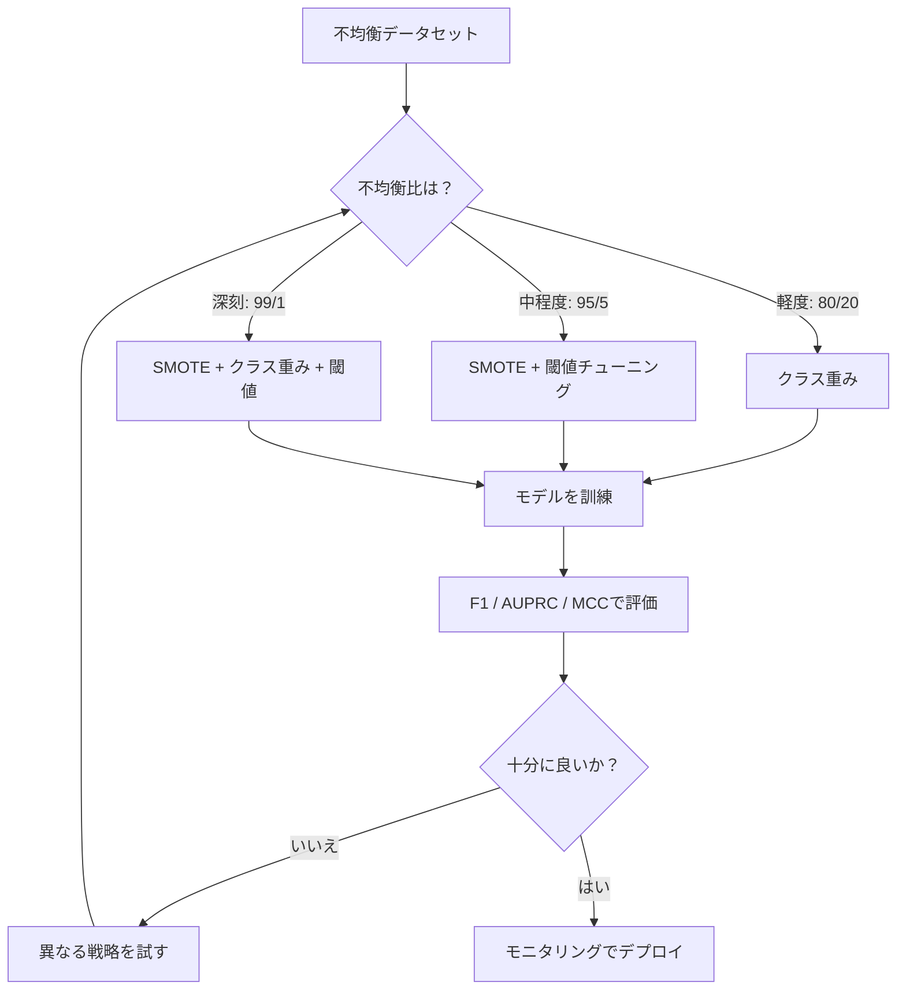
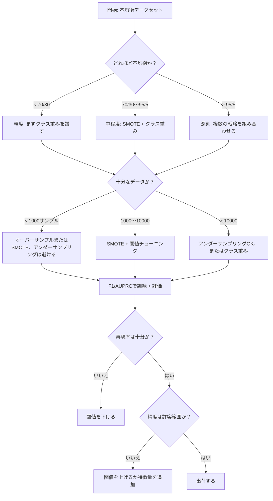

# 不均衡データの扱い方

> データの99%が「正常」なとき、精度は嘘をついている。


## 学習目標

- SMOTEをスクラッチから実装し、合成的なオーバーサンプリングがランダムな複製とどう違うかを説明する
- F1、AUPRC、マシューズ相関係数を使って精度の代わりに不均衡な分類器を評価する
- クラス重み付け、閾値チューニング、リサンプリング戦略を比較し、与えられた不均衡比に適切なアプローチを選択する
- SMOTE、クラス重み、閾値最適化を組み合わせた完全な不均衡データパイプラインを構築する

## 問題

詐欺検知モデルを構築する。99.9%の精度が出る。喜ぶ。そして気づく -- すべての取引で「詐欺でない」と予測している。

これはバグではない。取引の0.1%だけが詐欺のとき、合理的なことだ。モデルは多数クラスを常に推測することが全体的な誤りを最小化することを学習する。技術的には正しく、完全に役に立たない。

これはリアルな分類が重要なすべての場所で起きる。疾病診断：陽性率1%。ネットワーク侵入：0.01%の攻撃。製造欠陥：0.5%の欠陥品。スパムフィルタリング：20%スパム。チャーン予測：5%の解約者。少数クラスが重要であるほど、稀になる傾向がある。

精度はすべての正解予測を等しく扱うため失敗する。正規の取引を正しくラベリングすることと詐欺を正しく捉えることは両方とも精度の1ポイントとしてカウントされる。しかし詐欺を捉えることがモデルが存在する理由のすべてだ。モデルが稀だが重要なクラスに注意を払うように強制する指標、技術、訓練戦略が必要だ。

## コンセプト

### なぜ精度が失敗するか

1000サンプルのデータセットを考えよう：990個が陰性、10個が陽性。常に陰性を予測するモデル：

|  | 陽性と予測 | 陰性と予測 |
|--|---|---|
| 実際に陽性 | 0 (TP) | 10 (FN) |
| 実際に陰性 | 0 (FP) | 990 (TN) |

精度 = (0 + 990) / 1000 = 99.0%

モデルは詐欺をゼロ捉える。疾病をゼロ。欠陥品をゼロ。しかし精度は99%と言う。これが不均衡な問題では精度が危険な理由だ。

### より良い指標

**精度（Precision）** = TP / (TP + FP)。陽性としてフラグされたものすべてのうち、実際に陽性はいくつか？高い精度は誤警報が少ないことを意味する。

**再現率（Recall）** = TP / (TP + FN)。実際に陽性のものすべてのうち、いくつ捉えたか？高い再現率は見逃した陽性が少ないことを意味する。

**F1スコア** = 2 * 精度 * 再現率 / (精度 + 再現率)。調和平均。精度と再現率の極端な不均衡を算術平均より重くペナルティとする。

**F-ベータスコア** = (1 + beta^2) * 精度 * 再現率 / (beta^2 * 精度 + 再現率)。beta > 1のとき再現率が重要。beta < 1のとき精度が重要。F2は詐欺検知で一般的だ（詐欺を見逃すことは誤警報より悪い）。

**AUPRC**（精度-再現率曲線下面積）。AUC-ROCに似ているが不均衡データにより情報量が多い。ランダム分類器はAUPRC（ROCのような0.5ではなく）が陽性クラス率に等しい。これにより改善が見えやすくなる。

**マシューズ相関係数** = (TP * TN - FP * FN) / sqrt((TP+FP)(TP+FN)(TN+FP)(TN+FN))。-1から+1の範囲。両クラスでうまく機能するときのみ高いスコアを与える。クラスサイズが大きく異なっても均衡している。

上記の「常に陰性を予測する」モデルの場合：精度 = 0/0（未定義、しばしば0に設定）、再現率 = 0/10 = 0、F1 = 0、MCC = 0。これらの指標はモデルが価値のないことを正しく識別する。

### 不均衡データパイプライン



### SMOTE：合成少数オーバーサンプリング技術

ランダムオーバーサンプリングは既存の少数サンプルを複製する。機能するが、モデルが同一のポイントを繰り返し見るため過学習のリスクがある。

SMOTEは妥当だがコピーではない新しい合成少数サンプルを作成する。アルゴリズム：

1. 各少数サンプルxについて、他の少数サンプルの中からk個の最近傍を見つける
2. ランダムに1つの隣接ポイントを選ぶ
3. xとその隣接ポイントの線分上に新しいサンプルを作成する

数式：`new_sample = x + random(0, 1) * (neighbor - x)`

これは実際の少数ポイント間を補間し、既存のデータをコピーせずに同じ特徴量空間の領域にサンプルを作成する。


### サンプリング戦略の比較

**ランダムオーバーサンプリング**：多数クラスのカウントに合わせて少数サンプルを複製する。
- 利点：シンプル、情報損失なし
- 欠点：完全な複製が過学習を引き起こす、訓練時間が増える

**ランダムアンダーサンプリング**：少数クラスのカウントに合わせて多数サンプルを削除する。
- 利点：速い訓練、シンプル
- 欠点：潜在的に有用な多数データを捨てる、高い分散

**SMOTE**：補間を使って合成少数サンプルを作成する。
- 利点：新しいデータポイントを生成、ランダムオーバーサンプリングと比べて過学習を減らす
- 欠点：決定境界近くにノイズサンプルを作成する可能性、多数クラスの分布を考慮しない

| 戦略 | 変更するデータ | リスク | 使用場面 |
|------|-------------|------|---------|
| オーバーサンプル | 少数が複製される | 過学習 | 小さいデータセット、中程度の不均衡 |
| アンダーサンプル | 多数が削除される | 情報損失 | 大きいデータセット、速い訓練が欲しい |
| SMOTE | 合成的少数が追加される | 境界ノイズ | 中程度の不均衡、k-NNに十分な少数サンプル |

### クラス重み

データを変える代わりに、モデルが誤りを扱う方法を変える。少数クラスを誤分類することに高い重みを割り当てる。

950個の陰性と50個の陽性を持つ二値問題：
- 陰性クラスの重み = n_samples / (2 * n_negative) = 1000 / (2 * 950) = 0.526
- 陽性クラスの重み = n_samples / (2 * n_positive) = 1000 / (2 * 50) = 10.0

陽性クラスは19倍の重みを得る。1つの陽性サンプルを誤分類することは19個の陰性サンプルを誤分類することと同じコストだ。モデルは少数クラスに注意を払うよう強制される。

ロジスティック回帰では、これが損失関数を修正する：

```
weighted_loss = -sum(w_i * [y_i * log(p_i) + (1-y_i) * log(1-p_i)])
```

ここでw_iはサンプルiのクラスに依存する。

クラス重みは期待値においてオーバーサンプリングと数学的に同等だが、新しいデータポイントを作成しない。これにより速く、複製サンプルの過学習リスクを避ける。

### 閾値チューニング

ほとんどの分類器は確率を出力する。デフォルトの閾値は0.5：P(陽性) >= 0.5なら陽性と予測する。しかし0.5は任意だ。クラスが不均衡なとき、最適な閾値は通常はるかに低い。

プロセス：
1. モデルを訓練する
2. 検証セットで予測確率を得る
3. 0.0から1.0の閾値をスイープする
4. 各閾値でF1（または選択した指標）を計算する
5. 指標を最大化する閾値を選ぶ


モデルが詐欺取引のP(詐欺) = 0.15を出力するかもしれない。閾値0.5では詐欺でないと分類される。閾値0.10では正しく捉えられる。確率の較正はランキングより重要ではない -- 詐欺が詐欺でないより高い確率を得る限り、それらを分離する閾値が存在する。

### コスト感応学習

クラス重みの一般化。一様なコストの代わりに、特定の誤分類コストを割り当てる：

| | 陽性と予測 | 陰性と予測 |
|--|---|---|
| 実際に陽性 | 0 (正解) | C_FN = 100 |
| 実際に陰性 | C_FP = 1 | 0 (正解) |

詐欺取引を見逃すこと（FN）は誤警報（FP）の100倍のコストがかかる。モデルは誤りの総数ではなく総コストのために最適化する。

これは実際のコストを推定できるときに最も原則的なアプローチだ。見逃したがん診断は追加生検につながる誤警報とは非常に異なるコストを持つ。これらのコストを明示することで正しいトレードオフが強制される。

### 決定フローチャート



## 実装する

### ステップ1：不均衡データセットを生成する

```python
import numpy as np


def make_imbalanced_data(n_majority=950, n_minority=50, seed=42):
    rng = np.random.RandomState(seed)

    X_maj = rng.randn(n_majority, 2) * 1.0 + np.array([0.0, 0.0])
    X_min = rng.randn(n_minority, 2) * 0.8 + np.array([2.5, 2.5])

    X = np.vstack([X_maj, X_min])
    y = np.concatenate([np.zeros(n_majority), np.ones(n_minority)])

    shuffle_idx = rng.permutation(len(y))
    return X[shuffle_idx], y[shuffle_idx]
```

### ステップ2：スクラッチからのSMOTE

```python
def euclidean_distance(a, b):
    return np.sqrt(np.sum((a - b) ** 2))


def find_k_neighbors(X, idx, k):
    distances = []
    for i in range(len(X)):
        if i == idx:
            continue
        d = euclidean_distance(X[idx], X[i])
        distances.append((i, d))
    distances.sort(key=lambda x: x[1])
    return [d[0] for d in distances[:k]]


def smote(X_minority, k=5, n_synthetic=100, seed=42):
    rng = np.random.RandomState(seed)
    n_samples = len(X_minority)
    k = min(k, n_samples - 1)
    synthetic = []

    for _ in range(n_synthetic):
        idx = rng.randint(0, n_samples)
        neighbors = find_k_neighbors(X_minority, idx, k)
        neighbor_idx = neighbors[rng.randint(0, len(neighbors))]
        t = rng.random()
        new_point = X_minority[idx] + t * (X_minority[neighbor_idx] - X_minority[idx])
        synthetic.append(new_point)

    return np.array(synthetic)
```

### ステップ3：ランダムオーバーサンプリングとアンダーサンプリング

```python
def random_oversample(X, y, seed=42):
    rng = np.random.RandomState(seed)
    classes, counts = np.unique(y, return_counts=True)
    max_count = counts.max()

    X_resampled = list(X)
    y_resampled = list(y)

    for cls, count in zip(classes, counts):
        if count < max_count:
            cls_indices = np.where(y == cls)[0]
            n_needed = max_count - count
            chosen = rng.choice(cls_indices, size=n_needed, replace=True)
            X_resampled.extend(X[chosen])
            y_resampled.extend(y[chosen])

    X_out = np.array(X_resampled)
    y_out = np.array(y_resampled)
    shuffle = rng.permutation(len(y_out))
    return X_out[shuffle], y_out[shuffle]


def random_undersample(X, y, seed=42):
    rng = np.random.RandomState(seed)
    classes, counts = np.unique(y, return_counts=True)
    min_count = counts.min()

    X_resampled = []
    y_resampled = []

    for cls in classes:
        cls_indices = np.where(y == cls)[0]
        chosen = rng.choice(cls_indices, size=min_count, replace=False)
        X_resampled.extend(X[chosen])
        y_resampled.extend(y[chosen])

    X_out = np.array(X_resampled)
    y_out = np.array(y_resampled)
    shuffle = rng.permutation(len(y_out))
    return X_out[shuffle], y_out[shuffle]
```

### ステップ4：クラス重みを使ったロジスティック回帰

```python
def sigmoid(z):
    return 1.0 / (1.0 + np.exp(-np.clip(z, -500, 500)))


def logistic_regression_weighted(X, y, weights, lr=0.01, epochs=200):
    n_samples, n_features = X.shape
    w = np.zeros(n_features)
    b = 0.0

    for _ in range(epochs):
        z = X @ w + b
        pred = sigmoid(z)
        error = pred - y
        weighted_error = error * weights

        gradient_w = (X.T @ weighted_error) / n_samples
        gradient_b = np.mean(weighted_error)

        w -= lr * gradient_w
        b -= lr * gradient_b

    return w, b


def compute_class_weights(y):
    classes, counts = np.unique(y, return_counts=True)
    n_samples = len(y)
    n_classes = len(classes)
    weight_map = {}
    for cls, count in zip(classes, counts):
        weight_map[cls] = n_samples / (n_classes * count)
    return np.array([weight_map[yi] for yi in y])
```

### ステップ5：閾値チューニング

```python
def find_optimal_threshold(y_true, y_probs, metric="f1"):
    best_threshold = 0.5
    best_score = -1.0

    for threshold in np.arange(0.05, 0.96, 0.01):
        y_pred = (y_probs >= threshold).astype(int)
        tp = np.sum((y_pred == 1) & (y_true == 1))
        fp = np.sum((y_pred == 1) & (y_true == 0))
        fn = np.sum((y_pred == 0) & (y_true == 1))

        if metric == "f1":
            precision = tp / (tp + fp) if (tp + fp) > 0 else 0.0
            recall = tp / (tp + fn) if (tp + fn) > 0 else 0.0
            score = 2 * precision * recall / (precision + recall) if (precision + recall) > 0 else 0.0
        elif metric == "recall":
            score = tp / (tp + fn) if (tp + fn) > 0 else 0.0
        elif metric == "precision":
            score = tp / (tp + fp) if (tp + fp) > 0 else 0.0

        if score > best_score:
            best_score = score
            best_threshold = threshold

    return best_threshold, best_score
```

### ステップ6：評価関数

```python
def confusion_matrix_values(y_true, y_pred):
    tp = np.sum((y_pred == 1) & (y_true == 1))
    tn = np.sum((y_pred == 0) & (y_true == 0))
    fp = np.sum((y_pred == 1) & (y_true == 0))
    fn = np.sum((y_pred == 0) & (y_true == 1))
    return tp, tn, fp, fn


def compute_metrics(y_true, y_pred):
    tp, tn, fp, fn = confusion_matrix_values(y_true, y_pred)
    accuracy = (tp + tn) / (tp + tn + fp + fn)
    precision = tp / (tp + fp) if (tp + fp) > 0 else 0.0
    recall = tp / (tp + fn) if (tp + fn) > 0 else 0.0
    f1 = 2 * precision * recall / (precision + recall) if (precision + recall) > 0 else 0.0

    denom = np.sqrt(float((tp + fp) * (tp + fn) * (tn + fp) * (tn + fn)))
    mcc = (tp * tn - fp * fn) / denom if denom > 0 else 0.0

    return {
        "accuracy": accuracy,
        "precision": precision,
        "recall": recall,
        "f1": f1,
        "mcc": mcc,
    }
```

### ステップ7：すべてのアプローチを比較する

```python
X, y = make_imbalanced_data(950, 50, seed=42)
split = int(0.8 * len(y))
X_train, X_test = X[:split], X[split:]
y_train, y_test = y[:split], y[split:]

# ベースライン: 処理なし
w_base, b_base = logistic_regression_weighted(
    X_train, y_train, np.ones(len(y_train)), lr=0.1, epochs=300
)
probs_base = sigmoid(X_test @ w_base + b_base)
preds_base = (probs_base >= 0.5).astype(int)

# オーバーサンプル
X_over, y_over = random_oversample(X_train, y_train)
w_over, b_over = logistic_regression_weighted(
    X_over, y_over, np.ones(len(y_over)), lr=0.1, epochs=300
)
preds_over = (sigmoid(X_test @ w_over + b_over) >= 0.5).astype(int)

# SMOTE
minority_mask = y_train == 1
X_minority = X_train[minority_mask]
synthetic = smote(X_minority, k=5, n_synthetic=len(y_train) - 2 * int(minority_mask.sum()))
X_smote = np.vstack([X_train, synthetic])
y_smote = np.concatenate([y_train, np.ones(len(synthetic))])
w_sm, b_sm = logistic_regression_weighted(
    X_smote, y_smote, np.ones(len(y_smote)), lr=0.1, epochs=300
)
preds_smote = (sigmoid(X_test @ w_sm + b_sm) >= 0.5).astype(int)

# クラス重み
sample_weights = compute_class_weights(y_train)
w_cw, b_cw = logistic_regression_weighted(
    X_train, y_train, sample_weights, lr=0.1, epochs=300
)
probs_cw = sigmoid(X_test @ w_cw + b_cw)
preds_cw = (probs_cw >= 0.5).astype(int)

# 閾値チューニング（テストセットではなく保留された検証セットでチューニング）
probs_val = sigmoid(X_val @ w_cw + b_cw)
best_thresh, best_f1 = find_optimal_threshold(y_val, probs_val, metric="f1")
preds_thresh = (probs_cw >= best_thresh).astype(int)
```

コードファイルはこれすべてを1つのスクリプトで実行し、結果を印刷する。

## 使う

scikit-learnとimbalanced-learnでは、これらの技術は1行だ：

```python
from sklearn.linear_model import LogisticRegression
from sklearn.metrics import classification_report, f1_score
from sklearn.model_selection import train_test_split
from imblearn.over_sampling import SMOTE
from imblearn.under_sampling import RandomUnderSampler
from imblearn.pipeline import Pipeline

X_train, X_test, y_train, y_test = train_test_split(X, y, stratify=y)

model_weighted = LogisticRegression(class_weight="balanced")
model_weighted.fit(X_train, y_train)
print(classification_report(y_test, model_weighted.predict(X_test)))

smote = SMOTE(random_state=42)
X_resampled, y_resampled = smote.fit_resample(X_train, y_train)
model_smote = LogisticRegression()
model_smote.fit(X_resampled, y_resampled)
print(classification_report(y_test, model_smote.predict(X_test)))

pipeline = Pipeline([
    ("smote", SMOTE()),
    ("model", LogisticRegression(class_weight="balanced")),
])
pipeline.fit(X_train, y_train)
print(classification_report(y_test, pipeline.predict(X_test)))
```

スクラッチからの実装は各技術が正確に何をするかを示す。SMOTEは少数クラスへのk-NN補間だけだ。クラス重みは損失を乗算する。閾値チューニングはカットオフに対するforループだ。魔法はない。

## 出荷する

このレッスンの成果物：
- `outputs/skill-imbalanced-data.md` -- 不均衡な分類問題を扱うための決定チェックリスト

## 演習

1. **ボーダーラインSMOTE**：SMOTE実装を変更して、決定境界近くの少数ポイント（k最近傍に多数クラスのサンプルが含まれるもの）のみに合成サンプルを生成する。クラスが重なるデータセットで標準SMOTEと結果を比較する。

2. **コスト行列最適化**：コスト行列をパラメータとするコスト感応学習を実装する。コスト行列を受け取り、期待コストを最小化する最適な予測を返す関数を作成する。異なるコスト比（1:10、1:100、1:1000）でテストし、精度-再現率トレードオフがどう変化するかをプロットする。

3. **閾値較正**：Plattスケーリングを実装する（モデルの生の出力に対してロジスティック回帰を適合させて較正された確率を生成する）。較正前後の精度-再現率曲線を比較する。較正はランキングを変えないことを示す（AUCは同じまま）が確率をより意味のあるものにする。

4. **均衡バギングを使ったアンサンブル**：複数のモデルを訓練し、それぞれが均衡ブートストラップサンプル（すべての少数 + 多数のランダムサブセット）で訓練される。予測を平均化する。このアプローチをSMOTEを使った単一モデルと比較する。パフォーマンスと実行間の分散の両方を測定する。

5. **不均衡比実験**：均衡したデータセットを取り、不均衡比を徐々に増加させる（50/50、70/30、90/10、95/5、99/1）。各比で、SMOTEありとなしで訓練する。両方のアプローチのF1 vs 不均衡比をプロットする。どの比でSMOTEが意味のある違いをもたらし始めるか？

## 主要用語

| 用語 | 人々がよく言うこと | 実際の意味 |
|------|----------------|-----------|
| クラス不均衡 | 「一方のクラスのサンプルがはるかに多い」 | データセット内のクラスの分布が著しく歪んでいて、モデルが多数クラスを優遇する |
| SMOTE | 「合成オーバーサンプリング」 | 既存の少数サンプルとそのk最近傍少数サンプルの間を補間して新しい少数サンプルを作成する |
| クラス重み | 「稀なクラスの誤りをより高くする」 | 少数クラスの誤分類をより重くペナルティとするように、クラス固有の重みで損失関数を乗算する |
| 閾値チューニング | 「決定境界を移動する」 | 分類のデフォルト0.5から目的の指標を最適化する値に確率カットオフを変更する |
| 精度-再現率トレードオフ | 「両方は持てない」 | 閾値を下げると陽性が多く捉えられる（再現率向上）が誤陽性も増える（精度低下）、逆もまた然り |
| AUPRC | 「PR曲線下面積」 | 精度-再現率曲線を1つの数値にまとめる；クラスが大きく不均衡なときAUC-ROCより情報量が多い |
| マシューズ相関係数 | 「均衡した指標」 | 両クラスでうまく機能するときのみ高いスコアを生成する、予測ラベルと実際のラベルの相関 |
| コスト感応学習 | 「異なる間違いは異なるコスト」 | 実際の誤分類コストを訓練目標に組み込んで、誤りの数ではなく総コストのために最適化する |
| ランダムオーバーサンプリング | 「少数を複製する」 | クラスカウントを均衡させるために少数クラスサンプルを繰り返す；シンプルだが複製されたポイントへの過学習リスクがある |

## さらに読む

- [SMOTE: Synthetic Minority Over-sampling Technique (Chawla et al., 2002)](https://arxiv.org/abs/1106.1813) -- 元のSMOTE論文、不均衡学習で最も引用されている作業
- [Learning from Imbalanced Data (He & Garcia, 2009)](https://ieeexplore.ieee.org/document/5128907) -- サンプリング、コスト感応、アルゴリズムアプローチを網羅した包括的なサーベイ
- [imbalanced-learn ドキュメント](https://imbalanced-learn.org/stable/) -- SMOTEバリアント、アンダーサンプリング戦略、パイプライン統合を持つPythonライブラリ
- [The Precision-Recall Plot Is More Informative than the ROC Plot (Saito & Rehmsmeier, 2015)](https://journals.plos.org/plosone/article?id=10.1371/journal.pone.0118432) -- 不均衡な問題でROC曲線よりPR曲線をいつなぜ優先するか
