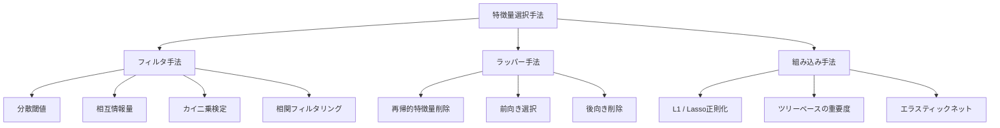
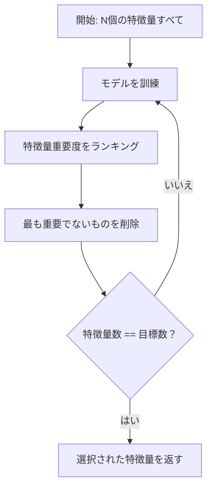
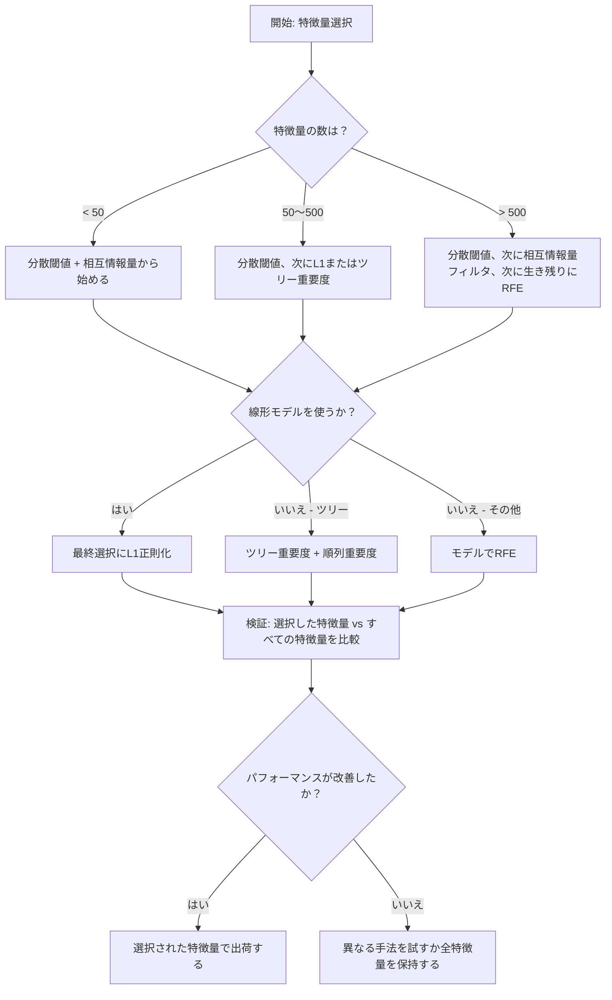

# 特徴量選択

> 特徴量が多いほど良いではない。正しい特徴量が良いのだ。


## 学習目標

- フィルタ手法（分散閾値、相互情報量、カイ二乗）とラッパー手法（RFE、前向き選択）をスクラッチから実装する
- 相互情報量が相関では見逃す非線形な特徴量-目標の関係を捉える理由を説明する
- L1正則化（組み込み選択）とRFE（ラッパー選択）を比較し、計算上のトレードオフを評価する
- 複数の手法を組み合わせた特徴量選択パイプラインを構築し、保留されたデータでの汎化改善を実証する

## 問題

500の特徴量がある。モデルの訓練が遅く、常に過学習し、学習したことを誰も説明できない。パフォーマンスを改善しようと特徴量を追加する。悪化する。

これが次元の呪いが機能している様子だ。特徴量の数が増えるにつれて、特徴量空間の容量が爆発する。データポイントが疎になる。ポイント間の距離が収束する。モデルは実際のパターンを見つけるために指数関数的に多くのデータが必要だ。ノイズ特徴量がシグナル特徴量を溺れさせる。過学習がデフォルトになる。

特徴量選択は解毒剤だ。ノイズを取り除く。冗長性を除去する。目標に関する実際の情報を持つ特徴量を保持する。結果：より速い訓練、より良い汎化、実際に説明できるモデル。

目標はすべての利用可能な情報を使うことではない。正しい情報を使うことだ。

## コンセプト

### 特徴量選択の3つのカテゴリ

すべての特徴量選択手法は3つのカテゴリのいずれかに入る：



**フィルタ手法** は統計的指標を使って各特徴量を独立してスコアリングする。モデルを使わない。速いが、特徴量の相互作用を見逃す。

**ラッパー手法** は特徴量サブセットを評価するためにモデルを訓練する。モデルのパフォーマンスをスコアとして使う。より良い結果だが、モデルを多くの回数再訓練するため高コスト。

**組み込み手法** はモデル訓練の一部として特徴量を選択する。L1正則化が重みをゼロにする。決定木が最も有用な特徴量で分割する。選択は別のステップとしてではなく、適合中に起きる。

### 分散閾値

最もシンプルなフィルタ。特徴量がサンプル間でほとんど変化しなければ、ほとんど情報を持たない。

999/1000サンプルで0.0の特徴量を考えよう。その分散はゼロに近い。どのモデルもクラスを区別するのにそれを使えない。削除する。

```
variance(x) = mean((x - mean(x))^2)
```

閾値を設定する（例：0.01）。閾値以下の分散を持つすべての特徴量を削除する。目標変数をまったく見ずに、定数またはほぼ定数の特徴量を除去する。

使用タイミング：他の手法の前処理ステップとして。ほぼゼロコストで明らかに役に立たない特徴量を捉える。

限界：特徴量は高い分散を持ちながらもピュアノイズでありうる。分散閾値は必要だが十分ではない。

### 相互情報量

相互情報量は特徴量Xの値を知ることが目標Yの不確かさをどれほど減らすかを測定する。

```
I(X; Y) = sum_x sum_y p(x, y) * log(p(x, y) / (p(x) * p(y)))
```

XとYが独立なら、p(x, y) = p(x) * p(y)なので対数項はゼロでI(X; Y) = 0。XがYについて多く教えるほど、相互情報量が高い。

相関に対する主な利点：相互情報量は非線形関係を捉える。特徴量は目標との相関がゼロでも、関係が二次的または周期的だと高い相互情報量を持つかもしれない。

連続特徴量については、まずビンに離散化する（ヒストグラムベースの推定）。ビンの数は推定に影響する -- ビンが少なすぎると情報が失われ、多すぎるとノイズが増える。一般的な選択：sqrt(n)ビンまたはスタージェスの規則（1 + log2(n)）。


### 再帰的特徴量削除（RFE）

RFEはラッパー手法だ。モデル自体の特徴量重要度を使って反復的に刈り込む：

1. すべての特徴量でモデルを訓練する
2. 重要度で特徴量をランキングする（線形モデルの係数、ツリーの不純度削減）
3. 最も重要でない特徴量を削除する
4. 目的の特徴量数に達するまで繰り返す



モデルが残っているすべての特徴量を一緒に見るため、RFEは特徴量の相互作用を考慮する。1つの特徴量を削除すると他の特徴量の重要度が変わる。これによりフィルタ手法より徹底的になる。

コスト：モデルをN - 目標回訓練する。500の特徴量と目標10で490回の訓練実行になる。高コストのモデルでは遅い。各ラウンドで複数の特徴量を削除することで高速化できる（例：各ラウンドで下位10%を削除）。

### L1（Lasso）正則化

L1正則化は損失関数に重みの絶対値を追加する：

```
loss = prediction_error + alpha * sum(|w_i|)
```

alphaパラメータは特徴量がどれほど積極的に刈り込まれるかを制御する。alphaが高いほど多くの重みが正確にゼロになる。

なぜ正確にゼロ？L1ペナルティは重み空間にダイヤモンド形の制約領域を作る。最適解はこのダイヤモンドの角に落ちる傾向があり、そこで1つ以上の重みがゼロだ。L2正則化（リッジ）は重みが縮小するが稀にゼロに達する円形制約を作る。

これが組み込み特徴量選択だ：モデルは訓練中にどの特徴量を無視するかを学習する。重みがゼロの特徴量は事実上削除される。

利点：単一の訓練実行、相関した特徴量を扱う（1つを選んで他をゼロにする）、ほとんどの線形モデル実装に組み込まれている。

限界：線形モデルにのみ機能する。非線形の特徴量重要度を捉えられない。

### ツリーベースの特徴量重要度

決定木とそのアンサンブル（ランダムフォレスト、勾配ブースティング）は自然に特徴量をランキングする。すべての分割が不純度を削減する（分類ではジニまたはエントロピー、回帰では分散）。より大きな不純度削減を生む特徴量がより重要だ。

T本の木を持つランダムフォレストで：

```
importance(feature_j) = (1/T) * sum over all trees of
    sum over all nodes splitting on feature_j of
        (n_samples * impurity_decrease)
```

これにより各特徴量の正規化された重要度スコアが得られる。非線形関係と特徴量の相互作用を自動的に扱う。

注意：ツリーベースの重要度は多くのユニークな値（高カーディナリティ）を持つ特徴量に偏る。ランダムIDカラムはすべてのサンプルを完璧に分割するため重要に見える。健全性チェックとして順列重要度を使う。

### 順列重要度

モデルに依存しない手法：

1. モデルを訓練し、検証データのベースラインパフォーマンスを記録する
2. 各特徴量について：その値をランダムにシャッフルし、パフォーマンスの低下を測定する
3. 低下が大きいほど、特徴量がより重要だ

特徴量をシャッフルしてもパフォーマンスが傷つかなければ、モデルはそれに依存していない。パフォーマンスが崩壊すれば、その特徴量は重要だ。

順列重要度はツリーベース重要度のカーディナリティバイアスを避ける。しかし遅い：特徴量ごとに1回のフル評価を複数回安定性のために繰り返す。

### 比較表

| 手法 | タイプ | 速度 | 非線形 | 特徴量の相互作用 |
|------|------|------|-------|----------------|
| 分散閾値 | フィルタ | 非常に速い | いいえ | いいえ |
| 相互情報量 | フィルタ | 速い | はい | いいえ |
| 相関フィルタ | フィルタ | 速い | いいえ | いいえ |
| RFE | ラッパー | 遅い | モデルに依存 | はい |
| L1 / Lasso | 組み込み | 速い | いいえ（線形） | いいえ |
| ツリー重要度 | 組み込み | 中程度 | はい | はい |
| 順列重要度 | モデル非依存 | 遅い | はい | はい |

### 決定フローチャート



## 実装する

### ステップ1：既知の特徴量構造を持つ合成データを生成する

```python
import numpy as np


def make_feature_selection_data(n_samples=500, seed=42):
    rng = np.random.RandomState(seed)

    x1 = rng.randn(n_samples)
    x2 = rng.randn(n_samples)
    x3 = rng.randn(n_samples)
    x4 = x1 + 0.1 * rng.randn(n_samples)
    x5 = x2 + 0.1 * rng.randn(n_samples)

    informative = np.column_stack([x1, x2, x3, x4, x5])

    correlated = np.column_stack([
        x1 * 0.9 + 0.1 * rng.randn(n_samples),
        x2 * 0.8 + 0.2 * rng.randn(n_samples),
        x3 * 0.7 + 0.3 * rng.randn(n_samples),
        x1 * 0.5 + x2 * 0.5 + 0.1 * rng.randn(n_samples),
        x2 * 0.6 + x3 * 0.4 + 0.1 * rng.randn(n_samples),
    ])

    noise = rng.randn(n_samples, 10) * 0.5

    X = np.hstack([informative, correlated, noise])
    y = (2 * x1 - 1.5 * x2 + x3 + 0.5 * rng.randn(n_samples) > 0).astype(int)

    feature_names = (
        [f"info_{i}" for i in range(5)]
        + [f"corr_{i}" for i in range(5)]
        + [f"noise_{i}" for i in range(10)]
    )

    return X, y, feature_names
```

グランドトゥルースがわかっている：特徴量0〜4が有益（さらに3と4は0と1の相関したコピー）、特徴量5〜9は有益な特徴量と相関している、特徴量10〜19は純粋なノイズだ。良い選択手法は0〜4を最高ランクにして10〜19を最低ランクにするべきだ。

### ステップ2：分散閾値

```python
def variance_threshold(X, threshold=0.01):
    variances = np.var(X, axis=0)
    mask = variances > threshold
    return mask, variances
```

### ステップ3：相互情報量（離散）

```python
def discretize(x, n_bins=10):
    min_val, max_val = x.min(), x.max()
    if max_val == min_val:
        return np.zeros_like(x, dtype=int)
    bin_edges = np.linspace(min_val, max_val, n_bins + 1)
    binned = np.digitize(x, bin_edges[1:-1])
    return binned


def mutual_information(X, y, n_bins=10):
    n_samples, n_features = X.shape
    mi_scores = np.zeros(n_features)

    y_vals, y_counts = np.unique(y, return_counts=True)
    p_y = y_counts / n_samples

    for f in range(n_features):
        x_binned = discretize(X[:, f], n_bins)
        x_vals, x_counts = np.unique(x_binned, return_counts=True)
        p_x = dict(zip(x_vals, x_counts / n_samples))

        mi = 0.0
        for xv in x_vals:
            for yi, yv in enumerate(y_vals):
                joint_mask = (x_binned == xv) & (y == yv)
                p_xy = np.sum(joint_mask) / n_samples
                if p_xy > 0:
                    mi += p_xy * np.log(p_xy / (p_x[xv] * p_y[yi]))
        mi_scores[f] = mi

    return mi_scores
```

### ステップ4：再帰的特徴量削除

```python
def simple_logistic_importance(X, y, lr=0.1, epochs=100):
    n_samples, n_features = X.shape
    w = np.zeros(n_features)
    b = 0.0

    for _ in range(epochs):
        z = X @ w + b
        pred = 1.0 / (1.0 + np.exp(-np.clip(z, -500, 500)))
        error = pred - y
        w -= lr * (X.T @ error) / n_samples
        b -= lr * np.mean(error)

    return w, b


def rfe(X, y, n_features_to_select=5, lr=0.1, epochs=100):
    n_total = X.shape[1]
    remaining = list(range(n_total))
    rankings = np.ones(n_total, dtype=int)
    rank = n_total

    while len(remaining) > n_features_to_select:
        X_subset = X[:, remaining]
        w, _ = simple_logistic_importance(X_subset, y, lr, epochs)
        importances = np.abs(w)

        least_idx = np.argmin(importances)
        original_idx = remaining[least_idx]
        rankings[original_idx] = rank
        rank -= 1
        remaining.pop(least_idx)

    for idx in remaining:
        rankings[idx] = 1

    selected_mask = rankings == 1
    return selected_mask, rankings
```

### ステップ5：L1特徴量選択

```python
def soft_threshold(w, alpha):
    return np.sign(w) * np.maximum(np.abs(w) - alpha, 0)


def l1_feature_selection(X, y, alpha=0.1, lr=0.01, epochs=500):
    n_samples, n_features = X.shape
    w = np.zeros(n_features)
    b = 0.0

    for _ in range(epochs):
        z = X @ w + b
        pred = 1.0 / (1.0 + np.exp(-np.clip(z, -500, 500)))
        error = pred - y

        gradient_w = (X.T @ error) / n_samples
        gradient_b = np.mean(error)

        w -= lr * gradient_w
        w = soft_threshold(w, lr * alpha)
        b -= lr * gradient_b

    selected_mask = np.abs(w) > 1e-6
    return selected_mask, w
```

### ステップ6：ツリーベースの重要度（シンプルな決定木）

```python
def gini_impurity(y):
    if len(y) == 0:
        return 0.0
    classes, counts = np.unique(y, return_counts=True)
    probs = counts / len(y)
    return 1.0 - np.sum(probs ** 2)


def best_split(X, y, feature_idx):
    values = np.unique(X[:, feature_idx])
    if len(values) <= 1:
        return None, -1.0

    best_threshold = None
    best_gain = -1.0
    parent_gini = gini_impurity(y)
    n = len(y)

    for i in range(len(values) - 1):
        threshold = (values[i] + values[i + 1]) / 2.0
        left_mask = X[:, feature_idx] <= threshold
        right_mask = ~left_mask

        n_left = np.sum(left_mask)
        n_right = np.sum(right_mask)

        if n_left == 0 or n_right == 0:
            continue

        gain = parent_gini - (n_left / n) * gini_impurity(y[left_mask]) - (n_right / n) * gini_impurity(y[right_mask])

        if gain > best_gain:
            best_gain = gain
            best_threshold = threshold

    return best_threshold, best_gain


def tree_importance(X, y, n_trees=50, max_depth=5, seed=42):
    rng = np.random.RandomState(seed)
    n_samples, n_features = X.shape
    importances = np.zeros(n_features)

    for _ in range(n_trees):
        sample_idx = rng.choice(n_samples, size=n_samples, replace=True)
        feature_subset = rng.choice(n_features, size=max(1, int(np.sqrt(n_features))), replace=False)

        X_boot = X[sample_idx]
        y_boot = y[sample_idx]

        tree_imp = _build_tree_importance(X_boot, y_boot, feature_subset, max_depth)
        importances += tree_imp

    total = importances.sum()
    if total > 0:
        importances /= total

    return importances


def _build_tree_importance(X, y, feature_subset, max_depth, depth=0):
    n_features = X.shape[1]
    importances = np.zeros(n_features)

    if depth >= max_depth or len(np.unique(y)) <= 1 or len(y) < 4:
        return importances

    best_feature = None
    best_threshold = None
    best_gain = -1.0

    for f in feature_subset:
        threshold, gain = best_split(X, y, f)
        if gain > best_gain:
            best_gain = gain
            best_feature = f
            best_threshold = threshold

    if best_feature is None or best_gain <= 0:
        return importances

    importances[best_feature] += best_gain * len(y)

    left_mask = X[:, best_feature] <= best_threshold
    right_mask = ~left_mask

    importances += _build_tree_importance(X[left_mask], y[left_mask], feature_subset, max_depth, depth + 1)
    importances += _build_tree_importance(X[right_mask], y[right_mask], feature_subset, max_depth, depth + 1)

    return importances
```

### ステップ7：すべての手法を実行して比較する

コードファイルは5つすべての手法を同じ合成データセットで実行し、各手法が選択する特徴量を示す比較表を印刷する。

## 使う

sklearnでは、特徴量選択はパイプラインに組み込まれている：

```python
from sklearn.feature_selection import (
    VarianceThreshold,
    mutual_info_classif,
    RFE,
    SelectFromModel,
)
from sklearn.linear_model import Lasso, LogisticRegression
from sklearn.ensemble import RandomForestClassifier

vt = VarianceThreshold(threshold=0.01)
X_filtered = vt.fit_transform(X)

mi_scores = mutual_info_classif(X, y)
top_k = np.argsort(mi_scores)[-10:]

rfe_selector = RFE(LogisticRegression(), n_features_to_select=10)
rfe_selector.fit(X, y)
X_rfe = rfe_selector.transform(X)

lasso_selector = SelectFromModel(Lasso(alpha=0.01))
lasso_selector.fit(X, y)
X_lasso = lasso_selector.transform(X)

rf = RandomForestClassifier(n_estimators=100)
rf.fit(X, y)
importances = rf.feature_importances_
```

スクラッチからの実装は各手法の内部で何が起きているかを正確に示す。分散閾値は単に `var(X, axis=0)` を計算してマスクを適用するだけだ。相互情報量は分割表の結合頻度と周辺頻度をカウントする。RFEは訓練、ランキング、刈り込みのループだ。L1は軟閾値ステップを持つ勾配降下法だ。ツリー重要度は分割にわたって不純度削減を蓄積する。魔法はない -- ただ統計とループだ。

sklearnバージョンは堅牢性（例：mutual_info_classifはビニングの代わりにk-NN密度推定を使う）、速度（C実装）、パイプライン統合を追加する。

## 出荷する

このレッスンの成果物：
- `outputs/skill-feature-selector.md` -- 適切な特徴量選択手法を選ぶためのクイックリファレンス決定木

## 演習

1. **前向き選択**：RFEの逆を実装する。ゼロの特徴量から始める。各ステップで、モデルのパフォーマンスを最も改善する特徴量を追加する。特徴量を追加してもパフォーマンスが改善しなくなったら止める。選択された特徴量をRFE結果と比較する。どちらが速いか？どちらが良い結果を与えるか？

2. **安定性選択**：L1特徴量選択を50回実行し、毎回データのランダムな80%サブサンプルで、わずかに異なるalpha値で。各特徴量が選択される頻度をカウントする。実行の80%以上で選択された特徴量は「安定」だ。安定した特徴量を単一実行のL1選択と比較する。どちらがより信頼できるか？

3. **多重共線性の検出**：すべての特徴量の相関行列を計算する。相関閾値（例：0.9）を指定して、各高相関ペアから1つの特徴量を削除する関数を実装する（目標とのより高い相互情報量を持つものを保持）。合成データセットでテストし、冗長な相関特徴量を削除することを確認する。

4. **特徴量選択パイプライン**：分散閾値、相互情報量フィルタ、RFEを単一パイプラインに連鎖させる。まずほぼゼロ分散の特徴量を削除し、次に相互情報量で上位50%を保持し、次に生き残りにRFEを実行する。このパイプラインをすべての特徴量でRFEを単独で実行するのと比較する。パイプラインは速いか？同様に正確か？

5. **スクラッチからの順列重要度**：順列重要度を実装する。各特徴量について、その値を10回シャッフルして平均F1スコアの低下を測定する。ランキングをツリーベース重要度と比較する。不一致する場合を見つけて説明する（ヒント：相関した特徴量）。

## 主要用語

| 用語 | 人々がよく言うこと | 実際の意味 |
|------|----------------|-----------|
| フィルタ手法 | 「特徴量を独立してスコアリング」 | モデルを訓練せず統計的指標を使って特徴量をランキングする特徴量選択アプローチ、各特徴量を個別に評価する |
| ラッパー手法 | 「特徴量を選ぶためにモデルを使う」 | モデルを訓練して特徴量サブセットを評価し、そのパフォーマンスを選択基準として使う特徴量選択アプローチ |
| 組み込み手法 | 「モデルは訓練中に特徴量を選択する」 | L1正則化が重みをゼロにするなど、モデルの適合の一部として起きる特徴量選択 |
| 相互情報量 | 「1つの変数が別の変数についてどれほど教えるか」 | Xの知識によるYの不確かさの削減の測定、線形および非線形依存関係を捉える |
| 再帰的特徴量削除 | 「訓練、ランキング、刈り込み、繰り返す」 | モデルを訓練し、最も重要でない特徴量を削除し、目標数に達するまで繰り返す反復的ラッパー手法 |
| L1 / Lasso正則化 | 「特徴量を消すペナルティ」 | 重みの絶対値の和を損失関数に追加し、重要でない特徴量の重みを正確にゼロにする |
| 分散閾値 | 「定数特徴量を削除する」 | サンプルにわたる分散が指定された閾値以下の特徴量を削除し、情報を持たない特徴量をフィルタリングする |
| 特徴量重要度 | 「どの特徴量が最も重要か」 | 各特徴量がモデル予測にどれほど寄与するかを示すスコア、分割ゲイン（ツリー）または係数の大きさ（線形）から計算 |
| 順列重要度 | 「シャッフルしてダメージを測定する」 | 各特徴量の値をランダムにシャッフルして結果のモデルパフォーマンスの低下を測定することで特徴量重要度を評価する |
| 次元の呪い | 「特徴量が多すぎてデータが少なすぎる」 | 特徴量を追加すると特徴量空間の容量が指数関数的に増加し、データが疎になって距離が無意味になる現象 |

## さらに読む

- [An Introduction to Variable and Feature Selection (Guyon & Elisseeff, 2003)](https://jmlr.org/papers/v3/guyon03a.html) -- 特徴量選択手法の基礎的なサーベイ、今も広く参照されている
- [scikit-learn 特徴量選択ガイド](https://scikit-learn.org/stable/modules/feature_selection.html) -- コード例付きのフィルタ、ラッパー、組み込み手法の実践的リファレンス
- [Stability Selection (Meinshausen & Buhlmann, 2010)](https://arxiv.org/abs/0809.2932) -- サブサンプリングと特徴量選択を組み合わせて堅牢で再現可能な結果を得る
- [Beware Default Random Forest Importances (Strobl et al., 2007)](https://bmcbioinformatics.biomedcentral.com/articles/10.1186/1471-2105-8-25) -- ツリーベース重要度のカーディナリティバイアスを実証し、条件付き重要度を代替として提案
