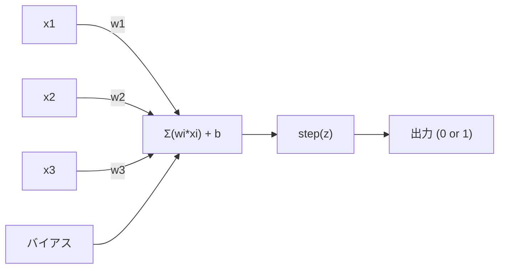
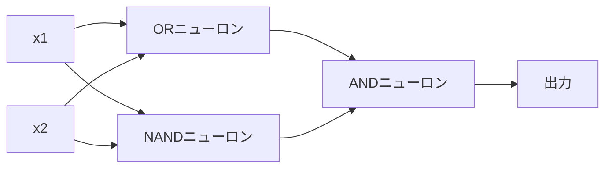

# パーセプトロン

> パーセプトロンはニューラルネットワークの原子だ。分解すると、重み、バイアス、そして決定がある。


## 学習目標

- Pythonでパーセプトロンをゼロから実装する。重み更新則とステップ活性化関数を含む
- 単一パーセプトロンが線形分離可能な問題しか解けない理由を説明し、XOR失敗ケースを実証する
- OR、NAND、ANDゲートを組み合わせた多層パーセプトロンを構築し、XORを解く
- シグモイド活性化と誤差逆伝播を使った2層ネットワークを訓練し、XORを自動学習させる

## 問題設定

ベクトルと内積について知っている。行列が入力を出力に変換することも知っている。しかし、機械はどうやって*どの*変換を使うべきかを*学ぶ*のか？

パーセプトロンがこれに答える。最もシンプルな学習機械だ。入力を取り、重みをかけ、バイアスを加え、二値決定を行う。そして調整する。それだけだ。これまでに構築されたすべてのニューラルネットワークは、このアイデアを層として重ねたものだ。

パーセプトロンを理解するということは、コードにおける「学習」が実際に何を意味するかを理解することだ。つまり、出力が現実と一致するまで数値を調整すること。

## 概念

### 1つのニューロン、1つの決定

パーセプトロンはn個の入力を取り、それぞれに重みをかけ、合計し、バイアスを加え、その結果を活性化関数に通す。



ステップ関数は容赦ない。重み付き和にバイアスを加えた値が0以上なら1を出力し、0未満なら0を出力する。

```
step(z) = 1  z >= 0 の場合
           0  z < 0 の場合
```

これは線形分類器だ。重みとバイアスが、入力空間を2つの領域に分割する直線（高次元では超平面）を定義する。

### 決定境界

2入力の場合、パーセプトロンは2次元空間に直線を引く。

```
  x2
  ┤
  │  クラス1        /
  │    (0)          /
  │                /
  │               / w1·x1 + w2·x2 + b = 0
  │              /
  │             /     クラス2
  │            /        (1)
  ┼───────────/──────────── x1
```

直線の片側はすべて0を出力し、もう片側はすべて1を出力する。訓練により、クラスを正しく分離するまでこの直線が移動する。

### 学習則

パーセプトロン学習則はシンプルだ。

```
各訓練サンプル (x, y_true) に対して:
    y_pred = predict(x)
    error = y_true - y_pred

    各重みに対して:
        w_i = w_i + learning_rate * error * x_i
    bias = bias + learning_rate * error
```

予測が正しければ error = 0 で何も変わらない。0と予測したが1であるべきなら、重みは増加する。1と予測したが0であるべきなら、重みは減少する。学習率は各調整の大きさを制御する。

### XOR問題

ここで破綻する。次の論理ゲートを見てみよう。

```
ANDゲート:          ORゲート:           XORゲート:
x1  x2  出力        x1  x2  出力        x1  x2  出力
0   0   0           0   0   0           0   0   0
0   1   0           0   1   1           0   1   1
1   0   0           1   0   1           1   0   1
1   1   1           1   1   1           1   1   0
```

ANDとORは線形分離可能だ。0と1を分離する直線を1本引ける。XORはそうではない。[0,1]と[1,0]を[0,0]と[1,1]から分離する直線は存在しない。

```
AND (分離可能):          XOR (分離不可能):

  x2                      x2
  1 ┤  0     1            1 ┤  1     0
    │     /                 │
  0 ┤  0 / 0              0 ┤  0     1
    ┼──/──────── x1         ┼──────────── x1
       直線で分離可能!       直線1本では分離不可能!
```

これは根本的な限界だ。単一パーセプトロンは線形分離可能な問題しか解けない。MinskiとPapertは1969年にこれを証明し、ニューラルネットワーク研究を10年近く停滞させた。

解決策は、パーセプトロンを層として重ねること。多層パーセプトロンは、2つの線形決定を非線形な決定に組み合わせることでXORを解ける。

## 実装

### ステップ1: Perceptronクラス

```python
class Perceptron:
    def __init__(self, n_inputs, learning_rate=0.1):
        self.weights = [0.0] * n_inputs
        self.bias = 0.0
        self.lr = learning_rate

    def predict(self, inputs):
        total = sum(w * x for w, x in zip(self.weights, inputs))
        total += self.bias
        return 1 if total >= 0 else 0

    def train(self, training_data, epochs=100):
        for epoch in range(epochs):
            errors = 0
            for inputs, target in training_data:
                prediction = self.predict(inputs)
                error = target - prediction
                if error != 0:
                    errors += 1
                    for i in range(len(self.weights)):
                        self.weights[i] += self.lr * error * inputs[i]
                    self.bias += self.lr * error
            if errors == 0:
                print(f"エポック {epoch + 1} で収束しました")
                return
        print(f"{epochs} エポック後も収束しませんでした")
```

### ステップ2: 論理ゲートで訓練する

```python
and_data = [
    ([0, 0], 0),
    ([0, 1], 0),
    ([1, 0], 0),
    ([1, 1], 1),
]

or_data = [
    ([0, 0], 0),
    ([0, 1], 1),
    ([1, 0], 1),
    ([1, 1], 1),
]

not_data = [
    ([0], 1),
    ([1], 0),
]

print("=== AND Gate ===")
p_and = Perceptron(2)
p_and.train(and_data)
for inputs, _ in and_data:
    print(f"  {inputs} -> {p_and.predict(inputs)}")

print("\n=== OR Gate ===")
p_or = Perceptron(2)
p_or.train(or_data)
for inputs, _ in or_data:
    print(f"  {inputs} -> {p_or.predict(inputs)}")

print("\n=== NOT Gate ===")
p_not = Perceptron(1)
p_not.train(not_data)
for inputs, _ in not_data:
    print(f"  {inputs} -> {p_not.predict(inputs)}")
```

### ステップ3: XORの失敗を観察する

```python
xor_data = [
    ([0, 0], 0),
    ([0, 1], 1),
    ([1, 0], 1),
    ([1, 1], 0),
]

print("\n=== XOR Gate (単一パーセプトロン) ===")
p_xor = Perceptron(2)
p_xor.train(xor_data, epochs=1000)
for inputs, expected in xor_data:
    result = p_xor.predict(inputs)
    status = "OK" if result == expected else "WRONG"
    print(f"  {inputs} -> {result} (期待値 {expected}) {status}")
```

絶対に収束しない。これが単一パーセプトロンではXORを学習できないことの確固たる証明だ。

### ステップ4: 2層でXORを解く

コツは、XOR = (x1 OR x2) AND NOT (x1 AND x2) という点だ。3つのパーセプトロンを組み合わせる。



```python
def xor_network(x1, x2):
    or_neuron = Perceptron(2)
    or_neuron.weights = [1.0, 1.0]
    or_neuron.bias = -0.5

    nand_neuron = Perceptron(2)
    nand_neuron.weights = [-1.0, -1.0]
    nand_neuron.bias = 1.5

    and_neuron = Perceptron(2)
    and_neuron.weights = [1.0, 1.0]
    and_neuron.bias = -1.5

    hidden1 = or_neuron.predict([x1, x2])
    hidden2 = nand_neuron.predict([x1, x2])
    output = and_neuron.predict([hidden1, hidden2])
    return output


print("\n=== XOR Gate (多層ネットワーク) ===")
for inputs, expected in xor_data:
    result = xor_network(inputs[0], inputs[1])
    print(f"  {inputs} -> {result} (期待値 {expected})")
```

4ケースすべて正解。パーセプトロンを層として重ねることで、単一パーセプトロンでは作れない決定境界が生まれる。

### ステップ5: 2層ネットワークを訓練する

ステップ4では重みを手動で設定した。これはXORには使えるが、事前に正しい重みがわからない実際の問題では使えない。解決策は、ステップ関数をシグモイドに置き換え、誤差逆伝播によって重みを自動的に学習すること。

```python
class TwoLayerNetwork:
    def __init__(self, learning_rate=0.5):
        import random
        random.seed(0)
        self.w_hidden = [[random.uniform(-1, 1), random.uniform(-1, 1)] for _ in range(2)]
        self.b_hidden = [random.uniform(-1, 1), random.uniform(-1, 1)]
        self.w_output = [random.uniform(-1, 1), random.uniform(-1, 1)]
        self.b_output = random.uniform(-1, 1)
        self.lr = learning_rate

    def sigmoid(self, x):
        import math
        x = max(-500, min(500, x))
        return 1.0 / (1.0 + math.exp(-x))

    def forward(self, inputs):
        self.inputs = inputs
        self.hidden_outputs = []
        for i in range(2):
            z = sum(w * x for w, x in zip(self.w_hidden[i], inputs)) + self.b_hidden[i]
            self.hidden_outputs.append(self.sigmoid(z))
        z_out = sum(w * h for w, h in zip(self.w_output, self.hidden_outputs)) + self.b_output
        self.output = self.sigmoid(z_out)
        return self.output

    def train(self, training_data, epochs=10000):
        for epoch in range(epochs):
            total_error = 0
            for inputs, target in training_data:
                output = self.forward(inputs)
                error = target - output
                total_error += error ** 2

                d_output = error * output * (1 - output)

                saved_w_output = self.w_output[:]
                hidden_deltas = []
                for i in range(2):
                    h = self.hidden_outputs[i]
                    hd = d_output * saved_w_output[i] * h * (1 - h)
                    hidden_deltas.append(hd)

                for i in range(2):
                    self.w_output[i] += self.lr * d_output * self.hidden_outputs[i]
                self.b_output += self.lr * d_output

                for i in range(2):
                    for j in range(len(inputs)):
                        self.w_hidden[i][j] += self.lr * hidden_deltas[i] * inputs[j]
                    self.b_hidden[i] += self.lr * hidden_deltas[i]
```

```python
net = TwoLayerNetwork(learning_rate=2.0)
net.train(xor_data, epochs=10000)
for inputs, expected in xor_data:
    result = net.forward(inputs)
    predicted = 1 if result >= 0.5 else 0
    print(f"  {inputs} -> {result:.4f} (四捨五入: {predicted}, 期待値 {expected})")
```

ステップ4との2つの主な違い。第一に、シグモイドがステップ関数に置き換わる。滑らかなので勾配が存在する。第二に、`train`メソッドが誤差を出力層から隠れ層へ逆伝播させ、各重みの誤差への寄与度に比例して調整する。これが20行での誤差逆伝播だ。

これがレッスン03への橋渡しだ。`d_output`と`hidden_deltas`の背後にある数学は、ネットワークグラフに適用された連鎖律だ。そちらで適切に導出する。

## 実用例

スクラッチで構築したすべてのものが1つのインポートで手に入る。

```python
from sklearn.linear_model import Perceptron as SkPerceptron
import numpy as np

X = np.array([[0,0],[0,1],[1,0],[1,1]])
y = np.array([0, 0, 0, 1])

clf = SkPerceptron(max_iter=100, tol=1e-3)
clf.fit(X, y)
print([clf.predict([x])[0] for x in X])
```

5行だ。自作の30行`Perceptron`クラスと同じことをする。sklearn版は収束チェック、複数の損失関数、疎な入力サポートを追加しているが、コアのループは同一だ。重み付き和、ステップ関数、エラー時の重み更新。

実際の差はスケールに現れる。本番ネットワークで変わること。

- ステップ関数がシグモイド、ReLU、その他の滑らかな活性化関数になる
- 重みは誤差逆伝播によって自動的に学習される（レッスン03）
- 層が深くなる。3、10、100層以上
- 同じ原則が成り立つ。各層が前の層の出力から新しい特徴を作る

単一パーセプトロンは直線しか引けない。重ねれば、任意の形を描ける。

## 成果物

このレッスンの成果物:
- `outputs/skill-perceptron.md` - 単層 vs 多層アーキテクチャがいつ必要かをカバーするスキルドキュメント

## 演習

1. NANDゲート（万能ゲート - あらゆる論理回路をNANDから構築できる）でパーセプトロンを訓練する。その重みとバイアスが有効な決定境界を形成していることを検証する。
2. Perceptronクラスを修正して、各エポックでの決定境界（w1*x1 + w2*x2 + b = 0）を追跡する。ANDゲートの訓練中に直線がどう移動するかを出力する。
3. 3つの入力のうち少なくとも2つが1のときだけ1を出力する3入力パーセプトロンを構築する（多数決関数）。これは線形分離可能か？なぜか？

## 重要用語

| 用語 | よく言われること | 実際の意味 |
|------|----------------|----------------------|
| パーセプトロン | 「偽物のニューロン」 | 線形分類器: 入力と重みの内積にバイアスを加え、ステップ関数に通す |
| 重み（Weight） | 「入力の重要度」 | 各入力の決定への寄与をスケールする乗数 |
| バイアス（Bias） | 「閾値」 | 決定境界をシフトする定数。入力がゼロでもパーセプトロンが発火できるようにする |
| 活性化関数 | 「値を押しつぶすもの」 | 重み付き和の後に適用される関数 - パーセプトロンはステップ関数、現代のネットワークはシグモイド/ReLU |
| 線形分離可能 | 「それらの間に線を引ける」 | 単一の超平面でクラスを完全に分離できるデータセット |
| XOR問題 | 「パーセプトロンにできないこと」 | 単層ネットワークは線形分離不可能な関数を学習できないという証明 |
| 決定境界 | 「分類器が切り替わるところ」 | 入力空間を2クラスに分ける超平面 w*x + b = 0 |
| 多層パーセプトロン | 「本物のニューラルネットワーク」 | 層として重ねられたパーセプトロン。各層の出力が次の層の入力になる |

## 参考文献

- Frank Rosenblatt, "The Perceptron: A Probabilistic Model for Information Storage and Organization in the Brain" (1958) -- すべての始まりとなった原論文
- Minsky & Papert, "Perceptrons" (1969) -- 単層ネットワークではXORが解けないことを証明し、パーセプトロン研究を10年停滞させた書籍
- Michael Nielsen, "Neural Networks and Deep Learning", Chapter 1 (http://neuralnetworksanddeeplearning.com/) -- 無料オンライン、パーセプトロンがネットワークに組み合わさる様子の最高のビジュアル解説
