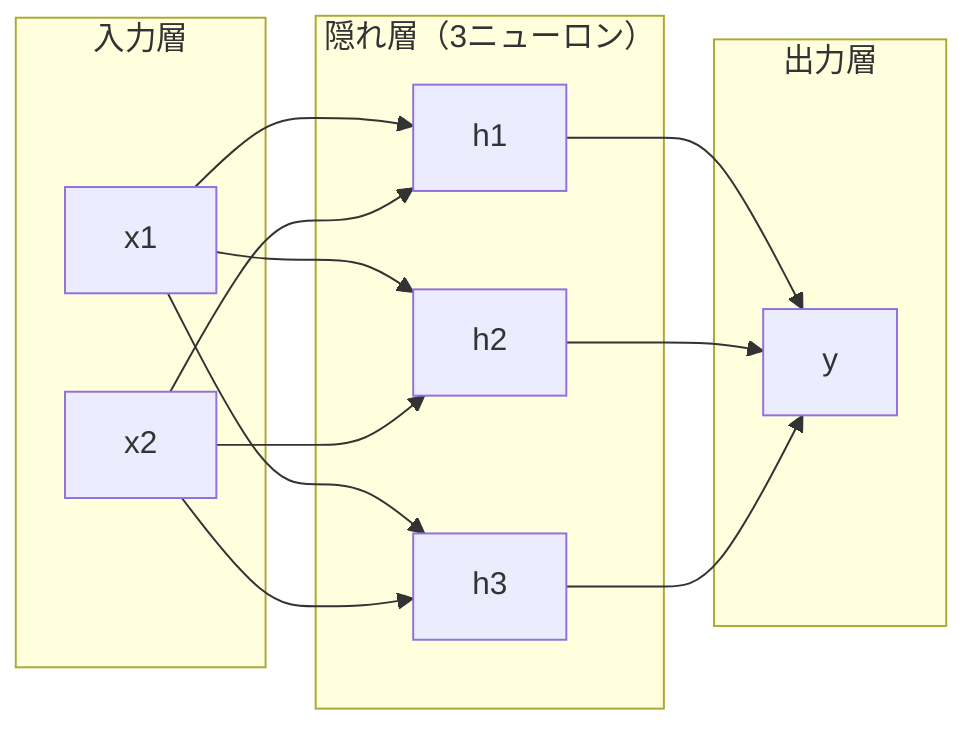
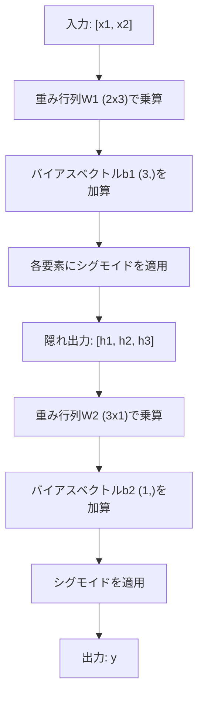

# 多層ネットワークと順伝播

> 1つのニューロンは直線を引く。重ねれば、何でも描ける。


## 学習目標

- 完全な順伝播を実行するLayerクラスとNetworkクラスを使って、多層ネットワークをゼロから構築する
- ネットワークの各層を通じて行列の次元を追跡し、形状の不一致を特定する
- 非線形活性化を重ねることで、曲線的な決定境界をネットワークが学習できるようになる仕組みを説明する
- 手動調整したシグモイド重みを使った2-2-1アーキテクチャでXOR問題を解く

## 問題設定

単一ニューロンは直線を引くだけだ。1本の直線。それだけだ。画像認識、言語理解、囲碁プレイなど、AIのあらゆる実際の問題は曲線を必要とする。ニューロンを層として重ねることで曲線が得られる。

1969年、MinskiとPapertはこの限界が致命的であることを証明した。単層ネットワークはXORを学習できない。「学習に苦労する」ではなく、数学的に不可能なのだ。XORの真理値表は[0,1]と[1,0]を一方に、[0,0]と[1,1]をもう一方に配置する。どんな直線もそれらを分離できない。

これにより、ニューラルネットワークへの資金援助が10年以上途絶えた。後から振り返れば解決策は明白だった。1つの層の使用をやめること。ニューロンを層として重ねること。最初の層が入力空間を新しい特徴として切り分け、2番目の層がそれらの特徴を、1本の直線では作れない決定に組み合わせる。

その積み重ねが多層ネットワークだ。現在本番稼働しているあらゆる深層学習モデルの基盤だ。順伝播（データが入力から隠れ層を通って出力まで流れること）は、他の何かが機能する前に最初に構築する必要があるものだ。

## 概念

### 層: 入力、隠れ、出力

多層ネットワークには3種類の層がある。

**入力層** -- 実際にはあまり「層」ではない。生データを保持する。2つの特徴は2つの入力ノードを意味する。ここでは計算は行われない。

**隠れ層** -- 処理が行われる場所。各ニューロンは前の層のすべての出力を受け取り、重みとバイアスを適用し、結果を活性化関数に通す。訓練データには直接現れない値なので「隠れ」と呼ばれる。

**出力層** -- 最終的な答え。二値分類ならシグモイドを持つ1つのニューロン。多クラスなら各クラスに1つのニューロン。



これは2-3-1ネットワークだ。2つの入力、3つの隠れニューロン、1つの出力。すべての接続が重みを持つ。すべてのニューロン（入力を除く）がバイアスを持つ。

各層は隠れ状態と呼ばれる数値のベクトルを生成する。テキストの場合、隠れ状態は次元を増加させる。単語を768個の数値としてエンコードして意味論的な意味を捉える。画像の場合は次元を削減する。何百万ものピクセルを扱いやすい表現に圧縮する。隠れ状態に学習が宿る。

### ニューロンと活性化

各ニューロンは3つのことを行う。

1. 各入力に対応する重みをかける
2. すべての積を合計し、バイアスを加える
3. 合計を活性化関数に通す

今のところ、活性化はシグモイドだ。

```
sigmoid(z) = 1 / (1 + e^(-z))
```

シグモイドはどんな数値も(0, 1)の範囲に押しつぶす。大きな正の入力は1に近づく。大きな負の入力は0に近づく。ゼロは0.5に対応する。この滑らかな曲線が学習を可能にする。パーセプトロンのハードなステップと違い、シグモイドはどこでも勾配を持つ。

### 順伝播: データの流れ方

順伝播は入力データをネットワークに通し、層ごとに出力まで押し進める。順伝播中に学習は行われない。純粋な計算だ。乗算、加算、活性化、繰り返し。



各層で3つの操作が順に行われる。

```
z = W * input + b       （線形変換）
a = sigmoid(z)           （活性化）
```

ある層の出力が次の層の入力になる。それが順伝播のすべてだ。

### 行列の次元

次元の追跡は深層学習における最も重要なデバッグスキルだ。2-3-1ネットワークを見てみよう。

| ステップ | 操作 | 次元 | 結果の形状 |
|------|-----------|------------|-------------|
| 入力 | x | -- | (2,) |
| 隠れ線形 | W1 * x + b1 | W1: (3, 2), b1: (3,) | (3,) |
| 隠れ活性化 | sigmoid(z1) | -- | (3,) |
| 出力線形 | W2 * h + b2 | W2: (1, 3), b2: (1,) | (1,) |
| 出力活性化 | sigmoid(z2) | -- | (1,) |

ルール: 層kの重み行列Wは形状(層k内のニューロン数, 層k-1内のニューロン数)を持つ。行が現在の層に対応し、列が前の層に対応する。形状が合わなければバグがある。

### 普遍近似定理

1989年、George Cybenkoは驚くべきことを証明した。単一の隠れ層と十分なニューロンを持つニューラルネットワークは、任意の連続関数を任意の精度で近似できる。

これは単一の隠れ層が常に最良であることを意味しない。アーキテクチャが理論的に可能であることを意味する。実際には、深いネットワーク（より多くの層、より少ないニューロン/層）は浅くて広いネットワークよりもはるかに少ない総パラメータ数で同じ関数を学習する。それが深層学習が機能する理由だ。

直感的には、隠れ層の各ニューロンが1つの「バンプ」または特徴を学習する。適切な場所に十分なバンプを配置すれば、任意の滑らかな曲線を近似できる。ニューロンが多いほど、バンプが多く、近似精度が高い。


### 合成可能性

ニューラルネットワークは合成可能だ。重ねたり、連鎖させたり、並列実行したりできる。Whisperモデルはエンコーダネットワークで音声を処理し、別のデコーダネットワークでテキストを生成する。現代のLLMはデコーダのみ。BERTはエンコーダのみ。T5はエンコーダ-デコーダだ。アーキテクチャの選択がモデルにできることを決める。

## 実装

純粋なPythonで実装する。numpyなし。すべての行列演算をゼロから記述する。

### ステップ1: シグモイド活性化

```python
import math

def sigmoid(x):
    x = max(-500.0, min(500.0, x))
    return 1.0 / (1.0 + math.exp(-x))
```

[-500, 500]へのクランプはオーバーフローを防ぐ。`math.exp(500)`は大きいが有限だ。`math.exp(1000)`は無限大になる。

### ステップ2: Layerクラス

深層学習のすべての操作の中で最も重要な演算は行列乗算だ。すべての層、すべてのアテンションヘッド、すべての順伝播、突き詰めれば行列乗算ばかりだ。線形層は入力ベクトルを取り、重み行列をかけ、バイアスベクトルを加える。y = Wx + b。その単一の式がニューラルネットワークの計算の90%だ。

Layerクラスは重み行列とバイアスベクトルを保持する。forwardメソッドは入力ベクトルを取り、活性化された出力を返す。

```python
class Layer:
    def __init__(self, n_inputs, n_neurons, weights=None, biases=None):
        if weights is not None:
            self.weights = weights
        else:
            import random
            self.weights = [
                [random.uniform(-1, 1) for _ in range(n_inputs)]
                for _ in range(n_neurons)
            ]
        if biases is not None:
            self.biases = biases
        else:
            self.biases = [0.0] * n_neurons

    def forward(self, inputs):
        self.last_input = inputs
        self.last_output = []
        for neuron_idx in range(len(self.weights)):
            z = sum(
                w * x for w, x in zip(self.weights[neuron_idx], inputs)
            )
            z += self.biases[neuron_idx]
            self.last_output.append(sigmoid(z))
        return self.last_output
```

重み行列は形状(n_neurons, n_inputs)を持つ。各行が全入力にわたる1つのニューロンの重みだ。forwardメソッドはニューロンをループし、重み付き和にバイアスを加えて計算し、シグモイドを適用し、結果を収集する。

### ステップ3: Networkクラス

ネットワークは層のリストだ。順伝播がそれらを連鎖させる。層kの出力が層k+1への入力になる。

```python
class Network:
    def __init__(self, layers):
        self.layers = layers

    def forward(self, inputs):
        current = inputs
        for layer in self.layers:
            current = layer.forward(current)
        return current
```

これが順伝播のすべてだ。4行のロジック。データが入り、すべての層を流れ、反対側から出てくる。

### ステップ4: 手動調整した重みでXORを解く

レッスン01では、OR、NAND、ANDパーセプトロンを組み合わせてXORを解いた。今度はLayerクラスとNetworkクラスで同じことをする。2-2-1アーキテクチャ: 2入力、2隠れニューロン、1出力。

```python
hidden = Layer(
    n_inputs=2,
    n_neurons=2,
    weights=[[20.0, 20.0], [-20.0, -20.0]],
    biases=[-10.0, 30.0],
)

output = Layer(
    n_inputs=2,
    n_neurons=1,
    weights=[[20.0, 20.0]],
    biases=[-30.0],
)

xor_net = Network([hidden, output])

xor_data = [
    ([0, 0], 0),
    ([0, 1], 1),
    ([1, 0], 1),
    ([1, 1], 0),
]

for inputs, expected in xor_data:
    result = xor_net.forward(inputs)
    predicted = 1 if result[0] >= 0.5 else 0
    print(f"  {inputs} -> {result[0]:.6f} (四捨五入: {predicted}, 期待値: {expected})")
```

大きな重み（20, -20）がシグモイドをステップ関数のように機能させる。最初の隠れニューロンはORを近似する。2番目はNANDを近似する。出力ニューロンがそれらをANDに組み合わせ、XORが完成する。

### ステップ5: 円の分類

より難しい問題: 2次元の点を、原点を中心とした半径0.5の円の内側か外側かで分類する。これは曲線的な決定境界を必要とする。単一のパーセプトロンでは不可能だ。

```python
import random
import math

random.seed(42)

data = []
for _ in range(200):
    x = random.uniform(-1, 1)
    y = random.uniform(-1, 1)
    label = 1 if (x * x + y * y) < 0.25 else 0
    data.append(([x, y], label))

circle_net = Network([
    Layer(n_inputs=2, n_neurons=8),
    Layer(n_inputs=8, n_neurons=1),
])
```

ランダムな重みでは、ネットワークはうまく分類しない。しかし順伝播は実行される。これがポイントだ。順伝播はただの計算だ。正しい重みを学習することが誤差逆伝播であり、レッスン03で扱う。

```python
correct = 0
for inputs, expected in data:
    result = circle_net.forward(inputs)
    predicted = 1 if result[0] >= 0.5 else 0
    if predicted == expected:
        correct += 1

print(f"ランダムな重みでの精度: {correct}/{len(data)} ({100*correct/len(data):.1f}%)")
```

ランダムな重みでは精度が低い。多数派クラスを推測するよりも悪い場合も多い。訓練後（レッスン03）、8つの隠れニューロンを持つ同じアーキテクチャが、内側と外側を分離する曲線的な境界を描く。

## 実用例

PyTorchなら4行で上記すべてができる。

```python
import torch
import torch.nn as nn

model = nn.Sequential(
    nn.Linear(2, 8),
    nn.Sigmoid(),
    nn.Linear(8, 1),
    nn.Sigmoid(),
)

x = torch.tensor([[0.0, 0.0], [0.0, 1.0], [1.0, 0.0], [1.0, 1.0]])
output = model(x)
print(output)
```

`nn.Linear(2, 8)`は自作のLayerクラスだ。形状(8, 2)の重み行列と形状(8,)のバイアスベクトルを持つ。`nn.Sigmoid()`は要素ごとに適用されるシグモイド関数だ。`nn.Sequential`は自作のNetworkクラスだ。層を順に連鎖させる。

違いはスピードとスケールだ。PyTorchはGPU上で動き、何百万ものサンプルのバッチを処理し、誤差逆伝播のために自動的に勾配を計算する。しかし順伝播のロジックは、スクラッチで構築したものと同一だ。

## 成果物

このレッスンでは、ネットワークアーキテクチャ設計のための再利用可能なプロンプトを作成する。

- `outputs/prompt-network-architect.md`

特定の問題に対して、何層必要か、各層に何ニューロン必要か、どの活性化関数を使うかを決定する際に使用する。

## 演習

1. 2-4-2-1ネットワーク（2つの隠れ層）を構築し、ランダムな重みでXORデータの順伝播を実行する。中間の隠れ層の出力を出力して、各層で表現がどう変換されるかを確認する。

2. 円の分類器の隠れ層サイズを8から2に変更し、次に32に変更する。毎回ランダムな重みで順伝播を実行する。隠れニューロンの数は出力の範囲や分布を変えるか？なぜか？

3. Networkクラスに`count_parameters`メソッドを実装し、訓練可能な重みとバイアスの総数を返すようにする。784-256-128-10ネットワーク（古典的なMNISTアーキテクチャ）でテストする。パラメータはいくつあるか？

4. 3-4-4-2ネットワークの順伝播を構築する。RGB色値（0〜1に正規化）を入力し、2つの出力を観察する。これは2クラスのシンプルな色分類器のアーキテクチャだ。

5. シグモイドを「リーキーステップ」関数に置き換える。z < 0なら0.01 * zを返し、それ以外は1.0を返す。ステップ4と同じ手動調整した重みでXORの順伝播を実行する。まだ機能するか？なぜ滑らかなシグモイドがハードなカットオフより好まれるのか？

## 重要用語

| 用語 | よく言われること | 実際の意味 |
|------|----------------|----------------------|
| 順伝播 | 「モデルを実行する」 | 入力をすべての層に通す。重みをかけ、バイアスを加え、活性化し、出力を生成する |
| 隠れ層 | 「真ん中の部分」 | 入力と出力の間にある、値が訓練データに直接現れない層 |
| 多層ネットワーク | 「深層ニューラルネットワーク」 | 順に積み重ねられた層。各層の出力が次の層の入力になる |
| 活性化関数 | 「非線形性」 | 線形変換の後に適用され、決定境界に曲線を導入する関数 |
| シグモイド | 「S字曲線」 | sigma(z) = 1/(1+e^(-z))、任意の実数を(0,1)に押しつぶし、どこでも滑らかで微分可能 |
| 重み行列 | 「パラメータ」 | 形状(現在層ニューロン数, 前層ニューロン数)の行列W、学習可能な接続強度を含む |
| バイアスベクトル | 「オフセット」 | 行列乗算の後に加えられるベクトル。すべての入力がゼロでもニューロンが活性化できるようにする |
| 普遍近似 | 「ニューラルネットは何でも学習できる」 | 十分なニューロンを持つ単一隠れ層が任意の連続関数を近似できる。ただし「十分」とは数十億を意味することもある |
| 線形変換 | 「行列乗算ステップ」 | z = W * x + b、活性化前の計算で、入力を新しい空間に写像する |
| 決定境界 | 「分類器が切り替わるところ」 | ネットワーク出力が分類閾値を越える入力空間の面 |

## 参考文献

- Michael Nielsen, "Neural Networks and Deep Learning", Chapter 1-2 (http://neuralnetworksanddeeplearning.com/) -- 順伝播とネットワーク構造について最も明確な無料解説、インタラクティブな可視化付き
- Cybenko, "Approximation by Superpositions of a Sigmoidal Function" (1989) -- 普遍近似定理の原論文、驚くほど読みやすい
- 3Blue1Brown, "But what is a neural network?" (https://www.youtube.com/watch?v=aircAruvnKk) -- 層、重み、順伝播の20分ビジュアルウォークスルー、正しいメンタルモデルを構築できる
- Goodfellow, Bengio, Courville, "Deep Learning", Chapter 6 (https://www.deeplearningbook.org/) -- 多層ネットワークの標準的な参考書、オンラインで無料
