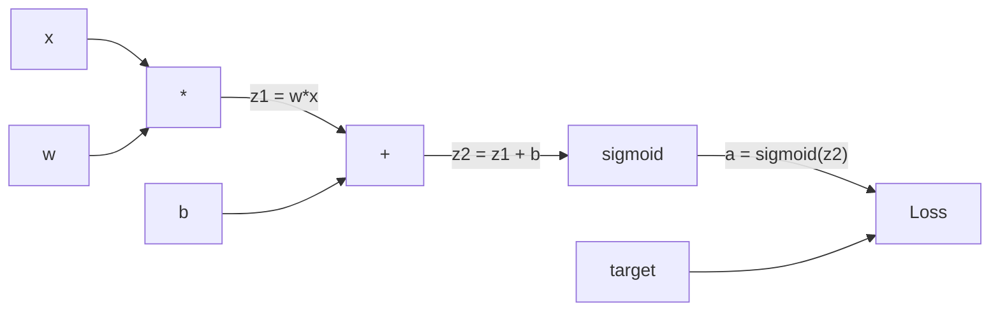
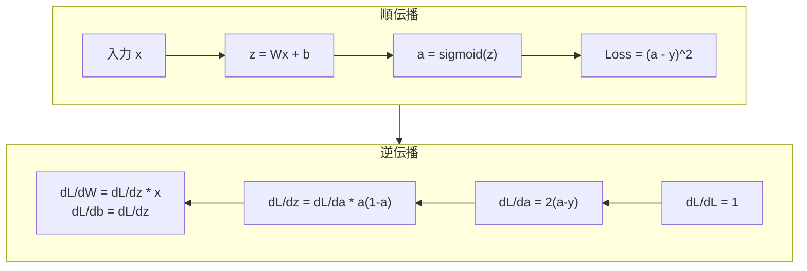
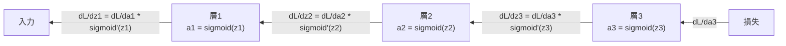

# 誤差逆伝播をゼロから実装する

> 誤差逆伝播は学習を可能にするアルゴリズムだ。これなしでは、ニューラルネットワークは高価なランダム数値生成器に過ぎない。


## 学習目標

- 計算グラフを構築し、トポロジカルソートで勾配を計算するValueベースの自動微分エンジンを実装する
- 連鎖律を使って加算、乗算、シグモイドの逆伝播を導出する
- スクラッチで実装した誤差逆伝播エンジンのみを使って、XORと円の分類で多層ネットワークを訓練する
- 深いシグモイドネットワークにおける勾配消失問題を特定し、勾配が指数的に縮小する理由を説明する

## 問題設定

ネットワークの単一隠れ層には768入力と3072出力がある。重みは2,359,296個だ。間違った予測をした。どの重みがエラーを引き起こしたのか？各重みを個別にテストするには230万回の順伝播が必要だ。誤差逆伝播は、単一の逆伝播ですべての230万個の勾配を計算する。これは最適化ではない。訓練可能と不可能の違いだ。

素朴なアプローチ: 1つの重みを取り、少しだけ変更し、再び順伝播を実行し、損失が増加したか減少したかを測定する。これでその重みの勾配が得られる。次にネットワーク内のすべての重みに対して同じことをする。それを何千回もの訓練ステップと何百万もデータポイントで行う。役に立つものを訓練するのに地質学的な時間が必要になる。

誤差逆伝播がこれを解決する。1回の順伝播、1回の逆伝播、すべての勾配が計算される。コツは微積分の連鎖律を、計算グラフに体系的に適用することだ。これが深層学習を実用的にしたアルゴリズムだ。なければ、おもちゃの問題で立ち往生し続けていただろう。

## 概念

### 連鎖律のネットワークへの適用

フェーズ01、レッスン05で連鎖律を見た。簡単なおさらい: y = f(g(x))なら、dy/dx = f'(g(x)) * g'(x)。連鎖に沿って導関数をかけ合わせる。

ニューラルネットワークでは、「連鎖」は入力から損失までの演算の列だ。各層が重みを適用し、バイアスを加え、活性化を通す。損失関数が最終出力をターゲットと比較する。誤差逆伝播はこの連鎖を逆向きにたどり、各演算がエラーにどう貢献したかを計算する。

### 計算グラフ

すべての順伝播はグラフを構築する。各ノードが演算（乗算、加算、シグモイド）だ。各エッジが順方向に値を、逆方向に勾配を運ぶ。



順伝播: 値が左から右に流れる。xとwがz1 = w*xを生成する。bを加えてz2を得る。シグモイドで活性化aが得られる。aをターゲットyと損失関数を使って比較する。

逆伝播: 勾配が右から左に流れる。dL/da（損失が活性化にどう変化するか）から始める。da/dz2（シグモイドの導関数）をかけると、dL/dz2が得られる。dL/db（z2 = z1 + bなのでdL/dz2に等しい）とdL/dz1に分割する。そしてdL/dw = dL/dz1 * xとdL/dx = dL/dz1 * wとなる。

グラフの各ノードは逆伝播中に1つの仕事をする。上から来た勾配を取り、ローカルの導関数をかけて、下に渡す。

### 順伝播と逆伝播



順伝播はすべての中間値を保存する: z、a、各層への入力。逆伝播はこれらの保存された値を使って勾配を計算する。これが誤差逆伝播の中心にあるメモリと計算のトレードオフだ。メモリ（活性化の保存）をスピード（何百万回ではなく1回のパス）と交換する。

### ネットワークを通じた勾配の流れ

3層ネットワークでは、勾配はすべての層を連鎖する。



各層で、勾配はシグモイドの導関数によってかけられる。シグモイドの導関数はa * (1 - a)で、a = 0.5のとき最大0.25になる。3層深くなると、勾配は最大0.25^3 = 0.0156までかけられている。10層深くなると: 0.25^10 = 0.000001。

### 勾配消失問題

これが勾配消失問題だ。シグモイドは出力を0〜1の間に押しつぶす。導関数は常に0.25未満だ。十分なシグモイド層を重ねると、勾配はほぼゼロまで縮小する。初期の層はゼロに近い勾配しか受け取らないため、ほとんど学習できない。

```
sigmoid(z):     出力範囲 [0, 1]
sigmoid'(z):    最大値 0.25（z = 0のとき）

5層後:    勾配 * 0.25^5 = 元の値の 0.001倍
10層後:   勾配 * 0.25^10 = 元の値の 0.000001倍
```

これが深いシグモイドネットワークが訓練をほぼ不可能にする理由だ。解決策（ReLUとその変種）はレッスン04で扱う。今は、誤差逆伝播が完璧に機能していることを理解する。問題はその媒体にある。

### 2層ネットワークの勾配導出

入力x、シグモイドを持つ隠れ層、シグモイドを持つ出力層、MSE損失を持つネットワークの具体的な数式。

順伝播:
```
z1 = W1 * x + b1
a1 = sigmoid(z1)
z2 = W2 * a1 + b2
a2 = sigmoid(z2)
L = (a2 - y)^2
```

逆伝播（連鎖律を段階的に適用）:
```
dL/da2 = 2(a2 - y)
da2/dz2 = a2 * (1 - a2)
dL/dz2 = dL/da2 * da2/dz2 = 2(a2 - y) * a2 * (1 - a2)

dL/dW2 = dL/dz2 * a1
dL/db2 = dL/dz2

dL/da1 = dL/dz2 * W2
da1/dz1 = a1 * (1 - a1)
dL/dz1 = dL/da1 * da1/dz1

dL/dW1 = dL/dz1 * x
dL/db1 = dL/dz1
```

すべての勾配は損失から逆向きにたどったローカルの導関数の積だ。誤差逆伝播とはそれだけのことだ。

## 実装

### ステップ1: Valueノード

計算の各数値がValueになる。データ、勾配、どのように作られたか（逆伝播で勾配を計算する方法を知るため）を保存する。

```python
class Value:
    def __init__(self, data, children=(), op=''):
        self.data = data
        self.grad = 0.0
        self._backward = lambda: None
        self._children = set(children)
        self._op = op

    def __repr__(self):
        return f"Value(data={self.data:.4f}, grad={self.grad:.4f})"
```

まだ勾配はない（0.0）。逆伝播関数もない（何もしない）。`_children`はどのValueがこのValueを生成したかを追跡し、後でグラフをトポロジカルソートできるようにする。

### ステップ2: 逆伝播関数を持つ演算

各演算は新しいValueを作り、勾配がどう逆伝播するかを定義する。

```python
def __add__(self, other):
    other = other if isinstance(other, Value) else Value(other)
    out = Value(self.data + other.data, (self, other), '+')

    def _backward():
        self.grad += out.grad
        other.grad += out.grad

    out._backward = _backward
    return out

def __mul__(self, other):
    other = other if isinstance(other, Value) else Value(other)
    out = Value(self.data * other.data, (self, other), '*')

    def _backward():
        self.grad += other.data * out.grad
        other.grad += self.data * out.grad

    out._backward = _backward
    return out
```

加算について: d(a+b)/da = 1、d(a+b)/db = 1。だから両方の入力が出力の勾配をそのまま受け取る。

乗算について: d(a*b)/da = b、d(a*b)/db = a。各入力がもう一方の値に出力の勾配をかけた値を受け取る。

`+=`が重要だ。Valueは複数の演算で使われることがある。その勾配はすべてのパスからの勾配の合計だ。

### ステップ3: シグモイドと損失

```python
import math

def sigmoid(self):
    x = self.data
    x = max(-500, min(500, x))
    s = 1.0 / (1.0 + math.exp(-x))
    out = Value(s, (self,), 'sigmoid')

    def _backward():
        self.grad += (s * (1 - s)) * out.grad

    out._backward = _backward
    return out
```

シグモイドの導関数: sigmoid(x) * (1 - sigmoid(x))。順伝播中にsigmoid(x) = sを計算した。再利用する。余分な計算は不要だ。

```python
def mse_loss(predicted, target):
    diff = predicted + Value(-target)
    return diff * diff
```

単一出力のMSE: (predicted - target)^2。減算を負のValueとの加算として表現する。

### ステップ4: 逆伝播

トポロジカルソートにより、正しい順序でノードを処理できる。ノードの勾配はその後に伝播する前に完全に蓄積される。

```python
def backward(self):
    topo = []
    visited = set()

    def build_topo(v):
        if v not in visited:
            visited.add(v)
            for child in v._children:
                build_topo(child)
            topo.append(v)

    build_topo(self)
    self.grad = 1.0
    for v in reversed(topo):
        v._backward()
```

損失から始める（dL/dL = 1なので勾配 = 1.0）。ソートされたグラフを逆向きにたどる。各ノードの`_backward`が子ノードに勾配を伝播する。

### ステップ5: LayerとNetwork

```python
import random

class Neuron:
    def __init__(self, n_inputs):
        scale = (2.0 / n_inputs) ** 0.5
        self.weights = [Value(random.uniform(-scale, scale)) for _ in range(n_inputs)]
        self.bias = Value(0.0)

    def __call__(self, x):
        act = sum((wi * xi for wi, xi in zip(self.weights, x)), self.bias)
        return act.sigmoid()

    def parameters(self):
        return self.weights + [self.bias]


class Layer:
    def __init__(self, n_inputs, n_outputs):
        self.neurons = [Neuron(n_inputs) for _ in range(n_outputs)]

    def __call__(self, x):
        out = [n(x) for n in self.neurons]
        return out[0] if len(out) == 1 else out

    def parameters(self):
        params = []
        for n in self.neurons:
            params.extend(n.parameters())
        return params


class Network:
    def __init__(self, sizes):
        self.layers = []
        for i in range(len(sizes) - 1):
            self.layers.append(Layer(sizes[i], sizes[i + 1]))

    def __call__(self, x):
        for layer in self.layers:
            x = layer(x)
            if not isinstance(x, list):
                x = [x]
        return x[0] if len(x) == 1 else x

    def parameters(self):
        params = []
        for layer in self.layers:
            params.extend(layer.parameters())
        return params

    def zero_grad(self):
        for p in self.parameters():
            p.grad = 0.0
```

Neuronは入力を取り、重み付き和+バイアスを計算し、シグモイドを適用する。重みの初期化はsqrt(2/n_inputs)でスケールし、深いネットワークでのシグモイドの飽和を防ぐ。Layerはニューロンのリストだ。Networkは層のリストだ。`parameters()`メソッドはすべての学習可能なValueを集め、更新できるようにする。

### ステップ6: XORで訓練する

```python
random.seed(42)
net = Network([2, 4, 1])

xor_data = [
    ([0.0, 0.0], 0.0),
    ([0.0, 1.0], 1.0),
    ([1.0, 0.0], 1.0),
    ([1.0, 1.0], 0.0),
]

learning_rate = 1.0

for epoch in range(1000):
    total_loss = Value(0.0)
    for inputs, target in xor_data:
        x = [Value(i) for i in inputs]
        pred = net(x)
        loss = mse_loss(pred, target)
        total_loss = total_loss + loss

    net.zero_grad()
    total_loss.backward()

    for p in net.parameters():
        p.data -= learning_rate * p.grad

    if epoch % 100 == 0:
        print(f"エポック {epoch:4d} | 損失: {total_loss.data:.6f}")

print("\nXOR結果:")
for inputs, target in xor_data:
    x = [Value(i) for i in inputs]
    pred = net(x)
    print(f"  {inputs} -> {pred.data:.4f} (期待値 {target})")
```

損失が減少するのを観察する。ランダムな予測から正しいXOR出力まで、すべて誤差逆伝播が勾配を計算し、重みを正しい方向に少しずつ動かすことで実現される。

### ステップ7: 円の分類

レッスン02では円の分類のために重みを手動で調整した。今度はネットワークに自分で学習させる。

```python
random.seed(7)

def generate_circle_data(n=100):
    data = []
    for _ in range(n):
        x1 = random.uniform(-1.5, 1.5)
        x2 = random.uniform(-1.5, 1.5)
        label = 1.0 if x1 * x1 + x2 * x2 < 1.0 else 0.0
        data.append(([x1, x2], label))
    return data

circle_data = generate_circle_data(80)

circle_net = Network([2, 8, 1])
learning_rate = 0.5

for epoch in range(2000):
    random.shuffle(circle_data)
    total_loss_val = 0.0
    for inputs, target in circle_data:
        x = [Value(i) for i in inputs]
        pred = circle_net(x)
        loss = mse_loss(pred, target)
        circle_net.zero_grad()
        loss.backward()
        for p in circle_net.parameters():
            p.data -= learning_rate * p.grad
        total_loss_val += loss.data

    if epoch % 200 == 0:
        correct = 0
        for inputs, target in circle_data:
            x = [Value(i) for i in inputs]
            pred = circle_net(x)
            predicted_class = 1.0 if pred.data > 0.5 else 0.0
            if predicted_class == target:
                correct += 1
        accuracy = correct / len(circle_data) * 100
        print(f"エポック {epoch:4d} | 損失: {total_loss_val:.4f} | 精度: {accuracy:.1f}%")
```

ここではオンラインSGDを使う。フルバッチを積み上げる代わりに、各サンプルの後に重みを更新する。これにより対称性がより早く破れ、フルの損失ランドスケープでのシグモイドの飽和を回避する。各エポックでデータをシャッフルすることで、ネットワークが順序を記憶するのを防ぐ。

手動調整なし。ネットワークが自力で円形の決定境界を発見する。これが誤差逆伝播の力だ。アーキテクチャ、損失関数、データを定義すれば、アルゴリズムが重みを決める。

## 実用例

PyTorchなら数行で上記すべてができる。核心のアイデアは同一だ。autograd は順伝播中に計算グラフを構築し、それを逆向きにたどって勾配を計算する。

```python
import torch
import torch.nn as nn

model = nn.Sequential(
    nn.Linear(2, 4),
    nn.Sigmoid(),
    nn.Linear(4, 1),
    nn.Sigmoid(),
)
optimizer = torch.optim.SGD(model.parameters(), lr=1.0)
criterion = nn.MSELoss()

X = torch.tensor([[0,0],[0,1],[1,0],[1,1]], dtype=torch.float32)
y = torch.tensor([[0],[1],[1],[0]], dtype=torch.float32)

for epoch in range(1000):
    pred = model(X)
    loss = criterion(pred, y)
    optimizer.zero_grad()
    loss.backward()
    optimizer.step()

print("PyTorch XOR結果:")
with torch.no_grad():
    for i in range(4):
        pred = model(X[i])
        print(f"  {X[i].tolist()} -> {pred.item():.4f} (期待値 {y[i].item()})")
```

`loss.backward()`が自作の`total_loss.backward()`だ。`optimizer.step()`が手動の`p.data -= lr * p.grad`だ。`optimizer.zero_grad()`が`net.zero_grad()`だ。同じアルゴリズムの産業規模の実装だ。PyTorchはGPUアクセラレーション、混合精度、勾配チェックポインティング、数百種類の層タイプを扱う。しかし逆伝播は同じ計算グラフに適用された同じ連鎖律だ。

訓練は順伝播を実行し、逆伝播を実行し、重みを更新する。推論は順伝播のみを実行する。勾配も更新もない。この区別が重要なのは、推論が本番で起きることだからだ。ClaudeやGPTなどのAPIを呼ぶとき、推論を実行している。プロンプトがネットワークを順方向に流れ、トークンが反対側から出てくる。重みは変わらない。誤差逆伝播を理解することが重要なのは、それがそのネットワーク内のすべての重みを形成したからだ。

## 成果物

このレッスンの成果物:
- `outputs/prompt-gradient-debugger.md` -- 任意のニューラルネットワークの勾配問題（消失、爆発、NaN）を診断するための再利用可能なプロンプト

## 演習

1. Valueクラスに`__sub__`メソッドを追加する（a - b = a + (-1 * b)）。次に`__neg__`メソッドを実装する。(a - b)^2のようなシンプルな式の手動計算と比較して、勾配が正しいことを確認する。

2. Valueに`relu`メソッドを追加する（max(0, x)を出力し、x > 0のときの導関数は1、それ以外は0）。隠れ層のシグモイドをreluに置き換えて、再びXORで訓練する。収束速度を比較する。訓練が速くなるはずだ。これはレッスン04の予告だ。

3. Valueに整数乗のための`__pow__`メソッドを実装する。それを使って`mse_loss`を適切な`(predicted - target) ** 2`式に置き換える。勾配が元の実装と一致することを確認する。

4. 訓練ループに勾配クリッピングを追加する: `backward()`を呼んだ後、すべての勾配を[-1, 1]にクリップする。深いネットワーク（シグモイドを持つ4層以上）を訓練し、クリッピングありとなしの損失曲線を比較する。これが爆発する勾配への最初の防衛策だ。

5. 可視化を構築する: XORで訓練した後、ネットワーク内のすべてのパラメータの勾配を出力する。最も小さい勾配を持つ層を特定する。これが概念セクションで読んだ勾配消失問題を実証する。

## 重要用語

| 用語 | よく言われること | 実際の意味 |
|------|----------------|----------------------|
| 誤差逆伝播 | 「ネットワークが学習する」 | 連鎖律を計算グラフの逆向きに適用することで、すべての重みのdL/dwを計算するアルゴリズム |
| 計算グラフ | 「ネットワーク構造」 | ノードが演算でエッジが値（順方向）と勾配（逆方向）を運ぶ有向非巡回グラフ |
| 連鎖律 | 「導関数をかける」 | y = f(g(x))なら dy/dx = f'(g(x)) * g'(x) -- 誤差逆伝播の数学的基盤 |
| 勾配 | 「最急上昇の方向」 | パラメータに対する損失の偏微分 -- そのパラメータをどう変えれば損失を減らせるかを示す |
| 勾配消失 | 「深いネットワークが学習しない」 | シグモイドのような飽和活性化を持つ層を通じて伝播するとき、勾配が指数的に縮小する |
| 順伝播 | 「ネットワークを実行する」 | 各層の演算を順番に適用し、中間値を保存しながら入力から出力を計算する |
| 逆伝播 | 「勾配を計算する」 | 連鎖律を使って各ノードで勾配を蓄積しながら、計算グラフを逆向きにたどる |
| 学習率 | 「学習速度」 | 重みを更新するときのステップサイズを制御するスカラー: w_new = w_old - lr * gradient |
| トポロジカルソート | 「正しい順序」 | 各ノードが依存するすべてのノードの後に現れるグラフノードの順序付け -- 勾配が伝播前に完全に蓄積されることを保証する |
| 自動微分（Autograd） | 「自動的な微分」 | 順伝播計算中に計算グラフを構築し、自動的に勾配を計算するシステム -- PyTorchのエンジンが行うこと |

## 参考文献

- Rumelhart, Hinton & Williams, "Learning representations by back-propagating errors" (1986) -- 誤差逆伝播を主流にし、多層ネットワークの訓練を解放した論文
- 3Blue1Brown, "Neural Networks" series (https://www.youtube.com/playlist?list=PLZHQObOWTQDNU6R1_67000Dx_ZCJB-3pi) -- 誤差逆伝播とネットワークを通じた勾配の流れの最高のビジュアル解説
