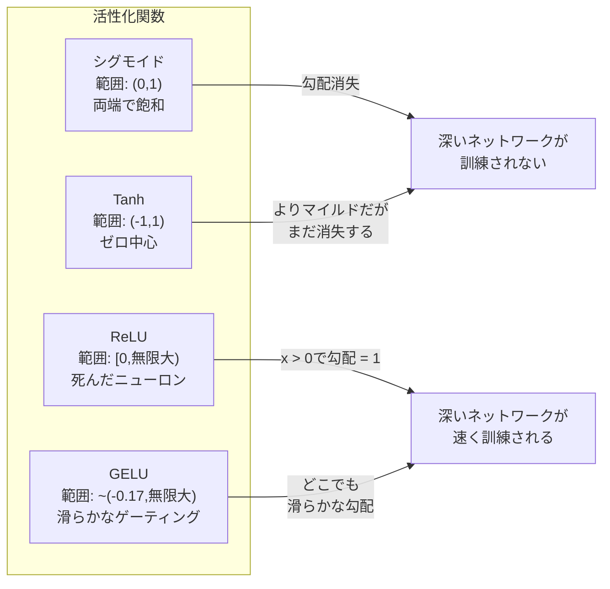
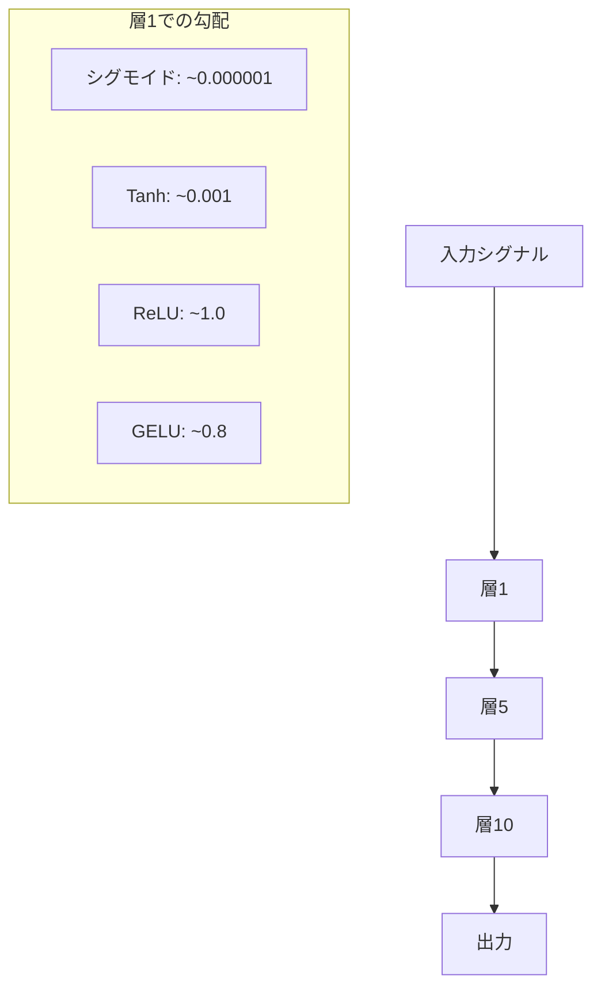
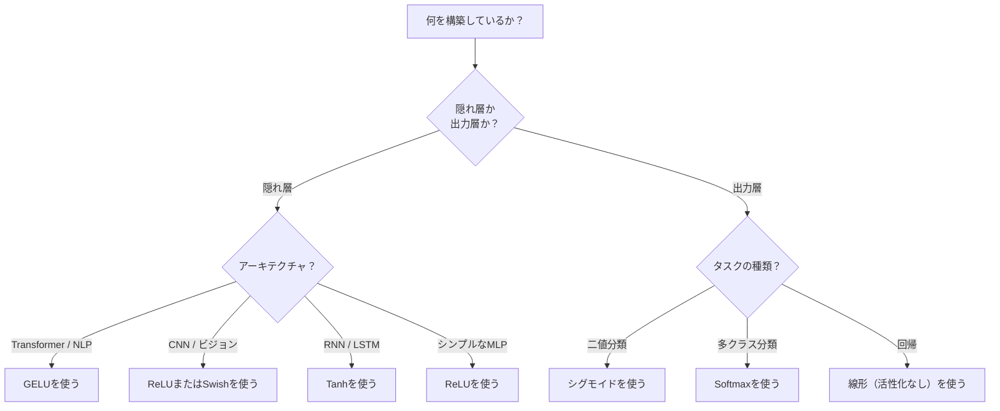

# 活性化関数

> 非線形性がなければ、100層のネットワークは大げさな行列乗算に過ぎない。活性化関数はニューラルネットワークが曲線で考えるためのゲートだ。


## 学習目標

- シグモイド、tanh、ReLU、Leaky ReLU、GELU、Swish、softmaxをその導関数とともにゼロから実装する
- 異なる活性化関数を使って10層以上で活性化の大きさを測定し、勾配消失問題を診断する
- ReLUネットワークの死んだニューロンを検出し、GELUがこの失敗モードを回避する理由を説明する
- 特定のアーキテクチャ（Transformer、CNN、RNN、出力層）に対して正しい活性化関数を選択する

## 問題設定

2つの線形変換を重ねる: y = W2(W1x + b1) + b2。展開すると: y = W2W1x + W2b1 + b2。これは単にy = Ax + c、つまり単一の線形変換だ。線形層をいくつ重ねても、結果は1つの行列乗算に崩壊する。100層ネットワークも単層ネットワークと同じ表現力しか持たない。

これは理論的な話だけではない。深い線形ネットワークは文字通りXORを学習できず、らせん状のデータセットを分類できず、顔を認識できないということだ。活性化関数なしでは、深さは幻想だ。

活性化関数が線形性を破る。各層の出力を非線形関数によって変形し、ネットワークに決定境界を曲げる能力、任意の関数を近似する能力、そして実際に学習する能力を与える。しかし間違った活性化を選ぶと、勾配がゼロに消えたり（深いネットワークのシグモイド）、無限大に爆発したり（慎重な初期化なしの非有界活性化）、ニューロンが永久に死んだりする（大きな負のバイアスを持つReLU）。活性化関数の選択は、ネットワークが学習できるかどうかに直接影響する。

## 概念

### なぜ非線形性が必要か

行列乗算は合成可能だ。ベクトルを行列Aで乗じてから行列Bで乗じることは、ABで乗じることと同じだ。つまり10の線形層を重ねることは、1つの大きな行列を持つ1つの線形層と数学的に等しい。それだけのパラメータ、それだけの深さ、無駄だ。連鎖を破るものが必要だ。それが活性化関数の役割だ。

証明を示す。線形層はf(x) = Wx + bを計算する。2層重ねると:

```
層1: h = W1 * x + b1
層2: y = W2 * h + b2
```

代入すると:

```
y = W2 * (W1 * x + b1) + b2
y = (W2 * W1) * x + (W2 * b1 + b2)
y = A * x + c
```

1層だ。層の間に非線形活性化g()を挿入すると:

```
h = g(W1 * x + b1)
y = W2 * h + b2
```

今度は代入が破綻する。W2 * g(W1 * x + b1) + b2は単一の線形変換に還元できない。ネットワークは非線形関数を表現できる。活性化を持つ追加の層はそれぞれ表現能力を追加する。

### シグモイド

ニューラルネットワークの元祖活性化関数だ。

```
sigmoid(x) = 1 / (1 + e^(-x))
```

出力範囲: (0, 1)。滑らかで微分可能、任意の実数を確率のような値に写像する。

導関数:

```
sigmoid'(x) = sigmoid(x) * (1 - sigmoid(x))
```

この導関数の最大値は0.25で、x = 0のとき発生する。誤差逆伝播では、勾配は層を通じてかけ合わされる。10層のシグモイドは勾配が最大0.25を10回かけられることを意味する:

```
0.25^10 = 0.000000953674
```

元のシグナルの100万分の1以下だ。これが勾配消失問題だ。初期の層の勾配が非常に小さくなり、重みがほとんど更新されない。ネットワークは学習しているように見えるが、後の層での損失は減少する一方で、最初の層は凍結される。深いシグモイドネットワークは単純に訓練されない。

追加の問題: シグモイドの出力は常に正（0〜1）なので、重みの勾配は常に同じ符号になる。これにより勾配降下法でのジグザグが発生する。

### tanh

シグモイドの中心化バージョンだ。

```
tanh(x) = (e^x - e^(-x)) / (e^x + e^(-x))
```

出力範囲: (-1, 1)。ゼロ中心で、ジグザグ問題を解消する。

導関数:

```
tanh'(x) = 1 - tanh(x)^2
```

最大導関数はx = 0のとき1.0だ。シグモイドより4倍優れている。しかし勾配消失問題はまだ残る。大きな正または負の入力では、導関数がゼロに近づく。10層でも勾配をつぶすが、シグモイドほど攻撃的ではない。

### ReLU: 画期的な突破

Rectified Linear Unit（整流線形ユニット）。Nair と Hinton が2010年に深層学習のために普及させた（関数自体は Fukushima の1969年の研究に遡る）。すべてを変えた。

```
relu(x) = max(0, x)
```

出力範囲: [0, 無限大)。導関数は驚くほどシンプルだ:

```
relu'(x) = 1  x > 0 の場合
            0  x <= 0 の場合
```

正の入力に対して勾配消失なし。勾配はちょうど1で、そのまま通過する。深いネットワークが訓練可能になったのはこれが理由だ。ReLUは層を通じて勾配の大きさを保持する。

しかし失敗モードがある: 死んだニューロン問題だ。ニューロンの重み付き入力が常に負（大きな負のバイアスや不運な重み初期化のため）なら、出力は常にゼロ、勾配は常にゼロで、更新されない。永久に死んでいる。実際には、ReLUネットワークのニューロンの10〜40%が訓練中に死ぬことがある。

### Leaky ReLU

死んだニューロンへの最もシンプルな解決策だ。

```
leaky_relu(x) = x        x > 0 の場合
                alpha * x x <= 0 の場合
```

alphaは小さな定数で、通常0.01だ。負の側にゼロではなく小さな傾きがあるので、死んだニューロンでも勾配シグナルを受け取り、回復できる。

### GELU: 現代のデフォルト

Gaussian Error Linear Unit（ガウス誤差線形ユニット）。Hendrycks と Gimpel が2016年に導入した。BERT、GPT、ほとんどの現代のTransformerのデフォルト活性化関数だ。

```
gelu(x) = x * Phi(x)
```

Phi(x)は標準正規分布の累積分布関数だ。実際に使われる近似式:

```
gelu(x) ~= 0.5 * x * (1 + tanh(sqrt(2/pi) * (x + 0.044715 * x^3)))
```

GELUはどこでも滑らかで、小さな負の値を許容し（ゼロにハードクリップするReLUと違い）、確率的な解釈がある: ガウス分布で正になる確率によって各入力を重み付けする。この滑らかなゲーティングはTransformerアーキテクチャでReLUより優れた性能を示す。なぜなら、より良い勾配の流れを提供し、死んだニューロン問題を完全に回避するからだ。

### Swish / SiLU

2017年にRamachandranらが自動探索で発見したセルフゲート活性化関数だ。

```
swish(x) = x * sigmoid(x)
```

Swishは形式的にはx * sigmoid(x)だ。Googleは活性化関数空間の自動探索によって発見した。ニューラルネットワークがニューラルネットワークの部品を設計している。

GELUと同様に、滑らかで非単調、小さな負の値を許容する。違いは微妙だ: SwishはゲーティングにシグモイドをGELUはガウスCDFを使う。実際の性能はほぼ同一だ。SwishはEfficientNetやいくつかのビジョンモデルで使われる。GELUは言語モデルで支配的だ。

### Softmax: 出力活性化

隠れ層では使わない。Softmaxは生スコア（ロジット）のベクトルを確率分布に変換する。

```
softmax(x_i) = e^(x_i) / sum(e^(x_j) for all j)
```

すべての出力は0〜1の間だ。すべての出力の合計は1だ。これが多クラス分類の標準的な最終活性化になっている。最大のロジットが最高確率を得るが、argmaxと違ってsoftmaxは微分可能で、相対的な確信度に関する情報を保持する。

### 形状の比較



### 勾配の流れ比較



### どの活性化をいつ使うか



## 実装

### ステップ1: すべての活性化関数をその導関数とともに実装する

各関数は単一のfloatを受け取り、floatを返す。各導関数は同じ入力を受け取り、勾配を返す。

```python
import math

def sigmoid(x):
    x = max(-500, min(500, x))
    return 1.0 / (1.0 + math.exp(-x))

def sigmoid_derivative(x):
    s = sigmoid(x)
    return s * (1 - s)

def tanh_act(x):
    return math.tanh(x)

def tanh_derivative(x):
    t = math.tanh(x)
    return 1 - t * t

def relu(x):
    return max(0.0, x)

def relu_derivative(x):
    return 1.0 if x > 0 else 0.0

def leaky_relu(x, alpha=0.01):
    return x if x > 0 else alpha * x

def leaky_relu_derivative(x, alpha=0.01):
    return 1.0 if x > 0 else alpha

def gelu(x):
    return 0.5 * x * (1 + math.tanh(math.sqrt(2 / math.pi) * (x + 0.044715 * x ** 3)))

def gelu_derivative(x):
    phi = 0.5 * (1 + math.erf(x / math.sqrt(2)))
    pdf = math.exp(-0.5 * x * x) / math.sqrt(2 * math.pi)
    return phi + x * pdf

def swish(x):
    return x * sigmoid(x)

def swish_derivative(x):
    s = sigmoid(x)
    return s + x * s * (1 - s)

def softmax(xs):
    max_x = max(xs)
    exps = [math.exp(x - max_x) for x in xs]
    total = sum(exps)
    return [e / total for e in exps]
```

### ステップ2: 勾配がどこで死ぬかを可視化する

-5から5の100点で均等に勾配を計算する。各活性化の勾配がほぼゼロになる場所をテキストヒストグラムで表示する。

```python
def gradient_scan(name, derivative_fn, start=-5, end=5, n=100):
    step = (end - start) / n
    near_zero = 0
    healthy = 0
    for i in range(n):
        x = start + i * step
        g = derivative_fn(x)
        if abs(g) < 0.01:
            near_zero += 1
        else:
            healthy += 1
    pct_dead = near_zero / n * 100
    print(f"{name:15s}: 健全 {healthy:3d}、ほぼゼロ {near_zero:3d} ({pct_dead:.0f}% 死亡ゾーン)")

gradient_scan("Sigmoid", sigmoid_derivative)
gradient_scan("Tanh", tanh_derivative)
gradient_scan("ReLU", relu_derivative)
gradient_scan("Leaky ReLU", leaky_relu_derivative)
gradient_scan("GELU", gelu_derivative)
gradient_scan("Swish", swish_derivative)
```

### ステップ3: 勾配消失実験

シグモイドとReLUを使ってN層を通じてシグナルを順伝播させる。活性化の大きさがどう変化するかを測定する。

```python
import random

def vanishing_gradient_experiment(activation_fn, name, n_layers=10, n_inputs=5):
    random.seed(42)
    values = [random.gauss(0, 1) for _ in range(n_inputs)]

    print(f"\n{name} の {n_layers} 層通過:")
    for layer in range(n_layers):
        weights = [random.gauss(0, 1) for _ in range(n_inputs)]
        z = sum(w * v for w, v in zip(weights, values))
        activated = activation_fn(z)
        magnitude = abs(activated)
        bar = "#" * int(magnitude * 20)
        print(f"  層 {layer+1:2d}: 大きさ = {magnitude:.6f} {bar}")
        values = [activated] * n_inputs

vanishing_gradient_experiment(sigmoid, "Sigmoid")
vanishing_gradient_experiment(relu, "ReLU")
vanishing_gradient_experiment(gelu, "GELU")
```

### ステップ4: 死んだニューロン検出器

ReLUネットワークを作り、ランダムな入力を通して、一度も発火しないニューロンの数を数える。

```python
def dead_neuron_detector(n_inputs=5, hidden_size=20, n_samples=1000):
    random.seed(0)
    weights = [[random.gauss(0, 1) for _ in range(n_inputs)] for _ in range(hidden_size)]
    biases = [random.gauss(0, 1) for _ in range(hidden_size)]

    fire_counts = [0] * hidden_size

    for _ in range(n_samples):
        inputs = [random.gauss(0, 1) for _ in range(n_inputs)]
        for neuron_idx in range(hidden_size):
            z = sum(w * x for w, x in zip(weights[neuron_idx], inputs)) + biases[neuron_idx]
            if relu(z) > 0:
                fire_counts[neuron_idx] += 1

    dead = sum(1 for c in fire_counts if c == 0)
    rarely_fire = sum(1 for c in fire_counts if 0 < c < n_samples * 0.05)
    healthy = hidden_size - dead - rarely_fire

    print(f"\n死んだニューロンレポート（{hidden_size} ニューロン、{n_samples} サンプル）:")
    print(f"  死んでいる（一度も発火しない）: {dead}")
    print(f"  ほぼ死んでいる（<5%）:          {rarely_fire}")
    print(f"  健全:                           {healthy}")
    print(f"  死んだニューロン率:             {dead/hidden_size*100:.1f}%")

    for i, c in enumerate(fire_counts):
        status = "DEAD" if c == 0 else "WEAK" if c < n_samples * 0.05 else "OK"
        bar = "#" * (c * 40 // n_samples)
        print(f"  ニューロン {i:2d}: {c:4d}/{n_samples} 発火 [{status:4s}] {bar}")

dead_neuron_detector()
```

### ステップ5: 訓練比較 -- シグモイド vs ReLU vs GELU

円データセット（円の内側の点がクラス1、外側がクラス0）に対して、3種類の異なる活性化で同じ2層ネットワークを訓練する。収束速度を比較する。

```python
def make_circle_data(n=200, seed=42):
    random.seed(seed)
    data = []
    for _ in range(n):
        x = random.uniform(-2, 2)
        y = random.uniform(-2, 2)
        label = 1.0 if x * x + y * y < 1.5 else 0.0
        data.append(([x, y], label))
    return data


class ActivationNetwork:
    def __init__(self, activation_fn, activation_deriv, hidden_size=8, lr=0.1):
        random.seed(0)
        self.act = activation_fn
        self.act_d = activation_deriv
        self.lr = lr
        self.hidden_size = hidden_size

        self.w1 = [[random.gauss(0, 0.5) for _ in range(2)] for _ in range(hidden_size)]
        self.b1 = [0.0] * hidden_size
        self.w2 = [random.gauss(0, 0.5) for _ in range(hidden_size)]
        self.b2 = 0.0

    def forward(self, x):
        self.x = x
        self.z1 = []
        self.h = []
        for i in range(self.hidden_size):
            z = self.w1[i][0] * x[0] + self.w1[i][1] * x[1] + self.b1[i]
            self.z1.append(z)
            self.h.append(self.act(z))

        self.z2 = sum(self.w2[i] * self.h[i] for i in range(self.hidden_size)) + self.b2
        self.out = sigmoid(self.z2)
        return self.out

    def backward(self, target):
        error = self.out - target
        d_out = error * self.out * (1 - self.out)

        for i in range(self.hidden_size):
            d_h = d_out * self.w2[i] * self.act_d(self.z1[i])
            self.w2[i] -= self.lr * d_out * self.h[i]
            for j in range(2):
                self.w1[i][j] -= self.lr * d_h * self.x[j]
            self.b1[i] -= self.lr * d_h
        self.b2 -= self.lr * d_out

    def train(self, data, epochs=200):
        losses = []
        for epoch in range(epochs):
            total_loss = 0
            correct = 0
            for x, y in data:
                pred = self.forward(x)
                self.backward(y)
                total_loss += (pred - y) ** 2
                if (pred >= 0.5) == (y >= 0.5):
                    correct += 1
            avg_loss = total_loss / len(data)
            accuracy = correct / len(data) * 100
            losses.append(avg_loss)
            if epoch % 50 == 0 or epoch == epochs - 1:
                print(f"    エポック {epoch:3d}: 損失={avg_loss:.4f}, 精度={accuracy:.1f}%")
        return losses


data = make_circle_data()

configs = [
    ("Sigmoid", sigmoid, sigmoid_derivative),
    ("ReLU", relu, relu_derivative),
    ("GELU", gelu, gelu_derivative),
]

results = {}
for name, act_fn, act_d_fn in configs:
    print(f"\n=== {name} で訓練中 ===")
    net = ActivationNetwork(act_fn, act_d_fn, hidden_size=8, lr=0.1)
    losses = net.train(data, epochs=200)
    results[name] = losses

print("\n=== 最終損失比較 ===")
for name, losses in results.items():
    print(f"  {name:10s}: 開始={losses[0]:.4f} -> 終了={losses[-1]:.4f} (改善: {(1 - losses[-1]/losses[0])*100:.1f}%)")
```

## 実用例

PyTorchはこれらすべてを関数形式とモジュール形式の両方で提供する。

```python
import torch
import torch.nn as nn
import torch.nn.functional as F

x = torch.randn(4, 10)

relu_out = F.relu(x)
gelu_out = F.gelu(x)
sigmoid_out = torch.sigmoid(x)
swish_out = F.silu(x)

logits = torch.randn(4, 5)
probs = F.softmax(logits, dim=1)

model = nn.Sequential(
    nn.Linear(10, 64),
    nn.GELU(),
    nn.Linear(64, 32),
    nn.GELU(),
    nn.Linear(32, 5),
)
```

Transformerの隠れ層にはGELU。CNNの隠れ層にはReLU。分類の出力層にはsoftmax。回帰の出力層にはなし（線形）。確率の出力層にはシグモイド。それだけだ。これらのデフォルトから始めて、証拠がある時だけ変更する。

RNNとLSTMは隠れ状態にtanh、ゲートにシグモイドを使うが、今日ゼロから構築するなら、たぶんRNNは使わない。ReLUネットワークでニューロンが死んでいたらGELUに切り替える。特定の理由がなければLeaky ReLUに手を伸ばすな。GELUが死んだニューロン問題を解決し、より良い勾配の流れを提供する。

## 成果物

このレッスンの成果物:
- `outputs/prompt-activation-selector.md` -- 任意のアーキテクチャに対して正しい活性化関数を選ぶのを助ける再利用可能なプロンプト

## 演習

1. 負の傾きalphaが学習可能なパラメータであるParametric ReLU（PReLU）を実装する。円データセットで訓練し、固定のLeaky ReLUと比較する。

2. 10層の代わりに50層で勾配消失実験を実行する。シグモイド、tanh、ReLU、GELUの各層での大きさをプロットする。各活性化のシグナルが実質的にゼロになる層はどこか？

3. ELU（指数線形ユニット）を実装する: x > 0ならx、x <= 0ならalpha * (e^x - 1)。同じネットワークでReLUと死んだニューロン率を比較する。

4. 訓練中に実行する「勾配健全性モニター」を構築する: 各エポックで各層の平均勾配の大きさを計算する。どの層の勾配でも0.001を下回るか100を超えた場合に警告を出力する。

5. 訓練比較を円データセットの代わりにレッスン01のXORデータセットを使って行う。どの活性化がXORに最速で収束するか？これが円の結果と異なる理由は何か？

## 重要用語

| 用語 | よく言われること | 実際の意味 |
|------|----------------|----------------------|
| 活性化関数 | 「非線形な部分」 | 各ニューロンの出力に適用される関数。線形性を破り、ネットワークが非線形マッピングを学習できるようにする |
| 勾配消失 | 「深いネットワークで勾配が消える」 | 活性化の導関数が1未満のとき、勾配が層を通じて指数的に縮小し、初期の層が訓練不可能になる |
| 勾配爆発 | 「勾配が吹き飛ぶ」 | 実効的な乗数が1を超えるとき、勾配が層を通じて指数的に増大し、不安定な訓練を引き起こす |
| 死んだニューロン | 「学習を止めたニューロン」 | 入力が常に負で、ゼロ出力とゼロ勾配を生成するReLUニューロン |
| シグモイド | 「値を0〜1に押しつぶす」 | ロジスティック関数1/(1+e^-x)、歴史的に重要だが深いネットワークで勾配消失を引き起こす |
| ReLU | 「負をゼロにクリップする」 | max(0, x) -- 勾配の大きさを保持することで深層学習を実用的にした活性化関数 |
| GELU | 「Transformerの活性化」 | ガウス誤差線形ユニット、正になる確率によって入力を重み付けする滑らかな活性化関数 |
| Swish/SiLU | 「セルフゲートReLU」 | x * sigmoid(x)、自動探索で発見された、EfficientNetで使用 |
| Softmax | 「スコアを確率に変える」 | ロジットのベクトルを正規化し、すべての値が(0,1)の範囲で合計が1の確率分布を作る |
| Leaky ReLU | 「死なないReLU」 | max(alpha*x, x)でalphaは小さい（0.01）、小さな負の勾配を許容して死んだニューロンを防ぐ |
| 飽和 | 「シグモイドの平らな部分」 | 活性化の導関数がゼロに近づき、勾配の流れをブロックする領域 |
| ロジット | 「softmax前の生スコア」 | softmaxかシグモイドを適用する前の最終層の非正規化出力 |

## 参考文献

- Nair & Hinton, "Rectified Linear Units Improve Restricted Boltzmann Machines" (2010) -- ReLUを導入し、深いネットワークの訓練を可能にした論文
- Hendrycks & Gimpel, "Gaussian Error Linear Units (GELUs)" (2016) -- Transformerのデフォルトとなった活性化関数を導入
- Ramachandran et al., "Searching for Activation Functions" (2017) -- 自動探索を使ってSwishを発見し、活性化設計を自動化できることを示した
- Glorot & Bengio, "Understanding the difficulty of training deep feedforward neural networks" (2010) -- 勾配消失/爆発を診断し、Xavier初期化を提案した論文
- Goodfellow, Bengio, Courville, "Deep Learning" Chapter 6.3 (https://www.deeplearningbook.org/) -- 隠れユニットと活性化関数の厳密な扱い
