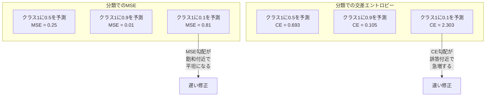
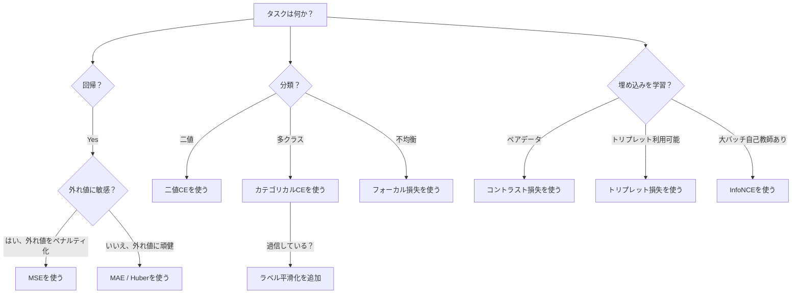
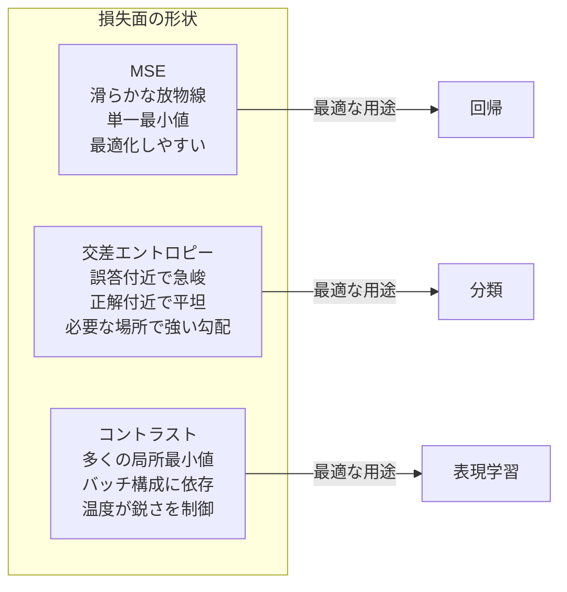

# 損失関数

> ネットワークが予測を行う。正解は別のことを言っている。どれくらい間違っているのか？その数値が損失だ。間違った損失関数を選ぶと、モデルはまったく別のことを最適化してしまう。


## 学習目標

- MSE、二値交差エントロピー、カテゴリカル交差エントロピー、コントラスト損失（InfoNCE）をその勾配とともにゼロから実装する
- 「すべてに0.5を予測する」失敗モードを実証して、MSEが分類に失敗する理由を説明する
- 交差エントロピーにラベル平滑化を適用し、過信した予測を防ぐ方法を説明する
- 回帰、二値分類、多クラス分類、埋め込み学習タスクに対して正しい損失関数を選択する

## 問題設定

分類問題でMSEを最小化するモデルは、自信を持ってすべてに0.5を予測する。損失を最小化している。そして役に立たない。

損失関数はモデルが実際に最適化する唯一のものだ。精度ではない。F1スコアでもない。上司に報告するどんな指標でもない。オプティマイザは損失関数の勾配を取り、その数値を小さくするように重みを調整する。損失関数が気にしていることを捉えていなければ、モデルはそれを満足させる数学的に最も安価な方法を見つける。そしてその方法はほぼ確実にあなたが望んでいたものではない。

具体的な例を見てみよう。二値分類タスクがある。2クラス、50/50の分布だ。MSEを損失として使う。モデルはすべての入力に0.5を予測する。平均MSEは0.25で、実際に何も学習しなくても到達できる最小値だ。モデルには識別能力がゼロだが、技術的には損失関数を最小化した。交差エントロピーに切り替えると、同じモデルは予測を0または1に向けることを強いられる。-log(0.5) = 0.693は悲惨な損失で、-log(0.99) = 0.01が自信のある正しい予測を報酬する。損失関数の選択は、学習するモデルと指標をゲームするモデルの違いだ。

さらに悪い話がある。自己教師あり学習ではラベルさえない。コントラスト損失が学習シグナル全体を定義する。何が似ているか、何が違うか、モデルがどれほど強くそれらを引き離すべきか。コントラスト損失を間違えると、埋め込みが単一の点に崩壊する。すべての入力が同じベクトルにマップされる。技術的にはゼロ損失。完全に無価値。

## 概念

### 平均二乗誤差（MSE）

回帰のデフォルト。予測とターゲットの二乗差を計算し、すべてのサンプルで平均する。

```
MSE = (1/n) * sum((y_pred - y_true)^2)
```

なぜ二乗が重要か: 大きなエラーを二乗関数的にペナルティ化する。2のエラーは1のエラーの4倍のコストがかかる。10のエラーは100倍だ。これによりMSEは外れ値に敏感になる。1つの大きく間違った予測が損失を支配する。

実際の数値で考えると: モデルが住宅価格を予測し、ほとんどの家で10,000ドルずれているが、あるマンションで200,000ドルずれているとする。MSEはそのマンションの修正に積極的に取り組み、他の99軒のパフォーマンスを犠牲にする可能性がある。

予測に対するMSEの勾配は:

```
dMSE/dy_pred = (2/n) * (y_pred - y_true)
```

エラーに線形だ。大きなエラーほど大きな勾配を得る。これは回帰では特徴（大きなエラーには大きな修正が必要）だが、分類ではバグだ（自信を持って間違えた回答を線形ではなく指数関数的にペナルティ化したい）。

### 交差エントロピー損失

分類のための損失関数だ。情報理論に根ざしている。予測された確率分布と真の分布の乖離を測定する。

**二値交差エントロピー（BCE）:**

```
BCE = -(y * log(p) + (1 - y) * log(1 - p))
```

yは真のラベル（0または1）でpは予測確率だ。

-log(p)が機能する理由: 真のラベルが1でp = 0.99を予測するとき、損失は-log(0.99) = 0.01だ。p = 0.01を予測するとき、損失は-log(0.01) = 4.6だ。この460倍の差が交差エントロピーが機能する理由だ。自信のある間違った予測を残酷にペナルティ化しながら、自信のある正しい予測にはほとんどペナルティを与えない。

勾配も同じ話をしている:

```
dBCE/dp = -(y/p) + (1-y)/(1-p)
```

y = 1でpがゼロに近いとき、勾配は-1/pで負の無限大に近づく。モデルは間違いを修正するための巨大なシグナルを受け取る。pが1に近いとき、勾配は小さい。既に正しい、修正するものはない。

**カテゴリカル交差エントロピー:**

ワンホット符号化されたターゲットを使った多クラス分類のためだ。

```
CCE = -sum(y_i * log(p_i))
```

真のクラスだけが損失に貢献する（他のすべてのy_iがゼロだから）。10クラスあって正しいクラスが0.1の確率を得る（ランダム推測）と、損失は-log(0.1) = 2.3だ。正しいクラスが0.9の確率を得ると、損失は-log(0.9) = 0.105だ。モデルは正しい答えに確率を集中させることを学習する。

### なぜMSEが分類に失敗するか



MSEの勾配は予測が0や1に近いとき平坦になる（シグモイドの飽和のため）。交差エントロピーの勾配はこれを補正する。-logがシグモイドの平坦な領域をキャンセルし、最も必要とされる場所で強い勾配を与える。

### ラベル平滑化

標準のワンホットラベルは「これは100%クラス3で、他はすべて0%」と言っている。それは強い主張だ。ラベル平滑化はそれを和らげる:

```
smooth_label = (1 - alpha) * one_hot + alpha / num_classes
```

alpha = 0.1と10クラスで: [0, 0, 1, 0, ...]の代わりに、ターゲットは[0.01, 0.01, 0.91, 0.01, ...]になる。モデルは1.0ではなく0.91をターゲットにする。

これが機能する理由: softmaxを通じてちょうど1.0を出力しようとするモデルはロジットを無限大に押し上げる必要がある。これにより過信が生じ、汎化を害し、分布シフトに脆弱になる。ラベル平滑化は（alpha=0.1で）ターゲットを0.9でキャップし、ロジットを合理的な範囲に保つ。GPTとほとんどの現代のモデルはラベル平滑化またはその等価物を使用する。

### コントラスト損失

ラベルなし。クラスなし。ただの入力のペアと質問: これらは似ているか違うか？

**SimCLRスタイルのコントラスト損失（NT-Xent / InfoNCE）:**

1つの画像を取る。それの2つの拡張ビューを作る（切り取り、回転、色ジッター）。これらが「正のペア」で、似た埋め込みを持つべきだ。バッチ内の他のすべての画像が「負のペア」で、異なる埋め込みを持つべきだ。

```
L = -log(exp(sim(z_i, z_j) / tau) / sum(exp(sim(z_i, z_k) / tau)))
```

sim()はコサイン類似度、z_iとz_jは正のペア、合計はすべての負のペアに対して、tau（温度）は分布の鋭さを制御する。温度が低いほどハードな負のペアとなり、より積極的な分離が行われる。

実際の数値: バッチサイズ256は正のペアごとに255の負のペアを意味する。温度tau = 0.07（SimCLRのデフォルト）。損失は類似度に対するsoftmaxのように見える。256のオプションの中で正のペアの類似度が最高であることを望む。

**トリプレット損失:**

3つの入力を取る: アンカー、ポジティブ（同じクラス）、ネガティブ（異なるクラス）。

```
L = max(0, d(anchor, positive) - d(anchor, negative) + margin)
```

マージン（通常0.2〜1.0）はポジティブとネガティブの距離間の最小ギャップを強制する。ネガティブが既に十分遠ければ、損失はゼロ（勾配なし、更新なし）。これにより訓練が効率的になるが、慎重なトリプレットマイニング（アンカーに近いハードなネガティブを選ぶこと）が必要だ。

### フォーカル損失

クラス不均衡なデータセットのためだ。標準の交差エントロピーはすべての正しく分類されたサンプルを同等に扱う。フォーカル損失は簡単なサンプルを低く重み付けする:

```
FL = -alpha * (1 - p_t)^gamma * log(p_t)
```

p_tは真のクラスの予測確率で、gammaがフォーカスを制御する。gamma = 0では標準交差エントロピーだ。gamma = 2（デフォルト）では:

- 簡単なサンプル（p_t = 0.9）: 重み = (0.1)^2 = 0.01。実質的に無視される。
- 難しいサンプル（p_t = 0.1）: 重み = (0.9)^2 = 0.81。完全な勾配シグナル。

フォーカル損失はLinらが物体検出のために導入した。候補領域の99%が背景（簡単なネガティブ）だ。フォーカル損失なしでは、モデルは簡単な背景サンプルに溺れて物体の検出を学習できない。それを使うと、モデルは重要な難しくて曖昧なケースに能力を集中させる。

### 損失関数の決定木



### 損失の景観



## 実装

### ステップ1: MSEとその勾配

```python
def mse(predictions, targets):
    n = len(predictions)
    total = 0.0
    for p, t in zip(predictions, targets):
        total += (p - t) ** 2
    return total / n

def mse_gradient(predictions, targets):
    n = len(predictions)
    grads = []
    for p, t in zip(predictions, targets):
        grads.append(2.0 * (p - t) / n)
    return grads
```

### ステップ2: 二値交差エントロピー

log(0)問題は現実にある。モデルが正のサンプルに対して正確に0を予測すると、log(0) = 負の無限大になる。クリッピングがこれを防ぐ。

```python
import math

def binary_cross_entropy(predictions, targets, eps=1e-15):
    n = len(predictions)
    total = 0.0
    for p, t in zip(predictions, targets):
        p_clipped = max(eps, min(1 - eps, p))
        total += -(t * math.log(p_clipped) + (1 - t) * math.log(1 - p_clipped))
    return total / n

def bce_gradient(predictions, targets, eps=1e-15):
    grads = []
    for p, t in zip(predictions, targets):
        p_clipped = max(eps, min(1 - eps, p))
        grads.append(-(t / p_clipped) + (1 - t) / (1 - p_clipped))
    return grads
```

### ステップ3: Softmaxを使ったカテゴリカル交差エントロピー

Softmaxが生のロジットを確率に変換する。次にワンホットターゲットに対して交差エントロピーを計算する。

```python
def softmax(logits):
    max_val = max(logits)
    exps = [math.exp(x - max_val) for x in logits]
    total = sum(exps)
    return [e / total for e in exps]

def categorical_cross_entropy(logits, target_index, eps=1e-15):
    probs = softmax(logits)
    p = max(eps, probs[target_index])
    return -math.log(p)

def cce_gradient(logits, target_index):
    probs = softmax(logits)
    grads = list(probs)
    grads[target_index] -= 1.0
    return grads
```

softmax + 交差エントロピーの勾配は美しく単純化される: 真のクラスに対して（予測確率 - 1）、他のすべてのクラスに対して（予測確率）だ。このエレガントな単純化は偶然ではない。softmaxと交差エントロピーがペアになる理由だ。

### ステップ4: ラベル平滑化

```python
def label_smoothed_cce(logits, target_index, num_classes, alpha=0.1, eps=1e-15):
    probs = softmax(logits)
    loss = 0.0
    for i in range(num_classes):
        if i == target_index:
            smooth_target = 1.0 - alpha + alpha / num_classes
        else:
            smooth_target = alpha / num_classes
        p = max(eps, probs[i])
        loss += -smooth_target * math.log(p)
    return loss
```

### ステップ5: コントラスト損失（簡略化したInfoNCE）

```python
def cosine_similarity(a, b):
    dot = sum(x * y for x, y in zip(a, b))
    norm_a = math.sqrt(sum(x * x for x in a))
    norm_b = math.sqrt(sum(x * x for x in b))
    if norm_a < 1e-10 or norm_b < 1e-10:
        return 0.0
    return dot / (norm_a * norm_b)

def contrastive_loss(anchor, positive, negatives, temperature=0.07):
    sim_pos = cosine_similarity(anchor, positive) / temperature
    sim_negs = [cosine_similarity(anchor, neg) / temperature for neg in negatives]

    max_sim = max(sim_pos, max(sim_negs)) if sim_negs else sim_pos
    exp_pos = math.exp(sim_pos - max_sim)
    exp_negs = [math.exp(s - max_sim) for s in sim_negs]
    total_exp = exp_pos + sum(exp_negs)

    return -math.log(max(1e-15, exp_pos / total_exp))
```

### ステップ6: 分類でのMSE vs 交差エントロピー

レッスン04の同じネットワーク（円データセット）を2つの損失関数で訓練する。交差エントロピーが速く収束するのを観察する。

```python
import random

def sigmoid(x):
    x = max(-500, min(500, x))
    return 1.0 / (1.0 + math.exp(-x))

def make_circle_data(n=200, seed=42):
    random.seed(seed)
    data = []
    for _ in range(n):
        x = random.uniform(-2, 2)
        y = random.uniform(-2, 2)
        label = 1.0 if x * x + y * y < 1.5 else 0.0
        data.append(([x, y], label))
    return data


class LossComparisonNetwork:
    def __init__(self, loss_type="bce", hidden_size=8, lr=0.1):
        random.seed(0)
        self.loss_type = loss_type
        self.lr = lr
        self.hidden_size = hidden_size

        self.w1 = [[random.gauss(0, 0.5) for _ in range(2)] for _ in range(hidden_size)]
        self.b1 = [0.0] * hidden_size
        self.w2 = [random.gauss(0, 0.5) for _ in range(hidden_size)]
        self.b2 = 0.0

    def forward(self, x):
        self.x = x
        self.z1 = []
        self.h = []
        for i in range(self.hidden_size):
            z = self.w1[i][0] * x[0] + self.w1[i][1] * x[1] + self.b1[i]
            self.z1.append(z)
            self.h.append(max(0.0, z))

        self.z2 = sum(self.w2[i] * self.h[i] for i in range(self.hidden_size)) + self.b2
        self.out = sigmoid(self.z2)
        return self.out

    def backward(self, target):
        if self.loss_type == "mse":
            d_loss = 2.0 * (self.out - target)
        else:
            eps = 1e-15
            p = max(eps, min(1 - eps, self.out))
            d_loss = -(target / p) + (1 - target) / (1 - p)

        d_sigmoid = self.out * (1 - self.out)
        d_out = d_loss * d_sigmoid

        for i in range(self.hidden_size):
            d_relu = 1.0 if self.z1[i] > 0 else 0.0
            d_h = d_out * self.w2[i] * d_relu
            self.w2[i] -= self.lr * d_out * self.h[i]
            for j in range(2):
                self.w1[i][j] -= self.lr * d_h * self.x[j]
            self.b1[i] -= self.lr * d_h
        self.b2 -= self.lr * d_out

    def compute_loss(self, pred, target):
        if self.loss_type == "mse":
            return (pred - target) ** 2
        else:
            eps = 1e-15
            p = max(eps, min(1 - eps, pred))
            return -(target * math.log(p) + (1 - target) * math.log(1 - p))

    def train(self, data, epochs=200):
        losses = []
        for epoch in range(epochs):
            total_loss = 0.0
            correct = 0
            for x, y in data:
                pred = self.forward(x)
                self.backward(y)
                total_loss += self.compute_loss(pred, y)
                if (pred >= 0.5) == (y >= 0.5):
                    correct += 1
            avg_loss = total_loss / len(data)
            accuracy = correct / len(data) * 100
            losses.append((avg_loss, accuracy))
            if epoch % 50 == 0 or epoch == epochs - 1:
                print(f"    エポック {epoch:3d}: 損失={avg_loss:.4f}, 精度={accuracy:.1f}%")
        return losses
```

## 実用例

PyTorchはすべての標準損失関数を数値安定性付きで提供している:

```python
import torch
import torch.nn as nn
import torch.nn.functional as F

predictions = torch.tensor([0.9, 0.1, 0.7], requires_grad=True)
targets = torch.tensor([1.0, 0.0, 1.0])

mse_loss = F.mse_loss(predictions, targets)
bce_loss = F.binary_cross_entropy(predictions, targets)

logits = torch.randn(4, 10)
labels = torch.tensor([3, 7, 1, 9])
ce_loss = F.cross_entropy(logits, labels)
ce_smooth = F.cross_entropy(logits, labels, label_smoothing=0.1)
```

`F.nll_loss`と手動softmaxではなく`F.cross_entropy`を使う。これはlog-softmaxと負の対数尤度を1つの数値安定な演算に組み合わせている。softmaxを個別に適用してからlogを取ると安定性が低くなる。大きな指数の減算で精度を失う。

コントラスト学習では、ほとんどのチームはカスタム実装か`lightly`や`pytorch-metric-learning`などのライブラリを使う。コアのループは常に同じだ: ペアワイズ類似度を計算し、ポジティブとネガティブに対するsoftmaxを作り、逆伝播する。

## 成果物

このレッスンの成果物:
- `outputs/prompt-loss-function-selector.md` -- 正しい損失関数を選ぶための再利用可能なプロンプト
- `outputs/prompt-loss-debugger.md` -- 損失曲線がおかしい時の診断プロンプト

## 演習

1. Huber損失（スムーズL1損失）を実装する。これは小さなエラーにMSE、大きなエラーにMAEを使う。訓練ターゲットの5%にランダムノイズを追加（外れ値）したときに、y = sin(x)を予測する回帰ネットワークをMSE vs Huberで訓練する。最終テストエラーを比較する。

2. 二値分類の訓練ループにフォーカル損失を追加する。不均衡なデータセットを作る（クラス0が90%、クラス1が10%）。200エポック後に少数派クラスのリコールで標準BCE vs フォーカル損失（gamma=2）を比較する。

3. セミハードネガティブマイニングを使ったトリプレット損失を実装する。5クラスの2D埋め込みデータを生成する。各アンカーに対して、ポジティブよりもまだ遠いハードなネガティブを見つける（セミハード）。ランダムなトリプレット選択との収束を比較する。

4. MSE vs 交差エントロピーの比較を実行し、訓練中に各層の勾配の大きさを追跡する。エポックごとの平均勾配ノルムをプロットする。モデルが最も不確かな初期エポックで交差エントロピーがより大きな勾配を生成することを確認する。

5. KLダイバージェンス損失を実装し、真の分布がワンホットのとき、KL(true || predicted)を最小化することが交差エントロピーと同じ勾配を与えることを確認する。次に、「真の」分布が教師モデルのsoftmax出力から来るソフトターゲット（知識蒸留など）を試す。

## 重要用語

| 用語 | よく言われること | 実際の意味 |
|------|----------------|----------------------|
| 損失関数 | 「モデルがどれだけ間違っているか」 | 予測とターゲットをスカラーに写像する微分可能な関数。オプティマイザが最小化する |
| MSE | 「平均二乗誤差」 | 予測とターゲットの二乗差の平均。大きなエラーを二乗関数的にペナルティ化する |
| 交差エントロピー | 「分類の損失」 | -log(p)を使って予測確率分布と真の分布の乖離を測定する |
| 二値交差エントロピー | 「BCE」 | 2クラス用の交差エントロピー: -(y*log(p) + (1-y)*log(1-p)) |
| ラベル平滑化 | 「ターゲットを和らげる」 | ハードな0/1ターゲットをソフトな値（0.1/0.9など）に置き換え、過信を防いで汎化を改善する |
| コントラスト損失 | 「引き寄せ、引き離す」 | 似たペアを埋め込み空間で近く、似ていないペアを遠くすることで表現を学習する損失 |
| InfoNCE | 「CLIP/SimCLRの損失」 | 類似度スコアに対する正規化温度スケール交差エントロピー。コントラスト学習を分類として扱う |
| フォーカル損失 | 「不均衡データの修正」 | (1-p_t)^gammaで重み付けされた交差エントロピー。簡単なサンプルを低く重み付けして難しいものに集中する |
| トリプレット損失 | 「アンカー-ポジティブ-ネガティブ」 | 埋め込み空間でアンカーをネガティブよりもポジティブに少なくともマージン分近づける |
| 温度 | 「鋭さのノブ」 | ロジット/類似度を除算するスカラーで、結果の分布の峰の急峻さを制御する。低いほど急峻 |

## 参考文献

- Lin et al., "Focal Loss for Dense Object Detection" (2017) -- 物体検出での極端なクラス不均衡を扱うためのフォーカル損失を導入（RetinaNet）
- Chen et al., "A Simple Framework for Contrastive Learning of Visual Representations" (SimCLR, 2020) -- NT-Xent損失を使った現代のコントラスト学習パイプラインを定義
- Szegedy et al., "Rethinking the Inception Architecture" (2016) -- 正則化テクニックとしてラベル平滑化を導入。現在ほとんどの大型モデルで標準
- Hinton et al., "Distilling the Knowledge in a Neural Network" (2015) -- ソフトターゲットとKLダイバージェンスを使った知識蒸留。モデル圧縮の基礎
