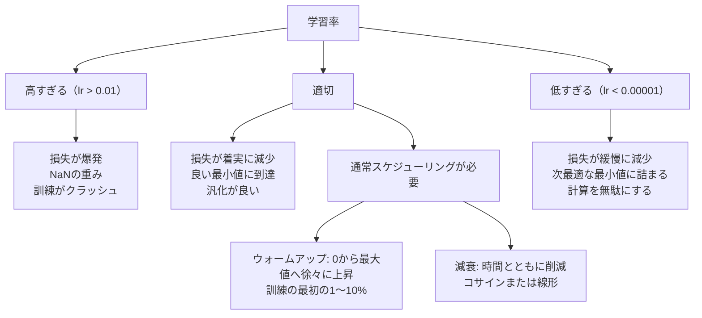
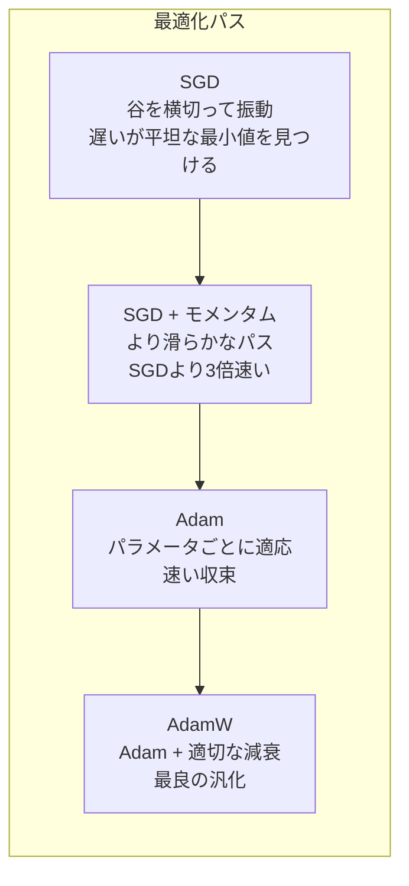
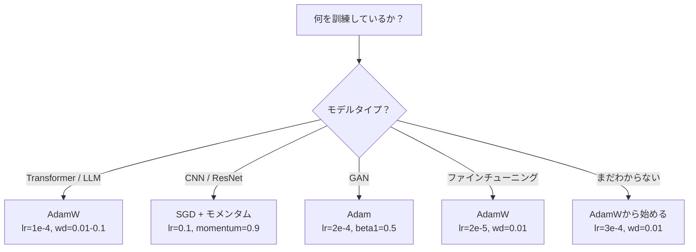

# オプティマイザ

> 勾配降下法はどの方向に動くべきかを教える。どれだけ、どれくらい速くについては何も言わない。SGDはコンパスだ。AdamはGPSにトラフィックデータを加えたものだ。


## 学習目標

- SGD、モメンタム付きSGD、Adam、AdamWオプティマイザをPythonでゼロから実装する
- Adamのバイアス補正が、訓練初期ステップでのゼロ初期化されたモーメント推定を補償する方法を説明する
- AdamWが同じタスクでL2正則化付きAdamより良い汎化を生み出す理由を実証する
- Transformer、CNN、GAN、ファインチューニングに対して適切なオプティマイザとデフォルトのハイパーパラメータを選択する

## 問題設定

勾配を計算した。重み#4,721が損失を減らすために0.003だけ減少すべきことがわかった。しかし、どんな単位の0.003なのか？何でスケールするのか？そして、ステップ1とステップ1,000で同じ量移動すべきなのか？

バニラ勾配降下法はすべてのパラメータに毎ステップ同じ学習率を適用する: w = w - lr * gradient。これは実際にニューラルネットワークの訓練を辛いものにする3つの問題を生む。

第一は振動だ。損失の景観は滑らかなボウルのような形をほぼしていない。長い狭い谷のようなものだ。勾配は谷に沿った方向（浅い方向）ではなく、谷を横切る方向（急な方向）を向いている。勾配降下法は有用な方向に少しずつ進みながら、狭い次元を行ったり来たりする。よく見られる現象: 損失が速く下がってからプラトーになる。モデルが収束したからではなく、振動しているからだ。

第二は、すべてのパラメータに1つの学習率は間違っているということだ。大きな更新が必要な重みもある（まだアンダーフィットの段階）。小さな更新しか必要ない重みもある（最適値付近）。前者に機能する学習率は後者を破壊し、逆も同様だ。

第三はサドル点だ。高次元では、損失の景観に勾配がほぼゼロの広大な平坦な領域がある。バニラSGDはこれらを勾配の速度で（実質ゼロで）通過する。モデルがスタックしているように見える。スタックしているわけではなく、反対側に有用な降下がある平坦な領域にいるだけだ。しかしSGDには突き抜けるメカニズムがない。

Adamはこの3つすべてを解決する。パラメータごとに2つの移動平均を保持する。平均勾配（モメンタム、振動に対処）と平均二乗勾配（適応レート、異なるスケールに対処）だ。最初の数ステップのバイアス補正と組み合わせると、デフォルトのハイパーパラメータで80%の問題に機能する単一のオプティマイザが得られる。残りの20%でいつなぜ失敗するかを正確に理解するために、このレッスンでゼロから構築する。

## 概念

### 確率的勾配降下法（SGD）

最もシンプルなオプティマイザ。ミニバッチで勾配を計算し、反対方向にステップする。

```
w = w - lr * gradient
```

「確率的」は、完全なデータセットではなく、ランダムなサブセット（ミニバッチ）を使って勾配を推定することを意味する。このノイズは実際には有用だ。鋭い局所最小値からの脱出を助ける。しかしノイズは振動も引き起こす。

学習率が唯一のノブだ。高すぎると損失が発散する。低すぎると訓練が永遠にかかる。最適値はアーキテクチャ、データ、バッチサイズ、訓練の現在の段階に依存する。現代のネットワークでのバニラSGDでは、一般的な値は0.01から0.1の範囲だ。しかし単一の訓練実行でも、理想的な学習率は変化する。

### モメンタム

ボールが丘を転がり落ちるアナロジーは使い古されているが正確だ。勾配だけでステップするのではなく、過去の勾配を蓄積する速度を保持する。

```
m_t = beta * m_{t-1} + gradient
w = w - lr * m_t
```

ベータ（通常0.9）は保持する履歴の量を制御する。beta = 0.9では、モメンタムは大まかに過去10勾配の平均（1 / (1 - 0.9) = 10）だ。

なぜこれが振動を修正するか: 同じ方向を向く勾配が蓄積される。方向が反転する勾配はキャンセルされる。狭い谷では、「横切る」成分が各ステップで符号を反転してダンピングされる。「沿う」成分は一貫していて増幅される。結果は有用な方向への滑らかな加速だ。

実際の数値: 条件が悪い損失の景観で、単独SGDは10,000ステップかかるかもしれない。モメンタム付きSGD（beta=0.9）は同じ問題で通常3,000〜5,000ステップかかる。高速化は小さくない。

### RMSProp

実際に機能した最初のパラメータごとの適応学習率手法だ。HintonがCourseraの講義で提案した（正式には発表されていない）。

```
s_t = beta * s_{t-1} + (1 - beta) * gradient^2
w = w - lr * gradient / (sqrt(s_t) + epsilon)
```

s_tは二乗勾配の移動平均を追跡する。一貫して大きな勾配を持つパラメータは大きな数で割られる（有効学習率が小さい）。小さな勾配を持つパラメータは小さな数で割られる（有効学習率が大きい）。

これが「すべてのパラメータに1つの学習率」問題を解決する。すでに大きな更新を受けている重みはおそらくターゲット付近にある。遅らせる。小さな更新しか受けていない重みは不十分に訓練されているかもしれない。速める。

イプシロン（通常1e-8）はパラメータが更新されていないときのゼロ除算を防ぐ。

### Adam: モメンタム + RMSProp

Adamは両方のアイデアを組み合わせる。パラメータごとに2つの指数移動平均を保持する:

```
m_t = beta1 * m_{t-1} + (1 - beta1) * gradient        (一次モーメント: 平均)
v_t = beta2 * v_{t-1} + (1 - beta2) * gradient^2       (二次モーメント: 分散)
```

**バイアス補正**は、ほとんどの解説が省略する重要な詳細だ。ステップ1では、m_1 = (1 - beta1) * gradient。beta1 = 0.9では、それは0.1 * gradient、10倍小さすぎる。移動平均がウォームアップしていない。バイアス補正がこれを補償する:

```
m_hat = m_t / (1 - beta1^t)
v_hat = v_t / (1 - beta2^t)
```

beta1 = 0.9のステップ1で: m_hat = m_1 / (1 - 0.9) = m_1 / 0.1 = 実際の勾配。ステップ100では: (1 - 0.9^100)はほぼ1.0なので、補正は消える。バイアス補正は最初の約10ステップで重要で、約50ステップ後には無関係になる。

更新式:

```
w = w - lr * m_hat / (sqrt(v_hat) + epsilon)
```

Adamのデフォルト: lr = 0.001、beta1 = 0.9、beta2 = 0.999、epsilon = 1e-8。これらのデフォルトは80%の問題に機能する。機能しないとき、まずlrを変える。次にbeta2を変える。beta1やepsilonはほとんど変えない。

### AdamW: 正しいウェイト減衰

L2正則化は損失にlambda * w^2を加える。バニラSGDでは、これはウェイト減衰（各ステップで重みからlambda * wを引く）と等価だ。Adamではこの等価性が崩れる。

Loshchilov & Hutter の洞察: L2を損失に追加してAdamが勾配を処理すると、適応学習率が正則化項もスケールする。大きな勾配分散を持つパラメータは正則化が少なくなる。小さな分散を持つパラメータは正則化が多くなる。これは望んでいるものではない。勾配統計に関係なく均一な正則化が欲しい。

AdamWはAdamの更新後に直接重みにウェイト減衰を適用することでこれを修正する:

```
w = w - lr * m_hat / (sqrt(v_hat) + epsilon) - lr * lambda * w
```

ウェイト減衰項（lr * lambda * w）はAdamの適応係数でスケールされない。すべてのパラメータが同じ比例的な縮小を得る。

これは細かい詳細のように見える。そうではない。AdamWはほぼすべてのタスクでAdam + L2正則化より良い解に収束する。これはTransformer、拡散モデル、ほとんどの現代アーキテクチャの訓練においてPyTorchのデフォルトオプティマイザだ。BERT、GPT、LLaMA、Stable Diffusion、すべてAdamWで訓練された。

### 学習率: 最も重要なハイパーパラメータ



1つのハイパーパラメータを調整するなら、学習率を調整する。学習率の10倍変化は、どんなアーキテクチャの決定よりも重要だ。一般的なデフォルト:

- SGD: lr = 0.01〜0.1
- Adam/AdamW: lr = 1e-4〜3e-4
- 事前訓練モデルのファインチューニング: lr = 1e-5〜5e-5
- 学習率ウォームアップ: 最初の1〜10%のステップで線形ランプ

### オプティマイザの比較



### 各オプティマイザが勝つとき



## 実装

### ステップ1: バニラSGD

```python
class SGD:
    def __init__(self, lr=0.01):
        self.lr = lr

    def step(self, params, grads):
        for i in range(len(params)):
            params[i] -= self.lr * grads[i]
```

### ステップ2: モメンタム付きSGD

```python
class SGDMomentum:
    def __init__(self, lr=0.01, beta=0.9):
        self.lr = lr
        self.beta = beta
        self.velocities = None

    def step(self, params, grads):
        if self.velocities is None:
            self.velocities = [0.0] * len(params)
        for i in range(len(params)):
            self.velocities[i] = self.beta * self.velocities[i] + grads[i]
            params[i] -= self.lr * self.velocities[i]
```

### ステップ3: Adam

```python
import math

class Adam:
    def __init__(self, lr=0.001, beta1=0.9, beta2=0.999, epsilon=1e-8):
        self.lr = lr
        self.beta1 = beta1
        self.beta2 = beta2
        self.epsilon = epsilon
        self.m = None
        self.v = None
        self.t = 0

    def step(self, params, grads):
        if self.m is None:
            self.m = [0.0] * len(params)
            self.v = [0.0] * len(params)

        self.t += 1

        for i in range(len(params)):
            self.m[i] = self.beta1 * self.m[i] + (1 - self.beta1) * grads[i]
            self.v[i] = self.beta2 * self.v[i] + (1 - self.beta2) * grads[i] ** 2

            m_hat = self.m[i] / (1 - self.beta1 ** self.t)
            v_hat = self.v[i] / (1 - self.beta2 ** self.t)

            params[i] -= self.lr * m_hat / (math.sqrt(v_hat) + self.epsilon)
```

### ステップ4: AdamW

```python
class AdamW:
    def __init__(self, lr=0.001, beta1=0.9, beta2=0.999, epsilon=1e-8, weight_decay=0.01):
        self.lr = lr
        self.beta1 = beta1
        self.beta2 = beta2
        self.epsilon = epsilon
        self.weight_decay = weight_decay
        self.m = None
        self.v = None
        self.t = 0

    def step(self, params, grads):
        if self.m is None:
            self.m = [0.0] * len(params)
            self.v = [0.0] * len(params)

        self.t += 1

        for i in range(len(params)):
            self.m[i] = self.beta1 * self.m[i] + (1 - self.beta1) * grads[i]
            self.v[i] = self.beta2 * self.v[i] + (1 - self.beta2) * grads[i] ** 2

            m_hat = self.m[i] / (1 - self.beta1 ** self.t)
            v_hat = self.v[i] / (1 - self.beta2 ** self.t)

            params[i] -= self.lr * m_hat / (math.sqrt(v_hat) + self.epsilon)
            params[i] -= self.lr * self.weight_decay * params[i]
```

### ステップ5: 訓練比較

レッスン05の円データセットに4つのオプティマイザすべてで同じ2層ネットワークを訓練する。収束を比較する。

```python
import random

def sigmoid(x):
    x = max(-500, min(500, x))
    return 1.0 / (1.0 + math.exp(-x))

def make_circle_data(n=200, seed=42):
    random.seed(seed)
    data = []
    for _ in range(n):
        x = random.uniform(-2, 2)
        y = random.uniform(-2, 2)
        label = 1.0 if x * x + y * y < 1.5 else 0.0
        data.append(([x, y], label))
    return data


class OptimizerTestNetwork:
    def __init__(self, optimizer, hidden_size=8):
        random.seed(0)
        self.hidden_size = hidden_size
        self.optimizer = optimizer

        self.w1 = [[random.gauss(0, 0.5) for _ in range(2)] for _ in range(hidden_size)]
        self.b1 = [0.0] * hidden_size
        self.w2 = [random.gauss(0, 0.5) for _ in range(hidden_size)]
        self.b2 = 0.0

    def get_params(self):
        params = []
        for row in self.w1:
            params.extend(row)
        params.extend(self.b1)
        params.extend(self.w2)
        params.append(self.b2)
        return params

    def set_params(self, params):
        idx = 0
        for i in range(self.hidden_size):
            for j in range(2):
                self.w1[i][j] = params[idx]
                idx += 1
        for i in range(self.hidden_size):
            self.b1[i] = params[idx]
            idx += 1
        for i in range(self.hidden_size):
            self.w2[i] = params[idx]
            idx += 1
        self.b2 = params[idx]

    def forward(self, x):
        self.x = x
        self.z1 = []
        self.h = []
        for i in range(self.hidden_size):
            z = self.w1[i][0] * x[0] + self.w1[i][1] * x[1] + self.b1[i]
            self.z1.append(z)
            self.h.append(max(0.0, z))

        self.z2 = sum(self.w2[i] * self.h[i] for i in range(self.hidden_size)) + self.b2
        self.out = sigmoid(self.z2)
        return self.out

    def compute_grads(self, target):
        eps = 1e-15
        p = max(eps, min(1 - eps, self.out))
        d_loss = -(target / p) + (1 - target) / (1 - p)
        d_sigmoid = self.out * (1 - self.out)
        d_out = d_loss * d_sigmoid

        grads = [0.0] * (self.hidden_size * 2 + self.hidden_size + self.hidden_size + 1)
        idx = 0
        for i in range(self.hidden_size):
            d_relu = 1.0 if self.z1[i] > 0 else 0.0
            d_h = d_out * self.w2[i] * d_relu
            grads[idx] = d_h * self.x[0]
            grads[idx + 1] = d_h * self.x[1]
            idx += 2

        for i in range(self.hidden_size):
            d_relu = 1.0 if self.z1[i] > 0 else 0.0
            grads[idx] = d_out * self.w2[i] * d_relu
            idx += 1

        for i in range(self.hidden_size):
            grads[idx] = d_out * self.h[i]
            idx += 1

        grads[idx] = d_out
        return grads

    def train(self, data, epochs=300):
        losses = []
        for epoch in range(epochs):
            total_loss = 0.0
            correct = 0
            for x, y in data:
                pred = self.forward(x)
                grads = self.compute_grads(y)
                params = self.get_params()
                self.optimizer.step(params, grads)
                self.set_params(params)

                eps = 1e-15
                p = max(eps, min(1 - eps, pred))
                total_loss += -(y * math.log(p) + (1 - y) * math.log(1 - p))
                if (pred >= 0.5) == (y >= 0.5):
                    correct += 1
            avg_loss = total_loss / len(data)
            accuracy = correct / len(data) * 100
            losses.append((avg_loss, accuracy))
            if epoch % 75 == 0 or epoch == epochs - 1:
                print(f"    エポック {epoch:3d}: 損失={avg_loss:.4f}, 精度={accuracy:.1f}%")
        return losses
```

## 実用例

PyTorchのオプティマイザはパラメータグループ、勾配クリッピング、学習率スケジューリングを扱う:

```python
import torch
import torch.optim as optim

model = torch.nn.Sequential(
    torch.nn.Linear(784, 256),
    torch.nn.ReLU(),
    torch.nn.Linear(256, 10),
)

optimizer = optim.AdamW(model.parameters(), lr=3e-4, weight_decay=0.01)

scheduler = optim.lr_scheduler.CosineAnnealingLR(optimizer, T_max=100)

for epoch in range(100):
    optimizer.zero_grad()
    output = model(torch.randn(32, 784))
    loss = torch.nn.functional.cross_entropy(output, torch.randint(0, 10, (32,)))
    loss.backward()
    torch.nn.utils.clip_grad_norm_(model.parameters(), max_norm=1.0)
    optimizer.step()
    scheduler.step()
```

パターンは常に: zero_grad、forward、loss、backward、（clip）、step、（schedule）だ。この順序を暗記する。間違えること（例えばoptimizer.step()の前にscheduler.step()を呼ぶ）は微妙なバグのよくある原因だ。

CNNでは、多くの実践者は今でもステップまたはコサインスケジュール付きのSGD + モメンタム（lr=0.1、momentum=0.9、weight_decay=1e-4）を好む。SGDはより平坦な最小値を見つけ、多くの場合汎化が良い。TransformerとLLMでは、ウォームアップ + コサイン減衰付きAdamWが普遍的なデフォルトだ。測定された理由なしに合意に逆らわない。

## 成果物

このレッスンの成果物:
- `outputs/prompt-optimizer-selector.md` -- 任意のアーキテクチャに対して正しいオプティマイザと学習率を選ぶための決定プロンプト

## 演習

1. Nesterovモメンタムを実装する。現在の位置ではなく「先読み」位置（w - lr * beta * v）で勾配を計算する。円データセットで標準モメンタムと収束を比較する。

2. 学習率ウォームアップスケジュールを実装する。訓練ステップの最初の10%で0からmax_lrへ線形ランプし、次にコサイン減衰で0まで下げる。Adam + ウォームアップ vs ウォームアップなしのAdamで訓練する。円データセットで90%精度に到達するのに何エポックかかるかを測定する。

3. Adam訓練中に各パラメータの有効学習率を追跡する。有効レートはlr * m_hat / (sqrt(v_hat) + eps)だ。10、50、200ステップ後の有効レートの分布をプロットする。すべてのパラメータが同じ速度で更新されているか？

4. 勾配クリッピング（グローバルノームによるクリップ）を実装する。最大勾配ノームを1.0に設定する。高い学習率（Adamでlr=0.01）でクリッピングありとなしで訓練する。10個のランダムシードにわたって、クリッピングありとなしで損失がNaNになる（発散する）実行の数を数える。

5. 大きな重みを持つネットワークでAdam vs AdamWを比較する。すべての重みを[-5, 5]のランダムな値に初期化する（通常より大幅に大きい）。weight_decay=0.1で200エポック訓練する。両方のオプティマイザの訓練経過とともに重みのL2ノルムをプロットする。AdamWはより速い重みの縮小を示すはずだ。

## 重要用語

| 用語 | よく言われること | 実際の意味 |
|------|----------------|----------------------|
| 学習率 | 「ステップサイズ」 | 勾配更新のスカラー乗数。訓練で最も影響力のある単一のハイパーパラメータ |
| SGD | 「基本的な勾配降下法」 | 確率的勾配降下法: ミニバッチで計算した勾配を使ってlr * gradientを引いて重みを更新する |
| モメンタム | 「転がるボールのアナロジー」 | 過去の勾配の指数移動平均。振動を和らげ一貫した方向を加速する |
| RMSProp | 「適応学習率」 | 各パラメータの勾配を最近の勾配の二乗平均の平方根で割る。学習率を均等化する |
| Adam | 「デフォルトのオプティマイザ」 | モメンタム（一次モーメント）とRMSProp（二次モーメント）を初期ステップのバイアス補正と組み合わせる |
| AdamW | 「正しいAdam」 | 分離されたウェイト減衰を持つAdam。勾配を通してではなく直接重みに正則化を適用する |
| バイアス補正 | 「移動平均のウォームアップ」 | (1 - beta^t)で割ることでAdamのモーメント推定のゼロ初期化を補償する |
| ウェイト減衰 | 「重みを縮める」 | 各ステップで重みの値の一部を引く。大きな重みにペナルティを与える正則化器 |
| 学習率スケジュール | 「時間とともにlrを変える」 | 訓練中に学習率を調整する関数。ウォームアップ + コサイン減衰が現代のデフォルト |
| 勾配クリッピング | 「勾配ノームの上限」 | 勾配ベクトルのノームが閾値を超えたときにスケールダウンする。勾配の爆発的更新を防ぐ |

## 参考文献

- Kingma & Ba, "Adam: A Method for Stochastic Optimization" (2014) -- 元のAdamの論文、収束分析とバイアス補正の導出
- Loshchilov & Hutter, "Decoupled Weight Decay Regularization" (2017) -- L2正則化とウェイト減衰がAdamでは等価でないことを証明し、AdamWを提案
- Smith, "Cyclical Learning Rates for Training Neural Networks" (2017) -- LRレンジテストとサイクリカルスケジュールを導入。固定学習率の調整の必要性を排除
- Ruder, "An Overview of Gradient Descent Optimization Algorithms" (2016) -- すべてのオプティマイザ変種の最良の単一サーベイ、明確な比較と直感付き
